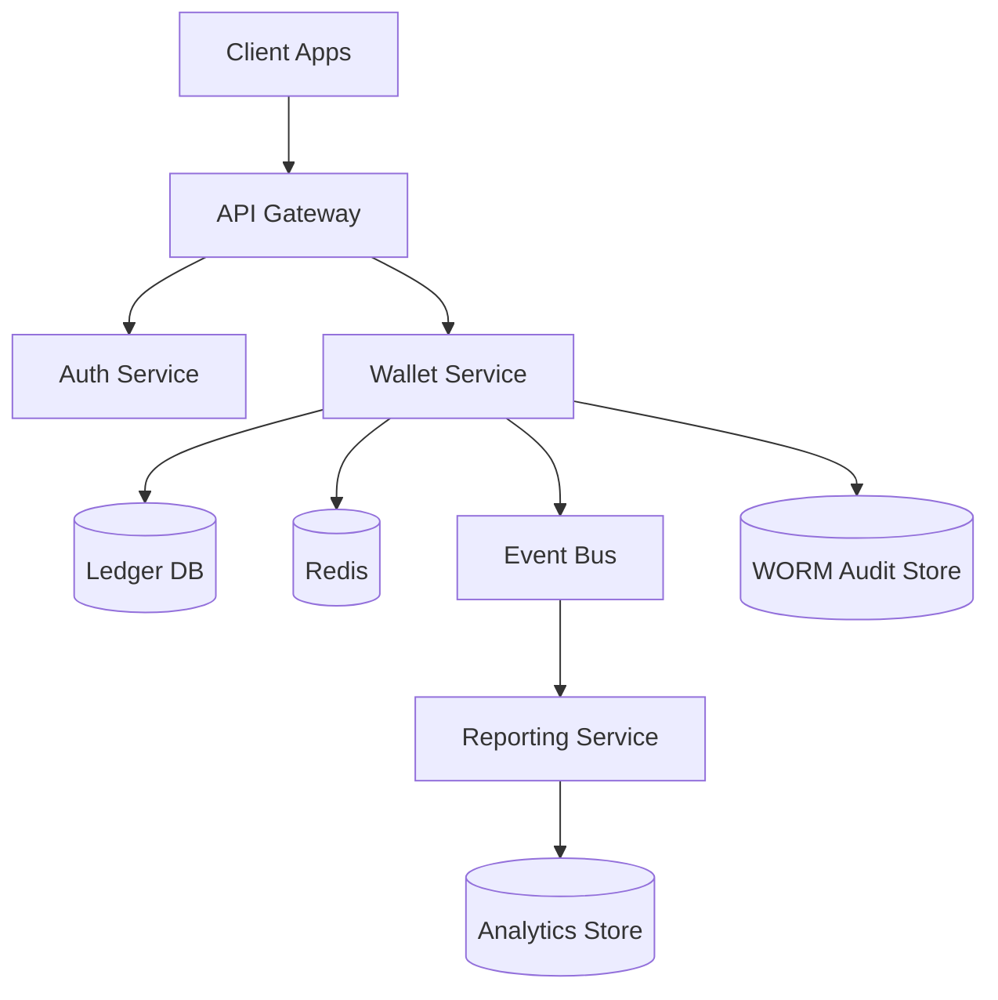
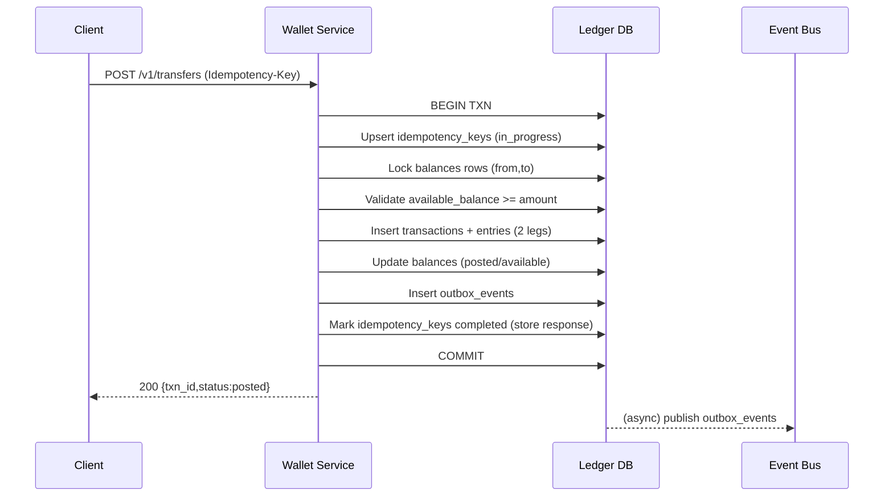

## Overview

A digital wallet ledger must maintain correct user balances while supporting high-throughput peer-to-peer transfers, preventing double-spends, and producing an immutable audit trail suitable for investigations and compliance. The core challenge is that “balance” is not just a number—it is the result of an ordered set of atomic value movements that must be recorded exactly once, never partially applied, and always explainable after the fact.

The key insight is to treat the ledger as the source of truth using **double-entry accounting** with an **append-only journal**: every transfer produces balanced debit/credit entries that atomically post in a strongly consistent datastore. “Balances” become derived, materialized views over these entries for fast reads, while auditability is achieved via immutable storage plus tamper-evident chaining.

## Requirements

### Functional Requirements
- Create and manage wallet accounts per user and currency.
- Support peer-to-peer transfers with atomic debit/credit posting.
- Prevent double-spend and overdraft (unless explicitly allowed via credit line).
- Provide transaction history and downloadable statements.
- Support idempotent transfer submission (safe retries from clients).
- Support holds/reservations (e.g., pending card authorization) and capture/release.
- Support admin operations: adjustments, reversals, and account freezing.
- Provide audit trails and reconciliation reports.

### Non-Functional Requirements
- **Scale**: 10M users, 50M accounts (multi-currency), peak 5K transfers/sec, 50K balance reads/sec, 200K statement reads/day, ledger growth 5–10B entries/year.
- **Latency**: Balance read P50 20ms / P99 100ms; transfer submit P50 60ms / P99 200ms (in-region).
- **Availability**: 99.99% for transfers and balance reads; 99.9% acceptable for statements/reporting.
- **Consistency**: Strong consistency for posting transfers, holds, and balance reads that follow writes; eventual consistency acceptable for analytics and aggregated reports.
- **Durability**: RPO 0 for posted ledger entries; no loss of committed transactions.

### Constraints & Assumptions
- Single legal entity wallet (not a full bank core), but must be audit-ready.
- Monetary amounts stored as integer minor units (e.g., cents) with currency-specific exponent.
- Team can operate distributed SQL + Kafka; budget supports multi-region database.
- Compliance scope may include SOC2; PII encrypted at rest; strict access controls for audit data.

## High-Level Architecture



The **Wallet Service** owns all money movement and invariants (no overdraft, double-entry balancing, idempotency). It writes to a **strongly consistent Ledger DB** using ACID transactions, and publishes domain events via an **outbox pattern** to an **Event Bus** for downstream reporting and notifications without coupling them to the critical path.

A separate **Reporting Service** builds statements and analytics in an eventually consistent store, keeping the ledger path fast and correct. A **WORM Audit Store** (write-once, read-many) retains immutable journal exports and tamper-evident hashes for forensic investigations.

## Component Deep-Dive

### API Gateway
**Responsibility**: Request routing, rate limiting, TLS termination, and request authentication enforcement.

**Key Design Decisions**:
- Use global rate limits and per-user throttles to protect the ledger from abusive retry storms.
- Require idempotency keys on mutating endpoints to support safe retries.

**Technology Choice**: Envoy / NGINX + managed API gateway features (rate limiting, WAF).

**Scaling Strategy**: Stateless horizontal scaling behind L7 load balancers.

### Auth Service
**Responsibility**: User identity verification, token validation, and authorization claims (scopes, roles).

**Key Design Decisions**:
- Use short-lived access tokens (JWT/PASETO) and rotate signing keys.
- Enforce step-up auth for sensitive operations (high-value transfers, device changes).

**Technology Choice**: OIDC-compliant provider (Auth0/Keycloak) + internal policy engine (OPA) as needed.

**Scaling Strategy**: Stateless; cache JWKs and introspection results; multi-region.

### Wallet Service
**Responsibility**: Holds, transfers, adjustments, balance reads, and ledger invariants.

**Key Design Decisions**:
- **Double-entry journal**: every value movement posts as balanced entries (sum of legs = 0), enabling auditability and reconciliation.
- **Idempotent command processing**: client-supplied idempotency keys dedupe retries and ensure “exactly-once effect” at the API boundary.
- **Materialized balances**: maintain a per-account balance table updated in the same DB transaction as journal entries for fast reads.

**Technology Choice**: Go/Java/Kotlin service with gRPC internally; REST externally.

**Scaling Strategy**: Stateless compute; partition-aware routing by `account_id` for locality; backpressure under contention.

### Ledger DB (Source of Truth)
**Responsibility**: Store accounts, transactions, journal entries, idempotency records, and balance materializations with strong consistency.

**Key Design Decisions**:
- Use a database that supports distributed ACID transactions and strong consistency (needed for cross-account transfers).
- Enforce invariants with constraints (unique idempotency keys, non-negative available balance, balanced journal entries per transaction).

**Technology Choice**: Google Spanner / CockroachDB / YugabyteDB (or single-region Postgres for smaller scale).

**Scaling Strategy**: Partition by `account_id`; use secondary indexes for history queries; read replicas for non-critical reads if supported.

### Event Bus + Reporting
**Responsibility**: Asynchronous propagation for statements, notifications, AML/risk, and analytics.

**Key Design Decisions**:
- Use transactional outbox to avoid publishing events that don’t correspond to committed ledger state.
- Reporting builds statements from immutable ledger events, not from mutable balance tables.

**Technology Choice**: Kafka/PubSub + stream processor (Flink/Kafka Streams) + analytics store (BigQuery/Snowflake/ClickHouse).

**Scaling Strategy**: Partition by `account_id` for ordered consumption; scale consumers independently of the ledger path.

## Data Model

### Storage Schema

**accounts**
- `account_id` (UUID, PK)
- `user_id` (UUID, indexed)
- `currency` (CHAR(3))
- `status` (ENUM: active,frozen,closed)
- `created_at` (TIMESTAMP)

**balances** (materialized view)
- `account_id` (UUID, PK, FK accounts)
- `posted_balance_minor` (BIGINT) — sum of posted entries
- `held_balance_minor` (BIGINT) — active holds
- `available_balance_minor` (BIGINT) — `posted - held` (or stored + constrained)
- `updated_at` (TIMESTAMP)
- Constraint: `available_balance_minor >= 0` (if no overdraft)

**transactions**
- `txn_id` (UUID, PK)
- `type` (ENUM: p2p,hold,release,adjust,reversal)
- `status` (ENUM: pending,posted,voided)
- `request_id` (STRING, unique per client/app) — idempotency key
- `created_at` (TIMESTAMP)
- `metadata` (JSONB)

**entries** (append-only journal lines)
- `entry_id` (UUID, PK)
- `txn_id` (UUID, indexed)
- `account_id` (UUID, indexed)
- `direction` (ENUM: debit,credit)
- `amount_minor` (BIGINT, >0)
- `currency` (CHAR(3))
- `posted_at` (TIMESTAMP)
- `running_hash` (BYTES) — hash chain for tamper evidence (optional but recommended)

Invariant: for each `txn_id`, sum(credits) == sum(debits) in the same currency.

**idempotency_keys**
- `key` (STRING, PK)
- `scope` (STRING) — e.g., `user_id:client_id:endpoint`
- `request_hash` (BYTES)
- `response_blob` (BYTES) — cached canonical response
- `status` (ENUM: in_progress,completed)
- `created_at`, `expires_at`

**outbox_events**
- `event_id` (UUID, PK)
- `aggregate_id` (UUID) — e.g., `account_id`
- `type` (STRING)
- `payload` (JSON)
- `created_at`
- `published_at` (nullable)

### Data Flow



## API Design

### Create Transfer
`POST /v1/transfers`

Headers:
- `Idempotency-Key: <uuid-or-random-string>` (required)
- `Authorization: Bearer <token>`

Request:
```json
{
  "from_account_id": "uuid",
  "to_account_id": "uuid",
  "amount_minor": 2500,
  "currency": "USD",
  "client_reference": "string",
  "metadata": {"note": "rent"}
}
```

Response (posted):
```json
{
  "txn_id": "uuid",
  "status": "posted",
  "posted_at": "2025-12-17T12:34:56Z"
}
```

Errors:
- `400 invalid_argument` (currency mismatch, amount <= 0)
- `401 unauthenticated`
- `403 forbidden` (account not owned / not permitted)
- `409 conflict` (idempotency key reuse with different payload)
- `409 insufficient_funds`
- `423 locked` (account frozen)
- `429 rate_limited`
- `500/503` transient errors (safe to retry with same idempotency key)

Idempotency:
- Store canonical response keyed by `(scope, Idempotency-Key)`; if repeated with identical request hash, return stored response.

### Get Balance
`GET /v1/accounts/{account_id}/balance`

Response:
```json
{
  "account_id": "uuid",
  "currency": "USD",
  "posted_balance_minor": 100000,
  "held_balance_minor": 5000,
  "available_balance_minor": 95000,
  "as_of": "2025-12-17T12:35:01Z"
}
```

Consistency:
- Reads from `balances` table in the same strongly consistent DB; optionally support `?consistency=strong|bounded_stale`.

### List Transactions
`GET /v1/accounts/{account_id}/transactions?limit=50&cursor=...`

Response includes `txn_id`, `type`, `amount_minor`, `direction` (from perspective of the account), `status`, timestamps, and metadata.

### Holds (optional but common)
- `POST /v1/holds` to place a hold (decrease available, increase held).
- `POST /v1/holds/{hold_id}/capture` to convert hold to posted debit.
- `POST /v1/holds/{hold_id}/release` to remove hold.

All hold mutations require idempotency keys.

## Scaling & Performance

### Bottleneck Analysis
- **Hot accounts** (many concurrent transfers) cause row-level contention on `balances`.
  - Mitigate with per-account serialization (lock ordering), adaptive rate limits, and queueing high-contention accounts.
- **History queries** can become index-heavy as `entries` grows.
  - Mitigate with time-partitioned tables, archival to analytics store, and statement materialization.
- **Distributed transaction overhead** for cross-partition transfers.
  - Mitigate via partition-aware routing, keeping account and balance rows co-located, and using a DB with optimized distributed commits.

### Horizontal Scaling
- **Gateway/Auth/Wallet**: Stateless; scale by CPU/QPS; autoscale with SLO-based policies.
- **Ledger DB**: Partition/shard by `account_id`; add nodes to increase throughput; keep secondary indexes minimal on write path.
- **Event bus/reporting**: Partition topics by `account_id` for ordered per-account streams; scale consumers horizontally.

Sharding/partitioning:
- Primary partition key: `account_id`.
- `entries` clustered by `(account_id, posted_at DESC)` for fast statement ranges.

### Caching Strategy
- Cache **non-authoritative** data only (exchange rates, user profile, auth introspection). Avoid caching balances as a source of truth.
- Optional short TTL (1–3s) cache for balance reads to absorb bursts, but always allow a strong read path for correctness-sensitive clients.
- Use cache-aside with explicit invalidation on posted events if caching balances at all.

## Trade-offs & Alternatives

### Key Trade-offs Made
- **Chosen**: Strongly consistent distributed SQL for ledger posting.
  - **Sacrificed**: Higher write latency and operational complexity vs eventual-consistent/event-sourced-only systems.
  - **Why**: Double-spend prevention and atomic cross-account transfers require strong correctness guarantees.
- **Chosen**: Double-entry append-only journal + materialized balances.
  - **Sacrificed**: Extra storage and write amplification (entries + balance updates).
  - **Why**: Auditability, reconciliation, and fast reads without recomputing balances from scratch.
- **Chosen**: Outbox + event bus for downstream consumers.
  - **Sacrificed**: More moving parts than direct synchronous calls.
  - **Why**: Preserves ledger correctness while enabling scalable reporting/notifications.

### Alternative Approaches
- **Pure event sourcing (Kafka as source of truth)**: Great for replayability, but hard to guarantee atomic multi-entity updates and low-latency strong reads without complex consensus/serialization layers.
- **Single-region Postgres with strict locking**: Simpler and cheaper; works up to moderate scale (hundreds of TPS). Not ideal for multi-region HA or sustained thousands of TPS with growth.
- **Two-phase async settlement**: Reserve funds locally then settle later; improves availability but introduces “pending” states and more complex user experience and reconciliation.

## Failure Modes & Mitigations

### Failure Scenarios
- **Scenario**: Client retries transfer due to timeout.
  - **Impact**: Duplicate debit/credit if not handled.
  - **Detection**: Duplicate request IDs, idempotency table hits.
  - **Mitigation**: Mandatory idempotency keys + request hashing + stored responses.
- **Scenario**: Partial publish to event bus (DB commit succeeded, event publish failed).
  - **Impact**: Missing statements/notifications, but ledger correct.
  - **Detection**: Outbox lag metrics, unpublished rows.
  - **Mitigation**: Transactional outbox with retrying publisher; alert on lag.
- **Scenario**: DB node/zone failure during posting.
  - **Impact**: Elevated latency or temporary unavailability.
  - **Detection**: Error rates, commit latency spikes, DB health checks.
  - **Mitigation**: Multi-zone quorum replication; automatic failover; client retries with idempotency.
- **Scenario**: Data corruption / tampering attempt.
  - **Impact**: Loss of trust in balances/audit.
  - **Detection**: Hash-chain verification failures; invariant checks (sum of entries vs balances).
  - **Mitigation**: Append-only permissions, WORM exports, hash chaining, least-privilege access, periodic reconciliation jobs.
- **Scenario**: Hot account contention leads to high tail latency.
  - **Impact**: P99 transfer latency breach for some users.
  - **Detection**: Lock wait metrics, per-account contention dashboards.
  - **Mitigation**: Per-account rate limits, queue/serialize transfers for hot accounts, degrade non-critical reads.

### Disaster Recovery
- **Targets**: RTO 30 minutes, RPO 0 for posted ledger entries.
- **Backup strategy**: Continuous point-in-time recovery + daily full backups; periodic restore drills.
- **Failover procedures**: Prefer multi-region strongly consistent DB configuration (or active-passive with rapid promotion). Freeze transfers during uncertain state; allow balance reads if safe; resume once ledger quorum is healthy.

## Operational Considerations

### Monitoring & Alerting
- Ledger: `transfer_success_rate`, `p99_post_latency`, `insufficient_funds_rate`, `idempotency_conflicts`, `db_lock_wait_p99`.
- Outbox: unpublished row count, publish lag, event bus consumer lag.
- Invariants: daily reconciliation mismatches, negative available balance violations (should be zero), unbalanced transaction detector.
- Security: anomalous transfer velocity per user, admin action audit logs, failed auth spikes.

### Deployment Strategy
- Use canary releases for Wallet Service with SLO-based rollback (error rate + p99 latency).
- Backward-compatible schema migrations (expand/contract), especially for ledger tables.
- Feature flags for new transaction types; shadow-write to reporting before switching reads.
- Rollback: application rollback is safe; DB rollbacks avoided by forward-only migrations and versioned readers.

## References & Further Reading
- Double-entry accounting overview: https://martinfowler.com/articles/accounting.html
- Transactional outbox pattern: https://microservices.io/patterns/data/transactional-outbox.html
- Designing data-intensive applications (transactions, logs, consistency): https://dataintensive.net/
- Spanner TrueTime and distributed transactions: https://cloud.google.com/spanner/docs/true-time-external-consistency
- Stripe engineering (payments reliability themes): https://stripe.com/blog/engineering