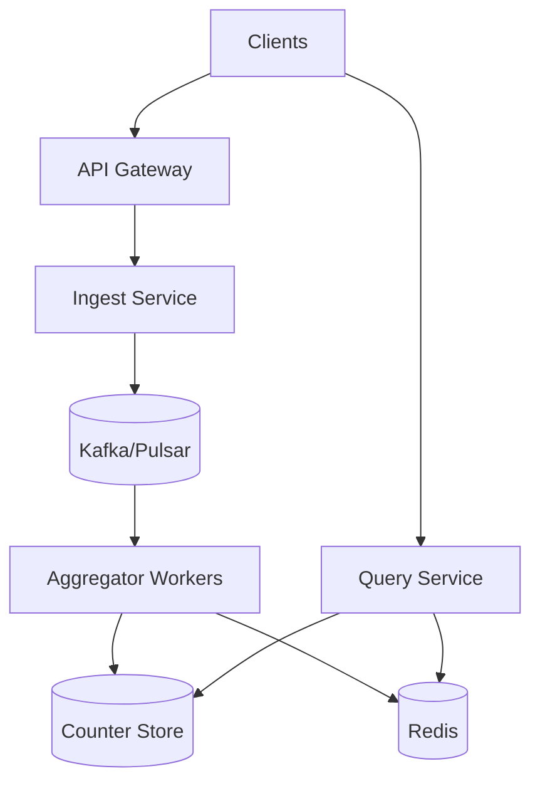
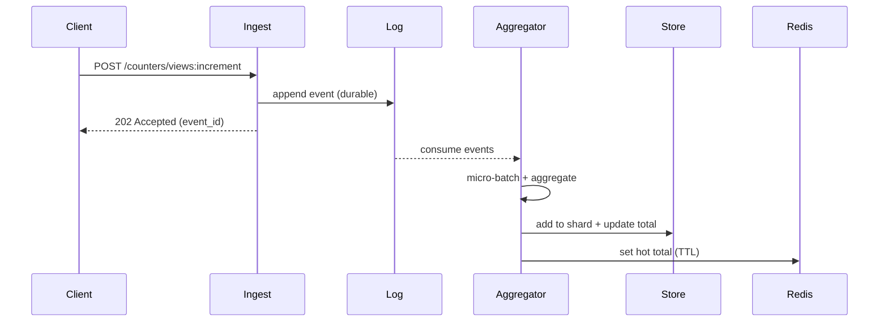

## Overview

A distributed counter service (likes, views) looks deceptively simple—“increment a number”—but becomes hard at scale because the hottest objects (viral posts, trending videos) create extreme write contention and hot partitions. Naively updating a single row per object turns your database into a global lock, and trying to make increments strongly consistent everywhere quickly becomes expensive and fragile across failures and regions.

The key insight is to decouple *ingestion* from *aggregation* and avoid contention by design: treat every increment as an event in an append-only log, aggregate asynchronously, and store counters in a sharded layout (and optionally time-bucketed) so no single storage key becomes a bottleneck. Reads serve from pre-aggregated totals + cache, accepting bounded staleness while ensuring convergence and auditability.

## Requirements

### Functional Requirements
- Increment view counters for arbitrary objects (post/video/comment) at very high throughput.
- Support like/unlike semantics with idempotency (no double-like from the same user).
- Read current counts for an object (views, likes), with bounded staleness.
- Support batch reads for feeds (e.g., 100 objects per request).
- Provide near-real-time updates (seconds) for hot objects.
- Provide backfill/recompute capabilities (replay from log) for correctness and incident recovery.
- Expose aggregation by time window (e.g., views per hour/day) for analytics/trending.

### Non-Functional Requirements
- **Scale**: 200M DAU; 50B views/day (~580K events/s avg), peak 5M events/s; 2B likes/day peak 200K events/s; 10M hot objects/day.
- **Latency**:
  - Increment ingest P50 5ms / P99 30ms (ack after durable log write).
  - Read counts P50 10ms / P99 80ms (from cache or pre-aggregated store).
  - Freshness: totals converge within 5s typical, 60s worst-case during incidents.
- **Availability**: 99.99% for reads, 99.9–99.99% for writes (depending on region strategy).
- **Consistency**: Eventual consistency for aggregated totals; per-user like state is strongly consistent per user-object (idempotent toggle).
- **Durability**: Views: tolerate ≤ 1 minute of loss in a regional disaster (optional). Likes: no silent loss (RPO ≈ 0 via replicated log).

### Constraints & Assumptions
- Multi-AZ deployment; optional multi-region (active-active reads, active-passive or active-active writes).
- Budget favors horizontal scaling with commodity nodes; avoid single-writer designs.
- Compliance: store minimal PII; user IDs are opaque; retention policies for raw events (e.g., 7–30 days).
- Team can operate Kafka/Pulsar + a NoSQL store (DynamoDB/Cassandra/Scylla) + Redis.

## High-Level Architecture



Writes go through an ingestion tier that validates requests and appends immutable counter events to a replicated log (the durability boundary). Stream aggregators consume events, accumulate them in-memory, and periodically flush deltas to a write-optimized counter store using a sharded key scheme (and optional time buckets). Reads are served by a query tier that hits Redis for hot totals and falls back to the counter store, optionally merging shard totals.

This structure is chosen because it (1) removes write contention from the primary database, (2) allows replay/backfill for correctness, and (3) supports independent scaling of ingestion, aggregation, and query paths while keeping operational blast radius small.

## Component Deep-Dive

### Ingest Service

**Responsibility**: Accept increment/like events, enforce basic validation, apply idempotency contracts, and append events to the log.

**Key Design Decisions**:
- **Durable-ack writes**: Acknowledge after the event is replicated in the log (not after DB update) to keep latency low and absorb bursts.
- **Separate semantics for views vs likes**: Views are additive; likes require per-user idempotent state (like/unlike) to avoid double counting.

**Technology Choice**: Stateless Go/Java service behind Envoy/Nginx; Kafka/Pulsar producer with idempotent/transactional producer enabled where supported.

**Scaling Strategy**: Horizontal autoscaling on CPU + producer backlog; partitioning by `object_id` (and `counter_type`) to spread load.

### Event Log (Kafka/Pulsar)

**Responsibility**: Source of truth for counter events; provides ordering per key, buffering, and replay.

**Key Design Decisions**:
- **Partition by `hash(counter_type, object_id)`**: Preserves per-object ordering (important for like/unlike) while scaling partitions.
- **Retention + compaction**: Keep raw events for replay (time-based retention). For like state events, optionally use compacted topic keyed by `(user_id, object_id)` for latest state.

**Technology Choice**: Kafka (mature ecosystem) or Pulsar (tiered storage, geo-replication). Replication factor 3 across AZs.

**Scaling Strategy**: Increase partitions for throughput; isolate hot topics (views vs likes) and set quotas to protect clusters.

### Aggregator Workers

**Responsibility**: Consume events, aggregate deltas, deduplicate when required, and flush to storage and cache.

**Key Design Decisions**:
- **Micro-batching**: Aggregate in memory for 100ms–1s windows to reduce write amplification.
- **Exactly-once *effect* via idempotent flush**: Use at-least-once consumption + idempotent writes (per batch checkpoint) to prevent double-apply on retries.

**Technology Choice**: Kafka Streams/Flink for managed state + checkpoints, or custom consumers with RocksDB state + periodic snapshots.

**Scaling Strategy**: Scale by consumer group size (partitions); shard in-memory maps by partition; apply backpressure when store latency rises.

### Counter Store

**Responsibility**: Persist sharded counters (and optionally time buckets) with high write throughput and predictable reads.

**Key Design Decisions**:
- **Sharded counters**: Store `N` shards per object to avoid hot partitions; aggregators choose shard deterministically (e.g., `hash(partition, object_id) % N`).
- **Materialized totals**: Maintain `counter_total` table updated asynchronously for fast reads; shard-sum is fallback or used for periodic reconciliation.

**Technology Choice**:
- DynamoDB (on-demand scaling, atomic adds) or Cassandra/Scylla (high write throughput, cost control).
- Redis for hot totals (write-through from aggregators).

**Scaling Strategy**: Partition keys distribute evenly; increase shard count for hottest object classes; multi-AZ replication.

### Query Service

**Responsibility**: Serve reads (single and batch), enforce freshness policy, and merge shard totals when necessary.

**Key Design Decisions**:
- **Cache-first**: Redis stores `object_id -> totals` with short TTL (5–30s) and update-on-flush from aggregators.
- **Batch APIs**: Reduce overhead for feed rendering (one request for many objects).

**Technology Choice**: Stateless service + Redis cluster; fallback to store; optional local in-process cache for ultra-hot keys.

**Scaling Strategy**: Horizontal; isolate read path from write path; rate limit abusive clients.

## Data Model

### Storage Schema

**1) `counter_shard` (durable, write-optimized)**
- `counter_type` (PK part, e.g., `views`, `likes`)
- `object_id` (PK part)
- `shard_id` (PK part, 0..N-1)
- `value` (bigint)
- `updated_at` (timestamp)

**2) `counter_total` (durable, read-optimized)**
- `counter_type` (PK part)
- `object_id` (PK part)
- `total_value` (bigint)
- `freshness_ts` (timestamp)
- `version` (monotonic, optional for debugging/reconciliation)

**3) `user_like_state` (for idempotent likes)**
- `user_id` (PK part)
- `object_id` (PK part)
- `liked` (bool)
- `updated_at` (timestamp)
- `request_id` (string, last applied idempotency key)

**4) `agg_checkpoint` (per consumer/partition)**
- `consumer_group`
- `topic`
- `partition`
- `last_committed_offset`
- `updated_at`

### Data Flow



- **Views**: event is additive; aggregator updates `counter_shard` and `counter_total`.
- **Likes**: ingest first updates `user_like_state` (idempotent) or writes a like-state event; aggregator converts state transitions into `+1/-1` deltas to counters.

## API Design

### Increment Views
`POST /v1/counters/views/{objectId}:increment`

Request:
```json
{
  "amount": 1,
  "viewerId": "optional",
  "idempotencyKey": "optional-string",
  "timestampMs": 1730000000000
}
```

Response (`202 Accepted`):
```json
{ "eventId": "evt_...", "acceptedAtMs": 1730000000123 }
```

Errors:
- `400` invalid object/type/amount
- `429` rate limited
- `503` log unavailable (retry with backoff)

Idempotency:
- If `idempotencyKey` provided, Ingest dedupes within a short window (e.g., 10 minutes) using Redis; otherwise views are treated as best-effort additive.

### Like / Unlike (Idempotent Toggle)
`PUT /v1/likes/{objectId}`

Request:
```json
{ "userId": "usr_...", "liked": true, "idempotencyKey": "req_..." }
```

Response (`200 OK`):
```json
{ "liked": true, "applied": true, "eventId": "evt_..." }
```

Notes:
- `applied=false` when the same state is already set (idempotent no-op).
- Like state write is the consistency boundary; counter update is eventual.

### Read Counts (Single)
`GET /v1/counters/{objectId}?types=views,likes`

Response:
```json
{
  "objectId": "obj_...",
  "counts": {
    "views": { "value": 12345, "asOfMs": 1730000005000 },
    "likes": { "value": 678, "asOfMs": 1730000004000 }
  }
}
```

### Read Counts (Batch)
`POST /v1/counters:batchGet`

Request:
```json
{ "objectIds": ["obj1", "obj2"], "types": ["views", "likes"] }
```

Response:
```json
{ "results": [ /* per object counts */ ] }
```

Error Handling Approach:
- Partial failures in batch return per-item errors with `status` and `message`.
- Retries are safe for write endpoints when `idempotencyKey` is used.

## Scaling & Performance

### Bottleneck Analysis
- **Hot objects**: Mitigated by sharded counters + cache materialization.
- **Log throughput**: Mitigated by partition scaling, compression (lz4/zstd), and batching producers.
- **Store write amplification**: Mitigated by micro-batching and writing deltas, not per-event updates.
- **Read fanout (shard sum)**: Mitigated by maintaining `counter_total` and caching it.

### Horizontal Scaling
- **Ingest**: scale stateless nodes; increase producer batches; partition key distribution.
- **Log**: scale partitions/brokers; isolate topics; multi-AZ replication.
- **Aggregators**: scale consumer instances with partitions; use stateful processing with checkpoints.
- **Store**: scale nodes/throughput units; ensure partition keys spread; tune compaction (Cassandra/Scylla).
- **Query**: scale stateless nodes; Redis cluster sharding.

Partitioning/Sharding Strategy:
- For `counter_shard`, shard count `N` by counter type + object popularity class (e.g., default 16, hot 128).
- Optionally add time buckets for views: `(counter_type, object_id, day_bucket, shard_id)` to support windowed queries and limit row growth.

### Caching Strategy
- **What**: `counter_total` per `(type, object_id)`; also batch results for feed pages (short-lived).
- **Where**: Redis cluster; optional in-process LRU for ultra-hot keys.
- **TTL**: 5–30s for totals; shorter for trending surfaces.
- **Invalidation**: Write-through from aggregators on flush; fallback TTL expiry prevents stale indefinitely. During incidents, allow serving slightly stale cache.

## Trade-offs & Alternatives

### Key Trade-offs Made
- **Chose** event log + async aggregation  
  **Sacrificed** immediate read-after-write consistency  
  **Why** it makes sense: removes contention, absorbs bursts, enables replay and correctness audits.

- **Chose** sharded counters + materialized totals  
  **Sacrificed** storage simplicity and added reconciliation complexity  
  **Why** it makes sense: avoids hot partitions while keeping reads fast.

- **Chose** strong per-user like state, eventual aggregated like count  
  **Sacrificed** perfectly synchronized UI count at the moment of click  
  **Why** it makes sense: correctness is anchored in user state; totals converge quickly without global locks.

### Alternative Approaches
- **Direct atomic counters in a single DB row (DynamoDB ADD / SQL UPDATE)**: simple but collapses under hot keys; expensive throttling/retries.
- **Redis-only counters with periodic dump**: fast but risky for durability and replay; requires careful persistence and can lose increments in crashes.
- **CRDT PN-Counters across regions**: great for active-active multi-region writes; adds metadata overhead and more complex reconciliation/compaction.

## Failure Modes & Mitigations

### Failure Scenarios
- **Scenario**: Kafka/Pulsar partition leader loss  
  **Impact**: write latency spikes or temporary write unavailability  
  **Detection**: producer error rates, under-replicated partitions, end-to-end ingest SLO burn  
  **Mitigation**: RF=3 across AZs, min.insync.replicas, client retries with jitter, regional failover if configured.

- **Scenario**: Aggregator crash / restart  
  **Impact**: delayed counter updates; potential double-apply if not idempotent  
  **Detection**: consumer lag, missing flush heartbeats  
  **Mitigation**: checkpoint offsets after successful flush; idempotent batch apply; replay on restart.

- **Scenario**: Counter store hotspot or partition imbalance  
  **Impact**: elevated write latency, backlog growth  
  **Detection**: store p99 latency, partition heatmaps, aggregator backpressure  
  **Mitigation**: increase shard count for hot objects, adaptive shard mapping, isolate hot tenants, autoscale throughput.

- **Scenario**: Redis outage  
  **Impact**: read latency increases; higher store load  
  **Detection**: cache hit rate drop, Redis errors  
  **Mitigation**: serve from `counter_total` store; circuit breaker; gradual cache warmup.

- **Scenario**: Data bug / bad deploy causing miscount  
  **Impact**: incorrect totals across many objects  
  **Detection**: anomaly detection vs historical baselines; reconciliation job diff  
  **Mitigation**: replay from log into a new versioned table; canary validation; fast rollback.

### Disaster Recovery
- **RTO/RPO**:
  - Single-AZ failure: RTO minutes, RPO 0 (multi-AZ replication).
  - Regional disaster: RTO 30–60 minutes; RPO 0 for likes (geo-replicated log) and configurable for views (0–60s depending on cost).
- **Backup strategy**: daily snapshots of counter tables; continuous backups where supported; log retained 7–30 days for replay.
- **Failover procedures**: promote secondary region log/cluster; switch DNS/traffic; rebuild caches; reconcile totals via replay.

## Operational Considerations

### Monitoring & Alerting
- Key metrics:
  - Ingest: request rate, P99 latency, 4xx/5xx, retry counts, dedupe hit rate.
  - Log: produce/consume throughput, under-replicated partitions, consumer lag, retention utilization.
  - Aggregators: flush latency, batch sizes, checkpoint age, state store size, error rate.
  - Store: write/read P99, throttles/timeouts, partition hotspots, replication health.
  - Query: cache hit rate, P99 latency, stale-asOf distribution.
- Alert thresholds:
  - Consumer lag > 30s (warn), > 120s (page).
  - Ingest 5xx > 0.5% for 5 minutes (page).
  - Store P99 write latency > 200ms for 10 minutes (page).

### Deployment Strategy
- Safe rollout: canary 1–5% traffic; shadow write/read validation for counters; feature flags for shard count changes.
- Rollback: revert services; if schema changes, use dual-write + backfill then cut over.
- Data migrations: versioned totals tables; run replay jobs from log; verify via sampled reconciliation before switching reads.

## References & Further Reading
- Kafka design and operational guidance: https://kafka.apache.org/documentation/
- Pulsar architecture and geo-replication: https://pulsar.apache.org/docs/
- Cassandra/Scylla data modeling for high write throughput: https://docs.datastax.com/ and https://docs.scylladb.com/
- DynamoDB atomic counters and partition key design: https://docs.aws.amazon.com/amazondynamodb/latest/developerguide/
- CRDT counters (PN-Counter) background: https://crdt.tech/ and “A comprehensive study of Convergent and Commutative Replicated Data Types”
- Real-world inspiration: “Streaming systems” (Tyson Condie et al.), Kafka Streams/Flink stateful processing patterns
