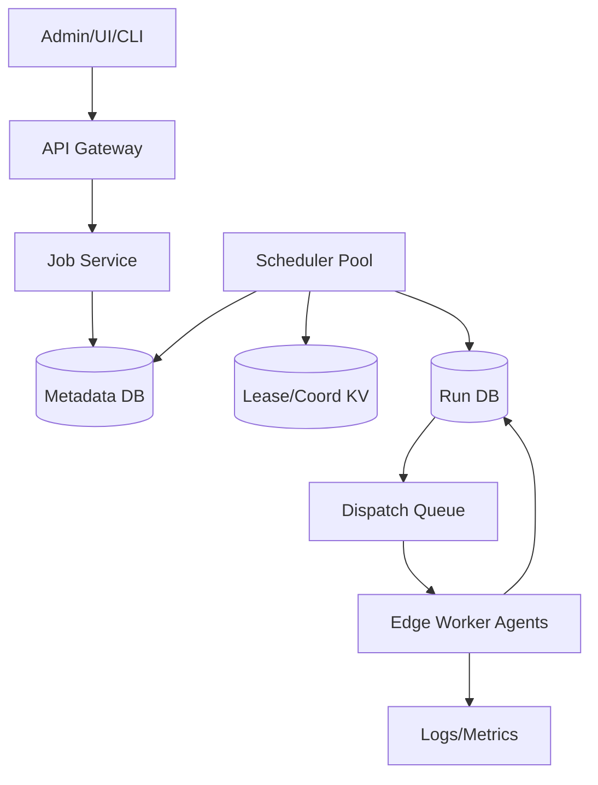
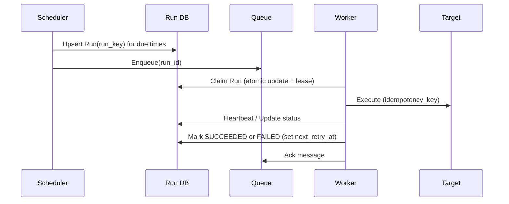

## Overview

A distributed cron system runs periodic jobs (e.g., “every minute”, “daily at 02:00”) across a fleet of nodes and must keep running even when the coordinating node (leader) crashes. The hard parts are not parsing cron strings—it’s reliably *deciding* which executions should happen, *ensuring they get dispatched*, and *preventing missed runs* or uncontrolled duplicates under failures, partitions, and clock skew.

The key insight is to separate **(1) schedule decision + durable run creation** from **(2) execution**, and to make both steps **idempotent**. Instead of a single in-memory leader “remembering” what’s due, the system persistently materializes each job execution as a **Run** record with a unique key, then workers claim runs via atomic operations with leases/heartbeats. Leadership becomes replaceable: if a leader dies mid-cycle, another instance can safely re-scan and continue because the source of truth is durable and the operations are repeatable.

This design targets IoT/edge realities: intermittent connectivity, high fan-out to gateways/devices, and the need to tolerate misfires and retries without human intervention.

## Requirements

### Functional Requirements
- Create/update/delete periodic jobs using cron or fixed-interval schedules (with timezone support).
- Assign jobs to targets (edge gateways, device groups, or logical regions) and control concurrency per target.
- Dispatch due executions reliably and record per-run status (pending/running/succeeded/failed).
- Guarantee that scheduled executions are not missed even if the current scheduler leader crashes.
- Support retries with backoff, max attempts, and dead-letter handling for repeatedly failing runs.
- Provide pause/resume, “run now”, and “catch-up / misfire policy” controls.
- Expose audit history and logs/metrics per job and per run.
- Support idempotency so duplicate dispatches do not cause duplicate side effects.

### Non-Functional Requirements
- **Scale**:
  - 1M edge nodes (gateways/agents), 100k active schedules
  - Peak due events: 50k runs/min (~833 runs/s) average; bursts to 10k runs/s (top-of-minute)
  - Run history retention: 30 days (~2.1B runs at 50k/min) with tiered storage
- **Latency**:
  - Schedule-to-dispatch P50: < 250ms, P99: < 2s (excluding edge offline time)
  - Control-plane API P99: < 150ms
- **Availability**:
  - Control plane (create/update/pause): 99.95%
  - Dispatch pipeline (due run → durable queued): 99.99%
- **Consistency**:
  - Strong consistency for job definitions and run state transitions (no “phantom” runs)
  - Eventual consistency for analytics/aggregations and long-term history views
- **Durability**:
  - RPO ≤ 1 minute for job metadata; RPO ≤ 0 for run state (no acknowledged run loss)
  - Runs must survive process/node restarts; retries after failures are automatic

### Constraints & Assumptions
- Edge nodes may be offline minutes to days; “guaranteed execution” means: once the target is reachable again, the run will be delivered/executed according to policy.
- We accept **at-least-once dispatch** and achieve *effectively-once outcomes* via idempotency tokens and/or target-side dedupe.
- Clocks can drift; we assume NTP is usually available in data centers, but edge nodes may be skewed.
- Team can operate a small set of stateful services (Postgres/CockroachDB, Redis, Kafka/Pulsar) and a consensus KV (etcd/Consul) if needed.
- Compliance: basic audit trails required; secrets managed via KMS/Vault; multi-tenant isolation via org/project IDs.

## High-Level Architecture



The system has a control plane (Job Service) and a reliable execution plane (Runs + Workers). The Scheduler Pool is horizontally scaled; it coordinates ownership of “schedule shards” via leases in a coordination store (or DB advisory locks) and materializes due executions into durable Run records. Workers do not depend on the leader; they claim and execute Runs using atomic state transitions and heartbeats.

This architecture is chosen to make correctness depend on **durable state** and **idempotent transitions**, not on any single process. If the leader crashes at any point, another scheduler can re-acquire leases and continue scanning/creating runs without missing executions.

## Component Deep-Dive

### Job Service (Control Plane)

**Responsibility**: CRUD for job definitions, validation (cron/timezone), access control, and serving job/run queries.

**Key Design Decisions**:
- Store job definitions in a strongly consistent DB to avoid split-brain job configs.
- Treat schedule updates as versioned changes; new runs use the latest version, existing runs remain tied to the version that created them.

**Technology Choice**: Postgres or CockroachDB for metadata; REST/JSON for simplicity (gRPC acceptable internally).

**Scaling Strategy**: Stateless API tier behind L7 load balancer; read replicas for heavy query paths; cache “hot” job definitions by job_id+version.

### Scheduler Pool (Distributed Scheduling)

**Responsibility**: Determine which runs are due and create Run records durably; ensure no missed runs across leader failures.

**Key Design Decisions**:
- Partition jobs into **N shards** (e.g., 1024) by `hash(job_id) % N`, and assign shard ownership via **leases** (TTL + heartbeats).
- Use a **scan window** and **idempotent run keys** so re-scans after failover do not create duplicates:
  - `run_key = (job_id, scheduled_time_utc, job_version)`
  - Insert Run with `UNIQUE(job_id, scheduled_time_utc, job_version)` (or a single `run_key` unique index).

**Technology Choice**:
- Coordination: etcd/Consul (lease primitives) or DB-based advisory locks if you want fewer dependencies.
- Run creation: DB upsert with unique constraint.

**Scaling Strategy**:
- Increase shard count to spread scan workload; each scheduler instance owns multiple shards.
- Use time-bucketed indexes on Run DB to keep “due queries” fast.
- Apply per-shard rate limiting and jitter to smooth “top-of-minute” spikes.

### Run Store (Runs + State Machine)

**Responsibility**: Source of truth for every execution attempt, state transitions, retries, and heartbeats.

**Key Design Decisions**:
- Model execution as a state machine with monotonic transitions:
  - `PENDING → CLAIMED → RUNNING → SUCCEEDED/FAILED`
  - Leases/heartbeats allow recovery if a worker dies mid-run.
- Separate **Run** (scheduled occurrence) from **Attempt** (each retry), enabling richer diagnostics and backoff.

**Technology Choice**:
- For strong correctness: Postgres/CockroachDB for Runs/Attempts.
- For long retention: tier old runs to object storage + query via ClickHouse/BigQuery.

**Scaling Strategy**:
- Partition by time (daily/monthly) and/or by shard; keep “hot” partitions small.
- Move large payloads/logs out of the DB (store pointers to blob storage).

### Dispatch Queue (Buffer + Backpressure)

**Responsibility**: Smooth bursts, decouple scheduler from workers, and provide retry/backpressure.

**Key Design Decisions**:
- Queue messages reference `run_id` (not full payload) to keep queue light and idempotent.
- Visibility timeout + requeue integrates with Run leases to avoid lost work.

**Technology Choice**:
- Kafka/Pulsar for high throughput and replay; SQS-like for operational simplicity; Redis streams if smaller scale.

**Scaling Strategy**:
- Partition topics/streams by shard or target region.
- Autoscale consumers; use DLQ for poisoned runs.

### Edge Worker Agents (Execution)

**Responsibility**: Pull/receive run assignments, execute job logic (or dispatch to device via MQTT), heartbeat, and report status.

**Key Design Decisions**:
- Use **idempotency token** derived from `run_key` when invoking side-effecting actions (HTTP calls, device commands).
- Support “offline execution policy”: if target offline, keep run pending and retry later (bounded by TTL).

**Technology Choice**:
- Agent: Go/Rust for reliability; communicate via gRPC or MQTT/WebSockets (IoT-friendly).
- Target dispatch: MQTT for device command fan-out; HTTPS for gateways.

**Scaling Strategy**:
- Workers scale horizontally; per-target concurrency limits prevent one gateway/device from being overwhelmed.
- Local persistence (lightweight queue) optional for intermittent connectivity.

## Data Model

### Storage Schema

**jobs**
- `job_id` (PK, UUID)
- `tenant_id` (UUID, indexed)
- `name` (text)
- `schedule_type` (enum: CRON, FIXED_INTERVAL)
- `cron_expr` (text, nullable)
- `interval_seconds` (int, nullable)
- `timezone` (text, e.g., "UTC", "America/LA")
- `misfire_policy` (enum: SKIP, CATCH_UP, RUN_LATEST)
- `jitter_seconds` (int, default 0)
- `enabled` (bool)
- `version` (int, increments on update)
- `created_at`, `updated_at`

**job_targets**
- `job_id` (FK)
- `target_type` (enum: GATEWAY, DEVICE_GROUP, REGION)
- `target_id` (text)
- `max_concurrency` (int)
- PK: (`job_id`, `target_type`, `target_id`)

**runs**
- `run_id` (PK, UUID)
- `job_id` (UUID, indexed)
- `job_version` (int)
- `scheduled_time_utc` (timestamp, indexed)
- `status` (enum: PENDING, CLAIMED, RUNNING, SUCCEEDED, FAILED, CANCELED)
- `claim_owner` (text, nullable)
- `lease_expires_at` (timestamp, indexed)
- `attempt` (int)
- `max_attempts` (int)
- `next_retry_at` (timestamp, indexed)
- `idempotency_key` (text, unique)  // e.g., hash(job_id|scheduled_time|version|target)
- `last_error` (text, nullable)
- `created_at`, `updated_at`
- Unique: (`job_id`, `job_version`, `scheduled_time_utc`, `idempotency_key` scope as needed)

**leases** (if not using etcd)
- `shard_id` (int, PK)
- `owner_id` (text)
- `lease_expires_at` (timestamp, indexed)
- `updated_at`

### Data Flow



Key operations:
- **Due run creation**: scheduler computes due `scheduled_time_utc` using cron + timezone + misfire policy, then `INSERT ... ON CONFLICT DO NOTHING`.
- **Claiming**: worker performs `UPDATE runs SET status='CLAIMED', claim_owner=?, lease_expires_at=? WHERE run_id=? AND (status='PENDING' OR (status IN ('CLAIMED','RUNNING') AND lease_expires_at < now()))`.
- **Execution**: worker uses `idempotency_key` when calling downstream systems; duplicates become safe.
- **Retry**: on failure, worker updates `attempt`, `next_retry_at` with exponential backoff; scheduler/worker re-enqueues when `next_retry_at <= now()`.

## API Design

### Create Job
`POST /v1/jobs`

Request:
```json
{
  "name": "firmware-rollout",
  "schedule": { "type": "CRON", "cron": "*/5 * * * *", "timezone": "UTC", "jitterSeconds": 10 },
  "misfirePolicy": "CATCH_UP",
  "targets": [{ "type": "DEVICE_GROUP", "id": "group-123", "maxConcurrency": 200 }],
  "maxAttempts": 5
}
```

Response `201`:
```json
{ "jobId": "uuid", "version": 1 }
```

Errors:
- `400 INVALID_SCHEDULE` (bad cron/tz)
- `409 CONFLICT` (name uniqueness per tenant, if enforced)

Idempotency:
- Support `Idempotency-Key` header to dedupe client retries for job creation.

### Update Job
`PATCH /v1/jobs/{jobId}` with `If-Match: <version>` (optimistic concurrency).

Errors:
- `412 PRECONDITION_FAILED` if version mismatch.

### Pause/Resume
`POST /v1/jobs/{jobId}:pause`
`POST /v1/jobs/{jobId}:resume`

Behavior:
- Pause prevents creation of future Runs; optionally cancel `PENDING` runs.

### Run Now
`POST /v1/jobs/{jobId}:runNow`

Response:
```json
{ "runId": "uuid", "scheduledTimeUtc": "2025-12-17T12:00:00Z" }
```

Idempotency:
- Client can provide `Idempotency-Key` to avoid duplicate “run now” triggers.

### List Runs
`GET /v1/jobs/{jobId}/runs?from=...&to=...&status=...&limit=...`

Error handling:
- Standard problem+json or a typed error envelope with `code`, `message`, `requestId`.

## Scaling & Performance

### Bottleneck Analysis
- **Top-of-minute bursts**: many cron schedules align on minute boundaries.
  - Mitigation: per-job jitter, shard scanning spread over the minute, queue buffering, autoscaled consumers.
- **Run DB hot queries (due/claim)**:
  - Mitigation: indexes on `(status, next_retry_at)` and `(lease_expires_at)`, time partitioning, `SKIP LOCKED` patterns, limit/offset avoidance.
- **Edge offline backlog**:
  - Mitigation: per-target backlog limits, TTL per run, “RUN_LATEST” policy to collapse stale runs.

### Horizontal Scaling
- **API tier**: stateless; scale by CPU/QPS; cache job reads.
- **Scheduler**: increase instances and shard count; lease-based ownership prevents duplicate scanning work.
- **Queue**: partition by shard/region; scale brokers/partitions.
- **Workers**: autoscale by queue lag and in-flight run count; enforce per-target concurrency.

Partitioning strategy:
- `shard_id = hash(job_id) % N` for scheduling.
- For execution fan-out, optionally re-partition by `target_id` to co-locate throttling state.

### Caching Strategy
- Cache job definitions (`job_id → schedule + targets + version`) in Redis with TTL 60s; invalidate on update via pub/sub.
- Cache “next due times” per job shard in scheduler memory, but correctness must not rely on it (DB is source of truth).
- Avoid caching Run state transitions (write-heavy, correctness-sensitive).

Cache invalidation:
- Write-through on job update: bump `version`, publish `job.updated` event to invalidate caches.

## Trade-offs & Alternatives

### Key Trade-offs Made
- **Chosen**: at-least-once dispatch + idempotent execution
  - **Sacrificed**: strict exactly-once execution in the presence of crashes/partitions
  - **Why**: exactly-once across distributed boundaries is costly; idempotency is the industry-standard approach (Kafka, SQS consumers, payment processors).
- **Chosen**: shard leases + idempotent upserts for run creation
  - **Sacrificed**: simpler single-leader scheduler
  - **Why**: leases allow fast failover and horizontal scaling while keeping correctness.
- **Chosen**: durable Run DB as source of truth
  - **Sacrificed**: pure-queue designs where the queue is the only state
  - **Why**: you need a queryable, auditable history and strong transitions (claim/lease/heartbeat).

### Alternative Approaches
- **Single leader with standby (active-passive)**:
  - Simpler, but leader failover can miss runs unless the leader persists precise checkpoints; still needs idempotent run creation.
- **Kubernetes CronJob / cloud scheduler primitives**:
  - Great for cluster-native workloads, but weaker fit for IoT targets and custom misfire/offline policies; less control over run state machine.
- **Workflow engines (Temporal/Cadence)**:
  - Strong reliability model and retries, but higher operational complexity and a different mental model; can be a good fit if jobs are complex workflows rather than periodic triggers.

## Failure Modes & Mitigations

### Failure Scenarios
- **Scenario**: Scheduler leader crashes mid-scan
  - **Impact**: due runs may not be enqueued immediately
  - **Detection**: lease expires; scheduler instance missing heartbeats/metrics
  - **Mitigation**: another scheduler acquires shard lease and re-scans; upserted runs prevent duplicates; enqueue is retried from Run DB “pending enqueue” state if needed.
- **Scenario**: Worker crashes during execution
  - **Impact**: run stuck in RUNNING
  - **Detection**: `lease_expires_at` passes without heartbeat
  - **Mitigation**: run becomes claimable again; idempotency token prevents double side effects.
- **Scenario**: Queue outage / high lag
  - **Impact**: delayed dispatch
  - **Detection**: queue lag metrics, enqueue error rate
  - **Mitigation**: backpressure; fail open by having workers also poll Run DB for due `PENDING` runs (bounded) as a safety valve.
- **Scenario**: DB partial outage or slow queries
  - **Impact**: run creation/claiming stalls
  - **Detection**: p99 latency, connection pool saturation
  - **Mitigation**: read/write separation, partitioning, circuit breakers; degrade non-critical endpoints; prioritize run state transitions.
- **Scenario**: Clock skew (scheduler or edge)
  - **Impact**: early/late execution, duplicate perceptions
  - **Detection**: NTP drift metrics, run timing anomalies
  - **Mitigation**: compute schedules in server-side UTC; tolerate windows; use scheduled_time as logical time, not wall time on edge.

### Disaster Recovery
- **RTO/RPO**: RTO 30 minutes, RPO 1 minute for job metadata; RPO 0 for Runs in primary region.
- **Backup strategy**: continuous WAL archiving + daily snapshots; periodic restore drills.
- **Failover procedures**:
  - Promote DB replica (or rely on Cockroach multi-region).
  - Restart schedulers/workers in DR region; shard leases re-established; re-scan window recreates/enqueues missing runs idempotently.

## Operational Considerations

### Monitoring & Alerting
- Key metrics:
  - Scheduler: shard lease churn, scan duration, due run creation rate, duplicate upsert rate
  - Queue: lag, enqueue/dequeue rates, DLQ size
  - Workers: claim success rate, execution latency, heartbeat failures, retry counts
  - Runs: PENDING age p99, RUNNING lease expirations, success/failure ratios by job/target
- Alerts (examples):
  - PENDING age p99 > 60s for 5m
  - Queue lag > 1M messages or growing for 10m
  - Lease churn > threshold (possible instability)
  - DB p99 query latency > 200ms for 10m on run-claim queries

### Deployment Strategy
- Use rolling deploys for stateless API/schedulers/workers with health checks.
- Scheduler safety:
  - New instances start as followers; acquire leases gradually.
  - Feature flags for schedule interpretation changes; versioned schedule evaluation to avoid retroactive surprises.
- Rollback:
  - Keep DB schema backward compatible (expand/contract).
  - If scheduler logic regresses, stop schedulers; existing runs remain in DB/queue; rollback binaries and resume.

## References & Further Reading
- Kubernetes leader election & leases: https://kubernetes.io/docs/reference/coordination/v1/
- ZooKeeper/etcd patterns for distributed locks and leases:
  - https://etcd.io/docs/
  - https://zookeeper.apache.org/
- “Exactly-once semantics” reality and idempotency (Kafka context): https://kafka.apache.org/documentation/
- Temporal (workflow engine alternative: timers/retries): https://temporal.io/
- “Misfire” handling concepts (Quartz Scheduler): https://www.quartz-scheduler.org/