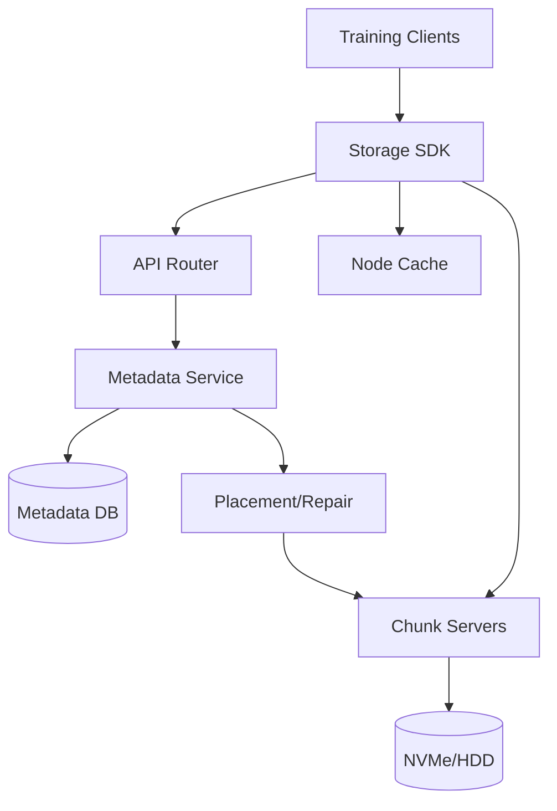
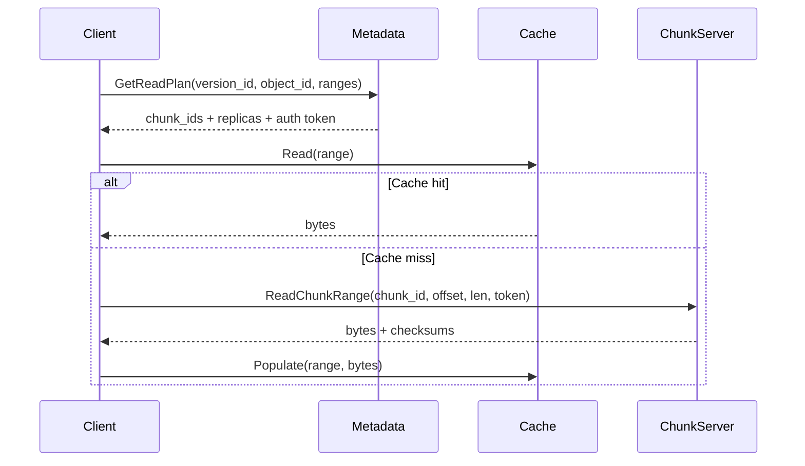

## Overview

AI/ML training workloads stress storage differently than general-purpose file systems: thousands of workers read large datasets concurrently, often in shuffled order, repeatedly across epochs. The bottleneck is almost always aggregate read throughput and tail latency under extreme fan-out, not POSIX semantics like directory renames, byte-range locks, or strict close-to-open consistency.

This design is an object-oriented distributed “training file system” optimized for parallel reads, dataset versioning, and predictable throughput. The core insight is to separate *metadata* (datasets, manifests, object-to-chunk maps) from *data plane* (chunk servers + aggressive caching), and to make the read path “hinted, parallel, and locality-aware”: clients fetch a compact chunk plan, then read directly from the best replicas/caches with large sequential ranges and bounded tail retries.

The result is a production-grade platform that looks more like “S3 + HDFS-style chunking + Alluxio-style caching + data-aware schedulers” than a POSIX filesystem: simple APIs, strong consistency where it matters (dataset commits), eventual consistency where it doesn’t (cache state), and engineering hooks for training (shuffle manifests, shard plans, prefetch).

## Requirements

### Functional Requirements
- Store versioned datasets composed of immutable objects (files) and manifests for deterministic training.
- Support high-throughput parallel reads with byte-range access (e.g., read samples from large container files).
- Provide efficient listing and shuffling primitives (manifests, shard plans) without scanning metadata hot paths.
- Support ingestion at scale via multipart upload and atomic “commit dataset version”.
- Enforce multi-tenant isolation (quotas, rate limits, per-tenant encryption keys, audit logs).
- Provide locality hints (best replicas, cache availability) and client-side parallel fetch plans.
- Support background compaction/rebalancing (re-replication, erasure coding transitions) without downtime.
- Expose observability and admin operations (health, placement, draining nodes, snapshots, retention).

### Non-Functional Requirements
- **Scale**: 50k training nodes; 5PB total data; 200M objects; peak 2–5 TB/s aggregate read; 2M read RPC/s system-wide during large jobs; ingest 50–200 GB/s sustained.
- **Latency**: Read plan fetch (metadata) P50 < 5 ms, P99 < 30 ms; chunk read P50 < 2 ms (cache) / < 10 ms (remote), P99 < 50 ms.
- **Availability**: 99.99% for reads; 99.9% for writes/ingest (training is read-heavy).
- **Consistency**: Strong consistency for dataset version commits and manifest reads; eventual consistency for cache state and placement telemetry.
- **Durability**: Target 11x9s object durability equivalent via replication/EC; RPO ≤ 5 minutes for metadata; no acknowledged commit lost.

### Constraints & Assumptions
- Training jobs primarily read immutable data; overwrites are rare and treated as “new version”.
- Objects are typically large (64MB–5GB), but small objects exist; small-object aggregation is required for efficiency.
- Deployment may be on-prem (RDMA possible) or cloud (TCP); design supports both.
- Team size ~10–20 engineers; prefer proven components (Raft metadata, commodity NVMe, mature telemetry).
- Compliance: encryption at rest and in transit; tenant-scoped access controls; auditability for data access.

## High-Level Architecture

Clients use an SDK (not POSIX) to request a compact read plan (chunk locations + ranges) from the Metadata Service, then read data directly from the best source: local node cache first, otherwise chunk servers (or gateway to object storage in hybrid deployments). Metadata is strongly consistent and relatively small; the data plane is massively parallel and horizontally scalable. A placement/repair controller continuously rebalances, repairs, and enforces durability policies without blocking reads.

This structure is chosen because it minimizes centralized bottlenecks (metadata is lightweight; reads are direct), enables aggressive caching close to compute, and matches training access patterns (repeatable, bulk reads with predictable range access). It also cleanly supports dataset versioning and manifests as first-class primitives for reproducible training.

## Component Deep-Dive

### Storage SDK (Client Library)

**Responsibility**: Provide read/write APIs, fetch read plans, execute parallel range reads, prefetch, retries, checksum validation, and cache integration.

**Key Design Decisions**:
- Use a library API (and optional FUSE/CSI adapter) instead of POSIX: avoids syscall overhead and POSIX edge cases; enables batching and shard-aware reads.
- Client-driven parallelism with hedged reads: maximizes throughput and reduces tail latency during stragglers.

**Technology Choice**: Rust/Go SDK with gRPC for control (metadata) and gRPC/HTTP2 or RDMA transport for data (configurable). Optional Python bindings for training stacks.

**Scaling Strategy**: Scales with clients; metadata calls are batched and cached (plan cache keyed by dataset version + object id). Data reads are direct to chunk servers with client-side concurrency limits.

### Metadata Service

**Responsibility**: Namespace (tenants/datasets/versions), object-to-chunk mapping, manifests, access control, and issuing signed read tokens.

**Key Design Decisions**:
- Strongly consistent commits via Raft: dataset version “commit” is atomic and linearizable; training always reads immutable, committed versions.
- Separate “listing/shuffle” from core namespace: manifests are precomputed and stored as immutable objects to avoid hot metadata scans.

**Technology Choice**: Stateless gRPC frontends + sharded metadata backed by a Raft-replicated key-value store (e.g., FoundationDB, etcd-like with sharding layer, or a custom Raft + RocksDB). Use a relational store only if it can meet latency and sharding needs.

**Scaling Strategy**: Partition by `tenant_id` and `dataset_id` (consistent hashing); cache hot entries (object maps, manifests pointers). Add read replicas for serving read plans; writes funnel through leaders per shard.

### Chunk Servers (Data Plane)

**Responsibility**: Store chunks on local disks, serve range reads, verify checksums, enforce per-tenant bandwidth, and report telemetry.

**Key Design Decisions**:
- Large fixed-size chunks (e.g., 64MB–256MB) with striping across servers: improves parallel read throughput and reduces metadata per object.
- Replication for hot data; erasure coding for cold data: balances cost vs performance; hot training sets stay replicated.

**Technology Choice**: Custom chunk server in Rust/Go using io_uring (Linux) for high throughput; RocksDB/Badger optional only for small metadata; data stored as immutable chunk files with index sidecar.

**Scaling Strategy**: Add more servers to increase throughput linearly; placement uses consistent hashing + rack-aware constraints. Hotspot mitigation via adaptive replica creation and client-side load balancing.

### Node Cache (Compute-Adjacent Cache)

**Responsibility**: Serve reads from local NVMe/RAM; prefetch upcoming ranges; maintain bounded cache with eviction; report cache availability.

**Key Design Decisions**:
- Cache is advisory (eventually consistent): never blocks reads; corruption handled via checksum + refetch.
- Prefetch by shard plan: training runtime can request “next N shards” to warm cache before epochs.

**Technology Choice**: Local daemon with shared memory index + NVMe store; integrates with SDK. Similar in spirit to Alluxio client caching, but tailored for range-based reads and manifests.

**Scaling Strategy**: Scales with training fleet; reduces load on chunk servers. Cache partitioning is local; global coordination is minimal (only hints/telemetry).

### Placement/Repair Controller

**Responsibility**: Maintain replication/EC policies, re-replicate on failures, rebalance capacity, and orchestrate decommissioning.

**Key Design Decisions**:
- Continuous background repair with rate limits: avoids thundering herds during failures.
- Two-phase transitions (replicated ↔ EC): ensure durability invariants are met before removing old copies.

**Technology Choice**: Controller service + work queue (e.g., Kafka/Pulsar or an internal durable queue) and periodic scanners; integrates with metadata for authoritative state.

**Scaling Strategy**: Horizontal controllers with leader election; shard repair tasks by placement group. Repair traffic is capped per rack/cluster.

## Data Model

### Storage Schema

**Metadata (logical, sharded by tenant/dataset):**
- `tenants(tenant_id, name, kms_key_ref, quota_bytes, created_at)`
- `datasets(dataset_id, tenant_id, name, created_at)`
- `dataset_versions(version_id, dataset_id, status, created_at, committed_at, manifest_object_id)`
  - `status`: `STAGING|COMMITTED|DEPRECATED`
- `objects(object_id, version_id, logical_path, size_bytes, content_hash, encoding, created_at)`
  - `encoding`: `RAW|PACKED|PARQUET|TFRECORD|WEB_DATASET`
- `object_chunks(object_id, chunk_id, chunk_offset, length, object_offset)`
- `chunks(chunk_id, size_bytes, checksum, placement_group, state)`
- `chunk_replicas(chunk_id, replica_id, node_id, rack_id, state, last_heartbeat)`
- `access_policies(tenant_id, principal, permissions, conditions, updated_at)`

**Data plane:**
- Chunk file: `chunk_id` → immutable blob + checksum tree (per 4MB segment) for fast range verification.
- Manifests: stored as immutable objects (often compressed) containing object ids + sample offsets + shuffle order.

### Data Flow

Key operations:
- **Commit dataset version**: ingest objects → create/attach manifests → atomically mark version `COMMITTED` (linearizable).
- **Training read**: fetch manifest pointer once → stream shard plan → for each shard, client reads ranges in parallel with hedged retries.

## API Design

Protocol: gRPC for control plane; data plane supports gRPC streaming and/or HTTP Range GET (useful for gateways, debugging, and hybrid cloud).

### Control Plane (gRPC)
- `CreateDataset(tenant_id, name) -> {dataset_id}`
- `StartVersion(dataset_id) -> {version_id}`
- `PutObjectInit(version_id, logical_path, size_bytes, content_hash?) -> {upload_id, chunk_size}`
- `PutObjectPart(upload_id, part_no, bytes) -> {etag}` (idempotent by `(upload_id, part_no)`)
- `CompleteObject(upload_id, parts[]) -> {object_id}`
- `CommitVersion(version_id, manifest_object_id, expected_object_count) -> {committed_at}`
  - **Idempotency**: client supplies `commit_token`; repeated commits with same token are safe.
- `GetManifest(version_id) -> {manifest_object_id, encoding, etag}`
- `GetShardPlan(version_id, job_id, num_workers, worker_index, epoch, seed) -> {shards[]}`
- `GetReadPlan(version_id, object_id, ranges[]) -> {chunk_reads[]}`
  - Returns ordered `chunk_id, replica_endpoints[], offset, length, checksum_ref, token`

**Error handling**
- `NOT_FOUND` for unknown dataset/version/object.
- `FAILED_PRECONDITION` for reading non-committed version.
- `PERMISSION_DENIED` for ACL failures.
- `RESOURCE_EXHAUSTED` for quota/rate limiting (include retry-after hints).
- `UNAVAILABLE` for transient control-plane issues (client retries with jitter).

### Data Plane
- `ReadChunkRange(chunk_id, offset, length, token) -> bytes`
  - Token is short-lived, scope-limited (tenant + chunk + expiry) to reduce blast radius.
  - Supports server-side rate limiting and returns checksum segments for validation.

## Scaling & Performance

### Bottleneck Analysis
- **Metadata hot keys (popular objects/manifests)**: mitigate with manifest/object map caching, sharding by dataset/version, and serving immutable entries from read replicas/CDN-like edge.
- **Hot chunks during synchronized epochs**: mitigate with adaptive replication for hot placement groups, client-side load balancing, and node caches with prefetch.
- **Tail latency from stragglers**: mitigate with hedged reads (after a small delay) and per-range retry budget.
- **Small files overhead**: mitigate with packing formats (e.g., WebDataset tar shards, TFRecord, Parquet) and server-side support for “packed object” indices.

### Horizontal Scaling
- **Client layer**: scale-out by adding workers; SDK enforces concurrency caps per host to prevent incast.
- **Metadata**: shard by `(tenant_id, dataset_id)`; each shard is a Raft group; scale read throughput via read replicas and caching.
- **Chunk servers**: add nodes; placement groups distribute chunks evenly; rack-aware replication (e.g., 3 replicas across 3 racks).
- **Partitioning strategy**:
  - Chunk IDs assigned via consistent hashing into placement groups.
  - Large objects striped across multiple chunks; mapping stored once at commit time.

### Caching Strategy
- **Where**: node-local NVMe cache (primary), optional rack-level cache tier (secondary) for dense clusters.
- **What**: hot shards and manifests; cache at chunk-range granularity (e.g., 4MB segments) to match checksum segments.
- **TTL/Eviction**: size-based LRU/LFU hybrid; pin current-epoch shards; evict by tenant quotas.
- **Invalidation**: none required for immutable data; cache is version-scoped (key includes `version_id`), so new versions don’t conflict.

## Trade-offs & Alternatives

### Key Trade-offs Made
- **Chosen**: Non-POSIX object + manifest model  
  **Sacrificed**: arbitrary renames, hard links, strict POSIX semantics  
  **Why**: training wants throughput, batching, and immutability; POSIX adds complexity and bottlenecks.
- **Chosen**: Strong consistency for commits only  
  **Sacrificed**: linearizable “latest write” semantics for general reads  
  **Why**: committed versions are immutable; strong consistency everywhere would constrain scalability.
- **Chosen**: Client-driven parallel reads + hedging  
  **Sacrificed**: simpler server-only logic  
  **Why**: clients know access patterns (epoch/shard) and can react faster to stragglers.
- **Chosen**: Replication for hot, EC for cold  
  **Sacrificed**: uniform simplicity  
  **Why**: training sets are read-heavy and benefit from replica fan-out; EC reduces cost for long-term retention.

### Alternative Approaches
- **Pure object store (S3/GCS) + CDN**: simpler ops, great durability; often struggles with extreme parallel range reads, tail latency, and small-object metadata overhead at training scale.
- **POSIX parallel filesystem (Lustre/GPFS)**: excellent throughput; heavier operational complexity, metadata contention, and semantics not needed for most ML pipelines.
- **HDFS-style filesystem**: strong precedent for large scans; less ideal for mixed range reads and multi-tenant isolation without significant additional layers.

## Failure Modes & Mitigations

### Failure Scenarios
- **Scenario**: Chunk server dies (disk/node loss)  
  **Impact**: reduced replica count; potential read slowdowns for affected chunks  
  **Detection**: missed heartbeats, elevated read error rate  
  **Mitigation**: clients fail over to other replicas; controller schedules re-replication; temporarily increase hedged reads for impacted placement groups.
- **Scenario**: Metadata leader failure for a shard  
  **Impact**: brief unavailability for commits/plan fetches in that shard  
  **Detection**: Raft election, increased `UNAVAILABLE`  
  **Mitigation**: automatic leader election; clients retry with jitter; keep shards small enough to keep elections fast.
- **Scenario**: Hot shard / incast during synchronized training  
  **Impact**: P99 read latency spikes, throughput collapse  
  **Detection**: per-chunk QPS/throughput alarms, tail latency  
  **Mitigation**: adaptive replication, cache prefetch, admission control per client, randomized shard assignment and staggered epoch starts.
- **Scenario**: Silent data corruption (disk/bitrot)  
  **Impact**: incorrect training data, hard-to-debug model regressions  
  **Detection**: checksum mismatch, periodic scrubber  
  **Mitigation**: per-segment checksums, background scrubbing, automatic replica healing; mark bad replicas and rebuild.
- **Scenario**: Controller bug causes aggressive rebalancing  
  **Impact**: bandwidth saturation, training slowdown  
  **Detection**: repair traffic anomaly, capacity move rate alarms  
  **Mitigation**: global rate limits, canary rollouts, kill switch, “maintenance windows” for heavy moves.

### Disaster Recovery
- **RTO/RPO**: RTO 30–60 minutes for a region-level outage; RPO ≤ 5 minutes for metadata; data RPO = 0 for committed chunks (replicated/EC).
- **Backup strategy**: metadata snapshots (hourly) + incremental Raft logs; manifests and chunks are already replicated/EC; optionally replicate committed datasets cross-region asynchronously.
- **Failover procedures**: promote secondary metadata cluster with last replicated log; redirect clients via DNS/service discovery; rebuild caches lazily; throttle reads during warm-up.

## Operational Considerations

### Monitoring & Alerting
- Key metrics:
  - Control plane: `GetReadPlan` QPS/latency (P50/P99), Raft election rate, commit latency, shard CPU/memory.
  - Data plane: per-node throughput, read P99, error rates, checksum failures, hedged-read rate, replica skew.
  - Cache: hit ratio, evictions, prefetch effectiveness, local disk usage, corruption count.
- Alert thresholds (examples):
  - Read error rate > 0.1% for 5m (page)
  - Read P99 > 100 ms for 10m (page during business hours)
  - Replica count below policy for > 15m (page)
  - Metadata shard unavailable > 60s (page)

### Deployment Strategy
- Rolling deploy with canaries per tier (metadata, chunk servers, cache daemon, SDK).
- Backward-compatible wire protocols; feature flags for new read-plan formats.
- Safe rollback: keep N-1 binaries available; metadata schema migrations are additive and guarded.
- Chaos tests in staging: kill chunk servers, inject latency, corrupt cache entries, force Raft elections.

## References & Further Reading
- Google File System (GFS) and Colossus (successor): foundational chunked storage concepts.
- HDFS architecture: metadata vs data separation and replication trade-offs.
- Alluxio: compute-adjacent caching patterns for analytics/ML.
- Ceph (RADOS): placement groups, recovery, and durability engineering.
- Meta/FAIR and industry talks on data loading bottlenecks (e.g., WebDataset, TFRecord/Parquet sharding) for practical dataset layout strategies.