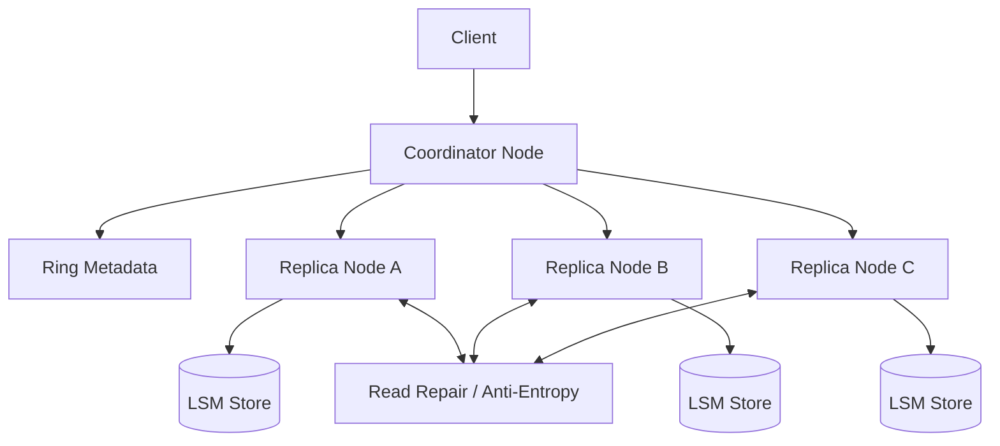
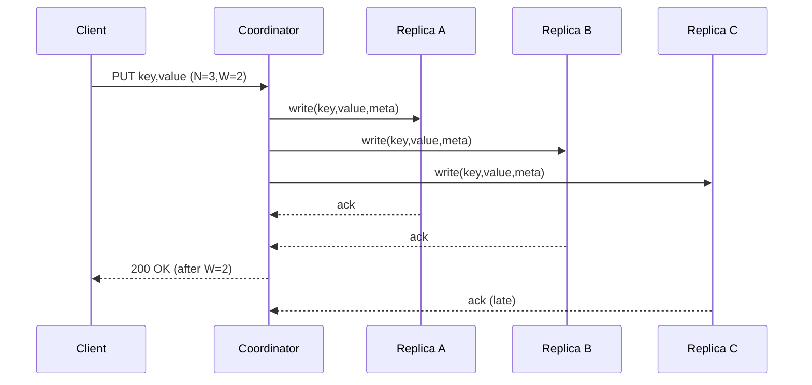

## Overview

A Dynamo-style distributed key-value store is designed to stay available under failures and network partitions while scaling horizontally across many machines. The challenge is that availability and partition tolerance force us to relax strong consistency: replicas can diverge, writes can succeed on some nodes but not others, and clients may observe conflicting versions.

The key insight is to make consistency *tunable per operation* (via quorum reads/writes) and treat conflicts as a first-class outcome. We partition data across a consistent-hash ring, replicate each key to multiple nodes, and track causality with vector clocks (or choose last-write-wins when simplicity is preferred). A background anti-entropy process reconciles replicas over time so the system converges while remaining responsive during failures.

## Requirements

### Functional Requirements
- Put/Get/Delete by key with opaque byte values.
- Tunable consistency per request: `R`, `W`, `N` quorums (e.g., `N=3, W=2, R=2`).
- Partitioning with automatic node add/remove and data rebalancing.
- Replication across nodes and racks/AZs with configurable replication factor.
- Conflict detection and surfacing multiple versions; support resolution via vector clocks and/or LWW.
- Failure handling with hinted handoff (temporary replica) and read repair (heal on reads).
- Background anti-entropy to converge replicas after partitions (e.g., Merkle-tree based sync).
- Observability and operational APIs: health, ring membership, stats, and admin rebalancing.

### Non-Functional Requirements
- **Scale**: 10K nodes; 100K QPS reads, 50K QPS writes per region; 50B keys; 200TB total stored.
- **Latency**: `GET` P50 5–10ms, P99 50ms; `PUT` P50 8–15ms, P99 80ms (in-region).
- **Availability**: 99.99% for reads/writes in steady state; degrade gracefully during partitions.
- **Consistency**: Default eventual consistency; tunable quorums enable “read-your-writes” and stronger consistency when `R+W>N`.
- **Durability**: No acknowledged write lost unless ≥2 replica disks lost before replication completes; WAL + fsync configurable.

### Constraints & Assumptions
- Multi-tenant internal service; no cross-region synchronous replication required for base design.
- Team can operate a custom storage service (on-call, SRE support, automation).
- Data is small per item (<= 1MB typical; hard limit 5–10MB).
- Security: mTLS between nodes, authn/z for clients, encryption at rest.
- Compliance: retain audit logs; optional per-tenant encryption keys.

## High-Level Architecture

Clients can connect to any node; that node acts as a **coordinator** (router) for the request. The coordinator uses **ring metadata** (consistent hashing + virtual nodes) to find the preference list of `N` replicas for the key, executes the request with quorum semantics, and returns either a single version or a set of conflicting versions.

Each replica node persists data in an embedded storage engine (typically an LSM-tree like RocksDB). A **read repair** path heals inconsistencies during reads, while **anti-entropy** reconciles partitions and missed updates in the background using efficient set reconciliation (Merkle trees) to avoid full scans.

## Component Deep-Dive

### Coordinator (Request Router)

**Responsibility**: Accept client requests, determine replica set, execute quorum reads/writes, merge results, and return responses.

**Key Design Decisions**:
- Per-request `R/W/N` to let callers trade latency vs consistency (e.g., `R=1` for low latency, `R+W>N` for stronger guarantees).
- Coordinator is stateless; any node can route, enabling easy horizontal scaling and simpler client config.

**Technology Choice**: gRPC for node-to-node and client-to-cluster (streaming, deadlines, structured errors). Stateless service running alongside storage nodes.

**Scaling Strategy**: Scale by adding nodes; routing load distributes naturally if clients use a seed list + health-based selection.

### Membership & Ring (Consistent Hash + VNodes)

**Responsibility**: Track which nodes own which key ranges and produce a deterministic preference list per key.

**Key Design Decisions**:
- Virtual nodes (vnodes) to smooth load and reduce hotspots when nodes join/leave.
- Gossip-based membership to avoid a single point of failure; ring convergence via versioned metadata.

**Technology Choice**: SWIM-style gossip for liveness + dissemination; ring state stored locally and periodically checkpointed. Optional external store (e.g., etcd) for controlled changes, but not required.

**Scaling Strategy**: Gossip scales to thousands of nodes with bounded fanout; ring computations are O(log V) per key lookup.

### Storage Engine (Replica Node)

**Responsibility**: Persist key versions, serve reads, apply writes, compact data, and expose per-partition iterators for repair.

**Key Design Decisions**:
- LSM-tree with WAL for high write throughput and predictable read amplification.
- Store multiple versions per key (vector clock branches) with bounded sibling counts and TTL/GC.

**Technology Choice**: RocksDB (or Pebble) per node with column families: `data`, `tombstones`, `metadata`. Checksums and compression enabled.

**Scaling Strategy**: Add nodes + vnodes to increase parallelism; shard RocksDB by token ranges if needed to reduce compaction contention.

### Replication, Repair & Anti-Entropy

**Responsibility**: Ensure replicas converge over time; handle temporary failures.

**Key Design Decisions**:
- Hinted handoff for short outages (store “hint” writes on a nearby node, replay when target returns).
- Merkle-tree based anti-entropy per partition to efficiently detect divergence and sync only differing ranges.

**Technology Choice**: Periodic repair jobs per vnode; Merkle trees over sorted key ranges, using iterators from the storage engine.

**Scaling Strategy**: Throttle repair (IO/QPS budgets), schedule per partition, and prioritize partitions with high divergence or frequent failures.

### Conflict Resolution (Vector Clocks / LWW)

**Responsibility**: Detect causality and resolve or surface conflicts.

**Key Design Decisions**:
- Vector clocks for causality: detect concurrent updates and return siblings to caller.
- Optional LWW mode: choose highest timestamp (with clock-skew caveats) for simpler apps; still store metadata for debugging.

**Technology Choice**: Vector clock as `(node_id -> counter)` with pruning (cap size; collapse older entries) and per-write increment on coordinator-chosen replica id.

**Scaling Strategy**: Keep vector clock size bounded; limit sibling count (e.g., max 10) and require application-level resolution if exceeded.

## Data Model

### Storage Schema

Logical record stored at replicas (conceptual; physical layout depends on engine):

- **Key**: `bytes` (or UTF-8 string)
- **Value**: `bytes`
- **Version Metadata**:
  - `vclock`: map of node ids to counters (or LWW timestamp)
  - `created_at_ms`: int64
  - `expires_at_ms` (optional): int64
  - `is_tombstone`: bool
  - `content_hash`: bytes (optional, for repair)
- **Replica Metadata**:
  - `partition_token`: uint64
  - `last_repaired_at_ms`: int64 (per range)

In RocksDB-like terms:
- `data_cf`: `(key || version_id) -> value + metadata`
- `latest_index_cf`: `key -> list(version_id)` (bounded)
- `tombstone_cf`: `key -> tombstone_metadata` (with TTL)

### Data Flow

#### Write (`PUT key,value` with `N,W`)
1. Coordinator hashes key -> token -> preference list of `N` replicas.
2. Coordinator sends write to all `N` replicas with `(key,value,version_meta)`.
3. Replicas append to WAL, write memtable, ack.
4. Coordinator returns success after `W` acks; remaining acks are best-effort.

#### Read (`GET key` with `N,R`)
1. Coordinator queries `N` replicas in parallel.
2. Wait for `R` responses (or more if needed for convergence); merge versions by vector clock dominance.
3. If a single winner, return it; if conflicts, return siblings.
4. Trigger read repair: send “most recent set” back to stale replicas asynchronously.

## API Design

Protocol: gRPC (recommended) with an optional REST gateway for simple clients.

### `Put`
- **RPC**: `Put(PutRequest) returns (PutResponse)`
- **Request**
  - `key: bytes`
  - `value: bytes`
  - `n: int32` (replication factor; default from bucket config)
  - `w: int32` (write quorum)
  - `consistency: enum {EVENTUAL, QUORUM, ALL}` (maps to defaults)
  - `if_match_vclock: bytes` (optional CAS-like precondition)
  - `ttl_seconds: int32` (optional)
  - `idempotency_key: string` (optional)
- **Response**
  - `vclock: bytes`
  - `replica_acks: int32`

**Error Handling**
- `INVALID_ARGUMENT` (bad quorums, size limit)
- `FAILED_PRECONDITION` (CAS/vclock mismatch)
- `UNAVAILABLE` (couldn’t reach W replicas)
- `DEADLINE_EXCEEDED` (timeout)

**Idempotency**
- If `idempotency_key` provided, coordinator stores a short-lived result cache keyed by `(client_id, idempotency_key)` to avoid duplicate writes on retries.

### `Get`
- **RPC**: `Get(GetRequest) returns (GetResponse)`
- **Request**
  - `key: bytes`
  - `r: int32`
  - `return_conflicts: bool` (default true)
- **Response**
  - `versions: repeated Version` (1 if resolved, >1 if conflicting)
  - `resolved: bool`
- **Version**
  - `value: bytes`
  - `vclock: bytes`
  - `last_modified_ms: int64`

### `Delete`
- **RPC**: `Delete(DeleteRequest) returns (DeleteResponse)`
- Uses tombstones with TTL; same quorum semantics as `Put`.
- Supports `if_match_vclock` for conditional delete.

### Admin APIs (authenticated)
- `GetRing()`, `DrainNode()`, `Rebalance()`, `SetRepairRateLimit()`, `Stats()`.

## Scaling & Performance

### Bottleneck Analysis
- **Hot keys / skew**: Single key dominates traffic.
  - Mitigation: client-side key salting (if app can), adaptive caching, request hedging, and per-key rate limits.
- **Compaction pressure** (LSM write amplification):
  - Mitigation: tune compaction, separate WAL/disk, SSDs, partition data into multiple DB instances per node.
- **Repair traffic** competing with foreground:
  - Mitigation: rate-limited repair, off-peak scheduling, prioritize recent partitions, bounded concurrency.
- **Coordinator fanout latency** for quorum:
  - Mitigation: parallel RPCs, hedged reads, deadlines, fast-fail on insufficient reachable replicas.

### Horizontal Scaling
- **Client/Coordinator layer**: any node can coordinate; scale by adding nodes and spreading client connections.
- **Data layer**: consistent hashing ring with vnodes; when adding nodes, move vnode ownership gradually (streaming transfer).
- **Partitioning**: token space split into many vnodes (e.g., 256–4096 per node cluster-wide); replicas spread across failure domains.

### Caching Strategy
- **Replica-local block cache**: RocksDB block cache for hot SST blocks.
- **Coordinator read-through cache** (optional): small TTL cache for hot keys (e.g., 100ms–1s) to reduce fanout at extreme read QPS.
- **Invalidation**: on `Put/Delete`, coordinator can best-effort invalidate its own cache entry; correctness relies on TTL + quorum reads.
- **Negative caching**: cache “not found” briefly (e.g., 50–200ms) with caution due to eventual consistency.

## Trade-offs & Alternatives

### Key Trade-offs Made
- **Chosen**: Eventual consistency with tunable quorums.
  - **Sacrificed**: Global linearizability and simple mental model.
  - **Why**: Maximizes availability and performance under partitions and node failures.
- **Chosen**: Vector clocks for conflict detection.
  - **Sacrificed**: Metadata overhead and complexity.
  - **Why**: Correctly distinguishes causality vs concurrency; avoids silent lost updates.
- **Chosen**: LSM-based storage per node.
  - **Sacrificed**: Compaction cost and read amplification.
  - **Why**: High write throughput and operational maturity (RocksDB ecosystem).

### Alternative Approaches
- **Strongly consistent KV (Raft per shard)**: etcd-style.
  - Not chosen: higher write latency, reduced availability during partitions, more complex reconfiguration at scale.
- **Primary-backup per shard**:
  - Not chosen: failover complexity, single-writer bottleneck, weaker write availability.
- **CRDT-based values**:
  - Not chosen: only works for specific data types/merge semantics; increases application coupling.

## Failure Modes & Mitigations

### Failure Scenarios
- **Scenario**: Replica node down.
  - **Impact**: Reduced capacity; may fail to meet `W/R` for strict quorums.
  - **Detection**: Gossip failure detector + failed RPC rates.
  - **Mitigation**: Hinted handoff; fallback to lower quorums (if client opts); auto-repair on return.
- **Scenario**: Network partition splits replicas.
  - **Impact**: Divergent versions; conflicts on healing.
  - **Detection**: Increased conflict rate, gossip partition indicators, repair divergence.
  - **Mitigation**: Accept writes with available quorum; reconcile via vector clocks + anti-entropy.
- **Scenario**: Coordinator overload.
  - **Impact**: Elevated latency/timeouts cluster-wide.
  - **Detection**: Queue length, CPU, tail latency, rejected requests.
  - **Mitigation**: Load shedding, per-tenant limits, client-side retries with jitter, add nodes.
- **Scenario**: Disk full / compaction stall.
  - **Impact**: Write failures, latency spikes.
  - **Detection**: Disk usage, compaction backlog, write stall metrics.
  - **Mitigation**: Enforce quotas, TTL cleanup, add capacity, tune compaction, emergency throttle.
- **Scenario**: Clock skew (LWW mode).
  - **Impact**: Wrong winner selection and potential data loss semantics.
  - **Detection**: NTP drift metrics, monotonicity checks.
  - **Mitigation**: Prefer vector clocks; if LWW, use hybrid logical clocks (HLC) and bound skew.

### Disaster Recovery
- **RTO/RPO**: RTO 30–60 minutes per region; RPO minutes (async backups) or near-zero if dual-write to another region.
- **Backup strategy**: Periodic SST snapshots + WAL archiving to object storage; verify restores continuously.
- **Failover procedures**: Promote standby region (if configured), update client routing, rebuild ring from snapshots, run full repair.

## Operational Considerations

### Monitoring & Alerting
- Key metrics:
  - Request rate, P50/P99 latency, error rates by API and tenant
  - Quorum failures (`insufficient_acks`), timeouts, retry rates
  - Conflict/sibling rate on reads
  - Hinted handoff queue depth and age
  - Repair divergence %, bytes repaired, repair lag
  - RocksDB: compaction backlog, write stalls, block cache hit rate
  - Disk/CPU/memory/network per node
- Alerts:
  - P99 latency > target for 5m
  - Quorum failure rate > 1% for 5m
  - Disk > 85% or compaction stall detected
  - Hint queue age > SLA (e.g., 10m)
  - Repair lag > 24h for any partition

### Deployment Strategy
- Rolling upgrades with max-unavailable percentage (e.g., 5%) while preserving `N` replica availability.
- Compatibility rules: support mixed versions for gossip/ring and on-disk formats (feature flags).
- Safe rollout: canaries + shadow reads; monitor conflict and quorum failure rates.
- Rollback: binary rollback; disable new features; if on-disk format changes, use forward-compatible migrations.

## References & Further Reading
- Amazon Dynamo paper: https://www.allthingsdistributed.com/files/amazon-dynamo-sosp2007.pdf
- Riak (Dynamo-inspired KV): https://riak.com/
- Cassandra architecture (Dynamo + Bigtable): https://cassandra.apache.org/doc/latest/
- Vector clocks: https://en.wikipedia.org/wiki/Vector_clock
- Merkle trees for anti-entropy: https://en.wikipedia.org/wiki/Merkle_tree
- SWIM membership: https://www.cs.cornell.edu/projects/Quicksilver/public_pdfs/SWIM.pdf