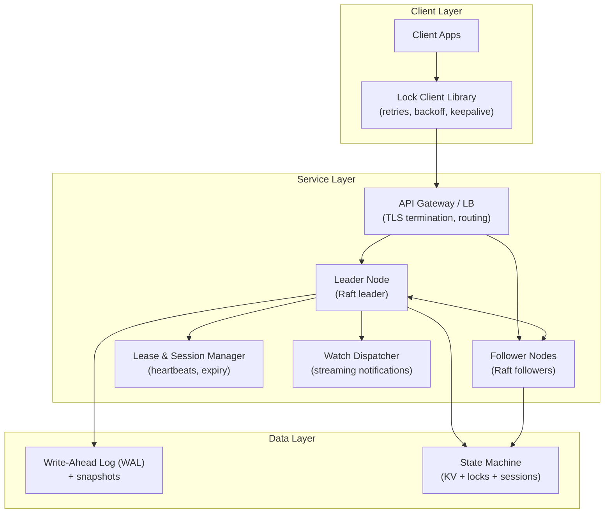
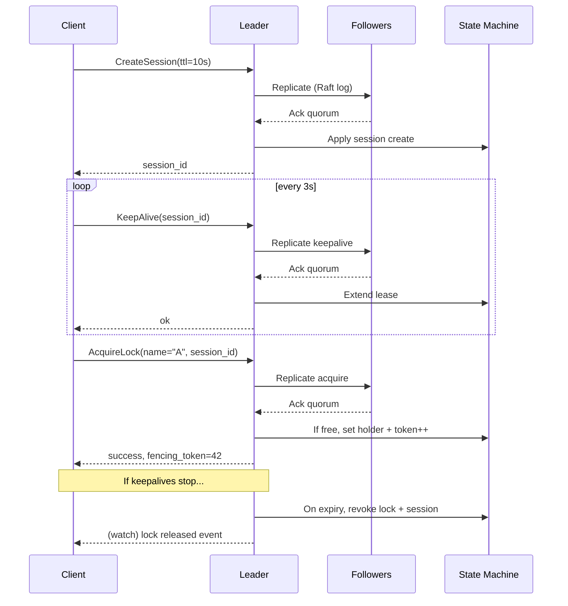

## Overview

A distributed lock service is a coordination primitive used to ensure mutually exclusive access to shared resources across a fleet of unreliable clients and servers. The hard part is not “who holds the lock,” but doing so safely under network partitions, process crashes, GC pauses, clock drift, and retry storms—while still providing low-latency, linearizable semantics that higher-level systems can trust.

The key insight is to separate **liveness** (leases + failure detection) from **safety** (consensus + fencing tokens). Leases with heartbeats determine when a client is considered alive and when its locks should be revoked; consensus ensures there is a single authoritative history of lock ownership; fencing tokens ensure that even if an old client continues running after losing its lease, it cannot corrupt downstream systems.

This design is essentially a focused “Chubby/ZooKeeper/etcd-like” service: a small replicated control-plane cluster providing linearizable metadata operations (lock acquire/release, session/lease management) plus watch notifications for scalable coordination patterns.

## Requirements

### Functional Requirements
- Create and manage **client sessions** with server-assigned leases (TTL-based).
- Support **acquire** and **release** of named locks with **linearizable** semantics.
- Provide **fencing tokens** (monotonically increasing per lock) on successful acquire.
- Detect client failures via **heartbeats**; automatically revoke locks when leases expire.
- Offer **watch/notify** APIs so clients can wait on lock availability without polling.
- Support **reentrant lock** behavior per session (optional but common) and explicit “try-acquire with timeout”.
- Provide **leader election** and “ephemeral membership” primitives (often built atop ephemeral keys/leases).
- Expose **admin** endpoints for health, metrics, and cluster membership changes.

### Non-Functional Requirements
- **Scale**:
  - 50k concurrent clients (sessions)
  - 200k active locks (keys) and 5M total keys (including ephemeral/membership keys)
  - 20k QPS reads (Get/Watch) and 5k QPS writes (Acquire/Release/KeepAlive) per cluster
  - Typical cluster size: 3–5 nodes
- **Latency** (single region):
  - Acquire/Release/KeepAlive (linearizable writes): P50 < 10ms, P99 < 50ms
  - Get (linearizable read): P50 < 5ms, P99 < 25ms
  - Watch delivery: P99 < 250ms from commit to client notification
- **Availability**:
  - 99.99% for quorum-available scenarios (tolerate 1 failure in 3-node cluster)
  - Clear behavior under partitions (no split-brain): prefer safety over availability for writes
- **Consistency**:
  - Linearizable for lock operations, session state, fencing token assignment
  - Watch notifications are “at least once” and may be delayed; clients must re-check state
- **Durability**:
  - No loss of committed operations (WAL + fsync or equivalent)
  - RPO = 0 within a region; cross-region DR may be RPO minutes depending on replication mode

### Constraints & Assumptions
- Small team operating a control-plane service; correctness prioritized over maximal throughput.
- Clients may be in multiple languages; provide official libraries (Go/Java/Python) with consistent semantics.
- Running in a single primary region for low latency; optional DR in secondary region.
- Compliance: audit logs for admin actions; TLS everywhere; mTLS optional for internal workloads.
- Cost constraints favor small clusters with predictable resource usage; avoid heavyweight dependencies.

## High-Level Architecture

A small cluster runs a consensus protocol (Raft) to maintain a single, authoritative sequence of state transitions for sessions, leases, and locks. All lock acquisitions and releases are replicated through Raft to guarantee linearizability and to ensure fencing tokens are monotonically increasing.

Clients interact through a library that maintains a session, sends periodic keepalives, and manages retries with jittered backoff. Watches are served via streaming RPCs; they do not replace linearizable reads/writes—clients always re-check state after receiving notifications.

## Component Deep-Dive

### Consensus Cluster (Raft)

**Responsibility**: Provide linearizable replication of all state changes (sessions, locks, tokens) with a single leader.

**Key Design Decisions**:
- Use **Raft** with a single leader per term to simplify correctness and operational debugging.
- Persist operations via **WAL + snapshots** to bound replay time and storage growth.

**Technology Choice**: etcd-style Raft implementation (production proven) or a mature Raft library in the service’s language (Go strongly favored).

**Scaling Strategy**:
- Scale writes by keeping cluster small (3–5) and fast disks.
- Scale reads via **linearizable reads** (leader lease / ReadIndex) and optional **serializable reads** for non-critical operations.

### Lease & Session Manager

**Responsibility**: Track session liveness, enforce TTL, revoke ephemeral keys/locks on expiry, and provide failure detection.

**Key Design Decisions**:
- Server uses **monotonic time** for TTL accounting; never trusts client clocks.
- Sessions are renewed only through **KeepAlive**; missed keepalives trigger expiry and cleanup via the replicated state machine.

**Technology Choice**: In-process module integrated with the Raft state machine; timers drive expirations, but expiry is finalized by committing a revoke operation (or applying deterministic expiry rules on leaders with replication).

**Scaling Strategy**:
- Heartbeats aggregated by client library (single stream) instead of per-lock heartbeats.
- Batch keepalive processing (e.g., coalesce renewals per session per 200ms).

### Lock Manager (Fencing Tokens)

**Responsibility**: Implement lock semantics and generate fencing tokens to protect downstream resources.

**Key Design Decisions**:
- Fencing token is a **monotonic counter per lock name** stored in the replicated state; increment only on successful acquisition.
- Locks are bound to a **session lease**; if the session expires, the lock is revoked automatically.

**Technology Choice**: Implemented as part of the Raft state machine (a specialized KV with lock metadata).

**Scaling Strategy**:
- Hot locks are unavoidable bottlenecks; mitigate by client-side backoff and watch-based waiting (no polling storms).
- Partition the problem by namespace (multiple clusters) rather than sharding within a single lock keyspace, since consensus is the bottleneck.

### Watch Dispatcher

**Responsibility**: Deliver change notifications to clients (lock released, key changed) efficiently.

**Key Design Decisions**:
- Watches are **edge-triggered** and “at least once”; client must re-read state on notification.
- Notifications are driven from committed log indexes; clients can resume from a known revision.

**Technology Choice**: gRPC streaming with backpressure; per-connection buffers and drop/rewind rules.

**Scaling Strategy**:
- Fanout optimized by grouping watches by key/prefix.
- Apply rate limits and enforce max watches per client to prevent memory blowups.

## Data Model

### Storage Schema

A single replicated state machine maintains these core objects (shown as logical tables; physically this can be a KV map keyed by IDs/names plus indexes).

**sessions**
- `session_id` (UUID)
- `client_id` (string; for observability)
- `lease_ttl_ms` (int)
- `lease_expiry_monotonic_ms` (int; derived)
- `last_keepalive_revision` (int64; Raft index / revision)
- `status` (`ACTIVE|EXPIRED|REVOKED`)
- `created_at_unix_ms` (int64)

**locks**
- `lock_name` (string; primary key)
- `holder_session_id` (UUID; nullable)
- `lease_session_id` (UUID; nullable; typically same as holder)
- `fencing_token` (int64; monotonically increasing per `lock_name`)
- `reentrancy_count` (int32; optional)
- `acquired_revision` (int64)
- `updated_revision` (int64)

**idempotency_keys** (optional but recommended)
- `session_id` (UUID)
- `request_id` (UUID)
- `operation` (string)
- `result_blob` (bytes/json)
- `expires_at_revision_or_time` (int64)

**events** (logical stream; can be derived from revisions)
- `revision` (int64)
- `type` (`LOCK_ACQUIRED|LOCK_RELEASED|SESSION_EXPIRED|...`)
- `entity_key` (string)
- `payload` (bytes/json)

### Data Flow

## API Design

Use **gRPC** for low-latency streaming watches and keepalives; expose a REST gateway optionally for debugging/admin.

### Core gRPC APIs

**CreateSession**
- `CreateSessionRequest { string client_id; int32 ttl_ms; }`
- `CreateSessionResponse { string session_id; int64 lease_expiry_unix_ms; }`
- Errors: `INVALID_ARGUMENT`, `RESOURCE_EXHAUSTED`, `UNAVAILABLE`

**KeepAlive (streaming recommended)**
- Client stream: `KeepAliveRequest { string session_id; }`
- Server stream: `KeepAliveResponse { string session_id; int64 lease_expiry_unix_ms; int64 revision; }`
- Semantics: idempotent; last-write-wins on lease extension
- Errors: `NOT_FOUND` (unknown session), `FAILED_PRECONDITION` (expired), `UNAVAILABLE`

**AcquireLock**
- `AcquireLockRequest { string session_id; string lock_name; bool wait; int32 timeout_ms; string request_id; }`
- `AcquireLockResponse { bool acquired; int64 fencing_token; int64 revision; }`
- Semantics:
  - Linearizable. If `wait=false` and held, returns `acquired=false`.
  - If `wait=true`, server may either block until available or instruct client to watch (preferred for fairness/backpressure).
- Idempotency:
  - `request_id` scoped to `session_id`. Server stores result to avoid double-token increments on retries.
- Errors: `NOT_FOUND` (no session), `DEADLINE_EXCEEDED`, `ABORTED` (leader change), `UNAVAILABLE`

**ReleaseLock**
- `ReleaseLockRequest { string session_id; string lock_name; string request_id; }`
- `ReleaseLockResponse { bool released; int64 revision; }`
- Semantics: Idempotent; releasing a lock not held by session returns `released=false` (or `PERMISSION_DENIED` depending on policy).

**GetLock**
- `GetLockRequest { string lock_name; bool linearizable; }`
- `GetLockResponse { bool held; string holder_session_id; int64 fencing_token; int64 revision; }`

**WatchLocks**
- `WatchRequest { string prefix; int64 start_revision; }`
- Stream `WatchEvent { int64 revision; string key; string type; bytes payload; }`
- Semantics: at-least-once; clients resume by `start_revision`.

### Error Handling Approach
- Use gRPC status codes + structured error details:
  - `ABORTED` for leader change / retryable conflicts
  - `FAILED_PRECONDITION` for expired session
  - `RESOURCE_EXHAUSTED` for watch/session limits
- Client library implements:
  - Exponential backoff with jitter
  - Request hedging disabled for writes (to avoid duplicate pressure)
  - Automatic leader re-discovery

### Fencing Token Usage (Downstream)
Any protected resource (DB, object store, scheduler) must check `fencing_token` monotonicity:
- Example: when writing to a shared worker assignment record, include `token` and enforce `token > stored_token`.
- This prevents a stalled/partitioned client from acting after losing its lease.

## Scaling & Performance

### Bottleneck Analysis
- **Consensus write throughput** is the primary bottleneck (every Acquire/Release/KeepAlive is replicated).
  - Mitigation: streaming keepalives, batching, minimize write amplification, compact logs.
- **Hot locks** cause contention and watch fanout.
  - Mitigation: watch-based waiting, backoff, and application-level lock striping/sharding.
- **Watch memory usage** can spike with many watchers.
  - Mitigation: limits per client, bounded buffers, and requiring resume revisions.

### Horizontal Scaling
- A single Raft group does not scale writes linearly; instead:
  - Run **multiple independent clusters** per environment/namespace/tenant.
  - Encourage **lock keyspace partitioning** by prefix (e.g., `teamA/*`, `teamB/*`) across clusters.
- Within a cluster:
  - Add followers to improve read scalability (if allowing serializable reads on followers).
  - Keep cluster size small for low commit latency (3 is typical; 5 for higher fault tolerance).

### Caching Strategy
- **Client-side caching** for non-critical reads (e.g., cached lock state with short TTL like 250ms).
- **Server-side**: avoid caching that weakens correctness; linearizable reads should consult leader (ReadIndex).
- Watch-based invalidation:
  - Clients cache `GetLock` results and invalidate on watch events for the lock/prefix.
- Cache invalidation is “best-effort”; correctness always relies on linearizable acquire.

## Trade-offs & Alternatives

### Key Trade-offs Made
- **Chosen**: Linearizable lock operations via Raft  
  **Sacrificed**: Availability of writes during partitions (CAP)  
  **Why**: Locking requires safety; split-brain locks are catastrophic.

- **Chosen**: Server-managed leases + fencing tokens  
  **Sacrificed**: Simplicity (more metadata and downstream enforcement)  
  **Why**: Leases alone do not prevent stale clients from acting; fencing tokens close that hole.

- **Chosen**: Watch-based waiting  
  **Sacrificed**: Complexity of streaming + backpressure handling  
  **Why**: Prevents thundering herds and reduces QPS under contention.

### Alternative Approaches
- **Redis-based locks (including Redlock)**:
  - Pros: simple, fast
  - Cons: tricky correctness under failover/partitions; fencing often missing; not ideal for foundational coordination
- **Database row locks / advisory locks**:
  - Pros: reuse existing infra
  - Cons: couples coordination to DB availability/perf; cross-service scaling and watch semantics are poor
- **Gossip / eventual consistency coordination**:
  - Pros: high availability
  - Cons: cannot provide linearizable mutual exclusion; unsafe for general-purpose locks

## Failure Modes & Mitigations

### Failure Scenarios
- **Scenario**: Leader crashes  
  **Impact**: Writes unavailable during election (typically 100ms–2s)  
  **Detection**: Raft election timeouts; client `UNAVAILABLE/ABORTED`  
  **Mitigation**: Fast elections, client retries with backoff, persistent WAL to avoid data loss

- **Scenario**: Network partition splits cluster  
  **Impact**: Minority partition becomes read-only; no split-brain writes  
  **Detection**: Loss of quorum, Raft step-down  
  **Mitigation**: Require quorum for writes; expose clear errors; optionally allow serializable reads on followers

- **Scenario**: Client GC pause or stall beyond TTL  
  **Impact**: Session expires; lock revoked; client may still run  
  **Detection**: Missed keepalive; session moves to EXPIRED  
  **Mitigation**: Fencing tokens prevent stale client actions; client library surfaces “lease lost” and forces re-acquire

- **Scenario**: Clock drift  
  **Impact**: Incorrect lease timing if client clocks used  
  **Detection**: N/A  
  **Mitigation**: Only server monotonic clock used for TTL; client TTL is advisory for UX only

- **Scenario**: Watcher overload / slow consumers  
  **Impact**: Memory pressure, delayed notifications  
  **Detection**: Queue depth, backpressure metrics  
  **Mitigation**: Bounded buffers, drop policy with resume-from-revision, per-client limits, rate limiting

### Disaster Recovery
- **Targets**:
  - In-region: RPO 0, RTO < 1 minute (single cluster, automated restart)
  - Cross-region DR: RPO 1–5 minutes, RTO 15–30 minutes (configurable)
- **Backup strategy**:
  - Periodic snapshots + WAL archiving to object storage
  - Verify restore regularly (automated fire drills)
- **Failover procedures**:
  - Passive secondary restored from snapshot/WAL
  - DNS/service discovery cutover
  - Clients reconnect and establish new sessions; locks are not “magically preserved” across region failover—applications must tolerate re-acquire and use fencing to ensure safety

## Operational Considerations

### Monitoring & Alerting
- Key metrics:
  - Raft: leader changes, commit latency, WAL fsync time, log size, snapshot duration
  - API: QPS by method, P50/P99 latency, error rates by code
  - Leases: active sessions, keepalive rate, expirations/minute
  - Watches: active watches, queue depth, dropped events, reconnect rate
  - Resource: CPU, RSS, disk IOPS, disk latency, file descriptor usage
- Alerts (examples):
  - Commit P99 > 100ms for 5m
  - No leader for > 10s
  - Disk fsync P99 > 20ms
  - Watch drops > 0.1% events
  - Session expirations spike 10x baseline (could indicate network issues)

### Deployment Strategy
- Rolling upgrades with one node at a time; ensure quorum remains.
- Use canary clients or shadow traffic for new versions (especially client libraries).
- Backward-compatible wire protocol; versioned APIs.
- Rollback:
  - Prefer “roll forward” for state machine changes; if rollback needed, ensure snapshot/WAL compatibility or gate new features behind cluster-version checks.

## References & Further Reading
- Chubby: *The Chubby lock service for loosely-coupled distributed systems*
- ZooKeeper: Zab / ZooKeeper docs and recipes (leader election, locks)
- etcd: Raft-based coordination store; watch semantics and linearizable reads
- Raft paper: *In Search of an Understandable Consensus Algorithm*
- “Fencing tokens” discussion: common patterns in distributed locks (also used in HDFS, Kubernetes controllers)
- Jepsen analyses of coordination systems (practical failure modes under partitions)