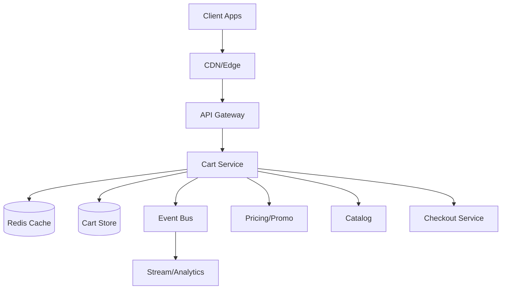
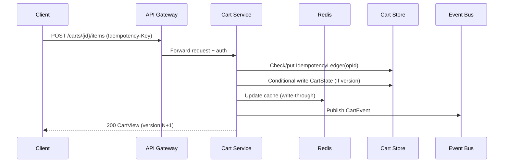

## Overview

A distributed shopping cart looks simple—add/remove items and show totals—but becomes challenging at scale when you require cross-device persistence, survive node/region failures, and allow concurrent updates from multiple clients. Carts are also “hot” objects (frequently read/modified), which makes latency, cache correctness, and conflict resolution core design concerns.

The key insight is to treat the cart as an *eventually consistent, highly available* collaboration object during browsing, while enforcing *strong, deterministic consistency at checkout*. In practice this means: low-latency cart reads/writes backed by a durable multi-region store + cache, operation-level idempotency, and conflict-tolerant merging; then a checkout flow that re-validates price, promotions, and inventory atomically before creating an order.

## Requirements

### Functional Requirements
- Create a cart for guest and authenticated users; persist across sessions/devices for authenticated users.
- Add/remove/update line items (SKU, quantity, options) with near-real-time reflection across devices.
- Merge guest cart into user cart on login with deterministic rules.
- Support promo codes, coupons, and basic eligibility checks (best-effort in cart view).
- Return cart “view” including items, computed totals, and warnings (e.g., “price changed”, “out of stock”).
- Support idempotent mutations to handle retries/timeouts from clients.
- Support cart expiration and cleanup (e.g., abandoned carts), without losing active carts.
- On checkout, ensure consistent final price/promo/tax/inventory validation and produce a canonical “checkout-ready” snapshot.

### Non-Functional Requirements
- **Scale**: 20M DAU; peak 50K read QPS, 10K write QPS; avg cart size 10–30 items; 1–5 KB state typical.
- **Latency**:
  - Cart read (GET): P50 20ms, P99 80ms (cache hit path).
  - Cart write (mutation): P50 40ms, P99 150ms.
  - Checkout validate+lock: P50 200ms, P99 800ms.
- **Availability**: Cart read/write 99.99% (multi-AZ, multi-region active-active); checkout 99.95% (strong dependencies).
- **Consistency**:
  - Cart browsing: eventual consistency across devices/regions; monotonic read per session best-effort.
  - Checkout: strong consistency for inventory reservation, final pricing, and order creation.
- **Durability**: No acknowledged cart mutation lost (RPO ~0 for committed writes); tolerate losing in-cache state.

### Constraints & Assumptions
- Multi-region deployment (2–3 regions) with clients routed to nearest region.
- Team can operate Kafka (or managed equivalent) and Redis; prefers managed DB (DynamoDB/Cassandra/Spanner-equivalent).
- PCI scope avoided for cart; payment handled by separate PCI-compliant systems.
- Promotions/pricing/inventory are owned by separate services; cart must degrade gracefully if they’re slow/unavailable.
- Budget favors managed services; minimal cross-region synchronous writes for cart browsing.

## High-Level Architecture

Clients talk to an API Gateway that routes to a stateless Cart Service. The Cart Service provides low-latency reads via Redis and durable persistence via a multi-region cart store (e.g., DynamoDB Global Tables or Cassandra with multi-DC replication). All mutations emit durable events to an event bus for downstream consumers (analytics, recommendations, abandoned-cart messaging) and for rebuilding/debugging cart state.

The Cart Service intentionally treats the cart as *eventually consistent* during normal browsing, using idempotent operations and conflict-tolerant merge semantics. Checkout is delegated to a Checkout Service that re-computes totals from authoritative sources and performs atomic inventory reservation + order creation, ensuring “eventual checkout consistency” even if cart state was slightly stale during browsing.

## Component Deep-Dive

### API Gateway (Edge)

**Responsibility**: Auth, rate limiting, routing, request normalization, and idempotency-key enforcement policy.

**Key Design Decisions**:
- Enforce per-user/device rate limits to protect hot cart keys and backend caches.
- Standardize retry semantics (e.g., require `Idempotency-Key` on mutations) to reduce duplicate writes.

**Technology Choice**: Managed API Gateway / Envoy + WAF (e.g., AWS API Gateway/ALB + WAF, or Kong/Envoy).

**Scaling Strategy**: Horizontally scalable; autoscale on request rate; global anycast/edge for low latency.

### Cart Service

**Responsibility**: Cart CRUD/mutations, cart merge, computed cart view (best-effort totals), conflict handling, caching, and event emission.

**Key Design Decisions**:
- Use optimistic concurrency for state writes (`cartVersion` / ETag) plus operation idempotency for retries.
- Keep “cart view” computation resilient: tolerate partial failures in pricing/promo by returning warnings and last-known values.

**Technology Choice**: Stateless service (Go/Java/Kotlin) with gRPC/REST; structured logs + tracing.

**Scaling Strategy**: Partition load by `cartId` (userId-based) for cache locality; scale horizontally; protect hot keys with per-key throttles and request coalescing.

### Cart Store (Durable Persistence)

**Responsibility**: Persist cart state (and optionally operation metadata) across device sessions and failures.

**Key Design Decisions**:
- Multi-region active-active replication with eventual convergence for browsing.
- Store a compact “state document” for fast reads, plus a bounded “mutation ledger” for idempotency and debugging.

**Technology Choice**:
- Option A (managed): DynamoDB Global Tables (or Spanner multi-region) for multi-region writes.
- Option B (self/managed): Cassandra/ScyllaDB multi-DC with LOCAL_QUORUM reads/writes per region.

**Scaling Strategy**: Shard/partition by `cartId` (hash); keep item list bounded; enforce max cart size and item count.

### Redis Cache

**Responsibility**: Low-latency cart reads and write-through/read-through acceleration.

**Key Design Decisions**:
- Cache the cart “state document” keyed by `cartId` with short TTL (e.g., 5–30 minutes) + jitter.
- Invalidate/update cache on successful writes; tolerate stale cache via version checks.

**Technology Choice**: Managed Redis Cluster with replication + persistence disabled or minimal (cache only).

**Scaling Strategy**: Cluster mode with sharding; track hit rate; protect from stampedes via singleflight/coalescing.

### Checkout Service (Strong Consistency Boundary)

**Responsibility**: Validate cart, fetch authoritative prices/promos/taxes, reserve inventory, create order, and produce a canonical checkout snapshot.

**Key Design Decisions**:
- Re-derive totals from authoritative services at checkout; never trust cart-view totals for money.
- Use idempotent “checkout intent” with a server-generated token to handle retries safely.

**Technology Choice**: Separate service with transactional DB (Postgres/MySQL) or strongly consistent store; integrates with Inventory and Order services.

**Scaling Strategy**: Horizontally scalable, but bounded by downstream dependencies; use bulkheads and timeouts.

## Data Model

### Storage Schema

**CartState (document or wide-row)**

- `cartId` (PK, string; typically `user:{userId}` or `guest:{guestId}`)
- `ownerType` (`USER|GUEST`)
- `userId` (nullable)
- `currency` (string, e.g., `USD`)
- `regionAffinity` (string; for diagnostics/routing hints)
- `version` (number; monotonic per successful write)
- `items` (list of objects):
  - `skuId` (string)
  - `qty` (int)
  - `optionsHash` (string; size/color customization)
  - `addedAt` (timestamp)
  - `updatedAt` (timestamp)
  - `itemVersion` (number; for conflict resolution)
- `promoCodes` (list of strings)
- `lastComputedTotals` (object, best-effort):
  - `subtotal`, `discount`, `taxEstimate`, `shippingEstimate`, `grandTotal`
  - `computedAt` (timestamp)
  - `pricingVersion` (string)
- `warnings` (list of codes; e.g., `PRICE_STALE`, `OOS_POSSIBLE`)
- `expiresAt` (timestamp; TTL index)

**IdempotencyLedger (bounded per cart or global table)**

- `cartId` (PK)
- `opId` (SK; hash of `Idempotency-Key` + route)
- `status` (`APPLIED|REJECTED`)
- `requestHash` (string; detect key reuse with different payload)
- `responseSnapshot` (optional small blob)
- `createdAt`, `expiresAt` (TTL; e.g., 24–72 hours)

**CartEvent (event bus topic; optional long-term store)**

- `eventId`, `cartId`, `type` (`ADD_ITEM|SET_QTY|REMOVE_ITEM|MERGE|APPLY_PROMO`)
- `payload`, `opId`, `occurredAt`, `actor` (device/user)

### Data Flow

For reads, the Cart Service returns from Redis when present; on miss, it loads from the Cart Store and populates Redis. “Totals” are computed best-effort: if Pricing/Promo is slow or fails, the service returns last-known totals with warnings and a `computedAt` timestamp.

## API Design

### Get Cart
- `GET /v1/carts/{cartId}`
- Response (200):
  - `cartId`, `version`, `items[]`, `promoCodes[]`, `totals`, `warnings[]`, `computedAt`
- Errors: `404` (unknown cart), `503` (system unavailable)
- Caching: `ETag: "v{version}"`, `Cache-Control: no-store` (client can still use ETag for conditional requests)

### Add/Update/Remove Item (Idempotent)
- `POST /v1/carts/{cartId}/items`
  - Body: `{ "skuId": "...", "qtyDelta": 1, "options": {...} }`
- `PUT /v1/carts/{cartId}/items/{itemKey}`
  - Body: `{ "qty": 3 }`
- `DELETE /v1/carts/{cartId}/items/{itemKey}`
- Headers:
  - `Idempotency-Key: <uuid>` (required)
  - `If-Match: "v{version}"` (optional but recommended to detect client-side races)
- Responses:
  - `200` updated cart view
  - `409` version mismatch (client should refetch and retry)
  - `422` invalid qty/options
  - `409` idempotency key reused with different payload (safety)

### Apply/Remove Promo Code
- `POST /v1/carts/{cartId}/promos` body `{ "code": "SAVE10" }`
- `DELETE /v1/carts/{cartId}/promos/{code}`
- Behavior: best-effort validation in cart; authoritative validation at checkout.

### Merge Guest Cart on Login
- `POST /v1/carts/{userCartId}/merge`
  - Body: `{ "fromCartId": "guest:abc" }`
  - Rules: per-item merge with deterministic conflict resolution (e.g., sum quantities capped; last-updated wins for options)
- Idempotent with `Idempotency-Key`.

### Checkout Intent (Strong Consistency)
- `POST /v1/checkout/intents`
  - Body: `{ "cartId": "...", "shippingAddressId": "...", "paymentMethodId": "..." }`
  - Response: `{ "checkoutIntentId": "...", "expiresAt": "...", "orderPreview": {...}, "warnings": [...] }`
- `POST /v1/checkout/intents/{id}/confirm`
  - Idempotent: `Idempotency-Key` required.
  - Performs final validation + inventory reservation + order creation.

## Scaling & Performance

### Bottleneck Analysis
- **Hot cart keys (flash sales)**: overload cache shard or partition.
  - Mitigation: per-cart throttling, request coalescing, degrade totals computation, and protect downstream pricing calls.
- **Cache stampedes**: many concurrent misses after eviction.
  - Mitigation: singleflight locks, soft TTL + background refresh, and jittered expirations.
- **Downstream dependency latency (pricing/promo)**:
  - Mitigation: timeouts, circuit breakers, cached price snapshots, return warnings + last-known totals.

### Horizontal Scaling
- **Cart Service**: stateless; autoscale on CPU/RPS; consistent hashing at gateway optional for cache locality.
- **Redis**: cluster sharding; scale by adding shards; monitor memory/evictions.
- **Cart Store**: partition by `cartId`; avoid unbounded item growth; enforce limits (e.g., max 200 items/cart).
- **Event Bus**: partition by `cartId` to preserve per-cart ordering; scale partitions with throughput.

### Caching Strategy
- **What**: `CartState` + computed `CartView` (excluding authoritative money commitments).
- **Where**: Redis (primary); optional in-process LRU for ultra-hot carts.
- **TTL**: 5–30 minutes + jitter; “soft TTL” for refresh while serving slightly stale.
- **Invalidation**: write-through update on successful mutation; version embedded so stale reads can be detected and refreshed.

## Trade-offs & Alternatives

### Key Trade-offs Made
- **Eventual consistency for browsing**
  - Chosen: maximize availability/latency under partitions.
  - Sacrificed: immediate cross-device convergence in all cases.
  - Why: carts are not money movements; correctness boundary is checkout.
- **Optimistic concurrency + idempotency**
  - Chosen: simple, scalable conflict handling and safe retries.
  - Sacrificed: occasional `409` and client retry logic.
  - Why: avoids distributed locks and supports multi-region writes.
- **Best-effort totals in cart**
  - Chosen: fast UX with graceful degradation.
  - Sacrificed: totals may be stale until checkout.
  - Why: authoritative calculation belongs to pricing/checkout and must be deterministic there.

### Alternative Approaches
- **Strongly consistent cart (single-writer region / synchronous quorum)**
  - Pros: simpler mental model, fewer conflicts.
  - Cons: higher latency, worse availability under partitions, cross-region penalty.
- **Operation-sourced cart only (event log as source of truth)**
  - Pros: perfect audit/debuggability, easy replay.
  - Cons: higher read amplification; requires compaction/materialization pipelines.
- **CRDT-based cart state (PN-counters + OR-sets)**
  - Pros: automatic convergence without conflicts.
  - Cons: more complex implementation, tricky promo semantics, larger metadata.

## Failure Modes & Mitigations

### Failure Scenarios
- **Scenario**: Redis outage/partition  
  **Impact**: Higher latency, increased DB load  
  **Detection**: Cache error rate, elevated DB QPS  
  **Mitigation**: Fallback to Cart Store; enable request coalescing; temporarily increase TTLs after recovery
- **Scenario**: Cart Store region degradation  
  **Impact**: Failed writes/reads in-region  
  **Detection**: Elevated p99, write error spikes, replication lag  
  **Mitigation**: Route to healthy region (active-active); degrade to read-only for guests if needed; queue events for replay where safe
- **Scenario**: Duplicate client retries/timeouts  
  **Impact**: Double increments/removals without safeguards  
  **Detection**: Anomalous item qty jumps; idempotency collisions  
  **Mitigation**: Require `Idempotency-Key`; ledger enforces exactly-once *effect* per opId
- **Scenario**: Conflicting updates from multiple devices  
  **Impact**: Lost update or surprising merges  
  **Detection**: Increased `409` rates; user complaints telemetry  
  **Mitigation**: Use versioning/ETags; deterministic merge rules; surface “updated on another device” hints
- **Scenario**: Pricing/Promo service slow/unavailable  
  **Impact**: Missing/incorrect totals in cart view  
  **Detection**: Dependency latency SLO burn  
  **Mitigation**: Timeouts + circuit breakers; cached snapshots; warnings; authoritative recompute at checkout
- **Scenario**: Event bus outage  
  **Impact**: Lost analytics/events, harder debugging  
  **Detection**: Publish failures, consumer lag  
  **Mitigation**: Outbox pattern (persist event with cart write and publish asynchronously) if events are critical

### Disaster Recovery
- **RTO/RPO**: RTO 30 minutes for a full-region loss; RPO ~0 for acknowledged cart mutations (multi-region replication).
- **Backups**: Daily full + continuous PITR (if supported); TTL-based carts reduce long-term backup volume but still back up metadata/ledgers.
- **Failover**: Health-based routing at edge; ensure idempotency keys remain valid across regions; run periodic game days for region evacuation.

## Operational Considerations

### Monitoring & Alerting
- Key metrics:
  - Cart read/write QPS, p50/p99 latency, error rate
  - Redis hit rate, evictions, memory fragmentation
  - Cart Store conditional-write failures (`409`), throttles, replication lag
  - Downstream dependency latency/error budgets (pricing/promo)
  - Idempotency conflicts (same key different payload)
- Alerts:
  - p99 latency SLO burn > 5 minutes
  - Error rate > 0.5% for 5 minutes (reads) / > 0.2% (writes)
  - Redis hit rate drop > 20% baseline
  - Store throttling/partition hot spotting

### Deployment Strategy
- Progressive rollout (canary 1% → 10% → 50% → 100%) with automatic rollback on SLO regressions.
- Backward-compatible schema evolution (additive fields; tolerate unknown fields).
- Safe retries and timeouts standardized across clients; chaos testing for dependency failures.
- Rollback procedures: feature flags for totals computation, promo validation, merge behavior; DB migrations reversible or additive-only.

## References & Further Reading
- DynamoDB Global Tables (multi-region eventual consistency): https://docs.aws.amazon.com/amazondynamodb/latest/developerguide/GlobalTables.html
- Designing data-intensive applications (consistency, replication, idempotency): https://dataintensive.net/
- Idempotency patterns (API retries, deduplication keys): https://stripe.com/blog/idempotency
- Outbox pattern (reliable event publishing): https://microservices.io/patterns/data/transactional-outbox.html
- CRDTs for eventual consistency (background theory): https://crdt.tech/