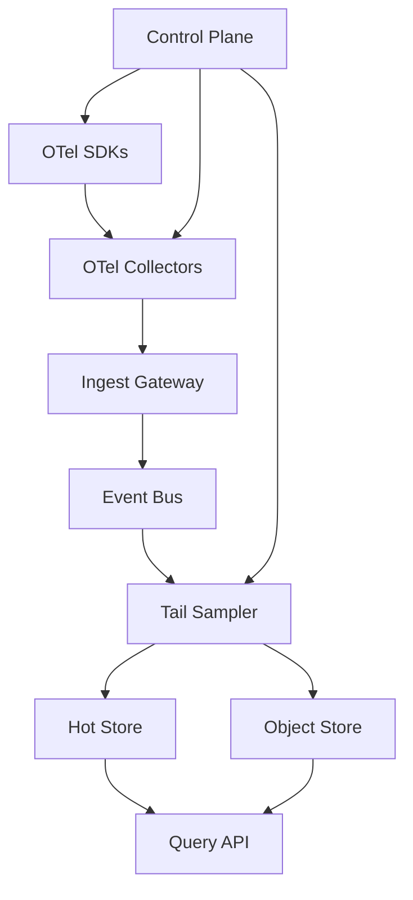
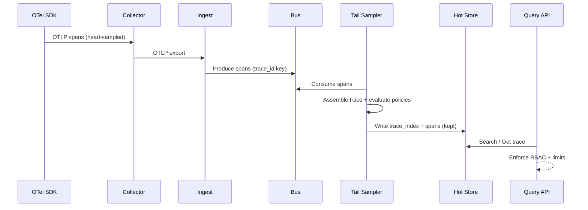

## Overview

A distributed tracing backend ingests high-cardinality span data from thousands of services, stitches spans into traces, and serves low-latency search and retrieval for debugging and SLO investigations. The hard part is balancing *fidelity vs cost*: traces are extremely valuable during incidents, but storing everything is prohibitively expensive and can overload downstream systems.

The key insight is to treat sampling and cost control as a **multi-stage pipeline**: (1) do cheap *head-based* sampling and payload shaping at the edge to cap ingestion, (2) optionally do *tail-based* sampling centrally to keep “interesting” traces (errors/slow/rare paths), and (3) enforce per-tenant budgets and cardinality limits continuously. Architecturally, this pushes complexity into a stream-processing “trace decision” layer while keeping ingestion and query horizontally scalable and operationally safe.

## Requirements

### Functional Requirements
- Ingest traces using OpenTelemetry OTLP (gRPC/HTTP) from SDKs and collectors.
- Support head-based sampling (probabilistic/rate-limited/rule-based) with dynamic configs per tenant/service/route.
- Support tail-based sampling with policies (error/latency/status/attribute match/rare) and deterministic decisions per trace.
- Provide cost controls: per-tenant budgets, payload size limits, attribute allow/deny lists, cardinality guards, and retention tiers.
- Persist sampled traces for search (by service, operation, time, tags) and retrieve full trace by `trace_id`.
- Provide near-real-time query for recent traces and reliable long-term retention for compliance/debugging.
- Offer administrative APIs/UI for sampling rules, budgets, and observability of drop/keep reasons.
- Ensure multi-tenant isolation: authn/z, quotas, and noisy-neighbor protection.

### Non-Functional Requirements
- **Scale**: 10k services, 200k hosts; peak ingest 5M spans/s (~50–100 Gbps uncompressed); 200 tenants; query 2k QPS peak.
- **Latency**:
  - Ingest ACK (collector → backend): P50 30ms, P99 150ms.
  - Tail decision latency: P50 2s, P99 8s (bounded buffering).
  - Query: search P50 200ms / P99 1.5s; get trace by ID P50 50ms / P99 300ms (hot data).
- **Availability**: 99.99% for ingest path; 99.9% for query (degraded query acceptable during incidents).
- **Consistency**:
  - Tail-sampling decision: consistent per trace (all-or-nothing).
  - Search indexes: eventual (seconds-minutes) acceptable; trace-by-id should be read-after-write for kept traces in hot tier.
- **Durability**: No data loss for accepted spans beyond RPO (below); dropped spans should be explicitly accounted for via metrics/logs.

### Constraints & Assumptions
- Multi-region deployment for HA; users mostly query within their region.
- Budget-conscious: tracing is cost-capped per tenant; “burst during incident” supported within configured limits.
- Compliance: tenant isolation, audit logs for config changes; optional encryption at rest/in transit.
- Team size 6–10 engineers; prefer managed primitives where possible (Kafka-like bus, object storage).

## High-Level Architecture

Ingestion is fronted by an **Ingest Gateway** that validates OTLP, enforces auth/quotas, applies coarse cost controls, and writes spans into an **event bus** (Kafka/Pulsar). The **Tail Sampler** consumes spans partitioned by `trace_id`, assembles traces within a bounded window, runs policies, and writes kept traces to **hot storage** (fast query) and optionally **object storage** (cheap long retention).

A **Control Plane** owns sampling configs, budgets, and allowlists. It pushes configs to SDKs/collectors (for head sampling and payload shaping) and to the tail sampler (for centralized decisions). Query reads from hot store for recent data and object storage for older traces.

## Component Deep-Dive

### Ingest Gateway

**Responsibility**: Terminate OTLP, authenticate tenants, enforce quotas, normalize data, and enqueue to the event bus reliably.

**Key Design Decisions**:
- Separate **ingest ACK** from storage: ACK after durable write to bus, not after indexing, to keep latency low and backpressure safe.
- Enforce **hard limits early** (max spans/trace, max attributes/span, max payload bytes, attribute filtering) to prevent downstream overload.

**Technology Choice**: Envoy + gRPC filters or a dedicated Go/Rust service; OTLP parsers; mTLS/JWT auth; rate limiting via Redis/Envoy RL.

**Scaling Strategy**: Stateless horizontal scaling behind L7 load balancer; per-tenant rate limiting; autoscale on CPU + ingress bytes + queue lag.

---

### Event Bus

**Responsibility**: Decouple ingest from tail decisions and storage; provide ordered partitioning for trace assembly.

**Key Design Decisions**:
- Partition key = `trace_id` to co-locate spans for a trace in the same consumer shard (enables deterministic assembly).
- Retain raw spans briefly (e.g., 15–60 minutes) to tolerate tail-sampler restarts and enable reprocessing of recent windows.

**Technology Choice**: Kafka (or Pulsar) with compression (zstd), tiered storage if available.

**Scaling Strategy**: Increase partitions to scale tail sampler; multi-tenant topic strategy (single topic with tenant header + quotas, or per-tenant topic for large tenants).

---

### Tail Sampler (Trace Decision Engine)

**Responsibility**: Assemble traces, run tail-based policies, emit decisions, and route kept traces to storage.

**Key Design Decisions**:
- Bounded **trace buffering window** (e.g., 10s or “until root span end + grace”) to limit memory; emit partial decisions for long traces.
- Two-phase output: write a **decision record** (`keep/drop`, reason, policy) and then write spans for kept traces only (enables audit and metrics).

**Technology Choice**: Stateful stream processor (Kafka Streams/Flink) or a custom service with RocksDB state; policy engine with WASM/Lua-like safe plugins.

**Scaling Strategy**: Scale by consumer group partitions; state sharded by `trace_id`; backpressure via pausing consumption; memory guarded by per-tenant caps.

---

### Storage Layer (Hot + Cold)

**Responsibility**: Persist kept traces for search and retrieval at reasonable cost.

**Key Design Decisions**:
- Hot store optimized for trace search + span scans; cold store optimized for cheap retention and infrequent reads.
- Store both **span records** and **trace index** (per trace metadata like services, duration, error flag) to accelerate queries.

**Technology Choice**:
- Hot: ClickHouse (columnar, great for time-series + tag filters) or Elasticsearch/OpenSearch (flexible search, higher cost).
- Cold: S3/GCS with Parquet/Arrow or compressed protobuf blocks keyed by time/tenant.

**Scaling Strategy**: Hot store sharded by time + tenant; retention tiers (e.g., hot 7 days, warm 30 days, cold 180 days); compaction jobs for cold.

---

### Query API + UI

**Responsibility**: Serve trace search and trace-by-id, enforce RBAC, and provide UX for debugging and sampling visibility.

**Key Design Decisions**:
- Separate **search** from **get-by-id** paths; the latter should hit a fast key lookup (hot index or cache).
- Provide **sampling transparency**: show why a trace was kept/dropped, effective sample rate, and tenant budget consumption.

**Technology Choice**: Stateless API (Go/Java) with Redis cache for trace headers; UI can be Grafana plugin or a dedicated React app.

**Scaling Strategy**: Stateless scale-out; cache trace headers; paginate queries; protect hot store with query limits and async exports.

## Data Model

### Storage Schema

**ClickHouse (example)**

`spans` (hot)
- `tenant_id` (String)
- `trace_id` (FixedString(16/32))
- `span_id` (FixedString(8/16))
- `parent_span_id` (FixedString, nullable)
- `service` (LowCardinality(String))
- `operation` (LowCardinality(String))
- `start_ts` (DateTime64)
- `end_ts` (DateTime64)
- `duration_ms` (UInt32)
- `status_code` (UInt8)
- `error` (UInt8)
- `attrs` (Map(String, String)) or flattened selected attributes (preferred)
- `resource_attrs` (Map) or flattened
- `events` (Nested) (optional; often dropped/trimmed for cost)

Primary index: `(tenant_id, toDate(start_ts), service, trace_id)` with data skipping indices on `operation`, `error`, and selected tags.

`trace_index` (hot)
- `tenant_id`
- `trace_id`
- `start_ts`
- `duration_ms`
- `services` (Array(LowCardinality(String)))
- `root_service`
- `root_operation`
- `has_error`
- `http_route` (optional)
- `decision` (`keep_reason`, `policy_id`, `effective_rate`)
- `span_count`

Primary index: `(tenant_id, toDate(start_ts), root_service)` with skip indices on `has_error`, `duration_ms`, `http_route`.

**Object storage (cold)**
- Partition path: `tenant_id=.../date=YYYY-MM-DD/hour=HH/`
- Files contain traces/spans in Parquet with a small sidecar index (`trace_id` → file/offset) for selective reads.

### Data Flow

Key operations:
- **Head-based**: SDK/collector applies initial sampling (probabilistic or rule-based) and drops/limits high-cost fields (events, large attributes).
- **Tail-based**: Tail sampler sees the full (or windowed) trace and keeps error/slow/rare traces even if they are low-frequency.
- **Query**: Search hits `trace_index`, then fetches spans for selected trace IDs.

## API Design

### Ingestion (OTLP)
- `POST /v1/traces` (OTLP/HTTP protobuf or JSON)
- `POST /opentelemetry.proto.collector.trace.v1.TraceService/Export` (OTLP/gRPC)

**Error handling**
- `401/403`: auth failures
- `429`: tenant over budget or rate limit (with `Retry-After`)
- `413`: payload too large
- `400`: invalid OTLP schema

**Idempotency**
- At-least-once accepted: duplicates possible from retries; de-dup in tail sampler using `(trace_id, span_id)` with a short TTL bloom/rocksdb set.

### Control Plane
- `GET /api/v1/tenants/{tenantId}/sampling-rules`
- `PUT /api/v1/tenants/{tenantId}/sampling-rules` (atomic replace; versioned)
- `GET /api/v1/tenants/{tenantId}/budgets`
- `PUT /api/v1/tenants/{tenantId}/budgets`

**Sampling rule schema (example)**
- Matchers: `service`, `operation`, `http.route`, `deployment.environment`, arbitrary attribute predicates
- Actions: head rate, tail policies, attribute allowlist/denylist, max spans/trace
- Priority + fallback default

**Idempotency**
- Config writes use `If-Match: <etag>` or `version` field to prevent lost updates.

### Query
- `GET /api/v1/traces/{traceId}?tenantId=...` → full trace
- `POST /api/v1/traces/search`
  - Request: time range, service, operation, tags, `min_duration_ms`, `has_error`, limit, cursor
  - Response: list of trace headers + cursor

**Error handling**
- `400`: invalid filters
- `429`: query rate limited
- `503`: hot store degraded (optionally fall back to cold with slower SLA)

## Scaling & Performance

### Bottleneck Analysis
- **Ingest CPU/network**: OTLP parsing and compression; mitigate via gRPC streaming, zstd, and keeping ingest stateless with autoscaling.
- **Tail sampler state/memory**: buffering spans per trace; mitigate with bounded windows, per-tenant caps, and partition scaling.
- **Hot store write amplification**: indexing/tag explosion; mitigate by flattening only selected attributes and enforcing cardinality limits.
- **Query fanout**: wide scans for unselective filters; mitigate with trace_index table, time partitioning, and query limits.

### Horizontal Scaling
- **Ingest**: scale by request rate/bytes; use consistent hashing by tenant to improve cache locality for quotas.
- **Bus**: scale partitions; keep `trace_id` partitioning stable; monitor consumer lag.
- **Tail sampler**: scale consumer group size with partitions; store state locally with changelog to bus for fast recovery.
- **Storage**: shard by tenant + time; separate ingest writers from query replicas if needed.
- **Query**: stateless; cache trace headers; paginate/cursors to avoid deep offsets.

### Caching Strategy
- **Trace header cache** (Redis): `tenant_id + trace_id → trace_index` for 1–24 hours (hot path for trace-by-id).
- **Search result cache**: cache only for highly repeated dashboards (short TTL 10–30s) to avoid stale confusion.
- **Config cache**: sampling rules distributed via control plane watch; SDKs/collectors cache with TTL + version.

Cache invalidation:
- Config changes are versioned and pushed; services refresh on version mismatch.
- Trace header cache invalidated by TTL; writes are append-only so stale reads are acceptable within seconds.

## Trade-offs & Alternatives

### Key Trade-offs Made
- **Kafka + tail sampler vs direct-to-store**: chosen for decoupling and resilience; sacrificed simplicity and added operational overhead (bus + stateful processing).
- **ClickHouse hot store vs Elasticsearch**: chosen for cost/performance on time-partitioned analytics; sacrificed flexible text search and schema-on-read.
- **Bounded tail window**: chosen to cap memory; sacrificed perfect decisions for very long traces (may require partial policies or “keep if any error seen so far”).

### Alternative Approaches
- **Pure head-based sampling only**: simpler and cheaper, but loses rare/critical traces (e.g., only the slow outliers) and is hard to tune during incidents.
- **Always ingest everything, sample at query time**: preserves fidelity but explodes storage and makes incident periods the most expensive.
- **Use an off-the-shelf backend (Tempo/Jaeger)**: faster delivery; may not meet bespoke multi-tenant budgeting, per-attribute cost controls, or custom tail policies.

## Failure Modes & Mitigations

### Failure Scenarios
- **Scenario**: Event bus partition outage  
  **Impact**: ingest backpressure, tail decisions delayed  
  **Detection**: produce errors, rising queue lag, ingest 5xx/429  
  **Mitigation**: multi-broker replication, rack awareness, degrade to head-only sampling (drop tail), buffer in collectors (disk queue).

- **Scenario**: Tail sampler OOM due to trace explosion  
  **Impact**: increased drops, delayed decisions, possible restart loops  
  **Detection**: memory alarms, state size growth, lag spikes  
  **Mitigation**: hard caps (max spans/trace, max in-flight traces), per-tenant memory budgets, early-drop policies, autoscale partitions.

- **Scenario**: Hot store overload / slow queries  
  **Impact**: query latency spikes, timeouts, ingestion write lag  
  **Detection**: P99 query latency, CPU/IO saturation, merge backlog  
  **Mitigation**: separate ingest and query clusters, admission control on queries, enforce mandatory time range, fall back to cold reads for older data.

- **Scenario**: Misconfigured sampling drops critical traces  
  **Impact**: reduced debuggability during incidents  
  **Detection**: “dropped by policy” metrics, anomaly detection on keep rate, alerts on sudden sample-rate changes  
  **Mitigation**: config validation + simulation (“what-if” on recent traffic), staged rollout, emergency “incident mode” override to raise budgets temporarily.

### Disaster Recovery
- **RTO/RPO**: RTO 30 minutes (ingest), 2 hours (query); RPO 5 minutes for kept traces in hot store.
- **Backup strategy**: hot store snapshots daily + binlog/replication; object storage is source-of-truth for cold; control plane configs backed up hourly.
- **Failover procedures**: active-active ingest across regions (tenant routed to nearest); if a region fails, collectors fail over to secondary endpoint; query fails over with DNS/traffic manager.

## Operational Considerations

### Monitoring & Alerting
- Ingest: QPS/bytes, 4xx/5xx, auth failures, p99 latency, per-tenant 429 rate.
- Bus: partition under-replication, produce/consume latency, consumer lag, disk usage.
- Tail sampler: in-flight traces, state size, decision latency, drop reasons, OOM/restarts.
- Storage: write latency, merge backlog, replication lag, query p99, disk/IO, compaction failures.
- Product metrics: effective sample rate per tenant/service, “kept-by-policy” counts, top cardinality offenders.

Alert thresholds (examples):
- Consumer lag > 60s sustained 5m
- Ingest p99 > 300ms 10m
- Hot store query p99 > 2s 10m
- Drop rate spikes > 2x baseline 5m (per tenant)

### Deployment Strategy
- Canary tail sampler and ingest changes (1–5% traffic) with automatic rollback on SLO regression.
- Versioned sampling configs; safe rollout with dry-run evaluation (compute decisions but don’t enforce) before enforcement.
- Rollback: keep backward-compatible OTLP handling; feature-flag new policies; maintain dual-write only if necessary (time-bounded).

## References & Further Reading
- OpenTelemetry Specification: https://opentelemetry.io/docs/specs/
- OTLP Protocol: https://opentelemetry.io/docs/specs/otlp/
- Tail-based sampling concepts (Jaeger): https://www.jaegertracing.io/docs/
- Grafana Tempo architecture (trace storage): https://grafana.com/docs/tempo/
- Kafka Streams / Flink stateful processing: https://kafka.apache.org/documentation/streams/ , https://nightlies.apache.org/flink/flink-docs-stable/