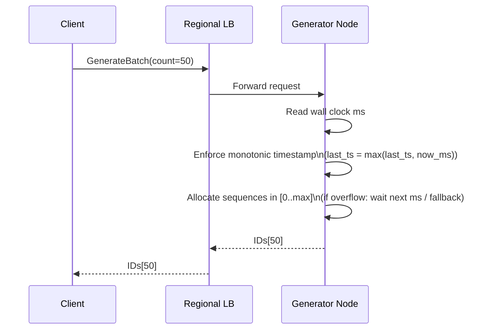
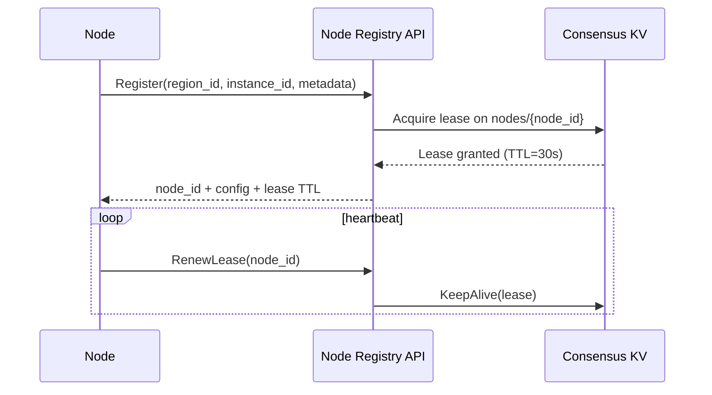

## Overview

A distributed unique ID generator is foundational infrastructure: it sits on hot paths (writes, event ingestion, object creation) and must be fast, highly available, and operationally boring. The challenge is that “unique” is easy, but “unique + time-ordered + multi-region + safe under clock skew” is not—because clocks drift, jump backwards/forwards, regions fail independently, and coordination across regions is expensive.

This design provides Snowflake-like 64-bit IDs that are *roughly time-ordered* (by embedded timestamp), *high-throughput* (lock-free per-node generation with batching), and *safe under clock anomalies* (monotonic timestamp rules, bounded “future” issuance, and a time-authority fallback). Multi-region uniqueness is achieved without cross-region coordination by reserving region bits, while operational control (node ID assignment, health, and guardrails) is handled via a small consensus-backed control plane.

## Requirements

### Functional Requirements
- Generate globally unique IDs via a low-latency API (`Generate`, `GenerateBatch`).
- IDs are k-sortable: sorting by ID approximates creation time (millisecond granularity).
- Provide clock-skew protection: prevent duplicates and detect/regulate backward/forward clock jumps.
- Support multi-region operation with region failover (clients can switch regions without losing uniqueness).
- Support horizontal scaling by adding generator nodes; no single-node bottleneck.
- Provide decode/introspection utilities (timestamp/region/node/sequence extraction) for debugging.
- Provide operational controls: node registration, leasing, safe node ID reuse, rollout-safe config.
- Provide observability: per-node QPS, sequence exhaustion, clock offset, error budgets, and alerts.

### Non-Functional Requirements
- **Scale**: 2M IDs/sec global peak; 200k API QPS (assuming `GenerateBatch` avg=10). Up to 20 regions, 200 nodes/region.
- **Latency**: `Generate` P50 1–2ms, P99 < 10ms within-region; cross-region failover P99 < 50ms.
- **Availability**: 99.99% for ID issuance (data plane), 99.9% for control plane operations (registration/config).
- **Consistency**:
  - ID uniqueness: strong (must never duplicate).
  - Time ordering: best-effort global ordering; strict monotonic per-node ordering.
  - Control plane (node leases/config): strong within a region (Raft quorum).
- **Durability**: IDs themselves are not stored (stateless issuance). Control-plane state (leases/config) is durable with snapshots; tolerate loss of ≤ 1 minute of operational metadata.

### Constraints & Assumptions
- Commodity VM/Kubernetes deployments across 3 AZs per region; no specialized hardware clocks.
- Clock sync via NTP/chrony is available but imperfect; must tolerate backward jumps and variable offset.
- Network partitions can occur within a region and across regions.
- Region identifiers are provisioned uniquely (human/automation) and rarely change.
- Cost-sensitive: avoid global coordination on the hot path; prefer per-region autonomy.
- No PII in IDs; IDs are opaque tokens (though decodable for ops).

## High-Level Architecture

```mermaid
graph TB
  subgraph "Client Layer"
    A[Service Clients<br/>SDK/Library] -->|gRPC/HTTP| B[Regional Anycast / Geo DNS]
  end

  subgraph "Service Layer"
    B --> C[Regional L7 Load Balancer]
    C --> D[ID Generator Nodes<br/>(Stateless Data Plane)]
    D -->|optional fallback| E[Time Authority<br/>(Quorum Time Oracle)]
    D -->|startup/lease| F[Node Registry API<br/>(Control Plane)]
  end

  subgraph "Data Layer"
    F --> G[(Consensus KV<br/>etcd/Consul/Raft)]
    E --> G
    D --> H[Metrics/Logs/Traces]
    F --> H
    E --> H
  end
```

The hot path is intentionally simple: clients hit a regional endpoint, the load balancer forwards to a stateless generator node, and the node returns an ID computed from local time and counters. No database call is required to issue an ID. A small control plane (backed by a consensus KV) handles node ID allocation via leases and distributes configuration (epoch/bit layout, skew thresholds).

Multi-region uniqueness is achieved by encoding a `region_id` in the ID. That avoids cross-region coordination for every generated ID; region failure simply routes traffic to another region. Clock skew protection is handled locally first (monotonic timestamp rules), with an optional time-oracle fallback for severe clock anomalies or environments with unreliable time sync.

## Component Deep-Dive

### ID Generator Node (Data Plane)

**Responsibility**: Issue unique, time-ordered IDs with minimal latency; enforce monotonicity and skew guardrails.

**Key Design Decisions**:
- Use a Snowflake-like packed integer: `(timestamp_ms, region_id, node_id, sequence)` to achieve uniqueness + sortability without storage.
- Use monotonic timestamp logic: never decrease the embedded timestamp even if the system clock goes backward; cap forward issuance and optionally wait/fallback when the clock is unhealthy.

**Technology Choice**: Go/Rust/Java service with gRPC; lock-free or low-lock atomic state; monotonic time APIs (e.g., `clock_gettime(CLOCK_MONOTONIC)` + wall clock correlation, or HLC-style logic).

**Scaling Strategy**: Scale out horizontally behind the LB. Each node can issue up to `2^sequence_bits` IDs per millisecond; add nodes to increase throughput linearly.

---

### Node Registry & Config Service (Control Plane)

**Responsibility**: Assign unique `node_id`s per region using leases; publish config (epoch, bit layout version, skew limits); support safe node ID reuse.

**Key Design Decisions**:
- Use consensus KV (Raft) with leased keys so node IDs automatically expire if a node dies (prevents permanent exhaustion and reduces manual ops).
- Separate control plane availability from data plane availability: once a node has a valid lease and config cached, it can continue issuing IDs during brief registry outages (within lease TTL).

**Technology Choice**: etcd/Consul for KV + leases; a small API service for auditing, policy, and compatibility checks.

**Scaling Strategy**: Control plane QPS is low (heartbeats, config reads). Scale API statelessly; KV cluster sized for stability (odd quorum, 3–5 nodes) per region.

---

### Time Authority (Optional “Time Oracle”)

**Responsibility**: Provide a monotonic, bounded-uncertainty timestamp when local clocks are unreliable; help nodes recover safely from large backward jumps.

**Key Design Decisions**:
- Provide a quorum-based `Now()` that never goes backwards (stores last issued time in the consensus KV or maintains it in-memory with quorum agreement).
- Only used on anomalies (not every request) to keep the hot path fast and avoid turning time into a global bottleneck.

**Technology Choice**: Small gRPC service co-located with the consensus KV (or integrated into the registry service) using Raft linearizable reads/writes.

**Scaling Strategy**: Low traffic by design; rate-limited and cached by generator nodes. Can be sharded by region/AZ if needed.

---

### Edge Routing (Geo DNS / Anycast + Regional LB)

**Responsibility**: Route clients to the nearest healthy region; handle regional failover; shed load during partial outages.

**Key Design Decisions**:
- Prefer regional issuance for latency; fail over to another region when SLOs degrade or region is unavailable.
- Use health-based routing signals (synthetic checks + real SLI) rather than static failover.

**Technology Choice**: Cloud LB + Global Accelerator/Anycast, or Geo DNS with short TTL; Envoy/Nginx for L7.

**Scaling Strategy**: Horizontally scalable managed edge; per-region LBs distribute load across generator nodes.

## Data Model

### Storage Schema

Control plane stored in a consensus KV (example key-space):

- `config/global/bit_layout_version` (string/int)
- `config/global/epoch_ms` (int64)
- `config/regions/{region_id}/enabled` (bool)
- `config/regions/{region_id}/skew/max_backward_ms` (int)
- `config/regions/{region_id}/skew/max_forward_ms` (int)
- `leases/regions/{region_id}/nodes/{node_id}` (value: `{instance_id, ip, az, started_at_ms}`; TTL/lease)
- `stats/regions/{region_id}/nodes/{node_id}/last_seen_ms` (optional; for ops UI)

IDs are not stored. Uniqueness is guaranteed by construction (bit layout + lease-enforced node ID uniqueness + per-ms sequence).

### Data Flow

ID generation (hot path):



Node startup / node ID allocation (control path):



## API Design

Prefer gRPC for low overhead and strong typing; expose HTTP/JSON for simple clients if needed.

### gRPC

**Service**: `IdService`

- `rpc Generate(GenerateRequest) returns (GenerateResponse)`
- `rpc GenerateBatch(GenerateBatchRequest) returns (GenerateBatchResponse)`
- `rpc Decode(DecodeRequest) returns (DecodeResponse)` (ops/debugging; can be admin-gated)
- `rpc Health(HealthRequest) returns (HealthResponse)`

**Messages (illustrative)**:
- `GenerateRequest { string client_id; string idempotency_key; }`
- `GenerateResponse { fixed64 id; }`
- `GenerateBatchRequest { string client_id; string idempotency_key; uint32 count; }`
- `GenerateBatchResponse { repeated fixed64 ids; }`

**Error Handling**:
- `UNAVAILABLE`: no healthy generators (LB/node down).
- `RESOURCE_EXHAUSTED`: sequence overflow and policy forbids waiting (rare; usually we wait).
- `FAILED_PRECONDITION`: clock unhealthy beyond configured thresholds (node in safe-stop).
- `INVALID_ARGUMENT`: bad `count` (e.g., > 10,000).

**Idempotency**:
- For single ID, idempotency is usually unnecessary; for batch requests, support `idempotency_key` with a short-lived in-memory cache per node (e.g., 10s) to safely retry without accidental double issuance *for that request*. This does **not** change uniqueness (IDs are always unique) but improves client semantics under retries/timeouts.

### ID Bit Layout (Example)

Use 63 bits to keep IDs positive in signed 64-bit languages:

- `41 bits` timestamp in ms since custom epoch (≈ 69 years)
- `5 bits` region_id (0–31)
- `8 bits` node_id (0–255 per region)
- `9 bits` sequence (0–511 per ms per node)

Throughput per node: up to ~512k IDs/sec (511 IDs/ms). Increase capacity by adding nodes, increasing sequence bits (if you can reduce node/region bits), or moving to 128-bit IDs.

## Scaling & Performance

### Bottleneck Analysis
- **Per-node sequence exhaustion** (too many IDs in one ms): mitigate with batching, adding nodes, and optional “wait next millisecond” behavior.
- **Clock anomalies** (backward jump): mitigate with monotonic timestamp rules, bounded wait, and time-authority fallback.
- **Load balancer overhead**: mitigate with long-lived gRPC connections, client-side connection pooling, and regional endpoints.
- **Registry dependency at startup**: mitigate with cached config, lease TTL headroom, and graceful degradation during brief control-plane issues.

### Horizontal Scaling
- **Client/Edge**: scale via managed LBs; route by health and latency.
- **Generator nodes**: add instances; each node is independent once assigned `(region_id, node_id)`.
- **Control plane**: scale stateless registry API; keep KV cluster small and stable (3–5 nodes) to reduce tail latency.

**Partitioning Strategy**:
- Partition uniqueness by region bits. Within a region, uniqueness is partitioned by node_id. No cross-node coordination needed on issuance.

### Caching Strategy
- **Client-side**: optionally request batches (e.g., 100–1000 IDs) and cache locally to amortize network latency; TTL not required because IDs are opaque.
- **Node-side**: cache config locally (epoch, thresholds) with watch/stream updates; cache recent idempotency keys briefly for retry semantics.
- **Invalidation**: config changes are versioned; nodes refuse incompatible config changes (e.g., bit layout change) until restarted/rolled safely.

## Trade-offs & Alternatives

### Key Trade-offs Made
- **Chosen**: Region bits for multi-region uniqueness. **Sacrificed**: strict global time ordering across regions. **Why**: avoids global coordination and keeps p99 low during normal operation and failover.
- **Chosen**: Stateless issuance (no ID persistence). **Sacrificed**: ability to “prove” an ID was issued by storing an issuance log. **Why**: issuance logging would be expensive on the hot path; use metrics/audit sampling instead.
- **Chosen**: Lease-based node ID assignment via consensus KV. **Sacrificed**: dependency on a control plane for startup/renewal. **Why**: prevents split-brain node_id reuse and reduces manual operations.

### Alternative Approaches
- **Database-backed sequences (e.g., auto-increment, Redis INCR)**: simpler semantics but becomes a throughput and availability bottleneck; cross-region adds latency and coordination.
- **Hi/Lo allocation (block reservation)**: generators reserve ranges from a DB and issue locally; great when DB is reliable, but requires careful range management and still depends on durable storage.
- **TrueTime-like globally bounded time**: provides stronger ordering guarantees, but requires specialized time infrastructure and/or global quorum calls that increase latency and reduce availability under partitions.

## Failure Modes & Mitigations

### Failure Scenarios

- **Scenario**: System clock goes backward by small amount (e.g., 2–50ms).  
  **Impact**: Potential ordering anomalies if not handled; duplicates if naive.  
  **Detection**: `now_ms < last_timestamp_ms` metric/event.  
  **Mitigation**: Use `last_ts = max(last_ts, now_ms)`; continue issuing with same `last_ts` and sequence; if sequence overflows, wait until `now_ms >= last_ts + 1` or consult time authority.

- **Scenario**: Clock jumps forward significantly (e.g., +5 minutes).  
  **Impact**: IDs appear from the future; breaks downstream assumptions (TTL, ordering).  
  **Detection**: `now_ms - last_ts` exceeds `max_forward_ms`.  
  **Mitigation**: Safe-stop issuance and/or switch to time authority; alert on time sync; require operator intervention if persistent.

- **Scenario**: Two nodes accidentally share the same `(region_id, node_id)` (split brain / misconfig).  
  **Impact**: Catastrophic duplicates.  
  **Detection**: Lease enforcement failures; duplicate node_id alarms from registry; downstream duplicate detection (if any).  
  **Mitigation**: Leased assignment with strong consistency; node refuses to start without lease; embed `instance_id` in lease value and verify ownership on renewals.

- **Scenario**: Control plane (KV quorum) down in a region.  
  **Impact**: New nodes can’t register; existing nodes may eventually lose lease renewals.  
  **Detection**: Registry/KV health checks, lease renewal error rate.  
  **Mitigation**: Set lease TTL with headroom (e.g., 30s TTL, renew every 5s); keep issuing while lease is valid; allow “grace window” (e.g., 2–5 minutes) where nodes continue issuing if they can’t renew but can still prove no other node has taken the lease (policy choice—safer to stop).

- **Scenario**: Full regional outage.  
  **Impact**: Regional endpoint unavailable.  
  **Detection**: Synthetic checks + client error spikes.  
  **Mitigation**: Geo failover to another region; uniqueness preserved via region bits; document that strict global ordering is not guaranteed during/after failover.

### Disaster Recovery
- **RTO/RPO**:
  - Data plane: RTO < 5 minutes (spin up nodes), RPO N/A (stateless).
  - Control plane KV: RTO < 30 minutes, RPO < 1 minute (snapshots).
- **Backup Strategy**: Periodic KV snapshots (e.g., every 5 minutes) stored in durable object storage; config stored as code (GitOps) and reconciled.
- **Failover Procedures**: Promote standby KV cluster in-region (if multi-AZ degraded) or rebuild from snapshots; rotate region endpoint via global routing; ensure region_id uniqueness is preserved.

## Operational Considerations

### Monitoring & Alerting
- Key metrics:
  - `idgen.qps`, `idgen.latency_p50/p99`, `idgen.errors_by_code`
  - `idgen.clock_backward_events`, `idgen.clock_forward_guard_trips`
  - `idgen.sequence_exhaustions`, `idgen.wait_ms_total`
  - `registry.lease_renew_failures`, `kv.quorum_health`
- Alert thresholds (examples):
  - P99 latency > 20ms for 5 minutes (regional)
  - Any sustained clock guard trip > 1/min/node
  - Sequence exhaustion rate > 0.1% of ms windows (scale out)
  - KV quorum unhealthy > 1 minute

### Deployment Strategy
- Roll out generator nodes with canary (1–5%) then progressive rollout; keep API backward compatible.
- Use config versioning; prohibit in-place bit layout changes without a coordinated migration plan.
- Rollback: safe because issuance is stateless; roll back binary/config while preserving region/node assignments; ensure nodes stop if config version mismatch is unsafe.

## References & Further Reading
- Twitter Snowflake (original approach and bit layout trade-offs): https://blog.twitter.com/engineering/en_us/a/2010/announcing-snowflake
- Sonyflake (Snowflake variant considerations): https://github.com/sony/sonyflake
- Hybrid Logical Clocks (HLC): https://cse.buffalo.edu/tech-reports/2014-04.pdf
- etcd leases and linearizable reads (control-plane building block): https://etcd.io/docs/
- Google Spanner TrueTime (stronger ordering model, different trade-offs): https://research.google/pubs/pub39966/