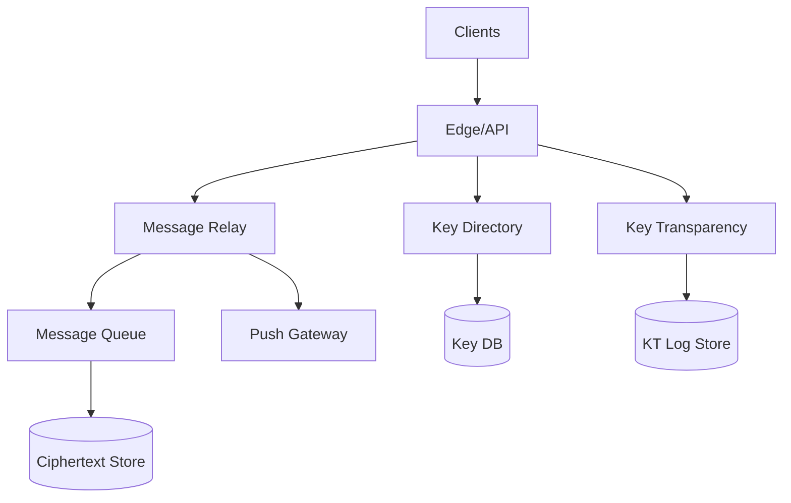
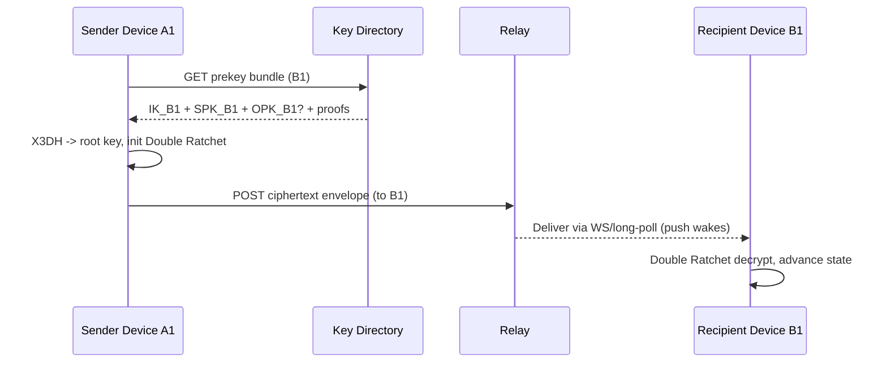

## Overview

End-to-end encrypted (E2EE) messaging is primarily a **key management** problem: safely binding users to long-lived identity keys, exchanging short-lived prekeys for asynchronous session setup, and continuously rotating message keys to achieve **forward secrecy** (and ideally **post-compromise security**) while supporting real-time delivery. The system is challenging because the server must remain untrusted for message content, yet still provide reliable routing, spam/abuse controls, multi-device coordination, and key discovery at massive scale.

This design uses a Signal-style approach: **X3DH-like asynchronous authenticated key agreement** to bootstrap sessions using published prekey bundles, followed by the **Double Ratchet** to derive per-message keys with forward secrecy. Multi-device is modeled explicitly: each device has its own key material and address; senders encrypt to **each recipient device** (and also to their own devices for “self-sync”) so every device stays consistent without the server learning plaintext. To reduce the risk of malicious key substitution by the service, we add **Key Transparency** (append-only log with proofs + gossip).

## Requirements

### Functional Requirements
- Register an account and enroll multiple devices with explicit authorization (approve/deny new device).
- Publish and rotate device key material (identity key, signed prekey, one-time prekeys) for asynchronous session setup.
- Establish encrypted sessions without recipient being online (prekey-based handshake).
- Send and receive E2EE messages supporting multi-device fanout (encrypt once per recipient device).
- Multi-device synchronization of outgoing messages, read receipts, deletions, and reactions via E2EE “self messages”.
- Support group messaging with membership changes and efficient sender fanout (e.g., Sender Keys).
- Provide key verification UX (safety numbers / fingerprints) and notify on key changes.
- Provide key transparency proofs and monitoring hooks to detect server-side key substitution.

### Non-Functional Requirements
- **Scale**: 50M MAU, 10M DAU; peak 250K message sends/sec; average message size 1–8KB ciphertext; device count avg 1.8/user, p95 4 devices/user.
- **Latency**: Send path P50 < 80ms, P99 < 250ms (excluding recipient push latency); prekey fetch P99 < 150ms.
- **Availability**: 99.99% for message relay and key directory; 99.9% acceptable for key transparency proof retrieval (messages still flow).
- **Consistency**:
  - Strong for device list + current signed prekey pointer + one-time prekey consumption.
  - Eventual for message delivery and receipts.
- **Durability**: No loss of uploaded key material; message queue durability >= 24h; ciphertext retention policy configurable (e.g., 7–30 days) with at-least-once delivery.

### Constraints & Assumptions
- Server is untrusted for content, but trusted for availability and basic rate-limiting/abuse controls.
- Clients have secure key storage (Secure Enclave/Keystore where available) but must tolerate device compromise.
- Compliance: minimize stored metadata; encrypt-at-rest everywhere; strict access controls; audit logs.
- Team constraint: prefer managed primitives (KMS/HSM for server signing keys, managed DB/queue) over bespoke crypto services.

## High-Level Architecture



Clients perform all cryptography. The **Key Directory** stores public key bundles (identity keys, signed prekeys, one-time prekeys) and serves them for session setup; it must be strongly consistent for one-time prekey consumption to prevent reuse. The **Message Relay** accepts ciphertext envelopes, fans out to recipient devices, and provides durable delivery via a queue and ciphertext store.

**Key Transparency** reduces trust in the directory by committing device keys into an append-only log; clients fetch inclusion/consistency proofs and optionally gossip to detect equivocation. Push notifications are metadata-only (e.g., “you have a message”), while actual ciphertext is fetched from the relay.

## Component Deep-Dive

### Client Crypto Engine

**Responsibility**: Generate/store keys, perform X3DH-like handshake, run Double Ratchet, encrypt/decrypt messages, and manage device linking and self-sync.

**Key Design Decisions**:
- Per-device addressing: `user_id + device_id` is the cryptographic principal for sessions, enabling clean multi-device fanout and revocation.
- Double Ratchet per peer-device session for forward secrecy and post-compromise security on continued communication.

**Technology Choice**: Signal protocol libraries or audited equivalents; Curve25519 (X25519), Ed25519, HKDF, AEAD (ChaCha20-Poly1305 or AES-256-GCM).

**Scaling Strategy**: Stateless aside from local state; session caches with bounded size (LRU) and periodic backup of ratchet state.

---

### Key Directory Service

**Responsibility**: Register devices, store public identity keys, signed prekeys, and one-time prekeys; serve prekey bundles; enforce authorization and atomic one-time prekey consumption.

**Key Design Decisions**:
- One-time prekeys consumed via conditional write (atomic pop) to avoid reuse under concurrency.
- Device list and key pointers are strongly consistent to prevent split-brain about active devices.

**Technology Choice**: DynamoDB/Cassandra for partitioned key tables; Redis for hot bundle caching; HSM/KMS for server-side signing keys (e.g., sender certificates, transparency log keys).

**Scaling Strategy**: Partition by `user_id` (and `device_id`); read-heavy via cache; write amplification controlled by batching prekey uploads.

---

### Message Relay Service

**Responsibility**: Accept ciphertext envelopes, authenticate sender (without learning plaintext), fan out to recipient devices, dedupe, persist, and deliver via long-poll/WebSocket and push.

**Key Design Decisions**:
- At-least-once delivery with client-side dedupe using `message_id` and per-conversation sequence numbers.
- “Sealed sender”-style option: server can validate sender authorization without learning sender identity in the envelope metadata (privacy win, more complexity).

**Technology Choice**: Stateless service behind L7 LB; Kafka/Pulsar/SQS for queue; object store (S3/GCS) or Cassandra for ciphertext retention.

**Scaling Strategy**: Horizontal scale by partitioning on recipient device; backpressure via queue; separate ingest and delivery workers.

---

### Key Transparency Service

**Responsibility**: Maintain an append-only log of device key registrations/updates, provide proofs (inclusion + consistency), and support client monitoring/gossip.

**Key Design Decisions**:
- Log-backed verification so clients can detect malicious directory behavior (key substitution/equivocation).
- Separate availability domain: messages can flow even if KT proof fetch is delayed (clients can warn but not block by default).

**Technology Choice**: Trillian-style Merkle log or equivalent; append-only storage; signed tree heads with HSM-protected log signing key.

**Scaling Strategy**: Append throughput scaled by sharded logs (by user_id hash) with periodic signed checkpoints.

## Data Model

### Storage Schema

**`users`**
- `user_id` (PK)
- `created_at`
- `status` (active/disabled)

**`devices`**
- `user_id` (PK)
- `device_id` (SK)
- `device_public_identity_key` (Ed25519)
- `device_public_identity_key_fp` (fingerprint)
- `aik_signature` (optional: if using account identity key to authorize device keys)
- `capabilities` (protocol versions, sealed-sender support)
- `created_at`, `last_seen_at`
- `revoked_at` (nullable)

**`signed_prekeys`**
- `user_id` (PK)
- `device_id` (SK)
- `spk_id`
- `spk_public` (X25519)
- `spk_signature` (by device identity key)
- `expires_at`

**`one_time_prekeys`**
- `user_id` (PK)
- `device_id` (SK)
- `opk_id`
- `opk_public` (X25519)
- `status` (available/claimed)
- `claimed_at` (nullable)

**`messages`** (ciphertext only)
- `recipient_user_id` (PK)
- `recipient_device_id` (SK)
- `message_id` (UUID)
- `sender_hint` (optional, privacy-preserving token)
- `ciphertext` (bytes)
- `created_at`
- `ttl_expires_at`

**`kt_log_entries`**
- `log_shard` (PK)
- `seq` (SK)
- `user_id`, `device_id`
- `device_public_identity_key_fp`, `spk_id`
- `entry_hash`
- `signed_tree_head_ref`

### Data Flow



Multi-device fanout is identical: the sender repeats “bundle fetch + session init (if needed) + encrypt” per recipient device, then submits a single request containing multiple per-device ciphertext blobs.

## API Design

### Key Directory APIs (REST or gRPC)

**Register/Update Device**
- `POST /v1/users/{user_id}/devices`
  - Request: `{ device_id, device_public_identity_key, aik_signature?, capabilities }`
  - Response: `{ status, verification_required: boolean }`
  - Errors: `409 DEVICE_EXISTS`, `401 UNAUTHORIZED`, `422 INVALID_KEY`

**Upload Prekeys**
- `PUT /v1/users/{user_id}/devices/{device_id}/prekeys`
  - Request: `{ signed_prekey: {spk_id, spk_public, spk_signature, expires_at}, one_time_prekeys: [{opk_id, opk_public}] }`
  - Response: `{ accepted_opk_count, server_time }`
  - Idempotency: `Idempotency-Key` header + `(spk_id, opk_id)` uniqueness
  - Errors: `409 DUPLICATE_ID`, `429 RATE_LIMITED`

**Fetch Prekey Bundle**
- `GET /v1/prekey-bundles/{user_id}/{device_id}`
  - Response: `{ identity_key, signed_prekey, one_time_prekey?, device_list_version, kt_proof? }`
  - Errors: `404 DEVICE_NOT_FOUND`, `410 DEVICE_REVOKED`

**List Devices (strongly consistent)**
- `GET /v1/users/{user_id}/devices?min_version=...`
  - Response: `{ devices: [...], device_list_version }`
  - Errors: `503 TEMP_UNAVAILABLE`

### Message Relay APIs

**Send Message (multi-device)**
- `POST /v1/messages:send`
  - Request:
    ```json
    {
      "message_id": "uuid",
      "conversation_id": "opaque",
      "recipients": [
        {"user_id":"U2","device_id":"D1","ciphertext":"...","protocol":"signal-vX"},
        {"user_id":"U2","device_id":"D2","ciphertext":"...","protocol":"signal-vX"}
      ],
      "sender_auth": {"type":"sealed_sender","token":"..."}
    }
    ```
  - Response: `{ accepted: [...], rejected: [{user_id, device_id, error}] }`
  - Idempotency: `message_id` dedupe (server stores seen ids per sender for TTL)
  - Errors: `413 PAYLOAD_TOO_LARGE`, `429 RATE_LIMITED`, `409 STALE_DEVICE_LIST` (include latest `device_list_version`)

**Fetch Pending Messages**
- `GET /v1/messages:pending?device_id=...&limit=...`
  - Response: `{ messages: [{message_id, ciphertext, created_at}], next_cursor }`

**Acknowledge / Receipts**
- `POST /v1/messages:ack`
  - Request: `{ message_ids: [...] }`
  - Receipts are sent as normal E2EE messages (preferred) to avoid server learning read state.

## Scaling & Performance

### Bottleneck Analysis
- **Prekey bundle reads**: spikes when many new conversations start or sessions reset.
  - Mitigation: cache bundles (excluding OPK) in Redis; keep OPKs in strongly consistent store; allow “no OPK” fallback.
- **Fanout amplification**: multi-device multiplies ciphertext writes (recipient devices + sender’s own devices).
  - Mitigation: batch send API; queue-based fanout workers; cap max devices/user (soft limit + warnings).
- **Long-lived connections**: WebSockets for delivery can dominate resources.
  - Mitigation: separate delivery tier, connection sharding, efficient binary framing, autoscale on connection count.

### Horizontal Scaling
- **Edge/API**: scale by QPS, stateless.
- **Key Directory**: partition by `user_id`; strong consistency for OPK claim via conditional update.
- **Relay**: partition by recipient device; queue partitions aligned to `(user_id, device_id)` hash.
- **Storage**: ciphertext store keyed by recipient device; TTL-based expiry; compaction tuned for write-heavy workloads.

### Caching Strategy
- Cache `devices` list and `signed_prekey` per `(user_id, device_id)` for minutes; invalidate on key rotation/device changes via versioning (`device_list_version`).
- Do **not** cache one-time prekeys as “available” without re-check; OPK claim must be transactional.
- Client-side caching: keep established sessions; only fetch prekeys on first contact, after ratchet state loss, or after key change alerts.

## Trade-offs & Alternatives

### Key Trade-offs Made
- **Chosen**: Encrypt per recipient device (and per own device for sync).
  - **Sacrificed**: Higher CPU/bandwidth and server write amplification.
  - **Why**: Clean security boundaries and revocation; no shared “account key” required for routine messaging.
- **Chosen**: Key Transparency as an additional subsystem.
  - **Sacrificed**: Operational complexity and proof-fetch latency.
  - **Why**: Defends against a powerful but realistic threat (malicious/compromised directory) with measurable security gains.
- **Chosen**: Strong consistency for device list + OPK claims.
  - **Sacrificed**: Higher write latency/cost vs fully eventual stores.
  - **Why**: Prevents key reuse and reduces key-change races that break UX and security expectations.

### Alternative Approaches
- **MLS (Messaging Layer Security)** for groups and multi-device:
  - Pros: Built-in group key management, efficient large groups.
  - Cons: Ecosystem maturity and migration complexity; still needs identity/key directory and transparency story.
- **Account-wide shared private identity key across devices** (copy same IK everywhere):
  - Pros: Simplifies verification (“one safety number”).
  - Cons: Larger blast radius on device compromise; harder revocation semantics; often discouraged unless paired with strong device attestation.
- **Server-assisted re-encryption (“key escrow” or KMS)**:
  - Pros: Easier history sync and multi-device.
  - Cons: Breaks E2EE threat model; unacceptable for Signal-style guarantees.

## Failure Modes & Mitigations

### Failure Scenarios
- **Scenario**: One-time prekeys depleted for a device.
  - **Impact**: New sessions fall back to signed prekey only (reduced FS for the first message).
  - **Detection**: Prekey stock metric per device; client receives “OPK unavailable” flag.
  - **Mitigation**: Background prekey replenishment; server nudges via push; throttle devices that never replenish.

- **Scenario**: Malicious key substitution by directory (MITM).
  - **Impact**: Sender encrypts to attacker-controlled keys; confidentiality loss.
  - **Detection**: Key transparency proof mismatch, inconsistent tree heads via gossip, unexpected key change notifications.
  - **Mitigation**: Enforce KT proofs for high-risk accounts, show blocking warnings, out-of-band verification, automated monitors.

- **Scenario**: Replay/duplicate message delivery (at-least-once).
  - **Impact**: Duplicate UI events or ratchet desync if mishandled.
  - **Detection**: Client sees repeated `message_id` or duplicate ratchet message numbers.
  - **Mitigation**: Client dedupe; Double Ratchet skipped-message key cache with limits.

- **Scenario**: Device list race (sender uses stale device list; new device misses messages).
  - **Impact**: New device not synced; user confusion.
  - **Detection**: Relay returns `409 STALE_DEVICE_LIST` with latest version; periodic device list refresh.
  - **Mitigation**: Sender retries with updated list; “self-sync” also helps populate other own devices.

- **Scenario**: Compromised device key.
  - **Impact**: Past/future messages to that device at risk.
  - **Detection**: User reports, anomaly signals, attestation failures (if supported).
  - **Mitigation**: Device revocation; rotate sessions; notify contacts; encourage safety-number re-verify.

### Disaster Recovery
- **RTO/RPO**: RTO 30 minutes (relay + directory), RPO near-zero for key material; ciphertext RPO up to a few minutes acceptable.
- **Backup strategy**: Continuous backups for Key DB and KT log; multi-region replication for directory metadata; ciphertext store with lifecycle policies.
- **Failover procedures**: Active-active for relay; active-passive for strongly consistent key operations if needed; clients retry with exponential backoff and alternate region endpoints.

## Operational Considerations

### Monitoring & Alerting
- Key metrics:
  - Prekey stock: OPKs/device (p50/p95), SPK expiry horizon.
  - Key directory: P99 latency, conditional write failure rate, error codes by type.
  - Relay: send accept rate, queue depth/lag, delivery latency, WS connection count.
  - KT: append rate, proof generation latency, inconsistent tree head reports (from monitors).
- Alerts:
  - OPK stock < threshold for >N minutes (risk of degraded FS).
  - Spike in key changes for a user cohort (possible attack/bug).
  - Queue lag exceeding SLA (delivery delay).

### Deployment Strategy
- Protocol versioning: include `protocol_version` in envelopes and bundles; maintain backward compatibility windows.
- Safe rollout: canary by region/user hash; shadow-read KT proofs before enforcing.
- Rollback: server-side feature flags; clients must tolerate downgrade (never remove crypto support without long deprecation).

## References & Further Reading

- Signal Protocol overview: https://signal.org/docs/
- X3DH (Extended Triple Diffie-Hellman): https://signal.org/docs/specifications/x3dh/
- Double Ratchet: https://signal.org/docs/specifications/doubleratchet/
- Sealed Sender: https://signal.org/blog/sealed-sender/
- Key Transparency (general concept): Google Key Transparency, CONIKS (historical): https://coniks.cs.princeton.edu/
- MLS (Messaging Layer Security): https://datatracker.ietf.org/wg/mls/about/