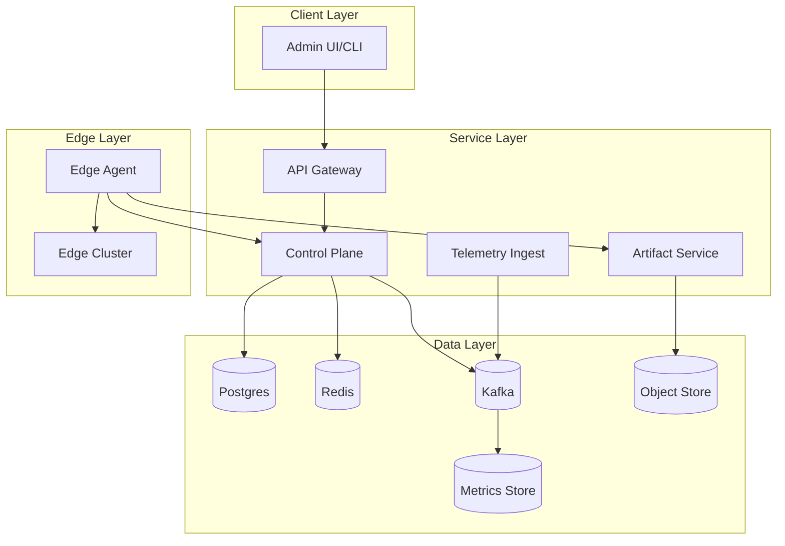
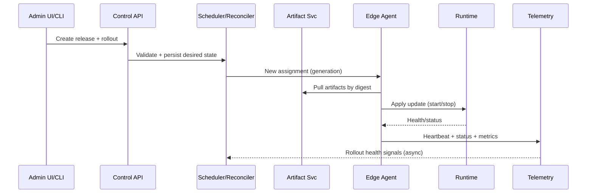

## Overview

An edge compute platform deploys and operates containerized workloads across thousands of geographically distributed sites (e.g., cell towers), where connectivity is intermittent, hardware is heterogeneous, and on-site operations are expensive. The core challenge is achieving “cloud-like” rollout, observability, and safety guarantees while assuming the edge can be offline, constrained, and occasionally compromised.

The key insight is to split the system into a highly available cloud control plane (desired state, scheduling, policy, audit) and a resilient edge data plane (local orchestration, caching, autonomous healing). The edge must be able to keep running safely without the control plane, while the control plane must scale to large fleets and high telemetry volume without coupling critical rollout paths to noisy operational data.

## Requirements

### Functional Requirements
- Register and authenticate edge locations and nodes (zero-touch provisioning) with strong identity.
- Deploy containerized workloads (images + config + secrets) with progressive rollouts (canary, blue/green).
- Support placement constraints (hardware arch, GPU, locality, labels), priorities, and resource limits.
- Provide lifecycle management: start/stop, version pinning, rollback, health checks, and auto-repair.
- Collect telemetry (metrics, logs, heartbeats) and surface fleet health, per-site status, and alerts.
- Enable remote operations: runbook actions (cordon/drain node, restart workload), debug access with auditing.
- Enforce multi-tenant isolation (team/project), RBAC, quotas, and policy-as-code for deployments.
- Support offline operation: edge continues with last known desired state; supports deferred updates.

### Non-Functional Requirements
- **Scale**:
  - 10,000 edge locations, ~3 nodes/location (30,000 nodes)
  - 50–200 containers/location (0.5M–2M total containers)
  - Control-plane API: 5k RPS peak (deploy/status/ops)
  - Telemetry ingest: 200k events/sec peak (metrics/logs/heartbeats)
- **Latency**:
  - Deploy request accepted: P50 < 200ms, P99 < 800ms (control plane)
  - Config propagation to online edge: P50 < 5s, P99 < 30s
  - Telemetry query (last 15m, per site): P50 < 500ms, P99 < 2s
- **Availability**:
  - Control plane: 99.99% (multi-region)
  - Edge execution: best-effort; workloads must tolerate site isolation
- **Consistency**:
  - Strong for config mutations (deploy intent, RBAC, policy, audit)
  - Eventual for edge status/telemetry; tolerate delayed/out-of-order updates
- **Durability**:
  - Deploy/audit data: RPO ≤ 5 minutes
  - Telemetry: acceptable partial loss (e.g., ≤ 1 minute during outages)

### Constraints & Assumptions
- Edge connectivity may be NATed, intermittent, and low bandwidth; assume outbound-only is always possible.
- Hardware is heterogeneous (x86/ARM, optional GPU), limited disk; must support local caching with quotas.
- Security posture: assume edge can be physically accessed; secrets must be protected and rotated.
- Team size: small platform team (6–10 engineers); prefer managed services where possible.
- Compliance: audit logs for all ops actions; encryption in transit and at rest.

## High-Level Architecture

The cloud control plane owns desired state (what should run where), policy enforcement, rollout orchestration, and audit. Edge agents maintain a persistent connection to the control plane (outbound mTLS) to receive assignments and report status, but they can continue executing the last known desired state when disconnected.

Telemetry is decoupled via a streaming backbone: edge agents emit events to an ingest service which publishes to Kafka. Downstream consumers aggregate to a metrics store (and optionally log storage). This prevents high-volume telemetry from impacting rollout correctness and keeps the control plane responsive under load.

## Component Deep-Dive

### Control Plane
**Responsibility**: Store desired state, validate policy/RBAC, compute placement, orchestrate rollouts, and reconcile actual vs desired.

**Key Design Decisions**:
- Separate “desired state” from “observed state”: desired state in Postgres (strong), observed state via event stream (eventual) to avoid lock contention and hot rows.
- Reconciliation-driven model: controllers continually converge the fleet to desired state; supports retries, partial failures, and offline edges.

**Technology Choice**: Go services + Postgres (partitioned), Redis for short-lived caches/locks, Kafka for events. Optional: Kubernetes controllers pattern for internal orchestration.

**Scaling Strategy**: Stateless API pods behind L7 LB; shard reconciliation by `location_id` hash; use work queues with backpressure; partition Postgres by tenant and time for large audit tables.

### Edge Agent
**Responsibility**: Site-local control loop that authenticates, pulls assignments, manages runtime, caches artifacts, and reports health.

**Key Design Decisions**:
- Outbound-only connectivity: agent initiates mTLS sessions; no inbound ports required at the site.
- Local autonomy: agent persists desired state and last-good artifacts; can roll back locally if health gates fail.

**Technology Choice**: Rust or Go daemon with embedded SQLite for local state; uses containerd directly or a lightweight K8s distro (k3s) depending on complexity.

**Scaling Strategy**: Horizontal by sites (independent); per-site rate limiting and batching for telemetry; adaptive reporting (fast when unstable, slow when steady).

### Artifact Service (Registry + Distribution)
**Responsibility**: Store images/config bundles, sign/verify artifacts, and distribute efficiently to edges.

**Key Design Decisions**:
- Content-addressed artifacts: immutable blobs referenced by digest; simplifies caching and integrity.
- Signed deployments: require signature verification at the edge before activation (supply chain defense).

**Technology Choice**: OCI registry backed by object storage + CDN; cosign/Sigstore-style signing; optional local per-site registry mirror.

**Scaling Strategy**: CDN offload for hot artifacts; regional caches; deduplicate by digest; enforce per-site disk quotas and LRU eviction.

### Telemetry Ingest & Observability
**Responsibility**: Accept heartbeats, metrics, logs, and events; provide query and alerting surfaces.

**Key Design Decisions**:
- Stream-first ingestion: write once to Kafka; multiple consumers for metrics aggregation, alert evaluation, and long-term storage.
- Cardinality controls: enforce label allowlists and sampling to prevent TSDB blowups.

**Technology Choice**: Kafka + Prometheus remote-write compatible ingest, VictoriaMetrics/Mimir/Thanos for metrics, Loki/Opensearch for logs (optional).

**Scaling Strategy**: Partition Kafka by `location_id`; autoscale ingest by CPU/network; tiered storage; downsample older metrics.

### Policy, Identity & Access
**Responsibility**: AuthN/Z, key management, secrets distribution, and enforcement of deployment policies.

**Key Design Decisions**:
- Hardware-backed identity when available: TPM-based device keys; otherwise secure enrollment tokens with rotation.
- Least-privilege and separation: per-tenant RBAC, signed approvals for privileged ops (e.g., debug shell).

**Technology Choice**: SPIFFE/SPIRE for workload identity (optional), cloud KMS for CA and secret envelope encryption, OPA for policy-as-code.

**Scaling Strategy**: Cache authorization decisions (short TTL); precompute policy evaluation for deployments; asynchronous secret rotation with staged rollout.

## Data Model

### Storage Schema

**Postgres (control plane)**
- `tenants`
  - `tenant_id (pk)`, `name`, `created_at`
- `locations`
  - `location_id (pk)`, `tenant_id (fk)`, `region`, `labels (jsonb)`, `created_at`
- `nodes`
  - `node_id (pk)`, `location_id (fk)`, `arch`, `capacity_cpu`, `capacity_mem`, `labels (jsonb)`, `status`, `last_seen_at`
- `deployments`
  - `deployment_id (pk)`, `tenant_id (fk)`, `name`, `policy_ref`, `strategy`, `created_by`, `created_at`
- `releases`
  - `release_id (pk)`, `deployment_id (fk)`, `image_digest`, `config_digest`, `secrets_ref`, `desired_replicas`, `constraints (jsonb)`, `version`, `created_at`
- `assignments`
  - `assignment_id (pk)`, `release_id (fk)`, `location_id (fk)`, `desired_state (jsonb)`, `generation`, `updated_at`
- `rollouts`
  - `rollout_id (pk)`, `release_id (fk)`, `phase`, `canary_pct`, `health_gate`, `status`, `started_at`, `completed_at`
- `audit_log` (time-partitioned)
  - `event_id (pk)`, `tenant_id`, `actor`, `action`, `resource`, `request (jsonb)`, `created_at`

**Kafka (events)**
- `edge.heartbeat` (key: `location_id`)
- `edge.status` (key: `location_id`)
- `edge.logs` (key: `location_id`, sampled)
- `edge.metrics` (key: `location_id`)
- `control.rollout_events` (key: `deployment_id`)

**Edge local (SQLite)**
- `local_desired_state(generation, blob, applied_at)`
- `artifact_cache(digest, path, size, last_used_at)`
- `local_audit(event_id, action, ts)`

### Data Flow

Key operations:
- **Deploy**: write desired state (strong) → compute assignments → agents fetch artifacts → runtime applies → telemetry confirms health gates → rollout advances/halts.
- **Status**: agents emit periodic state; control plane materializes a read model (e.g., in TSDB/Elastic + Postgres summary tables) for fast UI queries.
- **Rollback**: control plane updates assignment generation to prior release; edge agent switches to last-known-good (kept locally).

## API Design

### Control APIs (REST)
- `POST /v1/tenants/{tenantId}/locations`
  - Request: `{ "region": "us-east-1", "labels": {"tower":"A12"} }`
  - Response: `{ "locationId": "...", "enrollmentToken": "...", "expiresAt": "..." }`
  - Errors: `409` (duplicate), `403` (policy), `429` (rate limit)

- `POST /v1/tenants/{tenantId}/deployments`
  - Request: `{ "name":"video-transcode", "policyRef":"opa://policies/edge-default", "strategy":"canary" }`
  - Response: `{ "deploymentId":"..." }`
  - Idempotency: `Idempotency-Key` header required for create APIs.

- `POST /v1/deployments/{deploymentId}/releases`
  - Request: `{ "imageDigest":"sha256:...", "configDigest":"sha256:...", "constraints":{...}, "desiredReplicas": 3 }`
  - Response: `{ "releaseId":"...", "version": 17 }`
  - Concurrency: `If-Match: version` for updates.

- `POST /v1/releases/{releaseId}/rollouts`
  - Request: `{ "type":"canary", "steps":[{"percent":5},{"percent":25},{"percent":100}], "healthGate":{"errorRateMax":0.01,"p99MaxMs":200} }`
  - Response: `{ "rolloutId":"...", "status":"running" }`

- `GET /v1/locations/{locationId}/status`
  - Response: `{ "nodes":[...], "workloads":[...], "lastSeenAt":"..." }`
  - Consistency: eventual; include `stalenessSeconds`.

### Edge APIs (gRPC recommended)
- `RegisterNode(EnrollToken, NodeInfo) -> NodeIdentity`
- `PollAssignments(NodeIdentity, lastGeneration) -> AssignmentDelta`
- `ReportStatus(NodeIdentity, StatusBatch) -> Ack`
- `FetchSecrets(NodeIdentity, SecretRefs) -> EncryptedSecrets` (short-lived, rotated)

**Error handling**
- Use structured errors: `{code, message, retryable, details}`
- Retryable errors include backoff hints; agents implement exponential backoff with jitter.

**Idempotency considerations**
- All mutating admin requests accept `Idempotency-Key`.
- Edge `ReportStatus` is idempotent by `(node_id, sequence)`; server deduplicates within a retention window.

## Scaling & Performance

### Bottleneck Analysis
- **Telemetry hot path**: high event volume can overwhelm storage/query.
  - Mitigate with Kafka buffering, sampling, aggregation at edge, and cardinality enforcement.
- **Control-plane reconciliation**: large fleet updates can spike CPU/DB writes.
  - Mitigate with rollout batching, per-location work queues, and storing only desired-state deltas.
- **Artifact distribution**: simultaneous rollouts can stampede origin.
  - Mitigate with CDN, prewarming, and local edge caching/mirroring.

### Horizontal Scaling
- **API Gateway + Control APIs**: stateless scale-out; cache reads; partition DB and use read replicas for UI queries.
- **Scheduler/Reconciler**: shard by `location_id` or `deployment_id`; use leader election per shard; bounded concurrency.
- **Telemetry ingest**: scale by Kafka partitions; separate consumers for metrics vs logs; isolate noisy tenants with quotas.

**Partitioning strategy**
- Postgres: partition `audit_log` by time; partition `assignments` by `tenant_id` or hashed `location_id` for hot fleets.
- Kafka: partition by `location_id` for ordering within a site.

### Caching Strategy
- **Redis**:
  - Cache authz decisions (TTL 30–120s)
  - Cache deployment/read models (TTL 5–30s) for UI
  - Distributed locks for rollout step transitions
- **Edge cache**:
  - Artifact blob cache by digest (LRU + quota)
  - Config bundle cache; retain last-known-good for rollback
- **Invalidation**:
  - Desired state uses version/generation; cache keys include version.
  - Push invalidation via Kafka events to refresh read models.

## Trade-offs & Alternatives

### Key Trade-offs Made
- **Chosen**: Decoupled telemetry pipeline (Kafka + TSDB) from control-plane DB  
  **Sacrificed**: Simpler single-database design  
  **Why**: Prevents telemetry load from degrading deploy/ops correctness at scale.

- **Chosen**: Outbound-only agent connectivity with polling/streaming gRPC  
  **Sacrificed**: Instant push from cloud to edge without persistent sessions  
  **Why**: Works through NAT/firewalls, simplifies security and ops.

- **Chosen**: Immutable, digest-addressed artifacts + signature verification  
  **Sacrificed**: Convenience of mutable “latest” tags  
  **Why**: Enables reproducibility, safe caching, and strong supply-chain guarantees.

- **Chosen**: Eventual consistency for status and telemetry  
  **Sacrificed**: Perfect real-time fleet views  
  **Why**: Edge is inherently disconnected; correctness must not depend on synchronous status.

### Alternative Approaches
- **Full Kubernetes everywhere (central managed K8s + edge K8s federation)**: strong ecosystem, but federation complexity and intermittent connectivity make consistency and operations hard.
- **Custom container runtime without K8s**: simpler footprint, but reinvents scheduling, health, and workload primitives; harder multi-tenant isolation and ecosystem integration.
- **P2P artifact distribution between edges**: reduces origin load, but increases security risk and operational complexity (NAT traversal, trust, debugging).

## Failure Modes & Mitigations

### Failure Scenarios
- **Scenario**: Edge location loses connectivity for hours  
  **Impact**: No new deploys; stale status; workloads should continue  
  **Detection**: Missed heartbeats; `last_seen_at` breaches threshold  
  **Mitigation**: Edge runs last desired state; local alerts; resume reconciliation when back online.

- **Scenario**: Bad release causes crash loop on subset of sites  
  **Impact**: Partial outage, potential widespread if rollout continues  
  **Detection**: Health gate failures (error rate, restart count), canary alarms  
  **Mitigation**: Automatic rollout halt; auto-rollback to last-known-good; require manual approval to proceed.

- **Scenario**: Artifact origin/CDN outage  
  **Impact**: New rollouts stall; existing workloads unaffected  
  **Detection**: Increased fetch failures, CDN health checks  
  **Mitigation**: Multi-region origins, multi-CDN, edge caches retain artifacts; staggered prefetch.

- **Scenario**: Control plane region outage  
  **Impact**: Admin actions degraded; agents may fail over  
  **Detection**: Synthetic checks, SLO burn alerts  
  **Mitigation**: Active-active multi-region control plane; agents fail over to secondary endpoint; preserve quorum for config DB.

- **Scenario**: Compromised edge node attempts to impersonate others  
  **Impact**: Unauthorized deploy/secret access, telemetry poisoning  
  **Detection**: Identity anomalies, cert misuse, unusual access patterns  
  **Mitigation**: Per-node mTLS identities, short-lived certs, attestation (TPM), revoke node certs, tenant-scoped authorization.

### Disaster Recovery
- **RTO/RPO**: RTO 30 minutes, RPO 5 minutes for desired state/audit; telemetry best-effort.
- **Backup strategy**: Continuous WAL archiving for Postgres + daily full backups; object store versioning; Kafka topic retention with mirror cluster for critical topics.
- **Failover procedures**: Automated regional failover for API + control services; promote DB replica; agents rotate endpoints via DNS/endpoint list.

## Operational Considerations

### Monitoring & Alerting
- **Control plane**: API P99, error rate, DB latency, queue depth, reconciliation lag, rollout stuck rate.
- **Edge fleet**: % locations online, heartbeat lag distribution, deployment success rate, restart loops, disk pressure (artifact cache).
- **Telemetry**: ingest lag (Kafka), dropped events, TSDB write failures, high-cardinality rejection counts.
- **Alert thresholds**:
  - Control API error rate > 1% for 5m
  - Reconciliation lag P99 > 60s for 10m
  - Offline locations > 2% (excluding maintenance windows)

### Deployment Strategy
- **Control plane**: canary per region, then global; schema changes via expand/contract migrations; feature flags for rollout logic.
- **Edge agent**: staged rollout by rings (1%, 10%, 50%, 100%); auto-rollback on crash rate; signed binaries and attested updates.
- **Rollback procedures**: instant disable of problematic release; revert assignment generation; keep last-known-good artifacts pinned on edge.

## References & Further Reading
- Kubernetes patterns (controllers/reconciliation): https://kubernetes.io/docs/concepts/architecture/controller/
- OCI image spec: https://github.com/opencontainers/image-spec
- Sigstore/cosign (artifact signing): https://docs.sigstore.dev/
- AWS Greengrass (edge fleet management concepts): https://docs.aws.amazon.com/greengrass/
- Envoy xDS (config distribution patterns): https://www.envoyproxy.io/docs/envoy/latest/api-docs/xds_protocol
- Kafka at scale (streaming backbone): https://kafka.apache.org/documentation/