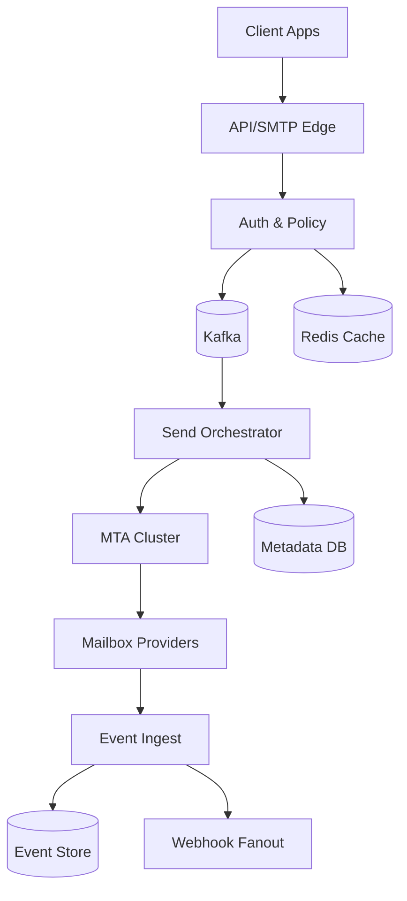
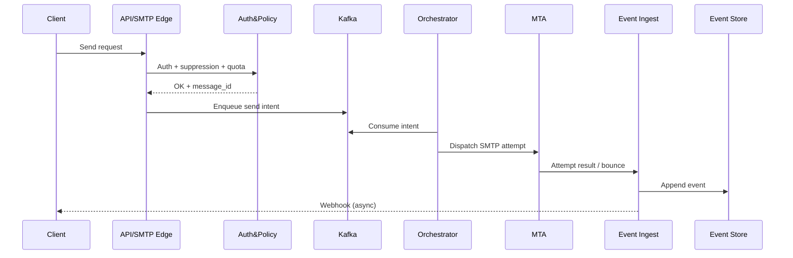

## Overview

An email delivery platform (SendGrid-like) must accept high-throughput send requests, render personalized content, and deliver mail reliably while protecting sender reputation. The hard part is that “success” isn’t just throughput: it’s sustained inbox placement, which depends on IP/domain reputation, complaint rates, bounce handling, and tight compliance controls (unsubscribe, suppression, auditing).

The key insight is to decouple “accepting send intent” from “attempting delivery” via an event-driven pipeline. This enables per-tenant policy enforcement, adaptive rate control per domain/IP, deterministic idempotency, and robust post-delivery processing (bounces, feedback loops, opens/clicks) without blocking the hot path.

## Requirements

### Functional Requirements
- Accept email send requests via REST API and SMTP relay (authenticated tenants).
- Support templates, substitutions, attachments, and per-recipient personalization.
- Manage IP pools (shared/dedicated), warm-up schedules, and adaptive routing based on reputation.
- Process bounces (hard/soft), spam complaints (FBL), unsubscribes, and maintain suppression lists.
- Provide delivery event webhooks (delivered, deferred, bounced, complained, opened, clicked).
- Expose analytics (by campaign, domain, IP pool, time window) and searchable event logs.
- Enforce per-tenant rate limits, quotas, and compliance policies (CAN-SPAM/GDPR basics).
- Provide operational tooling: message trace, replay (safe), and incident kill-switch per tenant/campaign.

### Non-Functional Requirements
- **Scale**: 50K tenants; 10M daily active senders; peak 200K emails/sec ingest; 2M events/sec telemetry (opens/clicks can dominate); ~5–20TB/day event data at scale.
- **Latency**: Send API P50 < 50ms, P99 < 200ms (acknowledging async delivery); webhook fanout P99 < 5s from event ingestion.
- **Availability**: 99.99% for send ingestion; 99.9% for analytics dashboards; no single-region dependency for ingest.
- **Consistency**: Strong consistency for suppression checks and idempotent acceptance; eventual consistency for analytics aggregates.
- **Durability**: No accepted message loss (RPO≈0 for accepted sends via durable queue); telemetry loss tolerated up to 0.1% during regional incidents with backfill.

### Constraints & Assumptions
- Multi-tenant, untrusted inputs; strict isolation in quotas and suppression.
- Compliance: store minimal PII; support data deletion requests; encryption in transit/at rest.
- Cloud-based, 2-region active-active for ingest; team size ~8–12 engineers; cost sensitivity favors commodity MTAs + managed Kafka/Postgres where possible.
- Network access to major mailbox providers; ability to manage DNS (SPF/DKIM/DMARC) for platform domains and optionally customer domains.

## High-Level Architecture



The system separates the synchronous “accept” path (API/SMTP Edge → Auth/Policy → durable queue) from asynchronous delivery (Send Orchestrator → MTA). This ensures predictable API latency and prevents downstream provider throttling from cascading back to clients.

All post-delivery signals (SMTP responses, bounces, complaints, engagement) flow through a unified Event Ingest pipeline into an append-only Event Store for auditability and analytics, and into Webhook Fanout for near-real-time customer updates.

## Component Deep-Dive

### API/SMTP Edge

**Responsibility**: Authenticate tenants, validate payloads, apply idempotency, and enqueue send intents.

**Key Design Decisions**:
- Use a single “accept contract” returning `message_id` after durable enqueue to guarantee no accepted-loss.
- Enforce idempotency with a tenant-scoped `Idempotency-Key` (REST) and `X-Message-Id` (SMTP optional) to prevent duplicates on retries.

**Technology Choice**: Go/Java service behind L7 load balancer; SMTP edge via Haraka/Postfix frontends or custom Go SMTP server; Redis for hot auth cache.

**Scaling Strategy**: Stateless horizontal scale; shard idempotency keys by tenant in Redis with write-through to DB for audit.

### Auth & Policy (Quota, Suppression, Compliance)

**Responsibility**: Validate API keys/OAuth, check quotas, rate limits, suppression/unsubscribe, and policy rules.

**Key Design Decisions**:
- Strongly consistent suppression checks on the accept path to avoid sending to unsubscribed users.
- Hierarchical limits: tenant → campaign → domain, plus adaptive backpressure signals from delivery.

**Technology Choice**: Redis for rate limiting (token buckets), Postgres for durable policy/suppression source of truth, with Redis caches for hot keys.

**Scaling Strategy**: Partition suppression by tenant; cache negative lookups briefly (e.g., 60s) while ensuring unsubscribe writes invalidate.

### Send Orchestrator (Routing, Reputation, Scheduling)

**Responsibility**: Consume send intents, render templates, choose IP pool/domain, schedule/warm-up, and dispatch to MTAs with adaptive rate control.

**Key Design Decisions**:
- Separate “intent” from “attempts”: orchestrator records attempts, retries with exponential backoff, and respects provider deferrals.
- Adaptive routing: maintain per-destination-domain concurrency and per-IP sending rates informed by recent bounce/complaint metrics.

**Technology Choice**: Kafka consumer group; Postgres for message metadata/attempt state; Redis for per-domain rate state; optional feature store for reputation signals.

**Scaling Strategy**: Partition Kafka topics by `tenant_id` (and optionally `dest_domain`) to keep ordering where useful; orchestrator workers scale horizontally.

### MTA Cluster (SMTP Delivery)

**Responsibility**: Perform SMTP transactions, DKIM signing, TLS, connection pooling, and capture detailed SMTP responses.

**Key Design Decisions**:
- Use dedicated outbound IP pools with per-provider tuning (connections per domain, TLS requirements, retry codes).
- Keep MTAs as “dumb fast” workers; orchestrator owns policy and retry decisions to avoid divergent logic.

**Technology Choice**: Postfix/PowerMTA-like commercial option, or custom MTA layer + OpenDKIM; local disk spooling disabled or limited (prefer queue durability upstream).

**Scaling Strategy**: Add MTAs per IP pool; autoscale on connection counts and queue lag; isolate noisy tenants via pool assignment.

### Event Ingest + Webhook Fanout

**Responsibility**: Normalize events (delivered/deferred/bounced/complained/open/click), dedupe, persist, and deliver webhooks with retries.

**Key Design Decisions**:
- Treat events as immutable append-only records; build aggregates separately to avoid hot-row contention.
- Webhook delivery is at-least-once with signed payloads and tenant-specific retry policies.

**Technology Choice**: Kafka for event stream; ClickHouse (or Cassandra/Bigtable) for event store; separate webhook dispatcher with Redis-backed retry queues.

**Scaling Strategy**: Partition events by `tenant_id`; webhook workers scale with per-tenant concurrency caps and exponential backoff.

## Data Model

### Storage Schema

**Postgres (metadata / strongly consistent)**
- `tenants(tenant_id, status, plan, created_at)`
- `api_keys(key_id, tenant_id, hashed_secret, scopes, created_at, revoked_at)`
- `messages(message_id, tenant_id, campaign_id, template_id, from_domain, ip_pool_id, status, accepted_at, idempotency_key)`
- `recipients(message_id, rcpt_id, email_hash, dest_domain, personalization_json, status)`
- `attempts(attempt_id, message_id, rcpt_id, mta_id, ip_id, smtp_code, smtp_response, attempted_at)`
- `suppression(tenant_id, email_hash, reason, created_at, source_event_id)`
- `ip_pools(ip_pool_id, tenant_id, type_shared, warmup_policy, status)`
- `ip_reputation(ip_id, window_start, sent, hard_bounce, complaint, deferral, score)` (can be materialized from events)

**ClickHouse (event store / analytics)**
- `events(tenant_id, event_time, message_id, rcpt_id, type, provider, smtp_code, metadata_map)` partitioned by date, ordered by `(tenant_id, event_time)`
- `aggregates_hourly(tenant_id, hour, campaign_id, type, count)`

**Redis (hot state)**
- Rate limit buckets: `rl:{tenant}:{key}`
- Domain throttles: `dom:{dest_domain}:tokens`
- Webhook retry queues: `wh:{tenant}:pending`

### Data Flow



## API Design

### REST

**POST `/v1/messages:send`**
- Headers: `Authorization: Bearer <token>`, `Idempotency-Key: <uuid>`
- Request:
  ```json
  {
    "from": {"email":"noreply@x.com","name":"X"},
    "to": [{"email":"a@example.com","vars":{"first":"A"}}],
    "subject":"Hello {{first}}",
    "template_id":"tpl_123",
    "campaign_id":"cmp_456",
    "ip_pool":"dedicated|shared",
    "track": {"opens":true,"clicks":true},
    "headers": {"X-Custom":"123"}
  }
  ```
- Response `202`:
  ```json
  {"message_id":"msg_abc","accepted_at":"2025-12-17T12:00:00Z"}
  ```
- Errors:
  - `401` invalid auth
  - `409` idempotency conflict (same key, different payload hash)
  - `422` invalid recipient/template
  - `429` rate limited / quota exceeded

**GET `/v1/messages/{message_id}`**
- Returns status summary and last attempt, plus links to event query.

**GET `/v1/events`**
- Query: `tenant_id` implied by auth; filters: `message_id`, `campaign_id`, `type`, `from`, `to`, `cursor`
- Returns paginated events (eventual consistency acceptable).

**POST `/v1/suppressions`**
- Body: `{ "email":"a@example.com", "reason":"manual" }`
- Idempotent by `(tenant_id,email_hash)`.

### Webhooks

**POST `{tenant_webhook_url}`**
- Signed: `X-Signature` (HMAC SHA-256), `X-Event-Id`, `X-Retry-Count`
- At-least-once delivery; tenants must handle duplicates using `event_id`.

### Idempotency Considerations
- REST send uses `Idempotency-Key` stored with payload hash; replay returns same `message_id`.
- SMTP relay supports optional `X-Message-Id`; otherwise dedupe is best-effort by `(tenant, from, to, timestamp bucket)` (documented as non-guaranteed).

## Scaling & Performance

### Bottleneck Analysis
- **Provider throttling/deferrals**: Mitigate with per-domain concurrency limits, adaptive token buckets, and retry scheduling.
- **Event volume (opens/clicks)**: Separate telemetry stream; sample if necessary per tenant plan; use columnar store + batch ingestion.
- **Hot suppression checks**: Cache suppression in Redis keyed by `tenant_id:email_hash` with write-through invalidation.

### Horizontal Scaling
- **Edge**: Stateless; autoscale on RPS and p99 latency.
- **Kafka**: Partition by `tenant_id` (and optionally `dest_domain`) to scale consumers; separate topics for intent vs telemetry.
- **Orchestrator**: Consumer groups scale linearly; isolate “large tenants” into dedicated partitions/pools.
- **MTA**: Scale by adding nodes per IP pool; ensure connection limits per destination domain.
- **Event store**: ClickHouse shards by tenant/time; pre-aggregate hourly/daily tables.

### Caching Strategy
- Cache API key introspection and tenant plan in Redis (TTL ~5m) with revocation versioning.
- Cache templates and compiled render artifacts (TTL ~1–5m) to reduce DB load.
- Cache suppression lookups (TTL ~10m) but invalidate immediately on unsubscribe/complaint events.

## Trade-offs & Alternatives

### Key Trade-offs Made
- **Kafka-based async acceptance** over synchronous SMTP delivery: sacrifices immediate delivery confirmation for stable API latency and backpressure control.
- **Append-only event store** over updating message rows for every event: sacrifices simple “current status” queries but gains write scalability and audit trails.
- **Orchestrator-owned retry logic** over MTA spooling: sacrifices MTA simplicity in some setups but centralizes policy, dedupe, and consistent retry behavior.

### Alternative Approaches
- **Fully managed ESP backbone** (third-party relay): faster to launch, but limits IP reputation control and unit economics at scale.
- **Single DB status model** (update message state per event): simpler schema, but becomes a write hotspot at millions of events/sec.
- **Provider-specific pipelines**: can optimize per mailbox provider, but adds complexity and operational overhead; start generic, then specialize.

## Failure Modes & Mitigations

### Failure Scenarios
- **Kafka cluster degraded**
  - **Impact**: Send acceptance may halt (if no durable enqueue).
  - **Detection**: Queue lag, broker under-replication alerts.
  - **Mitigation**: Multi-AZ Kafka, quotas, backpressure (429), optional local disk buffer on Edge with strict limits.

- **Mailbox provider throttling / temp blocks**
  - **Impact**: Increased deferrals, delayed delivery.
  - **Detection**: Spike in 4xx SMTP codes per domain/IP.
  - **Mitigation**: Adaptive rate reduction, IP pool rotation, warm-up enforcement, automated provider playbooks.

- **Bad tenant causing complaints**
  - **Impact**: Shared IP reputation damage (blast radius).
  - **Detection**: Complaint rate thresholds (e.g., >0.1%) and anomaly detection.
  - **Mitigation**: Isolate to quarantine pool, auto-pause campaign, require dedicated IP for high-risk tenants.

- **Webhook endpoint down**
  - **Impact**: Customer misses near-real-time updates.
  - **Detection**: High 5xx/timeouts per tenant.
  - **Mitigation**: Retry with exponential backoff up to 72h, DLQ + replay endpoint, per-tenant concurrency caps.

- **Suppression inconsistency**
  - **Impact**: Sending to unsubscribed users (compliance risk).
  - **Detection**: Audit checks comparing events vs suppression table; integrity alerts.
  - **Mitigation**: Strong writes for suppression, synchronous check on accept path, versioned caches and invalidation on write.

### Disaster Recovery
- **RTO/RPO**: Ingest RTO 15 min, RPO ~0 for accepted sends; analytics RTO 4 hours, RPO 1 hour acceptable.
- **Backup strategy**: Postgres PITR + daily snapshots; ClickHouse replicated + snapshots; Kafka topic replication + mirror to second region for intent topics.
- **Failover procedures**: DNS/LB shift for Edge; consumers restart in secondary region; IP pools pre-provisioned in both regions (with controlled warm-up).

## Operational Considerations

### Monitoring & Alerting
- Edge: RPS, auth failures, p99 latency, 429 rate.
- Queue: consumer lag by topic/partition, broker health, publish error rate.
- Deliverability: hard bounce %, complaint %, deferral %, inbox placement proxies (if available), per-domain SMTP code distribution.
- MTA: connection counts, TLS success rate, queue depth, per-IP send rate.
- Webhooks: success rate, retry backlog, DLQ size.
- Data: event ingest throughput, ClickHouse merge lag, query p99.

### Deployment Strategy
- Blue/green or canary for Edge and Orchestrator; feature flags for routing algorithms.
- Schema migrations: expand/contract, additive first; backfill asynchronously.
- Rollback: revert stateless services quickly; keep Kafka message formats versioned (schema registry) to allow mixed versions.

## References & Further Reading

- RFC 5321 (SMTP), RFC 5322 (message format)
- RFC 6376 (DKIM), RFC 7208 (SPF), RFC 7489 (DMARC)
- Google Postmaster Tools, Microsoft SNDS (deliverability feedback)
- Kafka Design: Exactly-once semantics (for understanding trade-offs), Schema Registry patterns
- ClickHouse at scale: event ingestion and aggregation patterns (real-world analytics stacks)