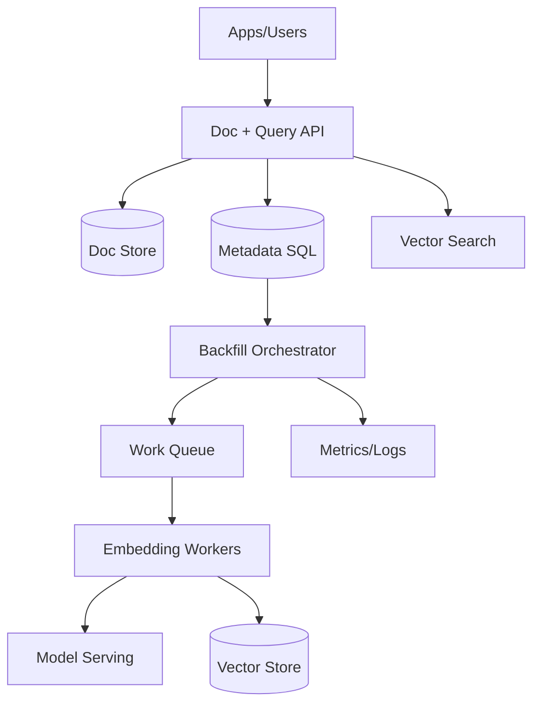
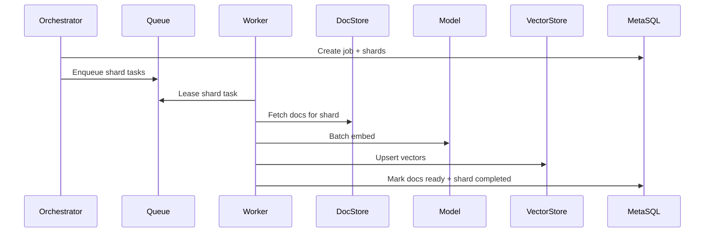

## Overview

Modern search, recommendations, and RAG systems depend on high-quality vector embeddings. The challenge is that embeddings are not static: models are versioned, tokenizers change, preprocessing evolves, and real-world data drifts. For millions (or tens of millions) of documents, regenerating embeddings must be safe, observable, cost-controlled, and compatible with continuous serving traffic.

The key insight is to treat embeddings as *versioned derived data* with an explicit lifecycle: (1) immutable model versions, (2) orchestrated backfills partitioned into idempotent work units, (3) dual-read/dual-write via aliases to enable shadowing and rollback, and (4) drift detection that triggers controlled recomputation rather than ad-hoc “re-embed everything” events.

## Requirements

### Functional Requirements
- Ingest and store documents (create/update/delete) and track their embedding status.
- Generate embeddings for a specified model version for a large corpus (backfill).
- Incrementally update embeddings for documents that changed since the last run.
- Support multiple embedding model versions concurrently and serve queries against a selected “active” version.
- Provide progress, per-shard health, and error reporting for backfill jobs.
- Detect drift (data distribution shift and/or quality regressions) and trigger re-embedding workflows.
- Support safe rollout (shadowing) and rollback of embedding versions without downtime.
- Enforce idempotency so retries do not duplicate or corrupt embeddings.

### Non-Functional Requirements
- **Scale**:
  - Corpus: 10–50M documents initially; design to 200M.
  - Average document: 2–20KB raw; 500–5,000 tokens post-processing.
  - Embedding: 768–3,072 dims; stored as float16 where acceptable.
  - Backfill throughput target: 5k–20k docs/sec sustained (batching + GPU).
  - Steady-state updates: 200–2,000 docs/sec (bursty).
- **Latency**:
  - Online embedding (for newly created/updated docs): P50 < 300ms, P99 < 1.5s (including preprocessing + model).
  - Vector upsert: P50 < 50ms, P99 < 200ms per batch (dependent on store).
  - Control-plane APIs (job status): P99 < 200ms.
- **Availability**:
  - Serving reads (vector search) 99.99%.
  - Embedding pipeline 99.9% (can tolerate brief delays; must not lose work).
- **Consistency**:
  - Strong consistency for metadata/job state (SQL).
  - Eventual consistency for embedding availability (vector store + async pipeline).
  - Read-your-writes for document updates via metadata + version pinning.
- **Durability**:
  - No loss of documents or job state (RPO ~ 0).
  - Embeddings are derivable, but avoid large recompute due to loss; RPO for embeddings <= 24h preferred.

### Constraints & Assumptions
- Team: 4–8 engineers; operate on-call with standard SRE practices.
- Budget: GPU is the primary cost driver; must support throttling and scheduling.
- Compliance: documents may contain PII; encryption at rest/in transit; strict access controls and audit logs.
- Network access to managed vector DB may be constrained; design supports self-hosted (Milvus) or managed (Pinecone).
- Models are served behind a stable inference API; model artifacts and configs are versioned and immutable once promoted.

## High-Level Architecture

The system separates a **serving plane** (document/query APIs + vector search) from a **pipeline plane** (orchestration + workers). Documents live in a durable document store; embedding state and job bookkeeping live in a strongly consistent SQL metadata store. Embeddings are written to a vector store keyed by `(doc_id, model_version)` and served through an alias-based routing layer to support shadowing and safe cutovers.

Backfills are executed as large sets of idempotent work items. Each work item embeds a bounded shard (e.g., `doc_id` range or hashed partition) for a specific model version. Workers batch documents to maximize GPU throughput and write embeddings with compare-and-set semantics to avoid corruption under retries.

## Component Deep-Dive

### Document + Query API

**Responsibility**: Handles document CRUD, exposes embedding/version status, and serves vector-search queries against an active embedding version (via alias).

**Key Design Decisions**:
- Use an **embedding alias** (e.g., `active: "v2025_01"`) so serving can switch versions without rewriting callers.
- Treat document updates as **events**: write document + metadata, emit “doc_changed” to enqueue incremental embedding.

**Technology Choice**: Go/Java/Kotlin service; REST for control + query; gRPC internally; Envoy/NGINX at edge.

**Scaling Strategy**: Stateless horizontal scaling behind L7; cache hot metadata (doc -> current embedding versions) in Redis.

---

### Metadata Store (Job + Embedding State)

**Responsibility**: Source of truth for model versions, aliases, job runs, shard checkpoints, and per-document embedding status.

**Key Design Decisions**:
- Keep job and embedding state in **SQL** to enable transactions, uniqueness constraints, and precise progress queries.
- Use **idempotency keys**: `(model_version, shard_id, attempt)` and `(doc_id, model_version, doc_hash)` to dedupe.

**Technology Choice**: PostgreSQL (managed) or Cloud Spanner for higher scale; read replicas for dashboards.

**Scaling Strategy**: Partition large tables by `model_version` and/or time; use partial indexes for “pending/failed” scans.

---

### Backfill Orchestrator

**Responsibility**: Plans work (shards), enqueues tasks, enforces rate limits/budgets, tracks progress, and performs safe cutover (shadow → active).

**Key Design Decisions**:
- Backfill is **shard-based**, not “one task per doc” to reduce queue overhead and improve locality.
- Support **priority classes** (online updates > backfill) to protect user-facing freshness.

**Technology Choice**: Workflow engine (Temporal) or Kubernetes Jobs + controller; queue: Kafka/SQS/PubSub.

**Scaling Strategy**: Stateless controller with leader election; shard planning is incremental and resumable.

---

### Embedding Workers

**Responsibility**: Fetch documents, preprocess, batch, call model serving, and upsert embeddings + status.

**Key Design Decisions**:
- Batching by **token count** (not doc count) to maximize GPU utilization and avoid OOM.
- Write embeddings with **monotonic versioning**: only update if `(doc_hash != last_embedded_hash)`.

**Technology Choice**: Kubernetes + GPU node pool; worker runtime in Python (PyTorch) or Triton client; optional Ray for distributed execution.

**Scaling Strategy**: Autoscale on queue lag + GPU utilization; use separate pools for “online” vs “bulk backfill”.

---

### Vector Store + Vector Search

**Responsibility**: Stores embeddings and supports KNN search with filters (tenant, language, visibility, timestamp).

**Key Design Decisions**:
- Store embeddings under `(doc_id, model_version)` and query through an **active alias** to avoid data migration during cutover.
- Separate **index build lifecycle** from ingestion: bulk load → build/optimize → serve.

**Technology Choice**:
- Managed: Pinecone/Weaviate Cloud for operational simplicity.
- Self-hosted: Milvus (HNSW/IVF) + object storage for durability.
- Smaller scale: PostgreSQL + pgvector (if QPS and recall needs allow).

**Scaling Strategy**: Shard by `tenant_id` or hash(doc_id); replicate for read QPS; pre-warm indexes during cutover.

## Data Model

### Storage Schema

**PostgreSQL (metadata)**
- `documents`
  - `doc_id (PK)`
  - `tenant_id`
  - `source_uri`
  - `content_hash` (hash of normalized content + preprocessing version)
  - `updated_at`
  - `deleted_at (nullable)`
- `model_versions`
  - `model_version (PK)` (e.g., `v2025_01_15`)
  - `model_name`
  - `tokenizer_version`
  - `preprocess_version`
  - `dims`
  - `created_at`
  - `status` (`staged|shadow|active|retired`)
- `model_aliases`
  - `alias (PK)` (e.g., `active`, `shadow`)
  - `model_version`
  - `updated_at`
- `doc_embeddings`
  - `doc_id`
  - `model_version`
  - `content_hash` (embedded hash)
  - `embedding_ref` (pointer/id in vector store)
  - `status` (`pending|ready|failed`)
  - `updated_at`
  - **PK**: (`doc_id`, `model_version`)
- `backfill_jobs`
  - `job_id (PK)`
  - `model_version`
  - `scope` (`full|incremental|drift_triggered`)
  - `state` (`running|paused|completed|failed`)
  - `created_at`, `updated_at`
- `backfill_shards`
  - `job_id`
  - `shard_id` (e.g., `hash_mod_4096=17`)
  - `state` (`pending|running|completed|failed`)
  - `lease_expires_at`
  - `attempts`
  - `last_error (nullable)`
  - **PK**: (`job_id`, `shard_id`)

**Vector store**
- Collection/index per `model_version` (or single collection with `model_version` field if supported).
- Record:
  - `id`: `{doc_id}`
  - `vector`: float16/float32 array
  - `metadata`: `{tenant_id, model_version, updated_at, doc_type, language, visibility}`

### Data Flow

**Backfill (full)**

**Incremental update (doc changed)**
- API writes document + updates `content_hash` (transactionally in metadata).
- An event `doc_changed(doc_id)` enqueues a small task for the current `active` model (and optionally `shadow` during rollout).
- Worker embeds only if `content_hash` differs from `doc_embeddings.content_hash`.

## API Design

### Control Plane (Backfill + Models)

**Create model version**
- `POST /v1/models/versions`
- Request:
  - `{ "model_name": "e5-large", "model_version": "v2025_01_15", "dims": 1024, "tokenizer_version": "t3", "preprocess_version": "p7" }`
- Response: `201 { "model_version": "...", "status": "staged" }`
- Errors: `409` (version exists), `400` (invalid dims), `403` (unauthorized)

**Start backfill**
- `POST /v1/backfills`
- Request:
  - `{ "model_version": "v2025_01_15", "scope": "full", "rate_limit_docs_per_sec": 10000 }`
- Response: `202 { "job_id": "...", "state": "running" }`
- Idempotency: `Idempotency-Key` header; same key returns same `job_id`.

**Get backfill status**
- `GET /v1/backfills/{job_id}`
- Response:
  - `{ "state": "running", "shards_total": 4096, "shards_done": 1024, "docs_done": 12000000, "error_rate": 0.002 }`

**Update alias (cutover)**
- `PUT /v1/models/aliases/{alias}`
- Request: `{ "model_version": "v2025_01_15" }`
- Response: `200 { "alias": "active", "model_version": "v2025_01_15" }`
- Safety: require `shadow` completion threshold (e.g., 99.9% ready) unless `force=true`.

### Data Plane (Documents + Query)

**Upsert document**
- `PUT /v1/tenants/{tenant_id}/docs/{doc_id}`
- Request: `{ "content": "...", "metadata": { "language": "en", "visibility": "public" } }`
- Response: `200 { "doc_id": "...", "embedding_status": { "active": "pending" } }`
- Idempotency: `doc_id` is natural idempotency; content hash avoids unnecessary embedding.

**Vector search**
- `POST /v1/tenants/{tenant_id}/search`
- Request:
  - `{ "query": "how to reset password", "top_k": 20, "model_alias": "active", "filters": { "visibility": "public" } }`
- Response:
  - `{ "results": [ { "doc_id": "...", "score": 0.83 } ], "model_version": "v2025_01_15" }`
- Errors: `429` (rate limit), `503` (vector store unavailable), `400` (invalid filters)

## Scaling & Performance

### Bottleneck Analysis
- **GPU inference throughput**: mitigated by dynamic batching, token-based batching, mixed precision, and autoscaling GPU pools.
- **Document fetch bandwidth**: mitigated by shard locality, compression, and prefetch; consider storing normalized text for embedding.
- **Vector store ingest/indexing**: mitigate via bulk load mode, batching upserts, separating “write-heavy” and “serve-optimized” phases.
- **Metadata hot spots**: mitigate with proper indexing, partitioning by `model_version`, and avoiding per-doc synchronous updates on the write path.

### Horizontal Scaling
- **API layer**: stateless scale-out; isolate query-serving from ingestion to protect latency.
- **Orchestrator**: leader + stateless workers; shard leases prevent duplication.
- **Workers**: scale by queue lag; use multiple GPU pools (online/high-priority vs bulk/spot instances).
- **Vector store**: shard by `tenant_id` or hash(doc_id); replicate for read-heavy workloads; separate collections per model version if index rebuild is expensive.

### Caching Strategy
- **Metadata cache** (Redis): `doc_id -> {active_version_status, content_hash}` TTL 1–5 minutes; invalidate on doc update.
- **Query embedding cache** (optional): cache embeddings of identical query strings for short TTL (e.g., 5–30 minutes) to reduce model calls.
- **Vector search result cache** (careful): only for non-personalized, filter-stable queries; TTL seconds-to-minutes; include alias+filters in key.

Cache invalidation is driven by document updates (publish events) and alias updates (bump alias version token to invalidate query caches).

## Trade-offs & Alternatives

### Key Trade-offs Made
- **Alias-based version routing**
  - Chosen: easy cutover/rollback, supports shadow reads.
  - Sacrificed: extra storage (multiple versions), more complex metadata.
  - Why: production safety outweighs storage cost for derived data.
- **At-least-once processing with idempotent writes**
  - Chosen: simpler and more reliable than exactly-once across queue + vector store.
  - Sacrificed: occasional duplicate work under retries.
  - Why: compute is cheaper than correctness bugs; idempotency contains side effects.
- **Shard-based tasks**
  - Chosen: reduces queue pressure and improves throughput.
  - Sacrificed: less granular retries (a shard may contain many docs).
  - Why: better GPU batching and operational simplicity at millions+ scale.

### Alternative Approaches
- **One-embedding-store-only (in-place overwrite)**: simpler storage but risky cutovers; hard to rollback; not chosen.
- **Streaming-only pipeline (no orchestrated backfills)**: works for incremental updates but fails for full recomputes and controlled rollouts.
- **Spark-only batch recompute**: good for periodic bulk but weaker for steady-state freshness and interactive operational controls.

## Failure Modes & Mitigations

### Failure Scenarios
- **Model serving degraded (high latency / errors)**
  - Impact: embedding freshness lags; backfill slows.
  - Detection: inference P99, error rate, queue lag.
  - Mitigation: circuit breaker + retry with backoff; autoscale; failover to previous model version for online updates.
- **Vector store write failures / throttling**
  - Impact: embeddings not persisted; shards stall.
  - Detection: upsert error rate, write latency, rejected requests.
  - Mitigation: batch size reduction, adaptive rate limiting, replay via idempotent tasks, bulk-load mode.
- **Orchestrator crash / duplicate scheduling**
  - Impact: duplicated shard work.
  - Detection: shard lease contention, increased duplicate writes.
  - Mitigation: shard leasing with TTL; uniqueness constraints in SQL; workers must renew leases.
- **Poison documents (bad encoding, huge tokens, parser bugs)**
  - Impact: shard failures and retries.
  - Detection: repeated failures for same doc_id/content_hash; high per-doc error rates.
  - Mitigation: isolate failures to per-doc DLQ; cap tokens; store sanitized text; mark doc as `failed` with reason and continue.
- **Silent embedding corruption (wrong model/config)**
  - Impact: quality regression.
  - Detection: embedding checksum/dims validation, canary retrieval metrics, shadow evaluation.
  - Mitigation: immutable model version config; store preprocess/tokenizer version; require shadow pass + acceptance gates before alias switch.

### Disaster Recovery
- **RTO/RPO**:
  - Metadata (SQL): RPO ~ 0, RTO < 1 hour.
  - Vector store: RPO <= 24h (recomputable), RTO < 4 hours (prefer faster if critical to product).
- **Backup strategy**:
  - SQL PITR + daily snapshots; cross-region replicas.
  - Vector store snapshots (if supported) or periodic export of embeddings to object storage (parquet).
- **Failover procedures**:
  - Promote SQL replica; redeploy orchestrator/workers in secondary region.
  - Switch serving to secondary vector index or temporarily pin `active` to last known-good version.

## Operational Considerations

### Monitoring & Alerting
- Pipeline KPIs: docs/sec, queue lag, shard completion rate, retry rate, DLQ volume.
- Inference: GPU utilization, batch sizes, token/sec, P50/P99 latency, OOM counts.
- Vector store: upsert latency/errors, index health, recall proxy metrics, disk/memory.
- Quality: offline eval on labeled set, drift metrics (PSI/KS on embedding norms), downstream CTR/engagement (if applicable).
- Alerts:
  - Queue lag > 15 minutes (online) or > 6 hours (bulk) sustained.
  - Inference error rate > 1% for 5 minutes.
  - Vector upsert rejection > 0.5% for 10 minutes.
  - Shadow vs active quality delta beyond threshold.

### Deployment Strategy
- Use progressive delivery:
  - Stage model version → run shadow backfill → shadow query sampling → acceptance gates → switch `active` alias.
- Rollback:
  - Flip `active` alias back to prior version; keep shadow data for postmortem.
- Worker safety:
  - Feature-flag preprocess changes; pin worker image + model version; verify dims/tokenizer at startup.

## References & Further Reading
- Milvus architecture and indexing: https://milvus.io/docs
- Pinecone best practices (batching, upserts, namespaces): https://docs.pinecone.io
- Temporal workflows (durable orchestration): https://temporal.io
- Triton Inference Server (dynamic batching): https://github.com/triton-inference-server/server
- “Large-Scale Nearest Neighbor Search” (ANN concepts, HNSW/IVF trade-offs): https://arxiv.org/abs/1603.09320
- Netflix metacatalog + derived data patterns (conceptual grounding): https://netflixtechblog.com