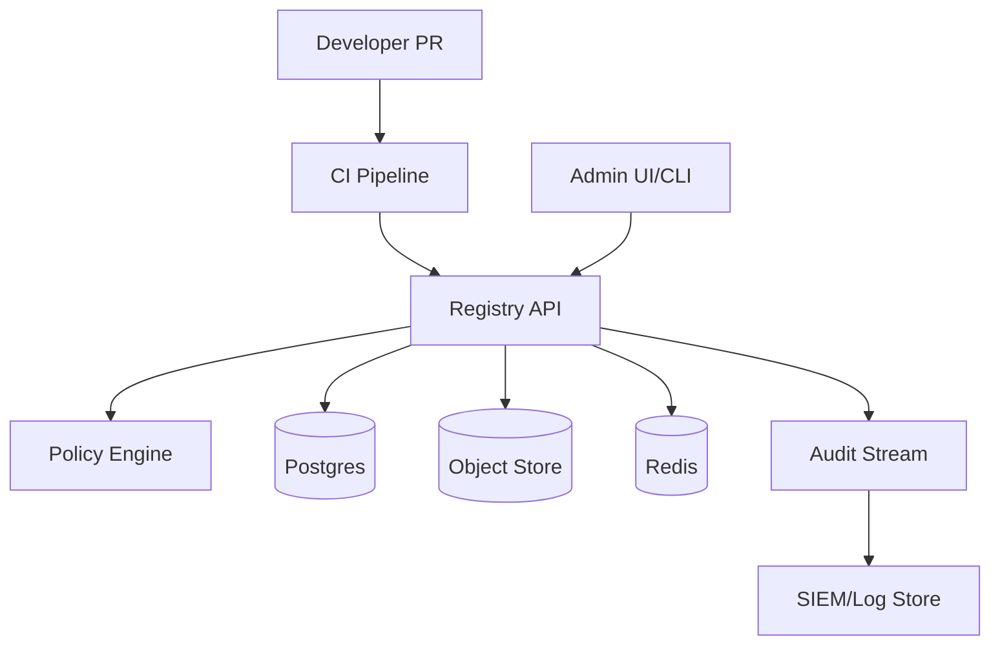
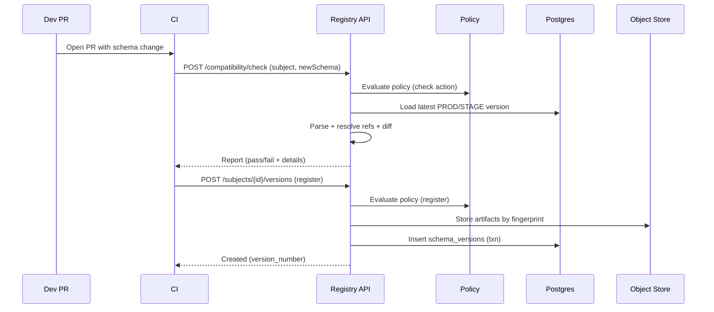

## Overview

An event schema registry is the control plane for event contracts (Avro/Protobuf) in an event-driven organization. The hard part isn’t storing schemas—it’s enforcing safe evolution across hundreds of producers/consumers while keeping teams autonomous. Without governance, “small” schema changes silently break downstream services, causing hard-to-debug production incidents and slowing delivery.

The key insight is to treat schemas as versioned, promoted artifacts with policy-as-code. CI/CD becomes the enforcement point: schema changes are validated (lint + compatibility), authorized (ownership + approvals), and promoted across environments with an audit trail. Runtime systems (producers/consumers, serializers) use the registry for discovery and validation, but production safety is primarily guaranteed before deployment.

## Requirements

### Functional Requirements
- Register and version event schemas (Avro `.avsc` / Protobuf `.proto` / descriptor sets) per subject (e.g., `payments.TransactionCreated`).
- Enforce configurable compatibility rules (backward/forward/full/none) at registration and promotion time.
- Provide CI/CD integration (PR checks and release gates) to block incompatible schema changes.
- Support schema promotion across environments (dev → stage → prod) with policy-controlled approvals.
- Resolve schema references/imports (Avro schema refs, Protobuf imports) deterministically and reproducibly.
- Provide discovery APIs (fetch by subject/version, latest, by fingerprint) for tooling and runtime integration.
- Maintain audit logs for all schema and policy changes (who/what/when/why), exportable to SIEM.
- Offer a UI/CLI for browsing, diffing versions, viewing compatibility reports, and managing approvals/policies.

### Non-Functional Requirements
- **Scale**: 5,000 teams; 50,000 subjects; 1,000,000 schema versions total; peak 2,000 RPS reads (latest/get), 50 RPS writes (register/promote), 200 RPS CI compatibility checks during business hours.
- **Latency**:
  - Read path (`GET latest`, `GET by id`): P50 10ms, P99 50ms.
  - Compatibility check (`POST /compatibility/check`): P50 50ms, P99 300ms (bounded by parsing + diff).
- **Availability**: 99.99% for reads; 99.9% for writes (CI can retry).
- **Consistency**:
  - Strong consistency for “register new version”, “promote”, and “policy updates”.
  - Eventual consistency acceptable for search indexing and UI activity feeds.
- **Durability**: RPO ≤ 5 minutes for metadata; schema artifacts durable (11 9s) in object storage; no silent loss of registered versions.

### Constraints & Assumptions
- Multi-tenant: multiple orgs/business units; strict isolation by tenant + namespace.
- Regulated environments require immutable audit logs and separation of duties (creator ≠ approver for prod promotion).
- Network access from CI to registry is allowed (with service-to-service auth); developers primarily interact via Git PRs.
- Budget supports managed Postgres + object storage + Kubernetes; small platform team (3–6 engineers).

## High-Level Architecture



The registry is a centralized API that stores immutable schema artifacts and strongly consistent metadata (subjects, versions, status, approvals). CI/CD calls the registry to run deterministic compatibility checks and to register/promote schemas only when policies allow. A policy engine evaluates rules (compatibility mode, required reviewers, environment gates) using policy-as-code to keep governance explicit and reviewable.

Reads are optimized via caching (Redis) and stable identifiers (content fingerprints). Writes are serialized per subject to prevent races and guarantee monotonic versioning. Audit events are emitted for every state transition and shipped to centralized logging/SIEM for compliance and incident response.

## Component Deep-Dive

### Registry API Service

**Responsibility**: Core API for schema registration, retrieval, compatibility reports, and environment promotion.

**Key Design Decisions**:
- Canonicalize and fingerprint schemas on ingest (SHA-256 of canonical form) to dedupe and enable `GET by fingerprint`.
- Enforce per-subject write serialization (DB locks or transactional version allocator) to avoid version races.

**Technology Choice**: Go or Java/Kotlin service; REST + JSON; optional gRPC for internal CI speed. Use a proven parsing stack (Apache Avro library; Protobuf descriptor tooling).

**Scaling Strategy**: Stateless horizontal scaling behind L7 LB; cache hot reads; shard DB by tenant if needed at high scale.

### Compatibility & Lint Engine

**Responsibility**: Parse schemas, resolve references, compute canonical forms, run compatibility checks and lint rules, produce human-readable diffs.

**Key Design Decisions**:
- Use deterministic “resolved schema bundle” (all imports/refs pinned by digest) to avoid “works on my machine” CI drift.
- Separate compatibility policies (what is allowed) from compatibility computation (what changed), enabling richer workflows (warn vs block).

**Technology Choice**: In-process library for low latency; optional sidecar worker pool for CPU-heavy checks; store computed “schema AST hash” and compatibility results for reuse.

**Scaling Strategy**: Cache resolved bundles and parsed descriptors; memoize compatibility results keyed by `(prevFingerprint, newFingerprint, ruleSetVersion)`.

### Policy Engine (Governance)

**Responsibility**: Decide whether an action is allowed (register, promote, deprecate) based on tenant policies, ownership, environment, and change classification.

**Key Design Decisions**:
- Policy-as-code using OPA/Rego (or Cedar) so governance is reviewable and testable.
- Classify changes (non-breaking vs breaking vs unknown) and apply different approval requirements by environment.

**Technology Choice**: OPA embedded or as a sidecar service; policies stored versioned in DB and optionally mirrored to Git for review.

**Scaling Strategy**: Policy evaluation is lightweight; cache compiled policies per tenant; invalidate cache on policy update.

### Storage Layer (Metadata + Artifacts)

**Responsibility**: Durable storage of schema versions, references, approvals, and immutable artifacts.

**Key Design Decisions**:
- Store artifacts (raw + canonical + descriptor sets) in object storage; store metadata and indexes in Postgres.
- Keep immutable version rows; changes are represented as new versions or status transitions, never in-place edits.

**Technology Choice**: Postgres (strong transactions, constraints); S3/GCS for artifacts; Redis for cache.

**Scaling Strategy**: Partition tables by tenant and/or time; read replicas for heavy read traffic; object store scales independently.

### Audit & Workflow

**Responsibility**: Capture all actions and approvals; integrate with notifications and ticketing.

**Key Design Decisions**:
- Append-only audit events (tamper-evident via hash chaining per tenant/day).
- Approval workflows support separation of duties and “break-glass” emergency with extra logging.

**Technology Choice**: Kafka/PubSub for audit stream; immutable log store (e.g., SIEM + WORM bucket) for retention.

**Scaling Strategy**: Async event emission; backpressure-safe (write-ahead in DB outbox table).

## Data Model

### Storage Schema

**Postgres (core tables)**

- `tenants`
  - `tenant_id (pk)`, `name`, `created_at`
- `namespaces`
  - `namespace_id (pk)`, `tenant_id (fk)`, `name`, `owner_group`, `created_at`
- `subjects`
  - `subject_id (pk)`, `tenant_id (fk)`, `namespace_id (fk)`, `name`, `schema_type (AVRO|PROTOBUF)`, `compat_mode`, `created_at`
  - Unique: `(tenant_id, namespace_id, name)`
- `schema_versions`
  - `version_id (pk)`, `subject_id (fk)`, `version_number (int)`, `status (DRAFT|STAGED|PROD|DEPRECATED)`, `created_by`, `created_at`
  - `fingerprint (sha256)`, `canonical_uri`, `raw_uri`, `descriptor_uri (nullable)`
  - Unique: `(subject_id, version_number)`, `(subject_id, fingerprint)`
- `schema_references`
  - `version_id (fk)`, `ref_subject_id (fk)`, `ref_version_number`, `ref_fingerprint`
- `rulesets`
  - `ruleset_id (pk)`, `tenant_id (fk)`, `name`, `rego_bundle_uri`, `version`, `created_at`
- `subject_ruleset_bindings`
  - `subject_id (fk)`, `ruleset_id (fk)`, `environment (DEV|STAGE|PROD)`
- `approvals`
  - `approval_id (pk)`, `version_id (fk)`, `environment`, `state (PENDING|APPROVED|REJECTED)`, `requested_by`, `approved_by`, `reason`, `created_at`, `decided_at`
- `audit_events` (or outbox)
  - `event_id (pk)`, `tenant_id`, `actor`, `action`, `resource_type`, `resource_id`, `payload_json`, `created_at`, `prev_event_hash`, `event_hash`

**Object Storage (artifacts)**
- `schemas/{tenant}/{subject}/{fingerprint}/raw`
- `schemas/{tenant}/{subject}/{fingerprint}/canonical`
- `schemas/{tenant}/{subject}/{fingerprint}/descriptor.pb` (for Protobuf)
- `policies/{tenant}/{ruleset}/{version}.tar.gz`

### Data Flow



## API Design

**Auth**
- OIDC for humans (UI/CLI); short-lived JWTs.
- mTLS or workload identity for CI; scoped service accounts per repo/team.
- RBAC roles: `reader`, `publisher`, `approver`, `admin`; ownership via namespace/subject bindings.

### Compatibility Check (CI pre-merge)
- `POST /v1/compatibility/check`
  - Request:
    ```json
    {
      "tenant": "acme",
      "subject": "payments.TransactionCreated",
      "schemaType": "PROTOBUF",
      "environment": "PROD",
      "schema": {
        "contentType": "text/plain",
        "content": "syntax = \"proto3\"; ..."
      },
      "references": [
        {"subject": "common.Money", "version": 12}
      ]
    }
    ```
  - Response:
    ```json
    {
      "compatible": false,
      "classification": "BREAKING",
      "reasons": [
        {"code": "FIELD_REMOVED", "path": "TransactionCreated.amount"}
      ],
      "suggestions": [
        "Mark field as reserved instead of removing"
      ]
    }
    ```
  - Errors: `404` subject not found (or `200` with “new subject” classification); `422` invalid schema; `403` policy denies check scope.

**Idempotency**: Client supplies `Idempotency-Key` header; server stores `(tenant, key) -> response` for 24h.

### Register New Version (CI on merge)
- `POST /v1/subjects/{subjectId}/versions`
  - Request:
    ```json
    {
      "environment": "DEV",
      "schema": {"contentType": "application/octet-stream", "content": "...."},
      "references": [{"subjectId": "subj_common_money", "version": 12}],
      "message": "Add optional promoCode"
    }
    ```
  - Response: `201 Created`
    ```json
    {"version": 37, "fingerprint": "sha256:...", "status": "DRAFT"}
    ```

**Idempotency**: If fingerprint already exists for subject, return existing version (safe replays).

### Promote Version
- `POST /v1/subjects/{subjectId}/versions/{version}/promote`
  - Request: `{"toEnvironment":"PROD","reason":"Release 2025.12.17"}`
  - Response: `200 OK` with updated status and approval state.

### Fetch Schema (runtime/tooling)
- `GET /v1/subjects/{subjectId}/versions/latest?environment=PROD`
- `GET /v1/schemas/by-fingerprint/{sha256}`
- `GET /v1/subjects/{subjectId}/versions/{version}`

### Approvals
- `POST /v1/approvals/{approvalId}:approve`
- `POST /v1/approvals/{approvalId}:reject`

**Error Handling**
- Standard envelope: `{ "error": { "code": "...", "message": "...", "details": {...} } }`
- Use `409` for version conflicts / concurrent promotion, `412` for precondition failed (policy changed), `429` for rate limits.

## Scaling & Performance

### Bottleneck Analysis
- **Compatibility CPU cost**: Parsing + diffing large Protobuf graphs.
  - Mitigation: cache resolved bundles, memoize diff results, offload heavy checks to worker pool, enforce size limits.
- **Hot subjects**: high read traffic for “latest” lookups.
  - Mitigation: Redis cache keyed by `(subject, env) -> version_id + schema uri`; aggressive TTL (e.g., 60s) with explicit invalidation on promote.
- **DB write contention per subject**: version allocation and uniqueness checks.
  - Mitigation: transactional allocator per subject; use `SELECT ... FOR UPDATE` on subject row; keep transactions short.

### Horizontal Scaling
- **API layer**: stateless replicas; autoscale on RPS and CPU (parsing).
- **Compatibility workers**: separate deployment; scale on queue depth and CPU.
- **DB**: primary + read replicas; partition by tenant at higher scale; consider Citus/Spanner if global scale is required.
- **Object storage**: infinite scale; serve artifacts via signed URLs/CDN if needed.

### Caching Strategy
- **What**:
  - Latest schema per subject+env
  - Schema by fingerprint
  - Parsed descriptor sets / canonical forms (in-memory LRU + Redis)
  - Compatibility results `(oldFp, newFp, rulesetVersion)`
- **Where**: local process cache (fast) + Redis (shared).
- **Invalidation**:
  - On promote/register: publish cache invalidation event; API instances subscribe.
  - TTL fallback to prevent long-lived staleness (60–300s).

## Trade-offs & Alternatives

### Key Trade-offs Made
- **Central registry + policy engine** chosen over “Git-only schema repo”.
  - Sacrifice: additional operational surface area.
  - Why: enables runtime discovery, consistent CI enforcement, and strong audit/approvals across many repos.
- **Postgres + object storage** chosen over “everything in Kafka” or “blob-in-DB”.
  - Sacrifice: two systems to manage.
  - Why: Postgres gives strong transactions and constraints; object storage is cheap and durable for immutable artifacts.
- **OPA policy-as-code** chosen over hardcoded rules.
  - Sacrifice: learning curve and policy debugging complexity.
  - Why: governance changes become reviewable, testable, and safer to evolve.

### Alternative Approaches
- **Managed Confluent Schema Registry**
  - Not chosen when deep CI governance, custom approvals, and multi-environment promotion are primary requirements (though it can be extended).
- **Apicurio Registry**
  - Viable open-source base; not chosen if you need strict separation-of-duties workflows and enterprise IAM integration beyond defaults.
- **Buf Schema Registry (Protobuf-first)**
  - Excellent for Protobuf ecosystems; not chosen if Avro parity and Kafka-centric subject semantics are critical.

## Failure Modes & Mitigations

### Failure Scenarios
- **Scenario**: Registry API down.
  - **Impact**: CI gates fail; runtime schema fetch may fail (depending on caching).
  - **Detection**: API SLO burn alerts; synthetic checks.
  - **Mitigation**: multi-replica HA; client retries with jitter; runtime libraries cache last-known-good schema.
- **Scenario**: Policy misconfiguration blocks promotions.
  - **Impact**: deployment pipeline stuck.
  - **Detection**: spike in `403`/`412`; approval queue backlog.
  - **Mitigation**: policy test suite + staged rollout of policies; break-glass admin override with mandatory ticket and audit.
- **Scenario**: DB primary failure/corruption.
  - **Impact**: writes unavailable; reads may degrade.
  - **Detection**: DB health checks; replication lag; checksum/audit anomalies.
  - **Mitigation**: managed Postgres with automated failover; PITR; read-only mode for API when primary unavailable.
- **Scenario**: Cache inconsistency serves stale “latest”.
  - **Impact**: consumers fetch older schema briefly.
  - **Detection**: cache hit/miss metrics; version mismatch alarms in clients.
  - **Mitigation**: explicit invalidation on promote; short TTL; allow clients to request by exact version/fingerprint for strong correctness.
- **Scenario**: Artifact store outage.
  - **Impact**: registration and fetch-by-uri fail.
  - **Detection**: object store error rates.
  - **Mitigation**: multi-region bucket replication; store small canonical schema inline in DB for emergency reads (bounded size).

### Disaster Recovery
- **RTO/RPO**: RTO 30 minutes; RPO 5 minutes.
- **Backup strategy**: Postgres continuous backups + PITR; daily logical backups; WORM retention for audit logs.
- **Failover**: warm standby in secondary region; DNS/LB cutover; validate by running synthetic compatibility checks and reads.

## Operational Considerations

### Monitoring & Alerting
- Key metrics:
  - API: RPS, latency (P50/P95/P99), error rates by endpoint and tenant, auth failures.
  - Compatibility: CPU time per check, queue depth, cache hit rate, schema parse failures.
  - DB: replication lag, slow queries, lock waits per subject, connection pool saturation.
  - Governance: approval backlog size, time-to-approve, policy evaluation failures.
- Alert thresholds:
  - Read P99 > 50ms for 10m (page if SLO burn).
  - Compatibility queue depth > N for 15m (page during business hours).
  - DB lock waits > 2s sustained (page).

### Deployment Strategy
- Blue/green or canary for API and policy engine; feature flags for new rule sets.
- Schema/policy changes promoted like code: dev → stage → prod with automatic tests.
- Rollback:
  - Code rollback via deployment system.
  - Policy rollback by ruleset version pin (immediate).
  - Schema rollback is “promote previous version” (schemas are immutable).

## References & Further Reading

- Confluent Schema Registry: https://docs.confluent.io/platform/current/schema-registry/index.html
- Apicurio Registry: https://www.apicur.io/registry/
- Buf (Protobuf tooling and registry concepts): https://buf.build/docs/
- Open Policy Agent (OPA): https://www.openpolicyagent.org/docs/latest/
- SLSA supply-chain provenance (signing CI artifacts): https://slsa.dev/
- Avro schema resolution rules: https://avro.apache.org/docs/current/spec.html
- Protobuf language guide and descriptor concepts: https://protobuf.dev/