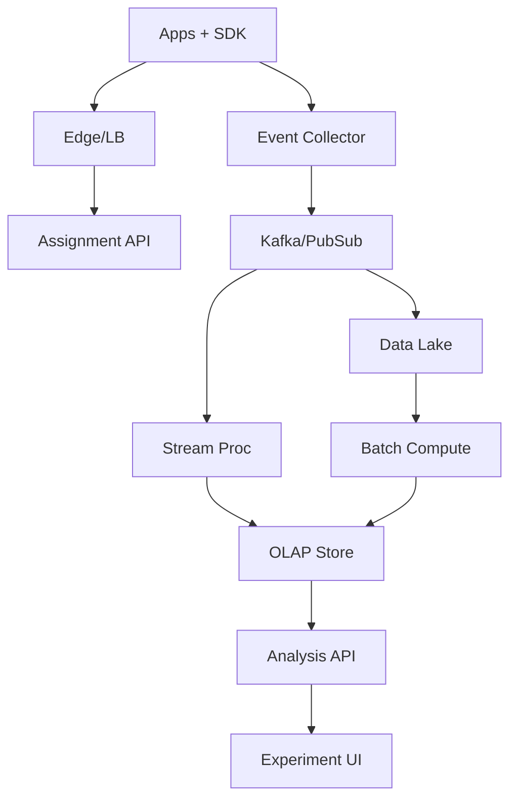
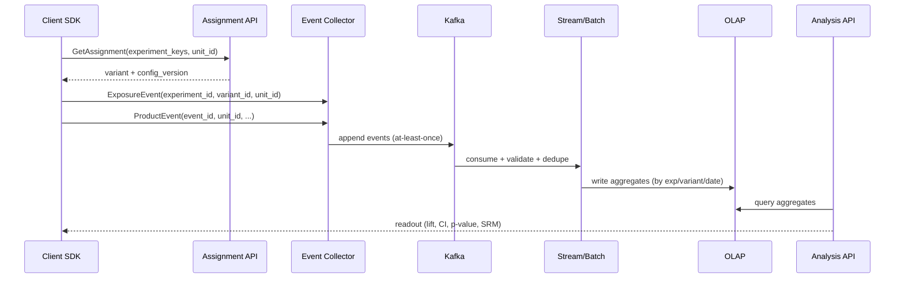

## Overview

An experimentation (A/B) platform must reliably randomize users into variants, collect high-volume behavioral signals, compute metrics correctly, and provide statistically sound decisions—often while product teams are actively “peeking” at results and running many concurrent tests. The hardest parts are (1) **assignment correctness** (sticky, unbiased, unit-consistent), (2) **data correctness** (deduplication, late/out-of-order events, bot filtering, identity resolution), and (3) **statistical validity** at scale (multiple comparisons, sequential looks, guardrails, and heterogeneous effects).

This design separates the system into an **online path** (low-latency assignment + exposure logging) and an **offline/nearline path** (event ingestion, metric computation, and analysis). The key insight is to treat experiments as a first-class “join key” in the telemetry pipeline: every relevant event becomes attributable to an experiment/variant via a principled exposure model, enabling reproducible aggregates, backfills, and consistent metric definitions across teams.

## Requirements

### Functional Requirements
- Create, configure, and ramp experiments (traffic allocation, targeting, start/stop, holdouts).
- Deterministic randomized assignment for a chosen unit (user_id, device_id, org_id, session_id).
- Sticky bucketing across requests and over time (unless re-randomization is explicitly configured).
- Exposure tracking (impressions/eligibility) and attribution of downstream events to variants.
- Metric definition management (north star + guardrails), including derived metrics (rates, ratios).
- Nearline experiment readouts (e.g., every 5–15 minutes) and final analyses with confidence intervals.
- Statistical significance testing with protections (SRM detection, sequential testing or alpha spending).
- Auditability: immutable configuration history, reproducible results, and explainable decision outputs.

### Non-Functional Requirements
- **Scale**:
  - Assignment: 100k QPS peak, 10M DAU, up to 10k concurrent experiments (most small).
  - Telemetry ingestion: 2–5M events/sec peak across products.
  - Analytics: 1–5TB/day raw events; 30–180 days hot retention, 2+ years cold retention.
- **Latency**:
  - Assignment API: P50 2–5ms, P99 20ms (in-region).
  - Exposure logging: async; client-side enqueue must be <5ms.
  - Readouts: nearline aggregates available within 15 minutes (P95), final backfills within hours.
- **Availability**:
  - Assignment/exposure: 99.99% (must not block product flows).
  - Analytics/readouts: 99.9% (degraded acceptable).
- **Consistency**:
  - Assignment: effectively strong for a given unit (deterministic hashing + config versioning).
  - Metrics: eventual consistency (late events/backfills); results are versioned by compute run.
- **Durability**:
  - Configuration and assignment rules: no loss (RPO ~0).
  - Raw telemetry: tolerate <0.01% loss (at-least-once ingestion with dedupe keys).

### Constraints & Assumptions
- Multi-tenant: many product teams share the same platform with RBAC and isolation.
- Compliance: PII minimized; support GDPR deletion requests (identity graph + data lifecycle policies).
- Budget: optimize for commodity cloud primitives; prioritize correctness and operability over novelty.
- Teams: small core platform team (5–10 engineers) supporting many client teams via SDKs.

## High-Level Architecture

The online plane consists of SDKs calling a low-latency Assignment API and emitting exposure + event telemetry to an Event Collector. The collector writes to a durable log (Kafka/PubSub), which feeds both nearline stream processing (fast aggregates, SRM checks, freshness dashboards) and batch pipelines (backfills, heavy metrics, reprocessing with updated definitions).

Analytics are served from an OLAP store (e.g., ClickHouse/Druid/BigQuery) containing experiment-keyed aggregates and, when needed, sampled or partitioned event-level data. An Analysis API provides stable, versioned readouts and statistical tests to a UI and programmatic clients.

## Component Deep-Dive

### Assignment Service

**Responsibility**: Deterministically assign an entity (unit) to experiment variants according to targeting and allocation, while ensuring stickiness and mutual exclusion rules.

**Key Design Decisions**:
- Deterministic hashing (`hash(experiment_id, unit_id, salt)`) to avoid storing per-user assignments at massive scale.
- Versioned experiment configs (monotonic `config_version`) so assignments are reproducible and debuggable.
- Support layered experiments (mutual exclusion groups) using namespaces/layers to prevent variant collisions.

**Technology Choice**: Go/Java service behind Envoy/Nginx; config in strongly consistent store (Postgres + read replicas) with in-memory cache; optional Redis for hot config distribution.

**Scaling Strategy**: Stateless horizontal scale; cache configs in-process; consistent hashing not required. Multi-region active-active with region-local config cache + periodic refresh (seconds).

---

### Event Collector & Telemetry Pipeline

**Responsibility**: Ingest exposures and product events at high throughput with at-least-once delivery, schema governance, and basic validation.

**Key Design Decisions**:
- Separate exposure events from generic product events; exposures include `experiment_id`, `variant_id`, `unit_id_type`, `unit_id`, and `exposure_time`.
- Enforce event schemas (Protobuf/Avro) and include `event_id` for deduplication.
- Time-partitioned topics and backpressure (429 + client retry with jitter) to protect pipeline.

**Technology Choice**: Kafka (or Pub/Sub) + schema registry; collectors in autoscaled deployment; object storage data lake (S3/GCS) for raw immutable logs.

**Scaling Strategy**: Partition by `tenant_id` and `unit_id` (for locality) and by time; scale collectors horizontally; use compression (zstd) and batching.

---

### Metric Computation (Stream + Batch)

**Responsibility**: Produce experiment/variant aggregates and metric values with correct attribution, handling late events and backfills.

**Key Design Decisions**:
- Two-stage model: (1) build exposure-indexed “analysis base tables” (ABTs), (2) compute metrics from ABTs for consistency and reuse.
- Windowing strategy: nearline uses event-time windows with allowed lateness (e.g., 24h), batch performs full reconciliation.
- Ratio metrics computed from sufficient statistics (numerator/denominator sums, counts, and optional covariance for CUPED).

**Technology Choice**: Flink/Spark Structured Streaming for nearline; Spark/Trino/dbt for batch; store aggregates in ClickHouse/Druid/BigQuery.

**Scaling Strategy**: Partition by `experiment_id` and time; pre-aggregate to reduce OLAP cost; incremental backfills per day/partition.

---

### Analysis & Statistics Service

**Responsibility**: Provide validated readouts, significance tests, confidence intervals, guardrails, and decision support (stop/go) with audit trails.

**Key Design Decisions**:
- Results are immutable and versioned by `analysis_run_id` (config snapshot + metric definitions + data cut).
- Default to robust frequentist inference with sequential-safe options:
  - Fixed-horizon tests for finalized experiments.
  - Alpha-spending (e.g., O’Brien–Fleming) or always-valid e-values for frequent “peeking”.
- Automatic data quality checks: SRM (chi-square), novelty effects, missing telemetry, bot anomalies.

**Technology Choice**: Python/Scala microservice with vetted libraries (statsmodels, scipy) wrapped behind a stable API; results stored in Postgres + OLAP for slices.

**Scaling Strategy**: Async job execution via queue (e.g., SQS/Celery/Temporal); cache common queries; precompute top slices (platform, country, device).

---

### Experiment Management UI & Admin

**Responsibility**: CRUD experiments, targeting, ramp schedules, metric selection, approvals, and governance (RBAC/audit).

**Key Design Decisions**:
- Change control: approvals for risky ramps; automatic guardrail alerts block further ramp if violated.
- Templates: standardized metric packs per product area to prevent metric shopping.
- Full audit log for experiment lifecycle events and config changes.

**Technology Choice**: Web app (React) + backend (same as analysis/management API); RBAC via OIDC/SAML; audit logs to immutable storage.

**Scaling Strategy**: Mostly read-heavy; cache experiment metadata; paginate and index by tenant/team/status.

## Data Model

### Storage Schema

**Postgres (metadata, strongly consistent)**

- `experiments`
  - `experiment_id (uuid, pk)`
  - `tenant_id (uuid, index)`
  - `name (text)`
  - `status (draft|running|paused|stopped|archived)`
  - `unit_type (user|device|org|session)`
  - `namespace (text)` (layer/mutex group)
  - `start_time (timestamptz)`
  - `end_time (timestamptz null)`
  - `targeting_rules (jsonb)` (segments, locales, app versions)
  - `allocation (jsonb)` (variant weights)
  - `salt (text)` (rotation support)
  - `config_version (bigint)`
  - `created_by`, `created_at`, `updated_at`

- `variants`
  - `variant_id (uuid, pk)`
  - `experiment_id (uuid, index)`
  - `name (text)` (control, treatment_a)
  - `weight (int)` (basis points)
  - `is_control (bool)`

- `metric_definitions`
  - `metric_id (uuid, pk)`
  - `tenant_id`
  - `name`
  - `type (count|sum|rate|ratio|retention|quantile)`
  - `numerator_expr (text/json)` / `denominator_expr`
  - `event_sources (text[])`
  - `aggregation_window (text)` (1d, 7d)
  - `owner`, `created_at`

- `analysis_runs`
  - `analysis_run_id (uuid, pk)`
  - `experiment_id (uuid, index)`
  - `config_version (bigint)`
  - `data_cut_time (timestamptz)`
  - `metrics_snapshot (jsonb)`
  - `status (queued|running|done|failed)`
  - `created_at`

**OLAP (aggregates, large scale)**

- `exp_variant_daily`
  - `date (date)`
  - `experiment_id`
  - `variant_id`
  - `segment_key` (e.g., country=US|device=iOS; controlled cardinality)
  - `units_exposed (uint64)`
  - `events_count_map (map<string,uint64>)`
  - `sum_map (map<string,float64>)`
  - `sum_sq_map` (optional for variance)
  - `denominator_map` (for rates/ratios)
  - `cuped_theta` / `preperiod_stats` (optional)

### Data Flow

Attribution follows an exposure model: events are attributable to a variant if they occur after first exposure (or within a defined window) for the same unit and experiment. For session-based tests, the exposure and unit definition switch accordingly.

## API Design

### Assignment (gRPC recommended; REST acceptable)

**`POST /v1/assignments:batchGet`**
- Request
  - `unit`: `{ "type": "user", "id": "u123" }`
  - `context`: `{ "locale": "en-US", "appVersion": "1.2.3", "country": "US" }`
  - `experiments`: `["checkout_redesign", "search_ranker_v2"]`
- Response
  - `assignments`: `[{ "experimentKey": "...", "variant": "control", "configVersion": 42, "reason": "targeted" }]`
  - `cacheTtlSeconds`: 300

**Error handling**
- `400` invalid unit/context schema
- `404` unknown experiment key (optionally omit with per-tenant settings)
- `429` throttled (retry with jitter)
- `503` degraded; SDK falls back to cached last-known assignment or control

**Idempotency**
- Deterministic hashing makes repeated calls idempotent for the same `(experiment_id, unit_id, config_version)`.

### Exposure & Events Ingestion

**`POST /v1/events:ingest`**
- Supports batching up to e.g. 200 events/request.
- Each event includes:
  - `eventId` (uuid), `eventTime`, `unit`, `eventType`, `properties`, optional `experimentContext`.
- Collector returns per-event acceptance and server time.

**Error handling**
- `413` payload too large
- `429` backpressure
- `400` schema violation (include field-level errors)

**Idempotency**
- At-least-once with `eventId` dedupe in stream/batch jobs (time-bounded dedupe window, e.g., 7 days).

### Experiment Management

**`POST /v1/experiments`**, **`PATCH /v1/experiments/{id}`**, **`POST /v1/experiments/{id}:start`**, **`:pause`**, **`:stop`**
- Enforces RBAC, approvals, and config version increments.

### Readouts / Analysis

**`GET /v1/experiments/{id}/results?run=latest&segment=country:US`**
- Response includes:
  - sample sizes, exposure counts
  - metric values per variant
  - lift vs control, CI, p-value (or sequential-adjusted), SRM status
  - data cut time and analysis method metadata

## Scaling & Performance

### Bottleneck Analysis
- **Assignment hot path**: config fetch + targeting evaluation → mitigate with in-memory cache, compiled rules, and small payloads.
- **Ingestion spikes**: event collector CPU/network → mitigate with batching, compression, autoscaling, backpressure.
- **High-cardinality segmentation**: expensive OLAP group-bys → mitigate with controlled segment sets, pre-aggregation, and approximate sketches (HLL/tdigest) where acceptable.
- **Backfills**: batch compute contention → mitigate with partitioned reprocessing, priority queues, and incremental ABTs.

### Horizontal Scaling
- **Client/Edge**: multi-region routing; CDN for SDK assets/config bootstrap if needed.
- **Assignment API**: stateless replicas; config cache warmed from DB/Redis; per-tenant rate limits.
- **Kafka/PubSub**: partition scaling; isolate tenants via topics or key prefixes; enforce quotas.
- **Stream/Batch**: scale by partitions and time windows; separate nearline and batch clusters.
- **OLAP**: shard by time and experiment_id; materialized views for common metrics.

### Caching Strategy
- **SDK-side cache**: cache assignments for `cacheTtlSeconds` (e.g., 5 minutes) to reduce QPS; persist to disk for mobile if appropriate.
- **Server-side config cache**: in-memory LRU keyed by `tenant_id + experiment_id`; refresh every N seconds or via pub/sub invalidation.
- **Readout cache**: cache latest results per experiment/segment for 1–5 minutes; invalidate on new aggregate partitions or new analysis run.
- **Invalidation**: config changes publish invalidation events; analysis caches keyed by `(analysis_run_id, segment)`.

## Trade-offs & Alternatives

### Key Trade-offs Made
- **Deterministic hashing vs stored assignments**
  - Chosen: deterministic hashing for scale and simplicity.
  - Sacrificed: perfect support for arbitrary mid-flight rebalancing without changing salts/versioning.
  - Why: avoids per-user storage and makes assignment highly available.
- **Exposure-based attribution**
  - Chosen: attribute events after exposure for the same unit.
  - Sacrificed: can miss effects when exposure tracking is incomplete.
  - Why: aligns with causal interpretation and reduces bias from pre-treatment events.
- **Nearline aggregates + batch correctness**
  - Chosen: fast but eventually correct results.
  - Sacrificed: “real-time” truth in the first minutes/hours.
  - Why: most decisions don’t require sub-minute accuracy; correctness dominates.

### Alternative Approaches
- **Fully event-level analysis only (no pre-aggregates)**: simpler semantics but OLAP costs and latency explode at 5M events/sec.
- **Store per-unit assignments in Redis/Cassandra**: supports flexible rebalancing but adds huge storage/write load and more failure modes.
- **Bayesian-only decisioning**: great for interpretability and continuous monitoring, but requires careful prior governance and is harder to standardize across many teams; can be offered as an advanced mode.

## Failure Modes & Mitigations

### Failure Scenarios
- **Scenario**: Assignment service outage
  - **Impact**: experiments can’t assign; product flows at risk
  - **Detection**: elevated 5xx, latency, SDK fallbacks
  - **Mitigation**: SDK fallback to cached assignment/control; multi-region failover; keep configs hot in memory; strict SLO alerts.
- **Scenario**: Sample Ratio Mismatch (SRM) due to targeting bug
  - **Impact**: invalid inference; biased results
  - **Detection**: chi-square SRM test + abrupt exposure share shifts
  - **Mitigation**: auto-pause ramp, alert owners, require fix + backfill; annotate results as invalid.
- **Scenario**: Event ingestion lag/backlog
  - **Impact**: stale readouts; delayed guardrail detection
  - **Detection**: consumer lag metrics, end-to-end freshness SLIs
  - **Mitigation**: autoscale consumers, shed non-critical events, prioritize exposures/guardrails topics.
- **Scenario**: Duplicate events inflate metrics
  - **Impact**: biased lifts and CIs
  - **Detection**: dedupe rate anomalies, event_id collision checks
  - **Mitigation**: enforce `eventId`; dedupe window in stream/batch; quarantine bad producers.
- **Scenario**: Identity merge/split (user_id changes)
  - **Impact**: unit inconsistency, diluted effects
  - **Detection**: identity graph churn metrics; anomalous repeat exposures
  - **Mitigation**: choose stable unit (org/device) per experiment; version identity graph; rerun analyses with consistent mapping.

### Disaster Recovery
- **RTO/RPO**:
  - Assignment configs: RTO 30 minutes, RPO ~0 (sync replication).
  - Telemetry: RTO hours (pipeline rebuild), RPO <0.01% (durable log + replay).
- **Backup strategy**:
  - Postgres PITR + daily snapshots; store in separate account/project.
  - Kafka tiered storage (or mirror) + data lake raw logs as source of truth.
- **Failover procedures**:
  - Multi-region for Assignment/Collector; DNS/traffic manager failover.
  - Rebuild OLAP from lake partitions if corrupted; re-run batch jobs by date range.

## Operational Considerations

### Monitoring & Alerting
- Assignment: QPS, P50/P99, error rate, cache hit rate, config refresh failures.
- Ingestion: accepted events/sec, 4xx/5xx rates, Kafka lag, bytes/sec, schema violations.
- Data quality: SRM rate, exposure-to-event join rate, late-event percentage, dedupe rate.
- Analytics: job success rate, runtime, OLAP query latency, freshness (event-time to readout).
- Suggested alerts:
  - Assignment 5xx > 0.1% for 5 min; P99 > 50ms for 5 min.
  - Kafka consumer lag > 10 min on exposures topic.
  - SRM p-value < 1e-4 for any running experiment with >10k exposures.

### Deployment Strategy
- Progressive delivery:
  - Canary Assignment API by tenant; SDK feature flags for fallback behavior.
  - Schema evolution via backward-compatible changes; enforce with CI checks.
- Rollback:
  - Fast rollback on Assignment/Collector via versioned deployments.
  - For analytics, keep old pipelines running until new aggregates validate (shadow runs + diff checks).

## References & Further Reading

- Netflix TechBlog: experimentation and A/B infrastructure (e.g., “Evolution of A/B testing” posts)
- Microsoft: CUPED variance reduction (Deng et al.)
- “Trustworthy Online Controlled Experiments” (Kohavi et al.)
- Sequential testing/alpha spending: O’Brien–Fleming boundaries; always-valid inference (e-values)
- Apache Flink / Spark Structured Streaming docs (event-time, watermarks)
- ClickHouse / Druid best practices for time-series aggregates