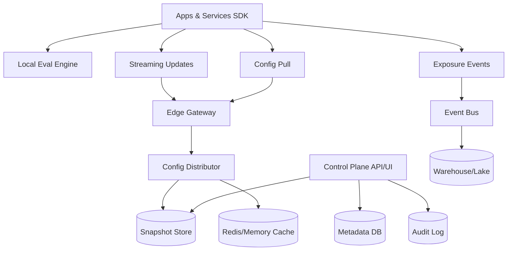
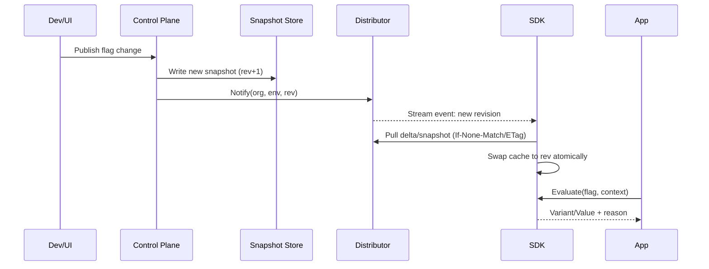

## Overview

Feature flag platforms look deceptively simple—“return true/false”—but become hard at scale because correctness, safety, and latency all matter at once. The system must support complex targeting rules (attributes, segments, geo, device), deterministic percentage rollouts, and A/B experimentation, while also providing emergency kill switches that propagate quickly and reliably. In practice, the platform becomes critical infrastructure: if it’s slow, every request is slow; if it’s wrong, you can ship outages instantly to 100% of users.

The key insight is to split the system into a **control plane** (authoring, governance, audit, experimentation setup) and a **data plane** (near-zero-latency evaluation). To achieve “near-zero” latency on the critical path, flags must be **evaluated locally in the SDK** using a cached ruleset, with updates delivered out-of-band via streaming/push and backed by a pull mechanism. Experiments and exposure tracking are handled asynchronously via an event pipeline to avoid coupling runtime traffic to analytics availability.

## Requirements

### Functional Requirements
- Create, update, and retire feature flags across multiple environments (dev/stage/prod) with versioning.
- Target flags based on user/service attributes (e.g., userId, orgId, geo, plan, app version), including reusable segments.
- Support deterministic percentage rollouts and ramp schedules (e.g., 1% → 5% → 25% → 100%).
- Enable A/B and multivariate experiments with consistent bucketing and exposure logging.
- Provide emergency kill switches (global and scoped) with fast propagation and safe defaults.
- Offer SDKs (server and client) with local evaluation, offline mode, and last-known-good behavior.
- Deliver audit logs, approvals (optional), and RBAC for safe production changes.
- Provide operational tooling: flag search, change history, diff, and rollback to a prior revision.

### Non-Functional Requirements
- **Scale**:
  - 5,000 services, 50,000 SDK instances (pods/VMs)
  - Config distribution: 50k concurrent streams + periodic pull
  - Event ingestion: 200k exposures/sec peak (large consumer apps)
  - Flags: 100k total, ~5k active per org/env; typical SDK cache 1–5 MB compressed
- **Latency**:
  - Flag evaluation in-process: P50 < 50µs, P99 < 200µs (server-side SDK)
  - Client-side eval: P50 < 0.5ms, P99 < 2ms (mobile/web)
  - Update propagation (control change → SDK applied): P50 < 1s, P99 < 10s
- **Availability**:
  - Data plane (config delivery + streaming): 99.99%
  - Control plane (UI/API authoring): 99.9%
- **Consistency**:
  - Authoring: strong consistency per flag per environment (linearizable revisions)
  - Runtime: eventual consistency for distribution; SDKs use versioned snapshots
- **Durability**:
  - No loss of flag definitions/audit logs (RPO ≤ 1 minute)
  - Exposure events can be sampled/dropped under extreme backpressure with explicit accounting

### Constraints & Assumptions
- Multi-tenant (org/project/environment) with strict isolation.
- Regulated customers may require data residency (EU/US) and audit retention (e.g., 1–7 years).
- Client-side SDKs must not receive secrets; any sensitive targeting must be server-side.
- Teams want safe rollouts: approvals, guardrails, and blast-radius controls.
- Network access from services to the flag data plane is allowed; clients may be offline intermittently.

## High-Level Architecture

The architecture separates the **runtime path** from the **management path**. SDKs evaluate flags locally via a lightweight evaluation engine using a cached ruleset snapshot. Updates are delivered via streaming (SSE/WebSocket/gRPC stream) for fast propagation, with a pull endpoint (ETag/delta) as a fallback and for cold start.

The control plane writes versioned flag configurations into a snapshot store and metadata DB, emitting audit events. The data plane (edge gateway + distributor) focuses on scalable distribution and cacheability rather than complex business logic. Experiment exposure events are emitted asynchronously into an event bus and processed into analytics storage, avoiding impact on request latency.

## Component Deep-Dive

### SDK + Local Evaluation Engine

**Responsibility**: Evaluate flags with near-zero latency, maintain a local cache of flag snapshots, and emit exposure/diagnostic events.

**Key Design Decisions**:
- Local evaluation using versioned snapshots to avoid per-request network calls and tail-latency amplification.
- Deterministic bucketing via stable hashing (`hash(userKey, flagKey, salt)`) to ensure consistent rollouts across processes and time.

**Technology Choice**: Native SDKs (Go/Java/Node/Python; Swift/Kotlin/JS). Use a small expression evaluator and precompiled rule structures.

**Scaling Strategy**: Scales with application instances; minimize snapshot size with compression, per-env filtering, and segment references.

---

### Edge Gateway (Auth + Routing)

**Responsibility**: Authenticate SDKs, terminate TLS, enforce rate limits, route to region-local distributors, and provide CDN-friendly pull endpoints.

**Key Design Decisions**:
- Separate endpoints for streaming vs pull to isolate long-lived connections.
- Use short-lived signed tokens for SDK auth (server-side) and public-key verified signed configs for clients.

**Technology Choice**: Envoy/NGINX + an auth service or JWT verification at the edge; anycast + geo-DNS for regional routing.

**Scaling Strategy**: Horizontal scale behind L7 load balancers; connection scaling for streams via event-driven servers.

---

### Config Distributor (Data Plane)

**Responsibility**: Serve snapshots/deltas, fan out updates to streams, and keep hot configs in cache.

**Key Design Decisions**:
- Versioned snapshots with monotonic `revision` per (org, env) to enable safe “last-known-good” behavior.
- Push updates by publishing revision notifications; SDKs pull deltas by revision if they missed stream events.

**Technology Choice**: Stateless service (Go/Java) + Redis for hot cache; snapshot store in object storage (S3/GCS) or a strongly consistent KV (Spanner/etcd for metadata + blobs in object storage).

**Scaling Strategy**: Stateless horizontal scaling; cache by (org, env, revision); use CDN for full snapshots.

---

### Control Plane API/UI

**Responsibility**: Flag authoring, RBAC, approvals, validation, auditing, rollback, and experiment configuration.

**Key Design Decisions**:
- Strong validation + guardrails: mutually exclusive rules, segment size checks, max rollout change per time window, and “kill switch always wins”.
- Immutable revisions: every publish creates a new revision; rollback is pointer move to prior revision.

**Technology Choice**: Web app + API service; relational DB (Postgres) for metadata; append-only audit log (Kafka topic + cold storage).

**Scaling Strategy**: Moderate QPS; scale API horizontally; DB read replicas; cache read-mostly entities (segments/flags).

---

### Event Pipeline (Exposure + Metrics)

**Responsibility**: Collect exposures, compute experiment metrics, and enable debugging/monitoring (e.g., flag evaluation mismatch).

**Key Design Decisions**:
- At-least-once ingestion with idempotent event IDs; allow sampling for ultra-high-volume clients.
- Separate “diagnostic” events (SDK health, staleness) from exposures to keep critical metrics accurate.

**Technology Choice**: Kafka/PubSub/Kinesis; stream processing (Flink/Spark) and warehouse (BigQuery/Snowflake) + OLAP (ClickHouse/Druid) for near-real-time dashboards.

**Scaling Strategy**: Partition by org + flag/experiment; batch and compress client uploads; backpressure with local SDK buffers.

## Data Model

### Storage Schema

**Relational (Metadata DB, e.g., Postgres)**

- `organizations(id, name, created_at)`
- `projects(id, org_id, name)`
- `environments(id, project_id, name, region_policy)`
- `flags(id, env_id, key, type, description, created_by, created_at, archived_at)`
- `flag_revisions(id, flag_id, revision, published_at, published_by, status, checksum)`
- `segments(id, env_id, key, definition_json, updated_at)`
- `experiments(id, env_id, key, flag_key, start_at, end_at, hypothesis, status)`
- `rbac_roles(id, org_id, name, policy_json)`
- `audit_events(id, org_id, actor, action, resource, at, diff_json)`

**Snapshot Store (Blob/Object Storage or KV + Blob)**

- `snapshot/{org}/{env}/{revision}.json.zst`
  - Contains all active flags + referenced segments (or segment hashes + inline if small)
  - Includes `revision`, `generated_at`, `schema_version`, `signatures`, `salts`, `kill_switches`

**Redis/Memory Cache**
- Key: `snap:{org}:{env}:{revision}` → compressed snapshot bytes
- Key: `latest:{org}:{env}` → latest revision number + checksum

### Data Flow

Key operations:
- **Publish** creates an immutable revision and writes a new snapshot.
- **Propagate** uses stream notifications; SDKs confirm by pulling the referenced revision.
- **Evaluate** is always local and uses atomic snapshot swap to avoid partial updates.

## API Design

### Control Plane (REST; internal auth via OIDC)

- `POST /v1/orgs/{orgId}/envs/{envId}/flags`
  - Request: `{ "key": "checkout_new", "type": "boolean", "description": "...", "defaults": {...} }`
  - Response: `{ "flagId": "...", "key": "...", "createdAt": "..." }`
  - Errors: `409` key exists, `400` invalid type

- `POST /v1/orgs/{orgId}/envs/{envId}/flags/{flagKey}:publish`
  - Request: `{ "baseRevision": 41, "rules": [...], "killSwitch": {...}, "comment": "..." }`
  - Response: `{ "newRevision": 42, "checksum": "...", "publishedAt": "..." }`
  - Idempotency: `Idempotency-Key` header required; replay returns same `newRevision`
  - Errors: `409` revision conflict (optimistic concurrency), `422` validation failed

- `POST /v1/orgs/{orgId}/envs/{envId}/flags/{flagKey}:rollback`
  - Request: `{ "toRevision": 39, "comment": "..." }`
  - Response: `{ "newRevision": 43, "rolledBackTo": 39 }`

### Data Plane (SDK-facing; low-latency, cacheable)

- `GET /sdk/v1/config/{orgId}/{envId}/latest`
  - Headers: `If-None-Match: "<etag>"`
  - Response `200`: `{ "revision": 42, "snapshotUrl": "...", "delta": {...optional...} }`
  - Response `304`: unchanged
  - Notes: CDN cache for small “latest pointer”; snapshot bytes fetched from `snapshotUrl`

- `GET /sdk/v1/snapshots/{orgId}/{envId}/{revision}`
  - Response `200`: compressed snapshot bytes + `ETag`
  - Security: signed snapshot; SDK verifies signature and schema version

- `GET /sdk/v1/stream/{orgId}/{envId}`
  - Protocol: SSE or WebSocket
  - Messages: `{ "type":"rev", "revision": 42, "checksum":"..." }`
  - Reconnect: includes `Last-Event-ID` or resume token

### Events (Exposure/Metrics)

- `POST /sdk/v1/events`
  - Request (batch): `{ "sdkKeyId":"...", "events":[{ "id":"uuid", "ts":..., "flag":"...", "variant":"B", "contextHash":"...", "reason":"RULE_MATCH", "experimentKey":"..." }]}`
  - Response: `202 Accepted`
  - Idempotency: server-side dedupe by `event.id` for a rolling window (e.g., 24h)

## Scaling & Performance

### Bottleneck Analysis
- **Stream fanout** (50k long-lived connections): mitigate with event-driven servers, per-tenant sharding, and regional affinity.
- **Snapshot size** (large segment definitions): mitigate with segment references + hashes, segment precomputation for common attributes, and compression (zstd).
- **Cold start thundering herd** (deploys): mitigate with CDN/object storage snapshots, jittered refresh, and distributor-side request coalescing.
- **Event ingestion spikes**: mitigate with batching, backpressure, sampling, and partitioned event bus.

### Horizontal Scaling
- **SDK evaluation**: scales inherently (in-process).
- **Edge gateway**: add instances; use L7 LB; autoscale on connections + CPU.
- **Distributor**: stateless; scale on RPS/streams; shard by `(orgId % N)` to keep hot tenants localized.
- **Metadata DB**: primary + read replicas; partition big tables by `org_id` if necessary; move audit to append log.
- **Event pipeline**: scale partitions; keep ingestion decoupled from processing.

### Caching Strategy
- **SDK**: in-memory snapshot + persistent fallback (disk) for server SDKs; TTL-based refresh and revision pinning.
- **Edge/CDN**: cache snapshot blobs by immutable revision (`/snapshots/.../{revision}`) for hours-days.
- **Distributor**: Redis for hottest snapshots and latest pointers; negative caching for missing revisions.
- **Invalidation**: avoid invalidation by making snapshots immutable; “latest pointer” updates frequently with short TTL (1–5s).

## Trade-offs & Alternatives

### Key Trade-offs Made
- **Chosen**: local SDK evaluation  
  **Sacrificed**: centralized instant rule fixes without deployment concerns  
  **Why**: guarantees near-zero latency and resilience to network/data-plane outages.

- **Chosen**: immutable, versioned snapshots  
  **Sacrificed**: more storage and revision management complexity  
  **Why**: enables safe rollbacks, CDN caching, reproducibility, and auditability.

- **Chosen**: eventual distribution consistency  
  **Sacrificed**: perfectly synchronized flips across all instances  
  **Why**: improves availability; mitigated by fast push + bounded staleness alerts.

- **Chosen**: async exposure logging  
  **Sacrificed**: real-time perfect counts under failures  
  **Why**: prevents analytics issues from impacting product traffic.

### Alternative Approaches
- **Server-side remote evaluation service (per-request RPC)**: simpler SDKs but adds tail latency and creates a hard dependency on the flag service for every request.
- **Database-driven evaluation in app (query segments per request)**: flexible but extremely expensive and unreliable at scale.
- **Fully edge-evaluated flags (CDN workers)**: great for web routing but harder for internal microservices and complex context; still needs SDKs for non-edge workloads.

## Failure Modes & Mitigations

### Failure Scenarios
- **Scenario**: Distributor outage in a region  
  **Impact**: SDKs can’t fetch updates; evaluations continue using cached snapshots  
  **Detection**: elevated 5xx, stream disconnect rates, staleness metrics  
  **Mitigation**: multi-region failover via geo-DNS; SDK retry with exponential backoff; last-known-good persists.

- **Scenario**: Bad flag rule published (logical error)  
  **Impact**: incorrect targeting/rollout; potential customer impact  
  **Detection**: canary validation, rule linting, anomaly alerts (variant skew, error rate by variant)  
  **Mitigation**: one-click rollback to prior revision; emergency kill switch override path.

- **Scenario**: Stream channel degraded (connection limits, LB issues)  
  **Impact**: slower propagation  
  **Detection**: propagation SLO (publish→applied), reconnect storms  
  **Mitigation**: SDK periodic pull (ETag) as fallback; stream tier autoscaling; connection sharding.

- **Scenario**: Snapshot store corruption or incorrect signing keys  
  **Impact**: SDK refuses updates or applies wrong config  
  **Detection**: signature verification failures, checksum mismatch alarms  
  **Mitigation**: key rotation with overlap; dual-sign during rotation; store snapshots with checksums and WORM retention.

- **Scenario**: Event bus backlog/outage  
  **Impact**: delayed experiment results; possible loss if buffers overflow  
  **Detection**: consumer lag, ingestion error rate, dropped-event counters  
  **Mitigation**: SDK local buffering + sampling; ingestion durable queue; degrade analytics without affecting flag evaluation.

### Disaster Recovery
- **RTO/RPO**: Data plane RTO 5–15 minutes, RPO ~0 (immutable snapshots); Control plane RTO 1 hour, RPO ≤ 1 minute.
- **Backup strategy**: continuous backups for metadata DB; snapshots stored in multi-AZ object storage with lifecycle policies; audit log replicated cross-region.
- **Failover procedures**: promote secondary region for control plane DB; distributors read from replicated snapshot buckets; rotate traffic via DNS/LB.

## Operational Considerations

### Monitoring & Alerting
- Data plane:
  - `config_fetch_p99`, `stream_disconnect_rate`, `active_streams`
  - `publish_to_apply_p99` (propagation time)
  - `sdk_staleness_seconds` (by org/env)
  - `snapshot_verify_failures`, `etag_hit_ratio`, `cdn_hit_ratio`
- Control plane:
  - `publish_error_rate`, `revision_conflicts`, `rollback_frequency`
  - `audit_write_lag`
- Events/experiments:
  - `ingest_qps`, `consumer_lag`, `drop_rate`, `dedupe_rate`

Alert thresholds (examples):
- `publish_to_apply_p99 > 30s` for 10m (data plane degradation)
- `snapshot_verify_failures > 0.1%` for 5m (signing/config integrity issue)
- `sdk_staleness_seconds > 300` for top tenants (risk of inconsistent behavior)

### Deployment Strategy
- **Safe rollout**: canary distributors/edge changes; SDK backward-compatible schema with `schema_version`.
- **Rollback**: revert service deploys; for config, rollback by pointing “latest” to a prior revision.
- **Migrations**: additive schema changes; dual-read/dual-write when needed; snapshot generation supports multiple schema versions during transition.

## References & Further Reading

- LaunchDarkly architecture concepts and SDK caching patterns: https://docs.launchdarkly.com/
- Unleash (open-source feature management): https://www.getunleash.io/
- Facebook “Gatekeeper” (feature gating at scale) discussions and talks (community references).
- Netflix Archaius (dynamic configuration): https://github.com/Netflix/archaius
- “The Twelve-Factor App” config principle (context for runtime config): https://12factor.net/config
- Kafka design (event pipeline fundamentals): https://kafka.apache.org/documentation/