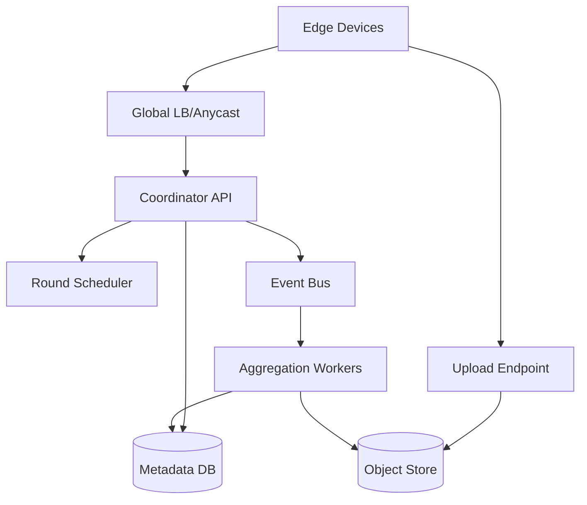
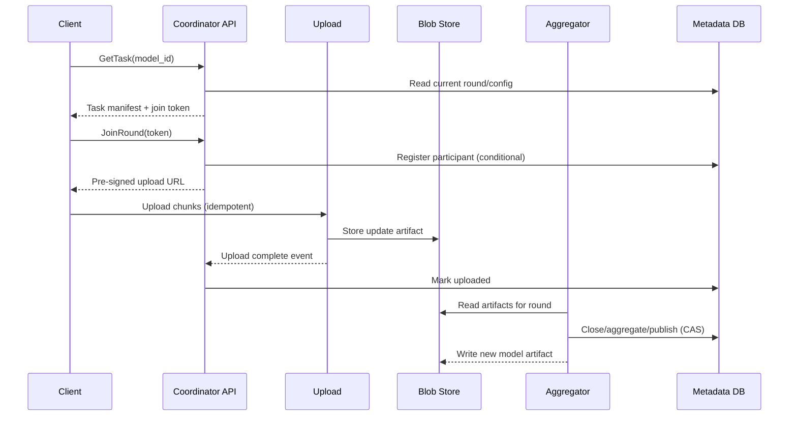

## Overview

A federated learning (FL) coordination server orchestrates training across millions of edge devices (phones, IoT, browsers) by distributing model tasks and aggregating local updates—without centralizing raw user data. The hard parts are not “averaging gradients,” but operating a globally distributed, adversarial, intermittent fleet with strict privacy guarantees, bandwidth constraints, heterogeneous compute, and regulatory requirements.

This design uses round-based orchestration with secure aggregation (so the server cannot see individual updates), optional differential privacy (so the final model resists inference about any participant), and a scalable ingestion/aggregation pipeline. The key insight is to separate **control-plane** orchestration (device selection, eligibility, policy, metadata) from **data-plane** update transport and aggregation (high-throughput, append-only, idempotent), and to treat privacy as a first-class protocol constraint rather than an “add-on encryption checkbox.”

## Requirements

### Functional Requirements
- Devices can discover and fetch the latest training task (model + hyperparams + round info).
- Server selects eligible devices and coordinates training rounds (scheduling, quotas, backoff).
- Devices upload encrypted model updates (or masked shares) and training metrics.
- Server aggregates updates into a new global model and publishes it atomically.
- Support multiple models/tenants with isolation (separate policies, keys, quotas).
- Provide auditability of rounds (who/what participated at an aggregate level, not raw updates).
- Detect and mitigate malformed/poisoned updates (protocol compliance, robustness checks).
- Allow safe rollouts/rollbacks of models and training configs.

### Non-Functional Requirements
- **Scale**: 10M–100M enrolled devices; 1M–5M daily participants; peak 200K concurrent clients; control-plane 50K QPS; ingest 20–50 Gbps during round peaks.
- **Latency**:
  - Task fetch P50 50ms / P99 200ms (regional).
  - Update upload end-to-end P99 5s (chunked, resumable).
  - Round completion target 5–30 minutes (depends on cohort size + dropouts).
- **Availability**: 99.95% for task fetch/eligibility; 99.9% for uploads/aggregation (rounds can tolerate partial delays).
- **Consistency**:
  - Strong for round state transitions (OPEN→CLOSED→AGGREGATED→PUBLISHED).
  - Eventual for telemetry/metrics and device health signals.
- **Durability**: No loss of published models; tolerate loss of some unaggregated uploads (round retries). Metadata RPO ≤ 5 minutes; model artifacts RPO ≤ 0.

### Constraints & Assumptions
- Devices are intermittently connected, battery/thermal constrained, and may be behind NAT.
- Privacy requirement: server must not learn individual device updates (secure aggregation); optionally add DP at release.
- Bandwidth budget per device per round: 0.5–5 MB typical; prefer sparse/compressed updates.
- Team constraint: small platform team (6–10 engineers); leverage managed primitives where possible.
- Compliance: GDPR/CCPA; minimize identifiers; retention limits on logs and aggregates.

## High-Level Architecture

The system splits into: (1) **Coordinator API** for enrollment, eligibility, and task distribution; (2) a **data-plane upload path** optimized for large, resumable uploads to object storage; and (3) **asynchronous aggregation workers** that read update artifacts, execute secure aggregation and robustness checks, then publish a new model artifact.

This structure scales by isolating high-QPS, low-payload control traffic from bandwidth-heavy uploads, and by making aggregation an event-driven pipeline. Privacy-sensitive operations (secure aggregation keying/masking, DP noise addition) are handled in the aggregation stage with tightly controlled access and auditable policies.

## Component Deep-Dive

### Coordinator API

**Responsibility**: Enrollment, device eligibility, task fetch, round participation state, issuing upload/session tokens.

**Key Design Decisions**:
- Use short-lived signed tokens for round participation and upload authorization to avoid sticky sessions and reduce DB lookups.
- Strongly consistent round state transitions via transactional metadata writes (or single-writer per round) to prevent double-publish and conflicting round closures.

**Technology Choice**: Stateless Go/Java service behind L7 LB; gRPC for device efficiency; Redis for hot eligibility caches; DynamoDB/Cassandra/Spanner for metadata (pick based on org).

**Scaling Strategy**: Horizontally scale stateless API; shard metadata by `(tenant_id, model_id, round_id)`; cache task manifests and round configs aggressively.

### Round Scheduler

**Responsibility**: Creates rounds, selects cohorts, enforces policies (geo, device class, charging/Wi-Fi), manages deadlines and minimum thresholds.

**Key Design Decisions**:
- Decouple selection from participation: scheduler computes a cohort and emits invites; API validates eligibility at join-time to handle stale device signals.
- Use adaptive sampling to hit target participant count despite dropout (oversubscribe and close when threshold met).

**Technology Choice**: Stateful service with leader election (Kubernetes + lease) or managed workflow (Temporal); uses metadata DB and event bus.

**Scaling Strategy**: Partition scheduling by model/tenant; single-writer per `(model_id)` to simplify round lifecycle; parallelize cohort computation using batch jobs if needed.

### Upload Endpoint (Data Plane)

**Responsibility**: High-throughput ingestion of client artifacts (masked updates, metrics blobs), resumable uploads, integrity checks.

**Key Design Decisions**:
- Direct-to-object-store uploads using pre-signed URLs to keep the API from becoming a bandwidth bottleneck.
- Chunked uploads with content hashes and idempotency keys to tolerate flaky networks and retries.

**Technology Choice**: Cloud object store (S3/GCS/Azure Blob) + lightweight upload proxy for auth/rate limiting; optional CDN for task/model downloads.

**Scaling Strategy**: Scale upload proxies horizontally; rely on object store for throughput; partition paths by round to simplify lifecycle and retention.

### Aggregation Workers

**Responsibility**: Secure aggregation protocol execution, aggregation math, robustness/validation, DP noise addition, model publishing.

**Key Design Decisions**:
- Implement secure aggregation (e.g., Bonawitz-style) so the server never sees per-device plaintext updates; require a minimum participation threshold `k` (e.g., k≥1000) to aggregate.
- Separate “validation” (schema, norm bounds, clipping) from “aggregation” to limit blast radius of malformed inputs and support quarantine workflows.

**Technology Choice**: Kubernetes batch jobs; Spark/Ray for large-scale math if needed; Kafka/PubSub for events; HSM/KMS for key material.

**Scaling Strategy**: Parallelize by `(model_id, round_id)`; stream artifacts from object store; use autoscaling on queue depth; keep aggregation stateless with checkpointed progress.

### Metadata & Artifact Stores

**Responsibility**: Source of truth for round state, manifests, policies, and pointers to artifacts; durable storage for models and update blobs.

**Key Design Decisions**:
- Metadata is small but correctness-critical → strong consistency, transactions, conditional updates.
- Artifacts are large and append-only → object store with lifecycle rules and immutability for published models.

**Technology Choice**: Spanner/Postgres (strong) or DynamoDB/Cassandra (conditional writes); object store + versioning; Redis for caching.

**Scaling Strategy**: Shard metadata by tenant/model; store only references to blobs; enforce TTL/retention on per-round uploads.

## Data Model

### Storage Schema

**`models`**
- `tenant_id` (pk)
- `model_id` (pk)
- `current_version`
- `policy_ref` (DP/secure-agg/min-k)
- `created_at`, `updated_at`

**`rounds`**
- `tenant_id` (pk)
- `model_id` (pk)
- `round_id` (pk)
- `state` (OPEN|CLOSED|AGGREGATING|PUBLISHED|FAILED)
- `min_participants_k`
- `deadline_at`
- `task_manifest_uri`
- `agg_result_uri` (set when done)
- `metrics_uri`
- `created_at`, `updated_at`

**`participants`** (bounded retention)
- `tenant_id`, `model_id`, `round_id` (pk)
- `participant_id` (pk, pseudonymous)
- `status` (JOINED|UPLOADED|DROPPED|REJECTED)
- `upload_uri`
- `uploaded_at`

**`artifacts`** (optional index; object store is primary)
- `artifact_id` (pk)
- `type` (MODEL|UPDATE|METRICS)
- `uri`
- `sha256`
- `size_bytes`
- `created_at`
- `ttl_at`

### Data Flow

## API Design

### gRPC (recommended for mobile efficiency)

**`GetTask`**
- `GET /v1/models/{model_id}/task` (REST) or `GetTask(model_id)`
- Response:
  - `round_id`
  - `model_download_url` (CDN/object store)
  - `training_config` (epochs, lr, clipping)
  - `privacy_config` (secure-agg params, min_k, DP epsilon if applicable)
  - `join_token` (JWT, ~5 min TTL)
- Errors: `404` model not found, `429` rate limited, `503` degraded.

**`JoinRound`**
- Request: `join_token`, `device_attestation` (optional), `capabilities` (ram, cpu, network type)
- Response: `participant_token` (JWT), `upload_urls` (one or more), `deadline_at`
- Idempotency: `Idempotency-Key` per device+round; server returns same participant record on retry.
- Errors: `403` ineligible, `409` round closed, `429` quota.

**`ReportUploadComplete`**
- Request: `participant_token`, `artifact_sha256`, `size_bytes`, `artifact_uri`
- Response: `ack`
- Idempotency: keyed by `(participant_id, round_id, artifact_sha256)`.

**`GetRoundStatus`** (optional for observability)
- Returns aggregate-only stats (no per-device info): `uploaded_count`, `min_k`, `state`, `eta`.

### Error Handling Approach
- Use structured error codes (`INELIGIBLE`, `ROUND_CLOSED`, `TOKEN_EXPIRED`, `BAD_ARTIFACT_HASH`).
- Retries: exponential backoff with jitter; honor `Retry-After`.
- Tokens: short-lived; refresh via `GetTask`/`JoinRound`.

## Scaling & Performance

### Bottleneck Analysis
- **Coordinator hot reads** (task/round config): mitigate with CDN/object store for manifests + Redis caching; keep metadata reads single-key.
- **Upload spikes**: mitigate by direct-to-object-store uploads, per-tenant rate limits, and admission control at `JoinRound`.
- **Aggregator throughput**: mitigate by parallel workers, streaming reads, and early filtering (schema validation before heavy crypto/math).
- **Metadata contention on round close**: mitigate with single-writer semantics per round and conditional state transitions.

### Horizontal Scaling
- **Client/API layer**: stateless, autoscale on QPS and p99 latency; regional deployment with geo-routing.
- **Scheduler**: partition by model; leader per partition.
- **Aggregation**: one job per `(model_id, round_id)`; scale workers with queue depth; isolate tenants via namespaces/quotas.
- **Partitioning strategy**:
  - Metadata partition key: `(tenant_id, model_id)`; sort by `round_id`.
  - Blob paths: `/tenant/model/round/participant/artifact`.

### Caching Strategy
- Cache task manifests and model download URLs at CDN (TTL 5–30 min, cache-bust by version).
- Cache current round metadata in Redis (TTL 1–5s) to absorb spikes while maintaining correctness via conditional writes on mutations.
- Avoid caching participant state aggressively (write-heavy); instead use append-only events + derived metrics.

## Trade-offs & Alternatives

### Key Trade-offs Made
- **Chosen**: Secure aggregation + minimum cohort `k`.
  - **Sacrificed**: More protocol complexity, multi-phase coordination, handling dropouts.
  - **Why**: Strong privacy property: server cannot inspect individual updates, reducing insider risk and compliance burden.
- **Chosen**: Direct-to-object-store uploads.
  - **Sacrificed**: More moving parts (pre-signed URLs, callbacks), harder local debugging.
  - **Why**: Removes a massive bandwidth bottleneck and makes ingestion elastic and cheaper.
- **Chosen**: Strong consistency for round state.
  - **Sacrificed**: Some write throughput and potential cross-region latency.
  - **Why**: Prevents double publishes, inconsistent model versions, and hard-to-debug training corruption.

### Alternative Approaches
- **Centralized training with data upload**: simpler, but violates privacy and increases compliance risk/cost.
- **Peer-to-peer aggregation**: reduces server load, but difficult across NATs, unreliable, and much harder to secure/operate.
- **Trusted Execution Environments (TEE) aggregation**: strong confidentiality, but adds hardware trust assumptions, attestation complexity, and capacity constraints; often complementary rather than replacement.

## Failure Modes & Mitigations

### Failure Scenarios
- **Scenario**: Upload endpoint overload or object store throttling  
  **Impact**: Round misses deadlines; fewer participants  
  **Detection**: 5xx rate, upload latency, object store throttles  
  **Mitigation**: Admission control (reduce joins), multi-region buckets, exponential backoff, extend round deadline adaptively

- **Scenario**: Aggregation job crash mid-round  
  **Impact**: Round delayed; no model publish  
  **Detection**: Missing heartbeats; queue lag  
  **Mitigation**: Checkpoint progress; idempotent aggregation writes; re-run job from last checkpoint

- **Scenario**: Malicious/poisoned updates (model skew, backdoor)  
  **Impact**: Degraded/unsafe model  
  **Detection**: Robust stats drift, canary eval regression, anomaly metrics  
  **Mitigation**: Norm clipping, update validation, robust aggregators (trimmed mean/median where feasible), staged rollout with offline eval gates; quarantine suspect rounds

- **Scenario**: Metadata DB partition/unavailable  
  **Impact**: Can’t join rounds or publish  
  **Detection**: DB error rate, elevated p99  
  **Mitigation**: Regional failover, read-only degraded mode (serve last task), queue joins, retry with jitter

- **Scenario**: Privacy budget misuse (DP) or misconfiguration  
  **Impact**: Privacy guarantees invalid  
  **Detection**: Policy audit failures, config drift alerts  
  **Mitigation**: Central policy service, signed configs, approvals for privacy parameter changes, automatic block on budget exhaustion

### Disaster Recovery
- **RTO/RPO**: Metadata RTO 30 min / RPO 5 min; published models RTO 15 min / RPO 0.
- **Backup strategy**: PITR for metadata DB; object store versioning + cross-region replication for model artifacts.
- **Failover procedures**: Promote standby region DB, switch traffic via DNS/Anycast, replay event bus from durable offsets, resume aggregation from checkpoints.

## Operational Considerations

### Monitoring & Alerting
- Key metrics:
  - `GetTask`/`JoinRound` QPS, p50/p99 latency, 4xx/5xx rates
  - Upload success rate, bytes/sec, retry rate, chunk failures
  - Round funnel: invited→joined→uploaded→aggregated; dropout rate
  - Aggregation duration, queue lag, worker failures
  - Model quality gates: canary eval metrics, drift signals
  - Privacy: min-k violations, DP budget consumption, config change audits
- Alert thresholds:
  - `JoinRound` 5xx > 1% for 5 min
  - Upload failure > 2% or throttling spikes
  - Round publish delay > SLA (e.g., >60 min)
  - Any publish without meeting `min_k` (page immediately)

### Deployment Strategy
- Progressive delivery: canary API + scheduler changes; feature flags per tenant/model.
- Backward compatibility: versioned task manifests and client protocol; support N-2 client versions.
- Safe rollout of models: publish candidate → offline eval → small canary cohort → ramp to broader population; rollback by pinning prior model version.
- Rollback procedures: instant config rollback via signed manifests; disable joins; re-run aggregation or mark round failed with audit trail.

## References & Further Reading
- Bonawitz et al., “Practical Secure Aggregation for Privacy-Preserving Machine Learning” (Google FL secure aggregation)
- McMahan et al., “Communication-Efficient Learning of Deep Networks from Decentralized Data” (FedAvg)
- Dwork et al., Differential Privacy (foundations) and DP-SGD
- TensorFlow Federated / PySyft / Flower (practical FL frameworks)
- “The Secret Sharer” / MPC literature for dropout-resilient aggregation patterns