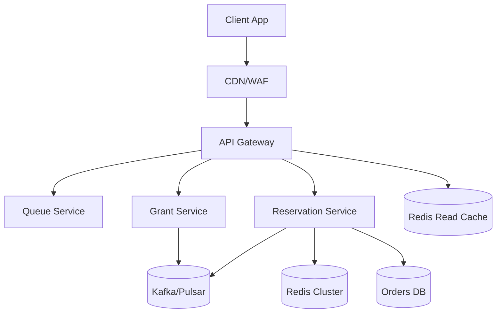
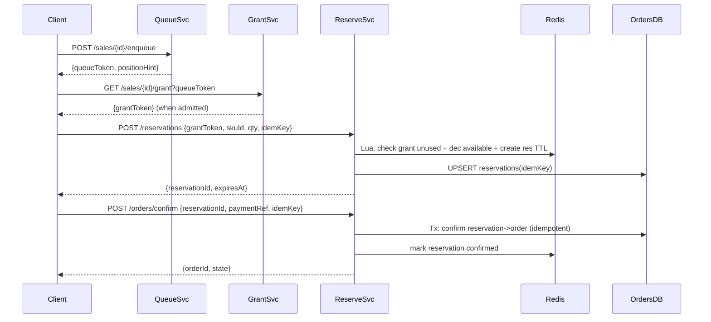

## Overview

Flash sales create extreme, short-lived load spikes (often 100x normal) concentrated on a tiny set of SKUs. The system must prevent overselling, stay responsive under overload, and remain *fair*—users should be served in a predictable order and not lose out to retries, bots, or geographically closer clients.

The key insight is to separate the problem into two control loops: (1) **admission & fairness** via a “virtual waiting room” queue that issues short-lived purchase grants at a controlled rate, and (2) **inventory correctness** via a dedicated reservation service that performs atomic holds with TTLs and idempotent confirmation. This combination keeps the website up during spikes, avoids oversell, and provides deterministic user experience.

## Requirements

### Functional Requirements
- Users can join a sale-specific queue and receive a position/ETA.
- System admits users from the queue at a controlled rate (per SKU/sale) and issues a short-lived **purchase grant**.
- Users with a valid grant can create an **inventory reservation (hold)** with a fixed TTL.
- Users can confirm purchase by completing payment; reservation converts to an order exactly once.
- Users can cancel/abandon; expired holds automatically return inventory.
- Enforce fairness (FIFO within a sale/SKU) and anti-abuse (per-account/device/IP limits, bot checks).
- Provide real-time-ish status updates (queue position, grant expiry, reservation expiry).
- Operators can start/stop a sale, adjust inventory and admission rate safely.

### Non-Functional Requirements
- **Scale**
  - Peak: 500k enqueue QPS (global), 50k grants/sec, 20k reserve QPS, 10k confirm QPS
  - Users: 10M participating accounts; 1M concurrent during peak minute
  - Inventory: 1k–1M units per SKU; 100–10k SKUs per sale (hot set small)
- **Latency**
  - Enqueue token issuance: P50 30ms, P99 150ms
  - Grant check + reserve: P50 50ms, P99 200ms
  - Confirm order (excluding payment provider): P50 100ms, P99 300ms
- **Availability**: 99.99% for enqueue/status; 99.95% for reserve/confirm during sale window
- **Consistency**
  - Strong: inventory reservation/confirmation (no oversell)
  - Eventual: queue position/ETA, analytics, email/notifications
- **Durability**
  - Orders/payments: zero data loss target (RPO ~0)
  - Queue state: small loss acceptable (RPO up to 1–5s) if it doesn’t break fairness guarantees for already-issued grants

### Constraints & Assumptions
- Single-item checkout for the flash-sale SKU (multi-item carts handled outside the sale flow).
- One primary region for writes during a sale; read-only replicas/multi-region edge for static content.
- Budget supports Redis cluster, Kafka/Pulsar, and a relational DB (e.g., Postgres) for orders.
- Compliance: PCI handled by external payment provider; we store tokens/refs, not raw card data.

## High-Level Architecture

The system front-loads protection at the edge (CDN/WAF) and API gateway (rate limiting, auth, bot checks). All users enter a **Queue Service** that provides fairness and overload protection. The **Grant Service** admits users at a controlled rate and issues signed, short-lived purchase grants. The **Reservation Service** performs atomic inventory holds in Redis and durably records order state in an Orders DB using idempotent operations and an event stream for reconciliation and downstream processing.

This structure isolates the hottest path (enqueue/status/grants) from the correctness-critical path (reserve/confirm), ensuring that traffic spikes don’t take down inventory/order correctness.

## Component Deep-Dive

### Queue Service (Virtual Waiting Room)

**Responsibility**: Fairly order users for a sale/SKU and provide position/ETA; absorb 100x spikes.

**Key Design Decisions**:
- Use per-sale/SKU FIFO queue with deterministic ordering (server-assigned monotonic sequence) to prevent “retry advantage.”
- Split queue storage from status projection: queue append is optimized; position/ETA is computed via cached projections.

**Technology Choice**: Redis Streams (or Kafka) for append-only queue + Redis for status projection.
- Redis Streams: fast append, consumer groups, easy rate-controlled consumption.
- Kafka alternative: stronger durability/ordering, higher ops overhead.

**Scaling Strategy**:
- Partition by `(saleId, skuId)` using consistent hashing.
- Stateless queue frontends; backpressure via shedding (HTTP 429) and edge throttles.

### Grant Service (Admission Control)

**Responsibility**: Convert queue entries into time-boxed purchase grants at a controlled rate; enforce per-user fairness rules.

**Key Design Decisions**:
- Grants are short-lived, signed tokens (JWT/PASETO) + server-side “seen set” for one-time use.
- Admission rate is configurable per SKU (e.g., 10k/sec) and dynamically tuned based on reservation/checkout capacity.

**Technology Choice**: Stateless token minting + Redis for one-time-use tracking + Kafka for audit/events.

**Scaling Strategy**:
- Horizontal scale behind LB; Redis cluster for atomic “mark used” checks.
- Rate control via distributed token bucket per SKU stored in Redis/Lua.

### Reservation Service (Inventory Locking)

**Responsibility**: Atomically reserve inventory, enforce TTL holds, and convert holds into orders exactly once.

**Key Design Decisions**:
- Use Redis atomic scripts to decrement “available” and create reservation records with TTL in one operation.
- Persist order state in relational DB with idempotency keys; use outbox/event stream for reliable downstream updates.

**Technology Choice**:
- Redis Cluster + Lua for atomic reserve/release
- Postgres/MySQL for orders/reservations ledger (source of truth for money-moving state)

**Scaling Strategy**:
- Partition Redis keys by SKU to spread load.
- Scale stateless reservation API workers; keep DB writes minimal and indexed (append-heavy).

### Orders & Payments (Durable State)

**Responsibility**: Maintain durable order lifecycle, handle payment callbacks, guarantee exactly-once order confirmation semantics.

**Key Design Decisions**:
- Idempotent create/confirm endpoints keyed by `idempotencyKey` and `reservationId`.
- Payment callbacks processed via webhook queue with dedupe and state machine transitions.

**Technology Choice**: Relational DB + message stream + background workers.

**Scaling Strategy**:
- Read replicas for support/admin queries.
- Workers scale with partitions; retries with exponential backoff and DLQ.

## Data Model

### Storage Schema

**Relational (Orders DB)**

- `sales`
  - `sale_id` (PK), `starts_at`, `ends_at`, `status`, `admit_rate_per_sec`, `created_at`
- `sku_inventory`
  - `sku_id` (PK), `sale_id`, `total`, `sold`, `updated_at`
- `reservations`
  - `reservation_id` (PK), `sale_id`, `sku_id`, `user_id`, `qty`
  - `state` ENUM(`HELD`,`CONFIRMED`,`EXPIRED`,`CANCELED`)
  - `expires_at`, `idempotency_key` (UNIQUE), `created_at`, `updated_at`
- `orders`
  - `order_id` (PK), `reservation_id` (UNIQUE), `user_id`, `amount`, `currency`
  - `state` ENUM(`PENDING_PAYMENT`,`PAID`,`FAILED`,`CANCELED`)
  - `payment_provider_ref` (UNIQUE NULL), `created_at`, `updated_at`
- `outbox_events`
  - `event_id` (PK), `type`, `aggregate_id`, `payload_json`, `created_at`, `published_at` NULL

**Redis (Hot Path)**
- `q:{saleId}:{skuId}`: Redis Stream of queue entries `{userId, enqueueTs, nonce}`
- `grant_used:{saleId}`: Set or Bloom+set hybrid for used grant IDs (TTL = sale window)
- `inv:{saleId}:{skuId}:available` (integer)
- `res:{reservationId}`: hash `{saleId, skuId, userId, qty, expiresAt}` + key TTL
- `user_res:{saleId}:{userId}`: prevent multiple active holds (TTL to match hold)
- `status:{saleId}:{skuId}`: projection `{queueDepth, admitRate, lastIssuedSeq}`

### Data Flow

## API Design

### Enqueue
- `POST /v1/sales/{saleId}/skus/{skuId}/enqueue`
- Request:
  - Headers: `Authorization`, `X-Client-Id`, `X-Device-Fp` (optional)
  - Body: `{ "userContext": { "country": "US" } }`
- Response `200`:
  - `{ "queueToken": "qt_...", "positionHint": 12450, "pollAfterMs": 1000 }`
- Errors:
  - `429` rate limited, `403` bot/abuse, `410` sale ended

### Grant Poll
- `GET /v1/sales/{saleId}/grant?queueToken=...`
- Response `200` (not yet):
  - `{ "status": "WAITING", "positionHint": 8200, "pollAfterMs": 1500 }`
- Response `200` (admitted):
  - `{ "status": "ADMITTED", "grantToken": "gt_...", "expiresAt": "..." }`
- Idempotency: queueToken is immutable; grantToken is single-use.

### Reserve Inventory
- `POST /v1/reservations`
- Request:
  - Headers: `Idempotency-Key: <uuid>`
  - Body: `{ "grantToken": "...", "saleId": "...", "skuId": "...", "qty": 1 }`
- Response `200`:
  - `{ "reservationId": "r_...", "expiresAt": "...", "state": "HELD" }`
- Errors:
  - `409` out of stock / grant already used / active reservation exists
  - `401` invalid/expired grant
- Idempotency: same `Idempotency-Key` returns the same reservation outcome.

### Confirm Order
- `POST /v1/orders/confirm`
- Request:
  - Headers: `Idempotency-Key: <uuid>`
  - Body: `{ "reservationId": "r_...", "paymentProviderRef": "pp_..." }`
- Response `200`:
  - `{ "orderId": "o_...", "state": "PAID" }` (or `PENDING_PAYMENT` if async)
- Errors:
  - `409` reservation expired/invalid state, duplicate payment ref
- Idempotency: keyed by `Idempotency-Key` and uniqueness constraints on `reservationId` and `paymentProviderRef`.

## Scaling & Performance

### Bottleneck Analysis
- **Enqueue flood (500k QPS)**: mitigated by CDN caching static sale assets, WAF/bot rules, and lightweight enqueue endpoints (no DB).
- **Hot SKU contention**: inventory operations concentrated on a few keys; mitigate via Redis Cluster shard distribution and Lua atomicity (single RTT).
- **Downstream DB pressure**: reduce synchronous DB writes; only write durable records at reservation/confirm boundaries, and keep schemas/indexes tight.

### Horizontal Scaling
- **Edge/API**: stateless, autoscale on QPS/CPU; aggressive 429 + retry-after.
- **Queue/Grant**: partition by sale/SKU; consumer groups per partition; scale consumers to match admit rate.
- **Reservation**: stateless; Redis cluster scales by shards; DB scales via primary + replicas, high IOPS, and optimized transactions.
- **Sharding strategy**:
  - Queue partitions: hash `(saleId, skuId)`
  - Inventory keys: co-locate `inv` and `status` per SKU but distribute SKUs across shards.

### Caching Strategy
- **What**: sale metadata (start/end, rate), SKU details, static content, queue status projections.
- **Where**: CDN for static, Redis for dynamic projections, in-process caches with short TTL (1–5s).
- **Invalidation**: publish config changes (sale start/stop, rate updates) via stream; services refresh caches on event.

## Trade-offs & Alternatives

### Key Trade-offs Made
- **Redis atomic reservations**
  - Chosen: speed and atomicity under extreme load.
  - Sacrificed: Redis is an in-memory system; requires careful durability/reconciliation.
  - Why: keeping the correctness-critical path fast prevents cascading timeouts and retry storms.
- **Virtual waiting room**
  - Chosen: predictable fairness and controlled admission.
  - Sacrificed: added complexity and “waiting” UX.
  - Why: without admission control, checkout collapses and fairness becomes “who retries best.”
- **Single primary region for writes during sale**
  - Chosen: simpler strong consistency for inventory and orders.
  - Sacrificed: higher latency for distant users.
  - Why: cross-region strong consistency is costly and risky during spikes; fairness is clearer with a single sequencer.

### Alternative Approaches
- **DB row locking (`SELECT ... FOR UPDATE`)**
  - Not chosen: lock contention and deadlocks under high QPS; poor tail latency.
- **Pure token-based oversell prevention (sell tokens only)**
  - Not chosen: hard to handle payment failures/abandonment without holds; leads to under-selling or complex reclaim logic.
- **Kafka-only queue + exactly-once semantics**
  - Not chosen: operational complexity and latency for interactive polling; Redis Streams often simpler for “waiting room” UX.

## Failure Modes & Mitigations

### Failure Scenarios
- **Redis shard outage**
  - Impact: reservations for affected SKUs fail; risk of stuck holds.
  - Detection: Redis health checks, elevated reserve error rate, shard unavailable alerts.
  - Mitigation: client failover to replica if supported, temporarily pause admissions for impacted SKUs, reconcile from Orders DB + event log when recovered.
- **Grant service overload**
  - Impact: users cannot get admitted; queue grows.
  - Detection: increased poll latency, CPU saturation, backlog in queue stream.
  - Mitigation: autoscale, increase poll interval hints, degrade ETA/position precision, protect with 429.
- **Webhook/payment duplicates**
  - Impact: double confirmation attempts.
  - Detection: uniqueness violations on `payment_provider_ref`, dedupe metrics.
  - Mitigation: idempotent state machine transitions; store and ignore duplicates.
- **Clock skew affecting TTLs**
  - Impact: premature expiration or extended holds.
  - Detection: skew metrics (NTP), mismatch between Redis TTL and DB `expires_at`.
  - Mitigation: compute expiration on server, use Redis TTL as enforcement, DB as audit; periodic reconciliation job.

### Disaster Recovery
- **Targets**: RPO ~0 for orders; RTO 30–60 minutes for full recovery (sale may be paused).
- **Backups**: continuous WAL archiving for Orders DB; daily full + hourly incremental.
- **Failover**: promote DB replica in DR region; restart services pointing to DR; keep sale disabled until inventory reconciliation completes.
- **Reconciliation**: rebuild `inv:available` from `total - confirmed_sold - active_held` (with conservative bias to avoid oversell).

## Operational Considerations

### Monitoring & Alerting
- **Key metrics**
  - Enqueue QPS, 429 rate, WAF blocks
  - Queue depth per SKU, admit rate, grant issuance rate
  - Reservation success rate, out-of-stock rate, hold expiry rate
  - Redis latency (P99), errors, eviction, replication lag
  - DB tx latency (P99), deadlocks, connection pool saturation
  - Order confirm rate, payment callback lag, DLQ size
- **Alert thresholds**
  - Reserve error rate > 1% for 1 min (critical during sale)
  - Redis P99 > 10ms sustained 5 min
  - Grant issuance lag (admit below target) > 10% for 2 min
  - DB P99 tx latency > 200ms for 5 min

### Deployment Strategy
- Blue/green or canary with feature flags per sale.
- Freeze non-essential deploys during the sale window; pre-scale Redis/DB capacity.
- Safe rollback: keep APIs backward compatible; use schema migration with expand/contract and outbox versioning.

## References & Further Reading
- AWS: Virtual Waiting Room pattern (admission control concepts)
- Redis: Lua scripting, Redis Streams, Redis Cluster operations
- Kafka/Pulsar: partitioning, consumer groups, DLQ patterns
- “Idempotency Patterns” for payments and order processing (Stripe engineering blog topics)
- Shopify engineering posts on flash-sale/traffic spike handling (rate limiting, fairness, degradation)