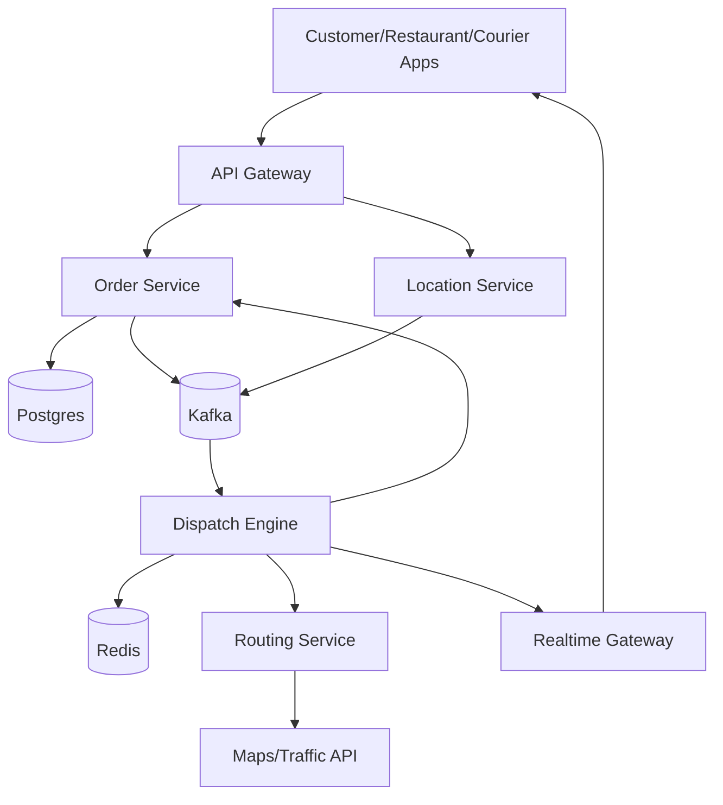
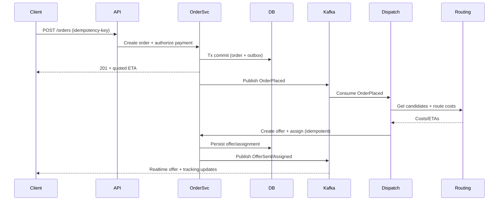

## Overview

Food delivery logistics is a real-time coordination problem across a 3-sided marketplace (customers, restaurants, couriers) where conditions change every second: courier locations move, restaurants have variable prep times, and customer demand spikes unpredictably. The core challenge is making fast, high-quality assignment decisions (which courier delivers which order) while meeting SLAs (ETA, freshness), minimizing cost (courier travel, idle time), and keeping the system fair and reliable at high event rates (location updates).

The key insight is to separate *transactional correctness* (orders, payments, state transitions) from *real-time optimization* (dispatch, batching, routing). We build an event-driven system where an optimization engine continuously computes assignments using near-real-time state (locations, prep estimates, capacity), applies decisions via idempotent state transitions, and re-optimizes as new signals arrive—without blocking the critical checkout path.

## Requirements

### Functional Requirements
- Create orders, validate availability, and place an order with a quoted fee and ETA.
- Restaurants accept/reject orders and provide prep-time updates (manual or automated).
- Couriers go online/offline, stream location updates, and receive offers (single or batched).
- Dispatch engine assigns orders to couriers and supports batching/stacking (e.g., 2–3 orders per trip) with constraints (max detour, max wait).
- Routing engine produces a stop sequence (pickup(s) → dropoff(s)) and continuously updates ETA.
- Real-time tracking for customers and restaurants (courier location, status, ETA).
- Handle exceptions: courier rejects/cancels, restaurant delays, customer cancels/refunds, re-dispatch with minimal disruption.
- Auditability: full event history of order/dispatch decisions for support and dispute resolution.

### Non-Functional Requirements
- **Scale**:
  - 10M MAU, 1M DAU
  - Peak 50k orders/hour (~14 orders/sec) per large metro; global peak 500 orders/sec
  - 200k online couriers globally; location updates at 1 Hz → 200k events/sec peak ingestion
  - Status/event writes: 20k events/sec peak
- **Latency**:
  - Order placement API P99 < 300ms (excluding payment provider)
  - Dispatch decision latency (order ready-to-assign → offer created) P99 < 1s
  - ETA refresh latency (location update → customer ETA update) P99 < 2s
- **Availability**:
  - Customer order placement and payment: 99.99%
  - Courier offer delivery + tracking: 99.95%
- **Consistency**:
  - Strong consistency for order/payment state transitions (exactly-once semantics from the user perspective)
  - Eventual consistency acceptable for location, ETA, and heatmaps (bounded staleness, e.g., <5s)
- **Durability**:
  - Orders/payments: no data loss (RPO ~ 0 for committed transactions)
  - Telemetry/location: tolerate limited loss (e.g., up to 1–2% during transient network issues)

### Constraints & Assumptions
- Multi-region deployment; dispatch decisions are *regional* (per metro) to keep latency low and state localized.
- Third-party mapping/traffic provider may be rate-limited; system must cache and degrade gracefully.
- Team can operate Kafka-like messaging and Redis-like caches; avoid exotic infrastructure unless justified.
- Compliance: PCI handled by payment processor; PII encrypted at rest and access-audited.

## High-Level Architecture



The system is split into two planes. The **transaction plane** (API Gateway + Order Service + transactional DB) owns canonical order and payment state with strong consistency and clear state machines. The **optimization plane** (Dispatch Engine + Routing Service) consumes an event stream of orders, prep-time updates, courier availability, and locations to continuously compute assignments and route plans.

Kafka decouples producers (apps/services) from consumers (dispatch, analytics), supports replay for audit/debugging, and enables scalable stream processing. Redis holds hot, ephemeral state (active couriers in a geofence, candidate sets, in-flight offers) to meet sub-second dispatch targets without hammering the transactional database.

## Component Deep-Dive

### Order Service

**Responsibility**: Owns the order lifecycle (create/confirm/prepare/pickup/deliver/cancel), payments, refunds, and canonical state transitions.

**Key Design Decisions**:
- Use a strict state machine with idempotent transitions to prevent double assignment, double refunds, or illegal jumps.
- Use the Outbox Pattern to emit domain events (OrderPlaced, RestaurantAccepted, OrderCanceled) transactionally with DB commits.

**Technology Choice**: Postgres (transactionality, constraints, SQL), plus a message bus (Kafka) for event distribution.

**Scaling Strategy**: Horizontally scale stateless API workers; partition data by region/city; read replicas for support/analytics queries.

---

### Location Service

**Responsibility**: Ingests courier location updates, normalizes them, and publishes to the event bus; serves “last known location” for tracking.

**Key Design Decisions**:
- Separate high-QPS telemetry ingestion from the transactional order path; drop/aggregate locations under overload rather than failing orders.
- Use geospatial indexing (H3/S2 cells) to bucket couriers for fast candidate lookups.

**Technology Choice**: Stateless ingestion service + Kafka topic; Redis for “latest location per courier” and “couriers by cell” sets; optional time-series store (Cassandra/ClickHouse) for history.

**Scaling Strategy**: Partition Kafka by region and by courier_id; autoscale ingestion workers; backpressure with bounded queues.

---

### Dispatch Engine (Coordination + Batching)

**Responsibility**: Matches orders to couriers, creates offers, supports batching/stacking, and triggers re-dispatch on exceptions.

**Key Design Decisions**:
- Use a two-stage approach: fast heuristic candidate selection (geo + constraints) followed by a bounded optimization step to choose the best assignment under SLA.
- Treat offers as leases with TTL (e.g., 20–30s). If not accepted, automatically roll over to next candidates without manual intervention.

**Technology Choice**: Stateful service per region; Redis for hot state and distributed locks/leases; Kafka consumer group for events; gRPC to Routing Service.

**Scaling Strategy**: Shard by region and by H3 cell ranges; run multiple replicas with partition ownership (Kafka partitions) to keep state localized.

---

### Routing Service (ETA + Stop Sequencing)

**Responsibility**: Computes ETAs and feasible stop sequences for single and batched deliveries; updates as traffic/prep signals change.

**Key Design Decisions**:
- Use incremental re-optimization: adjust only the remaining route legs when new delays arrive instead of recomputing everything.
- Cache route legs (A→B travel times) with short TTL (e.g., 60–180s) to reduce dependency on external maps.

**Technology Choice**: OR-Tools (VRP/TSP heuristics) for sequencing under constraints; external Maps/Traffic API for travel-time estimates; Redis for route cache.

**Scaling Strategy**: Stateless compute tier; rate-limit and cache map calls; fall back to historical speeds when provider degrades.

---

### Realtime Gateway

**Responsibility**: Pushes live updates (offer notifications, status changes, courier location, ETA) to clients via WebSockets/APNs/FCM.

**Key Design Decisions**:
- Fanout via pub/sub channels keyed by order_id and courier_id to avoid per-client polling.
- Deliver at-least-once messages with client-side de-duplication using monotonically increasing sequence numbers.

**Technology Choice**: WebSocket gateway + Redis pub/sub or Kafka consumer; push notification services for background delivery.

**Scaling Strategy**: Stateless nodes behind L7 load balancer; sticky sessions for WebSockets; regional deployment for low latency.

## Data Model

### Storage Schema

**Postgres (canonical)**
- `restaurants`
  - `restaurant_id (PK)`, `name`, `address`, `lat`, `lng`, `hours`, `status`
- `couriers`
  - `courier_id (PK)`, `status (online/offline)`, `vehicle_type`, `home_region`
- `orders`
  - `order_id (PK)`, `customer_id`, `restaurant_id`, `status`, `created_at`
  - `subtotal_cents`, `delivery_fee_cents`, `currency`
  - `dropoff_lat`, `dropoff_lng`
  - `quoted_eta_ts`, `sla_deadline_ts`
  - `idempotency_key`, `region_id`
- `deliveries`
  - `delivery_id (PK)`, `order_id (FK)`, `courier_id (FK nullable)`
  - `batch_id (nullable)`, `status`, `assigned_at`, `picked_up_at`, `delivered_at`
- `offers`
  - `offer_id (PK)`, `courier_id`, `batch_id`, `status (sent/accepted/rejected/expired)`
  - `expires_at`, `created_at`, `version`
- `batches`
  - `batch_id (PK)`, `region_id`, `status`
  - `restaurant_id (nullable for multi-merchant batching if supported)`
- `batch_stops`
  - `batch_id (FK)`, `stop_index`, `stop_type (pickup/dropoff)`
  - `order_id`, `lat`, `lng`, `eta_ts`
- `outbox_events`
  - `event_id (PK)`, `aggregate_type`, `aggregate_id`, `event_type`, `payload_json`, `created_at`, `published_at`

**Redis (ephemeral/hot)**
- `courier:last_location:{courier_id} -> {lat,lng,ts,heading,speed}`
- `cell:couriers:{h3_cell} -> set(courier_id)`
- `dispatch:offer_lease:{offer_id} -> ttl`
- `order:active:{order_id} -> {constraints,region,restaurant_cell,...}` (short TTL)

**Kafka (event stream)**
- Topics: `orders.events`, `restaurants.events`, `couriers.location`, `dispatch.events`, `eta.updates`

### Data Flow



## API Design

### External (REST)

**Create Order**
- `POST /v1/orders`
- Headers: `Idempotency-Key: <uuid>`
- Request:
  ```json
  {
    "restaurant_id": "r_123",
    "items": [{"sku":"burger","qty":1}],
    "dropoff": {"lat": 37.78, "lng": -122.41},
    "payment_token": "tok_xxx"
  }
  ```
- Response `201`:
  ```json
  {
    "order_id": "o_456",
    "status": "PLACED",
    "delivery_fee_cents": 399,
    "quoted_eta_seconds": 2100
  }
  ```
- Errors: `409` (idempotency conflict), `402` (payment failed), `422` (out of range/closed)

**Courier Location Update**
- `POST /v1/couriers/{courier_id}/location`
- Request:
  ```json
  {"lat":37.78,"lng":-122.41,"ts":"2025-12-17T12:00:00Z","heading":120,"speed_mps":8.2}
  ```
- Response: `202 Accepted`
- Notes: rate-limited; client should batch if network is poor.

**Courier Offer Actions**
- `POST /v1/couriers/{courier_id}/offers/{offer_id}:accept`
- `POST /v1/couriers/{courier_id}/offers/{offer_id}:reject`
- Idempotency: accept/reject are idempotent by `offer_id` + `version`; return `409` on stale version.

**Order Tracking**
- `GET /v1/orders/{order_id}/tracking`
- Response includes courier location (possibly stale), ETA, and status; cacheable for a few seconds with ETag.

### Internal (gRPC)

**RoutingService.GetRouteCosts**
- Inputs: courier current location, pickup/dropoff candidates, time window constraints
- Outputs: travel-time matrix (bounded), feasible stop sequences, ETA deltas

**Error handling approach**
- Use typed error codes (INVALID_ARGUMENT, FAILED_PRECONDITION, RESOURCE_EXHAUSTED).
- Ensure every state-changing endpoint supports idempotency keys or natural idempotency via resource IDs.

## Scaling & Performance

### Bottleneck Analysis
- **Location ingestion (200k events/sec)**: mitigate with partitioned Kafka topics, stateless ingestion autoscaling, and lossy aggregation (e.g., keep latest per courier per 1–2s under load).
- **Dispatch compute spikes**: bound optimization time (e.g., 50–150ms budget per order), use candidate caps (top 50 couriers), and fall back to greedy assignment.
- **Maps/traffic dependency**: heavy caching of route legs, asynchronous refresh, and degrade to historical speeds if provider fails.

### Horizontal Scaling
- **API layer**: stateless scale-out behind L7 LB; regional routing by user geo.
- **Kafka**: partition by `region_id` and `courier_id`; consumer groups per service.
- **Dispatch Engine**: shard by region + H3 cell ranges; keep “active orders” state local to shard to avoid cross-node locks.
- **Datastores**: Postgres partitioning by region/time, read replicas; Redis clustered with hash tags per region.

### Caching Strategy
- **Route legs cache** (Redis): key `(cellA, cellB, time_bucket)` TTL 60–180s; reduces map calls dramatically.
- **Active courier sets** (Redis): `cell:couriers:*` updated by Location Service; TTL per courier membership ~10s to evict silent clients.
- **Order tracking**: CDN/edge cache for customer polling endpoints with TTL 2–5s; WebSockets preferred for realtime.

Cache invalidation is primarily TTL-based due to highly dynamic data; correctness-critical data is never solely cache-backed.

## Trade-offs & Alternatives

### Key Trade-offs Made
- **Event-driven optimization plane**
  - Chosen: Kafka + async dispatch
  - Sacrificed: simple synchronous “assign on write” logic
  - Why: isolates high-QPS telemetry and complex optimization from checkout reliability/latency.
- **Heuristics + bounded optimization**
  - Chosen: candidate pruning + fast scoring + optional OR-Tools step
  - Sacrificed: globally optimal assignments
  - Why: strict latency budgets and constantly changing inputs make full VRP optimality impractical online.
- **Regional sharding**
  - Chosen: per-metro dispatch ownership
  - Sacrificed: cross-region pooling (rarely needed) and some operational complexity
  - Why: lower latency, smaller state, simpler failure containment.

### Alternative Approaches
- **Fully centralized global dispatcher**: simpler coordination but higher latency, massive state, and large blast radius during incidents.
- **Purely greedy nearest-courier assignment**: easy and fast, but poor batching, higher costs, and worse ETAs under load.
- **Push optimization to clients (courier app chooses)**: reduces server compute but leads to gaming, inconsistent SLAs, and weak auditability.

## Failure Modes & Mitigations

### Failure Scenarios
- **Scenario**: Kafka lag or partition outage in a region  
  **Impact**: delayed dispatch decisions, stale ETAs  
  **Detection**: consumer lag metrics, “order unassigned age” SLOs  
  **Mitigation**: isolate by region topic/cluster; auto-scale consumers; emergency synchronous dispatch mode reading from DB/Redis for new orders only.

- **Scenario**: Redis cluster degradation (hot state unavailable)  
  **Impact**: slower candidate lookups; higher dispatch latency  
  **Detection**: Redis latency/error rate; dispatch compute time  
  **Mitigation**: fallback to Postgres + in-process caches with smaller candidate sets; shed batching first (single-order assignment).

- **Scenario**: Maps/traffic provider outage or throttling  
  **Impact**: ETAs less accurate; routing might be suboptimal  
  **Detection**: provider error rates, cache hit drop  
  **Mitigation**: cached legs + historical speed models; disable advanced batching constraints that require precise travel times.

- **Scenario**: Double assignment due to retries/races  
  **Impact**: two couriers show up; cost and user trust hit  
  **Detection**: invariant checks (one active delivery per order), audit alerts  
  **Mitigation**: strong DB constraints + idempotent transitions; offers as leases; compare-and-swap on delivery assignment version.

- **Scenario**: Courier app silent (no location, but still “online”)  
  **Impact**: bad assignments and missed ETAs  
  **Detection**: heartbeat staleness metrics per courier  
  **Mitigation**: TTL-based eviction from active sets; require periodic pings; downgrade courier score when stale.

### Disaster Recovery
- **Targets**: RTO 15 minutes per region; RPO 1 minute for transactional data.
- **Backup strategy**: Postgres PITR + daily snapshots; Kafka topic replication + retention aligned with replay needs (e.g., 7–14 days).
- **Failover procedures**: per-region active/standby for transactional DB; dispatch can restart from Kafka offsets + DB canonical state; rehydrate Redis from latest events and “courier online” snapshots.

## Operational Considerations

### Monitoring & Alerting
- Core SLOs:
  - Order placement success rate and P99 latency
  - Dispatch decision latency P50/P99; “unassigned age” histogram
  - Offer acceptance rate, reject rate, expiration rate
  - ETA accuracy (predicted vs actual) and SLA miss rate
- Infra alerts:
  - Kafka consumer lag, partition under-replication
  - Redis/DB latency and error rates
  - Maps provider quota/utilization and error bursts

### Deployment Strategy
- Use canary + feature flags for dispatch algorithms (scoring weights, batching windows, constraints).
- Shadow-mode new optimizers: compute decisions but don’t apply; compare outcomes offline before enabling.
- Rollback: revert flag/config first; then roll back binaries if needed. Keep backward-compatible event schemas (versioned payloads).

## References & Further Reading

- Google OR-Tools (Vehicle Routing Problem): https://developers.google.com/optimization
- Uber Engineering on dispatch/marketplace systems (various posts): https://www.uber.com/blog/engineering/
- DoorDash Engineering blog (dispatch/logistics topics): https://doordash.engineering/
- H3 Hexagonal Hierarchical Geospatial Indexing System: https://h3geo.org/
- Designing Data-Intensive Applications (Kleppmann) — event streams, consistency, state machines
- Kafka design patterns: Outbox Pattern, consumer lag handling, schema evolution (Avro/Protobuf + registry)