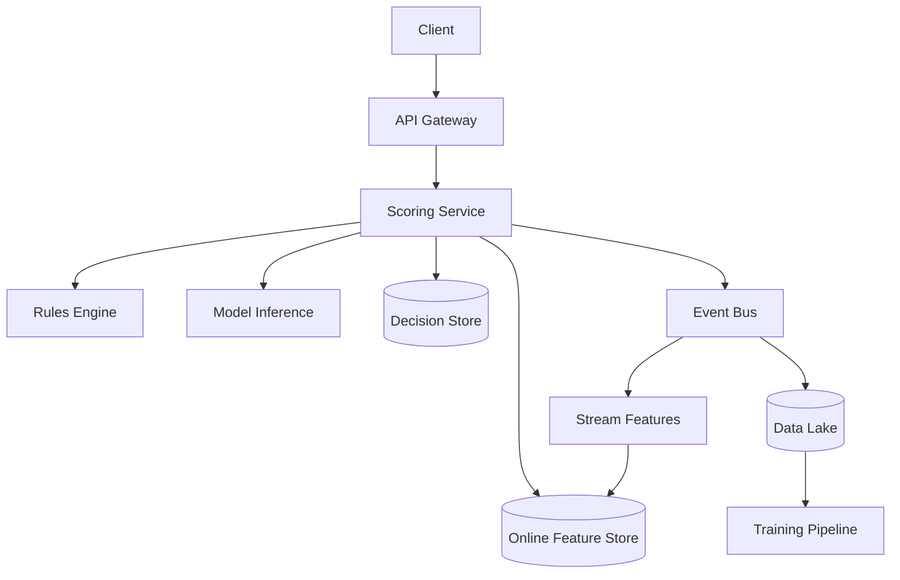
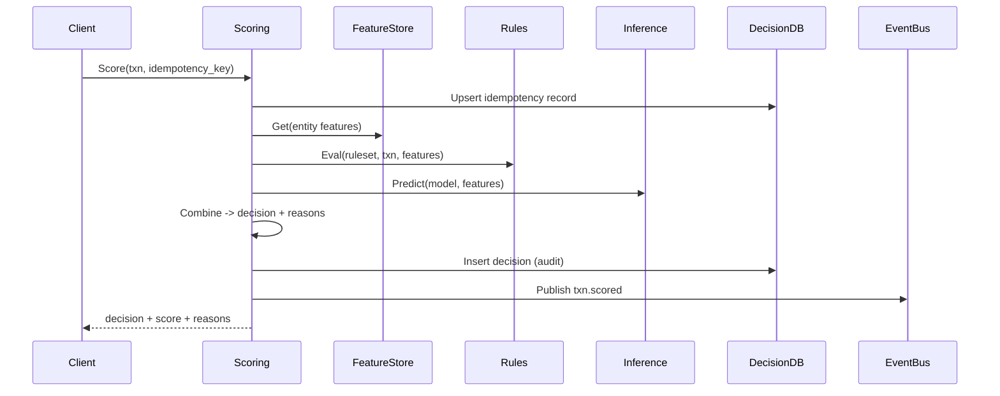

## Overview

A real-time fraud detection pipeline scores payment/transfer transactions in milliseconds using a mix of deterministic rules and probabilistic ML models. The core challenge is making high-quality decisions under tight latency budgets while ingesting high-throughput event streams, joining against rapidly changing behavioral signals, and remaining resilient to partial outages (feature sources, model servers, stream backlogs).

The key insight is to separate **online decisioning** (fast path) from **feature computation and learning** (slow/async paths). Online scoring uses an **online feature store** optimized for low-latency reads, a **versioned rules engine**, and a **hardened inference service** with graceful degradation. Streaming jobs continuously update features and labels so that the system improves without destabilizing real-time performance.

## Requirements

### Functional Requirements
- Score every transaction in real time and return a risk score + decision (`ALLOW/CHALLENGE/DENY`) with reasons.
- Support a versioned rules engine (authoring, testing, rollout, audit trail, and instant rollback).
- Compute streaming features (velocity, device reputation, merchant risk, geo anomalies) with near-real-time freshness.
- Perform ML inference online with model versioning, shadow evaluation, and A/B experiments.
- Persist decisions, features used (or their hashes), and explanations for audit and dispute handling.
- Provide case management hooks (queue suspicious events, annotate outcomes, export to analysts).
- Ingest post-transaction outcomes (chargebacks, confirmed fraud, manual reviews) as labels for retraining.
- Offer real-time monitoring dashboards and alerts for latency, drift, and rule/model health.

### Non-Functional Requirements
- **Scale**: 5K steady-state TPS, bursts to 50K TPS; 100M cards/users; 1–3B events/day (transactions + signals).
- **Latency**: Online scoring P50 < 30ms, P99 < 120ms end-to-end (client → decision); rules eval < 5ms; model inference < 20ms P99.
- **Availability**: 99.99% for the scoring API; 99.9% for streaming feature freshness.
- **Consistency**: Strong consistency for idempotency + decision persistence; eventual consistency for derived features and labels.
- **Durability**: No loss of accepted transactions; decisions/logs durable within seconds (RPO ≤ 1 min for audit stream).

### Constraints & Assumptions
- Multi-region deployment (2 regions), but payment authorization is region-affine (a transaction is scored in its ingress region).
- Compliance: PCI-DSS scope minimized (tokenized PAN; no raw PAN in logs/events); PII encrypted at rest and access-controlled.
- Team: 6–10 engineers; prefer managed components where possible; must support iterative model/rule changes with low operational risk.
- Network access to third-party risk providers is unreliable/slow; online path must not hard-depend on them.

## High-Level Architecture



The online path is the **Scoring Service**, which synchronously evaluates rules and ML using low-latency dependencies: a rules engine (in-process or sidecar), an online feature store (Redis/Cassandra/DynamoDB-class), and a model inference tier (Triton/TF Serving/custom gRPC). Every decision is persisted for audit and emitted to an event bus.

The event bus decouples real-time decisioning from expensive computation: streaming jobs compute rolling aggregates and reputations and update the online store, while all raw/curated data lands in the lake for offline analytics, training, and backtesting. This separation allows independent scaling and failure isolation.

## Component Deep-Dive

### Scoring Service

**Responsibility**: Orchestrate feature fetch, rules evaluation, ML inference, decisioning, and response composition.

**Key Design Decisions**:
- Use a strict **latency budget** with timeouts per dependency (e.g., 10ms feature reads, 25ms inference) and degrade gracefully.
- Make requests **idempotent** using `transaction_id` + `idempotency_key` to prevent double-charges/duplicate decisions.

**Technology Choice**: Go/Java service behind Envoy; gRPC internally; OpenTelemetry for traces.

**Scaling Strategy**: Stateless horizontal scaling; shard-heavy caches by key; autoscale on p99 latency + CPU.

### Online Feature Store

**Responsibility**: Serve low-latency feature vectors for entities (account, card, device, merchant) used in scoring.

**Key Design Decisions**:
- Store features as **entity-keyed blobs** (or wide rows) with explicit feature versioning and TTLs for time-bounded signals.
- Separate “hot” features (velocity, recent history) from “warm” features (reputation) to optimize read paths.

**Technology Choice**: Redis Cluster for hot counters + DynamoDB/Cassandra for durable low-latency reads; optional RocksDB state in Flink for intermediate aggregation.

**Scaling Strategy**: Partition by `entity_id` hash; pre-warm caches; multi-AZ replication; write-behind from stream processors.

### Rules Engine

**Responsibility**: Deterministic policy checks, thresholds, allow/deny lists, and step-up authentication triggers with explanations.

**Key Design Decisions**:
- Rules are **versioned artifacts** with staged rollout (shadow → canary → full) and audit logs for every change.
- Rules run **close to scoring** (embedded or sidecar) to avoid network hops and enable micro-latency.

**Technology Choice**: CEL/OPA/Rego or a custom DSL; rules stored in Postgres with signed bundles shipped to scorers.

**Scaling Strategy**: Distribute rules bundles via CDN/object storage; scorers cache in memory and hot-reload safely.

### Model Inference Service

**Responsibility**: Serve ML models for fraud probability and optional secondary models (bot/device, mule detection).

**Key Design Decisions**:
- Prefer **small, fast models** for online (GBDT/LightGBM, distilled neural nets) with deterministic preprocessing.
- Support **shadow + A/B** with per-request model assignment for safe rollout and continuous evaluation.

**Technology Choice**: NVIDIA Triton / TensorFlow Serving / TorchServe; feature preprocessing in the scoring service or inference server with strict schema.

**Scaling Strategy**: Horizontal pod autoscaling on GPU/CPU utilization and request concurrency; local model caching; circuit breaker on tail latency.

### Streaming Feature Pipeline

**Responsibility**: Consume event streams and compute near-real-time aggregates (velocity, patterns, graph signals) and write them to the online store.

**Key Design Decisions**:
- Use **event time + watermarks** for correctness under out-of-order events; define a bounded lateness (e.g., 5 minutes).
- Maintain **exactly-once** for critical aggregates where feasible; otherwise at-least-once with idempotent upserts and reconciliation.

**Technology Choice**: Kafka/Pulsar + Flink; schema registry (Protobuf/Avro).

**Scaling Strategy**: Scale by topic partitions; key by `account_id`/`card_id` to keep entity state local; manage hot keys with salt/partitioning.

## Data Model

### Storage Schema

**Decision Store (Postgres/CockroachDB)**
- `decisions`
  - `decision_id` (UUID, PK)
  - `transaction_id` (string, unique with `tenant_id`)
  - `tenant_id` (string)
  - `created_at` (timestamp)
  - `decision` (enum: ALLOW/CHALLENGE/DENY)
  - `risk_score` (float 0..1)
  - `rules_version` (string)
  - `model_version` (string)
  - `reason_codes` (jsonb array)
  - `features_digest` (string) // hash of feature vector for audit
  - `latency_ms` (int)
  - `idempotency_key` (string)
- `rulesets`
  - `rules_version` (string, PK)
  - `status` (enum: DRAFT/SHADOW/CANARY/ACTIVE/ROLLED_BACK)
  - `bundle_uri` (string)
  - `created_by` (string)
  - `created_at` (timestamp)
  - `change_summary` (text)

**Online Feature Store (Redis + DynamoDB/Cassandra)**
- Key: `entity:{type}:{id}:v{schema_version}`
  - Value: map of feature_name → value + `updated_at`
  - TTL per feature group (e.g., velocity TTL 7d, device reputation TTL 90d)
- Hot counters (Redis):
  - `cnt:{entity}:{window}` → integer (e.g., 5m, 1h, 24h)

**Event Bus Topics (Kafka/Pulsar)**
- `txn.ingested.v1`
- `txn.scored.v1`
- `signals.device.v1`
- `labels.chargeback.v1`
- `cases.created.v1`

**Data Lake (S3/GCS + Iceberg/Delta)**
- Partitioned by `event_date` + `tenant_id`; immutable raw + curated feature tables; model training datasets with lineage.

### Data Flow



## API Design

### Online Scoring (REST or gRPC)

**POST `/v1/score`**
- Request
  - Headers: `Idempotency-Key: <uuid>`
  - Body:
    ```json
    {
      "tenant_id": "acme-pay",
      "transaction_id": "txn_123",
      "timestamp_ms": 1730000000000,
      "amount": {"currency":"USD","value":1299},
      "payment_method": {"type":"card","token":"tok_x"},
      "merchant_id": "m_456",
      "account_id": "a_789",
      "device_id": "d_abc",
      "ip": "203.0.113.1",
      "metadata": {"channel":"web"}
    }
    ```
- Response `200`
  ```json
  {
    "decision_id": "dec_1",
    "decision": "CHALLENGE",
    "risk_score": 0.87,
    "reason_codes": ["VELOCITY_HIGH","DEVICE_NEW","GEO_ANOMALY"],
    "rules_version": "rules_2025_01_01",
    "model_version": "fraud_xgb_v42",
    "ttl_ms": 300000
  }
  ```
- Error handling
  - `409` idempotency conflict (same key, different payload hash)
  - `429` rate limited
  - `503` dependency unavailable (only if no safe fallback exists)
- Idempotency
  - Store `(tenant_id, transaction_id, idempotency_key)` with payload hash; return prior `decision_id` on retry.

### Decision Lookup

**GET `/v1/decisions/{decision_id}`**
- Returns stored decision, versions, reasons, and audit metadata (PII minimized).

### Feedback / Labels

**POST `/v1/labels`**
- Used by chargeback pipeline / analysts:
  ```json
  {
    "tenant_id":"acme-pay",
    "transaction_id":"txn_123",
    "label":"FRAUD_CONFIRMED",
    "source":"chargeback",
    "occurred_at_ms":1730500000000
  }
  ```
- Idempotent on `(tenant_id, transaction_id, label, source)`.

### Rules Management (Admin)

**POST `/v1/rulesets`**, **POST `/v1/rulesets/{version}/rollout`**, **POST `/v1/rulesets/{version}/rollback`**
- Requires strong auth (SSO + RBAC), full audit trail, and backtesting results attachment.

## Scaling & Performance

### Bottleneck Analysis
- **Feature fetch fan-out**: mitigate with entity batching, co-located caches, strict timeouts, and compact feature representations.
- **Inference tail latency**: mitigate with warmed models, concurrency limits, smaller models, and circuit breakers.
- **Hot keys (popular merchants/devices)**: mitigate with key salting for counters and hierarchical aggregation (merchant→bucket→merchant).
- **Kafka lag / stream backpressure**: mitigate with autoscaling consumers, partition tuning, and separating topics by SLA.

### Horizontal Scaling
- **API/Scoring**: stateless; scale on RPS and p99; keep dependency budgets fixed.
- **Event bus**: increase partitions; key by `account_id` or `card_id` for state locality.
- **Streaming**: Flink parallelism aligned with partitions; RocksDB state sized with TTL; spill-to-disk planning.
- **Feature store**: shard by entity hash; multi-AZ replicas; read-through cache for warm features.

### Caching Strategy
- **In-process cache**: ruleset bundle + model routing config (TTL minutes, push invalidation on rollout).
- **Redis**: hot counters and recent-activity features (TTL aligned with window).
- **Feature vector cache**: short TTL (e.g., 1–5s) per `(account_id, device_id)` to absorb retries/bursts.
- Invalidation: streaming writes overwrite latest feature values; rules/model changes bump version keys to avoid stale semantics.

## Trade-offs & Alternatives

### Key Trade-offs Made
- **Online feature store vs on-the-fly joins**: chose precomputed features for latency; sacrificed some feature freshness/complex joins.
- **Rules + ML hybrid**: chose interpretable rules for policy and ML for patterns; sacrificed simplicity (two decision mechanisms).
- **Region-affine scoring**: chose to keep latency low and reduce cross-region calls; sacrificed global real-time features (handled via async replication).

### Alternative Approaches
- **Fully online feature computation** (querying OLAP/graph DB at score time): rejected due to unpredictable tail latency.
- **Single monolithic “fraud platform” service**: rejected due to deploy risk and inability to scale components independently.
- **Active-active global feature store with strong consistency**: rejected due to cost/complexity; eventual cross-region replication is sufficient for most features.

## Failure Modes & Mitigations

### Failure Scenarios
- **Scenario**: Online feature store degraded
  - **Impact**: Higher false positives/negatives; latency spikes
  - **Detection**: Feature read p99, error rate, cache hit ratio drop
  - **Mitigation**: Serve partial feature vector + conservative rules; fallback to last-known-good cached features; circuit-breaker and shed non-critical features.
- **Scenario**: Inference service outage
  - **Impact**: Cannot compute ML probability
  - **Detection**: gRPC error rate, timeouts, model health checks
  - **Mitigation**: Rules-only mode (policy thresholds), or use a smaller “backup” model embedded in scoring.
- **Scenario**: Kafka outage / partition unavailability
  - **Impact**: Feature freshness degrades; delayed labels
  - **Detection**: Producer/consumer errors, lag metrics
  - **Mitigation**: Buffer locally with bounded queue; fail open/closed by tenant policy; replay from durable log when restored.
- **Scenario**: Duplicate / out-of-order events
  - **Impact**: Inflated counters, wrong velocity features
  - **Detection**: Dedup rate anomalies; counter sanity checks
  - **Mitigation**: Idempotent event IDs; windowed dedup in stream; periodic reconciliation in batch.
- **Scenario**: Model drift / data quality regression
  - **Impact**: Systematically bad decisions
  - **Detection**: Online feature distribution monitors, PSI, label-based performance, shadow model comparison
  - **Mitigation**: Auto-disable model version; rollback; enforce schema validation and “safe defaults.”

### Disaster Recovery
- **RTO/RPO**: RTO 30 minutes (scoring), RPO 1 minute for decision/audit stream, RPO 15 minutes for derived features.
- **Backup strategy**: Decision DB PITR + daily snapshots; rules/model artifacts stored in versioned object storage; lake tables with cross-region replication.
- **Failover procedures**: DNS/GSLB to standby region; warm pools for scoring + inference; replay event bus where supported.

## Operational Considerations

### Monitoring & Alerting
- Key metrics:
  - Scoring: request rate, p50/p99 latency, timeouts by dependency, decision distribution, idempotency conflicts
  - Feature store: hit rate, p99, replication lag, missing-feature rate
  - Inference: p99, saturation, model load failures, version skew
  - Streaming: consumer lag, watermark delay, state size, checkpoint duration
  - Quality: chargeback rate, approval rate, false positive proxy (manual review overturns), drift metrics (PSI)
- Alert thresholds (examples):
  - Scoring p99 > 120ms for 5m
  - Feature missing rate > 2% for 10m
  - Inference error rate > 1% for 5m
  - Stream watermark delay > 10m for 15m

### Deployment Strategy
- **Scoring service**: canary by tenant and traffic %, automatic rollback on latency/error SLO breach.
- **Rules**: publish signed bundle → shadow evaluate → canary decisioning → full activate; one-click rollback to prior version.
- **Models**: registry + immutable version IDs; shadow + A/B; promotion gates on offline + online metrics; rollback supported instantly via routing config.

## References & Further Reading
- Kafka Exactly-Once Semantics: https://kafka.apache.org/documentation/#semantics
- Apache Flink Stateful Streaming + Checkpointing: https://nightlies.apache.org/flink/flink-docs-stable/docs/learn-flink/fault_tolerance/
- Google “Rules of Machine Learning” (production ML pitfalls): https://developers.google.com/machine-learning/guides/rules-of-ml
- OPA/Rego policy engine: https://www.openpolicyagent.org/docs/latest/
- Feature Stores (concepts and trade-offs): Feast docs https://docs.feast.dev/
- Real-world inspiration: Stripe Radar (product-level view of hybrid rules+ML fraud systems)