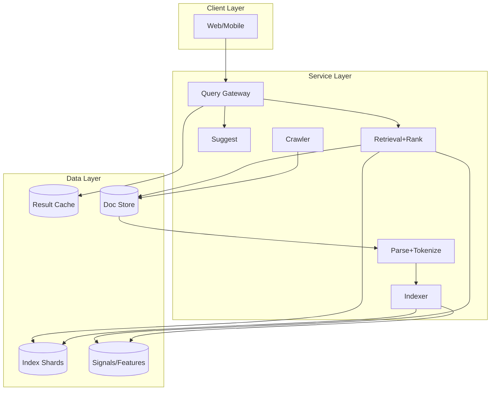
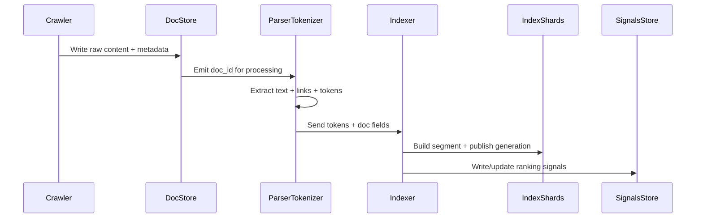

## Overview

A general-purpose search engine is fundamentally two systems working in lockstep: an indexing pipeline that continuously converts a huge, messy, and adversarial web corpus into a queryable index, and a ranker that returns the most useful results under tight latency budgets. The challenge is not just scale (billions of documents, petabytes of content, and hundreds of thousands of queries per second), but also correctness under change: pages update, links shift, spam evolves, and user intent is ambiguous.

The key insight is to separate concerns into (1) a high-throughput, fault-tolerant ingestion pipeline (crawl → extract → tokenize → index), (2) offline computation of long-lived signals (PageRank-like link analysis, quality/spam classifiers, embeddings), and (3) a low-latency online retrieval + ranking stack (lexical retrieval + lightweight LTR + optional neural re-rank). This yields predictable serving latency while keeping the index fresh and ranking quality high.

## Requirements

### Functional Requirements
- Crawl and refresh documents at scale with politeness (robots.txt, rate limits) and coverage controls.
- Extract canonical content from heterogeneous formats (HTML/PDF/etc.), normalize, and deduplicate near-identical documents.
- Tokenize text (language-aware), build an inverted index with positions for phrase queries, and support incremental updates.
- Compute and store ranking signals (link graph metrics, freshness, quality/spam scores, embeddings).
- Serve search queries with top-K results, snippets/highlights, safe-search filtering, and basic operators (site:, phrase, time).
- Provide query suggestions/autocomplete based on query logs and document stats.
- Provide observability and controls for crawl/index freshness, backfills, and incident response (pause domains, reindex).
- Support experimentation (A/B buckets) and rapid rollouts for ranking models and index schema versions.

### Non-Functional Requirements
- **Scale**:
  - Corpus: 50B documents, ~5 PB compressed content, ~0.5–1% updated/day.
  - Crawl throughput: 100K–300K pages/sec sustained (peaks higher for backfills).
  - Query load: 50K QPS average, 200K QPS peak (global).
  - Index size: 1–3× raw text after postings + signals; multi-tier storage.
- **Latency** (query path):
  - P50: 40 ms, P99: 250 ms (excluding client network).
  - Autocomplete P99: 50 ms.
- **Availability**:
  - Query serving: 99.99% (multi-region).
  - Indexing pipeline: 99.9% (can lag; must not corrupt).
- **Consistency**:
  - Serving reads: consistent within a shard generation; cross-shard eventual during rolling index updates.
  - Crawl/index freshness: eventual (minutes to hours).
  - Config/feature flags: strongly consistent.
- **Durability**:
  - Content and index: no more than 5 minutes of data loss for ingestion metadata; index segments recoverable from replicated object storage.

### Constraints & Assumptions
- Team: ~10–20 engineers initially; must favor proven components and operational simplicity.
- Compliance: respect robots.txt, legal takedowns, and retention limits for raw content where required.
- Network: restricted outbound egress from data centers; crawler runs in controlled NAT pools with reputation management.
- Budget: optimize for cost-per-query; neural re-rank is selective and bounded.

## High-Level Architecture



This architecture isolates the write-heavy ingestion pipeline from the read-heavy serving path. The crawler and content processing are optimized for throughput and correctness (dedupe, extraction, language), while the indexer focuses on building immutable index segments and publishing them atomically to serving shards. Serving uses a classic scatter-gather retrieval path over doc-sharded index partitions, with cache layers and strict latency budgets.

Signals (link analysis, spam/quality, embeddings, click models) are computed offline or asynchronously and stored separately so the online ranker can fetch lightweight features without coupling to heavy batch jobs. Index publishing uses generation IDs per shard to ensure atomic cutovers and fast rollback.

## Component Deep-Dive

### Crawler

**Responsibility**: Discover URLs, fetch content, enforce politeness, and maintain crawl freshness.

**Key Design Decisions**:
- Frontier as prioritized queues (per-host/per-domain) with politeness tokens to prevent overload and manage fairness.
- Strong dedupe on URL and content (canonicalization + hash + near-duplicate detection) to avoid crawl traps and wasted compute.

**Technology Choice**: Custom crawler service with:
- Frontier: RocksDB/Cassandra for durable queues + Redis for hot scheduling.
- Fetchers: async IO (Rust/Go) with HTTP/2, TLS tuning, decompression limits.

**Scaling Strategy**:
- Horizontally scale fetchers; partition frontier by host hash.
- Adaptive scheduling: increase/decrease crawl rate based on latency/error signals per host.
- Multi-tier discovery: sitemaps, link extraction, feed ingestion, and “re-crawl” schedules.

### Parse + Tokenize Pipeline

**Responsibility**: Convert raw bytes into canonical text + metadata + tokens.

**Key Design Decisions**:
- Separate “content extraction” (HTML boilerplate removal, language detection, canonical URL) from tokenization to allow re-tokenization without refetching.
- Language-aware analyzers (stemming/lemmatization, segmentation for CJK) and normalization (case-folding, unicode NFKC).

**Technology Choice**:
- Streaming pipeline (Kafka/PubSub) + stateless processors (Flink/Spark Streaming optional).
- Content extraction: Readability-like extraction, PDF text extraction library, MIME sniffing.

**Scaling Strategy**:
- Stateless workers autoscaled on backlog/lag.
- Backpressure from indexer; dead-letter queues for malformed docs; per-format isolation to avoid noisy neighbors.

### Indexer

**Responsibility**: Build and publish inverted index segments and forward indexes; manage merges and deletions.

**Key Design Decisions**:
- Immutable segments (Lucene-style) with background compaction/merge to optimize query speed and storage.
- DocID assignment per shard with consistent hashing (doc-based sharding) to simplify updates/deletes and keep postings local.

**Technology Choice**:
- Lucene-compatible segment format (or OpenSearch/Elasticsearch internals if acceptable) stored on local SSD for serving; replicated to object storage for durability.
- Metadata/catalog in strongly consistent store (e.g., Spanner/etcd-backed control plane).

**Scaling Strategy**:
- Index shards split by docID; each shard has multiple replicas (serving) and a leader (publishing).
- Merge scheduling with IO budgets; tiered storage (hot SSD for recent segments, warm for older).

### Ranker (Offline + Online)

**Responsibility**: Retrieve candidate documents and rank them by relevance, quality, and safety.

**Key Design Decisions**:
- Two-stage ranking: fast lexical retrieval (BM25-like) + lightweight LTR (GBDT) + optional neural re-rank on top-N.
- Feature isolation: offline feature pipelines write to a feature store; online only reads bounded feature sets with strict timeouts.

**Technology Choice**:
- Retrieval: BM25/WAND/Block-Max WAND for early termination; impact-ordered postings.
- LTR: LightGBM/XGBoost model served via a low-latency model server.
- Neural re-rank: transformer cross-encoder for top 50–200 only; GPU pool optional.

**Scaling Strategy**:
- Scatter-gather to all shards; reduce fanout via shard prefiltering (term-to-shard stats), query pruning, and caching.
- Enforce time budgets per stage; degrade gracefully (skip neural, reduce features) under load.

### Query Gateway + Suggest

**Responsibility**: Handle request validation, normalization, caching, experiments, and routing.

**Key Design Decisions**:
- Normalize queries (spelling, tokenization, safe-search policy) consistently so caching is effective.
- Experiment framework at gateway to ensure stable bucketing and auditability.

**Technology Choice**:
- Stateless edge services (Envoy + Go/Java).
- Suggest backed by FST/trie or n-gram index; updated from query logs + doc stats.

**Scaling Strategy**:
- Anycast/multi-region; aggressive caching for hot queries and suggestions; per-region failover.

## Data Model

### Storage Schema

**Crawl Frontier (KV / Wide-column)**
- `url_key` (PK, normalized URL hash)
- `url` (string)
- `host_key` (string/hash)
- `priority` (int)
- `next_fetch_at` (timestamp)
- `etag` (string, optional)
- `last_modified` (timestamp, optional)
- `fetch_fail_count` (int)
- `status` (enum: queued, fetching, fetched, blocked, dead)

**Raw Document Store (Object storage + metadata DB)**
- `doc_id` (string)
- `canonical_url` (string)
- `content_blob_uri` (string)
- `content_type` (string)
- `fetched_at` (timestamp)
- `content_sha256` (bytes)
- `http_status` (int)
- `robots_policy` (enum)
- `parse_version` (int)

**Parsed Document (Columnar/Doc store)**
- `doc_id` (PK)
- `title` (string)
- `main_text` (string)
- `lang` (string)
- `out_links` (array<string>)
- `metadata` (json: headers, schema.org, etc.)
- `is_duplicate_of` (doc_id nullable)

**Inverted Index (Per-shard segments)**
- Term dictionary: `term -> (df, postings_pointer)`
- Postings: list of `(doc_id, tf, positions[], field_mask, payloads)` compressed (SIMD-friendly)
- Doc values: `doc_id -> {url, title, length, freshness, quality, spam_score, vector_id}`

**Signals / Feature Store**
- `doc_id` (PK)
- `pagerank` (float)
- `host_quality` (float)
- `freshness_score` (float)
- `spam_score` (float)
- `embedding` (vector reference or inline)
- `safety_labels` (enum set)

### Data Flow



## API Design

### Search API (REST)

**GET** `/v1/search?q={query}&limit=10&lang=en&safe=on&time=all`

Response (200):
```json
{
  "requestId": "uuid",
  "query": "system design atlas",
  "results": [
    {
      "docId": "d_123",
      "url": "https://example.com",
      "title": "Example",
      "snippet": "…highlighted text…",
      "score": 12.34
    }
  ],
  "nextPageToken": "opaque"
}
```

Errors:
- `400` invalid query/operator
- `429` rate limited
- `503` partial outage (includes `"degraded": true` and partial results when possible)

Idempotency:
- Query requests are naturally idempotent; include `requestId` for trace correlation and dedupe in logs.

### Suggest API

**GET** `/v1/suggest?prefix=sys%20des&limit=8`

Response (200):
```json
{ "suggestions": ["system design", "system design interview", "system design atlas"] }
```

### Internal Index Publish API (Control Plane)

**POST** `/internal/index/publish`
- Request includes `{ "shardId": 17, "generation": 1042, "segmentUris": [...] }`
- Idempotent via `(shardId, generation)`; rejects older generations.

## Scaling & Performance

### Bottleneck Analysis
- **Crawl bandwidth & traps**: mitigated by per-host budgets, URL canonicalization, trap heuristics, and content dedupe.
- **Parsing CPU hotspots** (PDF, JS-heavy pages): isolate workers by content-type; cap extraction time; render only for selected domains.
- **Index merge IO**: throttle merges, use tiered merging, separate merge nodes, and store hot segments on SSD.
- **Query fanout**: doc-sharded retrieval hits many shards; mitigated by shard pruning, early termination (WAND), and caching.
- **Re-rank cost**: neural models are expensive; bound to small N and skip under load.

### Horizontal Scaling
- **Crawler**: partition by host hash; scale fetchers independently from frontier schedulers.
- **Pipeline**: Kafka topic partitions by `doc_id`; stateless processors scale by consumer group.
- **Index**: shard by `doc_id` hash; replicas per shard for availability; add shards via consistent hashing + rebalancing.
- **Ranker**: scale stateless ranker instances; each ranker issues parallel RPCs to shard replicas and merges top-K.

### Caching Strategy
- **Result cache** (Gateway): cache top results for normalized queries (TTL 1–10 minutes), keyed by query+filters+experiment bucket.
- **Postings cache** (Shard nodes): cache hot term postings and doc values in memory (size-limited, LFU).
- **Snippet cache** (DocStore/Serving): cache rendered snippets for popular docs and common queries; invalidate on doc generation change.
- Invalidation via per-shard `generation` stamps; cached entries include generation and are dropped on mismatch.

## Trade-offs & Alternatives

### Key Trade-offs Made
- **DocID sharding (chosen)** vs term sharding:
  - Chosen for simpler updates/deletes and operational maturity.
  - Sacrifice: higher query fanout; mitigated via pruning and caching.
- **Two-stage retrieval + LTR (chosen)** vs end-to-end neural retrieval:
  - Chosen for predictable latency/cost and debuggability.
  - Sacrifice: may miss semantic matches; mitigated with embeddings as features or hybrid candidate generation.
- **Immutable segments + merges (chosen)** vs fully mutable index:
  - Chosen for serving performance and crash safety.
  - Sacrifice: merge complexity and write amplification; managed with IO budgets and tiered policies.

### Alternative Approaches
- **Term-partitioned index**: reduces fanout but complicates updates, requires sophisticated term routing and skews badly on hot terms.
- **Hybrid vector-first search**: great for semantic retrieval, but costlier and harder to guarantee recall/precision across the entire web without massive vector infra.
- **Managed search platform (Elasticsearch/OpenSearch)**: faster time-to-market; less control over ranking internals and segment lifecycle at extreme scale.

## Failure Modes & Mitigations

### Failure Scenarios
- **Scenario**: Shard replica failure  
  **Impact**: partial results or higher latency  
  **Detection**: elevated RPC errors, replica health checks  
  **Mitigation**: query other replicas, degrade to fewer shards with “partial” flag, auto-replace replicas.

- **Scenario**: Bad index generation published (corrupt/buggy)  
  **Impact**: relevance drop or serving errors  
  **Detection**: canary metrics, checksum failures, alert on error rate/relevance KPIs  
  **Mitigation**: atomic generation rollback, keep last N generations, block publish on validation.

- **Scenario**: Crawl trap causes frontier explosion  
  **Impact**: wasted crawl budget, pipeline lag  
  **Detection**: abnormal URL growth per host, low content diversity, repeating patterns  
  **Mitigation**: trap classifiers, per-host caps, URL pattern rules, manual domain quarantine.

- **Scenario**: Feature store lag/missing features  
  **Impact**: ranking quality regression  
  **Detection**: feature missing-rate metrics, offline/online skew checks  
  **Mitigation**: defaults + fallback models, bounded feature fetch timeouts, replay from logs.

- **Scenario**: Model regression or drift  
  **Impact**: widespread relevance issues  
  **Detection**: A/B guardrails, click/CTR shifts, human evaluation alarms  
  **Mitigation**: safe rollback, staged rollout, model version pinning per experiment.

### Disaster Recovery
- **RTO/RPO**: Serving RTO 15 minutes, RPO ~0 (replicated index); Indexing RTO 4 hours, RPO 5 minutes for metadata.
- **Backup strategy**: index segments replicated to object storage; control plane metadata backed up continuously; periodic snapshots of feature stores.
- **Failover procedures**: multi-region traffic steering; shard replicas in ≥2 regions; promote secondary control plane if primary fails.

## Operational Considerations

### Monitoring & Alerting
- Crawl: fetch success rate, robots blocks, bytes/sec, per-host latency, trap signals.
- Pipeline: Kafka lag, processing latency, DLQ rate, parse error rate by MIME type.
- Index: publish rate, merge backlog, segment corruption checks, query latency per shard.
- Serving: QPS, P50/P99, cache hit rate, fanout, partial-result rate, top error codes.
- Ranking: feature missing rate, model latency, experiment guardrails (CTR, abandonment, safety violations).

### Deployment Strategy
- Blue/green for gateways and rankers; canary on 1–5% traffic with automated rollback.
- Index schema/versioning with dual-write (build new index generation in parallel) and atomic cutover.
- Model rollouts via model registry and feature flags; shadow evaluation before enabling re-rank.

## References & Further Reading
- “The Anatomy of a Large-Scale Hypertextual Web Search Engine” (Brin & Page)
- PageRank: original paper and later link-analysis literature
- Apache Lucene segment design and postings formats
- WAND / Block-Max WAND (efficient top-K retrieval)
- Google’s “Web Search for a Planet” (high-level principles) and modern LTR best practices (LightGBM/XGBoost ranking)