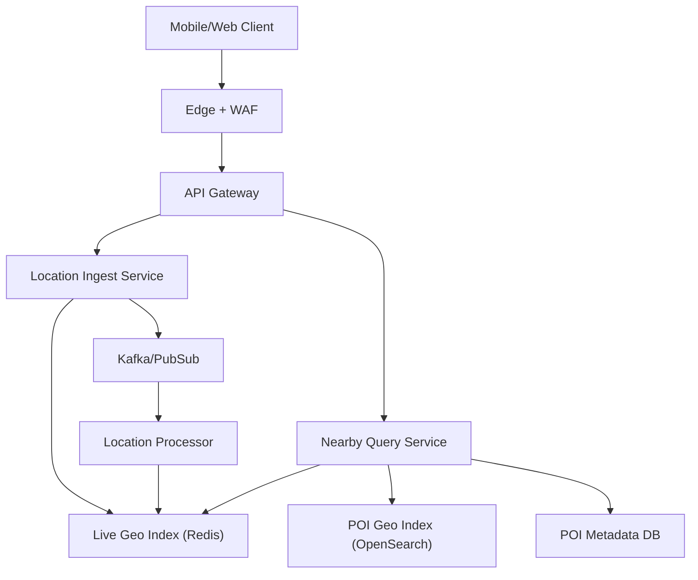
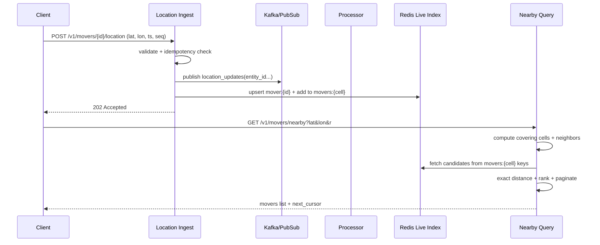

## Overview

Geospatial nearby search powers “what’s near me?” experiences for discovery (restaurants, events) and real-time marketplaces (drivers, couriers). The challenge is balancing low-latency radius queries with high-frequency location updates, while keeping results fresh, accurate across map edges, and resilient to traffic hotspots (dense downtown cells) and uneven geographic distribution.

The key insight is to treat **static POIs** and **dynamic movers** differently: store POIs in a durable geo-capable index optimized for filtering and ranking, and store moving entities in a low-latency, TTL-based “current state” index optimized for rapid updates. For nearby search, use a **cell-based spatial index** (Geohash or Quadtree) to narrow candidates, then compute exact distance and apply ranking.

## Requirements

### Functional Requirements
- Users can search for nearby POIs within a radius (e.g., 500m–50km) with filters (category, open-now, price).
- Movers (drivers) send frequent location updates (e.g., 1–5s cadence), and queries return “currently nearby” movers.
- Results are ranked (distance + quality signals) and can paginate consistently.
- Support both circular radius queries and viewport (map bounding box) queries.
- Provide deduplication/idempotency for client retries (especially location updates).
- Support bulk ingestion/updates of POIs (partner feeds) and soft deletes.
- Enforce privacy controls (e.g., hide exact driver location; return jittered/aggregated results where needed).

### Non-Functional Requirements
- **Scale**:
  - POIs: 50M total, 5M active per region; updates: 1K/s ingestion peak.
  - Movers: 5M MAU drivers, 500K concurrent peak; updates: 200K updates/s global peak.
  - Queries: 50K QPS global peak (POI + driver), bursts during events.
- **Latency**:
  - Nearby search: P50 50ms, P99 200ms (regional).
  - Location update ingest: P99 100ms acknowledged.
- **Availability**: 99.99% for query API, 99.9% for ingestion pipelines.
- **Consistency**:
  - Location state: eventual (target freshness < 5s); per-entity monotonicity (ignore out-of-order updates).
  - POI data: read-after-write for operator tools; eventual for end-user search (seconds-minutes acceptable).
- **Durability**:
  - POIs: RPO ~ 0 (durable storage).
  - Movers’ latest location: RPO up to 5–10s acceptable (recovered from stream); tolerate ephemeral cache loss.

### Constraints & Assumptions
- Multi-region active-active with user geo-routing to nearest region.
- GDPR/CCPA: delete/obfuscate personal location data; minimize retention of precise traces.
- Team constraint: prefer managed services where possible; keep operational complexity bounded.
- Network access between services is within a region; cross-region replication is asynchronous.

## High-Level Architecture



This architecture separates **write-heavy, low-latency location updates** (Location Ingest + Redis-based live index) from **read-heavy discovery search** over mostly static POIs (OpenSearch geo index + metadata DB). Both are queried by a dedicated Nearby Query Service that performs cell selection, candidate retrieval, filtering, ranking, and pagination.

A durable event stream (Kafka/PubSub) decouples ingestion from downstream processing (dedupe, validation, replication, analytics). The live index is treated as **derived state** that can be rebuilt from the stream, enabling fast recovery and supporting eventual consistency for “current location”.

## Component Deep-Dive

### API Gateway / Edge

**Responsibility**: Auth, rate limiting, routing, request shaping, and regional affinity.

**Key Design Decisions**:
- Use geo-routing + sticky region: reduces cross-region latency and improves cache hit rates.
- Enforce per-identity quotas: protects against noisy clients and runaway location updates.

**Technology Choice**: Envoy/Nginx at edge + managed API gateway; WAF for abuse patterns.

**Scaling Strategy**: Horizontally scale stateless proxies; autoscale on RPS and CPU; multi-AZ.

### Location Ingest Service

**Responsibility**: Accept location updates, validate, dedupe, and publish to stream; optionally update live index on the hot path.

**Key Design Decisions**:
- Ack-after-validate, before full fanout: keeps client latency low while ensuring basic correctness.
- Idempotency + ordering per entity: ignore out-of-order updates using `(timestamp, seq)` to prevent “time travel”.

**Technology Choice**: Go/Java stateless service; Kafka/PubSub producer with batching; optional gRPC for mobile efficiency.

**Scaling Strategy**: Partition by `entity_id` for ordering; scale consumers/producers by partition count; autoscale on ingress QPS.

### Live Geo Index (for Movers)

**Responsibility**: Maintain current mover locations for ultra-fast nearby lookup; support TTL expiration and hot updates.

**Key Design Decisions**:
- TTL-based freshness: each mover entry expires (e.g., 30–60s) to avoid returning stale movers.
- Cell-bucketed sets: store movers in per-cell keys to bound query fanout and support constant-time updates.

**Technology Choice**:
- Redis Cluster (or KeyDB) with in-memory structures.
- Use Geohash prefixes (or Quadtree cell IDs) as keys; store members as `entity_id -> (lat, lon, ts)`.

**Scaling Strategy**: Shard by cell key; mitigate hot cells with secondary bucketing (e.g., `cell#0..N`) or consistent hashing by `entity_id`.

### POI Geo Index (for Static Places)

**Responsibility**: Geo queries + filters over static POIs (category, rating, hours, tags).

**Key Design Decisions**:
- Use search engine geo primitives: avoids reinventing complex filtering/ranking; supports faceting.
- Separate metadata store: reduces index bloat; keep index lean for geo filtering + top-K selection.

**Technology Choice**: OpenSearch/Elasticsearch with `geo_point` and `geo_distance` queries; metadata in DynamoDB/Cassandra/Postgres depending on consistency needs.

**Scaling Strategy**: Shard by region; replicas for read QPS; ILM/rollover for reindexing; zero-downtime reindex via alias swap.

### Nearby Query Service

**Responsibility**: Choose cells, fetch candidates, compute exact distances, apply filters/ranking, and paginate.

**Key Design Decisions**:
- Two-phase retrieval: (1) coarse cell candidate fetch, (2) precise distance + ranking.
- Deterministic pagination: use a stable sort key `(score, distance, entity_id)` and a cursor token.

**Technology Choice**: Stateless service in Go/Java; SIMD-friendly distance computation; optional vector/ranking model via sidecar.

**Scaling Strategy**: Stateless autoscaling; request hedging for tail latency; cache popular queries by `(cell, filters)`.

## Data Model

### Storage Schema

**Live Geo Index (Redis)**
- Key: `movers:{cell_id}:{bucket}`
  - Type: set or sorted set
  - Member: `entity_id`
- Key: `mover:{entity_id}`
  - Type: hash
  - Fields: `lat`, `lon`, `ts_ms`, `cell_id`, `seq`
  - TTL: 60s
- Optional: `movers_ts:{cell_id}` as sorted set `(score=ts_ms, member=entity_id)` for fast stale pruning.

**POI Index (OpenSearch)**
- Index: `pois_v1`
  - `poi_id` (keyword)
  - `name` (text + keyword)
  - `location` (geo_point)
  - `categories` (keyword[])
  - `rating` (float)
  - `price_level` (byte)
  - `is_open_now` (boolean, computed or denormalized)
  - `region_id` (keyword)
  - `updated_at` (date)

**POI Metadata DB (DynamoDB/Cassandra/Postgres)**
- Table: `poi`
  - `poi_id` (PK)
  - `name`, `address`, `phone`, `hours`, `attributes`, `photos_ref`
  - `created_at`, `updated_at`, `deleted_at` (soft delete)

**Event Stream (Kafka/PubSub)**
- Topic: `location_updates` (partition key: `entity_id`)
  - `entity_id`, `lat`, `lon`, `ts_ms`, `seq`, `accuracy_m`, `source`

### Data Flow



## API Design

### Location Update (Movers)

`POST /v1/movers/{mover_id}/location`

Request:
```json
{
  "lat": 37.775,
  "lon": -122.418,
  "ts_ms": 1734390000123,
  "seq": 88421,
  "accuracy_m": 8,
  "heading_deg": 120,
  "speed_mps": 7.2
}
```

Response:
- `202 Accepted` with body:
```json
{ "status": "accepted", "effective_ts_ms": 1734390000123 }
```

Error handling:
- `400` invalid coordinates, missing fields
- `401/403` auth
- `409` if `seq` is older than stored (optional; many systems simply accept and ignore)
- `429` rate-limited
- `503` transient

Idempotency:
- Require monotonic `seq` per `mover_id` or accept `(mover_id, ts_ms)` with tolerance.
- Store last `(seq, ts_ms)` in `mover:{id}`; ignore updates with `seq <= last_seq`.

### Nearby Movers Search

`GET /v1/movers/nearby?lat={lat}&lon={lon}&radius_m={r}&limit={n}&cursor={token}`

Response:
```json
{
  "results": [
    { "mover_id": "d123", "distance_m": 120, "eta_s": 45, "last_update_age_s": 2 }
  ],
  "next_cursor": "eyJzY29yZSI6..."
}
```

Notes:
- Cursor encodes the last sort key to ensure stable pagination.
- Do not return exact coordinates unless required; consider privacy-preserving rounding/jitter.

### Nearby POI Search

`GET /v1/pois/nearby?lat&lon&radius_m&categories=...&open_now=true&limit&cursor`

Response:
```json
{
  "results": [
    { "poi_id": "p9", "name": "Atlas Cafe", "distance_m": 240, "rating": 4.6, "price_level": 2 }
  ],
  "facets": { "categories": [{ "k": "coffee", "count": 120 }] },
  "next_cursor": "eyJzb3J0Ijpb..."
}
```

Error handling:
- `400` invalid radius/filters
- `422` unsupported filter combination (optional)
- `503` if index unavailable (with partial fallback behavior if configured)

### Bulk POI Upsert (Operator / Partner)

`POST /v1/pois:bulkUpsert` (authenticated, scoped)

- Accepts batch with per-item status; asynchronous indexing via queue for large batches.

## Scaling & Performance

### Bottleneck Analysis
- **Hot cells** (dense downtown): too many candidates per cell.
  - Mitigate with smaller cell precision at high density, or split cell keys into buckets; cap candidates per cell with recency ordering.
- **Redis bandwidth** for multi-key reads in queries.
  - Pipeline/mget, co-locate keys by region, keep fanout bounded (limit number of cells).
- **Search index load** for complex POI filters.
  - Use pre-filtering, query caches, limit expensive scripts, denormalize common fields.

### Horizontal Scaling
- **Ingest**: partition stream by `entity_id`; scale producers/consumers with partitions (e.g., 512–4096 per region).
- **Live index**: Redis Cluster sharded by key; multi-AZ; add shards as memory/QPS grows.
- **POI index**: shard by `region_id`; replicas for reads; separate clusters per geo region if necessary.
- **Query service**: stateless autoscaling; isolate mover-search and POI-search pools if workloads differ.

Sharding / partitioning strategy:
- Primary: `region_id` (based on lat/lon geofencing or S2/H3 top-level cell).
- Secondary: `cell_id` (geohash/quadtree) for live index keys.

### Caching Strategy
- **Query result cache**: cache popular POI queries by `(region_id, rounded_latlon, radius, filters)` for 10–60s.
- **Metadata cache**: cache POI metadata by `poi_id` in Redis for minutes-hours; invalidate on update events.
- **Live index**: inherently a cache/derived store; TTL-based invalidation; periodic cleanup of stale movers.

Cache invalidation:
- POI metadata: publish `poi_updated` events; consumers purge/update cache keys.
- Query cache: short TTL + stampede protection (single-flight); avoid hard invalidation complexity.

## Trade-offs & Alternatives

### Key Trade-offs Made
- **Chosen**: Redis-derived live index for movers  
  **Sacrificed**: perfect durability and strict freshness guarantees  
  **Why**: mover location is ephemeral; low latency and high write throughput matter more than long-term retention.
- **Chosen**: Two-store model (POI search index + metadata DB)  
  **Sacrificed**: simplicity of a single database  
  **Why**: search engines excel at geo + filters; metadata DB provides strong ownership, transactional updates, and smaller indexes.
- **Chosen**: Cell-based candidate narrowing (Geohash/Quadtree) + exact distance  
  **Sacrificed**: some complexity in cell coverage and edge handling  
  **Why**: bounds query fanout and makes performance predictable under load.

### Alternative Approaches
- **Single OpenSearch for everything (POIs + movers)**: simpler, but high-frequency updates cause heavy segment merges and tail latency spikes.
- **PostGIS / Spanner geo indexes**: strong consistency and rich queries, but cost and throughput constraints at 200K updates/s are challenging.
- **H3/S2 instead of Geohash/Quadtree**: often better cell geometry and neighbor enumeration; not chosen here to stay aligned with “Geohash or Quadtree,” but can be swapped with minimal architectural change.

## Failure Modes & Mitigations

### Failure Scenarios
- **Scenario**: Redis shard outage  
  **Impact**: mover nearby results partially missing for affected cells  
  **Detection**: elevated Redis errors, drop in candidates, query fallback ratio increases  
  **Mitigation**: multi-AZ Redis, client-side retries with jitter, degrade gracefully (return fewer movers + warning), rebuild from stream.
- **Scenario**: Kafka lag / processor backlog  
  **Impact**: stale live index, movers appear outdated  
  **Detection**: consumer lag metrics, increased `last_update_age_s`  
  **Mitigation**: autoscale consumers, backpressure ingest, prioritize latest updates per entity (compaction), TTL ensures stale entries expire.
- **Scenario**: Hotspot event causes query surge in one region  
  **Impact**: P99 latency spikes, throttling  
  **Detection**: regional QPS + saturation metrics, tail latency alerts  
  **Mitigation**: regional autoscaling, cache popular queries, limit radius/limit, shed load (429) for abusive clients.
- **Scenario**: Out-of-order or spoofed updates  
  **Impact**: incorrect mover placement, security concerns  
  **Detection**: anomaly detection (speed jumps), signature/auth validation failures  
  **Mitigation**: enforce auth, monotonic `seq`, plausibility checks (max speed), quarantine suspicious entities.

### Disaster Recovery
- RTO: 15 minutes per region (query), 1 hour for full rebuild.
- RPO: POIs ~ 0 (durable DB + snapshots); movers up to 5–10s (stream replay).
- Backups:
  - POI metadata DB: continuous backups + daily snapshots.
  - OpenSearch: snapshots to object storage; periodic restore drills.
  - Kafka: replicated across AZs; mirror to DR region if required.
- Failover:
  - Regional routing shifts traffic to nearest healthy region.
  - Rebuild live index by replaying recent `location_updates` (bounded window, e.g., last 5 minutes) plus warmup.

## Operational Considerations

### Monitoring & Alerting
- Query: QPS, P50/P95/P99, error rate, timeouts, candidate counts, cache hit rate.
- Ingest: accepted/s, rejected/s, idempotency drops, auth failures, Kafka produce latency.
- Stream: consumer lag, rebalance frequency, partition skew.
- Redis: ops/sec, memory, evictions, hot keys, latency, replication health.
- Search index: query latency, CPU, heap, segment merges, refresh time, rejected requests.

Alert thresholds (examples):
- Query P99 > 250ms for 5m (regional)
- 5xx error rate > 1% for 2m
- Kafka lag > 30s for 5m
- Redis p99 op latency > 5ms for 5m, or memory > 80%

### Deployment Strategy
- Canary + progressive rollout per region (1% → 10% → 50% → 100%).
- Backward-compatible schema evolution (additive fields; versioned index aliases).
- Rollback: fast revert of stateless services; index changes via alias rollback; feature flags for new ranking logic.

## References & Further Reading
- Geohash overview: https://en.wikipedia.org/wiki/Geohash
- Elasticsearch/OpenSearch geo queries: https://www.elastic.co/guide/en/elasticsearch/reference/current/geo-queries.html
- Redis GEO commands (if using native GEO sets): https://redis.io/commands/?group=geo
- Uber H3 (alternative cell system): https://h3geo.org/
- Google S2 geometry (alternative): https://s2geometry.io/
- “The Log” (event streaming patterns): https://engineering.linkedin.com/distributed-systems/log-what-every-software-engineer-should-know-about-real-time-datas-unifying