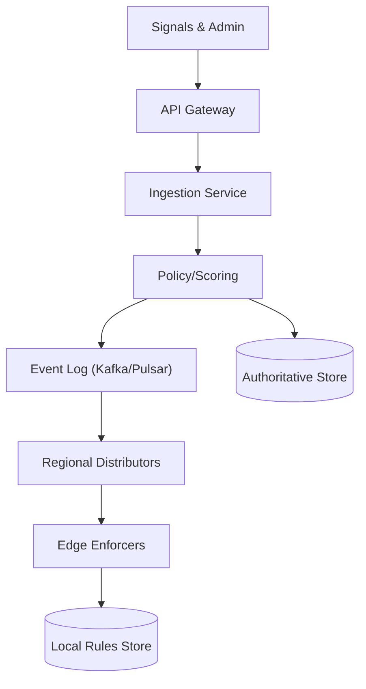
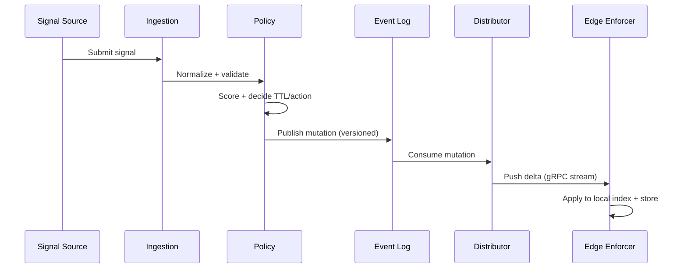

## Overview

A global blacklisting system ingests abuse signals (e.g., IPs, CIDRs, domains) from many sources and propagates enforcement decisions to every region/edge within seconds. The challenge is not “storing a list” but distributing high-churn security state globally with low latency, high availability, and strong safeguards against false positives and poisoning—while keeping the data-plane check extremely fast (microseconds) at very high request rates.

The key insight is to split the system into a **control plane** (ingestion, scoring, policy, audit) and a **data plane** (edge enforcement) connected via a **streaming distribution fabric**. Edges maintain a continuously updated local ruleset (in-memory + local persistent store) and never block on a remote lookup. Updates are shipped as signed, versioned deltas with periodic snapshots so edges can recover quickly and converge within seconds.

## Requirements

### Functional Requirements
- Ingest abuse signals from internal systems (WAF, login, fraud) and external feeds (threat intel, partners).
- Support multiple indicator types: IPv4/IPv6, CIDR ranges, domains, wildcard domains, URL patterns (optional).
- Attach metadata: source, confidence, reason codes, first_seen/last_seen, TTL/expiry, scope (global/region/product).
- Compute enforcement actions: block, challenge, rate-limit, monitor; allow overrides (allowlist/suppressions).
- Propagate updates globally within seconds and provide a measurable “propagation SLA”.
- Provide query/audit APIs: “why is this blocked?”, history, who/what changed it, and effective policy.
- Provide admin tooling: bulk import/export, emergency kill-switch, staged rollout, and appeal workflow.
- Ensure safe deletion/expiry and correct TTL handling (automatic un-blocking).

### Non-Functional Requirements
- **Scale**:
  - Data plane: 10M requests/sec globally, 99% of checks at edge without network calls.
  - Control plane ingest: steady 5K signals/sec; spikes to 100K/sec during large attacks.
  - Indicators: 50M active IPs/CIDRs; 5M active domains; 12-month audit retention.
- **Latency**:
  - Propagation: P50 < 1s, P99 < 5s from “accepted signal” to “enforced at all healthy regions”.
  - Edge evaluation: P99 < 200µs per request check (in-memory fast path).
- **Availability**:
  - Control plane APIs: 99.9%.
  - Distribution + edge enforcement: 99.99% (system should keep enforcing during control-plane outages).
- **Consistency**:
  - Strong consistency for writes within a region/cluster (authoritative policy decisions).
  - Eventual global consistency with bounded staleness (seconds). Edges must be monotonic (no version rollback).
- **Durability**:
  - No data loss for accepted signals (RPO ~ 0 for the event log).
  - Audit trail immutable; retention 12 months (or per compliance).

### Constraints & Assumptions
- Multi-region deployment (at least 3 regions) with edge PoPs; edges may be intermittently connected.
- A small platform team (5–8 engineers) owns this; prefer proven components and clear ops playbooks.
- Security-sensitive: all updates must be authenticated, authorized, and tamper-evident (signed).
- Budget favors predictable infra: avoid per-request external lookups; edge runs on commodity instances.

## High-Level Architecture

The system is centered on an **append-only event log** (Kafka/Pulsar) that carries normalized, versioned “blacklist mutations” (add/update/remove/expire). A **policy/scoring service** turns raw signals into an enforcement decision, writes to an authoritative store for auditability, and publishes mutations to the log.

**Regional distributors** subscribe to the log, compact mutations, and push deltas to edges via long-lived streams (gRPC). Each **edge enforcer** maintains a local rules store (in-memory index backed by RocksDB/LMDB) and performs checks inline on every request, independent of control-plane availability.

## Component Deep-Dive

### Ingestion Service

**Responsibility**: Validate, normalize, and accept abuse signals; enforce authZ and rate limits; dedupe obvious repeats.

**Key Design Decisions**:
- Use a strict schema (Protobuf/JSON Schema) with canonical normalization (punycode domains, CIDR canonicalization, IPv6 normalization) to prevent duplicate semantic entries.
- Apply per-source quotas and abuse protection to avoid feed poisoning and accidental floods.

**Technology Choice**: Go/Java service behind an L7 gateway; Protobuf for internal events; OpenAPI for admin REST.

**Scaling Strategy**: Stateless horizontally scaled behind load balancer; partitioning by `indicator_hash` for consistent dedupe caches.

---

### Policy/Scoring Engine

**Responsibility**: Convert signals into enforceable decisions with confidence scoring, TTL selection, suppression/allowlist, and staged rollout.

**Key Design Decisions**:
- Separate **raw signals** from **effective decisions**. Multiple signals can contribute to one decision; decisions have explicit TTLs and can be re-evaluated.
- Implement policy as versioned rules (e.g., “block if confidence ≥ 0.9 and source in {WAF, auth}”) so changes are auditable and reversible.

**Technology Choice**: Service with a rules engine (simple DSL or config-driven rules); feature store optional; authoritative DB (Postgres for metadata + Cassandra/Dynamo for scale).

**Scaling Strategy**: Partition by indicator hash; asynchronous evaluation pipeline; batch compaction for high-volume updates.

---

### Event Log (Streaming Backbone)

**Responsibility**: Durable, ordered distribution of mutations to all regions and distributors.

**Key Design Decisions**:
- Use an **append-only** log as the source of truth for propagation; consumers track offsets for replay and recovery.
- Publish **deltas** continuously plus periodic **snapshots/checkpoints** to bound catch-up time for lagging edges.

**Technology Choice**: Kafka (with multi-cluster replication) or Pulsar (geo-replication). Topic partitioning by `indicator_hash` to preserve per-indicator ordering.

**Scaling Strategy**: Increase partitions for throughput; tune retention (e.g., 7–14 days deltas) + compacted topic for latest state.

---

### Regional Distributors

**Responsibility**: Bridge the event log to edges efficiently; coalesce updates; enforce signing; provide snapshot download service.

**Key Design Decisions**:
- Push via **gRPC streaming** with backpressure; edges ACK versions to track propagation health.
- Maintain a compacted in-memory map of latest decisions per indicator for fast snapshot generation.

**Technology Choice**: Go/Java; gRPC + TLS mutual auth; optional CDN for snapshot blobs.

**Scaling Strategy**: Shard distributors per region; edges connect to nearest; distributor horizontally scales by edge-connection count.

---

### Edge Enforcers (Data Plane)

**Responsibility**: Perform ultra-fast checks on incoming traffic and apply actions (block/challenge/rate-limit).

**Key Design Decisions**:
- Never depend on network for a decision. Keep **hot indexes in memory** and persist to local store for restart resilience.
- Use specialized indexes:
  - IP/CIDR: radix/patricia trie (IPv4/IPv6) or compiled prefix tables.
  - Domains: reversed trie for suffix/wildcard matching.
- Ensure monotonic updates using version numbers; ignore out-of-order or stale deltas.

**Technology Choice**: Integrated into WAF/CDN edge process; local RocksDB/LMDB; in-memory trie structures in Rust/C++/Go.

**Scaling Strategy**: Scale with edge fleet; each node handles its own traffic; update fan-out via distributors.

## Data Model

### Storage Schema

**Authoritative indicator table (logical)**:
- `indicator_id` (UUID)
- `type` (ENUM: IP, CIDR, DOMAIN, WILDCARD_DOMAIN)
- `value_canonical` (STRING) — canonical normalized
- `scope` (ENUM: GLOBAL, REGION, PRODUCT)
- `action` (ENUM: BLOCK, CHALLENGE, RATE_LIMIT, MONITOR)
- `confidence` (FLOAT 0..1)
- `reason_code` (STRING)
- `source` (STRING)
- `first_seen_at` (TIMESTAMP)
- `last_seen_at` (TIMESTAMP)
- `expires_at` (TIMESTAMP) — TTL enforcement
- `status` (ENUM: ACTIVE, SUPPRESSED, EXPIRED)
- `version` (INT64) — monotonic per-indicator
- `updated_by` (STRING) — service/user
- `policy_version` (STRING)

**Mutation event (published to log)**:
- `event_id` (UUID)
- `indicator_hash` (BYTES/STRING)
- `op` (ENUM: UPSERT, DELETE, SUPPRESS, UNSUPPRESS, EXPIRE)
- `type`, `value_canonical`, `scope`, `action`, `expires_at`, `version`
- `emitted_at`
- `signature` (BYTES) — distributor/authority signature

### Data Flow

Key operations:
- **Upsert**: update effective decision and bump `version`.
- **Expire**: scheduled expiry produces explicit EXPIRE events (or edges enforce `expires_at` locally with time sync).
- **Suppress/allowlist**: stored as higher-priority rules evaluated before blacklist (e.g., allowlist overrides).

## API Design

### Submit Abuse Signal
- `POST /v1/signals`
- Request:
  - `type`: `"IP"|"CIDR"|"DOMAIN"|"WILDCARD_DOMAIN"`
  - `value`: string
  - `source`: string
  - `confidence`: number (0..1)
  - `reason_code`: string
  - `scope`: `"GLOBAL"|"REGION"|"PRODUCT"`
  - `ttl_seconds`: integer (optional; capped per source)
  - `idempotency_key`: string
- Response:
  - `signal_id`, `accepted`: boolean, `normalized_value`, `effective_action`, `effective_expires_at`
- Errors:
  - `400` invalid indicator, `401/403` auth, `409` idempotency conflict, `429` rate limited

**Idempotency**: Require `Idempotency-Key` header; store keyed by (source, key) for 24h to dedupe retries.

### Admin Override (Suppress / Allow)
- `POST /v1/overrides`
- Request:
  - `type`, `value`, `override_type`: `"SUPPRESS"|"ALLOW"`
  - `scope`, `ttl_seconds`, `reason`, `ticket_ref`
- Response: `override_id`, `effective_version`

### Query Effective Decision (Audit)
- `GET /v1/indicators/{type}/{value}`
- Response:
  - `normalized_value`, `status`, `action`, `expires_at`, `version`
  - `contributors`: list of signals/sources
  - `history`: last N mutations

### Edge Sync (Distributor ↔ Edge)
- `gRPC Stream Subscribe(region, edge_id, last_applied_version_checkpoint)`
- Server streams:
  - `DeltaBatch { checkpoint_id, mutations[], signature }`
  - periodic `Checkpoint { checkpoint_id, snapshot_uri, min_version }`

**Error handling**: If edge falls behind retention, distributor instructs snapshot download; edge then resumes deltas from new checkpoint.

## Scaling & Performance

### Bottleneck Analysis
- **Fan-out to edges**: Thousands of edges per region can overwhelm a single distributor.
  - Mitigation: distributor pool + consistent assignment; delta batching; backpressure; compression (zstd).
- **CIDR/domain matching cost**: Naive lookups are expensive at 10M RPS.
  - Mitigation: in-memory tries/radix trees; precompiled matchers; keep hot path allocation-free.
- **Write spikes (attack bursts)**: 100K signals/sec can overload policy evaluation and storage.
  - Mitigation: async pipeline; prioritize high-confidence sources; shed low-confidence signals; batch DB writes; event log as buffer.

### Horizontal Scaling
- **Ingestion/Policy**: Stateless services scale behind LB; partition work by `indicator_hash`.
- **Event log**: Increase partitions; isolate topics by indicator type (ip/domain) if needed.
- **Distributor**: Scale by connections and throughput; edges reconnect with jitter to avoid thundering herds.
- **Edge**: Scale with PoP fleet; each node maintains its own local state.

**Partitioning/Sharding**:
- Use `hash(type + value_canonical)` as the stable key for ordering and compaction.
- For CIDRs, store canonical prefix; matching uses trie; mutations still keyed by canonical string.

### Caching Strategy
- **Edge local cache**: Primary “cache” is the local ruleset itself; no remote cache in the request path.
- **Distributor caches**:
  - Recent delta batches per edge cohort (seconds) to speed reconnects.
  - Prebuilt snapshot blobs (minutes) served via object storage/CDN.
- **Invalidation**: Version-based. Edges apply only if `mutation.version > local.version` for that indicator; checkpoints prevent rollback.

## Trade-offs & Alternatives

### Key Trade-offs Made
- **Chosen**: Streaming deltas + edge-local evaluation  
  **Sacrificed**: Simplicity of a centralized lookup API  
  **Why**: Remote lookup cannot meet latency/availability at 10M RPS; edges must operate during partitions.
- **Chosen**: Event log as propagation truth  
  **Sacrificed**: Immediate global strong consistency  
  **Why**: Multi-region strong consistency adds seconds+ latency and fragility; bounded staleness (P99 < 5s) is acceptable.
- **Chosen**: Policy engine produces “effective decisions”  
  **Sacrificed**: Direct mapping from raw signals to blocks  
  **Why**: Prevents poisoning, supports overrides, and enables explainability/audit.

### Alternative Approaches
- **Central KV (global strongly consistent DB)**: Simpler reads but too slow/expensive for edge RPS; global consistency hurts propagation and availability.
- **DNS-based distribution (RPZ / fast-flux lists)**: Great for domains, weaker for IP/CIDR at HTTP layer and limited metadata/actions; slower convergence in some stacks.
- **Gossip/peer-to-peer edge sync**: Reduces central load but increases complexity, security risk, and makes propagation/audit harder.

## Failure Modes & Mitigations

### Failure Scenarios
- **Scenario**: Event log cluster outage in one region  
  **Impact**: That region stops receiving new updates; edges enforce last-known rules  
  **Detection**: Consumer lag, missing checkpoints, alert on propagation SLA  
  **Mitigation**: Multi-region replication; automatic failover to secondary log/cluster; snapshot bootstraps after recovery.
- **Scenario**: Distributor overload or crash  
  **Impact**: Edges in region lag on updates  
  **Detection**: Edge ACK lag, connection failures, CPU/queue depth alarms  
  **Mitigation**: Distributor autoscaling; connection pooling; rate limiting; prioritize “block” over “monitor” updates.
- **Scenario**: Bad/poisoned feed causes mass false positives  
  **Impact**: Legit users blocked globally (high blast radius)  
  **Detection**: Anomaly detection on block rate, customer error spikes, canary policies  
  **Mitigation**: Staged rollout (canary PoPs), confidence thresholds, multi-source corroboration, emergency kill-switch and allowlist.
- **Scenario**: Clock skew at edge breaks TTL expiry  
  **Impact**: Blocks persist too long or expire early  
  **Detection**: NTP drift metrics; TTL audit discrepancies  
  **Mitigation**: Strict time sync; include explicit EXPIRE events; conservative local expiry with grace windows.
- **Scenario**: Split-brain versions / out-of-order updates  
  **Impact**: Inconsistent enforcement; rollback risk  
  **Detection**: Version monotonicity violations; checkpoint signature failures  
  **Mitigation**: Single writer per indicator (policy engine), monotonic `version`, signed checkpoints, ignore stale deltas.

### Disaster Recovery
- **RTO/RPO**:
  - Event log: RTO 30–60 min, RPO ~ 0 (replicated, durable).
  - Authoritative store: RTO 1–2 hours, RPO < 5 min (depending on DB).
- **Backups**: Daily full + continuous incremental for authoritative store; periodic snapshot artifacts stored cross-region.
- **Failover**: Promote secondary region control plane; distributors switch to alternate log endpoint; edges reconnect to nearest healthy distributor.

## Operational Considerations

### Monitoring & Alerting
- Propagation SLA: time from mutation emit to edge ACK (P50/P95/P99) per region.
- Consumer lag per partition; distributor queue depth; edge reconnect rate; snapshot download failures.
- Data plane health: block/challenge rates, false-positive indicators (support tickets, error budgets).
- Security: signature verification failures, authZ denials, unusual source volume, policy changes frequency.

Suggested alerts:
- P99 propagation > 5s for 5 minutes (page).
- Any region with >1% edges > 60s behind (page).
- Sudden 5× increase in global blocks without matching attack signals (page, trigger staged rollback).

### Deployment Strategy
- Blue/green or canary for control plane; schema evolution via Protobuf with backward compatibility.
- Edge rollout staged by PoP cohort; ability to pin to a known-good checkpoint.
- Rollback: revert policy version, emit corrective mutations, and/or activate kill-switch to disable a feed/source immediately.

## References & Further Reading
- Kafka design and replication: https://kafka.apache.org/documentation/
- Apache Pulsar geo-replication: https://pulsar.apache.org/docs/
- CIDR matching data structures (radix/patricia tries): practical implementations in routing tables
- Google Zanzibar (authz consistency concepts, auditability): https://research.google/pubs/pub48190/
- DNS RPZ (domain blocking at resolver layer): vendor docs and ISC BIND RPZ references