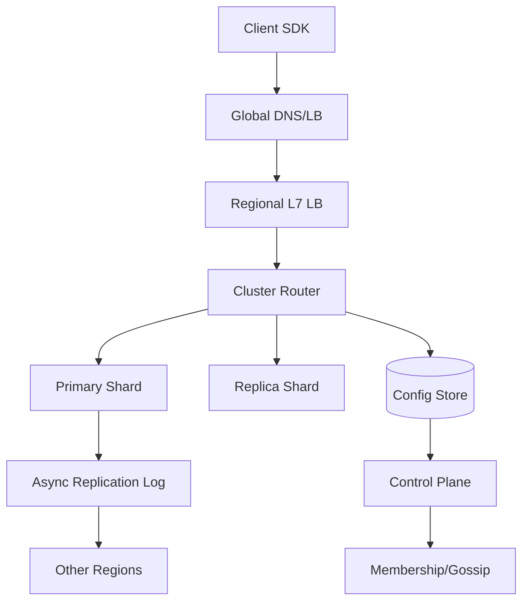
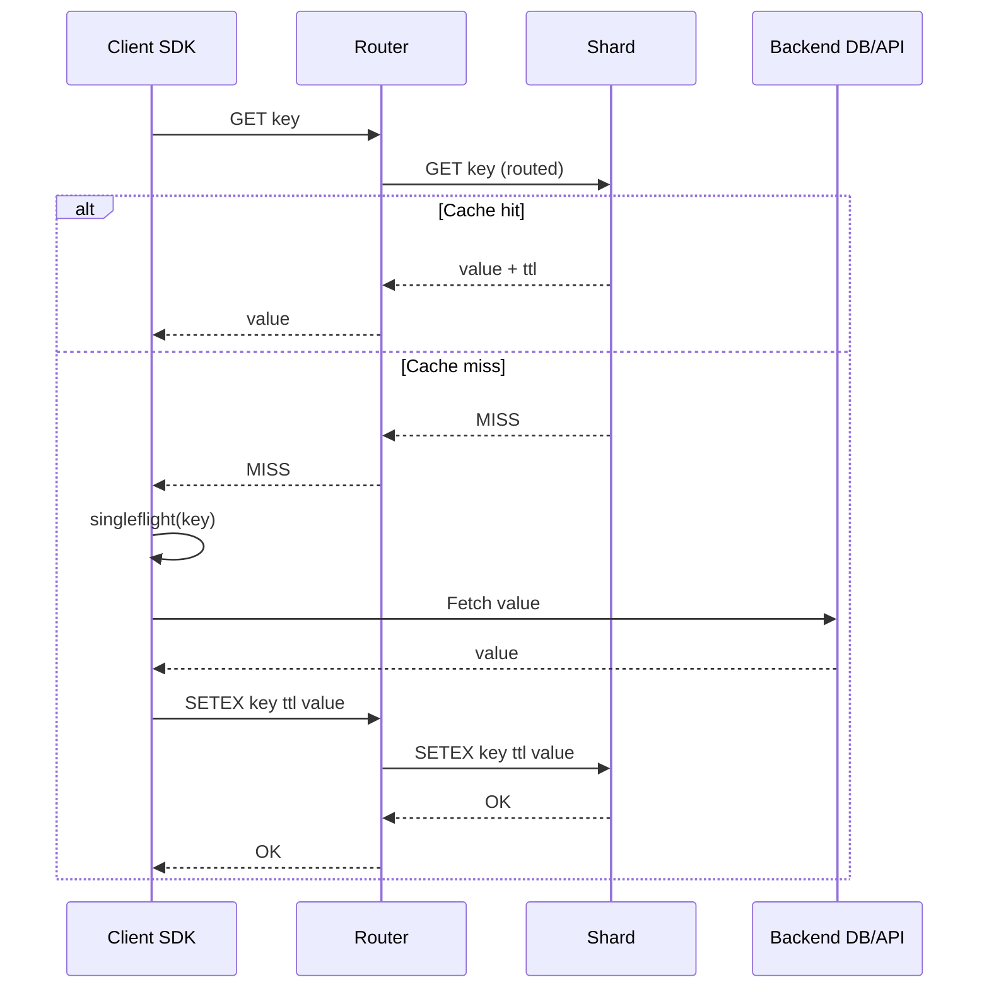

## Overview

A global Redis-like cache is deceptively hard: it must deliver single-digit millisecond latency and high throughput while handling node churn, uneven key distributions, multi-tenant workloads, and operational realities like rolling upgrades and partial failures. Unlike a database, a cache can drop data, but it must fail “safely”: avoid cascading misses, protect backends from thundering herds, and keep tail latencies predictable under load.

The key insight is to separate **data plane** (fast key operations) from **control plane** (membership, placement, autoscaling, configuration) and to design placement + replication around **consistent hashing** and **zone-aware shards**. To operate globally, we use a **regional cache cluster per region** (for latency), plus optional **async cross-region replication** or **warmup** mechanisms depending on consistency needs. Herd prevention is treated as a first-class feature: request coalescing, stale-while-revalidate, TTL jitter, negative caching, and adaptive admission/eviction.

## Requirements

### Functional Requirements
- Support core Redis-like commands: `GET`, `MGET`, `SET`, `SETEX`, `DEL`, `INCR/DECR`, `EXPIRE`, `TTL`, `SCAN`.
- Cluster awareness: automatic shard placement, membership discovery, and client redirection/routing.
- Configurable eviction policies per namespace/tenant: LRU, LFU, TTL-based, no-eviction, and size caps.
- TTL support with efficient expiry and accurate-ish `TTL` queries (bounded drift allowed).
- Multi-tenant isolation: namespaces, per-tenant quotas, rate limits, and optional encryption in transit.
- Thundering herd prevention features: per-key request coalescing, negative caching, stale reads with background refresh, and lock primitives.
- Observability: per-command latency, hit rate, eviction rate, memory fragmentation, hot-key detection.
- Administrative APIs: create namespaces, set policies, rebalance, drain nodes, and run safe upgrades.

### Non-Functional Requirements
- **Scale**:
  - 50M daily active clients (via apps/services), 200K concurrent connections per region.
  - Regional traffic: 2M QPS reads, 300K QPS writes (peak) per large region.
  - Key count: up to 5B keys globally; per region 500M active keys.
  - Value sizes: median 200B, P99 10KB, max 1MB (configurable).
- **Latency**:
  - `GET` hit: P50 1–2ms, P99 8–12ms within region.
  - `SET`: P50 2–3ms, P99 15ms within region (includes replication to one replica).
  - Cross-region replication lag: typical < 2s, P99 < 10s (async mode).
- **Availability**:
  - Regional: 99.99% for reads (degraded mode allowed), 99.9% for writes.
  - Global: 99.999% “some region serves reads” with DNS failover.
- **Consistency**:
  - Within a shard: read-your-writes best-effort; strong consistency is not guaranteed unless using quorum reads/writes (optional, slower).
  - Across regions: eventual consistency for replicated keys; default is regional independence.
- **Durability**:
  - Cache data loss tolerated (RPO = minutes/seconds); metadata/config must be durable (RPO ~ 0).
  - Optional persistence (AOF/RDB-like) supported for “semi-durable cache” tier.

### Constraints & Assumptions
- Assume 3 AZs per region; typical deployments in Kubernetes or VM-based autoscaling groups.
- Team: small platform team (6–10 engineers); prioritize operability and safe defaults.
- Budget sensitivity: avoid synchronous cross-region quorum on hot paths.
- Compliance: encryption in transit; at-rest encryption for metadata; audit logs for admin actions.
- “Redis-like” means similar semantics for basic commands, not full Lua scripting parity at launch.

## High-Level Architecture

Each region runs an independent cache cluster for low-latency access. Clients use a **cluster-aware SDK** that maintains a shard map and routes requests to the correct shard (or a lightweight **router** tier does it for dumb clients). The **control plane** manages membership, shard assignment, placement constraints (AZ-aware), quotas, and rolling maintenance; it stores durable metadata in a configuration store (e.g., etcd/Consul/Postgres).

For global use cases, we offer **optional asynchronous cross-region replication** via a replication log/stream. This is not on the critical path for regional reads/writes, keeping latency low; it enables warm caches and soft global sharing where eventual consistency is acceptable.

## Component Deep-Dive

### Client SDK (Cluster-Aware)
**Responsibility**: Routing, connection pooling, retries, topology updates, and herd prevention primitives at the edge.

**Key Design Decisions**:
- Use **consistent-hash slot map** (e.g., 16,384 slots) with periodic refresh and push-based invalidation to reduce re-routes.
- Implement **singleflight/request coalescing** and **stale-while-revalidate** in SDK for fastest herd mitigation without extra network hops.

**Technology Choice**: Language-specific SDKs (Go/Java) with Netty (Java) / native async I/O; RESP3-compatible protocol for Redis-like ergonomics.

**Scaling Strategy**: Horizontal by nature—distributed among clients; includes circuit breakers and adaptive timeouts per shard.

### Router Tier (Optional)
**Responsibility**: Proxy for clients that cannot run cluster logic; centralizes auth, quotas, and routing.

**Key Design Decisions**:
- Keep router stateless; store shard map locally with watch-based updates from control plane.
- Support **hedged requests** (careful, rate-limited) for tail-latency reduction on reads.

**Technology Choice**: Envoy-like proxy with a custom filter, or a dedicated Rust/Go proxy.

**Scaling Strategy**: Stateless autoscaling behind L7 LB; shard-aware load balancing to reduce cross-node hops.

### Cache Shard Nodes (Data Plane)
**Responsibility**: In-memory storage, eviction, TTL expiry, replication, and command execution.

**Key Design Decisions**:
- Store data in **slab/arena allocator** (or jemalloc tuning) to reduce fragmentation; per-namespace memory accounting.
- Use **primary + replica** within region (same shard group) for high availability; fast failover via membership + epoch-based leadership.

**Technology Choice**: Redis-compatible server implemented in C++/Rust (or Redis fork if allowed), with io_uring/epoll, and RESP support.

**Scaling Strategy**: Scale out by adding shards and rebalancing slots; scale up by increasing memory/CPU. Hot-key detection triggers optional key-level replication or request shaping.

### Control Plane
**Responsibility**: Cluster lifecycle, placement, rebalancing, quotas, config distribution, and upgrades.

**Key Design Decisions**:
- Separate durable config (desired state) from observed state; reconcile loop (Kubernetes-style).
- AZ-aware placement with anti-affinity; ensure each shard group spans ≥2 AZs.

**Technology Choice**: Go control plane with etcd/Consul for coordination; Postgres for audit/config history.

**Scaling Strategy**: Modest; HA via 3–5 replicas; sharded watchers if fleet is large.

### Replication/Warmup Service (Global Option)
**Responsibility**: Async streaming of selected keys/namespace changes to other regions; prewarming and cache fill.

**Key Design Decisions**:
- Replicate only **opt-in namespaces** or key patterns; avoid replicating volatile/hot ephemeral data.
- Use **idempotent upserts** with versioning (logical clocks) to tolerate replays and reorder.

**Technology Choice**: Kafka/Pulsar (regional) with MirrorMaker-like replication; or cloud-native streams.

**Scaling Strategy**: Partition by shard/slot; backpressure and drop policies to avoid impacting data plane.

## Data Model

### Storage Schema

In-memory entry layout (conceptual):

- `Key`:
  - `namespace_id` (u32)
  - `key_bytes` (var)
- `Entry`:
  - `value_bytes` (var)
  - `value_type` (enum: string, int, hash, list, set; start with string/int)
  - `expire_at_ms` (i64, 0 = no expiry)
  - `last_access_ms` (i64) (for LRU)
  - `freq` (u8/u16) (for LFU)
  - `size_bytes` (u32)
  - `version` (u64) (optional, for replication/replay safety)
- Per-namespace metadata:
  - `max_memory_bytes`, `eviction_policy`, `default_ttl_ms`
  - `rate_limits` (ops/sec, bytes/sec)
  - `admission_policy` (e.g., do-not-cache if value > X)

Durable control-plane tables (example):

- `namespaces`:
  - `namespace_id`, `name`, `created_at`, `max_memory_bytes`, `eviction_policy`, `replication_mode`
- `cluster_state`:
  - `node_id`, `region`, `az`, `status`, `capacity`, `last_heartbeat`
- `slot_assignment`:
  - `slot_id`, `primary_node_id`, `replica_node_ids`, `epoch`

### Data Flow

Read hit / miss with herd prevention:

Key points:
- **singleflight** ensures only one backend fetch per key per client process; for bigger herds, shard-level coalescing can be enabled (see below).
- TTL jitter and stale-while-revalidate reduce synchronized expirations.

## API Design

Protocol: Redis-compatible RESP (preferred for ecosystem) plus an admin REST/gRPC API.

### Data Plane (RESP-like)

- `GET {namespace}:{key}`
  - Response: bulk string or `(nil)`
  - Errors: `-MOVED slot host:port` (client updates map), `-TRYAGAIN`, `-NOAUTH`
  - Idempotency: yes
- `MGET k1 k2 ...`
  - Response: array of values/nils
  - Considerations: partial failures return per-key nil + error metadata (RESP3 attributes) or fail-fast mode (config).
- `SET {key} {value} [NX|XX] [EX seconds|PX ms]`
  - Response: `OK` or `(nil)` for conditional failure
  - Idempotency: not strictly; support `SET key value PX ...` with optional `IDEMPOTENCY token` (extension) for write retries.
- `DEL key [key...]`
  - Response: integer deleted count
- `INCR key`
  - Atomic on primary shard; replicated asynchronously to replica.
- `EXPIRE key seconds`, `TTL key`
- `LOCK key token PX ms` / `UNLOCK key token` (extension)
  - Provides safe, token-based unlock to prevent releasing others’ locks.

### Admin API (gRPC/REST)

- `POST /v1/namespaces`
  - Request: `{name, maxMemoryBytes, evictionPolicy, defaultTtlMs, replicationMode}`
- `POST /v1/clusters/{id}/rebalance`
  - Request: `{strategy: "min-move"|"even-slots", maxConcurrentMoves}`
- `POST /v1/nodes/{id}/drain`
  - Safely migrates slots off a node; used for maintenance.
- Error handling:
  - Standard codes: `429` (rate limit), `409` (conflict/epoch mismatch), `503` (degraded), `401/403` (auth).
  - All mutating admin calls require idempotency keys.

## Scaling & Performance

### Bottleneck Analysis
- **Network & connections**: too many client connections can overwhelm shards.
  - Mitigation: client-side pooling, router tier fan-in, connection limits, and TCP tuning.
- **Hot keys**: single shard becomes saturated.
  - Mitigation: hot-key detection (top-K), request shaping, micro-sharding (key suffixing), or selective key replication to multiple readers.
- **Memory fragmentation & GC** (if managed runtime): impacts tail latency.
  - Mitigation: use jemalloc/slab allocators, avoid per-request allocations, periodic defrag, and per-namespace size classes.
- **Rebalancing churn**: moving slots causes cache misses and latency spikes.
  - Mitigation: rate-limited migrations, background warmup, and dual-read during moves (temporary forwarding).

### Horizontal Scaling
- **Sharding**: consistent-hash slots mapped to shard groups (primary+replica). Add capacity by adding nodes and reassigning slots.
- **Partition strategy**: hash(`namespace_id + key`) → slot; keep namespace boundaries for quotas but still distribute evenly.
- **Replication**: within region, replicate to one replica in another AZ; optional second replica for 99.99% write availability.

### Caching Strategy
- **What to cache**: application objects, auth/session tokens, feature flags, rate-limit counters; avoid huge blobs by default.
- **TTL policy**: default TTL required unless namespace opts out; enforce max TTL (e.g., 7 days).
- **Invalidation**:
  - Prefer TTL for simplicity.
  - For explicit invalidation, use `DEL` and optional pub/sub invalidation stream for app-tier caches.
- **Herd prevention**:
  - TTL jitter: randomize expiry by ±5–15%.
  - Stale-while-revalidate: serve stale up to `stale_ttl` while one refresh happens.
  - Negative caching: cache “not found” for short TTL (e.g., 30–120s) with jitter.
  - Request coalescing:
    - Client SDK singleflight.
    - Optional shard-side coalescing for `GET` misses using per-key inflight map (bounded to avoid DoS).
  - Probabilistic early recompute: refresh before expiry based on remaining TTL and observed fetch latency.

## Trade-offs & Alternatives

### Key Trade-offs Made
- **Regional clusters + async global replication**
  - Chosen: low latency and high availability per region.
  - Sacrificed: strong global consistency.
  - Why: cache workloads rarely require strict cross-region ordering; async replication avoids global tail latency.
- **Consistent-hash slots + control-plane-managed assignment**
  - Chosen: predictable rebalancing and client-friendly routing.
  - Sacrificed: more metadata/operational complexity than pure peer-to-peer.
  - Why: production operability (drain, rollouts, quotas) benefits from explicit desired state.
- **Herd prevention at client + optional server**
  - Chosen: fastest mitigation without extra hops; server-side as safety net.
  - Sacrificed: more SDK complexity.
  - Why: herds originate at clients; edge mitigation dramatically reduces backend load.

### Alternative Approaches
- **Fully managed proxy-only routing** (no client awareness)
  - Simpler clients, but router becomes critical bottleneck and adds latency/cost.
- **Multi-region strong consistency (quorum across regions)**
  - Better consistency but unacceptable tail latency and poor partition tolerance for cache use cases.
- **Use an existing Redis Cluster as-is**
  - Faster time-to-market, but limited built-in herd controls, multi-tenant isolation, and global replication semantics without additional systems.

## Failure Modes & Mitigations

### Failure Scenarios
- **Scenario**: Primary shard node crashes
  - **Impact**: Slot group unavailable; increased misses; potential write unavailability.
  - **Detection**: missed heartbeats, TCP failures, replication lag alarms.
  - **Mitigation**: promote replica via epoch/lease; update slot map; clients retry with backoff.
- **Scenario**: Network partition between AZs
  - **Impact**: split-brain risk if both sides promote.
  - **Detection**: quorum loss in membership/coordination.
  - **Mitigation**: require control-plane quorum for promotion; fencing tokens/epochs; one side becomes read-only.
- **Scenario**: Hot key causes CPU saturation
  - **Impact**: tail latency spikes; cascading timeouts.
  - **Detection**: per-key QPS top-K, elevated P99, event-loop lag.
  - **Mitigation**: rate-limit key, enable shard-side coalescing, add hot-key replication, or instruct clients to shard key.
- **Scenario**: Thundering herd on expiry
  - **Impact**: backend overload and timeouts.
  - **Detection**: correlated miss spikes, backend QPS surge, lock contention metrics.
  - **Mitigation**: TTL jitter, stale-while-revalidate, singleflight, negative caching, probabilistic refresh.
- **Scenario**: Control plane outage
  - **Impact**: no rebalances/drains; data plane should keep serving.
  - **Detection**: control plane health checks.
  - **Mitigation**: data plane operates on last-known config; limit failovers to safe local rules; restore CP from HA store.

### Disaster Recovery
- **RTO/RPO**:
  - Data plane: RTO minutes (rebuild cache); RPO not applicable for pure cache.
  - Metadata: RTO < 30 minutes, RPO ~ 0 (multi-AZ durable store).
- **Backup strategy**:
  - Control-plane DB snapshots daily + WAL archiving; config store snapshots.
  - Optional cache persistence tier: periodic RDB + append-only log.
- **Failover procedures**:
  - Regional failover via DNS/GLB to nearest healthy region.
  - For replicated namespaces, warm target region using replication stream; otherwise cold start with aggressive herd controls.

## Operational Considerations

### Monitoring & Alerting
- Key metrics:
  - Hit rate by namespace, miss rate, stale-served rate, backend fetch rate (if integrated).
  - Latency P50/P95/P99 per command and per shard; event-loop lag.
  - Evictions/sec, memory used, fragmentation, expired keys/sec.
  - Replication lag, failovers, slot-move progress, re-route/MOVED rate.
  - Hot-key QPS and top namespaces by CPU/memory.
- Alert thresholds (examples):
  - `GET P99 > 15ms` for 5 minutes (regional).
  - Hit rate drop > 20% baseline (by namespace).
  - Evictions spike > 5x baseline or memory > 90% for 10 minutes.
  - Replication lag P99 > 10s (replicated namespaces).

### Deployment Strategy
- Rollouts:
  - Canary 1% of shards → 10% → 50% → 100%, with automatic rollback on latency/error regressions.
  - Drain nodes before restart; migrate slots with rate limits.
- Rollback:
  - Router/SDK compatible protocol versions; feature flags for new semantics (e.g., stale-while-revalidate).
  - Control plane changes gated with schema migrations and backward-compatible configs.

## References & Further Reading
- Redis Cluster specification and hashing slots: https://redis.io/docs/latest/operate/oss_and_stack/management/scaling/
- “Cache Stampede” / thundering herd mitigations (stale-while-revalidate, request coalescing): https://en.wikipedia.org/wiki/Cache_stampede
- Facebook Memcached paper (scale and operational lessons): https://www.usenix.org/conference/nsdi13/technical-sessions/presentation/nishtala
- Dynamo-style consistent hashing (background and trade-offs): https://www.allthingsdistributed.com/2007/10/amazons_dynamo.html
- Kafka as a replication log (operational model): https://kafka.apache.org/documentation/