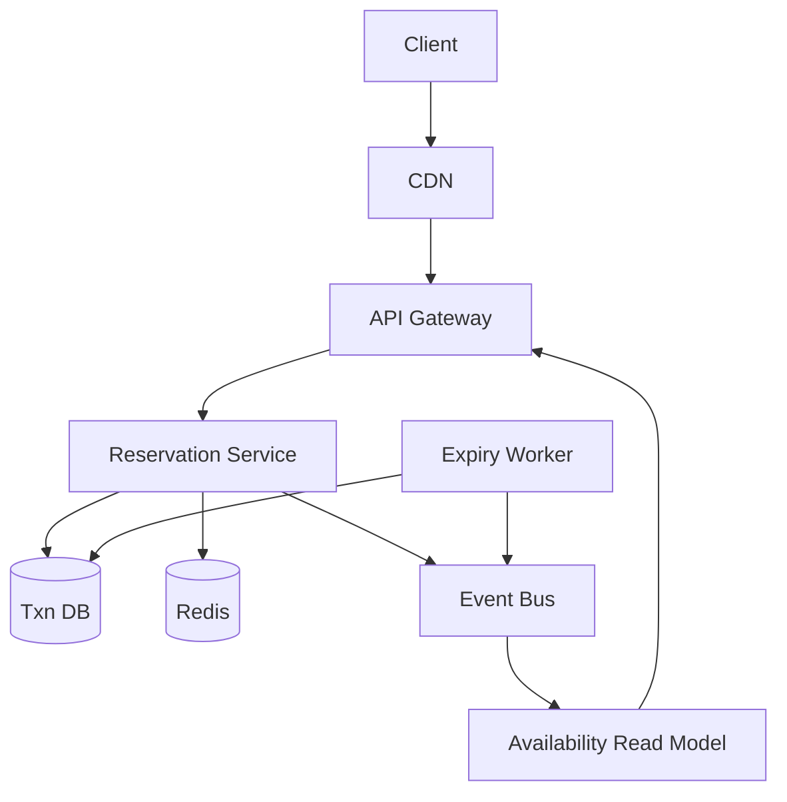
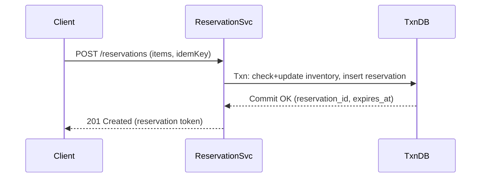
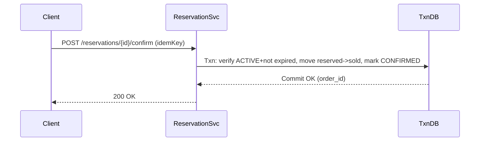

## Overview

A high-traffic product launch stresses the hardest part of commerce systems: maintaining a single source of truth for stock under extreme concurrency. “Zero overselling” means every reserve/checkout must be strongly consistent, while “hold in carts for 10 minutes” means inventory is temporarily removed from availability and must be reliably released on expiry—even during failures, retries, and partial outages.

The key insight is to model **reservations as first-class entities** and enforce the invariant `reserved + sold <= total` using **atomic conditional updates in a strongly consistent datastore**. Reads (browse) can be served from caches and eventual-consistent projections, but **writes (reserve/confirm/cancel/expire)** must go through a consistency boundary that serializes contention per SKU (or per SKU+pool) and provides idempotency.

This design uses a transactional, horizontally scalable database (e.g., Spanner/CockroachDB) for write correctness, plus caching and event-driven projections for read scale and operational visibility.

## Requirements

### Functional Requirements
- Create a **10-minute reservation** for one or more SKUs when a user adds items to cart.
- Prevent oversell: total committed/reserved quantity for any SKU must **never exceed available stock**.
- Allow users to **view, extend (optional), and cancel** reservations before expiry.
- Convert an active reservation into a **confirmed purchase** (checkout) exactly once.
- Automatically **expire** reservations at 10 minutes and return inventory to availability.
- Provide **near-real-time availability** for product pages (may be eventually consistent).
- Support **idempotent retries** for reserve/confirm/cancel (mobile networks, timeouts).
- Provide admin/system APIs to **adjust stock** (restocks, corrections, recalls) with auditability.

### Non-Functional Requirements
- **Scale**:
  - Browse availability reads: ~200k QPS peak global
  - Reservation writes: ~20k QPS peak global (flash-sale spikes)
  - Checkout confirms: ~5k QPS peak global
  - Inventory SKUs: 1M; hot SKUs: top 100 extremely contended
  - Reservations: 50–200M/day during launch window
- **Latency**:
  - Browse availability: P50 20ms, P99 80ms (cache/projection)
  - Reserve: P50 60ms, P99 200ms (single-region write or optimized multi-region)
  - Confirm checkout: P50 80ms, P99 250ms
- **Availability**:
  - Reserve/confirm: 99.99% (degrade gracefully rather than oversell)
  - Browse: 99.95%+
- **Consistency**:
  - Strong: reserve/confirm/cancel/expire operations and inventory counters
  - Eventual: browse availability projections, analytics, monitoring aggregates
- **Durability**:
  - No loss of committed reservations/orders (RPO ~0 for write DB)
  - Projections can lag/rebuild (RPO minutes acceptable)

### Constraints & Assumptions
- Cart holds last exactly **10 minutes** (no guarantee of extension unless stated).
- Global traffic; users should be routed to the closest region for reads.
- Budget allows a managed transactional store (Spanner/CockroachDB) and Redis/Kafka.
- Compliance: PII handled separately; inventory system stores minimal user identifiers.
- If multi-item cart reservations must be atomic, the DB must support multi-row transactions at required scale; otherwise use a saga with compensations.

## High-Level Architecture



The Reservation Service is the consistency boundary: all state transitions that can affect sellable inventory flow through it and commit to a transactional database with conditional updates. Redis accelerates hot read paths and reduces DB load but is never the source of truth for “can I reserve X units”.

An event bus (Kafka/PubSub) streams inventory and reservation changes to build a read-optimized availability model (e.g., Redis/Elastic/DynamoDB) served at the edge for product-page reads. A dedicated expiry worker ensures timed releases, and can be replaced/augmented by database-native TTL features where available.

## Component Deep-Dive

### API Gateway / Edge

**Responsibility**: Auth, rate limiting, request routing, idempotency key enforcement (shape), and caching headers for browse endpoints.

**Key Design Decisions**:
- Enforce per-user/per-IP rate limits on reserve/confirm to protect DB hot keys.
- Route write requests to the region owning the inventory pool (or DB leader) to reduce tail latency.

**Technology Choice**: Envoy/NGINX + API Gateway (Cloudflare/AWS API GW) for global edge.

**Scaling Strategy**: Stateless horizontal scaling; regional failover with health checks.

### Reservation Service

**Responsibility**: Reserve/cancel/confirm inventory with strict invariants; issue reservation tokens; publish events.

**Key Design Decisions**:
- Use **single transactional write** to create reservation and update inventory counters.
- Make all mutations **idempotent** using `(client_id, idempotency_key)` and/or `reservation_id`.

**Technology Choice**: Go/Java service with gRPC internally; REST externally; strong typed schema.

**Scaling Strategy**: Stateless scale-out; shard-aware routing by `sku_id` (or `pool_id`) to reduce cross-node contention and enable per-key backpressure.

### Transactional Inventory Store (Source of Truth)

**Responsibility**: Persist inventory counts, reservations, and orders; provide serializable/strong consistency for critical updates.

**Key Design Decisions**:
- Store inventory in **(sku_id, pool_id)** rows to bound contention and allow regional pooling.
- Use **optimistic concurrency** (version/ETag) or conditional updates to enforce invariants.

**Technology Choice**: Google Spanner / CockroachDB (multi-region capable); or PostgreSQL + sharding if scope is smaller.

**Scaling Strategy**: Partition by `sku_id` (and `pool_id`); add nodes to increase write throughput; keep hot SKUs isolated via pooling/leases (see performance section).

### Expiry Worker

**Responsibility**: Detect expired reservations and release inventory.

**Key Design Decisions**:
- Drive expiry off DB timestamps (not app clocks) to avoid skew.
- Make expiry idempotent: expiring an already-canceled/confirmed reservation is a no-op.

**Technology Choice**: Scheduled workers (K8s CronJob or continuous poller); optionally DB TTL + change streams.

**Scaling Strategy**: Partition scans by time buckets; parallel workers by shard; bounded work per tick.

### Availability Read Model

**Responsibility**: Serve fast “available now” answers for product pages and search/browse.

**Key Design Decisions**:
- Treat as derived data; rebuildable from events + DB snapshots.
- Prefer slight staleness over blocking writes; never used to authorize reservations.

**Technology Choice**: Redis Cluster for fast counts + optional Elasticsearch for search facets.

**Scaling Strategy**: Horizontal scaling via sharding; TTL-based refresh; warm hot SKUs at edge.

## Data Model

### Storage Schema

**inventory**
- `sku_id` (PK part)
- `pool_id` (PK part) — e.g., `global` or `us-east`, `eu-west`
- `total_qty` (int64)
- `reserved_qty` (int64)
- `sold_qty` (int64)
- `version` (int64) — for optimistic concurrency
- `updated_at` (timestamp)

Invariant: `reserved_qty + sold_qty <= total_qty` (enforced in mutation logic; optionally via constraints where supported).

**reservations**
- `reservation_id` (PK, UUID/ULID)
- `user_id` (string/uuid)
- `status` (enum: ACTIVE, CANCELED, EXPIRED, CONFIRMED)
- `expires_at` (timestamp)
- `created_at` (timestamp)
- `idempotency_key` (string) + `client_id` (string) unique
- `last_updated_at` (timestamp)

**reservation_items**
- `reservation_id` (PK part)
- `sku_id` (PK part)
- `pool_id`
- `qty` (int32)

**orders** (minimal, may live in an Order service)
- `order_id` (PK)
- `reservation_id` (unique)
- `status` (PLACED, PAID, FAILED)
- `created_at`

### Data Flow

Reservation creation and inventory decrement must be atomic:



Confirm checkout:



## API Design

### Create Reservation
`POST /v1/reservations`

Headers:
- `Idempotency-Key: <uuid>`
- `X-Client-Id: <app-install-or-web-session-id>`

Request:
```json
{
  "userId": "u_123",
  "items": [
    { "skuId": "sku_abc", "qty": 1 },
    { "skuId": "sku_xyz", "qty": 2 }
  ],
  "poolHint": "auto"
}
```

Response `201`:
```json
{
  "reservationId": "r_01J...",
  "status": "ACTIVE",
  "expiresAt": "2025-12-17T12:34:56Z",
  "items": [
    { "skuId": "sku_abc", "qty": 1, "poolId": "us-east" }
  ]
}
```

Errors:
- `409 INSUFFICIENT_INVENTORY` (include which SKU failed)
- `409 IDEMPOTENCY_KEY_REPLAY` (if payload mismatch for same key)
- `429 RATE_LIMITED`
- `503 TEMPORARILY_UNAVAILABLE` (prefer fail-closed over oversell)

Idempotency:
- Same `(X-Client-Id, Idempotency-Key)` returns the original reservation if payload matches exactly.

### Get Reservation
`GET /v1/reservations/{reservationId}` → returns status, items, expiry.

### Cancel Reservation
`POST /v1/reservations/{reservationId}/cancel` (idempotent)
- If already canceled/expired/confirmed: return `200` with current status.

### Confirm Reservation (Checkout Gate)
`POST /v1/reservations/{reservationId}/confirm`
- Returns `409 RESERVATION_EXPIRED` if `now >= expiresAt`
- Exactly-once confirm enforced by unique `reservation_id` in `orders`.

## Scaling & Performance

### Bottleneck Analysis
- **Hot SKUs** cause write contention on a single inventory row.
  - Mitigations:
    - Partition inventory into **pools** (regional or logical) to spread load.
    - Implement **inventory leasing**: service instances acquire short-lived “token batches” (e.g., 50 units for 30s) from DB, then reserve locally from the lease; on crash, lease expires and returns capacity.
    - Apply per-SKU **queued writes** (in-service) to smooth spikes and reduce lock thrash.
- **Expiry storms** (many reservations expiring at once).
  - Mitigations:
    - Randomize expiry by a small jitter at creation (e.g., ±10s) while honoring 10-minute SLA, or bucket expirations.
    - Use indexed `expires_at` scans with bounded batch sizes.

### Horizontal Scaling
- **Edge/API**: scale by region; anycast routing; autoscale on RPS.
- **Reservation Service**: stateless; consistent hashing on `(sku_id, pool_id)` for cache locality and backpressure.
- **DB**: partition/shard by `sku_id` and `pool_id`; add nodes; keep leader locality aligned with write traffic.
- **Read Model**: shard by `sku_id`; replicate widely.

Partitioning strategy:
- Default: `pool_id` = region (e.g., `us-east`, `eu-west`) with a rebalancer that shifts `total_qty` between pools during launch.
- For truly global single-pool semantics, use a multi-region transactional DB; accept higher P99 for cross-region writes or route all writes for a SKU to its leader region.

### Caching Strategy
- Cache **availability summaries** (`available = total - reserved - sold`) in Redis/read-model with TTL 1–5s.
- Cache product-page aggregates at edge/CDN with very short TTL (1–2s) and stale-while-revalidate.
- Do not cache reservation authorization decisions; only cache post-commit results by `reservation_id`.

Invalidation:
- Event-driven updates from DB commits to read model; TTL as a safety net for missed events.

## Trade-offs & Alternatives

### Key Trade-offs Made
- **Chose** strong transactional DB for reservations  
  - **Sacrificed** some write latency/cost vs. pure cache-based counters  
  - **Why**: “zero oversell” is a correctness requirement; must fail-closed under ambiguity.
- **Chose** derived read model for browse  
  - **Sacrificed** perfectly up-to-date availability on product pages  
  - **Why**: reads dominate; eventual is acceptable as long as reserve path is authoritative.
- **Chose** pool/lease mechanisms for hot SKUs  
  - **Sacrificed** some complexity and potential underutilization if pools are mis-sized  
  - **Why**: flash sales create extreme contention that can overwhelm single-row updates.

### Alternative Approaches
- **Redis atomic counters (Lua) + async persistence**: very fast, but risks oversell on failover/data loss or split-brain; hard to guarantee durability.
- **DynamoDB conditional writes**: strong within a region, but global writes require careful single-writer routing; good option if you accept per-SKU home region.
- **Serialized per-SKU queue (Kafka) as the write path**: guarantees ordering and reduces DB contention, but adds asynchronous latency and complicates UX for “instant reserve”.

## Failure Modes & Mitigations

### Failure Scenarios
- **Scenario**: Reservation service retries after timeout; duplicate reserve requests  
  - **Impact**: accidental double reservation (oversell risk)  
  - **Detection**: idempotency key replay metrics; duplicate key conflicts  
  - **Mitigation**: unique `(client_id, idempotency_key)`; return original result.
- **Scenario**: Expiry worker down or lagging  
  - **Impact**: inventory artificially locked, reduced conversion  
  - **Detection**: expiry lag (`now - min(expires_at of ACTIVE)`) alerts  
  - **Mitigation**: multiple workers; DB TTL where available; on read/confirm, treat expired reservations as expired and release opportunistically.
- **Scenario**: DB region outage / partition  
  - **Impact**: cannot safely reserve/confirm; must avoid oversell  
  - **Detection**: DB health checks, elevated commit latency/errors  
  - **Mitigation**: fail-closed for reserve/confirm; serve browse from read model; automated failover if DB supports it.
- **Scenario**: Event bus down  
  - **Impact**: stale browse availability/read model  
  - **Detection**: consumer lag, publish error rate  
  - **Mitigation**: read model TTL + periodic reconciliation from DB; keep write path independent.
- **Scenario**: Clock skew across nodes  
  - **Impact**: premature expiry or extended holds  
  - **Detection**: NTP drift metrics; inconsistencies in expiry decisions  
  - **Mitigation**: use DB `CURRENT_TIMESTAMP` for `expires_at` and expiry comparisons.

### Disaster Recovery
- **RTO/RPO**: RTO 30 minutes; RPO ~0 for transactional DB, minutes for projections.
- **Backup strategy**: continuous backups + daily full snapshots; point-in-time restore tested quarterly.
- **Failover procedures**: promote secondary region (if multi-region DB); re-point write traffic via global load balancer; rebuild read model from event log + DB snapshot.

## Operational Considerations

### Monitoring & Alerting
- Key metrics:
  - `reserve_success_rate`, `reserve_conflict_rate`, `confirm_success_rate`
  - DB commit latency (P50/P99), transaction abort/retry counts
  - `active_reservations`, `expiry_lag_seconds`
  - Inventory invariant violations (should be zero): `reserved + sold > total`
  - Hot SKU contention: per-SKU QPS and abort rate
- Alert thresholds:
  - Reserve P99 > 300ms for 5m
  - Expiry lag > 60s for 5m
  - Any invariant violation > 0 (page immediately)
  - DB error rate > 1% for 1m (page)

### Deployment Strategy
- Canary Reservation Service by region and SKU subset; monitor abort/latency before ramp.
- Schema changes via backward-compatible migrations (add columns first, then backfill, then enforce constraints).
- Rollback: revert service version; keep idempotency behavior stable across versions to avoid retry storms.

## References & Further Reading
- Google Spanner: transactions and TrueTime (consistency + multi-region considerations)
- CockroachDB: serializable isolation and multi-region tables
- DynamoDB conditional writes (optimistic concurrency patterns)
- Redis: Lua scripting and failure modes (why it’s risky as source of truth)
- Jepsen analyses of distributed databases (understanding edge-case failure behavior)