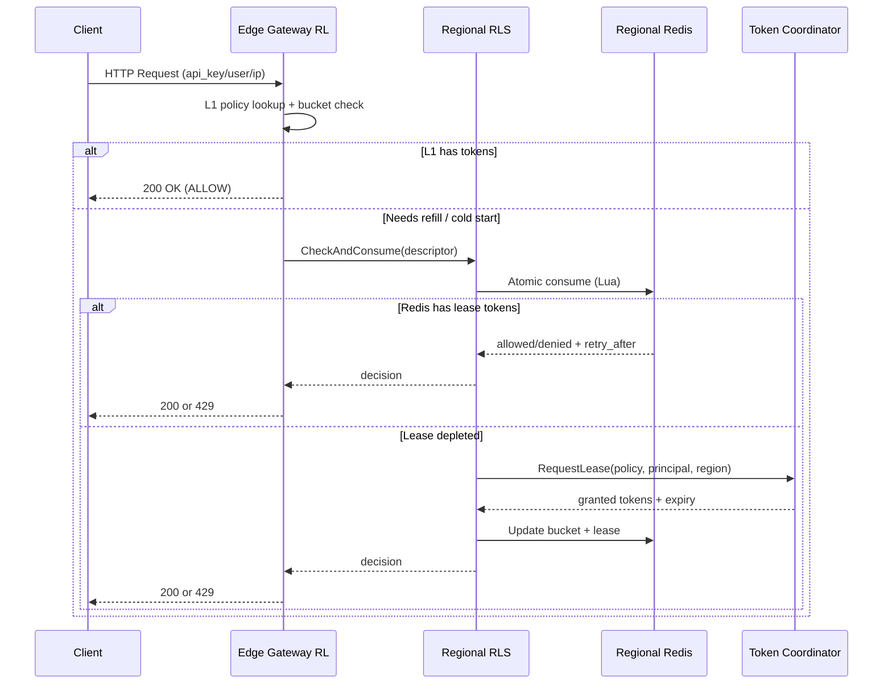

## Overview

A global rate limiter enforces per-principal (user/IP/API key) quotas across many geographic regions while preserving low request latency and minimizing cross-region coordination. The core challenge is balancing **correctness** (don’t exceed limits) with **performance** (single-digit millisecond decisions at the edge) under real-world constraints: uneven traffic distribution, partial failures, network partitions, hot keys, and rapidly changing policies.

A production-grade solution uses **hierarchical enforcement**: make the common-case decision locally (edge/region) and only coordinate when necessary. The key insight is to treat “global rate limiting” as a **bounded-consistency problem**: strict global ordering per key is expensive across continents, so we enforce global limits using **token leasing** (regional quotas) that bounds overshoot while keeping request-path latency low and coordination overhead predictable.

## Requirements

### Functional Requirements
- Enforce limits per **API key**, **user ID**, and/or **IP/CIDR**, with configurable precedence and composition.
- Support multiple policies: **requests/sec**, **requests/min**, **concurrent requests**, and **burst capacity** (token bucket).
- Provide **multi-dimensional limits** (e.g., per endpoint + per customer tier + per region overrides).
- Return deterministic outcomes: **ALLOW** or **DENY** with `retry_after_ms`, and optional “remaining tokens” metadata.
- Support **administrative APIs** to create/update policies, enable/disable keys, and apply emergency blocks.
- Offer **auditing and observability**: per-policy allow/deny counts, top offenders, hot keys, and rule change history.
- Enable **safe rollouts**: shadow mode (observe-only), canary policies, and fast rollback.
- Provide **batch evaluation** (evaluate multiple descriptors per request) for API gateways.

### Non-Functional Requirements
- **Scale**:
  - 30+ regions / edge POPs, 300+ edge sites
  - Peak **5M decisions/sec** globally (steady 1–2M/s)
  - Up to **100M principals** (API keys/users), long tail + hot keys
  - Policy set size: **1M active policies**, 10K updates/day
- **Latency** (decision on request path):
  - Edge L1 (in-process): **P50 0.2ms**, **P99 1ms**
  - Edge→regional store round-trip (rare): **P99 5–10ms**
  - Cross-region coordination (lease refill, out-of-band): **P99 150–300ms**, not on the critical path
- **Availability**:
  - Request-path decisioning: **99.99%** (regional isolation)
  - Control plane (policy updates): **99.9%**
- **Consistency**:
  - **Strong** for policy writes and versioning (no split-brain rules).
  - **Bounded eventual** for global quota enforcement: may allow small, bounded overshoot during partitions or lease over-allocation.
- **Durability**:
  - Policy data: **RPO ≤ 1 minute**, **RTO ≤ 15 minutes**
  - Rate-limit counters/buckets: ephemeral is acceptable (best-effort), but must not cause widespread false-deny after restarts.

### Constraints & Assumptions
- System is deployed behind an API gateway / edge proxy (e.g., Envoy/Nginx/Cloud LB).
- Network access between regions exists but has high latency and occasional partitions.
- Budget favors **stateless edge components** and **regional data stores**; avoid per-request cross-region calls.
- Compliance: store minimal PII; IPs may be hashed/truncated; provide data retention controls (e.g., 7–30 days for analytics).
- Team size: small platform team (3–6 engineers), so operational simplicity matters.

## High-Level Architecture

```mermaid
graph TB
    subgraph "Client Layer"
        C[Clients / SDKs]
    end

    subgraph "Edge Layer (per POP)"
        GW[API Gateway / Edge Proxy]
        RL[Rate Limiter (in-proxy filter / sidecar)]
        L1[(L1 In-Memory Buckets)]
    end

    subgraph "Regional Layer (per Region)"
        RLS[Regional Rate Limit Service]
        RKV[(Regional KV / Redis Cluster)]
        PUB[Policy Push (Pub/Sub)]
    end

    subgraph "Global Control Plane"
        PS[Policy Service]
        PDB[(Policy DB - Postgres / Spanner)]
        TC[Token Lease Coordinator]
        LDB[(Lease State DB - DynamoDB / Spanner)]
    end

    subgraph "Observability"
        MET[Metrics/Tracing]
        LOG[Decision Logs Stream]
        ANA[(Analytics Store)]
    end

    C --> GW --> RL --> L1
    RL -->|miss/refill| RLS --> RKV
    PS --> PDB
    PS --> PUB
    PUB --> RL
    RLS -->|lease refill| TC --> LDB
    RL --> MET
    RLS --> MET
    RL --> LOG --> ANA
```

The request path is optimized for locality: the edge limiter evaluates policies using an in-process L1 cache of token buckets. When it needs refill state (cold start, eviction, or depleted local lease), it consults a regional service backed by a regional KV (Redis cluster). Global coordination is pushed off the request path via a token lease coordinator that periodically grants/renews regional token allocations for “global” limits.

This structure minimizes tail latency and blast radius: regional failures affect only that region, and global control-plane issues degrade gracefully (e.g., reuse last-known policies, continue with remaining leases). It also gives clear operational seams: edge decisioning, regional quota distribution, and global policy/lease authority.

## Component Deep-Dive

### Edge Rate Limiter (Gateway Filter / Sidecar)

**Responsibility**: Make fast ALLOW/DENY decisions per request using local bucket state and cached policies; attach `Retry-After` and headers.

**Key Design Decisions**:
- Use **token bucket / GCRA** semantics for predictable bursts and smooth refill, rather than fixed windows (reduces boundary spikes).
- Maintain **L1 in-memory buckets** keyed by `(principal, policy_id, dimension_hash)` with short TTL + size caps to handle the long tail.

**Technology Choice**: Envoy RateLimit filter-style plugin (C++/Rust) or an in-process library for your gateway; optional sidecar for non-Envoy stacks.

**Scaling Strategy**: Stateless horizontal scaling with per-instance L1 caches; consistent behavior via shared regional refill + shared policy push.

---

### Regional Rate Limit Service (RLS)

**Responsibility**: Provide low-latency refill and shared state within a region, including per-principal buckets, hot-key protection, and lease accounting.

**Key Design Decisions**:
- Store ephemeral bucket state in **Redis Cluster** (or KeyDB) for high throughput and atomic scripts.
- Use **Lua scripts** (or Redis functions) to perform atomic token consume/refill and return `allowed`, `remaining`, `retry_after_ms`.

**Technology Choice**: Go/Rust service; Redis Cluster with replicas; local-zone placement.

**Scaling Strategy**: Scale RLS statelessly behind a regional LB; scale Redis via sharding; apply hot-key mitigation (see Scaling section).

---

### Token Lease Coordinator (Global)

**Responsibility**: Allocate “global” quotas into **regional leases** (tokens per policy+principal per region) so regions can decide locally without per-request global coordination.

**Key Design Decisions**:
- Lease tokens with **time-bounded grants** (e.g., 10–60s worth) to bound overshoot and allow rebalancing.
- Partition coordination by `(policy_id, principal_hash)` to avoid global bottlenecks and enable parallelism.

**Technology Choice**: Stateless service + strongly consistent store for lease metadata (Spanner / DynamoDB with conditional writes / FoundationDB).

**Scaling Strategy**: Shard by keyspace; use batching for lease renewals; prioritize hot keys; backpressure regions requesting excessive refills.

---

### Policy Service (Control Plane)

**Responsibility**: CRUD policies, validate configs, manage rollouts (canary/shadow), and distribute policy snapshots to edge/regions.

**Key Design Decisions**:
- Treat policies as **versioned immutable snapshots**; edges consume “latest version” pointers to avoid partial updates.
- Distribute via **pub/sub + periodic snapshot pull** (push for speed, pull for resilience).

**Technology Choice**: Postgres for most orgs; Spanner for global strong consistency; Pub/Sub/Kafka for propagation.

**Scaling Strategy**: Read-heavy with cache/CDN for snapshots; write path is low QPS but must be strongly consistent.

---

### Telemetry & Analytics Pipeline

**Responsibility**: Capture decisions, denials, retry-after, and hot-key signals for debugging, abuse detection, and capacity planning.

**Key Design Decisions**:
- Sample allow-logs heavily; **log denials at higher rate**.
- Aggregate at edge/region before shipping globally to reduce cost.

**Technology Choice**: OpenTelemetry + Prometheus; Kafka/Kinesis for logs; ClickHouse/BigQuery for analytics.

**Scaling Strategy**: Stream partitioning by policy/tenant; tiered retention; separate “security signals” from general analytics.

## Data Model

### Storage Schema

**Policy DB (strongly consistent)**

- `rate_limit_policies`
  - `policy_id` (UUID, PK)
  - `name`
  - `scope_type` (enum: `API_KEY|USER|IP|CIDR|CUSTOM`)
  - `dimensions` (JSON: endpoint patterns, method, product, etc.)
  - `algorithm` (enum: `TOKEN_BUCKET|GCRA`)
  - `rate` (int tokens per second)
  - `burst` (int max tokens)
  - `mode` (enum: `ENFORCE|SHADOW|DISABLED`)
  - `priority` (int)
  - `created_at`, `updated_at`

- `policy_versions`
  - `policy_id` (PK part)
  - `version` (PK part, monotonic)
  - `snapshot` (JSON/protobuf blob)
  - `published_at`
  - `published_by`

- `principal_overrides`
  - `principal_id` (hashed key/user/ip)
  - `policy_id`
  - `override_rate`, `override_burst`
  - `expires_at`

**Lease State DB (global authority for “global” policies)**

- `token_leases`
  - `lease_key` (PK: hash(policy_id + principal_id + region))
  - `policy_id`
  - `principal_id`
  - `region`
  - `granted_tokens`
  - `consumed_tokens`
  - `lease_expires_at`
  - `last_grant_at`
  - `etag` / `version` (for CAS)

**Regional KV (ephemeral, fast path)**

- Key: `bucket:{policy_id}:{principal_hash}:{dimension_hash}`
  - Value:
    - `tokens` (float/int)
    - `last_refill_ms` (int64)
    - `local_lease_remaining` (int)
    - `lease_expiry_ms` (int64)
    - `policy_version` (int)

### Data Flow

**Request decision (common path)**



**Policy update**
- Admin writes policy → Policy Service validates → writes new `policy_versions` row → updates “latest pointer” → publishes `(policy_id, version)` to pub/sub.
- Edge/RLS subscribe and update local caches; periodic snapshot pull handles missed events.

## API Design

### Decision API (gRPC preferred; REST acceptable)

**gRPC: `RateLimitService.Check`**
- Request:
  - `string request_id` (idempotency for retries)
  - `string principal_id` (hashed api key / user id / ip)
  - `string region`
  - `repeated Descriptor descriptors` (e.g., endpoint, method, product)
- Response:
  - `enum Decision { ALLOW, DENY }`
  - `int64 retry_after_ms`
  - `map<string,string> headers` (e.g., `X-RateLimit-Remaining`)
  - `string policy_id_applied`
  - `int64 policy_version`

**Error handling**
- `INVALID_ARGUMENT`: malformed descriptors / unknown policy scope
- `UNAVAILABLE`: regional service down (caller applies configured fallback)
- `RESOURCE_EXHAUSTED`: optional for system overload (distinct from user throttling)

**Idempotency considerations**
- Decision should be idempotent for the same `(request_id, principal, descriptor set)` within a short window to avoid double-consuming tokens on gateway retry.
- Implement via a short-lived dedupe key in Redis: `dedupe:{request_id}` → stores decision and token delta for ~5–30s.

### Policy APIs (REST)

- `POST /v1/policies` create
- `PUT /v1/policies/{policy_id}` update (creates new version)
- `POST /v1/policies/{policy_id}:publish` publish version
- `GET /v1/policies:snapshot?version=...` fetch snapshot
- `POST /v1/policies/{policy_id}:shadow` enable shadow mode
- `POST /v1/policies/{policy_id}:rollback?version=...`

### Lease API (internal)

**gRPC: `TokenCoordinator.Reserve`**
- Request: `(policy_id, principal_id, region, desired_tokens, min_tokens, now_ms)`
- Response: `(granted_tokens, lease_expires_at_ms, coordinator_version)`
- Uses conditional updates in `token_leases` to prevent double-grants.

## Scaling & Performance

### Bottleneck Analysis
- **Hot principals** (one API key driving huge QPS) cause Redis hot shards and coordinator churn.
  - Mitigation: per-principal **local burst cache**, **request coalescing** (single flight), and **adaptive lease sizing** (grant larger leases for hot keys).
- **Redis throughput/latency** impacts decision tail.
  - Mitigation: keep most decisions in L1; use Redis only on misses/refills; shard by consistent hashing; keep Lua scripts O(1).
- **Coordinator overload** during widespread lease renewals (e.g., deploy restart).
  - Mitigation: jitter renewals; bootstrap with regional static quotas; exponential backoff; batch reserve calls.

### Horizontal Scaling
- **Edge layer**: scale gateways horizontally; L1 cache is per-instance.
- **Regional layer**: scale RLS horizontally; Redis Cluster shards by `hash(bucket_key)`.
- **Global coordinator**: shard by `(policy_id, principal_hash % N)`; run N partitions independently; store lease rows partitioned accordingly.
- **Partition strategy**:
  - Key = `H(policy_id || principal_id || dimension_hash)` for bucket storage.
  - Keep dimension_hash stable (canonical descriptor ordering) to avoid cache fragmentation.

### Caching Strategy
- **Policy cache**:
  - Edge/RLS store latest policy snapshot in memory.
  - Invalidation via pub/sub; fallback to periodic pull (e.g., every 60s).
- **Bucket cache (L1)**:
  - Keep `(tokens, last_refill, lease_remaining, lease_expiry)` in memory with TTL (e.g., 5–30s) and size cap (e.g., 100K entries per instance).
  - On eviction/cold start, consult RLS/Redis.
- **Negative caching**:
  - Cache “no policy matched” for short TTL to reduce repeated lookups on unthrottled traffic.
- **Cache invalidation**:
  - Policies are versioned; buckets carry `policy_version`. On version mismatch, reinitialize bucket from new parameters.

## Trade-offs & Alternatives

### Key Trade-offs Made
- **Chosen**: Token leasing (regional quotas) for global limits  
  **Sacrificed**: Perfect global strictness (may overshoot by bounded amount)  
  **Why**: Avoids per-request cross-region calls; achieves low latency and high availability.
- **Chosen**: Redis-backed atomic scripts for regional state  
  **Sacrificed**: Strong durability of counters  
  **Why**: Bucket state is ephemeral; durability is less important than throughput/latency.
- **Chosen**: Versioned policy snapshots + push/pull distribution  
  **Sacrificed**: Simplicity of “read policy from DB on demand”  
  **Why**: Eliminates request-path dependency on control-plane DB and reduces blast radius.

### Alternative Approaches
- **Centralized global counter (single region / strongly consistent DB)**: simplest correctness, but high latency globally and poor resilience to regional outages.
- **CRDT-based global counters (PN-Counter across regions)**: avoids a single coordinator but introduces complexity, convergence delays, and larger overshoot under partitions.
- **Pure edge-local limits (no global coordination)**: best latency, but cannot enforce true global quotas; tenants can exceed limits by spreading across regions.

## Failure Modes & Mitigations

### Failure Scenarios
- **Scenario**: Regional Redis shard failure  
  **Impact**: Increased denies or fallback; localized to region/shard  
  **Detection**: Redis error rate, latency, missing script responses  
  **Mitigation**: Replica failover, client retries with jitter, degrade to L1-only with conservative limits for hot keys.
- **Scenario**: Token Coordinator unavailable  
  **Impact**: Leases can’t be renewed; eventually more denies for global policies  
  **Detection**: Lease reserve error rate, timeouts  
  **Mitigation**: Use existing leases until expiry; allow limited “emergency regional budget” (bounded) to prevent sudden outages; alert and auto-scale coordinator.
- **Scenario**: Cross-region partition (some regions isolated)  
  **Impact**: Regions may continue spending old leases; bounded global overshoot  
  **Detection**: Coordinator sees stalled heartbeats/renewals; network telemetry  
  **Mitigation**: Short lease TTLs (10–60s), conservative grant sizing, post-partition reconciliation in analytics (not request-path).
- **Scenario**: Bad policy push (misconfiguration)  
  **Impact**: Widespread throttling or unthrottled abuse  
  **Detection**: Sudden deny spike, SLO burn alerts, anomaly detection  
  **Mitigation**: Policy validation, staged rollout (shadow→canary→full), one-click rollback to previous version.

### Disaster Recovery
- **RTO**: 15 minutes for control plane; request-path continues regionally.
- **RPO**: 1 minute for policies (DB replication + backups).
- **Backup strategy**:
  - Policy DB: continuous WAL + daily snapshots.
  - Lease DB: point-in-time recovery (if supported); otherwise recreate from live traffic (leases are ephemeral).
- **Failover procedures**:
  - Promote secondary region for Policy Service.
  - Coordinator shards fail over independently; regions retry with backoff and use remaining leases.

## Operational Considerations

### Monitoring & Alerting
- Key metrics:
  - `rate_limiter_decision_total{allow|deny,policy_id,region}`
  - `rate_limiter_latency_ms{p50,p99}` at edge and RLS
  - Redis: `ops/sec`, `script_latency`, `evictions`, `replication_lag`
  - Coordinator: `lease_grants/sec`, `grant_failures`, `grant_latency`
  - “Bounded overshoot estimate” per policy (granted - consumed - expired)
- Alert thresholds (examples):
  - Edge decision P99 > 5ms for 5 minutes
  - Deny rate spike > 3× baseline for a policy/tenant
  - Redis shard error rate > 1% or failover events
  - Coordinator reserve failures > 0.5% for 5 minutes

### Deployment Strategy
- Edge/RLS: rolling deploy with canaries per region; keep Lua script compatibility (versioned scripts).
- Policy changes:
  - Shadow mode first (log would-deny), then canary tenants, then full rollout.
  - Rollback by switching “latest version” pointer; edges converge via pub/sub + periodic pull.
- Safe fallback behavior:
  - Define per-policy fail mode: **fail-open** (prefer availability) vs **fail-closed** (prefer protection), defaulting to fail-open for most user traffic and fail-closed for security-sensitive endpoints.

## References & Further Reading

- Envoy Rate Limit Service: https://www.envoyproxy.io/docs/envoy/latest/intro/arch_overview/other_features/global_rate_limiting
- Token Bucket & GCRA (cell rate algorithm): https://en.wikipedia.org/wiki/Generic_cell_rate_algorithm
- Redis rate limiting patterns (Lua + token bucket): https://redis.io/docs/latest/develop/use/patterns/rate-limiting/
- Google SRE Workbook (overload and throttling patterns): https://sre.google/workbook/
- Stripe/Shopify engineering blogs on throttling and abuse controls (practical operational patterns)