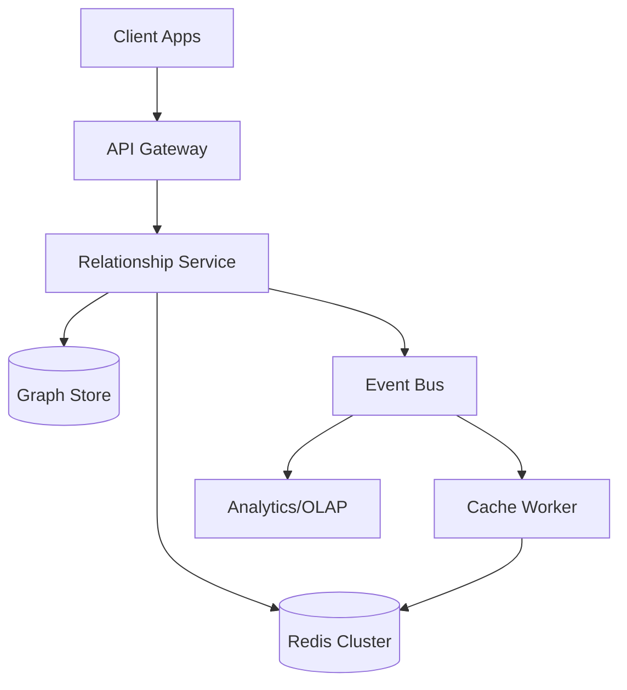
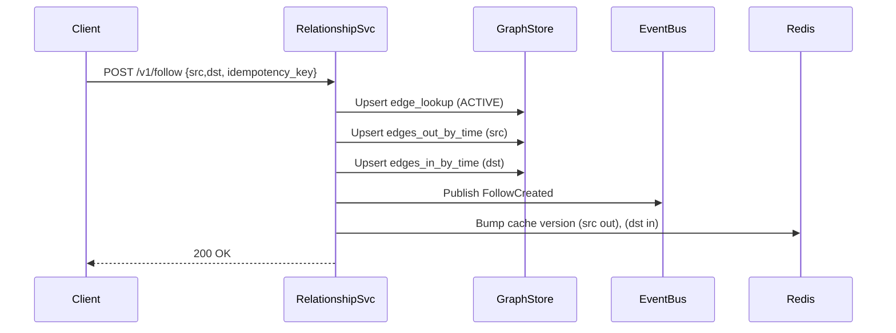

## Overview

A relationship service powers core social features—follow, friend, block, and “who follows whom”—and must answer these queries at extremely high read volume with tight latency. The data is deceptively simple (edges between users) but challenging in production because access patterns are highly skewed (celebrities), fan-out can be enormous, and users expect instant, correct behavior after actions like follow/unfollow.

The key insight is to model the graph as **adjacency lists** (not general-purpose graph traversal) and to store edges in a **write-optimized, horizontally sharded KV / wide-column store**, with **purpose-built denormalized indexes** for the dominant queries: outgoing (following/friends), incoming (followers/friend requests), and direct edge checks. Heavy caching is mandatory, but must be paired with **versioned invalidation** and **event-driven cache updates** to avoid stale or inconsistent user experience.

## Requirements

### Functional Requirements
- Create and remove directed edges: `follow` / `unfollow`.
- Create and manage bi-directional edges: `friend request`, `accept`, `remove friend`.
- Query outgoing edges: list who a user follows / friends with cursor pagination.
- Query incoming edges: list a user’s followers / pending friend requests with cursor pagination.
- Relationship checks: does A follow B? are A and B friends? is A blocked by B?
- Counts: follower/following/friend counts with bounded staleness.
- Batch APIs: check relationships for (viewer, many targets) for profile/feed rendering.
- Moderation/safety: block/mute edges that affect visibility and query filtering.

### Non-Functional Requirements
- **Scale**:
  - 50M DAU, 300M MAU
  - ~50B total edges (follow + auxiliary edges), growth 50–200M edges/day
  - Read-heavy: 150K QPS average reads, 500K QPS peak reads
  - Writes: 10K QPS average, 50K QPS peak (bursty during events)
- **Latency**:
  - Relationship check: P50 5ms, P99 30ms
  - List followers/following (first page): P50 20ms, P99 120ms
- **Availability**: 99.99% for reads, 99.9% for writes
- **Consistency**:
  - Edge mutation: “read-your-writes” for the acting user (best-effort), eventual for everyone else
  - Counts: eventual (seconds to minutes), bounded staleness acceptable
- **Durability**: tolerate 0 lost acknowledged edge writes (RPO≈0 for committed writes), multi-AZ replication

### Constraints & Assumptions
- Primary query patterns are adjacency-list lookups and direct edge existence checks (no arbitrary multi-hop traversals in the hot path).
- Hard requirement for pagination and stable ordering (typically by edge creation time).
- Skew expected: top 0.1% users receive disproportionate follower traffic; must handle “celebrity partitions”.
- Compliance: audit logs for edge mutations; GDPR deletion for user removal.

## High-Level Architecture



The API Gateway terminates auth and rate limits, then routes to the Relationship Service which implements business rules (block semantics, friend workflows) and reads/writes the graph. The “Graph Store” is a horizontally sharded, highly available datastore optimized for key-based reads/writes (e.g., DynamoDB, Scylla/Cassandra, or HBase). Redis provides low-latency caching for hot adjacency pages, edge checks, and counts.

Every mutation emits an event to an event bus (Kafka/Pulsar/Kinesis). Workers consume events to update/invalidate cache entries, maintain derived views (approximate counts, recommendations inputs), and feed analytics. This decouples hot-path correctness from secondary processing while keeping cache freshness high.

## Component Deep-Dive

### API Gateway

**Responsibility**: AuthN/AuthZ, rate limiting, request shaping, routing, and abuse protection.

**Key Design Decisions**:
- Enforce per-user and per-IP limits on mutation endpoints to reduce spam/follow storms.
- Use request-level idempotency keys for mutation APIs to protect clients from retries.

**Technology Choice**: Envoy/NGINX + centralized auth (OIDC/JWT); API management optional.

**Scaling Strategy**: Stateless horizontal scaling behind L7 load balancers; global anycast + regional routing if multi-region.

### Relationship Service

**Responsibility**: Implements edge workflows (follow/unfollow, friend request/accept), query APIs, filtering semantics (block/mute), and publishes mutation events.

**Key Design Decisions**:
- Store edges as adjacency lists plus a direct edge lookup index to optimize both listing and “does edge exist?” checks.
- Implement “read-your-writes” by reading from cache/write-through metadata (edge lookup) before falling back to paginated lists.

**Technology Choice**: Go/Java service with gRPC internally; REST externally; consistent hashing client for store partitioning.

**Scaling Strategy**: Stateless compute; scale by QPS. Use per-endpoint concurrency limits and load shedding for follower-list endpoints.

### Cache Layer (Redis)

**Responsibility**: Serve low-latency answers for hot reads: first pages of adjacency lists, edge checks, and counts.

**Key Design Decisions**:
- Use **versioned cache keys** per (user, edge_type, direction) to enable fast invalidation without scanning keys.
- Cache “first N pages” for hot users; for long tails rely on datastore reads with selective caching.

**Technology Choice**: Redis Cluster with replicas, client-side hashing, and pipelining; optional local in-process cache (TinyLFU).

**Scaling Strategy**: Shard by key; isolate “celebrity” keys via dedicated Redis clusters if needed; apply TTL jitter to prevent stampedes.

### Graph Store

**Responsibility**: Durable source of truth for relationship edges, optimized for key-based reads and high write throughput.

**Key Design Decisions**:
- Denormalize into multiple tables to match access patterns: outgoing-by-time, incoming-by-time, and edge lookup.
- Avoid expensive cross-partition transactions; accept eventual consistency between tables and reconcile via background repair.

**Technology Choice**:
- Managed: DynamoDB (global tables optional) with conditional writes.
- Self-managed: ScyllaDB/Cassandra for wide-column adjacency lists; or HBase on HDFS.

**Scaling Strategy**: Partition by `user_id` with techniques for hot partitions (see “Scaling & Performance”).

### Event Bus + Workers

**Responsibility**: Asynchronous cache updates, derived counters, audit logs, and downstream analytics feeds.

**Key Design Decisions**:
- Publish a compact, immutable event per mutation (follow/unfollow, friend_accept, block).
- Use at-least-once delivery; consumers must be idempotent.

**Technology Choice**: Kafka/Pulsar; stream processor (Flink/Kafka Streams) for counters and denormalized materializations.

**Scaling Strategy**: Partition topics by `actor_user_id` (and/or `target_user_id`) to keep per-user ordering where needed.

## Data Model

### Storage Schema

Assume a wide-column store (Cassandra/Scylla-style). (DynamoDB equivalents map closely: PK/SK and GSIs.)

**1) Direct edge lookup (fast check + idempotency)**

- `edge_lookup`
  - `src_user_id` (PK)
  - `dst_user_id` (CK)
  - `edge_type` (CK) — `FOLLOW|FRIEND|BLOCK|MUTE`
  - `state` — `ACTIVE|PENDING|REMOVED`
  - `created_at`
  - `updated_at`
  - `metadata` (optional JSON: client, reason)

Query: “does A follow B?” => single partition read.

**2) Outgoing adjacency list (pagination by time)**

- `edges_out_by_time`
  - `src_user_id` (PK)
  - `edge_type` (CK)
  - `created_at` (CK, desc)
  - `dst_user_id` (CK)
  - `state`
  - `updated_at`

Query: list who A follows (page) ordered by time.

**3) Incoming adjacency list (pagination by time)**

- `edges_in_by_time`
  - `dst_user_id` (PK)
  - `edge_type` (CK)
  - `created_at` (CK, desc)
  - `src_user_id` (CK)
  - `state`
  - `updated_at`

Query: list followers of B (page) ordered by time.

**4) Approximate counts (optional, derived)**

- `edge_counts`
  - `user_id` (PK)
  - `followers_count`
  - `following_count`
  - `friends_count`
  - `updated_at`
  - `version` (monotonic)

Maintained asynchronously; can be corrected via periodic batch reconciliation.

### Data Flow



For reads, the service first checks Redis using `(user_id, direction, edge_type, version, cursor)` keys. On miss, it reads from the Graph Store, returns results, and populates Redis with a TTL.

## API Design

### Conventions
- REST externally, JSON.
- Cursor pagination using opaque `next_cursor` derived from `(created_at, other_user_id)`.
- Idempotency via `Idempotency-Key` header on mutation endpoints.
- Errors use a stable code taxonomy: `INVALID_ARGUMENT`, `NOT_FOUND`, `CONFLICT`, `RATE_LIMITED`, `INTERNAL`.

### Endpoints

**Follow**
- `POST /v1/relationships/follow`
  - Request:
    ```json
    { "target_user_id": "u456" }
    ```
  - Response:
    ```json
    { "state": "ACTIVE", "created_at": "2025-12-17T10:00:00Z" }
    ```
  - Idempotency: same key returns same outcome; safe on retries.

**Unfollow**
- `DELETE /v1/relationships/follow/{target_user_id}`
  - Response:
    ```json
    { "state": "REMOVED", "updated_at": "2025-12-17T10:05:00Z" }
    ```

**Friend request / accept**
- `POST /v1/relationships/friends/requests` `{ "target_user_id": "u456" }` => `PENDING`
- `POST /v1/relationships/friends/requests/{requester_user_id}/accept` => `ACTIVE`

**List following**
- `GET /v1/users/{user_id}/following?limit=50&cursor=...`
  - Response:
    ```json
    {
      "items": [{ "user_id": "u456", "created_at": "..." }],
      "next_cursor": "opaque..."
    }
    ```

**List followers**
- `GET /v1/users/{user_id}/followers?limit=50&cursor=...`

**Relationship check (single + batch)**
- `GET /v1/relationships/check?source=u123&target=u456&type=FOLLOW`
- `POST /v1/relationships/check:batch`
  - Request:
    ```json
    { "source_user_id": "u123", "targets": ["u1","u2"], "type": "FOLLOW" }
    ```

**Block**
- `POST /v1/relationships/block` `{ "target_user_id": "u456" }`
- Semantics: block hides follower/following visibility and prevents follow/friend actions.

## Scaling & Performance

### Bottleneck Analysis
- **Hot partitions (“celebrity followers”)**: millions of reads/s on `edges_in_by_time` for a single `dst_user_id`.
  - Mitigation: cache first pages aggressively; shard hot users (see below); serve stale-tolerant follower lists with TTL.
- **Cache stampedes** on popular keys.
  - Mitigation: request coalescing (singleflight), soft TTL + background refresh, TTL jitter.
- **Write amplification** from maintaining multiple tables/indexes.
  - Mitigation: keep indexes minimal; batch writes; async repair for secondary views; separate “must-have” vs “nice-to-have” writes.

### Horizontal Scaling
- **Service layer**: stateless, autoscale on CPU and p99 latency; isolate mutation vs read pools.
- **Graph Store**:
  - Partition by `user_id` for adjacency lists.
  - For hot users, apply **fanout partitioning**:
    - Store incoming edges under `hot_partition = hash(src_user_id) % N` so the key becomes `(dst_user_id, hot_partition)`.
    - Reads for follower lists query multiple partitions in parallel and merge-sort by `(created_at, src_user_id)`; cache the merged first pages.
- **Event bus**: partition by user to maintain per-user ordering; scale consumers independently.

### Caching Strategy
- **What to cache**
  - First 1–3 pages of followers/following for hot users (TTL 30–120s).
  - Edge checks `(src,dst,type)` (TTL 5–30m, negative caching included).
  - Counts (TTL 30–300s) with versioning.
- **Where**
  - L1: in-process cache (tens of seconds) for edge checks and small objects.
  - L2: Redis Cluster for shared cache and pagination pages.
- **Invalidation**
  - Versioned keys: `list:{user}:{dir}:{type}:v{version}:cursor{c}`
  - On mutation, bump relevant versions (actor outgoing, target incoming). Old keys expire naturally.
  - Workers can also “warm” hot keys after large events.

## Trade-offs & Alternatives

### Key Trade-offs Made
- **Chosen**: adjacency lists + denormalized indexes  
  **Sacrificed**: strict single-record source of truth, extra storage cost  
  **Why**: enables low-latency list and check queries at massive scale.
- **Chosen**: eventual consistency across indexes  
  **Sacrificed**: perfect instantaneous global visibility after writes  
  **Why**: avoids cross-partition transactions; aligns with social graph UX tolerance.
- **Chosen**: heavy caching with versioned invalidation  
  **Sacrificed**: more moving parts and operational complexity  
  **Why**: required to meet p99 latency and protect hot partitions.

### Alternative Approaches
- **Graph databases (Neo4j/JanusGraph)**: great for traversals; typically harder to scale for ultra-high QPS adjacency reads and hot keys; operationally complex.
- **Single-table KV only** (no denormalization): simpler writes, but list pagination or edge checks become inefficient or require scans/secondary indexes.
- **Materialized mutual-friends at write time**: faster “friends in common,” but extreme write amplification and complexity; better computed on-demand or offline.

## Failure Modes & Mitigations

### Failure Scenarios
- **Scenario**: Redis outage/partition  
  **Impact**: higher datastore load, elevated latency  
  **Detection**: Redis error rate, cache hit ratio drop  
  **Mitigation**: fall back to Graph Store; enable circuit breaker; autoscale store; degrade to smaller page sizes.
- **Scenario**: Hot user causes store partition overload  
  **Impact**: follower list timeouts for that user, cascading latency  
  **Detection**: per-key latency/QPS, store throttling metrics  
  **Mitigation**: hot-partition sharding; serve cached/stale pages; rate limit repeated pagination; pre-warm cache.
- **Scenario**: Partial write (edge_lookup updated but one adjacency index missing)  
  **Impact**: inconsistent list vs check results  
  **Detection**: asynchronous consistency check jobs; mismatch counters  
  **Mitigation**: background repair from event log; prefer `edge_lookup` for authoritative “check” responses.
- **Scenario**: Event bus lag  
  **Impact**: stale caches/counters  
  **Detection**: consumer lag, processing time alarms  
  **Mitigation**: scale consumers; prioritize cache invalidation stream; fall back to TTL-based freshness.

### Disaster Recovery
- **RTO/RPO**: RTO 30 minutes (regional), RPO ~0 for committed writes (via replication + write-ahead/event log).
- **Backup strategy**: daily full + hourly incremental snapshots; store in separate account/region.
- **Failover procedures**: DNS/traffic manager regional failover; rebuild Redis from store + warmers; resume consumers from offsets.

## Operational Considerations

### Monitoring & Alerting
- Key metrics:
  - API: QPS, p50/p95/p99, error rates by endpoint
  - Cache: hit ratio, evictions, memory, hot keys
  - Store: per-partition latency, throttling, compaction/GC, replica health
  - Bus: consumer lag, retry/DLQ rate
- Alerts:
  - Relationship check p99 > 50ms for 5m
  - Follower list p99 > 200ms for 5m
  - Cache hit ratio drops > 20% baseline
  - Store throttles > 1% of requests

### Deployment Strategy
- Canary + progressive rollout (1% → 10% → 50% → 100%), with automated rollback on SLO regression.
- Backward-compatible schema changes; dual-write/dual-read for new tables; remove after verification.
- Runbooks for hot-key incidents and cache outages; chaos tests for Redis/store failover in staging.

## References & Further Reading

- Twitter’s GraphJet (real-world social graph serving patterns): https://blog.twitter.com/engineering/en_us/a/2016/graphjet-a-real-time-graph-processing-engine
- Meta TAO (read-heavy social graph and caching patterns): https://www.usenix.org/conference/atc13/technical-sessions/presentation/bronson
- DynamoDB single-table + adjacency modeling: https://docs.aws.amazon.com/amazondynamodb/latest/developerguide/bp-general-nosql-design.html
- ScyllaDB/Cassandra data modeling for time-series + pagination: https://cassandra.apache.org/doc/latest/cassandra/data_modeling/data_modeling_refining.html