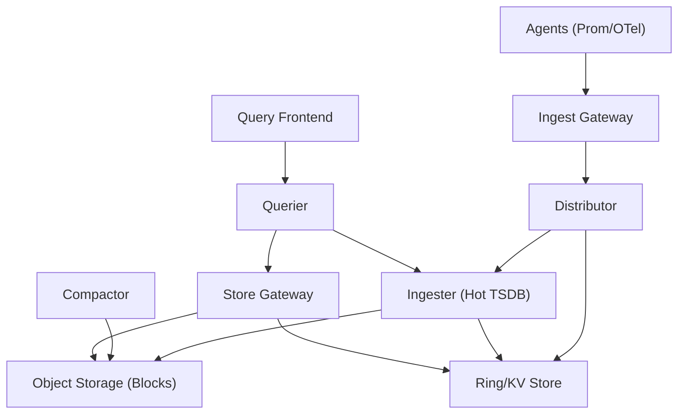
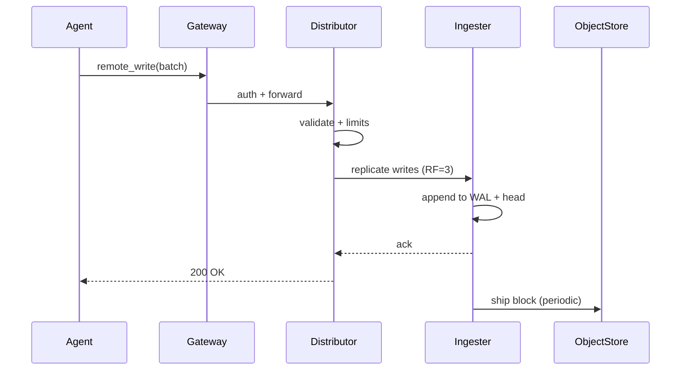

## Overview

A high-cardinality metrics pipeline (Prometheus/Cortex/Mimir-like) must ingest millions of time series while supporting low-latency queries over both “hot” recent data and years of “cold” historical data. The core challenge is that metrics cardinality can grow explosively (e.g., labels like `user_id`, `pod_uid`, `trace_id`), causing unbounded memory usage, index bloat, query fanout, and unpredictable costs.

The key insight is to split responsibilities across a horizontally scalable ingest path and a query path, backed by an immutable block store in cheap object storage. Hot data lives in memory/SSD-optimized ingesters with replication + WAL; cold data is compacted into time-partitioned blocks with an index that supports label-based lookups. Cardinality is controlled with hard limits, adaptive protection mechanisms, and “make the blast radius small” multi-tenancy.

This design targets production realities: noisy neighbors, partial outages (object store, nodes, AZs), query storms, and operational needs like per-tenant limits, rollouts, and observability of the observability system.

## Requirements

### Functional Requirements
- Ingest metrics via Prometheus `remote_write` and OpenTelemetry Collector (OTLP → remote_write translation).
- Query metrics using PromQL-compatible APIs (range queries, instant queries, label APIs).
- Provide multi-tenant isolation (authn/z, per-tenant limits, per-tenant retention).
- Support long-term storage (e.g., 13 months) with compaction and deletion.
- Deduplicate HA replicas (two scrapers sending the same targets) at query time.
- Support recording rules and alerting rules evaluation at scale.
- Provide cardinality visibility (top-N series/label contributors) and enforcement (reject/drop/roll up).
- Enable administrative operations: backfills (limited), deletes (tombstones), and tenant lifecycle.

### Non-Functional Requirements
- **Scale**: 50k tenants, 2M active targets, 200M active series fleet-wide, 20M samples/sec sustained ingest, peaks to 40M/s.
- **Latency**:
  - Ingest acknowledgment: P50 50ms, P99 250ms (excluding client batching).
  - Instant query (last 2h): P50 200ms, P99 2s.
  - Range query (7d, 15s step): P50 1.5s, P99 8s (with query splitting/caching).
- **Availability**: 99.95% for ingest/query APIs; 99.9% for historical queries during object-store incidents.
- **Consistency**:
  - **Write path**: at-least-once ingestion; eventual consistency for recently ingested samples across replicas.
  - **Read path**: strong within a single ingester’s head; eventual across the distributed system during failures; query-time dedup for HA.
- **Durability**:
  - RPO: 0 for “acknowledged” samples within an AZ (WAL + replication), ≤5 minutes cross-AZ.
  - RTO: 30 minutes for full region restoration (object store replicated).

### Constraints & Assumptions
- Metrics volume is dominated by infrastructure/app telemetry; write traffic is bursty and tenant-skewed.
- Team size ~6–10 engineers; prefer managed dependencies (object storage, managed KV) where possible.
- No PII in labels; enforce this via policy and validation. (If compliance required: encrypt at rest + audit logs.)
- Clients batch and compress writes (snappy/protobuf); ingestion is at-least-once (retries happen).
- Storage budget favors object storage over large always-on SSD fleets; compute scales elastically.

## High-Level Architecture

The architecture separates hot ingestion from long-term persistence using an append-heavy, in-memory TSDB for recent data and immutable, time-partitioned blocks in object storage for historical data. This matches real-world access patterns: most queries hit recent time ranges, while long retention must be cost-efficient.

A consistent-hash “ring” (in a KV store) assigns series to ingesters, enabling horizontal scaling and bounded per-node state. The query path fans out to ingesters (hot) and store gateways (cold), while a query frontend provides protection (caching, splitting, queueing) and predictable multi-tenant fairness.

## Component Deep-Dive

### Ingest Gateway
**Responsibility**: Authenticate tenants, terminate TLS, apply global rate limiting, and route to distributors.

**Key Design Decisions**:
- Enforce tenant identity at the edge (mTLS/JWT/API keys) to keep internal services simple.
- Apply coarse load shedding early (429/503) to protect core ingest from storms.

**Technology Choice**: Envoy or NGINX + external auth; optional dedicated gateway service for multi-tenant auth.

**Scaling Strategy**: Stateless; autoscale on CPU (TLS) and RPS; global rate limits via Redis/Envoy global RL if needed.

### Distributor
**Responsibility**: Validate samples, enforce per-tenant limits, shard series to ingesters, replicate writes, and provide fast failure on overload.

**Key Design Decisions**:
- Use consistent hashing on `(tenant_id, series_fingerprint)` for stable placement and minimal reshuffling.
- Replicate to `RF=3` ingesters (ideally across AZs) to tolerate node/AZ loss without losing acknowledged data.

**Technology Choice**: Cortex/Mimir-style distributor; gRPC to ingesters; ring stored in Consul/etcd (or DynamoDB/Cloud KV).

**Scaling Strategy**: Stateless; scale by adding distributors; ingestion concurrency bounded per tenant (token buckets) and globally (admission control).

**Cardinality Controls (core here)**:
- Hard limits: max label names/values length, max labels per series, max active series per tenant, max new series/sec.
- Policy: reject series matching forbidden label keys (`user_id`, `email`, `trace_id`) unless explicitly allowlisted.
- “New series shedding”: under memory pressure, reject *new* series first to stabilize existing SLOs.

### Ingester (Hot TSDB)
**Responsibility**: Accept replicated writes, store recent samples in a TSDB “head,” persist via WAL, and periodically ship compacted blocks to object storage.

**Key Design Decisions**:
- WAL + periodic checkpoints for fast recovery and near-zero data loss for acknowledged writes.
- Store head in memory with chunk encoding; cut blocks (e.g., 2h) and upload immutable blocks.

**Technology Choice**: Prometheus TSDB library or equivalent; local SSD for WAL; object store uploader.

**Scaling Strategy**:
- Horizontal via ring sharding; each ingester owns a subset of series.
- Capacity planning based on active series (memory) and sample rate (CPU).
- Stateful rollouts: zone-aware replication + “handoff”/transfer or controlled ring leaving.

### Store Gateway (Historical Read Path)
**Responsibility**: Serve reads from object storage blocks efficiently by caching indexes and selectively fetching chunks.

**Key Design Decisions**:
- Cache block index + postings lists (label → series IDs) to avoid repeated object-store reads.
- Use “time partition + series postings” to limit scanned data for a query.

**Technology Choice**: Thanos/Cortex store-gateway pattern; local disk cache + in-memory index cache; object store (S3/GCS/Azure Blob).

**Scaling Strategy**: Scale horizontally; shard by block ranges or hash of block IDs; cache warmup and eviction based on query popularity.

### Query Frontend + Querier
**Responsibility**: Provide PromQL API, enforce query fairness, split queries, cache results, and fan out to ingesters/store gateways.

**Key Design Decisions**:
- Split large range queries by time (e.g., 24h chunks) and parallelize; merge results deterministically.
- Multi-tenant fairness: per-tenant queues + max concurrency to stop noisy neighbor query storms.

**Technology Choice**: Query-frontend + query-scheduler + querier (Cortex/Mimir model); Redis/Memcached for result cache; optional “chunks cache.”

**Scaling Strategy**: Stateless; scale with query volume; cache hit rate is a primary lever for cost and latency.

### Compactor
**Responsibility**: Continuously compact small blocks into larger ones, apply retention, and manage tombstones (deletes).

**Key Design Decisions**:
- Compaction is a single-writer per tenant (or per shard) to avoid conflicting block mutations.
- Retention and deletion are enforced in the block store layer (tombstones) with periodic rewrite.

**Technology Choice**: Cortex/Thanos compactor; object store + KV for block metadata coordination.

**Scaling Strategy**: Parallelize by tenant/shard; separate compute pool; monitor backlog (blocks pending compaction).

## Data Model

### Storage Schema

**Ingestion (hot, per ingester)**
- **Series**: `fingerprint` → label set (interned)
- **Head chunks**: compressed samples (e.g., XOR + varint), chunk duration ~2h or by size
- **WAL**: append-only records of samples + series

**Long-term (object storage, per tenant prefix)**
- `/<tenant>/blocks/<ulid>/meta.json`
  - `minTime`, `maxTime`, `stats` (numSeries/numSamples), `compaction` level, `thanos`/source metadata
- `/<tenant>/blocks/<ulid>/index`
  - postings lists for label pairs, series entries mapping to chunk references
- `/<tenant>/blocks/<ulid>/chunks/<segment>`
  - chunk data segments
- `/<tenant>/blocks/<ulid>/tombstones`
  - delete intervals/selectors

**Metadata/Ring (KV store)**
- `ring/ingesters/<ingester_id>`: tokens, zone, heartbeat
- `limits/<tenant>`: max_series, max_ingest_rate, retention, label policies
- `blocks/<tenant>/<ulid>`: block presence/state (optional optimization)

### Data Flow

Key operations:
- **Write**: validated at distributor, replicated to multiple ingesters, acknowledged after WAL append (and optionally after quorum acks).
- **Query**: querier fetches recent data from ingesters and historical data via store gateways; deduplicates HA replicas using external labels (`replica`) and merges results.

## API Design

### Ingestion APIs

**POST `/api/v1/push`** (Prometheus remote_write compatible)
- **Headers**: `X-Scope-OrgID: <tenant>` (or JWT claim), `Content-Encoding: snappy`
- **Body**: `remote_write.WriteRequest` (protobuf, snappy-compressed)
- **Responses**:
  - `200 OK`: accepted
  - `400 Bad Request`: invalid protobuf/labels/timestamps
  - `401/403`: authz failure
  - `429 Too Many Requests`: tenant limits (ingest rate, new series rate, active series)
  - `503 Service Unavailable`: overload / ring unhealthy

**Idempotency**
- Clients retry; duplicates are acceptable (at-least-once). The ingester de-duplicates samples by `(series, timestamp)` within a short window.
- HA pairs are deduplicated at query time using replica labels; do not attempt global exactly-once.

### Query APIs (Prometheus-compatible)

**GET `/api/v1/query`**
- Params: `query=<promql>`, `time=<rfc3339|unix>`
- Returns: vector/matrix/scalar result; errors include `bad_data`, `execution`, `timeout`.

**GET `/api/v1/query_range`**
- Params: `query`, `start`, `end`, `step`, optional `timeout`
- Query frontend may split internally; response is merged.

**GET `/api/v1/series`**
- Params: `match[]=...`, `start`, `end`
- Used heavily by UIs; enforce strict limits to prevent cardinality blowups.

**GET `/api/v1/labels`**, **GET `/api/v1/label/{name}/values`**
- Require time bounds; apply max result size and caching.

**Error Handling Approach**
- Structured JSON with `status`, `errorType`, `error`, and optional `warnings`.
- Propagate `429` for fairness; support `Retry-After`.
- Enforce per-tenant query timeouts and max bytes scanned.

### Rules APIs (optional but common)
**POST `/api/v1/rules`** (tenant-scoped)
- Store rule groups in a config store; ruler evaluates periodically and remote_writes results back into the system.

## Scaling & Performance

### Bottleneck Analysis
- **Active series memory** (ingesters): each new series adds label set + head chunk state.
  - Mitigate with hard per-tenant series limits, aggressive label validation, and capacity-based admission control.
- **Query fanout**: PromQL requires scanning many series; high-cardinality selectors (`{pod=~".*"}`) explode.
  - Mitigate with query splitting, caching, max series/bytes limits, and promoting recording rules.
- **Object store latency/cost**: repeated index/chunk fetches degrade P99.
  - Mitigate with store-gateway index cache + chunks cache; compact blocks to reduce seeks.

### Horizontal Scaling
- **Gateway/Distributor/Querier/Frontend**: scale statelessly by replicas behind L7 LB.
- **Ingester**: scale by adding nodes and rebalancing ring tokens; use zone-aware replication and controlled rollout.
- **Store Gateway**: scale by sharding blocks and increasing cache capacity.
- **Partitioning strategy**:
  - Primary: hash partition on series fingerprint across ingesters.
  - Secondary (for block store): tenant prefix + time-partitioned blocks; optional “tenant sharding” for very large tenants (split tenant into N shards for compaction/query).

### Caching Strategy
- **Query result cache** (frontend): cache range query sub-results keyed by `(tenant, query, start, end, step)` with TTL (e.g., 5–30 minutes) and invalidation via “recent data window” bypass.
- **Index/postings cache** (store gateway): long TTL (hours) with LRU; warmed by popular queries.
- **Chunks cache**: optional Redis/Memcached for hot chunks; TTL aligned to block immutability.
- **Invalidation**: immutable blocks make caching easy; only “head” (recent) data is non-cacheable or cached with very short TTL.

## Trade-offs & Alternatives

### Key Trade-offs Made
- **Object storage + immutable blocks**
  - Chosen: cheapest durable long-term storage and simple caching semantics.
  - Sacrificed: higher read latency than local disks; requires store gateways and caching.
- **At-least-once ingestion**
  - Chosen: simpler, robust under retries and partial failures.
  - Sacrificed: potential duplicate samples; requires dedup logic and tolerating minor anomalies.
- **Strict cardinality enforcement**
  - Chosen: protects shared platform and keeps costs predictable.
  - Sacrificed: some teams may lose “debuggability” if they relied on high-card labels; requires education and better exemplars/logs/traces linkage.

### Alternative Approaches
- **Single-node Prometheus + remote storage**
  - Not chosen: cannot handle multi-tenant scale or cardinality explosions; HA and retention become painful.
- **Columnar OLAP (e.g., ClickHouse) for metrics**
  - Not chosen for primary: great for analytics, but PromQL semantics and high-ingest update patterns complicate storage; can be an adjunct for long-range, heavy aggregations.
- **Kafka-first ingestion pipeline**
  - Not chosen as default: adds operational overhead and latency; useful when needing replay/backfill or multiple downstream consumers, but not required for a Cortex-style system.

## Failure Modes & Mitigations

### Failure Scenarios
- **Scenario**: Ingester node crash
  - **Impact**: temporary write replication reduction; possible data loss if WAL not synced and RF quorum not met.
  - **Detection**: ring heartbeats missing; elevated distributor error rates.
  - **Mitigation**: RF=3 across AZs; WAL fsync before ack; auto-repair ring; controlled rollout with “leave” and handoff.
- **Scenario**: KV/ring store outage
  - **Impact**: placement/routing instability; inability to join/leave ring; degraded ingest.
  - **Detection**: distributor/ingester KV errors; ring convergence alerts.
  - **Mitigation**: highly available etcd/Consul; cached ring state with TTL; freeze ring changes during outage.
- **Scenario**: Object store partial outage / increased latency
  - **Impact**: historical queries slow/fail; compaction/shipping backlog grows.
  - **Detection**: store-gateway error rates, latency, 5xx from object store.
  - **Mitigation**: serve recent data from ingesters; aggressive caching; retries with jitter; circuit breakers; multi-region replication for DR.
- **Scenario**: Cardinality explosion (bad deploy adds `pod_uid` label)
  - **Impact**: ingester OOM, query storms, cost spike.
  - **Detection**: spike in `new_series/sec`, `active_series`, top labels report; increased 429s.
  - **Mitigation**: label allow/deny lists; max new series rate; automatic “reject new series” mode; tenant quarantine; rapid rollback playbook.
- **Scenario**: Query storm (dashboard loops, wide selectors)
  - **Impact**: querier saturation, cache churn, tail latency spikes for all tenants.
  - **Detection**: queue depth, per-tenant concurrency, elevated timeouts.
  - **Mitigation**: query frontend fairness + limits; enforce time bounds; caching; require recording rules for expensive dashboards.

### Disaster Recovery
- **RTO/RPO**: RTO 30 minutes, RPO ≤5 minutes cross-region (0 within region for acked data when RF quorum holds).
- **Backup strategy**: object store versioning + lifecycle; periodic metadata backups (rules/limits config); snapshots of KV store.
- **Failover procedures**: warm standby in second region; replicate object store (CRR); restore KV/ring and bring up gateways/distributors/queriers; gradually allow writes per tenant.

## Operational Considerations

### Monitoring & Alerting
- **Ingest**: samples/sec, failed samples, 429 rate, WAL fsync latency, replication quorum failures.
- **Cardinality**: active series per tenant, new series/sec, top label keys/values by series count, rejected series reasons.
- **Query**: P50/P99 latency, queue depth, split/merge time, cache hit rate, bytes scanned, timeouts.
- **Storage**: block upload lag, compaction backlog, object store 5xx/latency, cache eviction rates.
- **Alerts (examples)**:
  - `P99 ingest latency > 500ms for 5m`
  - `active_series tenant > 90% of limit`
  - `compaction backlog > 6h`
  - `object store 5xx > 1% for 10m`

### Deployment Strategy
- Rolling deploy stateless services (gateway/distributor/query-frontend/querier) with canaries and auto-rollback on SLO burn.
- Stateful ingesters: zone-by-zone rollout; remove from ring, drain, deploy, rejoin; enforce max unavailable to preserve RF quorum.
- Store gateways/compactors: canary with read-only validation; watch cache and object store error rates.
- Schema/block format changes: versioned readers; dual-write only when unavoidable; migration via compactor rewrite.

## References & Further Reading
- Prometheus TSDB design docs: https://prometheus.io/docs/prometheus/latest/storage/
- Cortex/Mimir architecture (multi-tenant Prometheus): https://grafana.com/docs/mimir/latest/
- Thanos (object store + store-gateway/query): https://thanos.io/
- “Monarch: Google’s Planet-Scale In-Memory Time Series Database” (high-level concepts): https://research.google/pubs/pub50652/
- VictoriaMetrics (high-performance TSDB trade-offs): https://victoriametrics.com/
- OpenTelemetry Collector + metrics pipelines: https://opentelemetry.io/docs/collector/