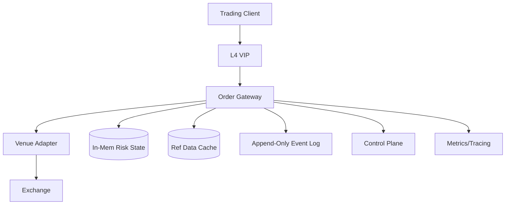
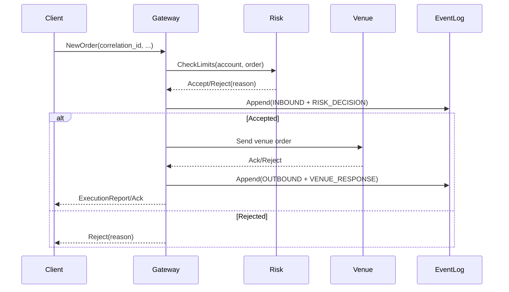

## Overview

A high-frequency trading (HFT) order entry gateway sits on the critical path between trading clients and exchange matching engines. The challenge is delivering *microsecond-level* and *predictable* latency while still enforcing strict pre-trade risk controls (credit, positions, fat-finger limits) and producing an auditable trail suitable for compliance and post-trade reconstruction. Unlike typical web backends, “average latency” is not enough—tail latency, jitter, and non-determinism (locks, GC, page faults, context switches) directly translate into lost trades and unintended risk.

The key insight is to split the system into a **deterministic fast path** and a **non-blocking slow path**. The fast path performs session handling, risk checks, and exchange routing entirely in-process with preallocated memory, CPU pinning, and lock-free structures—never waiting on disks, networks, or centralized services. The slow path asynchronously persists an immutable event log, exports drop-copy/audit streams, and drives monitoring and control-plane operations without affecting the trading critical path.

## Requirements

### Functional Requirements
- Accept order entry over low-latency protocols (FIX over TCP and/or a binary protocol) with per-session authentication and heartbeats.
- Perform **pre-trade risk checks** per order (credit/Notional, quantity, price collars, position limits, order rate limits, max open orders).
- Provide deterministic order handling: strict per-session sequencing and defined priority under load (e.g., cancels > new orders).
- Route orders to one or more exchanges/venues with venue-specific adapters (FIX/OUCH/binary) and deterministic mapping.
- Support order lifecycle operations: new, cancel, replace/modify, and status/query.
- Emit **drop copy** and an immutable audit trail of all inbound/outbound messages and risk decisions.
- Provide administrative APIs for limits, session keys, kill-switch, and trading halts.
- Expose operational telemetry (latency histograms, reject reasons, disconnects) and health endpoints.

### Non-Functional Requirements
- **Scale**:
  - 1,000–5,000 concurrent client sessions per colo
  - Burst: 500k msgs/sec (new/cancel/replace), sustained 100k msgs/sec
  - Peak accepted orders: 50k orders/sec to venues per colo
  - Reference data: 50k–500k instruments; risk state for 10k–100k accounts
- **Latency** (gateway internal, *first byte received → first byte written to venue socket*, excluding WAN):
  - P50: ≤ 3 µs
  - P99: ≤ 15 µs
  - P99.9: ≤ 30 µs under configured peak load
- **Availability**:
  - 99.99% during trading hours (maintenance outside market hours)
  - Graceful degradation: reject safely rather than queue unbounded
- **Consistency**:
  - Strong, linearizable per-account risk state within a gateway shard
  - Eventual for analytics, dashboards, and historical reporting
- **Durability**:
  - RPO = 0 for accepted orders and risk decisions (must be reconstructable from replicated event log)
  - May allow transient loss of *derived* metrics (e.g., Prometheus samples)

### Constraints & Assumptions
- Colocated deployment in exchange data centers; L2/L3 latency dominates beyond the gateway.
- Small team (5–10 engineers), strong C++/Rust/Java low-latency expertise; operational maturity required.
- Compliance: maintain tamper-evident audit trail and time synchronization (MiFID II / SEC 613-like expectations depending on region).
- Network access to external SaaS may be restricted; assume on-prem/colo-friendly components.
- Budget supports specialized hardware (low-latency NICs, PTP Grandmaster, optional FPGA) but prefers software-first.

## High-Level Architecture

The **Order Gateway** is a single-process, multi-core, event-driven system where each core runs an isolated “engine” responsible for a shard of sessions/accounts. This shard-locality is what enables deterministic behavior: orders for an account are processed by a single writer thread, eliminating locks and cross-core contention. The **Venue Adapter** is kept thin and deterministic, translating internal order intents into venue-specific wire formats and maintaining per-venue session state.

All persistence and external integrations are pushed off the fast path. The gateway emits an **append-only event log** (replicated) and an optional **drop-copy stream**. Control-plane actions (limit updates, session provisioning, kill-switch) are delivered into the gateway via a low-rate, authenticated channel and applied in a deterministic order, typically at shard boundaries.

## Component Deep-Dive

### Order Gateway (Fast Path Engine)

**Responsibility**: Deterministic parsing, sequencing, risk evaluation, and routing decisions with microsecond latency.

**Key Design Decisions**:
- **Single-writer per shard** (accounts/sessions) to avoid locks and guarantee deterministic ordering.
- **Preallocation and bounded resources** (object pools, fixed-size ring buffers) to eliminate allocator jitter and backpressure safely.

**Technology Choice**:
- C++ (with custom allocators) or Rust (no GC, explicit memory control). Java only if using a no-GC approach (e.g., Aeron/Chronicle + careful allocation discipline) and proven jitter bounds.

**Scaling Strategy**:
- Scale up within a host using core pinning (1 shard/core).
- Scale out by sharding accounts across gateway instances via consistent hashing and session affinity at L4.

---

### Risk Engine (Inline Pre-Trade)

**Responsibility**: Enforce credit/position/order limits and provide deterministic reject reasons.

**Key Design Decisions**:
- **Risk state is local** to the shard and updated synchronously with order acceptance/reject to avoid distributed coordination on the fast path.
- **Two-tier limits**: static configuration (per account/instrument) + dynamic consumption (positions, open orders, notional).

**Technology Choice**:
- In-memory structs with cache-line alignment; optional SIMD for hot checks (e.g., price collar).
- Persisted configuration in Postgres (or similar) loaded into memory and applied via control-plane updates.

**Scaling Strategy**:
- Partition risk state by account to match gateway sharding.
- For very large accounts or cross-venue netting, compute net exposure asynchronously but enforce conservative real-time limits inline.

---

### Venue Adapter (Exchange Connectivity)

**Responsibility**: Maintain exchange sessions, encode/decode venue protocols, handle acks/rejects/fills, and apply venue-specific constraints.

**Key Design Decisions**:
- **Per-venue session per core** to avoid cross-thread synchronization; use message passing from gateway shard to venue shard only if required.
- **Deterministic retry/timeout policies** with explicit state machines; no blocking I/O.

**Technology Choice**:
- Kernel-bypass networking where feasible (Solarflare/Exablaze + Onload, DPDK, AF_XDP), otherwise tuned epoll with busy-polling.
- Protocol support: FIX (order entry), OUCH (Nasdaq-style), or venue-native binary.

**Scaling Strategy**:
- Multiple adapters per venue (session fan-out) to increase throughput.
- Separate “cancel lane” to prioritize cancels during congestion (venue permitting).

---

### Append-Only Event Log (Audit & Replay)

**Responsibility**: Immutable capture of inbound messages, risk decisions, outbound venue messages, and venue responses for audit and replay.

**Key Design Decisions**:
- **Asynchronous commit** from the fast path using lock-free SPSC queues; the gateway never waits for disk/network ACK to make a risk decision.
- **Replicated log** across at least two hosts in the same colo (and optionally a remote DR site) to achieve RPO=0 for accepted orders.

**Technology Choice**:
- Low-latency log: Chronicle Queue / Aeron Archive / custom mmap’d segment log.
- For broader ecosystem integration: Kafka as a *downstream* consumer, not necessarily the primary fast-path log.

**Scaling Strategy**:
- Partition by shard/instance; include monotonic sequence numbers for reconstruction.
- Compress and batch off the critical path; write amplification controlled by segment sizing.

---

### Control Plane (Limits, Sessions, Kill Switch)

**Responsibility**: AuthN/AuthZ, configuration distribution, operational commands, and safe rollout of limit/session changes.

**Key Design Decisions**:
- **Out-of-band** from trading traffic; control messages are low volume and applied deterministically (versioned config).
- **Fail-closed** semantics: if config is invalid/unknown, gateway rejects orders rather than trading with stale/unsafe limits.

**Technology Choice**:
- gRPC + mTLS for admin API; Postgres for source-of-truth config; signed config snapshots.
- Optional consensus (etcd) for leader election and config versioning, kept off the fast path.

**Scaling Strategy**:
- Horizontally scalable stateless API service; gateways subscribe to updates and apply per shard.

## Data Model

### Storage Schema

**Reference/config DB (authoritative, not on fast path)**

- `accounts`
  - `account_id (PK)`
  - `status` (ACTIVE/SUSPENDED)
  - `base_currency`
  - `created_at`, `updated_at`
- `sessions`
  - `session_id (PK)`
  - `account_id (FK)`
  - `protocol` (FIX/BINARY)
  - `api_key_id`
  - `source_ip_cidr`
  - `enabled`
- `risk_limits`
  - `account_id (PK)`
  - `max_notional`
  - `max_order_qty`
  - `max_open_orders`
  - `max_orders_per_sec`
  - `price_collar_bps`
  - `instrument_scope` (ALL / list reference)
  - `version`, `updated_at`
- `venues`
  - `venue_id (PK)`
  - `protocol`
  - `session_params` (json)
  - `enabled`

**Event log (append-only; schema-on-read)**

- `EventHeader`
  - `ts_hw` (NIC/PHC timestamp, if available)
  - `ts_mono` (monotonic)
  - `gateway_instance_id`, `shard_id`
  - `session_id`, `account_id`
  - `seq_in` (per session)
  - `correlation_id` (client-provided idempotency key)
  - `event_type` (INBOUND_ORDER / RISK_DECISION / OUTBOUND / VENUE_INBOUND / FILL)
- `EventPayload`
  - Raw bytes (original message) or normalized fields (symbol, side, qty, price, tif, venue)

### Data Flow

## API Design

### Trading API (Low-Latency)

**Protocol**: FIX 4.4 over TCP *or* a binary framed protocol over TCP/UDP (venue/client dependent). Prefer a binary protocol for lowest jitter; keep FIX for interoperability.

**Key messages**
- `Logon(session_id, credentials, seq)` → `LogonAck` / `Logout(reason)`
- `NewOrder(correlation_id, cl_ord_id, symbol, side, qty, price, tif, venue_hint?)`
- `Cancel(correlation_id, orig_cl_ord_id)` (priority lane under load)
- `Replace(correlation_id, orig_cl_ord_id, new_qty?, new_price?)`
- `ExecReport(order_id, status, filled_qty, leaves_qty, avg_px, reason?)`

**Error handling**
- Deterministic reject codes: `RISK_LIMIT_BREACH`, `INVALID_SYMBOL`, `SESSION_DISABLED`, `DUPLICATE_CORRELATION_ID`, `THROTTLED`.
- Transport errors: session reset triggers `SESSION_DOWN`; client must reconnect and resync.

**Idempotency**
- Require `correlation_id` (or `ClOrdID`) unique per session for a retention window.
- Gateway stores a bounded “recent ids” map per session (ring + hash) to return the prior result on duplicate.

### Admin/Control API (gRPC/REST over mTLS)

- `POST /v1/limits/{account_id}`: upsert limits (includes `version` for optimistic concurrency)
- `POST /v1/sessions/{session_id}/disable`: immediate disable (fail-closed)
- `POST /v1/kill-switch`: global or per-account trading halt
- `GET /v1/health`, `GET /v1/metrics`
- `GET /v1/latency`: last N seconds histograms (p50/p99/p999)

## Scaling & Performance

### Bottleneck Analysis
- **CPU cache misses / branch mispredicts** in parsing and risk checks → use fixed layouts, hot/cold splitting, and predictable branches.
- **Lock contention** and cross-core bouncing → single-writer shards, SPSC queues, avoid shared counters on the fast path.
- **Kernel/network jitter** → busy-polling, IRQ affinity, kernel bypass, NIC queue pinning.
- **Logging backpressure** → bounded queues with explicit policies (e.g., reject if audit queue is saturated).

### Horizontal Scaling
- **Client/session affinity**: L4 consistent hashing on 5-tuple or session id to keep a session on one gateway instance.
- **Sharding key**: `account_id` (or `session_id`) → shard/core → instance.
- **Venue throughput scaling**: multiple venue sessions (logically partitioned) and/or multiple gateway instances per venue.

### Caching Strategy
- **Reference data cache**: instruments, symbol maps, tick sizes loaded at startup; updated via snapshots + incremental deltas.
- **Risk config cache**: per-account limits in memory, versioned updates; apply atomically per shard.
- **Idempotency cache**: per-session bounded cache for recent `correlation_id` results (TTL + ring eviction).
- **Cache invalidation**: control-plane pushes versioned updates; gateway rejects orders if config version is missing or inconsistent.

## Trade-offs & Alternatives

### Key Trade-offs Made
- **Inline risk state (chosen)** vs centralized risk service: sacrifices centralized simplicity for microsecond determinism and avoids network hops.
- **Asynchronous audit commit (chosen)** vs synchronous persistence: sacrifices immediate durability acknowledgment to keep latency/jitter bounded; mitigated with replicated in-colo logging and fail-closed backpressure.
- **Kernel bypass (optional)** vs standard TCP stack: increases complexity and operational burden but reduces jitter and tail latency significantly.

### Alternative Approaches
- **FPGA-based gateway/risk**: even lower latency and jitter, but high development cost, slower iteration, and harder observability.
- **Centralized risk + stateless gateways**: simpler operations and consistency across gateways, but adds network latency and tail risk (p99 spikes).
- **Kafka as primary audit log**: great ecosystem integration, but typically higher tail latency and less predictable; better as downstream sink.

## Failure Modes & Mitigations

### Failure Scenarios
- **Scenario**: Venue session disconnect
  - **Impact**: Orders cannot be routed; potential stuck open orders if cancels can’t be sent
  - **Detection**: Heartbeat timeouts, TCP reset, venue logout codes
  - **Mitigation**: Auto-reconnect with deterministic backoff; switch to secondary session; activate “cancel-on-disconnect” policy if supported; client notification
- **Scenario**: Risk state divergence (bug or config mismatch)
  - **Impact**: Incorrect rejects or unsafe trading
  - **Detection**: Continuous invariants (e.g., non-negative leaves/open orders), config version checks, replay-based validation
  - **Mitigation**: Fail-closed on invariant breach; shard quarantine; rapid rollback; replay from event log to rebuild state
- **Scenario**: Audit/log pipeline saturation
  - **Impact**: Loss of compliance trail if continued
  - **Detection**: Queue depth thresholds, dropped-event counters
  - **Mitigation**: Reject new orders when audit queue exceeds threshold; continue cancels; shed non-critical telemetry first
- **Scenario**: Clock drift / timestamp integrity loss
  - **Impact**: Invalid sequencing/audit timestamps; regulatory exposure
  - **Detection**: PTP offset alarms, NIC PHC drift metrics
  - **Mitigation**: PTP Grandmaster redundancy; holdover mode; mark events with clock-quality; fail-closed if beyond threshold
- **Scenario**: Host performance regression (GC/allocator/page faults)
  - **Impact**: Tail latency spikes, missed opportunities
  - **Detection**: P99.9 alarms, perf counters (LLC misses), major fault counters
  - **Mitigation**: Hugepages, mlockall, CPU isolation, no-GC languages, warm-up, strict SLO-based canaries

### Disaster Recovery
- **Targets**:
  - RTO: 30–120 seconds (within same colo), 5–15 minutes (remote DR)
  - RPO: 0 for accepted orders (via replicated event log)
- **Backup strategy**:
  - Continuous replication of append-only log to a secondary host; periodic snapshots of config DB.
- **Failover procedures**:
  - In-colo hot standby warms ref data and config; on failover, clients reconnect to secondary VIP; replay recent event log segment to rebuild in-memory state; verify venue sessions before enabling trading.

## Operational Considerations

### Monitoring & Alerting
- **Key metrics**:
  - Latency histograms (P50/P99/P99.9) for: parse, risk, route, venue RTT
  - Reject counts by reason; throttle activations
  - Venue disconnects/reconnects; sequence gaps
  - Audit queue depth; dropped events (must be ~0)
  - PTP offsets; NIC/CPU temperature; CPU steal; LLC misses
- **Alert thresholds**:
  - P99.9 internal latency > 30 µs for 30s
  - Audit queue > 70% capacity
  - PTP offset > 100 µs (warn), > 500 µs (critical)
  - Venue session down > 1s during market hours

### Deployment Strategy
- **Safe rollout**:
  - Blue/green per instance; canary a small set of sessions; enforce warm-up period (cache, JIT if applicable) before admitting traffic.
  - Strict CPU pinning, NUMA binding, and config checks at startup; refuse to start if tuning prerequisites fail.
- **Rollback**:
  - Immediate traffic shift back to prior version via L4 weights; preserve config compatibility with versioned schemas; replay-based verification for incident triage.

## References & Further Reading
- Martin Thompson, “Low Latency Trading Systems” talks (Aeron / mechanical sympathy)
- LMAX Disruptor pattern (ring buffers, single-writer design)
- Aeron + SBE (Simple Binary Encoding) for low-latency messaging
- Linux low-latency tuning: CPU isolation, IRQ affinity, busy-polling, hugepages
- PTP (IEEE 1588) and NIC hardware timestamping (SO_TIMESTAMPING, PHC)
- Chronicle Queue/Chronicle Wire (append-only, low-latency persistence patterns)