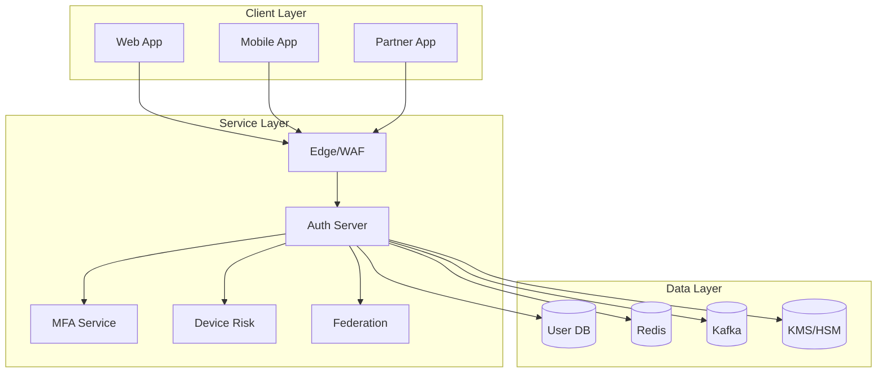
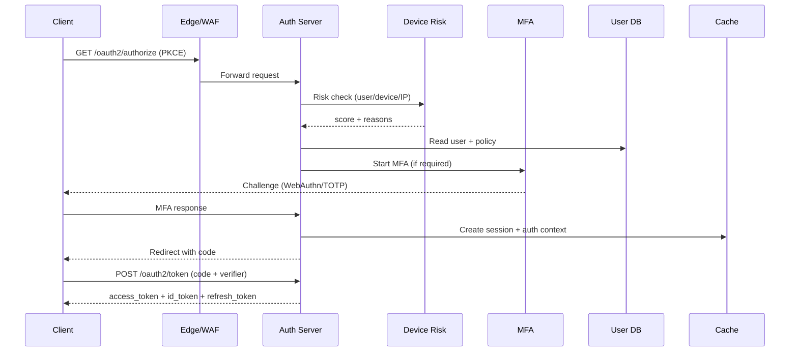

## Overview

A centralized Identity Provider (IdP) sits on the critical path of every user login and many machine-to-machine interactions. The problem is hard because it combines high-stakes security (credential theft, token replay, phishing), demanding availability (auth outages become full-site outages), and complex enterprise requirements (SSO federation, policy-driven MFA, auditing, and rapid revocation).

This design implements an OAuth 2.1 / OpenID Connect authorization server with strong session semantics, adaptive MFA, and device trust scoring. The key insight is to treat “authentication” as a policy decision over identity + session + device risk, while keeping “authorization tokens” short-lived and verifiable at the edge—so most requests don’t require an IdP round-trip, yet revocation and step-up remain enforceable.

## Requirements

### Functional Requirements
- Support OIDC SSO for browser and mobile: Authorization Code + PKCE, OIDC ID tokens, `/userinfo`.
- Support OAuth for service-to-service: Client Credentials and JWT-based client auth (mTLS/private_key_jwt).
- Provide MFA: WebAuthn/FIDO2, TOTP, backup codes, and optional SMS/voice (fallback), with step-up policies.
- Maintain device inventory and trust scoring from signals (new device, IP reputation, geo-velocity, jailbreak/root, risky ASN).
- Support session management: list sessions, revoke session(s), global logout, refresh-token rotation.
- Support federated identity: upstream OIDC and SAML 2.0 identity providers with account linking/JIT provisioning.
- Provide tenant/app administration: client registration, redirect URI management, scopes, consent, and policy rules.
- Provide complete audit trails: admin actions, auth events, token issuance, MFA challenges, revocations.

### Non-Functional Requirements
- **Scale**:
  - 10M MAU, 500K DAU
  - Peak interactive logins: 5K QPS (bursty)
  - Token refresh: 20K QPS
  - Introspection (only for select APIs): 5K QPS
  - Stored objects: ~10M users, ~30M devices, ~50M active sessions
- **Latency**:
  - `/oauth2/token` P99: 150ms (no MFA), 300ms (with MFA step-up excluding user time)
  - Authorization redirect/decision P99: 200ms server-side
  - JWKS fetch P99: 100ms (cached by clients/services)
- **Availability**: 99.99% for token endpoints and OIDC discovery/JWKS; 99.9% acceptable for admin console.
- **Consistency**:
  - Strong: credential changes, MFA enrollment/disablement, session revocation decisions.
  - Eventual: risk signals ingestion, analytics, reporting.
- **Durability**:
  - RPO: 0–5 minutes for user/credential/session state; no loss for audit logs (append-only).

### Constraints & Assumptions
- Multi-tenant (B2B) support with per-tenant policies and branding.
- Compliance baseline: SOC 2 controls, GDPR/CCPA data handling, encrypted secrets, audit retention.
- Services are behind a managed L7 edge (WAF/rate-limits) and run in at least 2 AZs per region.
- Network access between services supports mTLS; internal service identity via SPIFFE/SPIRE or service mesh.

## High-Level Architecture

The Edge/WAF absorbs abuse (credential stuffing, token endpoint floods) and routes traffic to stateless Auth Server instances. The Auth Server implements OAuth2/OIDC, sessions, token issuance, consent, and policy evaluation. MFA and Device Risk are separate services to keep auth flows lean while allowing independent scaling and model iteration.

State is split by access patterns: UserDB for durable identity/configuration, Redis for short-lived session artifacts and rate-limit counters, Kafka for immutable event streams (audit, security signals, revocation propagation), and KMS/HSM for signing and encryption keys. Federation isolates upstream IdP protocols (SAML/OIDC) and normalizes identity assertions into local users/sessions.

## Component Deep-Dive

### Auth Server (OAuth2/OIDC)
**Responsibility**: OAuth2/OIDC endpoints, session creation, policy evaluation, token issuance/rotation, revocation.

**Key Design Decisions**:
- Use Authorization Code + PKCE for all public clients; disallow Implicit flow to reduce token leakage.
- Issue short-lived access tokens (5–10 min) + refresh tokens with rotation and reuse detection to limit blast radius.

**Technology Choice**: Go/Java/Kotlin service with OIDC-certified libraries; Envoy/NGINX at edge; OpenPolicyAgent (OPA) or embedded policy engine.

**Scaling Strategy**: Stateless horizontally behind L7; shard session/refresh-token lookup via Redis cluster; protect DB with caching and write-behind for non-critical counters.

### Session & Token Service (logical within Auth)
**Responsibility**: Session records, refresh token rotation, token status, revocation fanout.

**Key Design Decisions**:
- Prefer JWT access tokens for most internal APIs (offline verification) while enabling *near-real-time revocation* via:
  - short TTL access tokens
  - session “revoked_at” timestamps
  - selective introspection at the gateway for high-risk endpoints
- Use refresh-token rotation with family tracking; on reuse, revoke the entire family and the associated session.

**Technology Choice**: Redis for active session indices + Postgres for durable session metadata (or DynamoDB/CockroachDB for global).

**Scaling Strategy**: Redis cluster with key hashing; partition by `tenant_id`; background compaction of expired session references.

### MFA Service
**Responsibility**: Enroll/verify MFA factors; generate challenges; WebAuthn ceremonies; backup codes; step-up orchestration support.

**Key Design Decisions**:
- WebAuthn/FIDO2 as the primary strong factor; TOTP as secondary; SMS only as fallback with strict risk gating.
- Store only verifier material: WebAuthn public keys + metadata; backup codes hashed (Argon2id/Bcrypt) and one-time.

**Technology Choice**: WebAuthn server library; Postgres tables for factors; Redis for pending challenges with TTL.

**Scaling Strategy**: Stateless API + Redis-backed challenge store; isolate external SMS providers behind a queue and circuit breakers.

### Device Risk (Trust Scoring)
**Responsibility**: Compute device/user/session risk score; maintain device profiles; ingest signals (IP reputation, impossible travel, device posture).

**Key Design Decisions**:
- Separate “signals ingestion” (async, high volume) from “decision API” (low latency, synchronous).
- Use explainable rules + ML scoring; return both score and reasons to drive policy and auditability.

**Technology Choice**: Stream processing (Kafka Streams/Flink) for signal aggregation; feature store (Redis/Scylla/Cassandra) for fast lookups.

**Scaling Strategy**: Partition streams by `user_id`/`device_id`; cache computed risk for short TTL (e.g., 1–5 minutes) to stabilize bursty logins.

### Federation Service
**Responsibility**: Integrate upstream enterprise IdPs (SAML/OIDC), map claims, JIT provisioning, account linking.

**Key Design Decisions**:
- Normalize external identities into a stable internal principal (`user_id`) with per-tenant identity bindings.
- Harden against assertion replay and misconfiguration: strict audience/issuer validation, clock-skew controls, signed logout if supported.

**Technology Choice**: Dedicated SAML/OIDC libraries; config stored in UserDB; per-tenant keys in KMS.

**Scaling Strategy**: Stateless; cache IdP metadata; rate-limit per tenant to avoid misconfigured redirect storms.

## Data Model

### Storage Schema

**users**
- `user_id` (UUID, PK)
- `tenant_id` (UUID, indexed)
- `email` (string, unique per tenant)
- `status` (active/locked/deleted)
- `password_hash` (nullable; Argon2id)
- `created_at`, `updated_at`
- `mfa_required` (bool)
- `last_login_at`

**clients**
- `client_id` (string, PK)
- `tenant_id` (UUID, indexed)
- `client_type` (public/confidential)
- `redirect_uris` (jsonb)
- `grant_types` (jsonb)
- `scopes` (jsonb)
- `token_endpoint_auth_method` (mtls/private_key_jwt/client_secret_basic)
- `jwks_uri` / `jwks` (jsonb)
- `created_at`, `updated_at`

**sessions**
- `session_id` (UUID, PK)
- `tenant_id` (UUID, indexed)
- `user_id` (UUID, indexed)
- `device_id` (UUID, indexed)
- `created_at`, `last_seen_at`
- `revoked_at` (nullable, indexed)
- `auth_level` (pwd, mfa, phishing_resistant)
- `ip_hash`, `ua_hash` (privacy-preserving)

**refresh_tokens**
- `token_id` (UUID, PK) *(store a hash of the presented token, not raw)*
- `session_id` (UUID, indexed)
- `tenant_id`, `user_id`
- `family_id` (UUID, indexed)
- `rotated_from` (UUID, nullable)
- `expires_at`, `revoked_at` (nullable)
- `created_at`

**devices**
- `device_id` (UUID, PK)
- `tenant_id` (UUID, indexed)
- `user_id` (UUID, indexed)
- `device_fingerprint_hash` (string, indexed)
- `platform` (ios/android/web/desktop)
- `trusted` (bool)
- `risk_score` (int)
- `first_seen_at`, `last_seen_at`

**mfa_factors**
- `factor_id` (UUID, PK)
- `tenant_id`, `user_id` (indexed)
- `type` (webauthn/totp/sms)
- `public_key` (webauthn, nullable)
- `totp_secret_enc` (nullable; envelope encrypted via KMS)
- `phone_enc` (nullable)
- `created_at`, `last_used_at`

**audit_events** (append-only)
- `event_id` (UUID, PK)
- `tenant_id`, `actor_user_id` (nullable), `target_user_id` (nullable)
- `type` (LOGIN_SUCCESS, TOKEN_ISSUED, MFA_ENROLLED, SESSION_REVOKED, ADMIN_POLICY_CHANGED, …)
- `ip`, `ua`, `metadata` (jsonb)
- `created_at` (indexed/partitioned by time)

### Data Flow

## API Design

**OIDC Discovery**
- `GET /.well-known/openid-configuration`
  - Returns issuer, endpoints, supported scopes/grants, `jwks_uri`.

**Authorization**
- `GET /oauth2/authorize?response_type=code&client_id=...&redirect_uri=...&scope=openid%20profile&state=...&code_challenge=...&code_challenge_method=S256&nonce=...`
  - Errors: `invalid_request`, `unauthorized_client`, `access_denied`.
  - Idempotency: `state` used to bind browser session; store auth request in Redis with TTL.

**Token**
- `POST /oauth2/token`
  - `grant_type=authorization_code` (with PKCE) or `refresh_token` or `client_credentials`
  - Response:
    - `access_token` (JWT), `expires_in`
    - `id_token` (OIDC)
    - `refresh_token` (rotating, opaque)
    - `token_type=bearer`
  - Error handling: RFC 6749/6750 errors; include `error_description` only for safe, non-sensitive cases.
  - Idempotency: accept `Idempotency-Key` for retried token requests; enforce single-use auth codes; refresh rotation is atomic.

**Revocation**
- `POST /oauth2/revoke` (RFC 7009)
  - Revokes refresh token (and associated family/session) or access token (best-effort if JWT; authoritative if opaque/introspected).

**Introspection (for select APIs/gateways)**
- `POST /oauth2/introspect`
  - Response: `{ "active": true, "sub": "...", "scope": "...", "exp": 123, "sid": "..." }`
  - Rate-limited and authenticated (confidential clients only); never exposed to browsers.

**UserInfo**
- `GET /userinfo` with bearer access token
  - Returns claims based on scopes and tenant policy.

**Session Management (first-party/admin)**
- `GET /v1/sessions?user_id=...`
- `POST /v1/sessions/{session_id}/revoke`
- `POST /v1/users/{user_id}/revoke_all_sessions`
  - Idempotency: `request_id` stored in Redis/DB to dedupe repeated revocations.
  - On success, publishes `SESSION_REVOKED` event to Kafka for propagation.

**MFA**
- `POST /v1/mfa/challenge` → `{ challenge_id, type, expires_at }`
- `POST /v1/mfa/verify` with `{ challenge_id, response }` → `{ success, auth_level }`

## Scaling & Performance

### Bottleneck Analysis
- **Password/MFA verification hot path**: CPU-bound crypto (Argon2, WebAuthn). Mitigate with autoscaling on CPU, isolate crypto pool, and use strong rate limits.
- **DB contention on sessions/refresh tokens**: Mitigate by keeping high-churn indices in Redis and writing durable session metadata asynchronously where safe.
- **KMS/HSM latency**: Avoid per-request signing key fetch; cache active signing keys in memory; only KMS on rotation/unseal.
- **Credential stuffing/DDoS**: WAF + per-tenant/per-IP/per-user rate limits; bot detection; progressive challenges (CAPTCHA) before password entry.

### Horizontal Scaling
- **Edge/WAF**: scale via managed global anycast + regional L7; enforce quotas per tenant/client.
- **Auth Server**: stateless pods/instances; sticky sessions not required (store auth request/session in Redis).
- **Redis**: cluster mode; partition keys by `tenant_id:user_id` to spread load; replica for reads.
- **User DB**: start with Postgres HA + read replicas; for global active-active, consider CockroachDB/Spanner; partition large audit tables by time/tenant.
- **Kafka**: partition by `tenant_id` and event type; compacted topics for “latest revocation watermark” per user/session.

### Caching Strategy
- **JWKS**: clients/services cache keys (e.g., 15–60 min) and respect `kid`; rotate with overlap to avoid outages.
- **Session/auth context**: Redis stores `sid -> {user_id, auth_level, revoked_at}` with TTL matching refresh lifetime.
- **Risk score**: cache computed risk decision for 60–300s to reduce repeated evaluations during login retries.
- **Policy/config**: cache tenant policy and client config with short TTL (30–120s) + explicit invalidation on admin change events.

## Trade-offs & Alternatives

### Key Trade-offs Made
- **JWT access tokens (default)**
  - Chosen: low latency, no IdP dependency on every API call.
  - Sacrificed: perfect immediate revocation for access tokens.
  - Why acceptable: short TTL + session-level revocation + selective introspection for sensitive endpoints balances security and availability.
- **Refresh token rotation + reuse detection**
  - Chosen: strong protection against stolen refresh tokens.
  - Sacrificed: more state and complexity (token families, atomic rotation).
  - Why acceptable: refresh tokens are the highest-value theft target in modern apps; this materially reduces long-lived compromise.
- **Separate risk engine**
  - Chosen: independent scaling/modeling and clearer operational boundaries.
  - Sacrificed: extra network hop and more moving parts.
  - Why acceptable: risk logic evolves frequently; decoupling reduces blast radius and improves iteration speed.

### Alternative Approaches
- **Opaque access tokens + mandatory introspection for all APIs**
  - Pros: immediate revocation and centralized control.
  - Cons: IdP becomes a hard dependency for all traffic; higher cost and outage blast radius.
- **Pure stateless sessions (no server-side session store)**
  - Pros: simplicity and horizontal scale.
  - Cons: poor revocation/step-up ergonomics; weaker anomaly detection; limited audit fidelity.
- **Single monolith for auth + MFA + risk**
  - Pros: fewer services, simpler deployment.
  - Cons: harder scaling isolation and slower iteration; risk engine and MFA integrations increase coupling.

## Failure Modes & Mitigations

### Failure Scenarios
- **Scenario**: User DB unavailable
  - **Impact**: logins/token issuance degraded or down; existing JWTs still work until expiry.
  - **Detection**: elevated DB errors, token issuance latency, failing health checks.
  - **Mitigation**: fail closed for new logins; keep JWKS/discovery up; use read replicas/failover; cache client config/policy; run in multi-AZ.
- **Scenario**: Redis outage
  - **Impact**: session creation/rotation and rate-limits impaired; potential security risk if rate limiting fails.
  - **Detection**: Redis timeouts, increased auth errors.
  - **Mitigation**: degrade to DB-backed minimal flow for critical paths; conservative fail-closed for risky actions; local in-memory circuit-breaker limits; multi-AZ Redis with replicas.
- **Scenario**: Kafka lag/outage
  - **Impact**: delayed revocation propagation and audit pipelines.
  - **Detection**: consumer lag metrics, missing events.
  - **Mitigation**: Auth Server writes audit events durably (DB append) and backfills to Kafka; revocation enforced on primary store (session `revoked_at`) regardless of bus.
- **Scenario**: Signing key compromise
  - **Impact**: forged tokens, full auth bypass risk.
  - **Detection**: anomaly detection, key access alerts, unusual token patterns.
  - **Mitigation**: HSM-backed keys, strict IAM, rapid key rotation, `kid` allowlist, shorten token TTL, invalidate sessions, incident runbooks, publish compromised `kid` blocklist to gateways.
- **Scenario**: Clock skew across services
  - **Impact**: token “not yet valid”/early expiry errors.
  - **Detection**: spikes in `nbf/iat` validation failures.
  - **Mitigation**: NTP enforcement; allow small leeway (30–60s); monitor skew.

### Disaster Recovery
- **Targets**: RTO 15 minutes, RPO 5 minutes (0 for audit if using append-only replicated log).
- **Backup strategy**: continuous DB WAL shipping + daily snapshots; encrypted backups; restore drills monthly.
- **Failover procedures**: global traffic manager shifts to healthy region; rotate to standby DB/Redis clusters; ensure KMS keys are multi-region or have escrowed recovery keys with strict controls.

## Operational Considerations

### Monitoring & Alerting
- Key metrics:
  - Login success rate, MFA challenge/verify rates, token issuance QPS, refresh reuse detections
  - P50/P99 latency per endpoint, DB/Redis/KMS error rates
  - Rate-limit triggers, suspicious IP/ASN counts, federation failures per IdP
  - Kafka consumer lag, audit ingest delay
- Alerts (examples):
  - `/oauth2/token` P99 > 300ms for 5 min
  - Login success rate drop > 3% absolute for 10 min
  - Refresh token reuse events > baseline threshold
  - JWKS fetch errors > 0.5% (should be near-zero)

### Deployment Strategy
- Blue/green or canary per region with synthetic auth probes (authorize → token → userinfo).
- Backward-compatible token validation: overlap signing keys; never remove a key until all services have refreshed JWKS.
- Rollback: keep previous Auth Server version and DB migrations reversible; feature flags for policy/risk changes.

## References & Further Reading
- OAuth 2.1 (draft): https://datatracker.ietf.org/doc/draft-ietf-oauth-v2-1/
- OpenID Connect Core: https://openid.net/specs/openid-connect-core-1_0.html
- RFC 7009 (Token Revocation): https://www.rfc-editor.org/rfc/rfc7009
- RFC 7662 (Token Introspection): https://www.rfc-editor.org/rfc/rfc7662
- OWASP ASVS / OAuth Security BCP: https://oauth.net/2/security-best-practice/
- WebAuthn (FIDO2): https://www.w3.org/TR/webauthn-2/