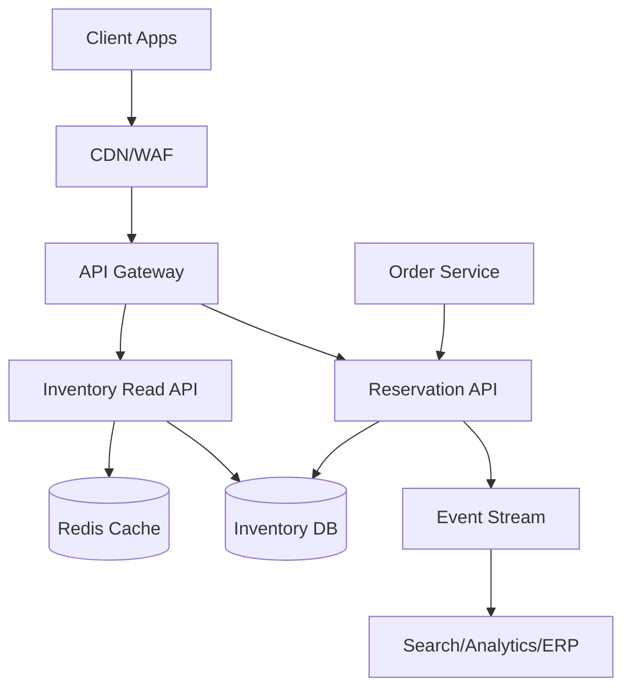

## Overview

An inventory system for limited stock is deceptively hard because “available” is a fast-moving derived value influenced by purchases, cancellations, restocks, returns, and time-bound holds. The system must prevent oversells (hard correctness), while still serving extremely high read traffic (browse, search, PDP) with low latency and graceful degradation when dependencies fail.

The key insight is to split **read-optimized availability** from **write-authoritative reservations**: browse paths can use cached/derived availability, but **checkout uses a strongly consistent reservation path** that atomically enforces invariants (no negative availability) and supports **expiring holds**. The design also treats inventory as a **state machine** (on-hand → reserved → allocated → decremented) with idempotent APIs and event-driven propagation to downstream systems.

## Requirements

### Functional Requirements
- Show available quantity per `SKU` and `location` (warehouse/store) for browse/search and PDP.
- Create a **reservation (hold)** for a given `SKU/location/qty` with a configurable TTL (e.g., 15 minutes).
- Convert an active reservation into a **confirmed allocation** on successful checkout to prevent oversell.
- Release reservations on cancellation, payment failure, or expiration (automatic and manual).
- Prevent oversell under concurrency (multiple users racing for last units).
- Support inventory adjustments (restock, shrinkage, returns) with audit trails.
- Provide **fallback behaviors** when inventory is unknown/unavailable (conservative “out of stock”, or “check at checkout”).
- Publish inventory/reservation events for downstream consumers (search, analytics, replenishment, customer notifications).

### Non-Functional Requirements
- **Scale**: 20M SKUs, 200 warehouses/stores; browse reads 100k QPS peak, checkout writes 10k QPS peak; flash-sale hot SKUs up to 5k reservation attempts/sec per SKU.
- **Latency**:
  - Availability read (browse): P50 10ms, P99 50ms (from cache).
  - Reservation create/confirm: P50 40ms, P99 150ms (authoritative path).
- **Availability**: 99.99% for read APIs, 99.95% for reservation APIs.
- **Consistency**:
  - Strong consistency for reservation/confirm/release on the authoritative store.
  - Eventual consistency for search index, analytics, and cached browse availability.
- **Durability**: No lost confirmed allocations; tolerate at most 0 data loss (RPO ~0) within-region. Cross-region DR can be async (RPO ≤ 1 minute).

### Constraints & Assumptions
- Inventory is tracked per `SKU + location` (location = warehouse/store). Global inventory is derived.
- Payment is handled by a separate Order/Payment system; inventory confirms only after payment authorization (or “soft confirm” with strict timeout if needed).
- Single region for writes per location (home region), multi-AZ deployment. Cross-region failover is supported but not active-active for the same location.
- Team size ~6–10 engineers; prefer managed infra where possible (Kafka/PubSub, DynamoDB/Spanner, Redis).

## High-Level Architecture



Browse calls hit a read-optimized path that prefers cache and tolerates small staleness; checkout and order flows call the Reservation API which performs atomic updates in the authoritative inventory store. Every state transition emits events (via an outbox/stream) so downstream systems (search, analytics, ERP/WMS) can converge without coupling to the hot write path.

This structure isolates correctness-critical operations (reservation/confirm) from high-QPS reads, lets you scale each independently, and provides clear fallback modes: if cache is unhealthy you can read from DB; if reservation path is impaired you can degrade checkout behavior without corrupting inventory.

## Component Deep-Dive

### Inventory Read API
**Responsibility**: Serve availability for browse/search/PDP with low latency and controlled staleness.

**Key Design Decisions**:
- Use cache-first reads with short TTL (e.g., 1–5s) and soft TTL to avoid stampedes.
- Return **availability confidence** (`fresh|stale|unknown`) so clients can apply UX fallbacks.

**Technology Choice**: Stateless service (Go/Java), Redis Cluster for cache, optional CDN edge caching for public catalog pages.

**Scaling Strategy**: Horizontal scale behind L7 load balancer; cache sharded; protect DB with request coalescing and circuit breakers.

### Reservation API (Write/Checkout Path)
**Responsibility**: Create/release/confirm holds with strong correctness; enforce “no oversell” invariants.

**Key Design Decisions**:
- Atomic reservation using conditional updates (CAS/version) on a single `SKU+location` record.
- Idempotency on all write endpoints (Idempotency-Key) to handle retries and client timeouts safely.

**Technology Choice**:
- Authoritative store: DynamoDB (conditional writes) or Spanner (transactions), or Postgres with partitioning + `SERIALIZABLE`/optimistic locking.
- Stateless service with strict timeouts and bounded retries.

**Scaling Strategy**:
- Partition by `location_id` then `sku_id` (or composite key) to distribute load.
- Hot SKU mitigation: request shedding + per-key rate limiting; optional “inventory striping” (multiple counters per SKU) for extreme contention.

### Inventory DB (Authoritative Store)
**Responsibility**: Source of truth for on-hand/reserved/allocated and reservation records.

**Key Design Decisions**:
- Maintain explicit counters: `on_hand`, `reserved`, `allocated` with invariant `reserved + allocated <= on_hand`.
- Keep reservation rows with `expires_at` and status to support audits and idempotency.

**Technology Choice**: DynamoDB with TTL on reservations and transactional writes (or Spanner). If Postgres: table partitioning by `location_id` and logical sharding at higher scale.

**Scaling Strategy**: Auto-partitioning (managed) or shard by location; keep transactions per key small; avoid multi-SKU transactions on checkout (use order-level saga).

### Event Stream + Outbox
**Responsibility**: Reliably publish inventory changes to downstream consumers without slowing checkout.

**Key Design Decisions**:
- Use the **outbox pattern**: write inventory change + outbox row in the same transaction; async publisher sends to stream.
- Consumers are idempotent using event IDs and monotonic version per `sku+location`.

**Technology Choice**: Kafka/PubSub/Kinesis; Debezium CDC for Postgres is an alternative.

**Scaling Strategy**: Partition stream by `location_id` (or composite key) to keep per-key ordering; scale consumers independently.

## Data Model

### Storage Schema

**Table: `inventory_balance`** (authoritative per SKU+location)
- `location_id` (PK part)
- `sku_id` (PK part)
- `on_hand` (int)
- `reserved` (int)
- `allocated` (int)
- `version` (bigint, monotonically incremented)
- `updated_at` (timestamp)

**Table: `reservation`**
- `reservation_id` (PK, ULID/UUID)
- `location_id`, `sku_id`
- `qty` (int)
- `status` (`ACTIVE|CONFIRMED|RELEASED|EXPIRED`)
- `expires_at` (timestamp)
- `order_id` (nullable until linked)
- `idempotency_key` (string, unique per endpoint scope)
- `created_at`, `updated_at`

**Table: `inventory_outbox`**
- `event_id` (PK)
- `event_type` (`RESERVED|RELEASED|CONFIRMED|ADJUSTED`)
- `location_id`, `sku_id`
- `delta_reserved`, `delta_allocated`, `delta_on_hand`
- `new_version`
- `payload` (json)
- `created_at`, `published_at` (nullable)

### Data Flow

```mermaid
sequenceDiagram
  participant C as Client
  participant O as OrderSvc
  participant I as ReservationAPI
  participant D as InventoryDB
  participant E as EventStream

  C->>O: Create order
  O->>I: POST /reservations (sku, loc, qty, ttl)
  I->>D: Txn: if available>=qty then reserved+=qty; insert reservation
  D-->>I: OK (reservation_id, expires_at, version)
  I-->>O: Reservation created
  O->>O: Authorize payment
  O->>I: POST /reservations/{id}/confirm
  I->>D: Txn: reservation ACTIVE? move qty reserved->allocated; status CONFIRMED
  D-->>I: OK
  I-->>O: Confirmed
  I->>E: Publish event (via outbox)
```

Expiration is handled by a sweeper (or TTL + compensating release) that transitions `ACTIVE -> EXPIRED` and decrements `reserved` if not already confirmed/released, emitting an event.

## API Design

### Read APIs

`GET /v1/availability?sku_id={sku}&location_id={loc}`
- **Response**
```json
{
  "sku_id": "SKU123",
  "location_id": "WH1",
  "available": 42,
  "as_of": "2025-12-17T10:00:00Z",
  "confidence": "fresh"
}
```
- **Errors**: `404` unknown SKU/location, `503` dependency down (may return `confidence:"unknown"` with `available:null` if configured).

### Reservation APIs (authoritative)

`POST /v1/reservations`
- Headers: `Idempotency-Key: <uuid>`
- **Request**
```json
{
  "sku_id": "SKU123",
  "location_id": "WH1",
  "qty": 2,
  "ttl_seconds": 900,
  "order_id": "ORD999"
}
```
- **Response (201)**
```json
{
  "reservation_id": "01J...ULID",
  "status": "ACTIVE",
  "expires_at": "2025-12-17T10:15:00Z"
}
```
- **Errors**
  - `409 INSUFFICIENT_STOCK` (include `available` hint if safe)
  - `400 INVALID_QTY`, `404 UNKNOWN_SKU`, `429 HOT_SKU_THROTTLED`, `503 INVENTORY_UNAVAILABLE`
- **Idempotency**: same key returns same `reservation_id` and body; keys are scoped per merchant/order to avoid collisions.

`DELETE /v1/reservations/{reservation_id}`
- Releases an `ACTIVE` reservation (idempotent).
- **Errors**: `404` not found, `410` already expired, `409` already confirmed.

`POST /v1/reservations/{reservation_id}/confirm`
- Converts `ACTIVE -> CONFIRMED` (idempotent).
- **Errors**: `410 EXPIRED`, `409 INVALID_STATE`, `404` not found.

### Adjustment API (internal/admin)

`POST /v1/inventory/adjustments`
- Headers: `Idempotency-Key`
- **Request**
```json
{
  "sku_id": "SKU123",
  "location_id": "WH1",
  "delta_on_hand": 50,
  "reason": "RESTOCK",
  "reference": "ASN-7781"
}
```
- **Errors**: `409` would violate invariants (e.g., reducing below reserved+allocated).

## Scaling & Performance

### Bottleneck Analysis
- **Hot SKUs during flash sales**: single-key contention on `sku+location` record.
  - Mitigate with per-key throttling, queued writes, and “striped counters” (N shards per SKU) if needed.
- **Cache stampedes on popular items**: many read misses after TTL expiry.
  - Mitigate with request coalescing, jittered TTLs, and stale-while-revalidate.
- **Outbox/stream lag**: downstream staleness (search, analytics).
  - Mitigate with backpressure metrics, replayable consumers, and independent scaling.

### Horizontal Scaling
- **API layer**: stateless autoscaling on CPU/RPS; isolate read and write services to protect checkout.
- **DB layer**: partition by `location_id` and `sku_id`; keep transactions single-partition when possible.
- **Stream**: partition by `location_id` to preserve ordering per warehouse; scale consumers with partition count.

### Caching Strategy
- Cache `available` for browse (`available = on_hand - reserved - allocated`) with TTL 1–5s; include `version` to detect staleness.
- Never rely on cache for final checkout decision; reservation path always hits authoritative store.
- Invalidation:
  - Write-through: Reservation API updates cache for affected key after successful commit.
  - Event-driven: stream consumer updates cache/index asynchronously (safe for eventual consistency).

## Trade-offs & Alternatives

### Key Trade-offs Made
- **Chose strong consistency for reservations**
  - Sacrifice: higher latency and potential contention on hot keys.
  - Why: oversell prevention is a hard business correctness requirement.
- **Chose cached availability for browse**
  - Sacrifice: occasional stale “available” UI.
  - Why: browse traffic dwarfs checkout; UX can tolerate “only X left” being slightly off as long as checkout is correct.
- **Chose event-driven propagation**
  - Sacrifice: eventual consistency and operational complexity (streams, consumers).
  - Why: decouples critical path from downstream systems and scales better.

### Alternative Approaches
- **Active-active multi-region writes (global inventory)**
  - Not chosen due to complexity of global strong consistency; requires Spanner-like semantics or per-SKU single-writer routing.
- **Purely optimistic oversell with later reconciliation**
  - Not chosen because it breaks “limited stock” promises; acceptable only for backorder-friendly businesses.
- **Queue-per-SKU serialized writer**
  - Works well for flash sales but adds latency and operational overhead; used selectively as a mitigation rather than default.

## Failure Modes & Mitigations

### Failure Scenarios
- **Scenario**: Inventory DB partial outage / elevated latency  
  **Impact**: Checkout reservations fail; browse may degrade to stale/unknown  
  **Detection**: DB error rate, P99 latency, reservation success rate  
  **Mitigation**: Circuit breaker; degrade to conservative “out of stock” or “check at checkout”; fail fast to avoid thread exhaustion; multi-AZ failover.

- **Scenario**: Reservation expirations delayed (sweeper lag, TTL delays)  
  **Impact**: Stock appears unavailable longer than necessary  
  **Detection**: Active reservations past `expires_at`, sweeper lag metrics  
  **Mitigation**: Periodic reconciler that recomputes `reserved` from active reservations (off-peak); alert on lag; cap max TTL.

- **Scenario**: Duplicate requests (client retries, timeouts)  
  **Impact**: Oversell risk if not handled  
  **Detection**: Idempotency-key collision metrics, duplicate rate  
  **Mitigation**: Mandatory idempotency for writes; return stored result for duplicates.

- **Scenario**: Stream/outbox publisher down  
  **Impact**: Downstream systems stale; authoritative inventory still correct  
  **Detection**: Outbox backlog, publish latency  
  **Mitigation**: Separate scaling; replay outbox; DLQ for poison events.

- **Scenario**: Hot SKU contention causes elevated write latency  
  **Impact**: Poor checkout UX for popular items  
  **Detection**: Per-key conflict rate, throttles, tail latency  
  **Mitigation**: Per-key rate limiting; “limited release” batching; striped counters; temporary queue mode for flash sales.

### Disaster Recovery
- **RTO/RPO**: RTO 30 minutes, RPO 1 minute (cross-region async replication).
- **Backup strategy**: Daily full + continuous incremental backups; point-in-time restore for authoritative DB; retain 30–90 days.
- **Failover procedures**: Promote read replica/secondary in DR region; switch home-region routing for affected locations; replay outbox/stream from last checkpoint.

## Operational Considerations

### Monitoring & Alerting
- Key metrics:
  - Reservation success rate, `409 INSUFFICIENT_STOCK` rate (expected vs anomalous)
  - P50/P99 latency for read and write APIs
  - DB conditional-write conflict rate / transaction aborts
  - Active reservations past expiration, sweeper lag
  - Cache hit rate, stale/unknown response rate
  - Outbox backlog, stream consumer lag
- Alerts:
  - Reservation success rate < 99% over 5m (excluding insufficient stock)
  - P99 reservation latency > 300ms over 10m
  - Expired-but-active reservations > threshold
  - Outbox backlog age > 5m

### Deployment Strategy
- Blue/green or canary for Reservation API with strict rollback on increased conflict/latency.
- Backward-compatible schema changes (expand/contract), versioned events.
- Rollback: feature flags for fallback mode (conservative vs optimistic browse), disable new write paths, revert to last stable build.

## References & Further Reading
- Outbox pattern: https://microservices.io/patterns/data/transactional-outbox.html
- Idempotency keys (payments patterns): https://stripe.com/docs/idempotency
- DynamoDB conditional writes & transactions: https://docs.aws.amazon.com/amazondynamodb/latest/developerguide/Expressions.ConditionExpressions.html
- Designing data-intensive applications (consistency, transactions): https://dataintensive.net/
- Sagas (distributed transactions): https://microservices.io/patterns/data/saga.html