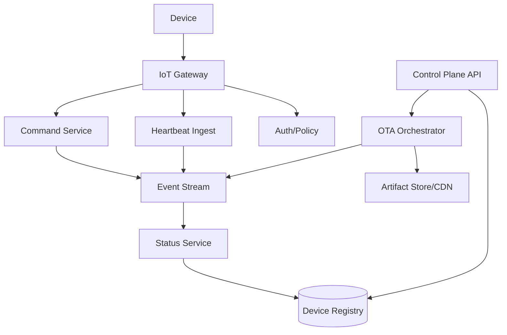
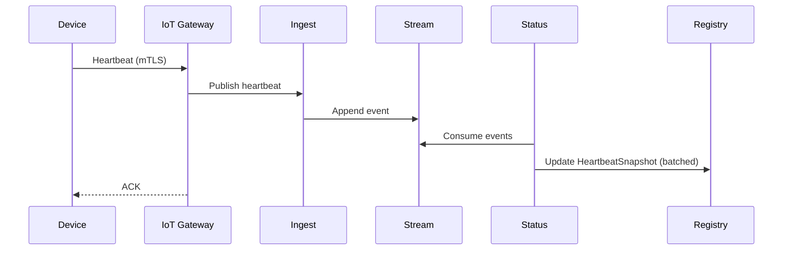

## Overview

An IoT device management platform must safely onboard and identify millions of heterogeneous devices, maintain continuous visibility into their health, and roll out OTA firmware updates without bricking fleets or overloading networks. The challenge is that devices are intermittently connected, constrained (CPU/RAM/storage/power), often behind NAT, and operate on unreliable links—yet the backend must provide strong security guarantees, auditability, and operational control.

The key insight is to separate **control plane** (provisioning, configuration, update orchestration) from **data/telemetry plane** (heartbeats, metrics), and to model device interactions as **asynchronous, idempotent, eventually consistent workflows** with strict security boundaries. OTA becomes a staged pipeline (targeting → artifact distribution → install → verify → rollback) with progressive rollout and fleet-safe guardrails.

## Requirements

### Functional Requirements
- Secure device provisioning (factory or field), including identity, certificates, and ownership assignment.
- Device registry with metadata (model, capabilities, firmware, tags, location) and lifecycle state (active, retired, quarantined).
- Heartbeat monitoring with last-seen tracking, liveness status, and alerting hooks.
- OTA firmware update management: upload artifacts, create campaigns, target cohorts, staged rollout, pause/abort, and rollback.
- Device configuration management (desired state) and reliable delivery/acknowledgement from devices.
- Command & control: send commands (reboot, diagnostics) with auditing and rate limits.
- Fleet segmentation: groups/tags, dynamic queries, and per-tenant isolation (if multi-tenant).
- Admin APIs/UI for operators, plus exports/audit logs for compliance.

### Non-Functional Requirements
- **Scale**: 10M devices; average 1 heartbeat / 60s ⇒ ~167K heartbeats/sec peak (bursty); OTA campaigns up to 2M devices; artifact storage up to 10K firmware versions, 1–200MB each.
- **Latency**:
  - Heartbeat ingest P99 < 200ms (device to ack).
  - Control plane APIs P99 < 500ms.
  - Command delivery best-effort with median < 5s when device online.
- **Availability**:
  - Heartbeat ingest 99.99%.
  - Control plane 99.9% (degraded mode acceptable).
- **Consistency**:
  - Strong consistency for identity/provisioning and authorization decisions.
  - Eventual consistency for telemetry-derived status (online/offline) and aggregated views.
- **Durability**:
  - Firmware artifacts: 11 nines (object storage).
  - Registry and audit logs: RPO ≤ 5 minutes; no silent loss of update state transitions.

### Constraints & Assumptions
- Devices support MQTT over TLS 1.2+ (fallback HTTPS long-poll allowed for constrained networks).
- Each device has a hardware root of trust or secure element for private key storage (preferred); otherwise secure bootloader with protected flash.
- Multi-region deployment for latency/availability; devices connect to nearest region.
- Budget supports managed services (e.g., Kafka/MSK, DynamoDB/Cassandra, S3), but design is portable.
- Compliance: basic auditability and secure key management; optional requirements like SOC2/ISO27001 can be met via standard controls.

## High-Level Architecture

Devices connect through an IoT gateway layer (MQTT/HTTPS termination) that enforces mutual TLS, validates device identity, and applies authorization/policy. Telemetry (heartbeats) is ingested at very high QPS into an event stream for scalable processing, while the control plane writes desired state (configs, update campaigns, commands) into durable stores and publishes events.

OTA orchestration is treated as a workflow: the orchestrator targets devices, publishes per-device update jobs, and devices fetch artifacts from an object store via CDN (to avoid funneling bytes through the control plane). Status computation and offline detection are derived from streams rather than synchronous DB writes on every heartbeat, keeping the write path hot but simple.

## Component Deep-Dive

### IoT Gateway

**Responsibility**: Terminate device connections, authenticate devices, enforce throttling, and route messages (heartbeats/acks/commands) to backend services.

**Key Design Decisions**:
- Use MQTT over mTLS as primary transport; fallback HTTPS for restricted environments to maximize device compatibility.
- Enforce per-device and per-tenant quotas at ingress to prevent noisy neighbors and mitigate DDoS amplification from compromised fleets.

**Technology Choice**: EMQX/HiveMQ/AWS IoT Core (managed) or custom gateway on Envoy + MQTT broker; TLS termination with ALPN and SNI for regional routing.

**Scaling Strategy**: Horizontally scale brokers behind L4/L7 load balancing; shard by device ID to keep session affinity; use autoscaling on connection count and publish rate.

### Device Registry & Control Plane API

**Responsibility**: Source of truth for device identity metadata, lifecycle state, group membership, desired config, and update/command state.

**Key Design Decisions**:
- Separate immutable identity (device ID, cert, manufacturing info) from mutable operational state (last-seen, firmware) to reduce contention.
- Use strong authZ checks (tenant boundaries, role-based access) and immutable audit logging for every operator action.

**Technology Choice**: DynamoDB/Cassandra for high-scale keyed access; Postgres for relational needs (tenants, RBAC) if required; KMS/HSM for key material.

**Scaling Strategy**: Partition by `tenant_id` + `device_id`; maintain secondary indexes for group/tag queries via search (OpenSearch) or precomputed membership tables.

### Heartbeat Ingest & Status Service

**Responsibility**: Accept heartbeats/telemetry, compute online/offline status, and publish alerts/notifications.

**Key Design Decisions**:
- Treat heartbeats as append-only events; avoid synchronous registry writes per heartbeat (too expensive at 100K+ QPS).
- Compute liveness using stream processors and a time-windowed state store with explicit “stale” transitions.

**Technology Choice**: Kafka + Flink/Kafka Streams; alternative: Kinesis + Lambda. Status snapshots stored in Redis (hot) and registry DB (durable).

**Scaling Strategy**: Partition stream by `device_id` for ordered processing; scale consumers by partitions; use regional streams and aggregate cross-region asynchronously.

### OTA Orchestrator & Artifact Distribution

**Responsibility**: Manage firmware versions, create rollout campaigns, schedule per-device jobs, collect results, and enforce safety controls.

**Key Design Decisions**:
- Devices download firmware directly from CDN/object store using short-lived signed URLs, not through the orchestrator.
- Progressive delivery with guardrails: canary → ramp → full rollout; automated halt on error-rate thresholds and version-specific rollback plans.

**Technology Choice**: Workflow engine (Temporal/Step Functions) for campaign state machines; S3/GCS + CloudFront/Cloud CDN; signing via KMS.

**Scaling Strategy**: Campaign fan-out via stream/queue; store per-device job state in scalable KV store; rate-limit by region/model/network to avoid saturating gateways and ISPs.

## Data Model

### Storage Schema

**DeviceIdentity (strongly consistent)**
- `device_id` (PK, immutable)
- `tenant_id`
- `manufacturing_batch`
- `model`
- `cert_fingerprint`
- `created_at`
- `lifecycle_state` (active/retired/quarantined)

**DeviceShadow (mutable desired/reported)**
- `tenant_id` (PK)
- `device_id` (SK)
- `desired_config` (JSON)
- `reported_state` (JSON)
- `desired_version` (string)
- `reported_version` (string)
- `updated_at`

**HeartbeatSnapshot**
- `tenant_id` (PK)
- `device_id` (SK)
- `last_seen_at`
- `status` (online/offline/unknown)
- `last_ip` (optional)
- `last_region`
- `battery`/`signal` (optional)

**FirmwareArtifact**
- `artifact_id` (PK)
- `model`
- `version`
- `sha256`
- `size_bytes`
- `uri` (object storage path)
- `created_at`
- `signing_key_id`

**OtaCampaign**
- `campaign_id` (PK)
- `tenant_id`
- `artifact_id`
- `target_query` (tags/models)
- `rollout_plan` (canary %, ramp schedule)
- `status` (draft/running/paused/aborted/completed)
- `created_by`
- `created_at`

**OtaJob (per device)**
- `campaign_id` (PK)
- `device_id` (SK)
- `state` (scheduled/downloading/installing/verified/failed/rolled_back)
- `attempt`
- `last_error`
- `updated_at`

**AuditLog (append-only)**
- `event_id` (PK)
- `tenant_id`
- `actor`
- `action`
- `resource`
- `timestamp`
- `metadata` (JSON)

### Data Flow

OTA (high level): operator creates campaign → orchestrator expands targets to per-device jobs → device receives “desired version” via shadow/command → device downloads artifact from CDN using signed URL → device reports install/verify status → orchestrator updates job/campaign progress and enforces guardrails.

## API Design

Assume REST for control plane; MQTT topics for device messaging.

### Control Plane (REST)

- `POST /v1/devices`
  - Request: `{ tenantId, deviceId, model, certFingerprint, tags? }`
  - Response: `201 { deviceId, provisioningState }`
  - Errors: `409` (device exists), `400` (invalid cert), `403` (unauthorized)

- `GET /v1/devices/{deviceId}`
  - Response: `{ identity, shadow, heartbeatSnapshot }`

- `PATCH /v1/devices/{deviceId}/shadow`
  - Request: `{ desiredConfig?, desiredVersion? }`
  - Idempotency: `Idempotency-Key` header; last-write-wins by `updated_at` or explicit `shadow_version`.

- `POST /v1/firmware/artifacts`
  - Request: metadata + upload initiation
  - Response: signed upload URL / multipart session
  - Server verifies `sha256` after upload and signs manifest.

- `POST /v1/ota/campaigns`
  - Request: `{ artifactId, targetQuery, rolloutPlan, safetyPolicy }`
  - Response: `{ campaignId, status:"draft" }`

- `POST /v1/ota/campaigns/{campaignId}:start|pause|abort`
  - Response: `{ campaignId, status }`

- `GET /v1/ota/campaigns/{campaignId}`
  - Response: `{ campaign, progress, errorRates, perStageStats }`

**Error handling**: Use standard problem details (`application/problem+json`) with stable error codes (`DEVICE_NOT_FOUND`, `CAMPAIGN_INVALID_STATE`).  
**Idempotency**: Required for mutating endpoints (`POST`/`PATCH`) using `Idempotency-Key` stored with TTL; safe retries across network failures.

### Device Plane (MQTT topics)

- Publish heartbeat: `devices/{deviceId}/telemetry/heartbeat`
- Subscribe desired state: `devices/{deviceId}/shadow/desired`
- Publish reported state: `devices/{deviceId}/shadow/reported`
- Subscribe commands: `devices/{deviceId}/commands`
- Publish command ack: `devices/{deviceId}/commands/ack`

Authorization is enforced by policy (topic-level ACLs) bound to device identity and tenant.

## Scaling & Performance

### Bottleneck Analysis
- **Ingress connection count**: millions of concurrent MQTT sessions → mitigate with broker clustering, session sharding, and regional endpoints.
- **Heartbeat write amplification**: writing every heartbeat to DB is prohibitive → stream-first ingest with batched snapshot updates.
- **OTA bandwidth**: firmware distribution can overwhelm origin and networks → CDN, staged rollout, per-ISP/region rate limits.
- **Targeting queries**: dynamic cohorts at scale → precompute tag membership, maintain searchable index, snapshot target sets at campaign start.

### Horizontal Scaling
- **Gateway**: scale by connections and publish rate; shard by consistent hashing on `device_id`.
- **Stream**: scale partitions; keep per-device ordering by partition key.
- **Status processors**: scale consumer groups; store state in RocksDB (Flink) with checkpoints.
- **Registry**: partition by `tenant_id` + `device_id`; avoid hot partitions by salting if needed.
- **OTA orchestrator**: distributed workflow workers; job fan-out via stream/queue.

### Caching Strategy
- **Auth/policy cache** at gateway (short TTL, e.g., 1–5 minutes) for cert → tenant/device mapping.
- **Device shadow hot cache** (Redis) for fast desired-state fetch and command routing; write-through from control plane.
- **Firmware metadata cache** for artifact manifests and signed URL templates; signed URLs short-lived (5–15 minutes).
- **Invalidation**: event-driven (stream) updates to caches; fallback to TTL to recover from missed events.

## Trade-offs & Alternatives

### Key Trade-offs Made
- **Stream-based heartbeat processing**
  - Chosen: append events → compute snapshots asynchronously.
  - Sacrificed: immediate strongly consistent “last seen” in DB.
  - Why: reduces DB write load by orders of magnitude at 100K+ QPS.

- **CDN direct artifact download**
  - Chosen: devices fetch from CDN with signed URLs.
  - Sacrificed: centralized traffic inspection through backend.
  - Why: makes OTA bandwidth scalable and cheaper; avoids control plane saturation.

- **Eventual consistency for liveness**
  - Chosen: online/offline computed from time windows.
  - Sacrificed: exact real-time truth during partitions.
  - Why: devices are inherently intermittent; precise global truth is expensive and not actionable.

### Alternative Approaches
- **All-in-one managed IoT platform** (AWS IoT Core/Azure IoT Hub/GCP IoT-style stack): faster time-to-market, but vendor lock-in and less control over data paths.
- **Pure HTTP polling**: simpler for some networks, but inefficient for frequent heartbeats and command latency; higher bandwidth/CPU on devices.
- **Monolithic control + data plane**: fewer moving parts initially, but becomes a bottleneck under heartbeat and OTA load; harder to scale independently.

## Failure Modes & Mitigations

### Failure Scenarios
- **Gateway/broker outage**
  - Impact: devices cannot connect in a region.
  - Detection: connection rate drop, broker health checks, regional SLO burn.
  - Mitigation: multi-AZ brokers, regional failover endpoint, exponential backoff on devices, session resumption.

- **Stream backlog (Kafka/Flink lag)**
  - Impact: delayed offline detection, delayed campaign metrics.
  - Detection: consumer lag, processing latency metrics.
  - Mitigation: autoscale consumers, increase partitions, shed non-critical telemetry, prioritize status events.

- **Bad firmware release**
  - Impact: bricked devices, widespread downtime.
  - Detection: install failure rate, crash loops (heartbeat stops), canary KPIs.
  - Mitigation: canary + staged rollout, automatic pause on thresholds, rollback to last-known-good, require signed firmware + secure boot.

- **Credential compromise (device key leak)**
  - Impact: impersonation, unauthorized publish/subscribe.
  - Detection: anomaly detection (impossible travel/IP), publish volume spikes, cert fingerprint mismatches.
  - Mitigation: per-device certs, rapid revocation/CRL/OCSP strategy, quarantine lifecycle state, rotate credentials via secure provisioning.

- **Object storage/CDN misconfiguration**
  - Impact: devices can’t download firmware or unauthorized access.
  - Detection: elevated 4xx/5xx, signed URL validation failures.
  - Mitigation: preflight checks, artifact immutability, least-privilege buckets, dual-CDN fallback for critical fleets.

### Disaster Recovery
- **RTO/RPO**: Control plane RTO 1 hour, RPO 5 minutes; telemetry plane RTO 15 minutes, RPO best-effort (heartbeats are transient).
- **Backups**: point-in-time recovery for registry DB; periodic exports to object storage; audit logs written to immutable storage (WORM-capable).
- **Failover**: active-active for ingest (regional), active-passive for control plane if needed; DNS-based traffic steering; replay streams from mirrored topics.

## Operational Considerations

### Monitoring & Alerting
- Gateway: connected sessions, auth failures, publish/subscribe rates, throttling counts, TLS errors.
- Stream: partition health, under-replicated partitions, consumer lag, end-to-end event latency.
- Status: offline transition rate, snapshot write latency, Redis hit ratio.
- OTA: download success rate, install success rate, per-model error rate, campaign pause events.
- SLOs: heartbeat ack latency, control API error rate, campaign state transition latency.
- Alerts: lag > 60s (paging), auth failures spike (security), OTA failure rate > 2% in canary (auto-pause + page).

### Deployment Strategy
- Blue/green or canary releases for control plane; schema migrations backward compatible.
- Gateway: rolling upgrades with connection draining; maintain protocol compatibility.
- Feature flags for OTA policy changes; ability to freeze new campaigns globally.
- Rollback: keep previous orchestrator version; maintain idempotent consumers to handle reprocessing.

## References & Further Reading

- Eclipse hawkBit (OTA update server): https://www.eclipse.org/hawkbit/
- AWS IoT Device Management & Jobs (managed reference implementation): https://docs.aws.amazon.com/iot/
- Temporal (workflow orchestration for OTA campaigns): https://temporal.io/
- “The Log” / stream processing principles (Kafka): https://kafka.apache.org/documentation/
- Secure boot & firmware signing best practices (vendor-specific, e.g., ARM PSA): https://www.arm.com/architecture/security-features/platform-security-architecture