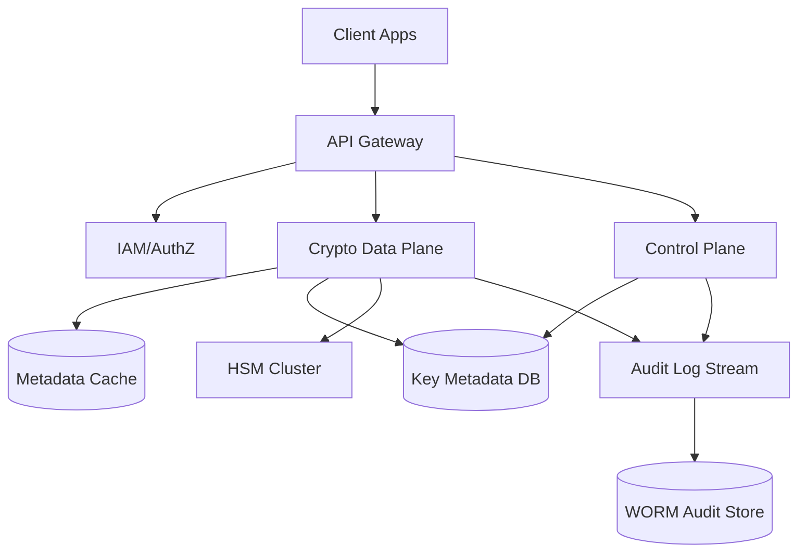
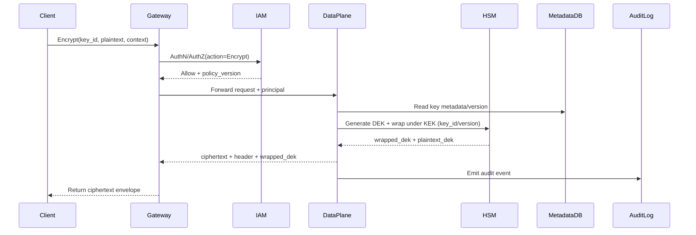

## Overview

A Key Management System (KMS) provides a centralized, auditable, and policy-controlled service for creating, storing, and using cryptographic keys. The hard part isn’t “encrypt/decrypt” primitives—it’s enforcing least-privilege access at scale, proving who used which key and when, handling rotation without breaking old data, and achieving high availability while keeping key material protected (ideally hardware-backed).

A production-grade KMS typically splits responsibilities into a **control plane** (key lifecycle, policy, rotation orchestration) and a **data plane** (low-latency cryptographic operations). The key insight is **envelope encryption**: the KMS protects small **Key Encryption Keys (KEKs)** (master keys) in HSMs and uses them to wrap/unwrap **Data Encryption Keys (DEKs)** used by applications. This minimizes HSM load, reduces blast radius, and supports safe rotation and auditability.

## Requirements

### Functional Requirements
- Create and manage keys (symmetric and asymmetric) with explicit metadata (purpose, algorithm, usage constraints).
- Perform cryptographic operations: `Encrypt/Decrypt`, `GenerateDataKey` (DEK + encrypted DEK), `Sign/Verify`, and `GetPublicKey`.
- Support key rotation (manual and scheduled), versioning, and “encrypt with latest / decrypt with any valid version”.
- Enforce fine-grained authorization via IAM + resource policies (RBAC/ABAC), including per-tenant isolation.
- Provide tamper-evident audit logs for all key lifecycle and key usage operations.
- Support HSM-backed key storage and operations for KEKs/asymmetric private keys (non-exportable keys).
- Provide safe key state transitions: `Enabled`, `Disabled`, `PendingDeletion`, and recovery windows.
- Support “encryption context” (AAD) binding to prevent ciphertext substitution across services/tenants.

### Non-Functional Requirements
- **Scale**: 50K QPS steady-state crypto ops region-wide; burst to 200K QPS for peak events. 5M keys total, 50M key versions. Audit events: up to 1B/day.
- **Latency** (data plane):
  - `Encrypt/Decrypt` P50 10–20ms, P99 75ms (including authz + HSM unwrap path).
  - `GenerateDataKey` P50 15ms, P99 100ms.
  - Control plane (create/rotate/policy) P99 500ms–2s.
- **Availability**: 99.99% for data plane; 99.9% for control plane. No single points of failure in-region.
- **Consistency**:
  - Strong consistency for key state/policy changes (control plane writes).
  - Eventual consistency acceptable for audit log delivery/analytics; crypto operations must respect latest policy within bounded propagation (e.g., <5s).
- **Durability**: No loss of key metadata; key material never lost once activated. Audit logs durable (WORM/immutability) with at most 1 minute ingestion lag in worst-case.

### Constraints & Assumptions
- Keys are managed per tenant/account with strict isolation; multi-region active-active for reads and crypto ops, controlled writes per key.
- HSMs are available (FIPS 140-2 Level 3 or equivalent) and integrated via vendor SDK/PKCS#11/JCE.
- No network access from the KMS to customer VPCs required; customers call KMS APIs over TLS/mTLS.
- Compliance targets may include SOC2, PCI DSS, HIPAA; audit and access controls must support these.
- Team size: ~6–10 engineers; design favors proven components (Postgres/DynamoDB, Redis, Kafka/PubSub, HSM appliances).

## High-Level Architecture



Clients use a single API surface behind an API Gateway. Requests are authenticated and authorized (IAM + resource policy evaluation). Latency-sensitive cryptographic operations are handled by the **data plane**, which reads key metadata (cached) and uses **HSMs** to unwrap/wrap DEKs or to perform private-key operations. Lifecycle operations (create key, update policy, rotate, schedule deletion) go through the **control plane**, which strongly persists metadata and emits audit events.

This structure isolates high-QPS crypto traffic from slower administrative workflows, limits the blast radius of metadata changes, and allows independent scaling of the data plane and HSM fleet. Envelope encryption ensures HSMs protect only KEKs and sensitive private keys while applications use DEKs locally for bulk data encryption.

## Component Deep-Dive

### API Gateway
**Responsibility**: Terminate TLS/mTLS, enforce request authentication, rate limits, request validation, routing, and idempotency keys.

**Key Design Decisions**:
- Centralize coarse-grained protections (WAF, throttling, schema validation) to reduce load and attack surface on KMS services.
- Use request IDs + idempotency tokens for create/rotate operations to prevent duplicate key creation on retries.

**Technology Choice**: Envoy/NGINX + managed API gateway; OIDC/JWT validation; mTLS for service-to-service.

**Scaling Strategy**: Horizontally scale stateless gateways; global anycast + regional L7 load balancers; per-tenant rate limiting.

### IAM / Authorization Service
**Responsibility**: Authenticate principals (users/services), evaluate resource policies, enforce ABAC conditions, and mint short-lived credentials/tokens.

**Key Design Decisions**:
- Combine IAM identity policies with per-key resource policies (e.g., “only service X can decrypt with key Y”).
- Support “encryption context” conditions (e.g., `tenant_id`, `service`, `env`) to bind ciphertext usage.

**Technology Choice**: Internal IAM service or integration with existing IdP; policy language similar to AWS IAM (JSON) with condition keys.

**Scaling Strategy**: Cache policy evaluation results briefly (e.g., 1–5s) keyed by principal+key+action+context hash; enforce revocation via short TTL tokens and policy versioning.

### Control Plane (Key Lifecycle)
**Responsibility**: Key creation, aliasing, tagging, policy updates, rotation scheduling, deletion workflow, and key state machine.

**Key Design Decisions**:
- Strongly consistent metadata writes (single-writer per key) to avoid split-brain key states.
- Rotation creates a new key version; old versions remain for decrypt/sign verify based on policy.

**Technology Choice**: Go/Java service; metadata in Postgres (with HA) or DynamoDB (strongly consistent reads for key state); background jobs for rotation and deletion windows.

**Scaling Strategy**: Stateless workers; partition background jobs by tenant/key ID; backpressure via queue.

### Crypto Data Plane (Online Crypto Service)
**Responsibility**: Serve `Encrypt/Decrypt/GenerateDataKey/Sign/Verify` with tight latency budgets, using cached metadata and HSM operations.

**Key Design Decisions**:
- Separate “wrap/unwrap” operations (HSM) from bulk encryption (client-side DEK usage) to reduce HSM load.
- Use deterministic metadata reads (key ID + version) and include key version in ciphertext header to avoid ambiguity.

**Technology Choice**: Go/Rust/Java; Redis/Memory cache; gRPC between gateway and data plane for low overhead.

**Scaling Strategy**: Horizontal autoscaling on QPS/latency; shard by key ID for cache locality; circuit breakers when HSM latency spikes.

### HSM Cluster
**Responsibility**: Hardware-protected generation and storage of KEKs and private keys; perform unwrap/wrap and asymmetric operations.

**Key Design Decisions**:
- KEKs and private keys are non-exportable; only wrapped DEKs or signatures leave HSM boundaries.
- Multi-HSM quorum per key domain (e.g., N+1 capacity) with health-based routing.

**Technology Choice**: Vendor HSM appliances or cloud HSM; interface via PKCS#11/JCE; FIPS-mode configured.

**Scaling Strategy**: Add HSM nodes; distribute key objects across HSM partitions; maintain warm sessions; isolate noisy tenants via quotas.

## Data Model

### Storage Schema

**`keys`**
- `key_id` (UUID, PK)
- `tenant_id` (string, index)
- `alias` (string, unique per tenant, optional)
- `type` (enum: `SYMMETRIC`, `ASYMMETRIC`)
- `algorithm` (enum: `AES_256_GCM`, `RSA_3072`, `EC_P256`, `ED25519`)
- `purpose` (enum: `ENCRYPT_DECRYPT`, `SIGN_VERIFY`)
- `state` (enum: `ENABLED`, `DISABLED`, `PENDING_DELETION`)
- `current_version` (int)
- `policy` (jsonb)
- `created_at`, `updated_at`
- `deletion_scheduled_at` (timestamp, nullable)
- `deletion_window_days` (int, nullable)

**`key_versions`**
- `key_id` (FK)
- `version` (int)
- `hsm_key_handle` (string) — reference/label, not key material
- `state` (enum: `ACTIVE`, `INACTIVE`)
- `created_at`
- Primary key: (`key_id`, `version`)

**`grants`** (optional optimization for delegated access)
- `grant_id` (UUID, PK)
- `key_id`, `tenant_id`
- `grantee_principal` (string)
- `operations` (set)
- `constraints` (jsonb) — encryption context constraints, expiry
- `expires_at`

**`audit_events`** (streamed; not necessarily queried in OLTP)
- `event_id`, `timestamp`, `tenant_id`, `principal`, `action`, `key_id`, `version`, `result`, `source_ip`, `request_id`, `context_hash`

**Ciphertext envelope format (logical)**
- `header`: `{key_id, version, alg, nonce, aad_context_hash}`
- `body`: `ciphertext`
- `tag`: `gcm_tag`
- For `GenerateDataKey`: return `{plaintext_dek, encrypted_dek_blob}` where `encrypted_dek_blob` embeds `{key_id, version, wrapped_dek}`.

### Data Flow



In practice, clients should prefer `GenerateDataKey` for large payloads: encrypt locally with the plaintext DEK, store only the encrypted DEK blob alongside ciphertext, and discard plaintext DEK immediately. For `Decrypt`, the data plane unwraps the encrypted DEK in the HSM (using the key version from the blob/header), then decrypts (or returns plaintext DEK depending on API) while enforcing encryption context constraints.

## API Design

Base path: `/v1` (REST) or `kms.v1` (gRPC). All requests require authentication (OIDC/JWT/mTLS) and are authorized via IAM + resource policy evaluation.

### Create Key
`POST /v1/keys`
- Request:
  ```json
  {
    "tenantId": "t_123",
    "alias": "payments-prod",
    "type": "SYMMETRIC",
    "algorithm": "AES_256_GCM",
    "purpose": "ENCRYPT_DECRYPT",
    "policy": { "statements": [/* ... */] }
  }
  ```
- Response:
  ```json
  { "keyId": "uuid", "state": "ENABLED", "currentVersion": 1 }
  ```
- Errors: `409` alias conflict, `400` invalid params, `403` unauthorized, `429` throttled.
- Idempotency: `Idempotency-Key` header supported; same key returns same `keyId`.

### Encrypt / Decrypt (small payloads)
`POST /v1/crypto:encrypt`
- Request:
  ```json
  { "keyId": "uuid", "plaintextB64": "...", "encryptionContext": { "tenant_id": "t_123", "service": "payments" } }
  ```
- Response:
  ```json
  { "ciphertextB64": "...", "keyId": "uuid", "version": 3, "algorithm": "AES_256_GCM", "contextHash": "..." }
  ```

`POST /v1/crypto:decrypt`
- Request:
  ```json
  { "ciphertextB64": "...", "encryptionContext": { "tenant_id": "t_123", "service": "payments" } }
  ```
- Response:
  ```json
  { "plaintextB64": "...", "keyId": "uuid", "version": 3 }
  ```
- Error handling: `400` malformed ciphertext, `403` access denied, `409` key disabled/pending deletion, `422` context mismatch, `500/503` transient failures.
- Idempotency: Not required for pure decrypt; encrypt can accept idempotency for client retries (optional).

### Generate Data Key (recommended for large data)
`POST /v1/crypto:generateDataKey`
- Request:
  ```json
  { "keyId": "uuid", "keySpec": "AES_256", "encryptionContext": { "tenant_id": "t_123", "service": "blobstore" } }
  ```
- Response:
  ```json
  { "plaintextKeyB64": "...", "encryptedKeyBlobB64": "...", "keyId": "uuid", "version": 3 }
  ```
- Clients must discard `plaintextKeyB64` after local encryption.

### Sign / Verify
`POST /v1/crypto:sign` (requires asymmetric key, private key in HSM)
- Request: `{ "keyId": "uuid", "messageB64": "...", "signingAlgorithm": "RSA_PSS_SHA256" }`
- Response: `{ "signatureB64": "...", "keyId": "uuid", "version": 2 }`

`POST /v1/crypto:verify`
- Request: `{ "keyId": "uuid", "messageB64": "...", "signatureB64": "...", "signingAlgorithm": "RSA_PSS_SHA256" }`
- Response: `{ "valid": true, "keyId": "uuid", "version": 2 }`

### Rotation
`POST /v1/keys/{keyId}:rotate`
- Behavior: creates new version in HSM, updates `current_version`, emits audit event.
- Idempotency: required (rotation is side-effecting); return existing new version if retried.

### Key State / Deletion
- `POST /v1/keys/{keyId}:disable`, `:enable`
- `POST /v1/keys/{keyId}:scheduleDeletion` with `windowDays` (e.g., 7–30)
- `POST /v1/keys/{keyId}:cancelDeletion`

## Scaling & Performance

### Bottleneck Analysis
- **HSM throughput/latency**: unwrap/wrap and signing are expensive and bounded.
  - Mitigate with envelope encryption, batching where supported, warm sessions, and strict per-tenant quotas.
- **Hot keys** (single key used by many services):
  - Mitigate with metadata caching, sharded data plane, and optionally “key rings” (multiple KEKs with policy equivalence) if acceptable.
- **Policy evaluation overhead**:
  - Mitigate with short-lived auth tokens embedding allowed actions + policy version, and micro-caching decisions.
- **Audit pipeline backpressure**:
  - Make audit emission non-blocking (async) with local buffering; never drop silently—degrade with explicit error policy for compliance-critical deployments.

### Horizontal Scaling
- **Gateway**: stateless; scale by CPU/QPS; global routing to closest region.
- **Data plane**: stateless; scale horizontally; consistent hashing by `key_id` for cache locality.
- **Control plane**: stateless; scale moderate; background workers partitioned by `tenant_id`.
- **Metadata DB**: partition by `tenant_id` and/or `key_id`; read replicas; strongly consistent reads for key state in crypto path (or bounded staleness with version checks).
- **HSM**: scale out appliances; distribute key objects; N+1 redundancy; capacity planning on ops/sec and peak signing rates.

### Caching Strategy
- Cache key metadata and policy snapshots in the data plane (in-memory + Redis) with TTL 5–30s and explicit invalidation on policy/state changes (publish “key changed” events).
- Cache public keys aggressively (minutes-hours) since they’re non-sensitive and immutable per version.
- Cache “deny lists” (disabled/pending deletion) with very short TTL (1–5s) to avoid decrypt with revoked keys; prefer push invalidation.
- Invalidation approach: control plane publishes events (`key_id`, `policy_version`, `state`, `current_version`) to a pub/sub; data plane updates local caches.

## Trade-offs & Alternatives

### Key Trade-offs Made
- **Envelope encryption + HSM-wrapped DEKs**
  - Chosen: minimizes HSM usage and supports high QPS.
  - Sacrificed: clients must implement local encryption correctly and manage encrypted DEK blobs.
  - Why: makes the system scalable and cost-effective while keeping KEKs hardware-protected.
- **Split control plane vs data plane**
  - Chosen: isolates latency-critical crypto ops from administrative workflows.
  - Sacrificed: operational complexity (two services, cache invalidation, policy propagation).
  - Why: aligns with real-world KMS patterns and reduces blast radius.
- **Strong consistency for lifecycle, bounded propagation for usage**
  - Chosen: correctness for state transitions; fast crypto ops with cached metadata.
  - Sacrificed: a small window where policy changes may take a few seconds to fully propagate.
  - Why: balances security and performance; bounded window with short TTL + push invalidation.

### Alternative Approaches
- **Monolithic KMS service (no plane split)**: simpler but harder to scale/operate under mixed workloads; riskier for latency SLOs.
- **Client-only KMS (bring-your-own keys everywhere)**: reduces central dependency but weakens auditability and increases key leakage risk.
- **Per-application HSM deployments**: stronger isolation but expensive, operationally heavy, and reduces reuse of expertise and controls.

## Failure Modes & Mitigations

### Failure Scenarios
- **Scenario**: HSM node outage or high latency  
  **Impact**: increased crypto latency; partial request failures  
  **Detection**: HSM health checks, P99 latency alerts, error rate spikes  
  **Mitigation**: route around unhealthy HSMs, shed load per-tenant, degrade to “GenerateDataKey only” if configured, keep N+1 capacity
- **Scenario**: Metadata DB partial outage / stale reads  
  **Impact**: inability to enforce latest state/policy; crypto ops may fail or risk policy lag  
  **Detection**: DB error rates, replication lag metrics, cache divergence checks  
  **Mitigation**: strongly consistent reads for key state, fail-closed on uncertainty, cached safe defaults (deny) during anomalies
- **Scenario**: Compromised service credentials  
  **Impact**: unauthorized decrypt/sign usage within allowed policies  
  **Detection**: anomaly detection on audit logs (new IPs, unusual volume, time-of-day)  
  **Mitigation**: short-lived tokens, rapid policy revocation, per-tenant quotas, step-up auth for sensitive operations, break-glass disable key
- **Scenario**: Audit pipeline backlog or failure  
  **Impact**: delayed compliance visibility; potential loss if not durable  
  **Detection**: lag metrics, queue depth, end-to-end audit delivery SLOs  
  **Mitigation**: durable log stream, local buffering, backpressure, WORM store replication, explicit operational runbooks
- **Scenario**: Key rotation misconfiguration (apps still pinned to old version)  
  **Impact**: encrypt uses old version; compliance gap  
  **Detection**: metrics on encrypt version distribution; alerts when non-latest used beyond grace period  
  **Mitigation**: default “encrypt with latest”, deprecate older versions, staged disablement, tooling to find offenders

### Disaster Recovery
- **RTO/RPO**: Data plane RTO 15 minutes, RPO 0 for key metadata; audit RPO 5 minutes.
- **Backup strategy**: point-in-time recovery for metadata DB; HSM key backups using vendor-secured, quorum-based backup to escrow HSM or encrypted backup modules; periodic restore tests.
- **Failover procedures**: multi-AZ in-region failover automatically; multi-region failover via DNS/traffic manager; control plane enforces single-writer per key (lease/epoch) to avoid concurrent rotations.

## Operational Considerations

### Monitoring & Alerting
- Key metrics:
  - Data plane: QPS, P50/P99 latency per operation, authz failure rate, HSM call latency, cache hit rate, per-tenant throttles.
  - HSM: ops/sec, session usage, queue depth, error codes, temperature/health.
  - Control plane: rotation job lag, policy change propagation time, DB replication lag.
  - Audit: ingestion lag, dropped/failed events, WORM write success.
- Alert thresholds:
  - P99 latency > SLO for 5 minutes, error rate > 1% for 5 minutes, audit lag > 60s, HSM unhealthy capacity < N required.

### Deployment Strategy
- Progressive delivery: canary by tenant or percentage of traffic; automated rollback on SLO breach.
- Schema changes: backward compatible metadata migrations; versioned ciphertext header formats.
- Security hardening: mTLS everywhere, least-privilege service identities, secrets in vault, regular key ceremonies for HSM admin roles, periodic penetration tests.
- Rollback procedures: keep previous service versions compatible with ciphertext formats and policy evaluation; disable new features via flags.

## References & Further Reading
- NIST SP 800-57 (Key Management), NIST SP 800-38D (GCM)
- AWS KMS concepts (envelope encryption, grants, key policies): https://docs.aws.amazon.com/kms/
- Google Cloud KMS and Cloud HSM overview: https://cloud.google.com/kms/docs
- HashiCorp Vault Transit Secrets Engine (KMS-like patterns): https://developer.hashicorp.com/vault/docs/secrets/transit
- PKCS#11 standard overview: https://www.oasis-open.org/committees/pkcs11/