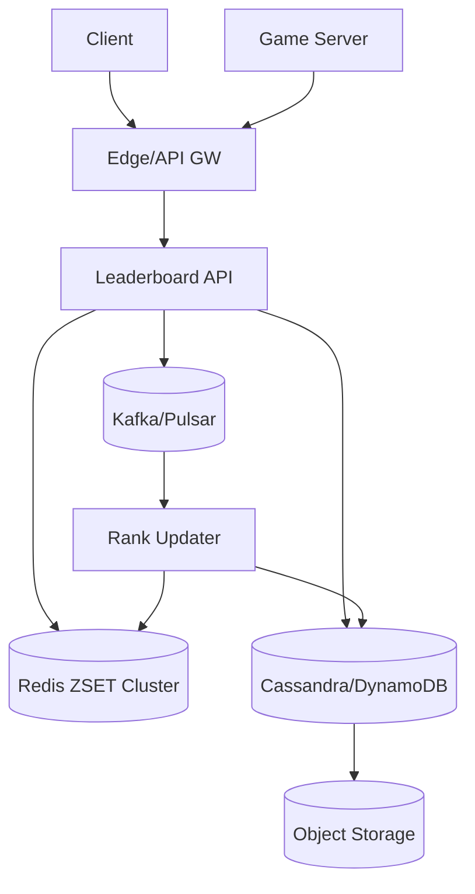
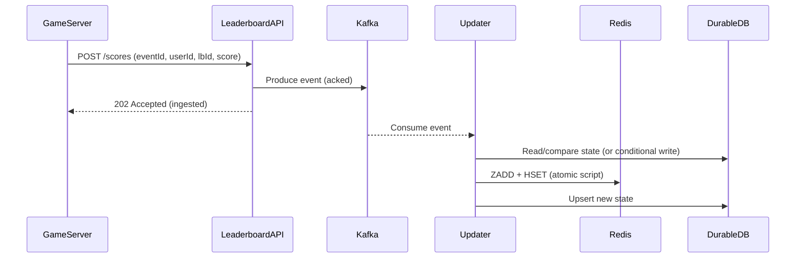

## Overview

A leaderboard system maintains ranked lists of players based on scores that change frequently. The core challenge is serving low-latency reads (top N, around-me views) at massive scale while ingesting a high volume of score updates, often with multiple leaderboard variants (global, region, mode) and time windows (daily/weekly/seasonal). Ranking is inherently order-dependent, which pushes you toward specialized indexing (sorted sets) and careful consistency choices.

The key insight is to split the problem into (1) a write-optimized ingestion path that validates and deduplicates score events, (2) a read-optimized ranking store that can answer “top N” and “rank of user” efficiently, and (3) a windowing/rollover mechanism that creates immutable historical leaderboards while keeping current leaderboards hot. Most production systems keep “active” leaderboards in an in-memory sorted structure (e.g., Redis Sorted Sets) and periodically snapshot/compact to durable storage for history, analytics, and recovery.

## Requirements

### Functional Requirements
- Update a player’s score for one or more leaderboards (e.g., global, region, game mode).
- Fetch top N players for a given leaderboard and time window (daily/weekly/season).
- Fetch a player’s rank and score, and “players around me” (e.g., ±25 positions).
- Support multiple time windows with automatic rollover (daily/weekly) and historical querying.
- Provide pagination for leaderboard reads (top lists and around-me).
- Support anti-cheat/validation hooks (rate limits, score sanity checks, server-authoritative updates).
- Support tie-breaking rules (e.g., higher score wins; ties broken by earliest timestamp).
- Expose near-real-time updates to clients (polling and/or push).

### Non-Functional Requirements
- **Scale**: 50M MAU, 5M DAU; peak 200K score updates/sec globally; peak 300K read QPS (top N / around-me). Active leaderboard cardinality: up to 10M users per major board/day.
- **Latency**: Reads P50 20ms, P99 120ms (top N, around-me). Writes P50 15ms, P99 80ms (acknowledged ingestion).
- **Availability**: 99.99% for reads; 99.9% for writes (degraded mode allowed).
- **Consistency**: Eventual consistency for leaderboard rank (seconds-level) acceptable; strong consistency for account identity and authorization; idempotent write processing required.
- **Durability**: RPO ≤ 1 minute for active windows; historical leaderboards must be durable (no loss after window close).

### Constraints & Assumptions
- Game servers are authoritative for score submissions (clients cannot write scores directly).
- Regional deployment (e.g., 3–6 regions) with geo-routing for latency.
- Budget allows Redis clusters, Kafka/Pulsar, and a durable store (Cassandra/DynamoDB + object storage).
- Compliance: PII is minimal; user display names/avatar come from a profile service (not stored in leaderboard core).

## High-Level Architecture



Clients read leaderboards via an Edge/API Gateway that handles authentication, rate limits, and routing. Score updates are accepted primarily from game servers to reduce fraud; the Leaderboard API validates requests and publishes score events to a durable log (Kafka/Pulsar). A Rank Updater consumes events, applies idempotency rules, and updates the hot ranking store (Redis sorted sets) for fast reads.

Redis serves the critical read path (top N, rank, around-me) while Cassandra/DynamoDB stores the authoritative per-user-per-leaderboard state (score, tie-break fields, last update) and supports recovery. At window rollover, snapshots of leaderboard results are written to object storage for cheap immutable history and analytics.

## Component Deep-Dive

### Edge/API Gateway

**Responsibility**: AuthN/AuthZ, request shaping, rate limiting, geo-routing, and API aggregation.

**Key Design Decisions**:
- Enforce server-authoritative writes: accept `POST /scores` from trusted game server identities; clients only read.
- Apply per-identity rate limits and anomaly detection at the edge to protect the ingestion pipeline.

**Technology Choice**: Envoy/NGINX + API Gateway (AWS API Gateway / Kong) with mTLS for game servers; JWT/OAuth for clients.

**Scaling Strategy**: Stateless horizontal scaling behind L7 load balancers; regional deployment with anycast/GeoDNS.

---

### Leaderboard API Service

**Responsibility**: Expose read APIs (top N, rank, around-me) and write APIs (score events), validate requests, and publish events.

**Key Design Decisions**:
- Write acknowledgment is “ingested” (event persisted to bus), not “rank updated,” to keep write latency low and resilient.
- Read path is cache-first (Redis) with fallback to durable store for missing user state.

**Technology Choice**: Stateless service in Go/Java; gRPC internally, REST externally; OpenTelemetry instrumentation.

**Scaling Strategy**: Stateless; autoscale on CPU and request rate; isolate read and write pools to prevent noisy neighbors.

---

### Event Bus (Kafka/Pulsar)

**Responsibility**: Durable, ordered (per key) stream of score updates enabling async ranking updates, replay, and backfill.

**Key Design Decisions**:
- Partition by `(leaderboard_id, window_id, user_id)` hash to preserve per-user ordering while distributing load.
- Use compacted topic (optional) for “latest score per key” plus an append-only topic for audit/analytics.

**Technology Choice**: Kafka (MSK/Confluent) or Pulsar; exactly-once not required if downstream is idempotent.

**Scaling Strategy**: Increase partitions and broker count; multi-AZ replication; consumer groups per region/board.

---

### Rank Updater Workers

**Responsibility**: Consume score events, enforce idempotency and update rules, write to Redis ZSETs and durable store.

**Key Design Decisions**:
- Idempotency via event IDs + per-user state compare: only apply if `(new_score, tie_break)` beats current.
- Use Lua scripts (Redis) or pipelines to update ZSET and auxiliary hashes atomically per update.

**Technology Choice**: Stream processing consumers (Flink optional); otherwise straightforward consumer workers.

**Scaling Strategy**: Scale consumer group; backpressure via bus; isolate heavy leaderboards into dedicated consumer groups.

---

### Ranking Store (Redis Cluster) + Durable Store (Cassandra/DynamoDB)

**Responsibility**: Redis provides fast ranked queries; durable store keeps authoritative user leaderboard state and supports recovery/snapshots.

**Key Design Decisions**:
- Redis schema optimized for reads: ZSET per `(leaderboard_id, window_id, shard)`; auxiliary structures for score metadata.
- Durable store uses wide-row / partition-key access patterns (per user and per leaderboard window).

**Technology Choice**: Redis Cluster (or KeyDB) for sorted sets; Cassandra or DynamoDB for durable state; S3/GCS for snapshots.

**Scaling Strategy**: Redis horizontal sharding; partition leaderboards by shard (e.g., 64 shards) to reduce hot keys; durable store scales via partition keys and throughput provisioning.

## Data Model

### Storage Schema

**Redis (hot path)**

- `lb:{lbId}:{window}:{shard}:z` (ZSET)
  - member: `userId`
  - score: `rankScore` (a packed numeric encoding)
- `lb:{lbId}:{window}:u:{userId}` (HASH)
  - `score` (int64)
  - `updatedAt` (unix ms)
  - `tie` (int64; e.g., negative timestamp for earliest-wins)
  - `eventId` (string; last applied)

**Rank score encoding (tie-break)**  
Use a monotonic mapping so Redis numeric score sorts correctly. Example: `rankScore = score * 1e6 + (1e6 - (updatedAtMs % 1e6))` to break ties by earlier update time; for more precision, store tie fields in HASH and recheck on read if needed (rare).

**Cassandra/DynamoDB (authoritative)**

Table: `leaderboard_user_state`
- `pk`: `user_id`
- `sk`: `lbId#window`
- `score` (int64)
- `tie` (int64)
- `updated_at` (timestamp)
- `last_event_id` (string)
- `version` (int64) optional (for optimistic concurrency)

Table: `leaderboard_window_meta`
- `pk`: `lbId`
- `sk`: `window`
- `status` (active|closing|closed)
- `start_at`, `end_at`
- `snapshot_uri` (string)

**Object Storage (history)**
- `snapshots/lbId/window/part-*.parquet` (top K, plus optional full ranking export)
- `snapshots/lbId/window/meta.json`

### Data Flow



Critical path: writes are accepted once the event is durably in the bus; reads are served from Redis and reflect updates after the updater processes events (typically sub-second to a few seconds).

## API Design

### Read APIs (REST)

**Get top N**
- `GET /v1/leaderboards/{lbId}/windows/{window}/top?limit=100&cursor=...`
- Response:
```json
{
  "lbId": "global",
  "window": "2025-12-17",
  "items": [
    { "userId": "u1", "rank": 1, "score": 9912, "updatedAt": 1734400000000 }
  ],
  "nextCursor": "..."
}
```
- Errors: `404` (unknown window), `429` (rate limit), `503` (degraded reads).
- Pagination: cursor is `(shard, offset)` or `(lastScore,lastUserId)` style.

**Get my rank**
- `GET /v1/leaderboards/{lbId}/windows/{window}/users/{userId}`
- Response:
```json
{ "userId": "u9", "rank": 120392, "score": 102, "percentile": 97.6 }
```

**Around me**
- `GET /v1/leaderboards/{lbId}/windows/{window}/users/{userId}/around?above=25&below=25`
- Response includes neighbors with ranks.

### Write API (server-authoritative)

**Submit score event**
- `POST /v1/scores`
- Request:
```json
{
  "eventId": "uuid",
  "userId": "u9",
  "lbId": "global",
  "window": "2025-12-17",
  "scoreDelta": 5,
  "mode": "increment"
}
```
- Response: `202 Accepted` with `ingestedAt` and `eventId`.

**Idempotency**
- Require `eventId` unique per score action; store `last_event_id` per `(user, lbId, window)` and/or maintain a short-lived Redis set `idem:{userId}` with TTL (e.g., 24h) for dedupe.
- If duplicate `eventId`, return `200 OK` (or `202`) with same result semantics.

**Update semantics**
- Common modes:
  - `increment` (server authoritative delta)
  - `max` (keep best score only; typical for high-score games)
- Validate bounds (e.g., delta <= 10k) and rate limits per user/session.

## Scaling & Performance

### Bottleneck Analysis
- **Hot leaderboards (global daily)**: concentrated reads/writes; mitigate with sharding and caching.
- **Redis memory pressure**: millions of members per ZSET; mitigate with top-K retention for very large boards (optional), compression of metadata, and TTL on per-window keys.
- **Bus lag**: spikes cause delayed ranks; mitigate with autoscaling consumers, partition count, and load shedding.
- **Rank computations around-me**: requires rank lookup + range fetch; optimize via `ZRANK` + `ZRANGE` in pipeline or Lua.

### Horizontal Scaling
- **API layer**: stateless autoscaling; separate read/write deployments.
- **Kafka/Pulsar**: add partitions; partition by `(lbId, window)` and hash user to spread load.
- **Redis**:
  - Shard per leaderboard window: `shard = hash(userId) % N`.
  - For top N across shards: maintain an additional “global-top” ZSET updated by workers, or query all shards and merge (N small like 16–64).
- **Durable store**: partition by `user_id` (fast user lookups) and optionally secondary index/materialized view for analytics.

### Caching Strategy
- **Primary cache**: Redis is the leaderboard itself (not merely a cache).
- **Edge caching**: cache `GET top` for small TTL (1–5s) to absorb spikes.
- **Client caching**: ETag/If-None-Match for top lists with short TTL.
- **Invalidation**: time-based TTLs; avoid explicit invalidations due to high churn.

## Trade-offs & Alternatives

### Key Trade-offs Made
- **Async rank updates (eventual consistency)**:
  - Chosen: bus + updater workers
  - Sacrificed: immediate rank accuracy after write
  - Why: enables high write throughput, isolates spikes, supports replay/backfill.
- **Redis sorted sets for ranking**:
  - Chosen: ZSETs for `top N` and `rank`
  - Sacrificed: higher memory cost, operational complexity of Redis clusters
  - Why: simplest way to achieve sub-100ms P99 ranking queries at scale.
- **Sharded leaderboards**:
  - Chosen: multiple ZSET shards
  - Sacrificed: more complex top-N aggregation
  - Why: prevents single-key hot spots and spreads memory/CPU.

### Alternative Approaches
- **Relational DB with indexed scores**: workable for small scale; struggles with high update rates and rank queries at massive cardinality.
- **Custom ranking service (skip list / segment tree)**: efficient but complex to implement/operate; Redis provides battle-tested primitives.
- **Streaming-first (Flink + RocksDB state)**: great for advanced windowing and analytics; heavier operational footprint than needed for interview-grade production.

## Failure Modes & Mitigations

### Failure Scenarios
- **Redis node/cluster outage**
  - Impact: read path degraded or unavailable; rank updates fail
  - Detection: Redis health checks, error rate, latency alerts
  - Mitigation: multi-AZ Redis, client-side failover, serve stale from edge cache, rebuild from durable store + bus replay.
- **Kafka broker outage / partition unavailability**
  - Impact: write ingestion fails or delays; rank becomes stale
  - Detection: produce errors, ISR shrink, consumer lag
  - Mitigation: RF=3, min.insync.replicas, multi-AZ, fallback “best effort” writes to durable store when bus unavailable (optional).
- **Consumer lag spike**
  - Impact: ranks stale by seconds/minutes
  - Detection: consumer lag metrics, time-to-apply SLO
  - Mitigation: autoscale consumers, prioritize hot leaderboards, shed low-priority boards, batch updates with pipelines.
- **Duplicate or out-of-order events**
  - Impact: incorrect scores
  - Detection: anomaly checks, audit logs
  - Mitigation: idempotency keys, compare-and-set using `(score,tie)` rules, ignore stale updates.
- **Cheat attempts (client spoofing)**
  - Impact: leaderboard integrity
  - Detection: edge auth failures, statistical anomaly detection
  - Mitigation: server-only write tokens (mTLS), per-match attestation, manual review tooling.

### Disaster Recovery
- **RTO/RPO**: RTO 30 minutes (regional); RPO 1 minute for active leaderboards; RPO 0 for closed snapshots.
- **Backup strategy**: nightly durable store backups + continuous snapshots; Redis state considered rebuildable from bus + durable store.
- **Failover**: multi-region active-active for reads; writes routed to nearest region with replication of events cross-region (MirrorMaker/Pulsar geo-replication); on region loss, promote another region’s bus and replay.

## Operational Considerations

### Monitoring & Alerting
- Key metrics:
  - API: QPS, P50/P99 latency, 4xx/5xx rates
  - Bus: produce/consume rate, consumer lag, ISR count
  - Redis: memory usage, ops/sec, command latency, evictions
  - Correctness: time-to-reflect-update, duplicate event rate, anomaly score distributions
- Alerts:
  - P99 read latency > 150ms for 5m
  - Consumer lag > 30s for hot leaderboards
  - Redis evictions > 0 sustained
  - Write ingest error rate > 1% for 5m

### Deployment Strategy
- Use canary + gradual rollout (5% → 25% → 100%) with automatic rollback on SLO regression.
- Schema evolution:
  - Additive changes to durable store; versioned event schema on bus (protobuf with compatibility rules).
- Rollback:
  - Keep old consumers running until new version proven; ability to pause consumers if a bad update rule is deployed.

## References & Further Reading
- Redis Sorted Sets: https://redis.io/docs/latest/develop/data-types/sorted-sets/
- Kafka: Exactly-once vs idempotent processing: https://kafka.apache.org/documentation/
- DynamoDB design patterns (leaderboards): https://docs.aws.amazon.com/amazondynamodb/latest/developerguide/bp-general-nosql-design.html
- “The Log: What every software engineer should know about real-time data’s unifying abstraction” (Jay Kreps): https://engineering.linkedin.com/distributed-systems/log-what-every-software-engineer-should-know-about-real-time-datas-unifying
- Study implementations: Riot/League ranked ladders (conceptually), Redis-based leaderboards in gaming backends, and streaming architectures in high-scale telemetry systems