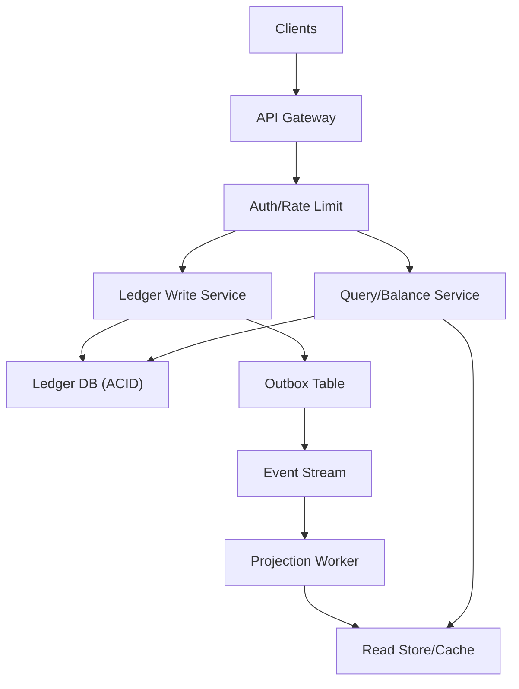
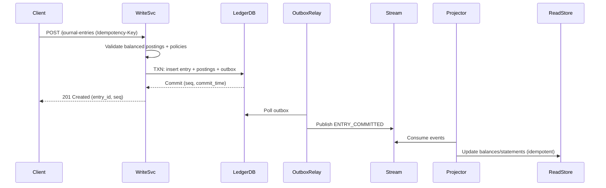

## Overview

A banking ledger is the system of record for money movement: every balance, statement, and audit trail ultimately depends on it. The hard part isn’t “storing transactions”, but guaranteeing **immutability**, **correct accounting (double-entry)**, and **verifiable integrity** under concurrency, failures, insider risk, and regulatory scrutiny—while still serving low-latency balance reads and high-throughput writes.

This design treats the ledger as an append-only journal of **balanced journal entries** (double-entry postings), then builds **derived projections** (balances, statements, analytics) from that immutable source. To make the ledger tamper-evident, each entry is linked into a **hash chain** and periodically committed into a **Merkle root checkpoint** signed by an HSM/KMS key (optionally anchored externally). Any modification, deletion, or re-ordering becomes cryptographically detectable, even if an attacker gains database access.

Key insight: separate (1) the immutable accounting journal (strong consistency + cryptographic integrity) from (2) scalable read models (materialized views, caches), and use transactional outbox/CDC to keep them synchronized.

## Requirements

### Functional Requirements
- Create an immutable, append-only **journal entry** containing one or more postings.
- Enforce **double-entry accounting**: total debits == total credits (by currency) for every journal entry.
- Support **idempotent writes** to prevent duplicate entries during retries/timeouts.
- Retrieve journal entries and postings by ID, account, time range, and correlation/reference IDs.
- Provide fast **balance** and **available balance** reads per account (current + as-of timestamp).
- Support **reversals/corrections** via new compensating entries (no mutation of history).
- Provide **cryptographic proofs** that an entry is included in the ledger and the ledger has not been tampered with (hash chain + Merkle checkpoint proof).
- Stream ledger events to downstream consumers (statements, risk, AML, data warehouse) reliably.

### Non-Functional Requirements
- **Scale**:
  - Peak writes: 2,500 journal entries/sec (≈10,000 postings/sec)
  - Peak reads: 50,000 QPS (balances + statements)
  - Accounts: up to 50M; ledgers/tenants: up to 10k
  - Data: ~5–10 TB/month of journal+postings (compressed, partitioned)
- **Latency**:
  - Write commit: P50 40ms, P99 200ms
  - Balance read: P50 5ms (cache), P99 50ms (DB)
  - Proof generation: P99 300ms (mostly CPU + storage reads)
- **Availability**: 99.99% for reads, 99.95% for writes (writes require quorum/consensus)
- **Consistency**:
  - **Strong** for journal entry writes and “read-your-writes” on balances within a ledger.
  - **Eventual** for analytics/warehouse and non-critical derived views.
- **Durability**: RPO ~ 0 for committed entries; no acknowledged write loss.

### Constraints & Assumptions
- Regulated environment: immutable audit trail, 7–10 year retention, least-privilege access, full traceability.
- Multi-tenant: tenant/ledger isolation at the logical level (and optionally physical).
- Team can operate a distributed SQL database (or uses a managed offering).
- Network access to public services may be restricted; integrity anchoring can be internal if needed.

## High-Level Architecture



The write path goes through a single logical **Ledger Write Service** that validates business rules (double-entry, policies like “no negative available balance”), computes cryptographic hashes, and commits to an ACID database in one transaction. To reliably notify downstream systems, it also writes an **outbox record** in the same transaction; a relay publishes outbox events to the stream.

Reads are served primarily from **derived projections** (read store + cache) for low latency and high QPS, with the immutable ledger DB as the source of truth for audits and backfills. This separation keeps the journal append-only and verifiable while still meeting performance requirements.

## Component Deep-Dive

### Ledger Write Service

**Responsibility**: Validate and commit journal entries atomically; enforce double-entry; compute hash chain fields; implement idempotency.

**Key Design Decisions**:
- Enforce invariants at write time (balanced postings, currency rules, account status) to prevent corrupt history.
- Use transactional outbox to guarantee “committed entry ⇒ published event” without dual-write races.

**Technology Choice**: Go/Java service + gRPC/REST; database-backed idempotency keys; canonical serialization for hashing.

**Scaling Strategy**: Stateless horizontal scaling behind L7 load balancer; partition-aware routing by `ledger_id` to reduce hot spots; backpressure when DB latency increases.

---

### Ledger Database (Immutable Journal)

**Responsibility**: Store the append-only journal entry and posting records with strong consistency and durability.

**Key Design Decisions**:
- Use a strongly-consistent distributed SQL DB to support multi-row transactions across entry + postings + (optional) position updates.
- Make journal tables append-only via access controls (no UPDATE/DELETE for application roles) and periodic integrity scans.

**Technology Choice**: Google Spanner, CockroachDB, YugabyteDB, or Aurora Postgres (single-region strong consistency with read replicas). Prefer Spanner/Cockroach for horizontal write scaling.

**Scaling Strategy**: Partition by `(ledger_id, commit_time)`; time-based table partitioning; hot-ledger isolation via per-ledger partitions; read replicas for audit queries.

---

### Integrity & Proof Service

**Responsibility**: Provide tamper-evidence: entry hash chain, Merkle checkpoints, inclusion proofs, and signed checkpoint roots.

**Key Design Decisions**:
- Hash-chain each entry within a ledger partition to detect re-ordering/removal/in-place edits.
- Periodically build Merkle trees (e.g., per hour/day per ledger partition) and sign the root with KMS/HSM.

**Technology Choice**: SHA-256; canonical JSON/Protobuf hashing; KMS/HSM for signing; optional external anchoring (e.g., publish root to an independent system).

**Scaling Strategy**: Batch checkpoint building; parallelize by ledger partition; cache proofs for recently requested ranges.

---

### Projection Worker + Read Store

**Responsibility**: Build and serve fast balance/statement queries from immutable events (materialized views).

**Key Design Decisions**:
- Treat projections as rebuildable state derived from the ledger (safe to update/mutate).
- Use exactly-once or effectively-once processing via idempotent consumers and per-entry sequence tracking.

**Technology Choice**: Kafka/PubSub + consumer group; Redis for balance cache; read store in Postgres/Elastic/DynamoDB depending on query patterns.

**Scaling Strategy**: Consumer parallelism by partition key `(ledger_id, partition_id)`; incremental snapshots; cache with versioning (`last_entry_seq`).

## Data Model

### Storage Schema

**accounts**
- `account_id` (PK, UUID)
- `ledger_id` (tenant)
- `currency` (ISO-4217)
- `status` (ACTIVE|FROZEN|CLOSED)
- `policy` (JSON: overdraft, limits)
- `created_at`

**journal_entries** (append-only)
- `entry_id` (PK, UUID/ULID)
- `ledger_id`
- `client_request_id` (idempotency key, unique per ledger)
- `effective_time` (business time)
- `commit_time` (DB commit timestamp)
- `description`
- `metadata` (JSON)
- `partition_id` (derived from time bucket)
- `seq` (monotonic within `(ledger_id, partition_id)`)
- `prev_entry_hash` (bytes)
- `entry_hash` (bytes)

**postings** (append-only)
- `posting_id` (PK)
- `entry_id` (FK)
- `ledger_id`
- `account_id`
- `currency`
- `direction` (DEBIT|CREDIT)
- `amount_minor` (int64; minor units)
- `instrument` (optional: card, bank transfer)
- `posting_hash` (bytes)  (hash of canonical posting fields)

**ledger_checkpoints**
- `ledger_id`
- `partition_id`
- `window_start`, `window_end`
- `merkle_root` (bytes)
- `root_signature` (bytes) (KMS/HSM)
- `entry_seq_start`, `entry_seq_end`
- `created_at`

**outbox**
- `event_id` (PK)
- `ledger_id`
- `entry_id`
- `type` (ENTRY_COMMITTED)
- `payload` (JSON/Proto)
- `created_at`
- `published_at` (nullable)

**read model (derived) – account_positions** (mutable)
- `ledger_id`, `account_id` (PK)
- `currency`
- `posted_balance_minor`
- `available_balance_minor`
- `last_entry_seq`
- `updated_at`

**Double-entry enforcement**
- Application validates: for each currency in the entry, `sum(debits) == sum(credits)`.
- Optional DB guardrails:
  - `postings.amount_minor > 0`
  - `postings.direction IN (...)`
  - Prevent cross-ledger posting (FK + `ledger_id` consistency).
  - `journal_entries.client_request_id` unique to enforce idempotency.

### Data Flow



## API Design

### Create Journal Entry
`POST /v1/ledgers/{ledger_id}/journal-entries`

Headers:
- `Idempotency-Key: <uuid>` (required)
- `X-Request-Signature: <optional>` (client-signed request, optional)

Request (JSON):
```json
{
  "effective_time": "2025-12-17T10:00:00Z",
  "description": "Transfer",
  "postings": [
    {"account_id": "A", "currency": "USD", "direction": "DEBIT", "amount_minor": 1000},
    {"account_id": "B", "currency": "USD", "direction": "CREDIT", "amount_minor": 1000}
  ],
  "metadata": {"correlation_id": "abc-123"}
}
```

Response `201`:
```json
{
  "entry_id": "01J…",
  "ledger_id": "…",
  "commit_time": "2025-12-17T10:00:01.123Z",
  "seq": 981273,
  "entry_hash": "base64…"
}
```

Errors:
- `400 INVALID_ENTRY` (unbalanced, invalid currency, negative amount)
- `409 IDEMPOTENCY_CONFLICT` (same key, different payload hash)
- `422 POLICY_VIOLATION` (e.g., insufficient available balance)
- `503 DB_UNAVAILABLE` (retryable)

Idempotency:
- Store `(ledger_id, idempotency_key) -> entry_id + request_hash`.
- On retry: if hash matches, return the original `201` response; else `409`.

---

### Get Journal Entry
`GET /v1/ledgers/{ledger_id}/journal-entries/{entry_id}`

Response includes postings and cryptographic fields (`prev_entry_hash`, `entry_hash`, `seq`).

---

### Get Account Balance
`GET /v1/ledgers/{ledger_id}/accounts/{account_id}/balance?as_of=2025-12-17T10:00:00Z`

Behavior:
- If `as_of` omitted, return current from read model (fast path).
- If historical/as-of, query ledger or time-partitioned projection.

---

### Get Cryptographic Proof
`GET /v1/ledgers/{ledger_id}/journal-entries/{entry_id}/proof`

Response:
```json
{
  "entry_hash": "base64…",
  "merkle_root": "base64…",
  "merkle_path": ["base64…", "base64…"],
  "checkpoint": {
    "window_start": "…",
    "window_end": "…",
    "root_signature": "base64…",
    "signing_key_id": "kms://…"
  }
}
```

Verification approach:
- Client recomputes `posting_hash` and `entry_hash` from canonical fields.
- Verify hash chain linkage (`prev_entry_hash`).
- Verify Merkle inclusion against signed checkpoint root.

## Scaling & Performance

### Bottleneck Analysis
- **Write hot spots**: a single ledger/account receiving most writes.
  - Mitigate with per-ledger partitioning and monotonic `seq` per partition; avoid global counters.
- **Balance reads**: high QPS on a small set of accounts.
  - Mitigate with Redis cache keyed by `(ledger_id, account_id)` + version (`last_entry_seq`).
- **Large statements**: scanning postings for long ranges.
  - Mitigate with statement projections, time partitions, and pagination by `(commit_time, entry_id)`.

### Horizontal Scaling
- **API layer**: stateless, autoscaled.
- **Write service**: shard-aware routing by `ledger_id`; admission control under DB pressure.
- **Ledger DB**: range/partition by `(ledger_id, commit_time)`; separate large tenants to dedicated clusters if needed.
- **Stream + projector**: partition by `(ledger_id, partition_id)`; scale consumers by partitions.

### Caching Strategy
- Cache:
  - Current balances and account status (TTL 1–5s or versioned invalidation).
  - Recent journal entry lookups (TTL 30–120s).
- Invalidation:
  - On projection update, publish `BALANCE_UPDATED(ledger_id, account_id, last_entry_seq)` to invalidate/update cache.
  - For strict read-your-writes, client can pass `min_seq` and service falls back to DB if cache is behind.

## Trade-offs & Alternatives

### Key Trade-offs Made
- **Chosen**: Strongly consistent DB for journal writes.
  - **Sacrificed**: Lower cost and simpler ops of eventually consistent stores.
  - **Why**: Accounting invariants + atomic multi-row writes are simpler and safer under ACID.
- **Chosen**: Immutable source + mutable projections.
  - **Sacrificed**: Simplicity of “one DB table for everything”.
  - **Why**: Enables high-QPS reads without weakening integrity guarantees.
- **Chosen**: Hash chain + signed Merkle checkpoints.
  - **Sacrificed**: Extra compute/storage and operational complexity (key mgmt, checkpoint jobs).
  - **Why**: Detects tampering even with privileged DB access; supports audit-grade proofs.

### Alternative Approaches
- **Use AWS QLDB / Azure Confidential Ledger**:
  - Pros: built-in cryptographic verification and managed ops.
  - Cons: vendor constraints, query limitations, integration complexity for projections.
- **Event sourcing only (Kafka as source of truth)**:
  - Pros: high throughput, simple append-only log.
  - Cons: hard to enforce strict invariants and idempotency under failures without a transactional store.
- **Single Postgres with logical replication**:
  - Pros: simplest stack; strong constraints; great SQL.
  - Cons: vertical write scaling limits; multi-region HA is harder; may not meet peak TPS.

## Failure Modes & Mitigations

### Failure Scenarios
- **Scenario**: Client retries after timeout causing duplicate entry.
  - **Impact**: Double posting (financially catastrophic).
  - **Detection**: Idempotency store shows existing key.
  - **Mitigation**: Enforce unique `(ledger_id, client_request_id)` and return original result.

- **Scenario**: Dual-write race (DB commit succeeds, event publish fails).
  - **Impact**: Projections lag; balances stale.
  - **Detection**: Outbox backlog + projector lag metrics.
  - **Mitigation**: Transactional outbox + retrying relay; idempotent consumers.

- **Scenario**: Insider modifies ledger rows.
  - **Impact**: Silent corruption without cryptographic checks.
  - **Detection**: Hash chain / Merkle root mismatch during audit or continuous verifier job.
  - **Mitigation**: Append-only permissions, immutable backups (WORM), continuous integrity verification, signed checkpoints, separation of duties.

- **Scenario**: Partition/leader outage in distributed DB.
  - **Impact**: Write unavailability for affected range.
  - **Detection**: Elevated commit latency + error rate.
  - **Mitigation**: Multi-zone quorum, automatic failover, client-side retry with jitter, overload protection.

- **Scenario**: Projection bug produces wrong balances.
  - **Impact**: Incorrect UI/decisions; journal still correct.
  - **Detection**: Reconciliation jobs comparing projected balances vs ledger recompute.
  - **Mitigation**: Rebuild projections from journal; versioned projector rollouts; canary reconciliation.

### Disaster Recovery
- **RTO/RPO**: RTO 30–60 minutes; RPO ~ 0 for committed entries.
- **Backup strategy**: Continuous PITR + daily full backups; immutable/WORM storage; periodic restore drills.
- **Failover procedures**: Multi-zone for primary; optional warm standby in second region with async replication; promote with runbook and checkpoint reconciliation.

## Operational Considerations

### Monitoring & Alerting
- Write path: `commit_latency_p99`, `write_error_rate`, `idempotency_conflicts`, `db_txn_retries`.
- Stream/projection: `outbox_lag`, `consumer_lag`, `projection_apply_latency`, `reconciliation_mismatch_count`.
- Integrity: `checkpoint_job_success`, `hash_chain_gap_detected`, `merkle_proof_failures`.
- Alerts:
  - P99 write latency > 250ms for 5m
  - Outbox lag > 60s for 10m
  - Any integrity mismatch (page immediately)

### Deployment Strategy
- Backward-compatible changes first (additive schemas, tolerant readers).
- Canary release of writer + projector together; feature flags for new posting rules.
- Rollback:
  - Writer rollback safe if API remains compatible.
  - Projector rollback via consumer group reset + rebuild from journal if needed.

## References & Further Reading
- AWS QLDB: https://docs.aws.amazon.com/qldb/
- Certificate Transparency (Merkle trees, append-only logs): https://certificate.transparency.dev/
- Transactional Outbox pattern: https://microservices.io/patterns/data/transactional-outbox.html
- Google Spanner TrueTime & consistency: https://research.google/pubs/pub39966/
- CockroachDB serializable transactions: https://www.cockroachlabs.com/docs/stable/transaction-isolation.html
- Double-entry accounting basics (for invariant definitions): https://en.wikipedia.org/wiki/Double-entry_bookkeeping