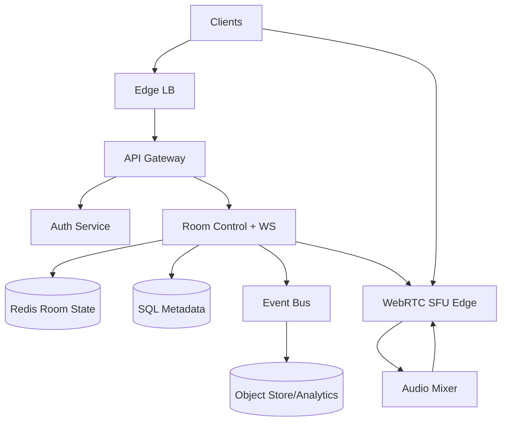
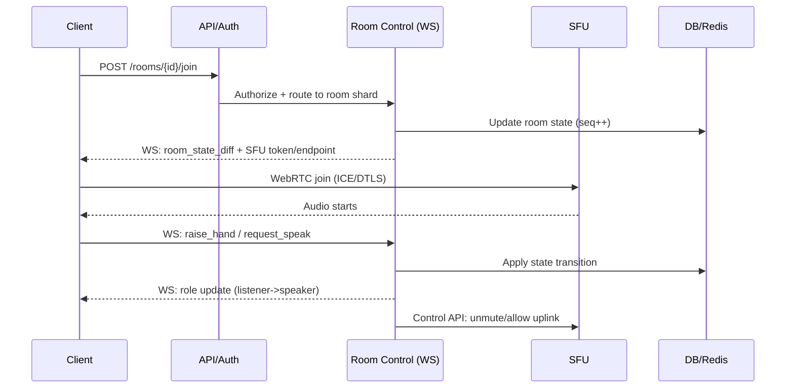

## Overview

Live audio rooms (Clubhouse/Twitter Spaces) combine two hard problems: ultra-low-latency media delivery and strongly ordered, real-time “stage” state (hosts, speakers, listeners, hand-raises, mutes, kicks) across thousands to millions of concurrent users. The media plane must handle jitter, packet loss, NAT traversal, and fan-out, while the control plane must provide deterministic moderation outcomes and fast state convergence.

The key insight is to split the system into two planes: (1) a **control plane** that owns room state and moderation (strong ordering per room), and (2) a **media plane** optimized for real-time audio transport and fan-out. For scalability, use **WebRTC + SFU** for interactive low latency, plus **server-side mixing** (or a broadcast track) to reduce downstream complexity and cost for large listener audiences.

This design targets production readiness: predictable state under concurrent actions, scalable fan-out via cascaded SFUs, operational guardrails, and clear trade-offs between latency, cost, and scale.

## Requirements

### Functional Requirements
- Create/schedule rooms; start/end rooms; room discovery (trending/following).
- Join as listener; request to speak (“raise hand”); invite/promote/demote speakers.
- Host/co-host moderation: mute/unmute speakers, remove users, block/restrict, lock room.
- Real-time room state updates: participant list, roles, speaking indicators, hand-raise queue.
- Low-latency audio: speaker-to-listener delivery with adaptive jitter handling.
- Abuse controls: rate-limits, reporting, ban evasion friction (device/account signals).
- Optional but common: recording + replay, captions/transcription, analytics.

### Non-Functional Requirements
- **Scale**
  - 10M MAU, 1M DAU, peak 200K concurrent listeners, 20K concurrent rooms.
  - Peak room: 20 speakers, 100K listeners.
  - Control plane: 50K QPS (joins/leaves/state ops), 200K WS msg/s bursts.
  - Media: ~24–48 kbps Opus per downstream listener (mono), ~32 kbps upstream per speaker.
- **Latency**
  - Join-to-audio start: P50 800ms, P99 2.5s.
  - Speaker → listener: P50 150ms, P99 400ms (interactive WebRTC path).
  - Control events (mute/kick/role change): P50 80ms, P99 250ms.
- **Availability**
  - Control plane: 99.99% monthly.
  - Media plane: 99.95% (real-time networks are harsher; aim with redundancy).
- **Consistency**
  - **Strong ordering per room** for moderation/state transitions.
  - **Eventual** for discovery, counts, analytics, trending.
- **Durability**
  - Room metadata: RPO ≤ 1 minute, RTO ≤ 15 minutes.
  - Live audio: ephemeral (no durability requirement unless recording enabled).
  - Moderation/audit events: immutable log, RPO ≤ 1 minute.

### Constraints & Assumptions
- Small-to-medium team (8–12 engineers) operating a multi-region cloud deployment.
- GDPR/CCPA compliance for user data; optional recording requires explicit consent + retention policies.
- Mobile-first clients; must tolerate poor networks (cellular, high jitter).
- Network access to install packages is restricted in this environment; design is technology-agnostic but concrete.

## High-Level Architecture

Clients use REST for discovery and a persistent WebSocket for real-time room state and signaling coordination. The **Room Control** service is authoritative for each room’s state, serializing all role/moderation operations to avoid race conditions. The **SFU edge** handles WebRTC transport and scalable fan-out; a **mixer** produces a single mixed audio track (or a small set of tracks) for efficient broadcast to large listener sets while preserving an interactive path for speakers.

This separation keeps correctness concerns (moderation/state) out of the latency-critical media pipeline, while allowing the media plane to scale independently (more SFUs in more regions/PoPs) without changing the control plane’s semantics.

## Component Deep-Dive

### Client Apps (iOS/Android/Web)

**Responsibility**: UX, WebRTC audio capture/playback, local mixing (if needed), reconnection, and rendering real-time state.

**Key Design Decisions**:
- Use WebRTC with Opus, jitter buffer tuning, and audio device handling per platform.
- Maintain two channels: REST for fetches; WS for room state + signaling to minimize polling.

**Technology Choice**: Native WebRTC stacks (iOS WebRTC, Android WebRTC, WebRTC in browsers) + WS client.

**Scaling Strategy**: Client-side; focus on resilience (ICE restarts, WS reconnect with backoff, state resync).

### API Gateway + Auth

**Responsibility**: Request routing, authn/z, rate limiting, WAF, request validation.

**Key Design Decisions**:
- JWT/OAuth2 access tokens; short-lived room-scoped tokens minted for WS and SFU join.
- Separate “user auth” from “media auth” to reduce blast radius of leaked media tokens.

**Technology Choice**: Envoy/NGINX gateway + internal auth service (or managed API gateway).

**Scaling Strategy**: Stateless horizontal scaling; global anycast/edge termination; per-user and per-IP rate limits.

### Room Control + WebSocket (Authoritative Room State)

**Responsibility**: Room lifecycle, participant roles, moderation actions, hand-raise queue, speaking indicators, WS fan-out of state diffs, and SFU orchestration.

**Key Design Decisions**:
- **Single-writer per room** via shard ownership (consistent hash + lease) to guarantee ordered decisions.
- Represent state as a compact state machine; emit immutable events for audit and replay.

**Technology Choice**: Stateful service with shard ownership using etcd/Consul/ZooKeeper leases; Redis for fast state snapshots; Kafka/Pulsar for event bus.

**Scaling Strategy**:
- Partition by `room_id` across room-controller shards.
- Sticky WS routing to the owning shard; fast failover by lease re-acquisition and client resync.

### WebRTC SFU Edge (Media Plane)

**Responsibility**: ICE/DTLS-SRTP termination, RTP forwarding, congestion control, simulcast (optional), and fan-out to listeners.

**Key Design Decisions**:
- SFU (not mesh) to avoid N² growth; keep speakers interactive with low latency.
- Cascaded SFUs: “core room SFU” ingests speakers; “edge SFUs” replicate downstream close to listeners.

**Technology Choice**: mediasoup / Janus / Jitsi Videobridge / LiveKit-style SFU; TURN (coturn) for NAT traversal.

**Scaling Strategy**:
- Scale by adding SFU nodes; schedule rooms based on CPU/network budget.
- For large rooms, attach more edge SFUs and replicate mixed/broadcast track.

### Audio Mixer (Server-Side Mixing + Leveling)

**Responsibility**: Combine multiple speaker tracks into a broadcast mix, apply AGC/limiting, and produce audio-level events.

**Key Design Decisions**:
- Mix once per room to reduce per-listener complexity and bandwidth overhead of multi-track delivery.
- Keep an “interactive” path for speakers (optionally un-mixed) to preserve conversational feel.

**Technology Choice**: SFU-integrated mixing or dedicated mixer process using WebRTC/RTP pipeline (e.g., GStreamer/FFmpeg/libwebrtc audio).

**Scaling Strategy**:
- One mixer instance per active large room; autoscale by speaker count and DSP CPU usage.

## Data Model

### Storage Schema

**PostgreSQL (metadata)**
- `users(user_id, handle, created_at, status, region_home, ...)`
- `rooms(room_id, creator_id, title, description, visibility, status, region, created_at, started_at, ended_at, recording_enabled, ...)`
- `room_membership(room_id, user_id, role, joined_at, left_at, last_seen_at, UNIQUE(room_id,user_id))`
- `moderation_actions(action_id, room_id, actor_id, target_id, action_type, reason, created_at, idempotency_key)`
- `room_bans(room_id, user_id, banned_until, reason, created_at)`

**Redis (authoritative fast state snapshot; TTL-based)**
- `room:{room_id}:state` → serialized state machine snapshot (roles, speaker list, hand-raises)
- `room:{room_id}:seq` → monotonically increasing sequence for ordering
- `room:{room_id}:presence` → small presence set for quick counts (approximate)

**Event Bus (Kafka/Pulsar)**
- Topic `room-events` partitioned by `room_id`: `ROOM_CREATED`, `USER_JOINED`, `ROLE_CHANGED`, `MUTED`, `KICKED`, `ROOM_ENDED`, etc.

**Object Store (optional)**
- `recordings/{room_id}/{segment_ts}.aac` + manifest
- `transcripts/{room_id}.json`

### Data Flow

## API Design

### REST (Discovery + Room Lifecycle)
- `POST /v1/rooms`
  - Req: `{ "title": "...", "visibility": "public|followers", "recording_enabled": false }`
  - Resp: `{ "room_id": "r_123", "region": "us-east-1" }`
- `POST /v1/rooms/{room_id}/join`
  - Resp: `{ "ws_url": "wss://.../rooms/{room_id}", "ws_token": "...", "sfu_url": "wss://sfu-edge.../", "sfu_token": "...", "resume_token": "..." }`
  - Idempotency: `Idempotency-Key` header (handles retries on flaky mobile networks)
- `POST /v1/rooms/{room_id}/leave`
- `GET /v1/rooms?feed=trending|following`
- `GET /v1/rooms/{room_id}`

**Errors**
- `401/403` auth/role violations, `404` room not found, `409` invalid state transition, `429` rate limited, `503` overloaded (retry w/ backoff).

### WebSocket (Room State + Commands)
Client sends:
- `{"type":"raise_hand","room_id":"r_123","client_msg_id":"..."}`
- `{"type":"accept_speaker","target_user_id":"u_9","client_msg_id":"..."}` (host/co-host)
- `{"type":"mute","target_user_id":"u_9","client_msg_id":"..."}`

Server pushes:
- `{"type":"state_diff","seq":1029,"diff":{...}}`
- `{"type":"error","client_msg_id":"...","code":"ROLE_DENIED"}`
- `{"type":"sfu_update","action":"ICE_RESTART","sfu_url":"...","token":"..."}`

**Idempotency**
- Every command includes `client_msg_id`; Room Control dedupes per `(room_id,user_id,client_msg_id)` for a retention window (e.g., 10 minutes).

### SFU Control API (Internal)
- gRPC `SetParticipantPermissions(room_id, user_id, can_send_audio, can_receive_audio)`
- gRPC `MoveToEdge(room_id, listener_id, edge_sfu_id)`
- gRPC `StartMixer(room_id)` / `StopMixer(room_id)`

## Scaling & Performance

### Bottleneck Analysis
- **WS fan-out**: large rooms can generate heavy state update traffic.
  - Mitigation: compact diffs, per-room sequence, coalesce updates (e.g., 50–100ms tick), avoid full participant lists; use presence summaries.
- **SFU egress bandwidth**: 100K listeners dominates cost.
  - Mitigation: cascaded SFUs + single mixed track; regional edges; optionally degrade to slightly higher latency broadcast mode for overflow.
- **Room controller hot shards**: celebrity rooms overload a single controller.
  - Mitigation: keep controller lightweight (state + orchestration only), push heavy work to SFU/mixer; isolate “mega rooms” onto dedicated controller instances.

### Horizontal Scaling
- **API/Auth**: stateless; scale by QPS.
- **Room Control**: shard by `room_id`; single-writer per room; add shards to scale.
- **SFU**: schedule rooms to SFUs based on network/CPU; add edge PoPs; use cascade replication for mega rooms.
- **Data**: Postgres read replicas for discovery; Redis cluster for room state; Kafka partitions by `room_id`.

### Caching Strategy
- Cache room discovery feeds (trending/following) for 5–30s with jitter.
- Cache room metadata (`GET /rooms/{id}`) for 1–5s; invalidate on state changes (start/end/visibility).
- Avoid caching real-time moderation state outside Room Control; treat WS as source of truth.

## Trade-offs & Alternatives

### Key Trade-offs Made
- **Chosen**: SFU + server-side mixing for listeners  
  **Sacrificed**: Some flexibility (per-listener custom mixes), added mixer complexity  
  **Why**: Predictable scaling and cost for large rooms; simpler client playback.
- **Chosen**: Single-writer room controller (ordered state machine)  
  **Sacrificed**: Harder shard failover; requires sticky routing/resync logic  
  **Why**: Moderation correctness and deterministic outcomes under concurrency.
- **Chosen**: WebRTC for real-time path  
  **Sacrificed**: Operational complexity (ICE/TURN), more moving parts than HLS  
  **Why**: Sub-500ms latency required for “live room” feel.

### Alternative Approaches
- **MCU-only (full mixing per participant)**: simpler client, but expensive CPU and less scalable for many speakers/rooms.
- **LL-HLS/Chunked CMAF for listeners**: cheaper fan-out via CDN and huge scale, but adds 1–3s latency and weaker interactivity.
- **CRDT-based distributed room state**: improves availability, but moderation semantics and ordering are harder to guarantee and reason about.

## Failure Modes & Mitigations

### Failure Scenarios
- **Scenario**: Room controller instance crashes  
  **Impact**: WS disconnect; temporary inability to moderate  
  **Detection**: Lease expiration/health checks; WS disconnect spikes  
  **Mitigation**: Reassign shard via lease; clients reconnect using `resume_token`; state rebuilt from Redis snapshot + recent events.
- **Scenario**: SFU node failure mid-room  
  **Impact**: Audio drop for connected participants  
  **Detection**: SFU heartbeat loss; client RTCP timeouts  
  **Mitigation**: ICE restart to backup SFU; for mega rooms, keep warm standby edge SFU; degrade to broadcast-only if needed.
- **Scenario**: Redis cluster issue  
  **Impact**: Room state reads/writes degrade; potential join failures  
  **Detection**: Redis latency/error rate alerts  
  **Mitigation**: Room controller keeps in-memory authoritative state; async persistence; circuit breakers; failover Redis replicas.
- **Scenario**: Malicious speaker spams audio/noise  
  **Impact**: Poor user experience; churn  
  **Detection**: User reports, audio level anomaly detection, moderation heuristics  
  **Mitigation**: Fast host mute, auto-ducking/limiting, temporary server-enforced mute, shadow-bans in extreme cases.

### Disaster Recovery
- **Targets**: Control plane RTO 15 minutes, RPO 1 minute (metadata/audit). Media sessions are not guaranteed to survive region loss.
- **Backups**: Postgres PITR + daily snapshots; Kafka topic retention + cross-region replication for audit; object store versioning for recordings.
- **Failover**: Regional isolation for live rooms (room pinned to region). On region outage, end room; allow hosts to restart in another region with retained metadata.

## Operational Considerations

### Monitoring & Alerting
- Control plane: join success rate, WS connect latency, command P99, shard hot-spot rate, Redis latency, Kafka lag.
- Media plane: ICE success %, RTT/jitter/packet loss, audio start time, SFU CPU/egress Gbps, reconnect rate, mixer CPU.
- Alerts (examples): join failure > 1%/5m, WS disconnect spike > 3x baseline, SFU packet loss P95 > 5%, Kafka lag > 30s.

### Deployment Strategy
- Canary + progressive delivery per region (1% → 10% → 50% → 100%) for control plane.
- SFU rollouts via capacity draining: stop assigning new rooms, wait for active rooms to end, then update.
- Fast rollback: versioned WS protocol (backward compatible diffs), feature flags for new moderation actions.

## References & Further Reading
- WebRTC architecture and RTP/RTCP: https://webrtc.org/ and RFC 3550 (RTP)
- SFU implementations to study: Jitsi Videobridge, Janus, mediasoup, LiveKit
- Congestion control: Google Congestion Control (GCC) in WebRTC
- Event streaming patterns: Kafka partitioning by key, exactly-once vs at-least-once trade-offs
- Production lessons: “cascaded SFU” and edge media server topologies (conference/broadcast systems)