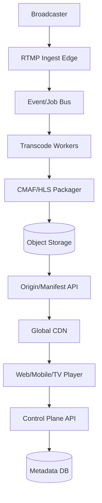
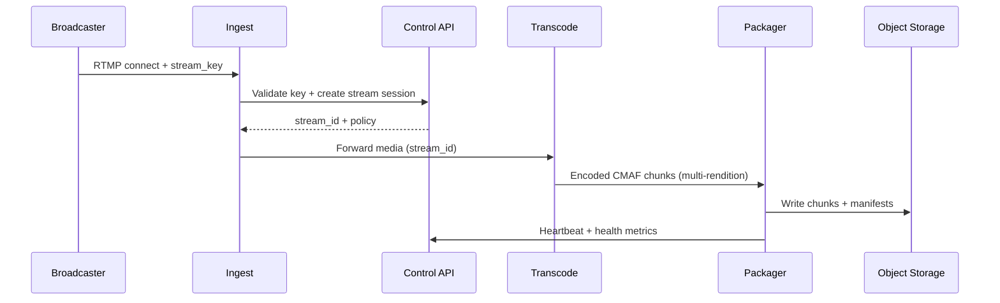
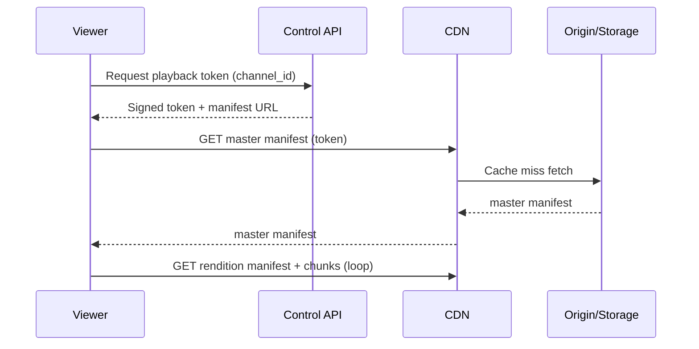
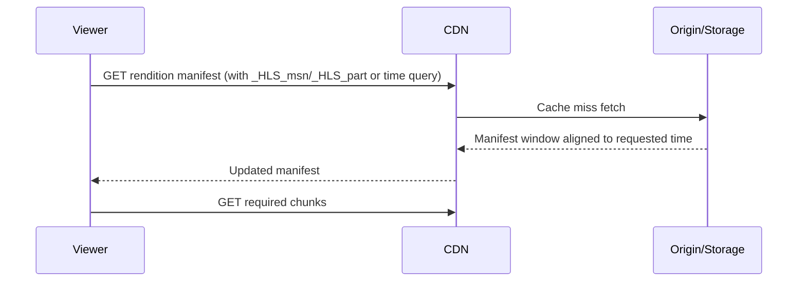

## Overview

Designing a Twitch-like platform is hard because it is a **multi-stage real-time pipeline**: you must reliably ingest live video, transcode into multiple renditions, package into streaming formats, and deliver globally with low latency—all while thousands of independent live streams fluctuate in bitrate and audience size minute-to-minute. The system must also support **DVR playback**, which turns an ephemeral live feed into a time-addressable, partially stored media timeline that viewers can rewind and resume without breaking “live”.

The key insight is to separate the system into a **data plane** (hot-path media transport: ingest → transcode → package → CDN) and a **control plane** (stream lifecycle, auth/entitlements, session management, analytics). The data plane is built around **append-only segment generation** (CMAF/fMP4 or TS) stored in durable object storage and fronted by a CDN, while the control plane maintains stream state and issues short-lived playback tokens. DVR becomes a matter of keeping a longer sliding window (or full retention) of segments and serving a time-based manifest.

## Requirements

### Functional Requirements
- **Live ingest via RTMP**: broadcasters can publish streams using RTMP(S) with stream keys.
- **Adaptive bitrate (ABR) playback**: viewers receive an HLS and/or DASH master manifest and switch renditions dynamically.
- **Low-latency delivery**: support LL-HLS (preferred) and/or low-latency DASH (CMAF chunked transfer).
- **Transcoding ladders**: generate multiple resolutions/bitrates (e.g., 1080p→144p) and audio-only.
- **DVR playback**: viewers can rewind up to a retention window (e.g., 2 hours) and return to live.
- **Stream lifecycle**: start/stop, health, viewer counts, and “go live” notifications.
- **Entitlements & access control**: public/private/subscriber-only streams; geo/device restrictions.
- **VOD export (optional but common)**: persist the full stream as a VOD asset and allow later playback.

### Non-Functional Requirements
- **Scale**
  - **Broadcasters**: 200k concurrent live channels (peak events).
  - **Viewers**: 5M concurrent viewers; 50M DAU.
  - **Ingest**: 200k RTMP connections; ~400 Gbps ingest peak (assuming 2 Mbps avg).
  - **Egress**: multi-Tbps peak via CDN.
  - **Control-plane QPS**: 50k QPS peak (auth, manifests, session heartbeats, chat not included).
  - **Segment writes**: if 2s segments * 200k streams * 6 renditions ≈ 600k objects/minute (chunked CMAF may increase object counts).
- **Latency**
  - **Join time**: P50 < 1.0s to first frame after manifest fetch; P99 < 3.0s.
  - **Glass-to-glass**: P50 1.5–2.5s (LL-HLS), P99 < 6s.
  - **DVR seek**: P50 < 500ms to return correct manifest window; P99 < 2s.
- **Availability**
  - **Playback**: 99.99% monthly (CDN + origin + token service).
  - **Ingest**: 99.9% monthly (some loss acceptable vs playback).
- **Consistency**
  - **Strong**: stream entitlement checks, token issuance, stream start/stop state.
  - **Eventual**: viewer counts, analytics, recommendations, notifications.
- **Durability**
  - **Segments/manifests**: 11 9s object storage durability; tolerate at most **<2 seconds** of DVR loss per stream during transient failures.
  - **Control-plane metadata**: RPO near-zero for stream state (multi-AZ transactional DB).

### Constraints & Assumptions
- Deploy in a major cloud (AWS/GCP/Azure) with multi-region capability; CDN is a managed global CDN.
- Team: ~8–12 engineers for a first production version; prefer managed components where they reduce ops load.
- Compliance: GDPR (user data), DMCA workflows, optional DRM (Widevine/FairPlay/PlayReady) for premium streams.
- Cost constraint: keep per-GB egress dominated by CDN; origin egress must be minimized via caching and origin shielding.

## High-Level Architecture



The media data plane is optimized for throughput and resilience: ingest edges terminate RTMP, normalize input, and push work to an asynchronous pipeline that can elastically scale transcoding/packaging. Packaged segments and manifests are written to object storage as the system of record, then served to viewers primarily through the CDN.

The control plane remains small and fast: it authenticates broadcasters, issues short-lived playback tokens, maintains stream state, and provides endpoints used by clients to discover streams and obtain manifests. By decoupling planes, we avoid overloading critical media delivery with non-media concerns and can independently scale ingestion/transcoding versus user/session traffic.

## Component Deep-Dive

### RTMP Ingest Edge

**Responsibility**: Accept RTMP(S) publisher connections, authenticate stream keys, monitor health (bitrate, keyframes), and forward media into the processing pipeline.

**Key Design Decisions**:
- Use **geo-nearest ingest** with Anycast/DNS steering to minimize last-mile latency and packet loss.
- Make ingest nodes **stateless** beyond connection state; publish stream state to the control plane and emit media into a downstream pipeline (SRT/RIST or internal gRPC streaming).

**Technology Choice**: NGINX-RTMP or SRS for RTMP termination; Envoy for L4/L7 routing; optional QUIC-based ingest (not required here).

**Scaling Strategy**: Horizontal scale by adding ingest POPs; shard by `stream_key`/`channel_id`; keep CPU headroom for TLS and re-muxing; autoscale on concurrent connections and network throughput.

---

### Transcoding Workers

**Responsibility**: Decode input, produce ABR renditions, and generate chunked CMAF segments for low-latency packaging.

**Key Design Decisions**:
- Use **per-stream worker allocation** (or per-stream-per-GPU slice) to simplify isolation and predictable latency.
- Prefer **CMAF (fMP4) chunks** to support both LL-HLS and low-latency DASH with shared media objects.

**Technology Choice**: FFmpeg (software) for baseline; GPU-accelerated encoders (NVENC/QuickSync/ASIC) for cost efficiency at scale; orchestrated with Kubernetes + node pools (GPU/non-GPU).

**Scaling Strategy**: Queue-driven autoscaling keyed on active streams; bin-pack streams onto GPU nodes; enforce per-stream limits (max renditions) and degrade gracefully (drop 1080p first) under scarcity.

---

### Packager (HLS/DASH)

**Responsibility**: Convert encoded outputs into HLS/DASH manifests, support LL-HLS (partial segments), maintain DVR windows, and write manifests/segments to durable storage.

**Key Design Decisions**:
- Generate **time-aligned segments** across renditions (GOP alignment) to improve ABR switching and reduce player stalls.
- Serve **short-TTL manifests** (e.g., 0.5–2s) while segments are cacheable longer (minutes-hours) to maximize CDN efficiency.

**Technology Choice**: Shaka Packager, GPAC, or a custom packager; LL-HLS requires correct partial segment tags and blocking reload semantics.

**Scaling Strategy**: Stateless packager instances; partition by `stream_id`; use local buffering for last N seconds; write-through to object storage with idempotent object keys.

---

### Origin + Object Storage

**Responsibility**: Durable storage for segments/manifests, origin serving to CDN, origin shielding, and access enforcement hooks.

**Key Design Decisions**:
- Use **object storage** for segments (append-only, immutable) with versioned paths; avoid hot metadata writes in relational DB for every segment.
- Introduce **Origin Shield** (regional cache) to collapse cache misses and protect object store from thundering herds.

**Technology Choice**: S3/GCS/Azure Blob; CDN with origin shield; optional NGINX/Varnish layer as a lightweight origin service for headers and access patterns.

**Scaling Strategy**: Object storage scales inherently; origin shield scales horizontally; partition storage prefix by `stream_id` hash to distribute load.

---

### Control Plane API

**Responsibility**: Stream lifecycle, authentication/authorization, token issuance, stream discovery, DVR window configuration, and session tracking.

**Key Design Decisions**:
- Short-lived **signed playback tokens** (JWT/PASETO) with claims (channel, expiry, geo) to offload auth from hot media path.
- Maintain a **stream state machine** (CREATED → LIVE → ENDED) and emit events to analytics/notifications asynchronously.

**Technology Choice**: Go/Java service behind an API gateway; Postgres for transactional metadata; Redis for ephemeral stream presence and fast lookups.

**Scaling Strategy**: Stateless API pods; cache entitlements and channel metadata; isolate token service; rate limit abusive clients.

## Data Model

### Storage Schema

**Relational (Postgres)**
- `channels`
  - `channel_id (pk)`, `owner_user_id`, `title`, `category`, `is_live`, `created_at`, `updated_at`
- `streams`
  - `stream_id (pk)`, `channel_id (idx)`, `state`, `ingest_region`, `start_time`, `end_time`, `dvr_retention_seconds`, `record_vod (bool)`
- `stream_keys`
  - `key_id (pk)`, `channel_id (idx)`, `key_hash`, `created_at`, `revoked_at`
- `entitlements`
  - `entitlement_id (pk)`, `channel_id (idx)`, `policy_json`, `updated_at`

**Redis (ephemeral)**
- `live_stream:{channel_id}` → `{stream_id, ingest_endpoint, last_heartbeat, ladder_profile}`
- `viewer_session:{session_id}` → `{channel_id, stream_id, expires_at}`

**Object Storage (immutable objects)**
- Segments/chunks:
  - `live/{stream_id}/{rendition}/{date_hour}/seg_{sequence}.m4s`
  - `live/{stream_id}/{rendition}/{date_hour}/init.mp4`
- Manifests:
  - `live/{stream_id}/master.m3u8`
  - `live/{stream_id}/{rendition}/index.m3u8` (rolling/DVR-aware)
  - `live/{stream_id}/manifest.mpd`
- Optional DVR index snapshots (if needed for fast seeking):
  - `live/{stream_id}/dvr_index_{epoch_minute}.json`

### Data Flow

**Publishing (broadcaster goes live)**


**Playback (viewer joins live)**


**DVR seek**


## API Design

### Control Plane (REST)

**Create/Start stream (internal or broadcaster app)**
- `POST /v1/streams`
- Headers: `Idempotency-Key: <uuid>`
- Request:
  ```json
  { "channel_id": "ch_123", "requested_profile": "standard", "dvr_retention_seconds": 7200 }
  ```
- Response:
  ```json
  { "stream_id": "st_456", "rtmp_url": "rtmps://ingest.example.com/live", "stream_key_hint": "sk_***" }
  ```
- Errors: `401` invalid auth, `409` already live, `429` rate limited, `503` capacity exceeded.

**Issue playback token**
- `POST /v1/playback/token`
- Request:
  ```json
  { "channel_id": "ch_123", "client_capabilities": { "llhls": true, "drm": false } }
  ```
- Response:
  ```json
  { "token": "<jwt>", "manifest_url": "https://cdn.example.com/live/st_456/master.m3u8" }
  ```
- Idempotency: not required; tokens are short-lived (e.g., 60–180s).

**Stream status**
- `GET /v1/channels/{channel_id}/live`
- Response:
  ```json
  { "is_live": true, "stream_id": "st_456", "started_at": "2025-12-17T12:00:00Z" }
  ```

### Media Path Authorization

Because CDN primarily serves objects, use one of:
- **Signed URLs** (query signature) for manifests and chunks, OR
- **Signed cookies** scoped to `live/{stream_id}/*`, OR
- **CDN token authentication** integrated with JWT.

**Error handling approach**
- Media objects: return `403` if token invalid/expired, `404` if segment not yet available, `410` if outside DVR retention.
- Control APIs: structured error body:
  ```json
  { "error": { "code": "CAPACITY_EXCEEDED", "message": "Try again later", "retry_after_ms": 5000 } }
  ```

**Idempotency considerations**
- Any endpoint that creates resources (`POST /v1/streams`, entitlement updates) must accept `Idempotency-Key`.
- Segment writes are inherently idempotent via deterministic object keys: writing `seg_{sequence}.m4s` is safe to retry.

## Scaling & Performance

### Bottleneck Analysis
- **Transcoding capacity** (CPU/GPU): biggest cost and frequent limiter.
  - Mitigation: GPU acceleration, per-stream prioritization, dynamic ladder reduction, regional overflow.
- **Manifest request QPS** (especially LL-HLS polling): can overwhelm origin if CDN misses.
  - Mitigation: CDN optimized caching headers, origin shield, short manifests with cache revalidation, HTTP/2+ keep-alives.
- **Object store request rate** (many small chunks): can hit per-prefix/per-account limits.
  - Mitigation: hashed prefixes, chunk size tuning, request coalescing via origin shield, multi-bucket strategy.
- **Ingest instability** (publisher uplink variance): causes rebuffering and rendition oscillation.
  - Mitigation: ingest jitter buffers, keyframe enforcement, encoder recommendations, health-based notifications.

### Horizontal Scaling
- **Ingest**: add edge POPs; route by latency; isolate by region; autoscale with connection count.
- **Transcode/Packager**: K8s HPA driven by active streams + queue lag; shard by `stream_id`; use node pools.
- **Control plane**: stateless replicas behind L7 LB; Postgres read replicas; Redis cluster for ephemeral state.
- **Partitioning strategy**
  - Primary sharding key: `stream_id`.
  - Storage prefix: `hash(stream_id)%N/stream_id/...` to distribute object-store hot keys.
  - Queue topics: partition by `stream_id` to preserve ordering within a stream.

### Caching Strategy
- **CDN**
  - Segments/chunks: cache for minutes-hours (`Cache-Control: public, max-age=3600, immutable` for finalized chunks).
  - Manifests: very short TTL (0.5–2s) with revalidation (`ETag`/`If-None-Match`) to reduce bytes while keeping fresh.
- **Origin shield**
  - Cache manifests for sub-second to seconds to collapse viewer fan-in.
- **Control plane**
  - Cache channel metadata/entitlements for 1–5 minutes; invalidate on updates (pub/sub) or accept eventual.
- **Invalidation**
  - Prefer **versioned paths** over purges (e.g., `.../master_v{stream_epoch}.m3u8`).
  - Avoid CDN purge storms; rely on short TTL for manifests.

## Trade-offs & Alternatives

### Key Trade-offs Made
- **Chosen**: LL-HLS over classic 6s HLS segments  
  **Sacrificed**: more requests/sec, more complex packaging/player behavior  
  **Why**: meets sub-3s glass-to-glass targets expected in live interaction.
- **Chosen**: Object storage as segment source-of-truth  
  **Sacrificed**: higher per-request overhead than local disk; careful prefix planning needed  
  **Why**: durability and simple multi-region DR; integrates well with CDN origins.
- **Chosen**: Signed tokens (JWT) + CDN auth integration  
  **Sacrificed**: token revocation complexity (short TTL mitigates)  
  **Why**: avoids per-request origin auth checks at massive scale.

### Alternative Approaches
- **WebRTC end-to-end**: ultra-low latency (<500ms) but harder global scalability, NAT traversal, and DVR integration; higher server complexity.
- **Managed media services** (e.g., AWS Elemental MediaLive/MediaPackage): faster time-to-market, but higher cost and less control over LL tuning and custom DVR semantics.
- **Push-based manifest updates** (server-sent or websocket): reduces polling but complicates CDN caching and client compatibility; polling remains standard for HLS/DASH.

## Failure Modes & Mitigations

### Failure Scenarios
- **Scenario**: Ingest POP outage  
  **Impact**: broadcasters in region disconnect; viewers see stream end/stall  
  **Detection**: RTMP disconnect spikes, heartbeat loss, POP health checks  
  **Mitigation**: DNS/Anycast failover to next POP; broadcaster client auto-reconnect; control plane keeps stream in “RECOVERING” for grace period (e.g., 30–60s).
- **Scenario**: Transcode backlog / GPU exhaustion  
  **Impact**: increased latency, missing renditions, playback stalls  
  **Detection**: queue lag, transcode start latency, dropped frames  
  **Mitigation**: degrade ladder (remove top renditions), prioritize audio-only + baseline, burst into overflow region, admission control for new streams.
- **Scenario**: Packager bug generates invalid manifests  
  **Impact**: widespread playback failure  
  **Detection**: synthetic playback probes, manifest validation, spike in 4xx/5xx and player errors  
  **Mitigation**: canary deploy, instant rollback, fallback to previous manifest generator, feature flags per stream.
- **Scenario**: CDN misconfiguration / cache fragmentation  
  **Impact**: origin overload, high buffering  
  **Detection**: CDN hit ratio drop, origin RPS spike  
  **Mitigation**: origin shield, conservative caching headers, emergency rate limits, pre-warm for major events.
- **Scenario**: Object storage regional outage  
  **Impact**: origin can’t fetch new chunks; DVR breaks  
  **Detection**: elevated 5xx from storage SDK, origin timeouts  
  **Mitigation**: multi-region replication (async), dual-write for critical streams, failover to secondary region for new ingest/transcode, accept limited DVR loss within RPO.

### Disaster Recovery
- **RTO**: 15 minutes for major region failure (playback), 30 minutes for ingest restoration.
- **RPO**: 0–60 seconds for DVR segments (depending on replication); near-zero for metadata DB (sync multi-AZ, async cross-region).
- **Backup strategy**
  - Postgres: continuous WAL archiving + daily snapshots; tested restores.
  - Object storage: versioning + lifecycle + cross-region replication for manifests/segments (priority streams first).
- **Failover procedures**
  - Control plane: active-active with global traffic management.
  - Data plane: regional isolation; reroute ingest to healthy region; CDN origin failover to secondary origin bucket.

## Operational Considerations

### Monitoring & Alerting
- **Ingest**
  - Active RTMP sessions, reconnect rate, ingest bitrate variance, keyframe interval, packet loss (if measured).
  - Alert: reconnect rate > baseline + 3σ; ingest accept errors > 1% for 5 minutes.
- **Transcode/Packager**
  - Queue lag, per-stream encode time, dropped frames, chunk generation latency, manifest publish latency.
  - Alert: P99 chunk publish latency > 1s for 10 minutes; GPU utilization > 90% with rising lag.
- **Playback**
  - Startup time, rebuffer ratio, error codes, CDN hit ratio, origin RPS, 4xx/5xx.
  - Alert: CDN hit ratio drop > 15 points; player fatal error rate > 0.5%.
- **Data stores**
  - Postgres replication lag, lock time, Redis evictions, storage 5xx.
  - Alert: Postgres lag > 5s; Redis evictions > 0 sustained.

### Deployment Strategy
- **Control plane**: blue/green or canary (1–5% traffic), automated rollback on SLO violations.
- **Transcode/packager**: canary per stream cohort; feature flags for LL-HLS; keep backward-compatible manifest formats.
- **Config safety**: staged CDN config with validation; run synthetic playback against staging + canary edges.
- **Rollback**: immutable container images; revert manifests generation changes quickly; keep last-known-good config.

## References & Further Reading
- Apple Low-Latency HLS: https://developer.apple.com/streaming/
- CMAF (ISO/IEC 23000-19) overview: https://www.w3.org/TR/mse-byte-stream-format-isobmff/
- MPEG-DASH and low-latency DASH concepts: https://dashif.org/docs/
- Shaka Packager (packaging HLS/DASH): https://github.com/shaka-project/shaka-packager
- FFmpeg encoding/transcoding: https://ffmpeg.org/documentation.html
- Netflix “Global CDN” (Open Connect) for CDN design intuition: https://openconnect.netflix.com/