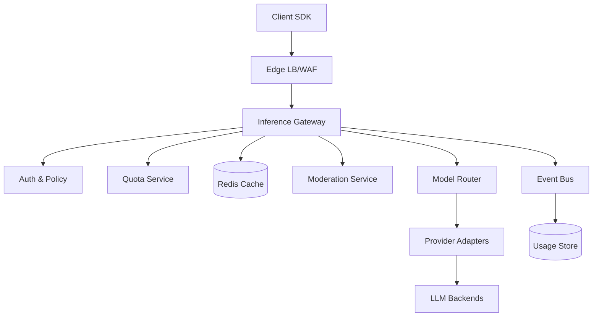
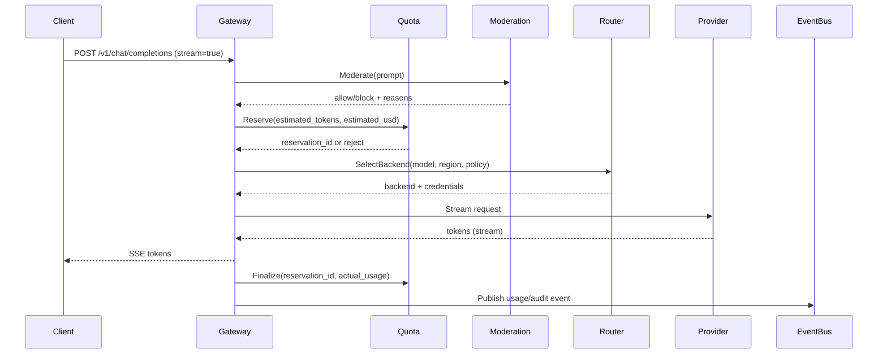

## Overview

An LLM Inference Gateway is the production “front door” for language model usage: it authenticates clients, enforces spend and rate limits, applies safety controls, and proxies requests to one or more model backends while supporting low-latency token streaming. The hard parts are (1) enforcing **quotas correctly under concurrency** (especially with streaming and retries), (2) doing **safety moderation without breaking UX** (streaming, false positives, policy differences), and (3) delivering **predictable latency and cost** across heterogeneous providers and self-hosted models.

The key insight is to separate the gateway into three planes: a **hot path** (auth → policy → quota reservation → routing → streaming proxy), a **state plane** (quota ledger, cache, policy store), and a **telemetry/finance plane** (immutable usage events → aggregation → billing/chargeback). This keeps the streaming proxy stateless and scalable while making quota enforcement and billing auditable and recoverable.

## Requirements

### Functional Requirements
- Authenticate requests via API keys/OAuth and map them to org/project/user identities.
- Proxy OpenAI-compatible chat/completions with **token streaming** (SSE) and request cancellation.
- Enforce **rate limits** (requests/min, tokens/min) and **cost quotas** (daily/monthly $ budgets) per org/project/user/model.
- Apply **safety moderation** on prompts and (optionally) generated output with configurable policies (block, redact, warn, allow).
- Provide **prompt/response caching** (exact-match) and optional prefix/KV cache reuse for self-hosted models.
- Route requests across multiple providers/models with health checks, circuit breakers, fallbacks, and A/B rollout.
- Emit detailed **usage, latency, and audit logs** with request IDs for tracing and dispute resolution.

### Non-Functional Requirements
- **Scale**: 50K RPS peak; 10K concurrent streaming connections; 5B tokens/day; 100K active API keys; 10K orgs.
- **Latency**:
  - Non-streaming: P50 150ms gateway overhead, P99 600ms (excluding model compute).
  - Streaming: time-to-first-token P50 250ms, P99 900ms (excluding model compute); token relay overhead <10ms/hop.
- **Availability**: 99.99% for gateway API; graceful degradation if cache/telemetry is impaired.
- **Consistency**:
  - **Strong** for quota reservation and enforcement (prevent budget overshoot beyond a small bounded drift).
  - **Eventual** for usage aggregation dashboards and cache population.
- **Durability**: Usage events durable within 60s (RPO ≤ 60s) for billing; request logs retained 30 days; audit logs retained 1 year.

### Constraints & Assumptions
- Network egress to external model providers is allowed; some tenants require data residency (region pinning).
- Team size 6–10 engineers; on-call rotation; must be operable with standard SRE tooling.
- Compliance: support SOC2-style audit trails; PII minimization; encryption in transit and at rest.
- Budget: prefer managed Postgres + Redis + Kafka-compatible log pipeline; avoid bespoke distributed systems unless needed.

## High-Level Architecture



The gateway is a stateless service handling HTTP(S) and SSE streaming. It calls out to internal services for auth/policy evaluation, quota reservation, moderation, and model routing. Low-latency caches (Redis) sit on the hot path for repeated requests and policy lookups.

All billing/observability uses an append-only event stream: the gateway emits immutable usage/audit events to an event bus, which are then aggregated into an analytics store for dashboards, alerts, and invoices. This decouples streaming performance from downstream analytics and supports replay/backfill.

## Component Deep-Dive

### Inference Gateway (Streaming Proxy)

**Responsibility**: Terminate client HTTP/SSE connections, validate requests, orchestrate hot-path calls, proxy streaming tokens, and emit usage/audit events.

**Key Design Decisions**:
- Use **OpenAI-compatible API surface** to reduce client friction and enable drop-in SDKs.
- Implement streaming via **SSE** with backpressure and cancellation propagation to providers.

**Technology Choice**: Go or Rust (high-throughput networking, efficient streaming); Envoy/NGINX at edge for TLS + WAF; HTTP/2 upstream where supported.

**Scaling Strategy**: Stateless horizontal scaling behind L7 load balancer; scale on concurrent connections and CPU; use connection draining for deploys; per-tenant limits enforced via shared quota service.

### Quota Service (Strong Enforcement)

**Responsibility**: Enforce request/token/$ budgets and rate limits with reservations, reconciliation, and auditability.

**Key Design Decisions**:
- Use **reservation + finalize**: reserve estimated cost/tokens before calling the model; finalize with actual usage after completion (or on stream end).
- Keep an auditable ledger of debits/credits and allow a bounded drift policy (e.g., max $0.50 or 1K tokens overshoot per org during outages).

**Technology Choice**: Redis for atomic counters + Lua scripts (hot path) plus Postgres/CockroachDB for durable quota configs and ledger (write-behind).

**Scaling Strategy**: Redis Cluster/KeyDB for throughput; shard by `org_id`; quota configs cached locally with short TTL; ledger writes batched via event bus.

### Moderation Service (Safety Filters)

**Responsibility**: Evaluate prompts and outputs against tenant policies: prohibited content, PII leakage, jailbreak heuristics, allow/deny lists, and domain rules.

**Key Design Decisions**:
- Two-phase moderation: **pre-moderate prompt** (block early) and **post-moderate output** (block/redact/abort streaming).
- Policy-driven behavior: per-tenant **fail-open vs fail-closed** modes depending on risk tolerance.

**Technology Choice**: Lightweight rules engine + ML classifier (e.g., small transformer) behind gRPC; optional integration with provider moderation APIs.

**Scaling Strategy**: Stateless; cache policy artifacts; batch non-streaming checks; for streaming, use a sliding window buffer (e.g., 256–512 chars) to detect disallowed patterns.

### Cache Layer (Prompt/Response + Optional KV Cache)

**Responsibility**: Reduce cost/latency for repeated deterministic requests and support prefix reuse for self-hosted inference.

**Key Design Decisions**:
- Cache only when safe: default to **exact-match caching** for `temperature=0` (or explicitly opted-in); vary cache key by model + params.
- Prevent stampedes with **single-flight locks** per cache key and soft TTL + background refresh.

**Technology Choice**: Redis (strings + hashes) with compression (zstd); for self-hosted GPU prefix cache, use vLLM/Triton-native KV cache where possible.

**Scaling Strategy**: Redis Cluster with key hashing by cache key; TTL-based eviction; size caps per tenant.

### Model Router & Provider Adapters

**Responsibility**: Select the best backend (provider or self-hosted) based on policy, cost, latency, region, and health; translate requests/responses; handle retries safely.

**Key Design Decisions**:
- Use **circuit breakers + hedged requests** for tail latency (only for idempotent operations and where provider terms allow).
- Region pinning and data residency enforced in routing policy.

**Technology Choice**: Internal routing service with dynamic config; adapters for OpenAI/Anthropic/Gemini/self-hosted (vLLM/Triton) using streaming-capable clients.

**Scaling Strategy**: Stateless; caches provider health; separate worker pool for provider I/O; rate limit per provider API key.

## Data Model

### Storage Schema

**Postgres (config + audit pointers)**
- `orgs`: `org_id (pk)`, `name`, `home_region`, `created_at`
- `projects`: `project_id (pk)`, `org_id (fk)`, `name`, `created_at`
- `api_keys`: `key_id (pk)`, `project_id`, `key_hash`, `status`, `scopes`, `created_at`, `last_used_at`
- `policies`: `policy_id (pk)`, `org_id`, `moderation_mode`, `blocked_categories`, `pii_rules`, `cache_policy`, `updated_at`
- `quota_configs`: `quota_id (pk)`, `scope_type (org/project/user)`, `scope_id`, `period (day/month)`, `max_usd`, `max_tokens`, `rpm`, `tpm`, `updated_at`

**Redis (hot-path counters + cache)**
- `quota:{scope}:{period}:{bucket}` → atomic counters for `tokens_in`, `tokens_out`, `usd`
- `ratelimit:{scope}:{minute}` → request/token rate counters
- `cache:resp:{hash}` → cached response blob + metadata (ttl, model, params, created_at)
- `lock:cache:{hash}` → short-lived single-flight lock

**Event/Analytics (append-only + aggregates)**
- `usage_events` (Kafka topic): `event_id`, `request_id`, `org_id`, `project_id`, `model`, `tokens_in`, `tokens_out`, `usd`, `status`, `ts`
- Aggregated store (ClickHouse/BigQuery): rollups by org/project/model/day, latency histograms, error rates.

### Data Flow



## API Design

### Authentication
- Header: `Authorization: Bearer <api_key>`
- Optional: `Idempotency-Key: <uuid>` for non-streaming and for safe retries of identical requests.

### Core Endpoint (OpenAI-compatible)
`POST /v1/chat/completions`

**Request (subset)**
```json
{
  "model": "gpt-4.1-mini",
  "messages": [{"role":"user","content":"..."}],
  "stream": true,
  "temperature": 0,
  "max_tokens": 512,
  "user": "user_123",
  "metadata": {"project":"abc"}
}
```

**Streaming Response**
- `Content-Type: text/event-stream`
- Events: `data: {delta...}`; terminal: `data: [DONE]`

**Non-Streaming Response**
- Standard JSON completion object with usage.

### Errors
- `401` invalid key; `403` policy blocked; `429` rate limit; `402` quota exceeded (budget); `400` invalid params; `503` provider unavailable; `504` upstream timeout.
- Body includes `request_id`, `code`, `message`, and `retry_after_ms` when applicable.

### Idempotency
- For `stream=false`, gateway stores `Idempotency-Key` → response mapping (short TTL, e.g., 24h) to prevent double-billing on client retries.
- For `stream=true`, idempotency is best-effort: support resume via `GET /v1/requests/{request_id}` only if explicitly enabled (otherwise rely on client retry with new request).

### Admin/Telemetry APIs (internal)
- `GET /internal/health`
- `GET /internal/metrics` (Prometheus)
- `POST /internal/policies/test` (dry-run moderation + quota estimate)

## Scaling & Performance

### Bottleneck Analysis
- **Concurrent streaming connections**: memory/file descriptor pressure and GC pauses.
  - Mitigation: Go tuned netpoll; connection limits per pod; backpressure; SSE flush batching (e.g., 20–50ms).
- **Quota checks on hot path**: latency spikes if Redis is slow.
  - Mitigation: local caching for configs; Redis pipelining; Lua atomic reserve; graceful bounded drift when Redis impaired.
- **Provider tail latency**: upstream p99 dominates.
  - Mitigation: circuit breakers, regional routing, model fallback, hedging for idempotent non-streaming calls.

### Horizontal Scaling
- **Edge/Gateway**: scale by concurrent connections and CPU; shard by consistent hashing on `org_id` only if needed for locality (optional).
- **Quota/Cache (Redis)**: cluster mode; shard by `org_id`/hash; replicas for read-heavy policy/config lookups.
- **Moderation**: stateless autoscaling; optionally precompute tenant rule DFAs for fast matching.
- **Event pipeline**: partition by `org_id` to preserve ordering for per-tenant reconciliation.

### Caching Strategy
- **Response cache**: exact-match key includes `model`, normalized `messages`, `temperature`, `top_p`, `max_tokens`, tool settings, and policy version; TTL 5–60 minutes depending on tenant.
- **Policy/config cache**: in-gateway in-memory TTL 30–120s with ETag/version checks.
- **Invalidation**: bump `policy_version` and include it in cache key; explicit purge endpoint per project if needed.
- **Stampede control**: single-flight locks with short TTL (e.g., 5–15s) and soft TTL refresh.

## Trade-offs & Alternatives

### Key Trade-offs Made
- **Redis-based strong-ish enforcement** chosen for low latency and atomicity; sacrificed perfect global consistency across regions.
  - Why: quota checks must be sub-10ms; cross-region consensus would add 50–150ms.
- **Two-phase moderation** chosen to balance safety and UX; sacrificed some streaming immediacy via buffering.
  - Why: blocking harmful output mid-stream is required for many orgs.
- **Exact-match caching** chosen for correctness; sacrificed higher cache hit rates vs semantic caching.
  - Why: semantic caching risks incorrect answers and policy leakage unless heavily constrained.

### Alternative Approaches
- **Single monolith gateway** (auth/quota/moderation embedded): simpler deploy, but harder to scale/iterate, riskier blast radius.
- **Fully event-sourced quota ledger** with strict reconciliation: strongest auditability, but hot-path latency and operational complexity are higher.
- **Semantic prompt cache** (embeddings-based): higher hits, but correctness/safety risks and hard-to-explain behavior; better suited for internal RAG answers than general completions.

## Failure Modes & Mitigations

### Failure Scenarios
- **Scenario**: Provider outage or elevated 5xx  
  **Impact**: request failures, increased latency  
  **Detection**: error-rate SLO burn, circuit breaker open events  
  **Mitigation**: automatic fallback model/provider, regional reroute, shed non-critical traffic, return `503` with `Retry-After`.

- **Scenario**: Quota service/Redis partial outage  
  **Impact**: inability to enforce budgets or false rejects  
  **Detection**: Redis latency/timeout alerts, reservation failures  
  **Mitigation**: configurable fail-closed (strict) or bounded fail-open drift; reconcile using usage events; temporarily reduce max concurrency per org.

- **Scenario**: Moderation service degraded  
  **Impact**: unsafe content could pass or false blocks  
  **Detection**: timeout rate, model confidence drift, policy audit alarms  
  **Mitigation**: per-tenant fail-open/closed; fallback to rules-only mode; degrade to “warn” instead of “block” for low-risk tenants.

- **Scenario**: Cache stampede on popular prompt  
  **Impact**: cost spike and provider overload  
  **Detection**: cache miss surge + repeated identical keys  
  **Mitigation**: single-flight locks; request coalescing; soft TTL + background refresh.

- **Scenario**: Event bus backlog  
  **Impact**: delayed billing/alerts, potential RPO breach  
  **Detection**: consumer lag metrics  
  **Mitigation**: increase partitions/consumers; spill to local disk buffer; prioritize usage events over verbose logs.

### Disaster Recovery
- **RTO/RPO**: RTO 30 minutes; RPO 60 seconds for usage events; config RPO 5 minutes.
- **Backup strategy**: daily Postgres snapshots + WAL archiving; Redis persistence (AOF) optional but not solely relied upon; event bus replicated across AZs.
- **Failover**: DNS or global LB failover to secondary region; quotas either (a) active-passive with primary quota region or (b) CRDB global with latency trade-off; rehydrate caches on failover.

## Operational Considerations

### Monitoring & Alerting
- Key metrics:
  - Gateway: RPS, concurrent streams, TTFT (time-to-first-token), stream duration, 4xx/5xx, upstream latency, cancellation rate.
  - Quota: reserve/finalize latency, reject counts by reason, drift amount, Redis p99 latency.
  - Moderation: block rate, timeout rate, false-positive review queue rate.
  - Providers: per-provider error rate, latency, token cost, circuit breaker state.
- Alert thresholds (example):
  - Gateway 5xx > 0.5% for 5m, TTFT p99 > 2s for 10m, Redis p99 > 20ms for 5m, provider error-rate > 2% for 5m.

### Deployment Strategy
- Blue/green or canary (1% → 10% → 50% → 100%) with automatic rollback on SLO burn.
- Versioned policies and config with safe rollout; include `policy_version` in logs and cache keys.
- Runbooks for provider outages, quota drift reconciliation, and moderation degradations.

## References & Further Reading
- OpenAI API compatibility patterns: https://platform.openai.com/docs/api-reference
- Server-Sent Events (SSE) streaming: https://html.spec.whatwg.org/multipage/server-sent-events.html
- Envoy rate limiting & circuit breaking: https://www.envoyproxy.io/docs
- Redis atomic counters and Lua scripts: https://redis.io/docs/latest/develop/interact/programmability/eval-intro/
- vLLM (prefix/KV cache and high-throughput serving): https://docs.vllm.ai/
- NVIDIA Triton Inference Server: https://github.com/triton-inference-server/server
- Kafka design and consumer lag ops: https://kafka.apache.org/documentation/