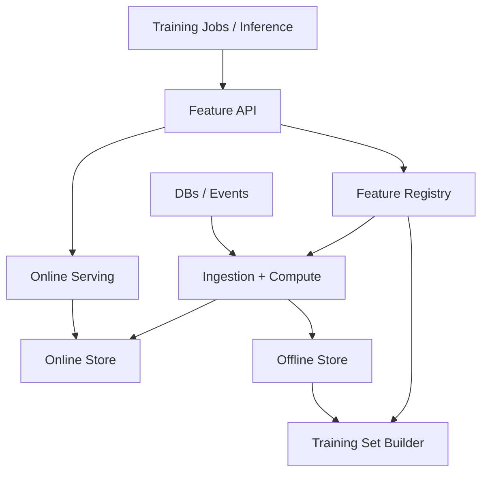
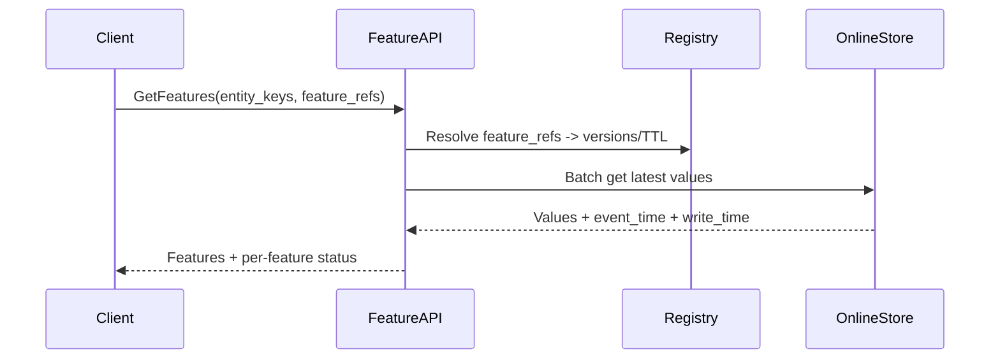

## Overview

A feature store is the connective tissue between data engineering and ML: it standardizes how features are defined, computed, validated, and served consistently across **training (offline/batch)** and **inference (online/low-latency)**. The core difficulty is not “storing key-value pairs”, but guaranteeing **point-in-time correctness** (to avoid data leakage), managing **late-arriving data**, supporting **backfills**, and ensuring **training-serving parity** while operating at production scale.

The key insight is to treat features as **versioned, time-indexed data products** with explicit **event time**, **ingestion time**, and **validity semantics**. Offline training datasets are built via **as-of joins** over immutable/time-travelable storage; online serving is powered by **materialized views** with freshness SLOs and deterministic feature computation, backed by strong metadata/lineage and automated validation.

## Requirements

### Functional Requirements
- Register and manage feature definitions (schema, owner, TTL, aggregation windows, transformations) with versioning and approvals.
- Compute features from batch sources (warehouse/lake) and streaming sources (event bus), supporting incremental updates and backfills.
- Serve low-latency **online** features by entity key(s) for inference, with predictable SLAs and graceful degradation.
- Generate **offline training datasets** with point-in-time correctness (as-of joins) and reproducibility (feature/definition snapshot).
- Maintain training-serving parity: same feature definitions, same transformation logic, consistent defaults and missing-value handling.
- Provide feature discovery (catalog), lineage, and auditability (who changed what, when, and impact analysis).
- Enforce data quality checks (null rates, ranges, freshness, distribution drift) and block/alert on violations.
- Support multi-tenant isolation (teams/models), access control, and PII handling.

### Non-Functional Requirements
- **Scale**: 10K online QPS peak (reads), 1K QPS sustained; 10B feature rows/day ingested; 5K features; 500 entity types; 100 TB/month offline storage growth.
- **Latency**: Online `GetFeatures` P50 10ms, P99 50ms (in-region); materialization lag < 2 minutes for streaming features; offline training set generation: 1 TB join in < 1 hour.
- **Availability**: Online serving 99.99% (multi-AZ); offline pipeline 99.9% job success with retries/backfills.
- **Consistency**: Online reads are **eventually consistent** w.r.t. source (bounded by freshness SLO); offline datasets require **point-in-time correctness** and reproducibility (definition snapshot + time-travel).
- **Durability**: Offline store RPO ~ 0 (immutable/object store + metadata backups); online store RPO up to freshness window (e.g., 2 minutes), rebuildable from offline.

### Constraints & Assumptions
- Event sources provide entity keys and event timestamps; clock skew bounded (e.g., < 5s) or corrected at ingestion.
- Team size ~ 6–10 engineers; prioritize managed components where possible.
- Compliance: support PII tagging, encryption at rest/in transit, row/column-level access controls, audit logs retained 1 year.
- Network access for this design is assumed in production; compute runs in a single cloud region with multi-AZ, optional multi-region DR.

## High-Level Architecture



This architecture separates concerns:
- **Registry** defines “what a feature is” (contract, versioning, governance).
- **Ingestion + Compute** turns raw signals into time-indexed feature values and materializes them both to the offline store (for training) and the online store (for inference).
- **Training Set Builder** produces point-in-time-correct datasets by joining labels with features using event time semantics and time travel.

The split between offline and online stores is deliberate: offline workloads demand scalable scans and reproducibility, while online workloads demand low-latency key-based lookups and operational simplicity.

## Component Deep-Dive

### Feature Registry (Catalog + Metadata)

**Responsibility**: Source of truth for feature definitions, schema, ownership, versions, TTLs, transformation specs, and access policies.

**Key Design Decisions**:
- Version feature definitions immutably (e.g., `feature_view:v12`) to make training datasets reproducible.
- Store transformation logic as declarative specs (SQL + UDF references) or compiled artifacts to ensure parity across batch/stream.

**Technology Choice**: Postgres (metadata) + Git-backed review flow for definitions; optional UI via internal portal.

**Scaling Strategy**: Metadata is small; scale read replicas and cache hot definitions in the API layer.

### Ingestion + Feature Compute (Batch + Stream)

**Responsibility**: Compute features from sources, handle late data, schedule backfills, and write to offline/online stores.

**Key Design Decisions**:
- Treat computed feature rows as `(entity_key, feature_name, event_time, value, ingestion_time)` to enable as-of correctness.
- Use watermarking for streaming features (bounded lateness) and explicit backfill jobs for historical recompute.

**Technology Choice**:
- Streaming: Kafka + Flink/Spark Structured Streaming.
- Batch: Spark on a lakehouse (Iceberg/Delta/Hudi) with incremental processing.

**Scaling Strategy**: Partition by entity hash and event date; autoscale stream processors by lag; batch scales by input size and partition pruning.

### Offline Store (Training/Analytics)

**Responsibility**: Durable, immutable/time-travelable storage for feature values and snapshots, optimized for large scans and joins.

**Key Design Decisions**:
- Use a lakehouse table format supporting **time travel** and schema evolution to reproduce training data exactly.
- Partition primarily by `event_date` (and optionally by entity hash bucket) to speed as-of joins and backfills.

**Technology Choice**: S3/GCS + Iceberg/Delta + Parquet; query via Spark/Trino.

**Scaling Strategy**: Columnar storage + partition pruning + clustering (Z-order) on entity keys; compaction jobs to control small files.

### Online Store + Serving

**Responsibility**: Low-latency retrieval of the latest valid feature values per entity for inference.

**Key Design Decisions**:
- Store “latest-by-entity” materialization with freshness tracking (`as_of_event_time`, `write_time`) and per-feature TTL enforcement.
- Support partial responses with per-feature status codes and model-specific defaults to avoid hard failures.

**Technology Choice**:
- Redis Cluster for sub-10ms reads (hot path) or Cassandra/DynamoDB for higher durability/scale; gRPC for serving API.

**Scaling Strategy**: Shard by entity key; multi-AZ replication; read-through caching in serving layer for ultra-hot keys.

### Training Set Builder (Point-in-Time Correctness)

**Responsibility**: Build training datasets by joining label events with features using as-of semantics, ensuring no future leakage.

**Key Design Decisions**:
- Implement **as-of join**: for each label row at `label_time`, select the latest feature row with `feature.event_time <= label_time` (and within TTL).
- Snapshot feature definitions and source table versions (Iceberg/Delta snapshot IDs) to guarantee reproducibility.

**Technology Choice**: Spark job + SQL templates; optionally integrate with Feast/Tecton-like abstractions.

**Scaling Strategy**: Precompute “spine” (entity, label_time) partitions; broadcast small dimensions; use sort-merge joins with partition alignment.

## Data Model

### Storage Schema

**Feature definitions (metadata DB)**
- `feature_view`
  - `id` (uuid)
  - `name` (string, unique)
  - `version` (int)
  - `entities` (jsonb) — keys and types
  - `features` (jsonb) — name/type/description
  - `ttl_seconds` (int, nullable)
  - `compute_spec` (jsonb) — SQL/stream spec, windows, UDF refs
  - `owner` (string)
  - `pii_tags` (jsonb)
  - `created_at`, `deprecated_at` (timestamp)

**Offline feature values (lakehouse table)**
- `offline_feature_values`
  - `entity_type` (string)
  - `entity_key` (string)
  - `feature_view` (string)
  - `feature_name` (string)
  - `event_time` (timestamp) — when the signal was true in the real world
  - `value` (variant/json or typed columns)
  - `ingestion_time` (timestamp)
  - `source_version` (string) — optional lineage pointer
  - Partition: `event_date` (date)

**Online materialized features (KV / wide-row)**
- Key: `entity_type:entity_key`
- Value:
  - `features` map: `feature_name -> {value, event_time, write_time, status}`
  - `schema_version` / `feature_view_versions`

### Data Flow

**Online inference read path**


**Offline training dataset build**
- Input: label table (entity_key, label_time, label, optional context)
- Build a “spine” from labels, then for each feature view perform an as-of join:
  - `feature.event_time <= label_time`
  - choose max `feature.event_time` (tie-breaker: max `ingestion_time`)
  - enforce TTL: `label_time - feature.event_time <= ttl`
- Output: dataset artifact with pointers to feature definition versions + lakehouse snapshot IDs.

## API Design

### Online Serving (gRPC recommended; REST acceptable)

**GetFeatures**
- `POST /v1/features:get`
- Request
  ```json
  {
    "entityType": "user",
    "entityKeys": ["u1", "u2"],
    "features": ["user_age:v12", "user_country:v3"],
    "requestContext": {"model": "ranker_v7"},
    "asOfTime": "2025-12-17T10:00:00Z"
  }
  ```
- Response
  ```json
  {
    "results": [
      {
        "entityKey": "u1",
        "featureValues": {
          "user_age:v12": {"value": 34, "eventTime": "2025-12-17T09:58:10Z", "status": "OK"},
          "user_country:v3": {"value": "PL", "eventTime": "2025-12-10T12:00:00Z", "status": "STALE"}
        }
      }
    ],
    "requestId": "..."
  }
  ```
- Error handling: 4xx for bad feature refs/auth; 5xx for serving failures; partial success encoded per feature (`MISSING`, `STALE`, `DENIED`).
- Idempotency: read-only; request IDs for tracing.

### Registry

**Register/Update Feature View**
- `POST /v1/registry/feature-views`
- Idempotency: `Idempotency-Key` header to avoid duplicate creates; immutable versioning (updates create new version).

**Get Feature View**
- `GET /v1/registry/feature-views/{name}?version=12`

### Offline Training

**Create Training Dataset**
- `POST /v1/training-datasets`
- Request includes:
  - label source (table + snapshot)
  - feature refs (versions pinned or “latest” resolved at submission time)
  - join keys and `label_time` column
- Response returns dataset artifact URI + definition snapshot.

## Scaling & Performance

### Bottleneck Analysis
- **Online store hotspots** (popular entities/models): mitigate with request batching, cache in serving tier, and consistent hashing with resharding support.
- **Offline as-of joins** (expensive sorts/shuffles): mitigate with partition alignment, spine partitioning, clustering on entity_key, and incremental dataset builds.
- **Streaming lag/late data**: mitigate with watermarks, backpressure handling, and SLO-based alerts; use backfills for late corrections.
- **Small files in lakehouse**: mitigate with compaction and optimized write patterns.

### Horizontal Scaling
- **API/Serving**: stateless; scale behind L7 LB; use connection pooling and batch gets to online store.
- **Stream compute**: scale by partitions and operator parallelism; isolate heavy feature views into separate jobs.
- **Offline compute**: scale Spark executors; partition by date and entity buckets; use autoscaling where available.
- **Online store**: shard by entity key; multi-AZ replication; plan capacity by QPS and value size (e.g., 1–5KB/entity).

### Caching Strategy
- **Serving-tier cache**: short TTL (e.g., 50–200ms) for ultra-hot keys to absorb bursts without staleness risk.
- **Registry cache**: cache feature definitions (minutes) with versioned keys; invalidate on publish events.
- **Offline query cache**: rely on engine caching (Spark/Trino) for iterative development, not correctness-critical paths.
- Invalidation: online values expire via TTL and are overwritten by materialization; registry uses publish notifications + ETags.

## Trade-offs & Alternatives

### Key Trade-offs Made
- **Chosen**: Separate offline (lakehouse) and online (KV/wide-row) stores  
  **Sacrificed**: Single-store simplicity  
  **Why**: Offline needs scan+time-travel; online needs low-latency lookups and different cost/perf characteristics.
- **Chosen**: Event-time + ingestion-time model with as-of joins  
  **Sacrificed**: Easier “latest snapshot” training builds  
  **Why**: Prevents leakage and handles late data deterministically.
- **Chosen**: Immutable versioned feature definitions  
  **Sacrificed**: Convenience of in-place edits  
  **Why**: Reproducibility, auditability, and safe rollout/rollback.

### Alternative Approaches
- **On-demand feature computation at inference** (compute from source per request): simpler storage, but high latency and fragile dependencies.
- **Single OLAP store for both offline+online** (e.g., Pinot/Druid): can work for some features, but harder to guarantee low-latency point lookups and time travel for training at scale.
- **Fully managed feature store vendor**: fastest time-to-value, but higher cost and potential lock-in; still requires correct event-time modeling.

## Failure Modes & Mitigations

### Failure Scenarios
- **Scenario**: Online store outage  
  **Impact**: Inference degraded or fails  
  **Detection**: Elevated p99, error rate, store health checks  
  **Mitigation**: Multi-AZ, client-side timeouts, partial responses with defaults, fallback to cached last-known-good, rapid rebuild from offline.
- **Scenario**: Materialization lag (stream backlog)  
  **Impact**: Stale features, model quality drop  
  **Detection**: Lag metrics vs freshness SLO, watermark delay  
  **Mitigation**: Autoscale, backpressure tuning, feature-level freshness alarms, degrade specific features to defaults.
- **Scenario**: Data leakage via incorrect join logic  
  **Impact**: Inflated offline metrics, poor production performance  
  **Detection**: Dataset builder audits, invariant checks (`feature.event_time <= label_time`), unit tests on join templates  
  **Mitigation**: Centralized as-of join library, mandatory reviews, reproducible snapshots, automated leakage checks.
- **Scenario**: Late-arriving corrections/backfills  
  **Impact**: Offline/online mismatch, training drift  
  **Detection**: Late data counters, reconciliation jobs comparing online vs offline latest-by-entity  
  **Mitigation**: Bounded lateness in streaming, scheduled backfills, online re-materialization from corrected offline partitions.
- **Scenario**: Schema change in source breaks compute  
  **Impact**: Feature pipeline failures  
  **Detection**: Job failures, contract tests, schema registry alerts  
  **Mitigation**: Schema registry + compatibility rules, canary pipelines, versioned transforms, automatic rollback.

### Disaster Recovery
- RTO: 1 hour for online serving; 24 hours for full offline recompute.
- RPO: Online up to 2 minutes (freshness window); offline ~0 (object storage durability + metadata backups).
- Backup strategy: metadata DB PITR; lakehouse relies on object store durability + table metadata snapshots; export registry versions to immutable storage.
- Failover: warm standby online store in second region (optional); rebuild online from offline snapshots + replay recent stream.

## Operational Considerations

### Monitoring & Alerting
- Online: QPS, p50/p99 latency, error rate, cache hit rate, per-feature missing/stale rates, online store CPU/memory, hot shard detection.
- Pipelines: stream lag, watermark delay, batch job duration, success rate, backfill queue depth.
- Data quality: freshness, null %, range checks, distribution drift (PSI/KL), cardinality explosions, join coverage (% labels with non-missing features).
- Alerts: page on serving SLO breach, sustained lag > freshness SLO, registry publish failures, and severe DQ violations.

### Deployment Strategy
- Feature definition changes: publish new versions; canary on a subset of models; roll forward by pinning versions; rollback by re-pinning.
- Serving changes: blue/green or canary with automated rollback on SLO regression.
- Pipeline changes: staged rollout per feature view; shadow runs comparing outputs before switching materialization.

## References & Further Reading
- Feast (open-source feature store): https://feast.dev/
- Uber Michelangelo (feature store concepts, lineage): https://eng.uber.com/michelangelo-machine-learning-platform/
- Tecton (real-time feature pipelines concepts): https://www.tecton.ai/blog/
- Delta Lake / Iceberg time travel & table formats: https://delta.io/ and https://iceberg.apache.org/
- “The Data Leakage Problem” (feature time semantics in ML systems): study as-of joins, event time vs processing time in streaming (Flink docs): https://nightlies.apache.org/flink/