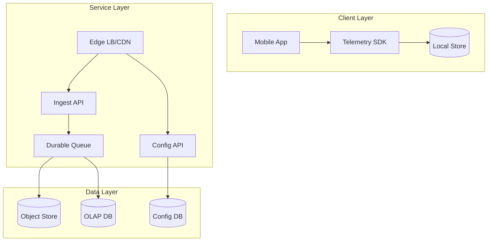
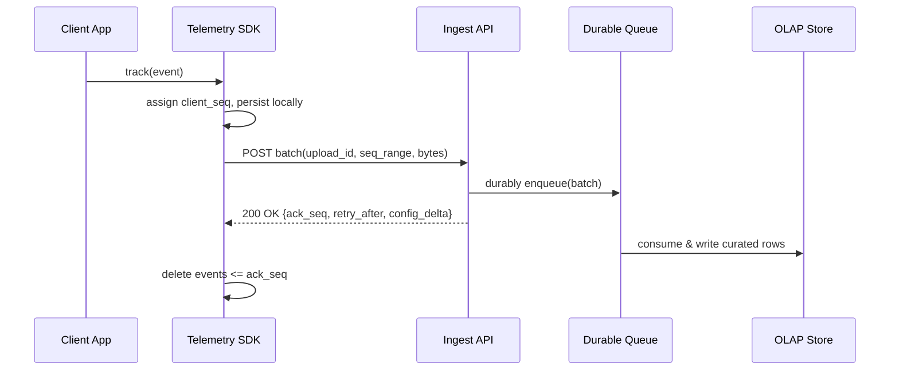

## Overview

Mobile telemetry upload looks simple (“send events to a server”), but production constraints make it tricky: radios are energy-expensive, connectivity is intermittent, OS background execution is restricted, and users care about both battery life and data usage. Meanwhile, backend systems must ingest large volumes reliably, deduplicate retries, and support analytics without turning uploads into a low-latency, always-on stream.

The key insight is to treat telemetry as **opportunistic, batched, and idempotent**. On-device, we persist events to a local write-ahead log, then upload in adaptive batches only when conditions are favorable (e.g., network available, not in power-save mode, optionally Wi-Fi/charging). On the server, we acknowledge quickly after durable enqueue, using a protocol with **client sequence numbers + idempotency keys** so retries don’t inflate volume. This yields predictable battery/network impact while providing high ingestion durability and scalable downstream processing.

## Requirements

### Functional Requirements
- Capture client events with metadata (timestamp, app version, device/network context) and persist locally until uploaded.
- Upload events in **batches** with compression and optional encryption, minimizing radio “wake” time.
- Support **intermittent connectivity** with safe retries, including app restarts and OS-killed background jobs.
- Provide **idempotent ingestion** so duplicate uploads (retries) do not double-count events.
- Allow server-driven **dynamic config** (sampling rates, max batch size, upload intervals, Wi‑Fi-only policies).
- Support **backpressure**: server can throttle clients; clients must adapt without draining battery.
- Enforce basic privacy controls: PII redaction, tenant isolation, and deletion requests where applicable.
- Provide delivery feedback to the client (acknowledged sequence) so local storage can be reclaimed safely.

### Non-Functional Requirements
- **Scale**: 50M DAU; ~500 events/device/day ⇒ ~25B events/day; peak ~15k upload requests/s; ~5–10 TB/day compressed.
- **Latency**:
  - Upload request (client radio-on time): **P50 < 200ms**, **P99 < 1s** (to reduce tail radio costs).
  - Analytics availability: **< 5 minutes** end-to-end for “near-real-time” dashboards; hours acceptable for cold paths.
- **Availability**: **99.99%** ingest API; degraded mode allowed (throttle but don’t hard-fail) during incidents.
- **Consistency**:
  - **Strong** for per-upload ack/idempotency decisions.
  - **Eventual** for analytics/indexing and cross-region aggregation.
- **Durability**:
  - Client: tolerate app crash/OS kill with **0 data loss** for persisted events (bounded by local quota).
  - Server: once acked, **no loss** under single-node failure; multi-region RPO defined below.

### Constraints & Assumptions
- Mobile OS background limits apply (Android Doze/App Standby; iOS BGTask/Background URLSession).
- Network access can be costly/limited; clients may enforce “Wi‑Fi only” or “low data” modes.
- The system serves multiple apps/tenants; per-tenant quotas and isolation required.
- Compliance: GDPR/CCPA deletion requests; minimal PII storage; encryption in transit and at rest.
- Small team constraint: prefer operationally mature building blocks (HTTP/2, Kafka/PubSub, ClickHouse/BigQuery).

## High-Level Architecture

Clients write events to a local durable store and upload opportunistically via the Ingest API. The ingest tier is optimized for fast authentication, validation, throttling, and durable enqueue; it returns an acknowledgment (ack) as soon as the batch is safely committed to the queue. Downstream consumers write raw immutable logs to object storage for reprocessing and load curated event data into an OLAP store for fast querying.

This separation keeps the mobile request path short (lower radio time) while preserving operational flexibility: you can change storage formats, analytics pipelines, and schemas without changing the client protocol, and you can throttle/shape traffic at the edge without losing durability guarantees.

## Component Deep-Dive

### Telemetry SDK (Mobile)

**Responsibility**: Capture events, persist locally, batch/compress, schedule uploads under OS constraints, apply server config.

**Key Design Decisions**:
- Use a local **append-only WAL** (SQLite or file log) with a monotonic `client_seq` so deletes are safe after ack.
- Use **adaptive scheduling**: upload when `(batch_bytes ≥ threshold) OR (oldest_event_age ≥ max_delay)` and device conditions are acceptable; coalesce work to avoid frequent radio wakes.

**Technology Choice**: SQLite (WAL mode) + Protobuf encoding + Zstd (or gzip if Zstd unavailable) + OS-native schedulers (Android WorkManager/JobScheduler; iOS BGTaskScheduler/Background URLSession).

**Scaling Strategy**: Local-only; scale is per-device. Enforce quotas (e.g., max 50–200MB local telemetry) and drop policy by priority (debug < info < error) under pressure.

### Ingest API (Sync Endpoint)

**Responsibility**: Authenticate, validate, deduplicate/idempotency, throttle, and durably enqueue batches; return ack/config quickly.

**Key Design Decisions**:
- **Ack-after-enqueue**: only acknowledge once the batch is committed to a durable queue (or replicated log), not after downstream storage.
- **Idempotency via (device_id, upload_id)** plus `client_seq` range checks to safely handle retries and replays.

**Technology Choice**: Stateless service (Go/Java) behind edge LB; HTTP/2; Protobuf payload; Redis (optional) for hot idempotency keys; otherwise rely on a compact “seen uploads” store in the queue consumer.

**Scaling Strategy**: Horizontal autoscaling by CPU and request rate; shard throttling and quotas by `tenant_id` and `device_id`.

### Durable Queue / Stream

**Responsibility**: Buffer bursts, decouple ingest from storage/analytics, preserve ordering per device when needed.

**Key Design Decisions**:
- Partition by `hash(tenant_id, device_id)` to keep per-device ordering for dedupe/sequence acks.
- Retain raw batches for replay (e.g., 3–7 days) to support reprocessing and schema evolution.

**Technology Choice**: Kafka (self-managed/MSK) or cloud Pub/Sub/Event Hubs.

**Scaling Strategy**: Increase partitions; use compression; enforce quotas per tenant; monitor consumer lag and apply backpressure signals to clients.

### Storage & Analytics

**Responsibility**: Store immutable raw events, provide fast query for dashboards and investigations, support retention/deletion.

**Key Design Decisions**:
- Dual-write: **raw immutable** in object storage + **curated columns** in OLAP for cost/performance.
- Support deletion by storing user identifiers separately and minimizing joins; apply TTL/partition drops.

**Technology Choice**: S3/GCS + ClickHouse (or BigQuery/Snowflake) + schema registry for event versions.

**Scaling Strategy**: Partition by day + tenant; cluster OLAP by `tenant_id` and `event_type`; rollups/materialized views for common aggregates.

### Config Service

**Responsibility**: Serve client upload policy and sampling knobs; support gradual rollout and per-tenant overrides.

**Key Design Decisions**:
- Config fetched on startup and occasionally (e.g., daily) and also piggybacked on ingest responses to avoid extra radio wakeups.
- Use signed configs with versioning to prevent rollback confusion and to support offline operation.

**Technology Choice**: Simple REST API backed by Postgres/DynamoDB; edge caching with short TTL (e.g., 5–15 minutes).

**Scaling Strategy**: Cache aggressively at edge; configs are small and read-heavy.

## Data Model

### Storage Schema

**On-device (SQLite)**
- `events`
  - `client_seq` (INTEGER, PK, monotonic)
  - `event_id` (UUID)
  - `ts_ms` (INTEGER)
  - `type` (TEXT)
  - `payload_pb` (BLOB)
  - `priority` (INTEGER)
  - `size_bytes` (INTEGER)
  - `uploaded` (BOOLEAN, optional; prefer deleting after ack)
- `state`
  - `last_acked_seq` (INTEGER)
  - `config_version` (TEXT)
  - `next_allowed_upload_ts_ms` (INTEGER)

**Ingest (metadata store; optional but common)**
- `upload_dedupe`
  - `tenant_id` (STRING)
  - `device_id` (STRING)
  - `upload_id` (STRING)
  - `first_seq` (INT64)
  - `last_seq` (INT64)
  - `received_at` (TIMESTAMP)
  - TTL (e.g., 7 days)

**OLAP (curated)**
- `telemetry_events_vN`
  - `event_date` (DATE)
  - `tenant_id` (STRING)
  - `device_id_hash` (FIXED_STRING / BYTES)
  - `event_type` (STRING)
  - `ts_ms` (INT64)
  - `app_version` (STRING)
  - `os` (STRING)
  - `net_type` (ENUM)
  - `payload` (JSON or nested columns)
  - `ingest_ts` (TIMESTAMP)

**Raw (object store)**
- `s3://.../tenant_id=.../date=YYYY-MM-DD/hour=HH/partition=.../*.pb.zst`

### Data Flow

## API Design

Protocol choices prioritize battery/data:
- **HTTP/2** for connection reuse and lower handshake overhead.
- **Protobuf** payloads for compactness and schema evolution.
- **Compression** (`Content-Encoding: zstd` preferred; fallback `gzip`).
- Optional **payload encryption** (application-layer) for sensitive tenants.

### POST `/v1/telemetry/batches`

**Headers**
- `Authorization: Bearer <token>` (or mTLS for managed devices)
- `Content-Type: application/x-protobuf`
- `Content-Encoding: zstd|gzip`
- `Idempotency-Key: <upload_id>` (client-generated UUID)
- `X-Tenant-Id: <tenant_id>`
- `X-Device-Id: <stable_or_rotating_device_id>`
- `X-SDK-Version: <semver>`

**Request (Protobuf sketch)**
- `upload_id` (string)
- `first_seq` (int64)
- `last_seq` (int64)
- `client_time_ms` (int64)
- `events[]`:
  - `seq` (int64)
  - `event_id` (bytes16)
  - `ts_ms` (int64)
  - `type` (string)
  - `payload` (bytes)
  - `attrs` (map<string,string> minimal)

**Response (JSON or Protobuf; keep small)**
- `ack_seq` (int64) — highest contiguous `client_seq` accepted for this device
- `received_upload_id` (string)
- `retry_after_ms` (int64) — backpressure hint; 0 means “normal”
- `config_delta` (optional) — new sampling/batching parameters with `config_version`

**Error Handling**
- `400` invalid schema/seq gap too large; include `error_code` and `expected_next_seq` if applicable.
- `401/403` auth failures; client refreshes token and retries later.
- `409` idempotency conflict (same `upload_id` with different content/seq_range) → client must generate a new upload and rebase from `ack_seq`.
- `413` batch too large → client splits batch.
- `429` throttled → client respects `Retry-After` and increases backoff.
- `5xx` transient → exponential backoff with jitter.

**Idempotency**
- Client reuses the same `upload_id` for retries of the *exact same* batch.
- Server stores `(tenant_id, device_id, upload_id) → ack_seq/seq_range` with TTL and returns the same ack on replay.
- Ack is based on contiguous sequences; client deletes only `<= ack_seq`.

### GET `/v1/telemetry/config`

Used rarely; prefer piggyback in upload response.

**Response**
- `config_version`
- `max_batch_bytes` (e.g., 256KB–1MB compressed)
- `max_batch_events` (e.g., 200–1000)
- `max_delay_ms` (e.g., 5–15 minutes for non-critical)
- `wifi_only` (bool, tenant/user controlled)
- `sampling` rules (by event_type, priority)
- `daily_data_budget_bytes` (soft limit)

## Scaling & Performance

### Bottleneck Analysis
- **Mobile radio tail energy**: frequent small uploads dominate battery.
  - Mitigation: batching thresholds, condition-based scheduling, HTTP/2 keep-alive reuse within a job, piggyback config.
- **Ingest CPU (decompression/validation)**: expensive at peak.
  - Mitigation: limit batch sizes, fast parsing, reject oversized payloads early, autoscale, consider dedicated decompress workers.
- **Queue/consumer lag**: downstream slowdown can cascade to clients.
  - Mitigation: backpressure (`retry_after_ms`), autoscale consumers, degrade to raw-only path temporarily.
- **Dedup state growth**: idempotency keys at high volume.
  - Mitigation: compact TTL store keyed by upload_id, partitioned by tenant/device; avoid per-event dedupe unless required.

### Horizontal Scaling
- **Edge/LB**: anycast/CDN termination, regional routing, WAF/rate limit.
- **Ingest API**: stateless autoscaling; shard limits by tenant; prefer regional affinity.
- **Queue**: partition scaling; replication factor 3; quota enforcement per tenant.
- **OLAP**: partition by date and tenant; scale out with shards/replicas; pre-aggregate common queries.

**Partitioning Strategy**
- Queue key: `hash(tenant_id + device_id)` to preserve per-device order.
- OLAP primary partition: `event_date`, secondary: `tenant_id`, clustering: `event_type`.

### Caching Strategy
- **Config caching**: edge cache GET `/config` for 5–15 minutes; also cache in SDK with `config_version`.
- **Auth/JWKS caching**: cache token verification keys to avoid per-request auth roundtrips.
- **Server-side idempotency cache**: hot keys in Redis (TTL hours) with fallback to durable store (TTL days) if needed.

**Cache Invalidation**
- Config: versioned; clients accept the highest `config_version` and ignore older ones.
- Idempotency: TTL-based; safe because client retries are bounded in time.

## Trade-offs & Alternatives

### Key Trade-offs Made
- **Chosen**: ack after durable enqueue (queue commit).
  - **Sacrificed**: “stored in OLAP” guarantee at ack time.
  - **Why**: minimizes client radio-on time and isolates mobile experience from downstream hiccups.
- **Chosen**: sequence-based deletion (`client_seq` + `ack_seq`).
  - **Sacrificed**: perfect handling of out-of-order event generation across threads without local ordering.
  - **Why**: enables compact acks and safe cleanup; SDK can assign seq at persistence time.
- **Chosen**: batch-level idempotency (`upload_id`) rather than per-event dedupe by default.
  - **Sacrificed**: protection against clients that reshuffle batch content across retries.
  - **Why**: drastically reduces server dedupe cost; conflicts are handled via `409` and client rebase.

### Alternative Approaches
- **Always-on streaming (MQTT/WebSocket)**: lower per-event latency but worse battery and more fragile under mobile background limits.
- **Upload via background file transfer only (iOS Background URLSession)**: great reliability for large blobs, but less control for small, frequent batches and cross-platform parity.
- **Per-event at-least-once with server-side dedupe by event_id**: simpler client but expensive server state at large scale; still suffers from radio tail energy.

## Failure Modes & Mitigations

### Failure Scenarios
- **Scenario**: Device offline / captive portal.
  - **Impact**: delayed uploads; local storage growth.
  - **Detection**: repeated network errors; OS connectivity signals.
  - **Mitigation**: exponential backoff + jitter; upload only on validated connectivity; enforce local quota and drop low-priority events first.
- **Scenario**: Server throttling / regional overload.
  - **Impact**: increased retries and battery use if naive.
  - **Detection**: `429` rate, rising `retry_after_ms`.
  - **Mitigation**: client respects `Retry-After`, increases batch size within limit, reduces upload frequency, applies stronger sampling.
- **Scenario**: Duplicate uploads due to retries/timeouts.
  - **Impact**: double-counted analytics, higher cost.
  - **Detection**: repeated `upload_id` seen.
  - **Mitigation**: batch idempotency store; ack replay; `409` on conflicting payloads.
- **Scenario**: Queue outage / high consumer lag.
  - **Impact**: ingest can’t durably accept; client failures.
  - **Detection**: queue error rate, lag metrics.
  - **Mitigation**: fail closed on ack (no enqueue → no ack); return `503` with `Retry-After`; optionally buffer briefly in local disk on ingest nodes (bounded) but prefer simplicity.
- **Scenario**: Bad config rollout (e.g., too frequent uploads).
  - **Impact**: battery drain / traffic spike.
  - **Detection**: client-side upload frequency metrics; server QPS spike correlated with config_version.
  - **Mitigation**: staged rollout, kill switch, max clamps in SDK (hard minimum interval, daily budget).

### Disaster Recovery
- **Targets**: RTO 1 hour, RPO 5 minutes for ingest metadata; raw event loss after ack should be ~0 in a region failure with replicated queue.
- **Backup Strategy**: object store is the source of truth for replay; OLAP snapshots daily; config DB PITR.
- **Failover Procedures**: active-active ingest in 2+ regions; clients use DNS/anycast with health-based routing; queue replication across AZs and (optionally) cross-region mirroring for critical tenants.

## Operational Considerations

### Monitoring & Alerting
- Ingest: request rate, P50/P99 latency, 4xx/5xx rate, decompression CPU, auth failures, throttles (`429`).
- Queue: produce/consume rate, partition lag, ISR/replication health.
- Client quality (from sampled telemetry): median upload interval, retry counts, bytes/day/device, % dropped due to quota, ack gap (pending seq count).
- Alerts (examples):
  - Ingest P99 > 1s for 10m
  - `5xx` > 1% for 5m
  - Queue consumer lag > 5 minutes
  - Bytes/day/device +30% correlated with new config_version

### Deployment Strategy
- Use canary + gradual rollout per region and per tenant; keep backward-compatible schema via Protobuf.
- Rollback by routing config_version back; ingest supports N-2 payload versions.
- Safe changes: add optional fields; avoid renaming/removing fields; use feature flags in config.

## References & Further Reading

- Android WorkManager/JobScheduler background execution guides: https://developer.android.com/topic/performance/background-optimization
- iOS Background Tasks and Background URLSession: https://developer.apple.com/documentation/backgroundtasks
- Kafka design and operational guidance: https://kafka.apache.org/documentation/
- “The Tail at Scale” (latency tail effects): https://research.google/pubs/pub40801/
- Protobuf language guide (schema evolution): https://protobuf.dev/programming-guides/proto3/
- Zstandard compression (trade-offs vs gzip): https://facebook.github.io/zstd/