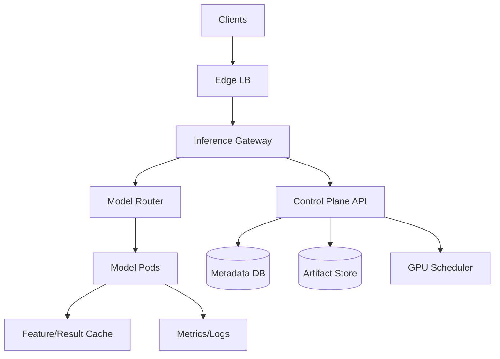
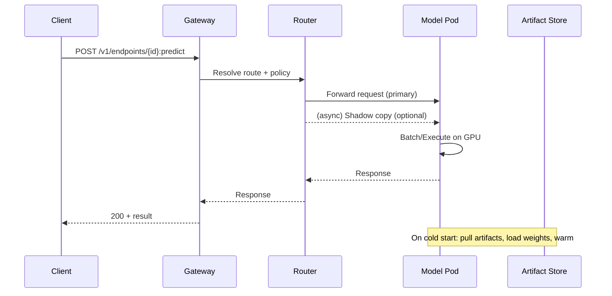

## Overview

A model serving platform must reliably host thousands of heterogeneous ML models (tiny CPU classifiers through multi‑GPU LLMs) while meeting strict tail-latency SLOs, controlling cost, and enabling safe rollout patterns (canary, blue/green, shadow). The hard part is that “inference” is not a single workload: models differ wildly in memory footprint, load time, batching behavior, hardware constraints (GPU type/MIG), and runtime dependencies—so naive scheduling and autoscaling either waste GPUs or cause cascading latency failures.

The key insight is to split the system into a **strongly consistent control plane** (model metadata, deployment intent, traffic policy) and a **high-performance data plane** (routing, batching, execution) with explicit mechanisms for **GPU-aware scheduling**, **warm capacity**, and **artifact locality**. Cold starts are treated as a first-class product surface: we reduce them via prewarmed pools, node-level artifact caches, and “load-budgeted” rollout controllers rather than hoping autoscaling hides the problem.

## Requirements

### Functional Requirements
- Register and version models (artifacts + metadata), with immutable versions and provenance.
- Create and manage deployments (replicas, resource requirements, runtime, env, secrets).
- Route inference traffic to endpoints with weighted splits (A/B, canary) and **shadow** duplication.
- GPU-aware scheduling: place replicas on compatible accelerators (type, memory, MIG) with quotas and priorities.
- Autoscale deployments based on QPS/latency/queue depth/GPU utilization, including scale-to-zero for rarely used models.
- Reduce cold-start latency via warm pools, artifact caching, and preloading policies.
- Observability: per-model latency/error/throughput, GPU metrics, and shadow comparison reports.
- Multi-tenant isolation: authN/authZ, per-tenant quotas, audit logs, and cost/usage metering.

### Non-Functional Requirements
- **Scale**: 5,000–20,000 model versions; 1,000 active endpoints; 50k QPS average / 200k QPS peak (small models), plus 500 QPS for large LLM endpoints; 10–50 TB of model artifacts; 10k concurrent clients.
- **Latency**:
  - Warm inference: P50 20–50ms (small models), P99 150ms.
  - LLM streaming: first-token P50 300ms, P99 1.5s (warmed).
  - Cold start: target <3s for small models, <20s for large models (measured to first successful request).
- **Availability**: 99.99% for routing + warmed inference; 99.9% for control plane APIs.
- **Consistency**:
  - Strong: model registry metadata, deployment intent, traffic policy, authZ.
  - Eventual: metrics aggregation, shadow analysis, usage/billing rollups.
- **Durability**: model artifacts durable with 11 9s (object storage); metadata RPO ≤ 1 minute; inference logs optional with tenant-configurable retention.

### Constraints & Assumptions
- Kubernetes-based deployment (on-prem or cloud) with NVIDIA GPUs and optional MIG enabled.
- Team can operate a small number of core services (control plane, scheduler, router) and leverage managed storage where possible.
- Compliance: tenant isolation, encryption at rest/in transit, auditability; optional PII redaction for inference logs.
- Budget pressure: GPU utilization is a key KPI; platform must support quotas, priorities, and preemption.

## High-Level Architecture

The system separates **request-path components** (Edge, Gateway, Router, Model Pods) from **management components** (Control Plane, Metadata DB, Artifact Store, Scheduler). The data plane is optimized for low overhead routing, batching, and GPU execution; it reads deployment state from a cached control-plane view and continues operating during transient control-plane outages.

GPU scheduling is handled as a dedicated concern: deployment intent (replicas, GPU type, MIG profile, max concurrency, warm-min) is translated into placement decisions using cluster capacity signals. Artifacts are stored once in an object store and pulled into node-local caches to avoid repeatedly fetching large weights during scaling events.

## Component Deep-Dive

### Control Plane API
**Responsibility**: Source of truth for models, versions, endpoints, deployments, traffic policies, quotas, and rollout state.

**Key Design Decisions**:
- Use a strongly consistent metadata store (e.g., Postgres) and reconcile desired→actual state (Kubernetes-style controllers) to avoid snowflake operational states.
- Represent traffic policy (weights, shadow, header-based routing) as an immutable versioned object to enable auditable rollbacks.

**Technology Choice**: Go/Java service + Postgres; optional etcd if tightly integrated with Kubernetes CRDs; OPA for policy evaluation.

**Scaling Strategy**: Stateless API replicas behind L7; read-heavy caching (Redis) for listing/GETs; background controllers horizontally scalable via work queues.

### Inference Gateway
**Responsibility**: AuthN, request normalization, admission control, rate limiting, and tenant-level routing entry point.

**Key Design Decisions**:
- Enforce per-tenant quotas and per-endpoint rate limits at the edge to protect GPU fleet from overload.
- Provide idempotency keys for async operations (e.g., “warm model”, “deploy”), but keep inference itself non-idempotent by default (unless caller provides request-id for caching).

**Technology Choice**: Envoy-based gateway or custom gateway service with mTLS, JWT validation, and rate limiting.

**Scaling Strategy**: Stateless; autoscale on RPS and CPU; keep inference request overhead <1ms P50.

### Model Router (Data Plane Control)
**Responsibility**: Low-latency endpoint resolution, traffic splitting, shadow duplication, batching hints, and backend selection.

**Key Design Decisions**:
- Maintain an in-memory routing table updated via watch/stream from control plane (push > pull) to avoid DB hits on request path.
- Implement shadow as **asynchronous fork** with independent timeouts so shadow slowness does not affect primary latency SLOs.

**Technology Choice**: Envoy extension, or dedicated router service in Rust/Go; consistent hashing for sticky routing (e.g., session or user id) when needed.

**Scaling Strategy**: Stateless; scale with RPS; shard by endpoint id if necessary; keep routing table updates incremental.

### GPU Scheduler
**Responsibility**: Place model replicas on GPUs with constraints (GPU type, memory, MIG profile), maximize utilization, and enforce fairness (quotas/priorities).

**Key Design Decisions**:
- Separate “what to run” (deployment intent) from “where to run” (placement) and continuously rebalance with disruption budgets to reduce fragmentation.
- Use bin-packing with constraints: GPU memory, compute capability, topology (NVLink), and anti-affinity for correlated failures.

**Technology Choice**: Kubernetes scheduler extender or custom controller integrating with K8s; NVIDIA GPU Operator + device plugin; optional Kueue/Volcano for quota and gang scheduling.

**Scaling Strategy**: Event-driven reconcile; partition scheduling by cluster/tenant; cache node inventories; degrade gracefully by placing on “compatible but suboptimal” GPUs when allowed.

### Model Pods (Runtime)
**Responsibility**: Execute inference (CPU/GPU), manage model loading, batching, and runtime-specific optimizations (TensorRT, ONNX Runtime, Triton, vLLM).

**Key Design Decisions**:
- Standardize on a small set of runtimes (e.g., Triton for classic models; vLLM/TGI for LLMs) to reduce operational variance.
- Treat loading as a controlled phase: concurrency-limited “load budget” per node/GPU to prevent thundering herds and IO storms.

**Technology Choice**: Triton Inference Server, ONNX Runtime, TorchServe (selectively), vLLM/TGI for LLMs; node-local NVMe cache for weights.

**Scaling Strategy**: Autoscale on queue depth + GPU utilization; enable dynamic batching; support model parallelism for large models; use scale-to-zero with warm pools for long-tail endpoints.

## Data Model

### Storage Schema

**models**
- `model_id` (UUID, PK)
- `name` (string, unique per tenant)
- `tenant_id` (UUID, index)
- `task_type` (enum: classification, embedding, llm, etc.)
- `created_at`, `updated_at`

**model_versions**
- `version_id` (UUID, PK)
- `model_id` (UUID, FK)
- `artifact_uri` (string; content-addressed preferred)
- `runtime` (enum: triton, onnx, vllm, custom)
- `signature` (json: inputs/outputs, dtypes, shapes)
- `requirements` (json: GPU mem, GPU type allowlist, MIG profile)
- `created_by`, `created_at`

**endpoints**
- `endpoint_id` (UUID, PK)
- `tenant_id` (UUID, index)
- `name` (string)
- `auth_policy_id` (UUID)
- `created_at`

**deployments**
- `deployment_id` (UUID, PK)
- `endpoint_id` (UUID, index)
- `version_id` (UUID)
- `desired_replicas` (int)
- `min_warm_replicas` (int)
- `max_replicas` (int)
- `resources` (json: cpu/mem/gpu, gpu_type, mig)
- `autoscaling_policy` (json)
- `status` (enum: pending, ready, degraded, failed)
- `created_at`, `updated_at`

**traffic_policies**
- `policy_id` (UUID, PK)
- `endpoint_id` (UUID, index)
- `primary_rules` (json: weights by deployment_id)
- `shadow_rules` (json: sample_rate, shadow_deployment_id, headers)
- `sticky_key` (string nullable)
- `version` (int)
- `updated_at`

**usage_samples** (append-only)
- `ts_bucket` (time)
- `tenant_id`, `endpoint_id`, `deployment_id`
- `requests`, `gpu_ms`, `errors`
- (rolled up asynchronously)

### Data Flow

Key operations:
- **Deploy**: Control Plane writes deployment + policy → controllers create K8s resources → scheduler places pods → pods pull artifacts (node cache first) → readiness gates open traffic.
- **Predict**: Gateway validates + limits → Router selects deployment (weights/sticky) → Pod batches/executes → logs/metrics emitted asynchronously.

## API Design

### Register Model Version
`POST /v1/models/{modelName}/versions`
- Request:
  - `artifact_uri` (string)
  - `runtime` (string)
  - `signature` (object)
  - `requirements` (object)
- Response: `201 { version_id, model_id }`
- Errors: `409` (duplicate), `400` (invalid signature), `403` (policy), `413` (artifact too large pointer policy)
- Idempotency: `Idempotency-Key` supported; same key returns same `version_id`.

### Create/Update Deployment
`PUT /v1/endpoints/{endpointId}/deployments/{deploymentId}`
- Request:
  - `version_id`
  - `resources` (cpu/mem/gpu, gpu_type/mig)
  - `min_warm_replicas`, `max_replicas`
  - `autoscaling_policy` (target_qps, target_gpu_util, max_queue_ms)
- Response: `202 { deployment_id, status, rollout_id }`
- Errors: `409` (incompatible runtime/resources), `422` (quota exceeded), `503` (insufficient capacity)
- Idempotency: required for deploy operations.

### Set Traffic Policy (Canary/Shadow)
`PUT /v1/endpoints/{endpointId}/traffic`
- Request:
  - `primary_rules`: `{ deployment_id: weight }` (weights sum to 1.0)
  - `shadow_rules`: `{ shadow_deployment_id, sample_rate, timeout_ms }`
  - `sticky_key` (optional)
- Response: `200 { policy_id, version }`
- Errors: `400` (bad weights), `409` (unknown deployment), `412` (precondition failed if `If-Match` version mismatch)
- Idempotency: `If-Match` on policy version to prevent lost updates.

### Predict
`POST /v1/endpoints/{endpointId}:predict`
- Request: `application/json` or `application/x-protobuf` (preferred for performance)
- Response: `200` model output; headers include `x-deployment-id`, `x-model-version-id`, `x-request-id`
- Errors: `401/403`, `404` (endpoint), `429` (rate limit), `503` (no ready replicas), `504` (timeout)
- Idempotency: optional `x-request-id` enables safe retry + (optional) response cache for deterministic models.

## Scaling & Performance

### Bottleneck Analysis
- **Cold starts (artifact + load)**: mitigate with node-local caches, prewarm pools, and load budgeting per node/GPU.
- **GPU fragmentation**: mitigate with MIG profiles, bin-packing, consolidation, and limiting SKU sprawl (few GPU types).
- **Tail latency under burst**: mitigate with admission control, queue-based autoscaling, dynamic batching, and request shedding.
- **Hot endpoints**: mitigate with per-endpoint sharded routers, sticky routing, and independent autoscaling limits.

### Horizontal Scaling
- **Gateway/Router**: scale out statelessly behind L7; keep routing state in memory with watch updates.
- **Model Pods**: scale by HPA/KEDA using queue depth + GPU metrics; for LLMs add continuous batching and token-based schedulers.
- **Scheduler**: partition reconcile loops; keep node inventory cache; backoff under churn.
- **Partitioning**:
  - By tenant: quotas + optional dedicated node pools.
  - By model class: separate pools for LLM vs “classic” models to avoid noisy-neighbor effects.

### Caching Strategy
- **Artifact caching**:
  - Node-local content-addressed cache on NVMe; warm on image pull or “warm endpoint” API.
  - Optional shared POSIX cache (e.g., EFS/Filestore) for faster first pull, still copy to local for runtime.
- **Request/result caching**:
  - For embeddings/classifiers: cache keyed by `(endpoint, version, input_hash)` with TTL minutes-hours (tenant-configurable).
- **Feature cache** (if platform provides feature retrieval):
  - Redis/Memcached for low-latency feature lookups; protect with per-tenant limits.
- **Invalidation**:
  - Versioned deployments make invalidation simple: cache keys include `version_id`; changing traffic naturally shifts keys.

## Trade-offs & Alternatives

### Key Trade-offs Made
- **Kubernetes-centric runtime**
  - Chosen: leverage K8s primitives + controllers.
  - Sacrificed: some ultra-low-latency bare-metal optimizations.
  - Why: operational maturity, ecosystem (GPU Operator, autoscaling), and portability.
- **Strong control plane / fast data plane split**
  - Chosen: keep inference path independent from DB.
  - Sacrificed: more complexity (watch streams, cache coherency).
  - Why: predictable tail latency and resilience during control-plane incidents.
- **Standardized runtimes**
  - Chosen: Triton + vLLM/TGI as primary.
  - Sacrificed: flexibility for arbitrary bespoke servers.
  - Why: reduces incident surface area and improves utilization via batching.

### Alternative Approaches
- **Serverless per-request inference (FaaS style)**: simpler UX but poor GPU utilization and severe cold starts for large weights.
- **Single monolithic “model mesh” service**: can simplify routing but becomes a scaling/upgrade bottleneck and limits runtime diversity.
- **Ray Serve as the primary orchestrator**: strong for Python-centric serving, but introduces another scheduling plane and can complicate strict multi-tenancy and K8s integration.

## Failure Modes & Mitigations

### Failure Scenarios
- **Scenario**: GPU node failure / ECC errors
  - **Impact**: replica loss; localized 5xx/latency spikes
  - **Detection**: node health + GPU DCGM metrics; pod eviction events
  - **Mitigation**: spread replicas across zones; fast reschedule; keep min warm replicas; circuit-break unhealthy nodes.
- **Scenario**: Thundering herd cold starts after traffic shift
  - **Impact**: elevated P99 and timeouts
  - **Detection**: cold-start counters, artifact download saturation, readiness delay
  - **Mitigation**: rollout controller enforces load budgets; staged traffic ramp; prewarm before shifting weights; node-local caches.
- **Scenario**: Bad model version (crash/OOM/wrong outputs)
  - **Impact**: endpoint degradation; potential correctness issues
  - **Detection**: crash loops, OOMKilled, golden-signal regressions, shadow diff alerts
  - **Mitigation**: canary with automatic rollback; shadow validation gates; per-version kill switch.
- **Scenario**: Control plane outage
  - **Impact**: cannot deploy/change traffic; inference should continue
  - **Detection**: API errors, DB alerts
  - **Mitigation**: routers continue using last-known-good policies; cached auth keys; queued reconciles resume on recovery.
- **Scenario**: Router overload
  - **Impact**: increased request latency/503
  - **Detection**: router CPU, queueing, timeouts
  - **Mitigation**: scale out routers; apply backpressure/admission at gateway; isolate hot endpoints.

### Disaster Recovery
- **Targets**: RTO 30 minutes; RPO 1 minute for metadata; artifacts RPO 0 (object store).
- **Backups**: continuous WAL archiving for Postgres; daily snapshots; verify restores weekly.
- **Failover**: warm-standby control plane in secondary region; data plane can run active/active with regional endpoints; traffic manager shifts DNS/LB.
- **Artifacts**: replicate object store cross-region; checksum validation on restore.

## Operational Considerations

### Monitoring & Alerting
- **Golden signals (per endpoint/deployment)**: RPS, error rate, P50/P99 latency, saturation (GPU util, memory), queue depth.
- **Cold start KPIs**: cold-start count, time-to-ready, artifact download time, load time, cache hit rate.
- **GPU health**: DCGM metrics, ECC, throttling, temperature; alert on sustained throttling or repeated XID errors.
- **Alert thresholds (examples)**:
  - P99 latency > SLO for 5 minutes
  - 5xx > 1% for 2 minutes
  - No ready replicas for endpoint with traffic
  - GPU util < 20% for high-cost pools (waste signal) or > 95% with rising queue depth (overload)

### Deployment Strategy
- Use progressive delivery:
  - **Canary**: 1% → 5% → 25% → 50% with automated rollback on SLO regression.
  - **Shadow**: duplicate sampled traffic to candidate version; compare outputs/latency; gate promotion on diff budgets.
  - **Blue/Green** for risky runtime changes.
- Rollback: revert traffic policy version (fast, no redeploy); optionally pin to last-known-good deployment.
- Safe changes: schema migrations with backward compatibility; routers support dual-read policy versions.

## References & Further Reading
- NVIDIA Triton Inference Server: https://github.com/triton-inference-server/server
- vLLM (continuous batching for LLMs): https://github.com/vllm-project/vllm
- KServe (Kubernetes model serving): https://kserve.github.io/website/
- Google Borg/Omega scheduling concepts (bin packing, preemption): https://research.google/pubs/pub43438/
- “The Tail at Scale” (latency engineering): https://research.google/pubs/pub40801/
- Kubernetes device plugins & GPU Operator: https://docs.nvidia.com/datacenter/cloud-native/gpu-operator/