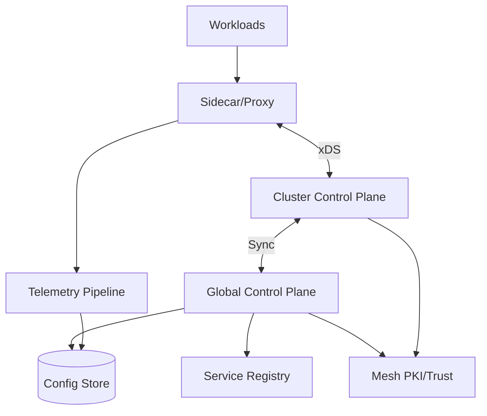
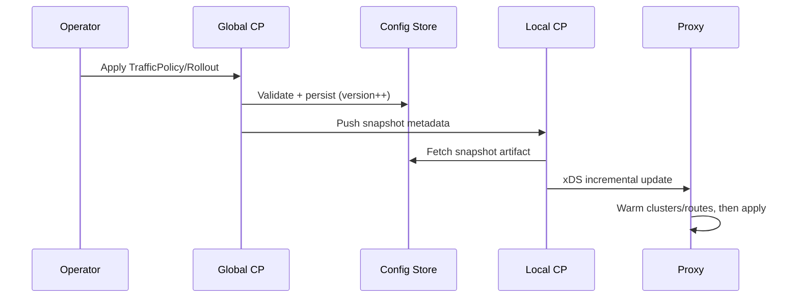

## Overview

A multi-cluster service mesh in a hybrid cloud environment must provide uniform security (mTLS), consistent traffic policy (routing, shifting, failover), and end-to-end observability across heterogeneous Kubernetes clusters and networks (on‑prem, multiple clouds). The challenge is that the data plane needs fast local decisions and resilience during partitions, while the control plane must safely distribute identity, certificates, and configuration with strong security guarantees and minimal operator overhead.

The key insight is to separate concerns: keep **cluster-local control** for latency and availability (local xDS/config, local CA/cert issuance cache, local policy enforcement), while using a **global control plane** for intent (service discovery federation, policy distribution, trust-domain management, rollout/traffic shift orchestration, and cross-cluster telemetry). This “global intent + local execution” model tolerates partitions, scales linearly with clusters, and supports incremental adoption across hybrid environments.

## Requirements

### Functional Requirements
- Establish and rotate **mTLS** between workloads across clusters, including trust-domain and identity management.
- Support **traffic management policies**: L7 routing, retries/timeouts, circuit breaking, rate limiting, and header-based routing.
- Enable **traffic shifting** (canary/blue-green) across services and across clusters/regions with progressive rollout controls.
- Provide **service discovery** across clusters: service export/import, endpoint discovery, and health-based failover.
- Offer **observability**: distributed tracing, service-level metrics (golden signals), and structured access logs with correlation IDs.
- Enforce **authorization policies** (RBAC/ABAC) at the mesh boundary and between services (zero-trust).
- Provide **multi-tenant** separation (namespaces/teams) with policy scoping and auditability.
- Deliver a **management API/UI** for operators: policy lifecycle, rollout status, certificate health, and troubleshooting tools.

### Non-Functional Requirements
- **Scale**:
  - 50 clusters (mix of on‑prem + cloud), 10K nodes total
  - 200K workloads (pods/VMs), 50K services, 5M endpoints
  - Control-plane steady-state: 50K xDS updates/min peak during deploys
  - Data-plane traffic: 1M RPS mesh-wide aggregate (bursty), 50–200K concurrent connections per large cluster
- **Latency**:
  - Control-plane propagation (policy → effective): P50 5s, P99 30s
  - In-cluster service-to-service request overhead: P50 <2ms, P99 <10ms (proxy + mTLS)
  - Cross-cluster request overhead: P99 <50ms additional network latency budget (mesh should not dominate)
- **Availability**:
  - Data plane: 99.99% (requests should continue during control-plane outages)
  - Control plane: 99.9% (global intent layer), 99.95% (cluster-local controllers)
- **Consistency**:
  - Traffic policy: eventual (seconds) acceptable; must be monotonic per-workload versioning
  - Identity/trust: strong consistency for root-of-trust changes; cert revocation/rotation must converge quickly
- **Durability**:
  - Policy and audit logs: 0 data loss (durable storage, multi-AZ)
  - Telemetry: best-effort (buffering), tolerates partial loss under extreme overload

### Constraints & Assumptions
- Clusters are Kubernetes-based (some may be managed services) and may not share flat networking.
- Hybrid connectivity via VPN/DirectConnect/ExpressRoute; intermittent partitions are expected.
- Team size: ~6–10 engineers; prefer proven OSS components where possible.
- Compliance: SOC2-like audit trails; some clusters may have data residency constraints (telemetry egress controls).
- Budget favors horizontal scaling and open standards (xDS, SPIFFE, OpenTelemetry).

## High-Level Architecture



Workloads send and receive traffic through sidecar proxies (or ambient dataplane, but conceptually still proxies). Proxies fetch dynamic configuration (xDS) from **cluster-local control planes** to keep routing decisions fast and available even if global systems are unreachable. The **global control plane** owns desired state (policies, rollouts, federation rules) and publishes it to each cluster-local control plane via a secure sync channel.

Identity and certificates are managed via a **mesh PKI** integrated with workload identity (SPIFFE/SPIRE-style). Observability is collected from proxies and apps through an **OpenTelemetry-compatible pipeline**, with buffering and optional local aggregation to respect egress constraints. A durable **config store** holds policies, rollout history, and audit logs; service registry data is federated to enable multi-cluster discovery and failover.

## Component Deep-Dive

### Global Control Plane

**Responsibility**: Central source of truth for mesh intent—traffic policies, auth policies, trust-domain configuration, service federation, and rollout orchestration across clusters.

**Key Design Decisions**:
- Use **declarative intent** (CRDs or API resources) and generate per-cluster snapshots to minimize coupling and simplify rollback.
- Implement **progressive delivery** at the control plane (weighted routing, analysis gates) with clear status reporting and audit trails.

**Technology Choice**: Kubernetes-style API server + controllers (Go), backed by etcd/Postgres (depending on environment), with gRPC control APIs. Use OPA/Rego (or CEL) for policy validation and admission control.

**Scaling Strategy**: Partition by cluster and namespace/tenant. Generate immutable config snapshots and distribute via watch streams; use work queues and rate limiting. Horizontal scale the API/controllers; store remains the bottleneck—use read replicas and aggressive caching.

### Cluster-Local Control Plane (Per Cluster)

**Responsibility**: Translate global intent into local xDS config; maintain local service discovery view; provide local policy evaluation; keep proxies configured during global outages.

**Key Design Decisions**:
- Prioritize **local availability**: keep last-known-good config; use versioned snapshots and staged updates (warming, then apply).
- Maintain **local registry cache** for endpoints and health; support outlier detection and locality-aware routing.

**Technology Choice**: Envoy xDS server (Istio-like control plane components or bespoke), Kubernetes informers, plus local cache (Redis/embedded) for computed artifacts.

**Scaling Strategy**: Run multiple replicas with leader election for write-heavy reconciles; shard xDS by proxy identity if needed; push incremental updates; isolate noisy tenants via separate namespaces/controllers.

### Mesh PKI & Identity

**Responsibility**: Issue and rotate workload certificates; manage trust bundles across clusters; enable cross-cluster mTLS with configurable trust domains and federation rules.

**Key Design Decisions**:
- Use **SPIFFE identities** (e.g., `spiffe://trust-domain/ns/serviceaccount`) for stable, portable identity across hybrid environments.
- Keep **short-lived leaf certs** (e.g., 24h) with automated rotation; rotate intermediates on a longer cadence; tightly control root rotations.

**Technology Choice**: SPIRE (server + agents) or equivalent, with an HSM/KMS-backed root CA (AWS KMS, GCP KMS, HashiCorp Vault). Distribute trust bundles via a secure config channel.

**Scaling Strategy**: Deploy SPIRE server per cluster (or per region) with federation to a global trust authority; cache SVIDs locally; rate-limit issuance; prefetch/renew before expiry.

### Service Registry & Federation

**Responsibility**: Multi-cluster service discovery (service export/import), endpoint selection, and health/failover across clusters and environments.

**Key Design Decisions**:
- Support **explicit export/import** (avoid accidental global exposure); enforce policy checks before federation.
- Use **endpoint summarization** for global view (don’t ship every endpoint everywhere); prefer locality routing with fallback.

**Technology Choice**: Kubernetes service registry + multi-cluster API (MCS), augmented with a global registry index (e.g., etcd/Postgres) storing service metadata and per-cluster endpoint summaries.

**Scaling Strategy**: Store per-service per-cluster aggregates (counts, health, priority) and fetch full endpoints only when needed (e.g., for failover). Use TTLs and heartbeat-based health.

### Observability Pipeline

**Responsibility**: Collect, process, and store metrics, traces, and logs; provide correlation and tenant-aware access control.

**Key Design Decisions**:
- Standardize on **OpenTelemetry** for traces/metrics/logs; enforce consistent semantic conventions.
- Apply **sampling and aggregation** at the edge (proxy/collector) to control cost while preserving SLO fidelity.

**Technology Choice**: OTel Collectors (daemonset + gateway), Prometheus/Mimir for metrics, Tempo/Jaeger for traces, Loki/ELK for logs; long-term storage in object store.

**Scaling Strategy**: Scale collectors horizontally; use batching, compression, and backpressure; isolate tenants via separate pipelines or labels + authz in query layer.

## Data Model

### Storage Schema

**GlobalConfig (table / document)**
- `id` (UUID)
- `kind` (TrafficPolicy | AuthPolicy | ServiceExport | Rollout | TrustBundle)
- `scope` (tenant/namespace/service)
- `spec` (JSON)
- `version` (monotonic int)
- `created_at`, `updated_at`
- `created_by` (principal)
- `status` (JSON: validation results, rollout progress)

**ClusterSnapshot**
- `cluster_id`
- `snapshot_id` (UUID)
- `generated_from_version` (int)
- `artifact` (compressed protobuf/JSON)
- `checksum`
- `created_at`
- `state` (staged | active | rolled_back)

**TrustBundle**
- `trust_domain`
- `root_certs` (PEM list)
- `intermediates` (optional)
- `not_before`, `not_after`
- `rotation_state` (planned | active | retired)

**AuditLog**
- `event_id`
- `timestamp`
- `actor`
- `action`
- `resource_ref`
- `diff` (JSON)
- `result` (allow/deny, reason)

**ServiceIndex**
- `service_fqn`
- `exports` (cluster list + policies)
- `clusters` (per-cluster summary: endpoints_count, healthy_count, priority, last_seen)

### Data Flow



Key operations:
- **Policy change**: validated centrally, persisted with versioning, rendered into per-cluster snapshots, then applied locally via xDS.
- **mTLS**: proxy obtains SVID (leaf cert) via local agent; trust bundle updates flow from global to local with strict gating.
- **Traffic shifting**: rollout controller updates weights over time, based on analysis signals from telemetry (error rate, latency, saturation).

## API Design

### Mesh Management API (REST or gRPC)

**Create/Update Traffic Policy**
- `PUT /v1/policies/traffic/{policyId}`
- Request:
  ```json
  {
    "scope": {"namespace":"payments","service":"checkout"},
    "rules": [{
      "match": {"headers":{"x-user-tier":"beta"}},
      "route": [{"destination":"checkout-v2","weight":10},{"destination":"checkout-v1","weight":90}],
      "timeoutsMs": 2000,
      "retries": {"attempts":2,"perTryTimeoutMs":500}
    }]
  }
  ```
- Response: `200` with `{ "version": 1842, "status": "staged" }`
- Errors: `400` (validation), `409` (version conflict), `403` (authz), `429` (rate limit)
- Idempotency: Require `If-Match` with resource `etag` or client-provided `idempotencyKey`.

**Create Rollout**
- `POST /v1/rollouts`
- Request:
  ```json
  {
    "service":"checkout",
    "namespace":"payments",
    "strategy":"canary",
    "steps":[{"weight":5,"pauseSec":300},{"weight":25,"pauseSec":600},{"weight":50,"pauseSec":900}],
    "analysis":{"p99LatencyMs":200,"errorRatePct":0.5}
  }
  ```
- Response: `202` with rollout id and status URL.
- Idempotency: `Idempotency-Key` header; server stores key→result for 24h.

**Trust Bundle Rotation**
- `POST /v1/trust/rotate`
- Request: `{ "trustDomain":"corp", "mode":"staged", "notAfter":"2027-01-01T00:00:00Z" }`
- Response: `202` with staged plan and required operator approvals.
- Safety: Two-person approval workflow; enforce staged rollout (publish new root alongside old, then retire).

**Cluster Registration**
- `POST /v1/clusters/register`
- Request includes cluster metadata + bootstrap token/cert.
- Response: returns mTLS client certs and endpoints for sync.
- Security: mutual TLS + short-lived bootstrap tokens; rotate cluster credentials.

## Scaling & Performance

### Bottleneck Analysis
- **xDS fanout** (many proxies reconnecting during deploys): mitigate with local control planes, incremental xDS, connection pooling, and push debouncing.
- **Config store load** (watch storms, large snapshots): mitigate with snapshot caching, CDN/object-store distribution for artifacts, and read replicas.
- **Service registry churn** (endpoints flapping): mitigate with health stabilization, TTLs, and summarization to global.
- **Telemetry cost** (high cardinality): mitigate with exemplars, label allowlists, tail sampling for traces, and per-tenant quotas.

### Horizontal Scaling
- **Global CP**: scale API/controllers horizontally; partition reconcile workers by tenant/cluster; use queue-based backpressure.
- **Local CP**: per-cluster replicas (2–5) behind a stable service VIP; shard proxy connections if needed.
- **Registry**: store summaries centrally; local caches remain authoritative for endpoints.
- **Telemetry**: collectors scale via daemonsets and gateway tiers; storage systems scale independently (Mimir/Tempo/Loki sharding).

### Caching Strategy
- **Proxy config**: keep last-known-good xDS; use ADS streaming with delta updates; pre-warm clusters before commit.
- **Snapshots**: store rendered artifacts in object storage; local CP caches by `checksum` with TTL (e.g., 24h).
- **Service discovery**: local CP maintains informer cache; global registry caches per-service summaries (TTL 10–30s).
- **Telemetry**: edge buffering in collectors (memory + disk spill), bounded by quotas; drop policies under overload.

Cache invalidation is version-driven: every artifact is immutable and referenced by `snapshot_id` + checksum; rollback is pointer switch.

## Trade-offs & Alternatives

### Key Trade-offs Made
- **Global intent + local execution**
  - Chosen: per-cluster control planes apply config locally.
  - Sacrificed: immediate global consistency and simpler single-control-plane ops.
  - Why: hybrid networks and partitions demand local survivability and lower latency.
- **Short-lived certs with automated rotation**
  - Chosen: 24h SVIDs, continuous renewal.
  - Sacrificed: more issuance load and operational complexity.
  - Why: reduces blast radius of key compromise and simplifies revocation.
- **Snapshot-based distribution**
  - Chosen: immutable per-cluster snapshots with versioning.
  - Sacrificed: higher artifact generation/storage cost.
  - Why: enables safe rollout, auditability, and deterministic rollback.

### Alternative Approaches
- **Single global xDS control plane**
  - Not chosen due to WAN dependency, higher latency, and fragility during partitions.
- **Fully decentralized mesh (cluster-only, no global CP)**
  - Not chosen because policy drift, inconsistent security posture, and painful multi-cluster traffic shifting.
- **No sidecars (L4-only, node proxy)**
  - Not chosen because L7 routing, per-workload identity, and fine-grained authz are harder; may be a future optimization (ambient mesh) once mature.

## Failure Modes & Mitigations

### Failure Scenarios
- **Global control plane outage**
  - Impact: no new policy rollouts; existing traffic continues.
  - Detection: health checks, controller lag, failed sync metrics.
  - Mitigation: local CP serves cached snapshots; operators can apply emergency local overrides with audit.
- **Cluster-local control plane outage**
  - Impact: proxies can’t receive updates; existing config continues.
  - Detection: xDS stream drop rate, config freshness SLO.
  - Mitigation: run 3 replicas; proxies use exponential backoff; last-known-good config retained.
- **PKI root compromise or rotation error**
  - Impact: widespread auth failures or security breach.
  - Detection: cert anomaly monitoring, failed handshakes, audit alerts.
  - Mitigation: staged root rotation, dual-trust period, emergency trust bundle rollback; HSM/KMS protections and strict access controls.
- **Network partition between clusters**
  - Impact: cross-cluster calls fail; failover may trigger.
  - Detection: synthetic probes, endpoint health degradation, increased retries/timeouts.
  - Mitigation: locality-aware routing with health-based failover; circuit breaking; separate control-plane sync channels with retries.
- **Telemetry pipeline overload**
  - Impact: missing metrics/traces/logs; possible proxy CPU/memory pressure.
  - Detection: collector queue depth, drop counters, proxy resource usage.
  - Mitigation: backpressure + bounded buffers; sampling; shed low-priority signals first; protect proxies with strict limits.

### Disaster Recovery
- **RTO/RPO**:
  - Global CP: RTO 1 hour, RPO 5 minutes (config/audit)
  - Telemetry: RTO 4 hours, RPO 1 hour (acceptable loss)
- **Backup strategy**: continuous backups of config store (WAL + snapshots), daily encrypted exports to object storage, periodic restore drills.
- **Failover procedures**: warm standby in secondary region; DNS failover for global API; re-issuance of cluster sync credentials if needed.

## Operational Considerations

### Monitoring & Alerting
- Key metrics:
  - xDS: connected proxies, push latency, NACK rates, config freshness
  - PKI: issuance rate, renewal failures, cert expiry histogram, handshake failures
  - Traffic: request rate, error rate, latency (P50/P95/P99), saturation, retries
  - Rollouts: step progression, analysis pass/fail, rollback counts
- Alert thresholds:
  - xDS NACK rate >1% for 5 min (page)
  - cert renew failures >0.5% for 10 min (page)
  - config freshness P99 >10 min (page)
  - error rate SLO burn (multi-window) for critical services (page)

### Deployment Strategy
- Use canary deployments for control plane components with automated rollback on SLO regression.
- Version gates: validate generated xDS against schema; stage snapshots; require warm/ACK before activation.
- Rollback:
  - Control plane: revert to previous container image + config
  - Mesh config: switch to prior `snapshot_id` per cluster (atomic pointer change)
- Change management: feature flags per cluster/tenant; strict audit logging and approval workflows for trust changes.

## References & Further Reading
- Envoy xDS APIs and ADS: https://www.envoyproxy.io/docs/envoy/latest/api-docs/xds_protocol
- SPIFFE/SPIRE (workload identity): https://spiffe.io/ and https://spiffe.io/spire/
- Istio multi-cluster patterns: https://istio.io/latest/docs/setup/install/multicluster/
- Kubernetes Multi-Cluster Services (MCS): https://kubernetes.io/docs/concepts/services-networking/multi-cluster-services/
- OpenTelemetry Collector: https://opentelemetry.io/docs/collector/
- “Site Reliability Engineering” (Google) for SLOs and incident response: https://sre.google/books/