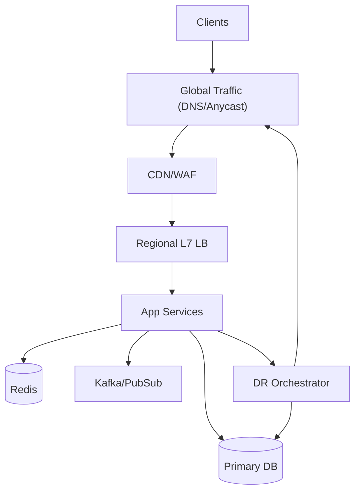
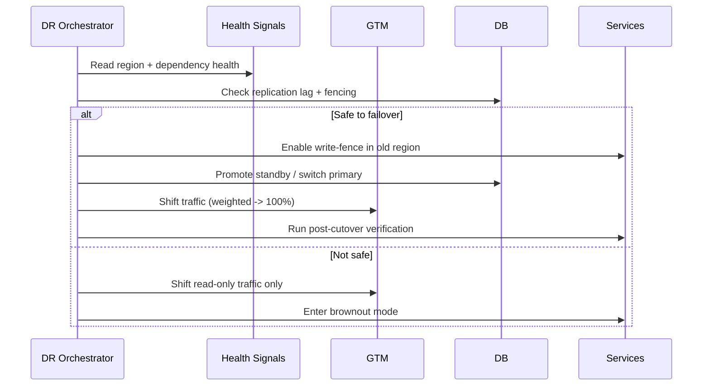

## Overview

Multi-region disaster recovery (DR) for a tier-1 service is hard because you must restore *service availability* quickly (RTO) while tightly bounding *data loss* (RPO), under chaotic conditions like regional outages, partial network partitions, and dependency failures. The “right” answer is rarely a single mechanism—successful DR is an orchestrated system spanning traffic management, data replication, automated health assessment, and operational controls that prevent split-brain and unsafe failovers.

The key insight is to design DR as a product: define explicit availability/data targets per operation, choose an architecture (active-active vs active-passive) that matches consistency needs, and automate cutover with guarded state machines (not ad-hoc scripts). DNS is a *distribution tool*, not an instantaneous switch; production-grade cutover uses a combination of global traffic management, low TTLs, health-checked routing, and an automation controller with strong safety rails.

## Requirements

### Functional Requirements
- Route user traffic to the healthiest region automatically using health-checked global traffic management.
- Support regional failover (Region A → Region B) with an explicit, auditable cutover workflow (automatic and manual modes).
- Replicate data across regions and expose replication lag, RPO status, and “safe-to-failover” signals.
- Provide dependency-aware health evaluation (DB, cache, messaging, third-party) to avoid failing over into a broken region.
- Support planned failover (maintenance, drills) and unplanned failover (region outage), with different guardrails.
- Provide progressive traffic shifting (0%→10%→50%→100%) and automated rollback based on SLOs.
- Produce an immutable incident timeline: decisions, health signals, cutover actions, and post-failover validation.
- Enable regular DR exercises (game days) with fault injection and automated verification checks.

### Non-Functional Requirements
- **Scale**: 50K QPS steady-state, 200K QPS peak; 20M daily active users; 5 TB/day logs/metrics/traces; 10 TB primary DB.
- **Latency**: Global routing decision < 50 ms; API P50 30 ms, P99 200 ms within-region; cross-region writes (if any) P99 < 500 ms.
- **Availability**: 99.99% monthly (tier-1), with a stretch goal of 99.995% via zonal redundancy + multi-region.
- **Consistency**:
  - Strong consistency within a region for critical writes (e.g., user state).
  - Eventual consistency across regions for replicated state (unless using synchronous/quorum schemes for a small subset of data).
- **Durability**: No more than 30 seconds of acknowledged-write loss for critical data (RPO≤30s); best-effort for non-critical telemetry.

### Constraints & Assumptions
- Two primary regions (A and B), each spanning ≥3 AZs; optional third “witness” region for quorum/witnessing.
- Budget supports duplicating capacity (N+1) across regions, but not full double-peak everywhere; rely on surge capacity and prioritized degradation.
- Compliance may require data residency: some tenants pinned to specific regions; failover must respect policy.
- Network partitions are assumed possible between regions; design must avoid split-brain.
- DNS resolvers and client caching exist; TTL does not guarantee immediate cutover.

## High-Level Architecture

This architecture separates **traffic management** (GTM + Edge) from **service execution** (regional LBs + app services) and **state** (DB/Cache/Bus). The DR Orchestrator is a control-plane component that continuously evaluates region health, replication safety, and executes guarded cutovers (traffic shifts, write fencing, promotion, and validation).

We choose this structure because DR is fundamentally a coordination problem across layers. By centralizing decisions in an orchestrator (with explicit state and audit logs) and delegating traffic steering to GTM (health-checked routing + low TTL), we reduce human error and make failovers repeatable, testable, and observable.

## Component Deep-Dive

### Global Traffic Management (DNS/Anycast)
**Responsibility**: Direct users to the best region and enable automated cutover.

**Key Design Decisions**:
- Use health-checked routing (latency + availability) rather than static DNS records to reduce manual steps.
- Keep DNS TTL low (e.g., 30s) but assume *effective* cutover can take minutes due to resolver/client caching.

**Technology Choice**: Route 53 / Cloudflare / NS1 with health checks; optionally Anycast (Cloudflare, Google Cloud LB) for faster convergence.

**Scaling Strategy**: GTM scales externally; ensure health checks are lightweight and multi-vantage to avoid false positives.

### DR Orchestrator (Failover Controller)
**Responsibility**: Decide when/how to fail over, enforce safety (no split-brain), and automate cutover steps with auditability.

**Key Design Decisions**:
- Model failover as a state machine (Normal → Degraded → FailingOver → FailedOver → Recovering) with idempotent actions.
- Require “safe-to-failover” gating for stateful tiers: replication lag bounds, write fencing, dependency readiness, and quorum/witness confirmation.

**Technology Choice**: A small, hardened service (Go/Java) + durable store (Postgres) + workflow engine (Temporal) for retries/timeouts.

**Scaling Strategy**: Low QPS but must be highly available; run active-active control plane across regions with leader election and a witness/quorum mechanism.

### Data Replication Layer (DB + Streams)
**Responsibility**: Replicate durable state across regions and provide measurable RPO/lag signals.

**Key Design Decisions**:
- Prefer async replication for most data to avoid cross-region latency; reserve sync/quorum replication for a small “critical subset” if needed.
- Use write-ahead-log (WAL) shipping or change data capture (CDC) streams to drive replication and reconciliation.

**Technology Choice**:
- Postgres: physical/logical replication with measured lag; or managed multi-region (Spanner/CockroachDB) if global strong consistency is required.
- Event streams: Kafka MirrorMaker 2 / Confluent Replicator / cloud-native PubSub replication.

**Scaling Strategy**: Partition by tenant/user ID; scale read replicas; monitor apply lag and backpressure.

### Regional Serving Stack (Edge/LB/App)
**Responsibility**: Handle user requests within a region, degrade gracefully, and support traffic shifting.

**Key Design Decisions**:
- Make services stateless where possible; store session/state in Redis/DB with clear recovery semantics.
- Support “read-only mode” and “brownout mode” to preserve core flows under reduced capacity post-failover.

**Technology Choice**: Kubernetes + Envoy/Nginx; autoscaling with priority classes for tier-1 endpoints.

**Scaling Strategy**: Pre-warm minimum capacity in standby region; burst via autoscaling; rate-limit non-critical traffic.

### Observability & Health Evaluation
**Responsibility**: Detect failures, prevent false failovers, and validate post-cutover correctness.

**Key Design Decisions**:
- Health must be dependency-aware (synthetic transactions, not just liveness).
- Use multi-window/multi-burn-rate SLO alerts to trigger automation without flapping.

**Technology Choice**: Prometheus + Alertmanager; OpenTelemetry traces; synthetic checks from multiple POPs; PagerDuty/Opsgenie.

**Scaling Strategy**: Separate telemetry pipelines per region; central view for DR decisions with regional fallbacks.

## Data Model

### Storage Schema

**`dr_config`**
- `service_id` (pk)
- `regions` (json: priorities, capacity limits)
- `rto_seconds_target`
- `rpo_seconds_target`
- `dns_ttl_seconds`
- `failover_mode` (enum: `auto`, `guarded_auto`, `manual`)
- `safety_policies` (json: replication thresholds, dependency requirements)

**`region_health`**
- `service_id`
- `region`
- `timestamp`
- `synthetic_ok` (bool)
- `error_rate` (float)
- `p99_latency_ms` (int)
- `dependency_status` (json)
- `score` (int)

**`replication_status`**
- `service_id`
- `primary_region`
- `secondary_region`
- `timestamp`
- `wal_lag_bytes` / `apply_lag_seconds`
- `estimated_rpo_seconds`
- `safe_to_promote` (bool)

**`failover_run`**
- `run_id` (pk)
- `service_id`
- `reason` (enum: `region_outage`, `degradation`, `planned`)
- `from_region` / `to_region`
- `state` (enum)
- `started_at` / `ended_at`
- `initiator` (user/automation)
- `actions` (json array: steps + outcomes)

### Data Flow

## API Design

### Failover Control (Internal, authenticated)
**`POST /v1/dr/failover`**
- Request:
  - `serviceId` (string)
  - `toRegion` (string)
  - `mode` (enum: `planned`, `unplanned`)
  - `allowDataLossSeconds` (int, optional; defaults to policy)
  - `dryRun` (bool)
- Response:
  - `runId` (string)
  - `state` (string)
- Errors:
  - `409 CONFLICT`: failover already in progress
  - `412 PRECONDITION_FAILED`: not safe-to-failover (returns blocking signals)
  - `403 FORBIDDEN`: not authorized

**Idempotency**: Require `Idempotency-Key` header; same key returns same `runId`.

### Traffic Shift
**`POST /v1/dr/traffic-shift`**
- Request: `serviceId`, `weights` (map region→int), `ttlSeconds`
- Response: applied config + propagation estimate
- Errors: `400` invalid weights; `503` GTM provider unavailable

### Status/Telemetry
**`GET /v1/dr/status?serviceId=...`**
- Response: current primary, traffic weights, replication lag, safe-to-promote, last run summary.

### Safety Gates
**`POST /v1/dr/override`** (break-glass)
- Requires elevated auth + justification; writes immutable audit record.

## Scaling & Performance

### Bottleneck Analysis
- **DNS cutover propagation**: TTL + resolver/client caching dominates; mitigate with health-checked GTM + Anycast where possible.
- **Standby capacity**: Failover doubles load in one region; mitigate with pre-warmed baseline + autoscaling + brownouts.
- **Replication catch-up**: Lag spikes during incidents; mitigate with prioritizing WAL shipping, throttling non-critical writes, and partitioning.
- **Cold caches**: Latency spikes after cutover; mitigate with cache warming, request coalescing, and stale-while-revalidate.

### Horizontal Scaling
- **Edge/LB/App**: Stateless services scale via HPA; use global rate limiting; prioritize critical endpoints.
- **DB**: Partition/shard by tenant if needed; use read replicas per region; promote replicas during failover.
- **Streams**: Partition topics; replicate per partition; ensure consumer offset management is region-aware.
- **Orchestrator**: Low throughput; scale for HA, not QPS (multi-region control plane + durable workflow retries).

### Caching Strategy
- **CDN**: Cache static assets and safe GET endpoints with short TTL (e.g., 30–300s); purge on deploy.
- **Regional Redis**: Cache hot reads (profiles/config), TTL 5–30 min; use write-through for strongly consistent updates when required.
- **Cross-region**: Avoid synchronous cache replication; rebuild/warm post-failover using top-keys and background refresh.
- **Invalidation**: Prefer versioned keys and event-driven invalidation; tolerate brief staleness for non-critical reads.

## Trade-offs & Alternatives

### Key Trade-offs Made
- **Async replication for most data**
  - Chosen: lower write latency and simpler ops.
  - Sacrificed: possible small data loss on region loss.
  - Why: tier-1 latency budgets rarely tolerate synchronous cross-region writes for all operations; bound RPO via monitoring and gating.

- **DNS/GTM-based steering with automation**
  - Chosen: provider-managed scale and health checks, simpler client compatibility.
  - Sacrificed: instantaneous cutover (DNS is not immediate).
  - Why: works for heterogeneous clients; combine with Anycast/edge where needed.

- **Guarded automation (state machine + gates)**
  - Chosen: fast response without unsafe failovers.
  - Sacrificed: occasional manual intervention when signals are ambiguous.
  - Why: prevents split-brain and “failover into failure,” which is worse than waiting.

### Alternative Approaches
- **Fully active-active with global strongly consistent DB (Spanner/CockroachDB)**
  - Not chosen due to cost/complexity and higher tail latency for cross-region quorum, unless strict global consistency is mandatory.
- **Client-side region selection**
  - Not chosen because it increases client complexity and rollout risk; hard to enforce uniform behavior across platforms.
- **BGP Anycast-only failover**
  - Not chosen because operational complexity and debugging difficulty are high; best used as a complement (edge) rather than sole mechanism.

## Failure Modes & Mitigations

### Failure Scenarios
- **Scenario**: Region A total outage
  - **Impact**: All traffic to A fails; potential data loss since last replicated point.
  - **Detection**: Multi-vantage synthetics fail + GTM health check failing + cloud provider status.
  - **Mitigation**: Orchestrator fences A (if reachable), promotes B, shifts traffic weights to B, enables brownout if capacity constrained.

- **Scenario**: Cross-region network partition (A↔B broken)
  - **Impact**: Split-brain risk; both regions may appear “healthy” locally.
  - **Detection**: Witness/quorum failure, asymmetric replication signals, inter-region heartbeat loss.
  - **Mitigation**: Use a witness region/service for promotion decisions; only one side can obtain “promotion lease.” Freeze writes on the side without lease.

- **Scenario**: Replication lag spikes beyond RPO
  - **Impact**: Failover would exceed data-loss tolerance.
  - **Detection**: `estimated_rpo_seconds` breaches; alert + gate.
  - **Mitigation**: Degrade to read-only failover; throttle writes; prioritize replication; allow break-glass only with explicit `allowDataLossSeconds`.

- **Scenario**: GTM provider outage / misconfiguration
  - **Impact**: Inability to shift traffic; prolonged outage.
  - **Detection**: GTM API errors; config drift checks fail.
  - **Mitigation**: Secondary DNS provider (multi-provider), cached emergency records, pre-created “failover records,” and runbook to flip NS if needed.

- **Scenario**: Failover succeeds but dependencies in B are degraded (payments, auth, third-party)
  - **Impact**: Partial outage; user-visible errors.
  - **Detection**: Dependency health gates + synthetic transactions.
  - **Mitigation**: Dependency-aware routing (keep some flows pinned), feature flags to disable dependent features, circuit breakers.

### Disaster Recovery
- **Targets**:
  - **RTO**: 5 minutes for unplanned regional outage (traffic mostly restored); 15 minutes to full steadiness (caches warm, backlogs draining).
  - **RPO**: ≤30 seconds for critical user state; ≤5 minutes for non-critical data.
- **Backup strategy**:
  - Point-in-time recovery (PITR) enabled; full backups daily, incremental/WAL continuous; cross-region storage replication.
  - Regular restore tests (weekly automated) into isolated environments.
- **Failover procedures**:
  - Automated: guarded auto-failover when confidence high (health + witness + replication within bounds).
  - Manual: operator approval when signals are mixed; break-glass override with audit trail.

## Operational Considerations

### Monitoring & Alerting
- Key metrics:
  - Regional SLOs (availability, error rate, p99 latency), synthetic success rate.
  - Replication apply lag (seconds), WAL backlog (bytes), stream consumer lag.
  - Traffic weights by region, DNS health check status, propagation estimates.
  - Capacity headroom (CPU/mem), autoscaling events, queue backlogs.
- Alert thresholds (examples):
  - Page: SLO burn rate 14x over 5m, or synthetics failing from ≥3 POPs for 2m.
  - Gate failover: replication lag > 30s critical or > 300s non-critical.
  - Warn: standby capacity headroom < 30% during incident.

### Deployment Strategy
- Progressive delivery per region (canary → 10% → 50% → 100%), with automatic rollback on SLO regression.
- Regional isolation: never deploy both regions simultaneously for tier-1 unless explicitly approved.
- DR drill cadence: monthly planned failover; quarterly unplanned simulation; document outcomes and tune gates.
- Rollback procedures: immutable deploy artifacts, config versioning, and a “return-to-primary” workflow that includes data reconciliation.

## References & Further Reading
- AWS Architecture Blog: Multi-Region DR patterns and Route 53 failover routing.
- Google SRE Book: Disaster Recovery, incident management, and risk.
- Cloudflare Learning Center: DNS TTL behavior and resolver caching realities.
- Jepsen analyses of distributed databases (for understanding split-brain and consistency trade-offs).
- CockroachDB / Google Spanner docs: global consistency and multi-region configurations.