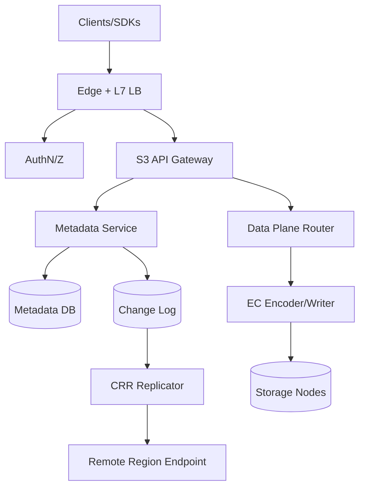
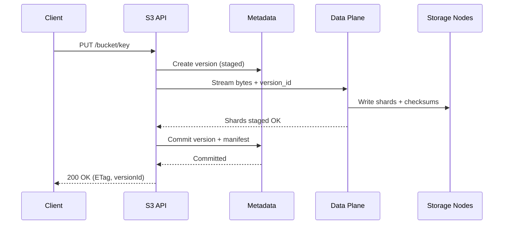

## Overview

Designing an S3-compatible object storage service is difficult because it couples a strict, widely-used API surface (auth, semantics, error codes, multipart uploads, listings) with extreme durability expectations and highly skewed workloads. The hardest parts are not raw bytes-on-disk, but correctly implementing *metadata semantics* (versioning, listings, lifecycle) at scale while keeping the data plane cheap and resilient.

The key insight is to separate *control/metadata* from the *data plane* and to make all user-visible object state transitions append-only and idempotent. Within a region, we provide strong consistency for metadata mutations and reads (PUT/DELETE/LIST) backed by a transactional metadata store; the data plane uses erasure coding across failure domains to achieve high durability with lower storage overhead than triple replication. Cross-region replication (CRR) is asynchronous and driven by a durable change log keyed by object version IDs, making it robust to retries, reordering, and partial failures.

## Requirements

### Functional Requirements
- Create and manage tenants (accounts/projects), buckets, and access policies (IAM-like) with strong isolation.
- S3-compatible object APIs: `PUT/GET/HEAD/DELETE`, `ListObjectsV2`, multipart upload, range reads, conditional requests (ETag, If-*).
- Bucket versioning: multiple versions per key, delete markers, and ability to fetch by version ID.
- Lifecycle rules: prefix/tag filters, expiration of current/noncurrent versions, abort incomplete multipart uploads, transition between storage classes.
- Erasure-coded storage for objects with configurable schemes (e.g., RS 10+4) and placement across failure domains.
- Cross-region replication: replicate selected buckets/prefixes/tags, preserve version IDs and metadata, support backfill.
- Encryption at rest (SSE-S3) and optional tenant-managed keys (SSE-KMS), plus TLS in transit.
- Observability and admin controls: per-tenant quotas, rate limiting, audit logs, and usage reporting.

### Non-Functional Requirements
- **Scale**: 50M buckets (logical), 10B objects, 50PB stored; peak 300K req/s globally (150K req/s per large region), 20Gb/s per region sustained ingest.
- **Latency**:
  - `GET` P50 20ms / P99 120ms (cache warm, intra-region)
  - `PUT` (single-part) P50 40ms / P99 250ms (metadata + quorum EC commit)
  - `ListObjectsV2` P50 60ms / P99 400ms for 1K keys page
- **Availability**: 99.99% per region for reads; 99.9% for writes during AZ degradation (degraded mode).
- **Consistency**:
  - Strong within a region for `PUT/DELETE/HEAD/GET` and `LIST` after commit.
  - Eventual across regions; CRR provides ordering per object key (best-effort) and exactly-once *effect* via idempotency.
- **Durability**: 11x9s annual durability target within a region; RPO 0 for committed objects within region; cross-region RPO depends on replication lag (target P99 < 60s).

### Constraints & Assumptions
- Multi-tenant isolation is mandatory: noisy neighbor protection via rate limiting, quotas, and placement controls.
- Team size assumes a small platform org (8–12 engineers); prefer proven OSS + managed primitives where possible.
- Compliance: support audit logs, encryption, key rotation; assume no specialized regulatory constraints beyond SOC2-like controls.
- Network access between services is private and authenticated (mTLS); public access is only via the S3-compatible endpoint.

## High-Level Architecture

The architecture splits the system into an S3-facing API gateway, a strongly consistent metadata subsystem, and a scalable data plane optimized for throughput and durability. All user-visible operations commit metadata first/atomically with a data commit marker, so reads and listings are consistent and version-aware.

Cross-region replication is driven by a durable change log emitted by metadata commits. This decouples replication from user latency while enabling replay/backfill, monitoring of lag, and idempotent application in the destination region.

## Component Deep-Dive

### S3 API Gateway

**Responsibility**: Implements S3-compatible REST API, request validation, auth integration, and maps operations to metadata + data plane actions.

**Key Design Decisions**:
- Separate control calls (bucket/policy/lifecycle) from object data calls to keep hot paths minimal.
- Enforce idempotency for retried `PUT`/multipart parts via request IDs + version IDs to avoid duplicate visible versions.

**Technology Choice**: Stateless Go/Rust service behind Envoy/NGINX; AWS SigV4 compatible auth module; supports virtual-hosted and path-style.

**Scaling Strategy**: Horizontal scale; shard rate limits by tenant; keep no local state beyond short-lived caches.

### Metadata Service

**Responsibility**: Source of truth for buckets, object keys, versions, listings, multipart state, lifecycle configs, and replication intents.

**Key Design Decisions**:
- Strong consistency within a region using transactional writes (single-writer per key via DB transactions/conditional updates).
- Append-only object versions: each `PUT` creates immutable version row; deletions create delete markers.

**Technology Choice**: CockroachDB / YugabyteDB (SQL + transactions + geo features) or FoundationDB; Redis for read-through caching of hot metadata.

**Scaling Strategy**: Partition by `tenant_id` and `bucket_id`; keep listing index ordered by `(bucket_id, key)` with pagination tokens; use compaction jobs for historical versions.

### Data Plane (Router + EC Encoder + Storage Nodes)

**Responsibility**: Stores and retrieves object bytes, performs erasure coding, verifies checksums, and repairs missing shards.

**Key Design Decisions**:
- Erasure coding (e.g., RS 10+4) across failure domains (rack/AZ) with quorum writes for commit.
- Write path is two-phase: stage shards, then metadata commit marks version “committed”; garbage collect uncommitted shards.

**Technology Choice**: Storage nodes with local NVMe/HDD + filesystem (XFS) and a shard store; EC implemented in a dedicated service or library; gRPC between router and nodes.

**Scaling Strategy**: Add nodes linearly; consistent-hash placement groups; background rebalancing; bandwidth-aware reads (pick fastest k shards).

### Lifecycle & GC Engine

**Responsibility**: Executes lifecycle rules (expire/transition), aborts incomplete multipart uploads, and deletes unreferenced shards (tombstone handling).

**Key Design Decisions**:
- Hybrid approach: event-driven triggers on metadata changes + periodic scans for correctness (handles missed events).
- Safe deletion via reference counting and “grace windows” to accommodate replication and eventual tasks.

**Technology Choice**: Stateless workers consuming from a task queue (e.g., Kafka topics or DB-backed queue); uses metadata DB as authority.

**Scaling Strategy**: Partition work by bucket; adaptive throttling per tenant; prioritize recent buckets and large savings candidates.

### Cross-Region Replication (CRR) Service

**Responsibility**: Replicates committed versions and metadata to a destination region according to replication rules.

**Key Design Decisions**:
- Replicate *by version ID* with idempotent upserts; at-least-once delivery with exactly-once effects.
- Data transfer uses chunked/shard-aware copy, optionally re-EC in destination to match local scheme.

**Technology Choice**: Kafka/Pulsar for change log; replication workers; inter-region transfer via private backbone + TLS.

**Scaling Strategy**: Parallelize by bucket/prefix partitions; backpressure from destination; per-tenant replication bandwidth caps.

## Data Model

### Storage Schema

Primary entities (logical SQL-like schema):

- `tenants`:
  - `tenant_id (PK)`, `name`, `status`, `created_at`
- `buckets`:
  - `bucket_id (PK)`, `tenant_id (FK)`, `name (unique)`, `region`, `versioning_state`, `created_at`
- `objects` (latest pointer for fast HEAD/LIST):
  - `bucket_id (PK)`, `key (PK)`, `latest_version_id`, `latest_is_delete_marker`, `etag`, `size`, `updated_at`
- `object_versions` (immutable versions):
  - `bucket_id`, `key`, `version_id (PK)`, `is_delete_marker`, `etag`, `size`, `content_type`, `user_metadata (json)`,
  - `storage_class`, `encryption`, `commit_state (staged|committed)`, `created_at`
- `shard_manifests`:
  - `version_id (PK)`, `scheme (k,m)`, `shard_count`, `shard_locations (json)`, `checksums (json)`, `object_checksum`
- `multipart_uploads`:
  - `upload_id (PK)`, `bucket_id`, `key`, `initiator`, `created_at`, `expires_at`
- `multipart_parts`:
  - `upload_id`, `part_number`, `etag`, `size`, `staged_shards_ref`, `created_at`
- `lifecycle_rules`:
  - `bucket_id`, `rule_id`, `filter_prefix`, `filter_tags (json)`, `actions (json)`, `status`
- `replication_rules`:
  - `bucket_id`, `rule_id`, `dest_region`, `filter_prefix`, `filter_tags (json)`, `replicate_delete_markers`, `status`
- `change_log` (durable stream anchor; could be Kafka + DB pointer):
  - `event_id`, `bucket_id`, `key`, `version_id`, `event_type`, `ts`, `payload`

### Data Flow

`PUT Object` (single-part) commit flow:

Key invariants:
- A version is only visible to `GET/LIST` after metadata commit marks it `committed`.
- Retries reuse `version_id` (server-issued) or dedupe via `(tenant, bucket, key, content-hash, request-id)` depending on API semantics.

## API Design

S3-compatible external APIs (subset shown; semantics aligned with S3):
- `PUT /{bucket}/{key}`: upload object (supports `x-amz-meta-*`, `Content-MD5`, SSE headers).
  - Response: `ETag`, `x-amz-version-id` if versioning enabled.
  - Errors: `AccessDenied`, `NoSuchBucket`, `InvalidDigest`, `EntityTooLarge`, `ServiceUnavailable`.
  - Idempotency: retries safe if client repeats same bytes; server dedupes via request ID + staged version window.
- `GET /{bucket}/{key}` and `GET ...?versionId=...`: fetch current or specific version; supports `Range` and conditional headers.
- `DELETE /{bucket}/{key}` and `DELETE ...?versionId=...`: creates delete marker (no versionId) or deletes specific version.
- `GET /{bucket}?list-type=2&prefix=&continuation-token=`: paginated listing (strong within region post-commit).
- Multipart:
  - `POST /{bucket}/{key}?uploads` -> `uploadId`
  - `PUT /{bucket}/{key}?partNumber=N&uploadId=...`
  - `POST /{bucket}/{key}?uploadId=...` (Complete) with parts list
  - `DELETE /{bucket}/{key}?uploadId=...` (Abort)

Internal APIs (gRPC recommended):
- `Metadata.CommitVersion(version_id, manifest, etag, size, ...)`
- `Metadata.ListObjects(bucket_id, prefix, token, limit)`
- `DataPlane.Put(version_id, stream)` and `DataPlane.Get(version_id, range)`

Error handling:
- External errors map to S3 XML error responses and HTTP codes.
- Internal errors use retriable classification (e.g., `UNAVAILABLE`, `DEADLINE_EXCEEDED`) with bounded retries and circuit breakers.

## Scaling & Performance

### Bottleneck Analysis
- **Hot buckets/keys**: listings and frequent overwrites can hotspot metadata partitions.
  - Mitigation: partition by `(bucket_id, key_hash_prefix)` for versions; maintain ordered index separately for LIST; apply per-prefix rate limits.
- **Large object ingest**: EC encoding and cross-node writes consume CPU and bandwidth.
  - Mitigation: stream encoding, zero-copy I/O, dedicated ingest nodes, adaptive shard placement, and backpressure.
- **Small object overhead**: metadata + EC overhead dominates.
  - Mitigation: small-object packing (optional), different EC scheme for small sizes, aggressive metadata caching.

### Horizontal Scaling
- **Edge/API**: stateless; scale by adding pods/VMs; shard rate-limit counters via Redis or local + consistent hashing.
- **Metadata DB**: scale by adding nodes and partitions; keep indexes tight; separate hot tables (`objects`, listing index) from cold history (`object_versions`).
- **Storage Nodes**: add nodes; rebalance shards gradually; enforce rack/AZ diversity; repair with background scrubbing.
- **Partitioning Strategy**:
  - Primary: `tenant_id` -> `bucket_id` (hash) -> `key` (ordered for LIST, hashed for write-heavy metadata).
  - Shard placement: consistent hash ring per placement group, with constraints (AZ/rack).

### Caching Strategy
- **Metadata cache**: cache `objects` latest pointers and bucket configs (TTL 1–5 minutes); invalidate on writes via change log fanout.
- **Read cache (optional)**: CDN for public objects; internal Redis/SSD cache for hot ranges; cache by `(version_id, byte-range)`.
- **Invalidation**: version IDs make cache keys immutable; overwrites create new version ID, so cache is naturally safe (only latest-pointer cache needs invalidation).

## Trade-offs & Alternatives

### Key Trade-offs Made
- **Chosen**: Strong consistency within region for LIST/PUT/DELETE via transactional metadata.
  - **Sacrificed**: Higher write latency and metadata cost vs eventually consistent designs.
  - **Why**: Interview/production reality favors correctness and predictable semantics for users.
- **Chosen**: Erasure coding (e.g., 10+4) for primary storage.
  - **Sacrificed**: Higher CPU and tail latency for writes/repairs vs triple replication.
  - **Why**: Material storage savings at PB scale while meeting durability targets.
- **Chosen**: Asynchronous CRR via change log.
  - **Sacrificed**: Cross-region strong consistency.
  - **Why**: Keeps user latency low and makes replication robust and observable.

### Alternative Approaches
- **All replication (3x) instead of EC**: simpler and faster writes, but 3x storage cost and worse economics at scale.
- **Eventually consistent metadata (Dynamo-style)**: higher availability during partitions, but complex semantics for LIST/version visibility and harder user experience.
- **Inline replication during PUT (sync CRR)**: stronger geo guarantees, but high tail latency and availability coupling between regions.

## Failure Modes & Mitigations

### Failure Scenarios
- **Scenario**: Storage node loss during PUT
  - **Impact**: Staged shards missing; object not committed.
  - **Detection**: shard write errors; missing quorum.
  - **Mitigation**: retry to alternate nodes; only commit metadata after quorum; GC cleans partial shards.
- **Scenario**: AZ outage
  - **Impact**: Reduced shard availability; degraded reads/writes.
  - **Detection**: node heartbeat loss; elevated GET reconstruction.
  - **Mitigation**: EC across AZs; reads succeed if >= k shards; writes may switch to temporary scheme or reduced availability mode.
- **Scenario**: Metadata DB leader/partition issue
  - **Impact**: control plane and strong-consistency ops impaired.
  - **Detection**: elevated commit latency, failed transactions.
  - **Mitigation**: multi-node consensus, automatic failover, per-tenant write shedding; serve GET by version_id from cache only if explicitly allowed (optional “read-only degraded mode”).
- **Scenario**: Corruption/bit-rot
  - **Impact**: incorrect data returned.
  - **Detection**: checksum mismatch during read/scrub.
  - **Mitigation**: end-to-end checksums, periodic scrubbing, repair from redundant shards.
- **Scenario**: CRR lag/backlog
  - **Impact**: stale data in destination; higher RPO.
  - **Detection**: lag metrics from change log offsets and destination apply watermark.
  - **Mitigation**: autoscale replicators, prioritize small metadata-first apply, cap per-tenant bandwidth to protect fairness.

### Disaster Recovery
- **RTO/RPO**:
  - In-region: RPO 0 for committed objects; RTO 30–60 minutes for full-region events depends on infra.
  - Cross-region: RPO target P99 < 60s (best effort), RTO 2–4 hours for promoting replica region.
- **Backup strategy**: metadata DB continuous backups + periodic full snapshots; change log retention 7–30 days; shard store relies on EC + repair plus optional cold backup tier.
- **Failover procedures**: promote destination region endpoints, re-point DNS, enable writes after metadata promotion; reconcile via change log replay and inventory scan.

## Operational Considerations

### Monitoring & Alerting
- Key metrics:
  - API: req/s, P50/P99 latency by operation, 4xx/5xx rate, auth failures
  - Metadata: transaction latency, lock/contention, DB health, cache hit rate
  - Storage: shard write/read latency, reconstruction rate, repair backlog, disk utilization, checksum failures
  - CRR: lag (seconds), backlog size, apply error rate
- Alert thresholds:
  - P99 `GET` > 250ms for 10m, 5xx > 0.5% for 5m
  - Repair backlog growing for 30m or reconstruction rate > 5% sustained
  - CRR lag P99 > 5m for 15m (per critical bucket)

### Deployment Strategy
- Rolling deploy with canaries per region/AZ; maintain strict API compatibility and feature flags for new headers/behaviors.
- Use schema migration discipline: expand/contract, backwards-compatible reads, dual-write only when necessary.
- Rollback: revert API/data plane binaries; for metadata schema, keep old readers working until migration completes.

## References & Further Reading

- AWS S3 consistency and semantics (official docs): https://docs.aws.amazon.com/AmazonS3/latest/userguide/Welcome.html
- Erasure coding in storage systems (Reed–Solomon, LRC): https://www.usenix.org/conference/fast12/lessons-learned-facebook
- Ceph (RADOSGW) architecture (S3-compatible object storage): https://docs.ceph.com/
- MinIO design and erasure coding overview: https://min.io/docs/
- Microsoft Azure Storage “LRC” background: https://learn.microsoft.com/azure/storage/common/storage-redundancy