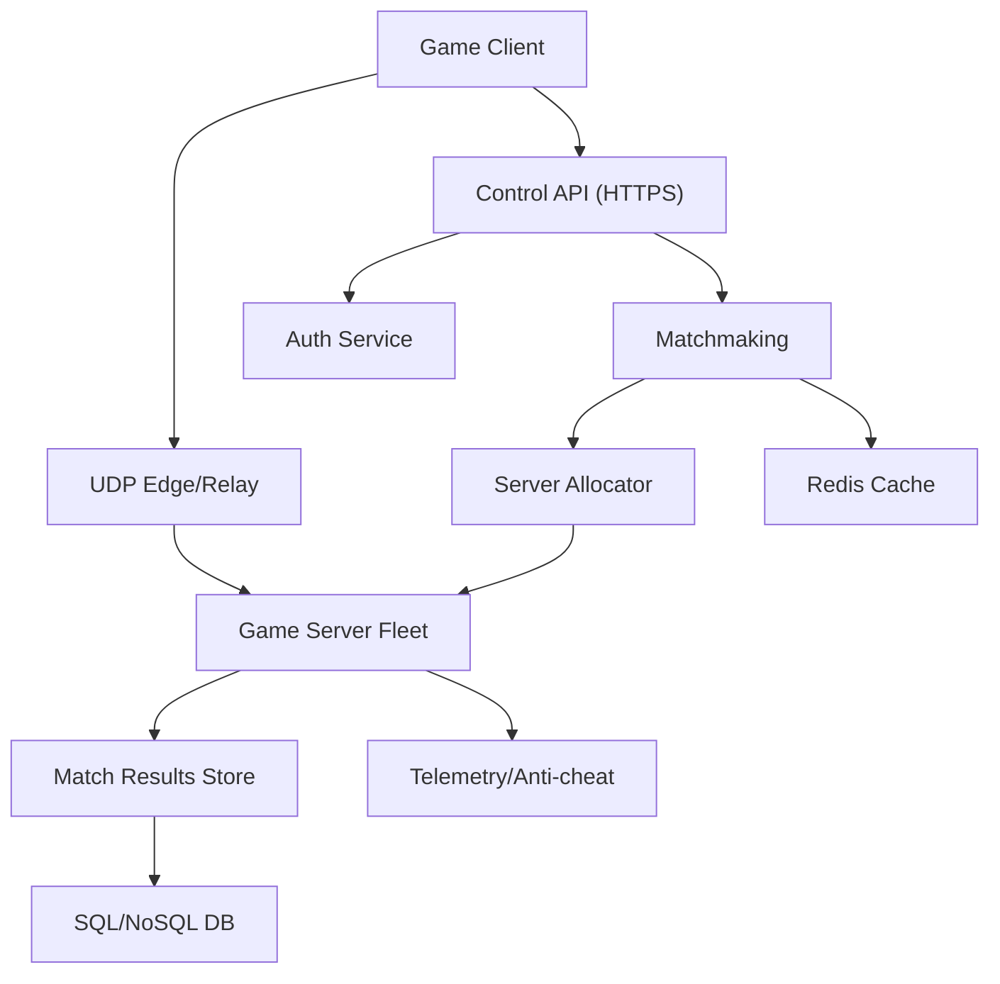
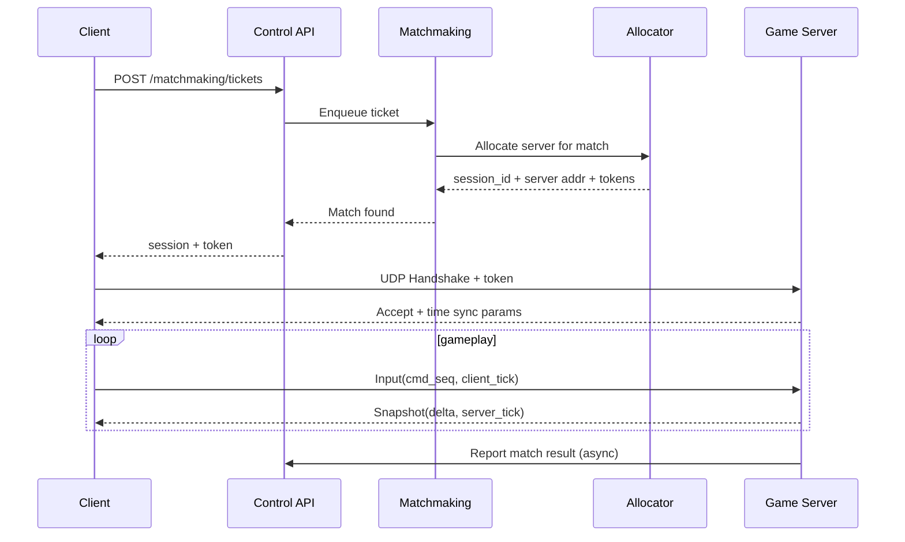

## Overview

A multiplayer game backend must synchronize fast-changing world state to many clients while resisting packet loss, jitter, NATs, and cheating. UDP is the right transport for low-latency updates, but it pushes reliability, ordering, congestion control, and security concerns into your application layer. The hardest parts are maintaining a smooth player experience under variable network conditions and ensuring fair outcomes via an authoritative server (especially for hitscan/projectiles and movement).

This design uses dedicated authoritative game servers running a deterministic tick loop, a UDP state synchronization engine with interest management + snapshot/delta replication, and server-side lag compensation based on a bounded history buffer. Matchmaking is treated as a separate control-plane (HTTP/gRPC) that selects a region + server, issues secure connection tokens, and handles parties/skill constraints. The key insight is to separate **control traffic** (reliable, authenticated, low rate) from **state traffic** (loss-tolerant, high rate), and to make the server authoritative while still enabling responsive clients via prediction + reconciliation.

## Requirements

### Functional Requirements
- Players can authenticate, create/join parties, and queue for matchmaking by region and mode.
- Matchmaking forms balanced matches (skill, party size) and allocates a game server instance.
- Clients connect to the allocated game server over UDP using a secure handshake and connection token.
- Authoritative server simulates the world at a fixed tick rate and broadcasts state updates to clients.
- Clients send input commands; server validates and applies them deterministically.
- Lag compensation for hit validation (rewind) with configurable fairness bounds.
- Match results (score, ranks, anti-cheat signals) are persisted and exposed via APIs.
- Live operational visibility (per-match health, latency, packet loss) and fast incident mitigation.

### Non-Functional Requirements
- **Scale**: 5M MAU, 500K peak CCU, 50K concurrent matches, peak 200K matchmaking tickets/min; per game server ~64 players, ~50–150k UDP packets/sec depending on tick + fanout.
- **Latency**: Input-to-sim P99 < 50ms intra-region; snapshot delivery P99 < 80ms; matchmaking time P95 < 30s (configurable).
- **Availability**: 99.95% for gameplay sessions (regional); 99.99% for control plane (auth/matchmaking).
- **Consistency**: Strong authority within a match (server is source of truth); eventual consistency for profiles/leaderboards; monotonic match result writes.
- **Durability**: Match results RPO ≤ 1 minute; no silent loss of ranked outcomes; gameplay state is ephemeral (loss acceptable on server crash).

### Constraints & Assumptions
- Dedicated server model (client-server), not P2P; UDP allowed end-to-end (or via provider edge).
- Multi-region deployment (at least 3 regions) with regional matchmaking pools.
- Team can operate Kubernetes or VM fleets; game servers are stateful processes with lifecycle orchestration.
- Anti-cheat is best-effort at backend level; full protection may require client-side attestation for competitive modes.
- Compliance: store minimal PII; encrypt tokens and sensitive telemetry; retain replays/telemetry for limited time (e.g., 30 days).

## High-Level Architecture



The system is split into a **control plane** (Auth, matchmaking, allocation) and a **data plane** (UDP gameplay). Control plane uses HTTPS/gRPC for strong authentication, idempotent operations, and observability. The data plane uses UDP for low-latency state synchronization; an optional UDP edge/relay provides DDoS protection, NAT traversal assistance, and a stable anycast entrypoint.

Authoritative game servers are the only entities allowed to mutate world state. Clients send inputs with sequence numbers; servers simulate at fixed tick and publish snapshots/deltas based on interest management. Results and telemetry are streamed asynchronously to durable storage and analytics.

## Component Deep-Dive

### Matchmaking Service

**Responsibility**: Accept queue tickets, form matches based on constraints (mode, region, MMR, party), and request server allocation.

**Key Design Decisions**:
- Use a ticket-based queue with expanding search ranges (MMR window grows over time) to balance fairness vs queue time.
- Separate “match formation” from “server allocation” to reduce coupling; allow allocating from warm pools and re-trying on capacity failures.

**Technology Choice**: Go/Java service with Redis for hot queues + Kafka/PubSub for async events; optional Open Match style architecture.

**Scaling Strategy**: Horizontally scale matchmaker workers; shard queues by `(region, mode, party_size_bucket)`; Redis cluster for queue primitives; backpressure when fleet capacity is low.

---

### Server Allocator (Session Directory)

**Responsibility**: Select/launch a game server instance, reserve slots, mint secure connection tokens, and publish session routing info.

**Key Design Decisions**:
- Token-based admission: clients must present a short-lived, server-bound token to prevent IP spoofing and unauthorized joins.
- Capacity-aware placement: allocate based on region, current CPU/network headroom, and anti-affinity to reduce correlated failure.

**Technology Choice**: gRPC service + backing store (etcd/Consul) for server registry; integrates with Agones/Kubernetes or VM autoscaling groups.

**Scaling Strategy**: Stateless allocator instances; registry uses leases/heartbeats; autoscaler reacts to CCU, ticket backlog, and per-node saturation.

---

### Authoritative Game Server (State & Simulation)

**Responsibility**: Run the game simulation loop, validate inputs, apply lag compensation, and broadcast state updates.

**Key Design Decisions**:
- Fixed tick simulation (e.g., 60Hz for competitive, 30Hz for casual) for determinism and predictable bandwidth/CPU.
- Maintain a bounded history buffer (e.g., 250ms–500ms) for rewind-based hit validation; clamp compensation to prevent extreme “shot behind wall” artifacts.

**Technology Choice**: C++/Rust for high-performance loop; flatbuffers/protobuf for schema (but custom bitpacking on wire); optional embedded scripting for game logic.

**Scaling Strategy**: Scale by match count (process-per-match or process hosting multiple matches); bin-pack by CPU and NIC throughput; isolate noisy neighbors via cgroups/CPU pinning.

---

### UDP Sync Engine (Networking Layer)

**Responsibility**: Connection management, packet formats, reliability channels, snapshot/delta replication, and congestion/flow control.

**Key Design Decisions**:
- Multi-channel transport over UDP:
  - Unreliable for frequent state (snapshots/deltas).
  - Reliable-ordered for critical events (spawn, round start, inventory changes).
- Interest management + replication graph to control bandwidth (spatial cells, teams, relevancy priorities).

**Technology Choice**: Custom protocol inspired by ENet/Source netcode; optional DTLS for encryption, or AEAD with keys derived from HTTPS token exchange.

**Scaling Strategy**: Per-connection rate limiting and send-budget (bytes/tick); adaptive update frequency based on distance/importance; efficient serialization with quantization and delta baselines.

---

### Telemetry & Anti-cheat Pipeline

**Responsibility**: Collect match stats, network quality metrics, suspicious patterns, and produce moderation/ban signals.

**Key Design Decisions**:
- Separate hot-path gameplay from telemetry via async batching to avoid affecting tick stability.
- Use server-side authoritative signals (impossible movement, aim anomalies, packet timing patterns) and store raw features for iterative tuning.

**Technology Choice**: Kafka + stream processing (Flink/Spark) + OLAP store (ClickHouse/BigQuery); Prometheus for real-time metrics.

**Scaling Strategy**: Partition by `match_id`/`region`; sampling for non-ranked modes; tiered retention (high detail for short time, aggregates long term).

## Data Model

### Storage Schema

**players** (SQL)
- `player_id` (PK, UUID)
- `region_pref` (string)
- `created_at` (ts)
- `mmr` (int)
- `ranked_status` (enum)
- `ban_state` (enum)
- `last_seen_at` (ts)

**match_tickets** (Redis/SQL, TTL)
- `ticket_id` (UUID)
- `player_ids` (array)
- `party_id` (UUID, nullable)
- `mode` (string)
- `region` (string)
- `mmr_mean` (int)
- `constraints` (json)
- `created_at` (ts)
- `expires_at` (ts)

**sessions** (etcd/SQL, TTL/lease)
- `session_id` (UUID)
- `region` (string)
- `mode` (string)
- `server_id` (string)
- `server_udp_addr` (ip:port)
- `state` (enum: reserved|active|ended)
- `created_at` (ts)
- `ends_at` (ts)

**connection_tokens** (stateless JWT/PASETO-like or DB with TTL)
- `token_id` (UUID)
- `session_id` (UUID)
- `player_id` (UUID)
- `server_id` (string)
- `issued_at` (ts)
- `expires_at` (ts)
- `nonce` (bytes)
- `sig` (bytes)

**match_results** (SQL/NoSQL)
- `match_id` (UUID, PK)
- `session_id` (UUID)
- `region` (string)
- `mode` (string)
- `players` (json: ids, teams, stats)
- `started_at` (ts)
- `ended_at` (ts)
- `result_hash` (bytes, optional integrity)
- `mmr_deltas` (json)
- `anti_cheat_flags` (json)

### Data Flow



## API Design

### Create Matchmaking Ticket
- `POST /v1/matchmaking/tickets`
- Request:
  ```json
  {
    "mode": "ranked_5v5",
    "region": "us-east",
    "party_id": "optional-uuid",
    "players": [{"player_id":"uuid"}],
    "client_build": "1.12.3"
  }
  ```
- Response `202`:
  ```json
  { "ticket_id": "uuid", "expires_at": "2025-12-17T12:00:00Z" }
  ```
- Errors: `401` (auth), `409` (already queued), `429` (rate limited)
- Idempotency: `Idempotency-Key` header; same key returns same `ticket_id` within TTL.

### Poll Ticket / Get Assignment
- `GET /v1/matchmaking/tickets/{ticket_id}`
- Response `200` (queued):
  ```json
  { "state":"queued", "position_estimate": 120, "eta_seconds": 25 }
  ```
- Response `200` (matched):
  ```json
  {
    "state":"matched",
    "session_id":"uuid",
    "server_udp_addr":"203.0.113.10:27015",
    "connection_token":"base64url..."
  }
  ```

### Report Match Results (Server-to-Control)
- `POST /v1/matches/{match_id}/results`
- Auth: mTLS or signed server identity + nonce
- Idempotency: `match_id` is idempotent key; duplicate submissions must be safe.
- Response: `200` on accept, `409` if finalized with different hash.

### UDP Protocol (Data Plane)
- Handshake:
  - Client sends `CONNECT(token, client_nonce)`; server validates token (server-bound, short TTL).
  - Server replies `COOKIE(server_cookie)` if amplification risk; client echoes cookie to prove reachability.
  - After acceptance, server issues `conn_id` and crypto params (DTLS/AEAD).
- Messages:
  - `INPUT`: `(conn_id, cmd_seq, client_tick, inputs...)` reliable-unordered or semi-reliable.
  - `SNAPSHOT`: `(server_tick, baseline_id, delta_blob)` unreliable.
  - `EVENT`: reliable-ordered for game events.
- Error handling: disconnect reasons (version mismatch, token expired, rate limit, auth fail); exponential backoff on reconnect attempts.

## Scaling & Performance

### Bottleneck Analysis
- **NIC egress bandwidth**: Fanout of snapshots is typically the limiter.
  - Mitigate with interest management, delta compression, adaptive rates (nearby entities at 20Hz, far at 5Hz).
- **Server tick overruns** (CPU spikes):
  - Mitigate with deterministic budgets, microprofiling, avoiding per-player O(N²), and splitting heavy subsystems (pathfinding) or precomputing.
- **Matchmaking hotspots**:
  - Mitigate by sharding queues by region/mode and using stateless workers with Redis primitives.
- **Packet loss/jitter**:
  - Mitigate with client interpolation buffers (e.g., 100ms), forward error correction for small critical packets (optional), and selective retransmit for reliable channels.

### Horizontal Scaling
- **Control plane**: Stateless services behind L7 load balancers; scale on QPS and queue depth.
- **Game servers**: Scale on CCU and match concurrency; pre-warm pools to reduce queue latency; multi-AZ fleet per region.
- **Sharding/partitioning**:
  - By region first, then by mode.
  - Telemetry partitions by `match_id` to keep per-match ordering where needed.

### Caching Strategy
- Redis for:
  - Active tickets and queue metadata (TTL).
  - Session directory lookups (short TTL, backed by allocator registry).
  - Player MMR snapshots (write-through from DB).
- Invalidation:
  - Ticket TTL expiry and explicit cancellation.
  - Session state transitions via event bus (allocator emits `SESSION_ACTIVE/ENDED`).

## Trade-offs & Alternatives

### Key Trade-offs Made
- **Authoritative server** chosen over client authority:
  - Sacrifice: higher server cost and more complex networking.
  - Why: prevents most cheating and enables consistent competitive fairness.
- **UDP with custom reliability** chosen over pure TCP:
  - Sacrifice: protocol complexity (ordering, retransmits, congestion).
  - Why: avoids head-of-line blocking and supports loss-tolerant state replication.
- **Rewind-based lag compensation** with clamped window:
  - Sacrifice: occasional “I was behind cover” complaints.
  - Why: fairness for higher-latency players while bounding worst-case artifacts.

### Alternative Approaches
- **QUIC-based transport** (still UDP underneath):
  - Pros: built-in congestion control and crypto; simpler reliability.
  - Cons: less control over partial reliability and channel semantics; library/platform constraints.
- **Lockstep deterministic networking** (RTS-style):
  - Pros: minimal bandwidth, perfect determinism.
  - Cons: extremely sensitive to latency and cheating unless heavily constrained; poor for action games.
- **Edge-authoritative regional relays** (serverless/edge compute):
  - Pros: lower latency via edge presence.
  - Cons: operational complexity, harder to run heavy simulation; cost and debugging challenges.

## Failure Modes & Mitigations

### Failure Scenarios
- **Game server crash mid-match**
  - **Impact**: match loss for up to 64 players.
  - **Detection**: missed heartbeats, allocator lease expiry, client disconnect storms.
  - **Mitigation**: fast requeue with priority; ranked mode uses partial-credit rules; autoscaler replaces instance; optional periodic checkpointing for long sessions (rare).
- **DDoS / UDP flood on region**
  - **Impact**: degraded connectivity, packet loss.
  - **Detection**: edge PPS anomalies, elevated handshake failures, ISP/edge alerts.
  - **Mitigation**: anycast UDP edge with filtering, cookie challenges, per-IP rate limits, capacity shedding, regional reroute for new matches.
- **Allocator returns dead server**
  - **Impact**: failed joins.
  - **Detection**: join failure metrics; server registry lease validation.
  - **Mitigation**: allocator uses leases; client retries allocation; MM marks server unhealthy.
- **Clock skew breaks lag compensation**
  - **Impact**: unfair hit validation.
  - **Detection**: time sync residuals, abnormal rewind offsets.
  - **Mitigation**: server-authoritative tick timeline; periodic time sync packets; clamp client-reported times; fallback to receipt-time approximation.
- **Replay/telemetry pipeline outage**
  - **Impact**: missing analytics/anti-cheat evidence.
  - **Detection**: Kafka lag, sink errors.
  - **Mitigation**: local buffer with bounded disk; sampling; degrade gracefully without affecting tick loop.

### Disaster Recovery
- **RTO/RPO**: Control plane RTO 30 min / RPO 1 min; Gameplay sessions are regional (no cross-region failover mid-match), but new matches can fail over within minutes.
- **Backup strategy**: Point-in-time recovery for SQL; daily snapshots for configs; versioned object storage for builds and replay blobs.
- **Failover procedures**: DNS/traffic manager shifts control plane to standby region; matchmaking closes impacted region queues; allocator drains unhealthy fleets.

## Operational Considerations

### Monitoring & Alerting
- Game server:
  - Tick time P50/P99, tick overruns (%), GC pauses (if applicable)
  - Per-client RTT, jitter, packet loss, bandwidth, out-of-order rate
  - Snapshot size distributions, send budget utilization
- Control plane:
  - Ticket ingestion QPS, queue depth, match time percentiles
  - Allocation success rate, warm pool size, scale events
- Alerts:
  - Tick overrun > 1% for 5m (paging)
  - Join success < 98% for 5m (paging)
  - Matchmaking P95 > target for 10m (page/notify depending on severity)

### Deployment Strategy
- Control plane: canary + progressive rollout; schema migrations with backward compatibility; fast rollback via versioned deploys.
- Game servers: bake versioned images; gradual fleet rotation; “drain then terminate” to avoid killing active matches; allow multi-version support during rollout (client build gating).
- Rollback: revert allocator/matchmaker quickly; game server rollback via image pinning; isolate bad builds by rejecting tokens for that build.

## References & Further Reading
- Valve: “Source Multiplayer Networking” (snapshot interpolation, lag compensation concepts)
- Gaffer On Games: “Fix Your Timestep”, “Client-Side Prediction and Server Reconciliation”, “Snapshot Interpolation”
- ENet (reliable UDP patterns): http://enet.bespin.org/
- Agones (Kubernetes game server orchestration): https://agones.dev/
- Open Match (matchmaking framework patterns): https://open-match.dev/