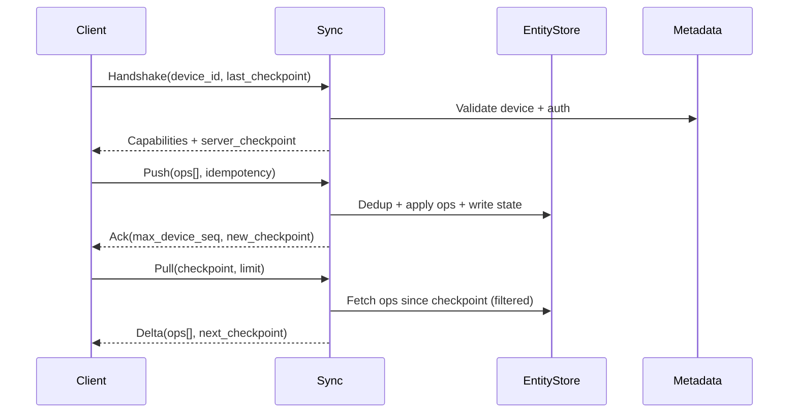

## Overview

Field-operations apps (inspections, deliveries, maintenance, incident response) must keep working when connectivity is unreliable or absent for days. Users expect the app to be fast and fully functional offline, yet data must reconcile correctly when devices reconnect—often with concurrent edits across multiple devices, out-of-order delivery, retries, and partial uploads.

The core challenge is designing a sync protocol that is **bandwidth-efficient**, **idempotent**, and **conflict-aware** under long partitions. The key insight is to treat sync as **replication of an operation log** (not “upload the whole state”), with stable identifiers, deterministic merge rules, and a server-side durable log that can generate deltas for any device via per-device checkpoints.

This design uses **operation-based replication** with **idempotent operations**, **hybrid logical clocks (HLC)** for ordering, **per-entity causal metadata** (dotted version vectors / per-actor sequence), and **type-aware merges** (CRDTs where appropriate, LWW/semantic rules elsewhere), plus an explicit “needs-review” path for business-critical conflicts.

## Requirements

### Functional Requirements
- Offline CRUD for core entities (e.g., WorkOrder, Asset, Inspection, FormResponse) with local persistence.
- Two-way sync after reconnection: upload local changes and download remote changes since last sync.
- Deterministic conflict handling: auto-merge when safe; flag conflicts requiring user review.
- Attachment sync (photos/videos/signatures) with resumable uploads and deduplication.
- Multi-device per user (phone + tablet) with eventual convergence across devices.
- Idempotent retries: repeated sync requests must not create duplicates or corrupt state.
- Access control enforced on server (tenant/project/user scopes) and honored in deltas.
- Auditability: ability to reconstruct who changed what, when, and from which device.

### Non-Functional Requirements
- **Scale**:
  - 50K DAU field workers, 5M MAU total viewers/admins
  - Peak sync traffic: 10K devices reconnecting after shifts → ~5K QPS steady, bursts to 20K QPS
  - Average entity ops: 50–200 ops/device/day; worst case backlog: 50K ops/device after multi-day outage
  - Attachments: 2–10 GB/device/month, up to 200 MB per job
- **Latency**:
  - Sync API P50: 150ms per batch, P99: 800ms (excluding attachment upload time)
  - “Time-to-catch-up” target: <2 minutes for 10K ops on good LTE (batched + compressed)
- **Availability**: 99.95% for sync APIs; 99.99% for auth/token validation
- **Consistency**:
  - Eventual consistency for user data entities across devices
  - Strong consistency for auth, device registration, and server-issued checkpoints
- **Durability**: No lost acknowledged ops (RPO ~ 0 for accepted ops); tolerate at most 1 minute of un-acked in-flight loss

### Constraints & Assumptions
- Mobile clients use a local embedded DB (SQLite) and maintain a durable local op log.
- Devices may have incorrect wall clocks; protocol must not rely on client wall time.
- Compliance: PII in forms; encryption at rest and in transit; audit logs retained 1–7 years (configurable).
- Team can operate Kafka + a NoSQL store (Cassandra/ScyllaDB) and a relational DB (Postgres).

## High-Level Architecture

```mermaid
graph TB
  Client["Mobile App"] --> Edge["API Gateway"]
  Edge --> Sync["Sync Service"]
  Edge --> Auth["Auth Service"]
  Sync --> Log["Op Log (Kafka)"]
  Sync --> Meta[(Postgres Metadata)]
  Sync --> State[(Entity Store (Cassandra))]
  Sync --> Cache[(Redis Cache)]
  Sync --> Obj["Object Storage"]
```

Clients treat the server as a replication peer. The **Sync Service** accepts uploaded operations (push), persists them durably (log + entity store), and serves device-specific deltas (pull) based on a **per-device checkpoint**. Attachments flow directly to object storage using pre-signed URLs to keep the sync path lightweight.

This split keeps the protocol simple: (1) the client uploads a batch of operations; (2) the server acks and advances the client’s checkpoint; (3) the client pulls missing operations since its last known checkpoint. The durable op log enables replay, debugging, and rebuilding derived state.

## Component Deep-Dive

### Mobile Client (Offline Engine)

**Responsibility**: Local-first UX, durable storage, generating operations, conflict presentation, and background sync.

**Key Design Decisions**:
- Maintain a **local op log** (append-only) separate from materialized entity tables to support retries and compaction.
- Use **stable IDs** (UUIDv7/ULID) generated client-side so entities can be referenced offline immediately.

**Technology Choice**: SQLite + WAL, with a small sync SDK layer (Kotlin/Swift) that manages op log, checkpoints, and backoff.

**Scaling Strategy**: Batching (e.g., 200–1000 ops per request), gzip/zstd compression, and attachment uploads out-of-band.

---

### API Gateway + Auth

**Responsibility**: Authentication, authorization, rate limiting, device identity, and routing.

**Key Design Decisions**:
- Use short-lived JWT access tokens + refresh tokens; embed tenant and scopes.
- Rate limit per device/user to protect the sync service during “reconnect storms”.

**Technology Choice**: Envoy/Nginx + OIDC provider (Auth0/Keycloak/Cognito) or in-house auth with Postgres.

**Scaling Strategy**: Stateless horizontal scaling; cache JWT verification keys; separate token validation path.

---

### Sync Service

**Responsibility**: Sync protocol endpoints, idempotent ingestion, delta generation, conflict classification, checkpoint issuance.

**Key Design Decisions**:
- **Operation-based replication**: server stores and distributes ops, not full snapshots, enabling efficient deltas after long offline periods.
- **Idempotency by construction**: each op has a globally unique `op_id` and per-device monotonic `device_seq`; server dedupes on `(tenant_id, op_id)` and/or `(tenant_id, device_id, device_seq)`.

**Technology Choice**: Go/Java service; gRPC streaming for efficiency with REST fallback.

**Scaling Strategy**: Stateless workers; partition work by `(tenant_id, user_id)`; use Redis for hot checkpoints and “seen” tracking.

---

### Storage Layer (Op Log + Entity Store + Metadata)

**Responsibility**: Durable persistence of ops, materialized entity state, and sync metadata (devices, checkpoints, ACL pointers).

**Key Design Decisions**:
- Store ops in an append-only log (Kafka) for durability and replay; store queryable ops/state in Scylla/Cassandra for low-latency reads at scale.
- Keep authoritative “who can see what” and device registry in Postgres for transactional integrity.

**Technology Choice**:
- Kafka (or Pulsar) for log
- ScyllaDB/Cassandra for entity/op tables
- Postgres for metadata (devices, checkpoints, ACL indices)
- S3/GCS for attachments

**Scaling Strategy**:
- Partition Cassandra by `tenant_id` and `entity_id` (or by `tenant_id` + consistent hash) to distribute load.
- Kafka partitions keyed by `tenant_id` (and optionally `user_id`) for ordered consumption per key.

---

### Conflict Resolver (Type-Aware Merge)

**Responsibility**: Deterministic merges and conflict surfacing.

**Key Design Decisions**:
- Use **CRDTs** for specific fields (counters, sets, checklists) to avoid conflicts entirely.
- Use **field-level LWW** with HLC for simple scalar fields; produce a conflict record when semantic rules can’t guarantee correctness (e.g., status transitions, approvals).

**Technology Choice**: Library shared by Sync Service and any downstream processors; rules configured per entity type/field.

**Scaling Strategy**: Purely CPU-bound; scales horizontally; cache entity schemas and merge rules.

## Data Model

### Storage Schema

**Postgres (metadata)**

- `devices`
  - `tenant_id` (pk part), `device_id` (pk), `user_id`, `created_at`, `last_seen_at`, `app_version`, `status`
- `device_checkpoints`
  - `tenant_id` (pk part), `device_id` (pk), `checkpoint` (opaque string), `updated_at`
- `conflicts`
  - `tenant_id`, `conflict_id`, `entity_type`, `entity_id`, `detected_at`, `status` (open/resolved), `summary`, `payload_json`

**Cassandra/Scylla (queryable ops + state)**

- `entity_state_by_id` (materialized current state)
  - Partition key: `(tenant_id, entity_type, entity_id)`
  - Columns: `state_json`, `hlc`, `vv_summary`, `deleted`, `updated_at`
- `ops_by_entity` (optional for debugging/audit)
  - Partition key: `(tenant_id, entity_type, entity_id)`
  - Clustering: `hlc`, `op_id`
  - Columns: `actor_id`, `device_id`, `device_seq`, `op_json`, `hash`
- `ops_by_tenant_time` (delta feed)
  - Partition key: `(tenant_id, shard_id)`
  - Clustering: `hlc`, `op_id`
  - Columns: `entity_type`, `entity_id`, `op_json`, `visibility_tags`

**Object storage**
- `attachments/{tenant_id}/{sha256}/{filename}` with metadata: content-type, size, uploader, entity references.

**Operation format (logical)**
- `op_id`: UUIDv7
- `tenant_id`
- `actor_id`: user id (or service principal)
- `device_id`, `device_seq` (monotonic per device)
- `entity_type`, `entity_id`
- `base_vv`: dotted version vector summary (what client had when editing)
- `hlc`: hybrid logical timestamp (server-updated on ingest)
- `patch`: JSON Patch / Merge Patch + typed operations for CRDT fields
- `tombstone`: boolean for delete
- `authz_context`: minimal tags for filtering (project/site)

### Data Flow



Key idea: the server issues **opaque checkpoints** (e.g., encoded `(tenant_shard_offsets, hlc_watermark)`), allowing efficient “give me everything after X” without exposing internal offsets and enabling future evolution.

## API Design

### Protocol Choice
- Preferred: **gRPC bidirectional streaming** (`SyncStream`) for efficient batching and long-lived sessions.
- Fallback: REST endpoints (`/sync/handshake`, `/sync/push`, `/sync/pull`) for simpler clients and easier debugging.

### REST APIs

**POST `/v1/sync/handshake`**
- Request:
  - `device_id`, `app_version`, `capabilities` (supports_crdt_sets, supports_zstd, max_batch_bytes)
  - `last_checkpoint` (nullable)
- Response:
  - `session_id`, `server_time_hlc`, `recommended_batch_ops`, `max_batch_bytes`, `checkpoint` (current)

**POST `/v1/sync/push`**
- Request:
  - Headers: `Idempotency-Key: <uuid>` (per request)
  - Body: `session_id`, `device_id`, `min_device_seq`, `max_device_seq`, `ops[]`
- Response:
  - `acked_device_seq` (highest contiguous seq acked)
  - `rejected_ops[]` with `{op_id, code, message}` (e.g., PERMISSION_DENIED, SCHEMA_INVALID)
  - `new_checkpoint`

**GET `/v1/sync/pull?checkpoint=...&limit_ops=1000&max_bytes=5242880`**
- Response:
  - `ops[]` (filtered by authz), `next_checkpoint`, `has_more`

**POST `/v1/attachments/init`**
- Request: `sha256`, `size_bytes`, `content_type`, `entity_ref`
- Response: `upload_url` (pre-signed), `attachment_id`

### Error Handling
- Use stable error codes: `INVALID_ARGUMENT`, `UNAUTHENTICATED`, `PERMISSION_DENIED`, `CONFLICT`, `RATE_LIMITED`, `CHECKPOINT_EXPIRED`.
- `CHECKPOINT_EXPIRED`: server no longer has enough history; client must perform a bounded resync (see below).

### Idempotency Considerations
- Every op is idempotent by `op_id`. The server stores a dedupe record keyed by `(tenant_id, op_id)` with a retention window (e.g., 90 days).
- Per-device ordering: require `device_seq` monotonic; server acks highest contiguous sequence to support client compaction.
- Request-level idempotency (`Idempotency-Key`) prevents double-apply on network retries even if the batch is re-sent.

## Scaling & Performance

### Bottleneck Analysis
- **Reconnect storms**: many devices pushing large backlogs simultaneously.
  - Mitigation: token-bucket rate limits per device; adaptive batch sizing; backpressure (`429` with `Retry-After`); prioritize small pulls to quickly show remote updates.
- **Delta generation cost**: scanning large op history to compute “since checkpoint”.
  - Mitigation: checkpoint maps to shard/time offsets; store ops in time-ordered partitions; maintain per-tenant “visibility tags” to avoid post-filtering huge sets.
- **Hot partitions**: a single tenant/project generating most traffic.
  - Mitigation: add `shard_id` derived from `entity_id` hash; multi-part checkpoints per shard.

### Horizontal Scaling
- **Gateway/Auth**: scale statelessly; cache JWKs and tenant config.
- **Sync Service**: scale statelessly behind L7; consistent hashing by `(tenant_id, user_id)` improves cache locality but is not required for correctness.
- **Cassandra/Scylla**: scale by adding nodes; partition keys include `tenant_id` and `shard_id` to spread load.
- **Kafka**: partitions per tenant/shard; consumers scale horizontally.

### Sharding / Partitioning
- Primary partition axis: `tenant_id` (hard multi-tenancy boundary).
- Secondary: `shard_id = hash(entity_id) % N` for op feeds and checkpoints.
- Large tenants can be assigned higher `N` (configurable), encoded into checkpoint format.

### Caching Strategy
- **Redis**:
  - Device checkpoints (hot reads/writes), TTL 24h with write-through to Postgres.
  - Dedupe bloom/compact structures for recent `op_id`s to reduce DB hits.
- **Client-side**:
  - Entity materialized views + op log; only sync deltas.
- Cache invalidation:
  - Checkpoints are monotonically advancing; cache is safe because correctness relies on durable stores, not cache.

## Trade-offs & Alternatives

### Key Trade-offs Made
- **Op-based replication (chosen)** vs **state-based snapshots**
  - Sacrifice: more complex metadata and compaction.
  - Benefit: efficient deltas after long offline periods; auditability; idempotent retries.
- **Type-aware merges + selective CRDTs (chosen)** vs **CRDT-everything**
  - Sacrifice: must define merge rules per entity/field.
  - Benefit: simpler storage and better semantic correctness for business workflows (approvals/status).
- **Server-issued opaque checkpoints (chosen)** vs **client-managed clocks**
  - Sacrifice: server maintains history and checkpoint mapping.
  - Benefit: avoids clock skew issues and allows internal evolution without breaking clients.

### Alternative Approaches
- **Full CRDT document store** (e.g., Automerge-style)
  - Not chosen due to payload bloat for large forms and difficulty integrating strict workflow invariants.
- **Operational Transform (OT)**
  - Better for real-time collaborative text; overkill and harder to operationalize for heterogeneous entity graphs.
- **Periodic full snapshot sync**
  - Simple, but too expensive with multi-day offline and attachments; poor UX under limited bandwidth.

## Failure Modes & Mitigations

### Failure Scenarios
- **Scenario**: Client retries same batch after timeout.
  - **Impact**: Duplicate writes if not idempotent.
  - **Detection**: Duplicate `op_id` / `(device_id, device_seq)` seen.
  - **Mitigation**: Dedup table + idempotent apply; respond with prior ack.
- **Scenario**: Checkpoint too old (server history GC).
  - **Impact**: Client can’t pull missing deltas.
  - **Detection**: `CHECKPOINT_EXPIRED`.
  - **Mitigation**: “Bounded resync”: server returns a compacted snapshot for relevant entities + reset checkpoint; keep op history at least 30–90 days.
- **Scenario**: Conflicting edits to workflow-critical fields (e.g., status=APPROVED).
  - **Impact**: Business inconsistency.
  - **Detection**: Merge rules emit conflict.
  - **Mitigation**: Record in `conflicts`, block final state transition, require supervisor resolution; notify clients.
- **Scenario**: Partial attachment upload (network drops).
  - **Impact**: Entity references missing blobs.
  - **Detection**: Attachment status not “committed”.
  - **Mitigation**: Multipart resumable uploads; only link attachment to entity after storage commit callback.
- **Scenario**: Cassandra node loss / degraded quorum.
  - **Impact**: Increased latency or failed applies.
  - **Detection**: Elevated read/write timeouts, quorum failures.
  - **Mitigation**: Use LOCAL_QUORUM for writes; circuit breakers; failover to read-only pull if necessary; repair procedures.

### Disaster Recovery
- **RTO/RPO**: RTO 1 hour (regional failover), RPO ~ 0 for acknowledged ops (log replicated).
- **Backup strategy**:
  - Postgres PITR + daily snapshots.
  - Cassandra incremental backups + repairs; Kafka replicated (RF=3) with cross-AZ.
  - Object storage versioning + lifecycle policies.
- **Failover procedures**:
  - Active-active per region for read-heavy pull; active-passive for writes if necessary to simplify ordering.
  - Global traffic manager shifts traffic; clients retry with exponential backoff.

## Operational Considerations

### Monitoring & Alerting
- Key metrics:
  - Sync QPS, error rate by code, P50/P99 latency per endpoint
  - Avg ops pushed/pulled per device per session; backlog size distribution
  - Dedup hit rate; conflict rate per entity type; checkpoint lag
  - Kafka consumer lag; Cassandra read/write timeouts; Redis hit rate
- Alert thresholds (examples):
  - P99 `/sync/push` > 2s for 5 minutes
  - `CHECKPOINT_EXPIRED` rate > 0.5% sessions
  - Conflict rate > baseline + 3σ for a tenant/entity type
  - Kafka lag > 5 minutes sustained

### Deployment Strategy
- Backward-compatible protocol evolution via capability negotiation in handshake.
- Canary deploy Sync Service (1–5% traffic), watch conflict/error rates and dedup anomalies.
- Rollback:
  - Keep old checkpoint decoding supported for N versions.
  - Feature-flag new merge rules; ability to revert to “conflict-only” mode for sensitive fields.

## References & Further Reading
- “Dynamo: Amazon’s Highly Available Key-value Store” (eventual consistency trade-offs)
- “Logical Physical Clocks and Consistent Snapshots in Globally Distributed Databases” (HLC concepts)
- CRDT primer: https://crdt.tech/
- CouchDB replication protocol (practical offline sync patterns)
- Firebase/Firestore offline persistence design notes (client-side caching + eventual sync)
- Kafka exactly-once and idempotent producer/consumer patterns (for durable op ingestion)