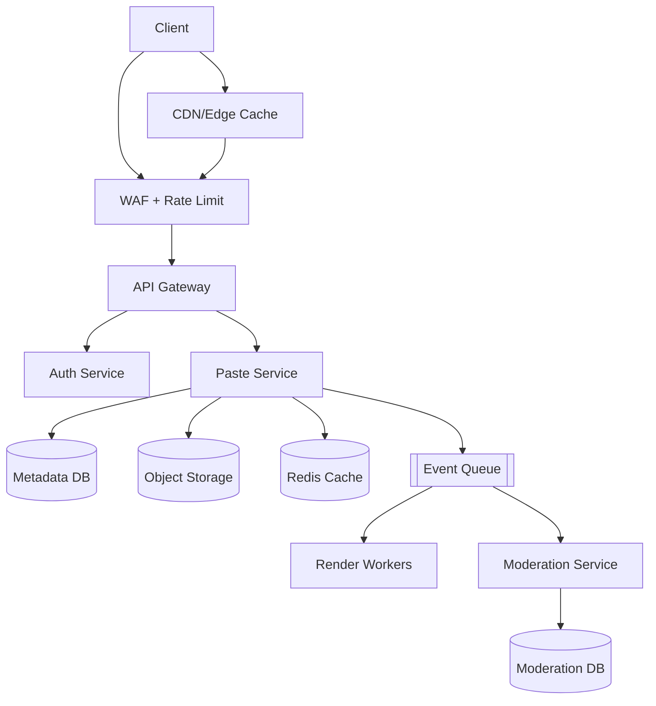
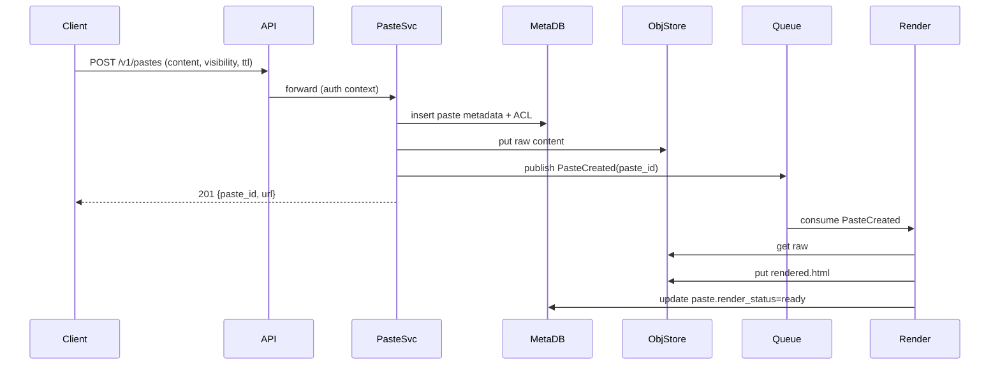

## Overview

A Pastebin-like service looks deceptively simple—store text and return a URL—but becomes a production system once you add fine-grained access control (ACLs), safe syntax highlighting, and abuse reporting with takedown workflows. The core challenges are (1) serving hot, mostly-read content at very low latency, (2) enforcing authorization correctly across caches/CDNs, and (3) preventing the service from becoming a malware/phishing distribution channel while keeping moderation operationally tractable.

The key insight is to split *paste metadata + authorization* from *paste content*, and to separate *read-optimized delivery* (CDN + cache + object storage) from *control-plane decisions* (ACL checks, rate limits, abuse actions) that must be consistent and auditable. Syntax highlighting is treated as an asynchronous, sandboxed rendering pipeline with strict output sanitization to avoid XSS and resource-exhaustion attacks.

## Requirements

### Functional Requirements
- Create a paste with TTL (e.g., 10 minutes to “never”), optional burn-after-read, and size limits.
- Retrieve a paste in raw text and rendered (syntax-highlighted) form.
- Support access modes: `public`, `unlisted` (guess-resistant URL), and `private` (ACL-based).
- Manage ACLs per paste: owner, explicit allow list (users/groups), and optional “share link” capability token.
- Support syntax selection (`language=auto|python|...`) and safe rendering with line numbers and copy-friendly output.
- Report abuse (spam/phishing/malware/illegal content), track status, and notify moderators.
- Moderator actions: quarantine (block reads), redact, delete, or restore; maintain audit trail.
- Rate limiting and anti-abuse protections for create/read/report endpoints.

### Non-Functional Requirements
- **Scale**: 20M MAU, 2M DAU; peak reads 50K QPS, peak creates 2K QPS; 5 PB content in object storage over time (high churn with TTL).
- **Latency**: Read path P50 30 ms / P99 150 ms (from edge for cache hits); create path P50 120 ms / P99 400 ms.
- **Availability**: 99.99% for reads, 99.9% for writes; graceful degradation (raw view even if renderer is down).
- **Consistency**: Strong for ACL/moderation decisions and metadata updates; eventual for pre-rendered highlights and search indexes (if any).
- **Durability**: No data loss for non-expired pastes (RPO ≤ 5 minutes); TTL expiration may delete permanently.

### Constraints & Assumptions
- Text-only pastes (no arbitrary binaries); max paste size 1 MB (configurable).
- Anonymous users allowed for `public`/`unlisted` create and read; accounts required for `private` and persistent management.
- Small team constraint: prefer managed services (object storage, managed DB, managed queue).
- Compliance: retain moderation/audit logs for 1 year; support legal takedown and region-based blocking (optional).

## High-Level Architecture



Reads for `public/unlisted` are optimized for CDN + cache, with origin fallback to the Paste Service and object storage. `private` reads require an authorization decision (ACL evaluation), so CDN caching must be carefully scoped (e.g., bypass or vary by signed capability). Writes are handled by the Paste Service, which persists metadata to a strongly consistent store and streams content to object storage.

Syntax highlighting is performed asynchronously by sandboxed Render Workers subscribed to an event queue; the system can serve raw text immediately and upgrade to rendered HTML when ready. Abuse reports and automated detections flow through the same queue into a Moderation Service that can quarantine content quickly without needing to delete blobs synchronously.

## Component Deep-Dive

### API Gateway + WAF

**Responsibility**: Routing, TLS termination, request authentication hooks, coarse rate limiting, and abuse protections.

**Key Design Decisions**:
- Use WAF rules + IP reputation + per-route rate limits to reduce load and stop obvious abuse before application code.
- Normalize request sizes and enforce content-length limits at the edge to prevent oversized payload attacks.

**Technology Choice**: Cloudflare/Akamai + WAF, or AWS ALB + AWS WAF.

**Scaling Strategy**: Fully managed; scale by design. Keep rules simple and measure false positives.

### Auth Service

**Responsibility**: User authentication (OIDC/passwordless), session/token issuance, and group membership lookup.

**Key Design Decisions**:
- Use short-lived access tokens (JWT or opaque) and a server-side session store for revocation.
- Model groups explicitly to support ACLs beyond per-user lists.

**Technology Choice**: Managed IdP (Auth0/Cognito) + internal group service, or OSS (Keycloak) if required.

**Scaling Strategy**: Stateless token verification at edge/API; cache group membership in Redis with short TTL (e.g., 60s).

### Paste Service

**Responsibility**: Create/read/update/delete pastes, enforce ACLs, generate IDs, and manage TTL/burn-after-read.

**Key Design Decisions**:
- Store metadata/ACL in a strongly consistent DB; store content in object storage keyed by `paste_id/version`.
- Support two access mechanisms: ACL evaluation (for authenticated private access) and capability tokens (share links) for low-friction sharing.

**Technology Choice**: Go/Java/Kotlin service; PostgreSQL (or DynamoDB if you prefer single-key lookups); Redis for hot metadata and rate limit counters.

**Scaling Strategy**: Horizontal scale behind load balancer; partition metadata by `paste_id` hash (or DB sharding/partitioning) once single-node DB limits are reached.

### Render Workers (Syntax Highlighting)

**Responsibility**: Compute safe rendered HTML (and optionally a minimized CSS theme) from raw text + language hints.

**Key Design Decisions**:
- Render asynchronously and store output as a separate artifact (`rendered_html`) to keep read path fast.
- Sandbox rendering (seccomp/gVisor/firecracker) with CPU/memory/time limits to mitigate pathological inputs and RCE risks in parsers.

**Technology Choice**: Tree-sitter or Pygments/Chroma; workers on Kubernetes or serverless with sandboxing support; store rendered output in object storage or DB.

**Scaling Strategy**: Scale by queue depth; use priority queues (new paste renders higher priority than re-renders).

### Moderation Service

**Responsibility**: Ingest abuse reports, run automated checks, manage quarantines/takedowns, and maintain audit logs.

**Key Design Decisions**:
- “Quarantine first” flag in metadata to immediately block reads without deleting content synchronously.
- Maintain immutable audit events for moderator actions for accountability and incident response.

**Technology Choice**: Separate service + DB (PostgreSQL); queue consumers; optional integration with URL scanners (internal) and threat intel feeds.

**Scaling Strategy**: Scale on report volume; batch/stream processing for automated classifiers.

## Data Model

### Storage Schema

**PostgreSQL (metadata + ACL)**

`pastes`
- `paste_id` (PK, base62 string)
- `owner_user_id` (nullable for anonymous)
- `visibility` (`public|unlisted|private`)
- `title` (nullable)
- `language` (e.g., `auto`, `python`)
- `content_key` (object storage key)
- `content_sha256`
- `size_bytes`
- `created_at`, `expires_at` (nullable)
- `burn_after_read` (bool)
- `read_count` (bigint)
- `quarantined` (bool)
- `deleted_at` (nullable)
- `version` (int, for optimistic concurrency)

`paste_acl_entries`
- `paste_id` (FK)
- `principal_type` (`user|group|capability`)
- `principal_id` (user_id/group_id/capability_id)
- `permission` (`read|write|owner`)
- `created_at`
- PK: (`paste_id`, `principal_type`, `principal_id`, `permission`)

`capabilities`
- `capability_id` (PK)
- `paste_id` (FK)
- `token_hash` (hash of secret token, never store raw)
- `expires_at` (nullable)
- `created_at`
- `last_used_at` (nullable)

**Moderation DB**

`abuse_reports`
- `report_id` (PK, UUID)
- `paste_id`
- `reporter_user_id` (nullable)
- `category` (`spam|phishing|malware|illegal|other`)
- `details` (text)
- `status` (`open|triaged|actioned|closed`)
- `created_at`, `updated_at`

`moderation_actions`
- `action_id` (PK)
- `paste_id`
- `moderator_user_id`
- `action` (`quarantine|redact|delete|restore`)
- `reason`
- `created_at`

**Object Storage**
- `pastes/{paste_id}/raw.txt`
- `pastes/{paste_id}/rendered.html` (optional)
- `pastes/{paste_id}/meta.json` (optional convenience, not authoritative)

### Data Flow



## API Design

### Create Paste
`POST /v1/pastes`

Request:
```json
{
  "content": "string",
  "title": "string|null",
  "visibility": "public|unlisted|private",
  "language": "auto|python|javascript|...",
  "expires_in_seconds": 3600,
  "burn_after_read": false,
  "acl": {
    "allow_users": ["u123"],
    "allow_groups": ["g456"]
  }
}
```

Response `201`:
```json
{
  "paste_id": "aB3xZ9",
  "url": "https://paste.example/aB3xZ9",
  "raw_url": "https://paste.example/aB3xZ9/raw",
  "render_url": "https://paste.example/aB3xZ9/render"
}
```

Errors:
- `400` invalid params / too large
- `401/403` auth required or not permitted for `private`
- `429` rate limited

Idempotency:
- Support `Idempotency-Key` header for authenticated clients; store key -> result for 24h.

### Get Paste (Metadata)
`GET /v1/pastes/{paste_id}` (auth optional)

Response `200`:
```json
{
  "paste_id": "aB3xZ9",
  "visibility": "unlisted",
  "title": null,
  "language": "auto",
  "size_bytes": 1234,
  "created_at": "2025-01-01T00:00:00Z",
  "expires_at": null,
  "render_status": "pending|ready|failed"
}
```

Authorization:
- For `private`, require bearer token OR `cap` query param (capability token) validated against `token_hash`.

### Get Raw Content
`GET /v1/pastes/{paste_id}/raw`

Behavior:
- Returns `text/plain; charset=utf-8`
- If `burn_after_read=true`, first successful authorized read triggers a transactional state change:
  - Mark as deleted/quarantined (or set `expires_at=now`) and invalidate caches.

### Get Rendered Content
`GET /v1/pastes/{paste_id}/render`

Behavior:
- Returns sanitized `text/html` with strict CSP headers.
- If render not ready, return `302` to raw or `200` with a lightweight “render pending” HTML (no user content embedded).

### Manage ACL (Owner Only)
`PUT /v1/pastes/{paste_id}/acl`

Request:
```json
{
  "allow_users": ["u123", "u999"],
  "allow_groups": ["g456"],
  "capability": { "enabled": true, "expires_in_seconds": 604800 }
}
```

Response `200` includes a one-time capability token if created/rotated.

### Report Abuse
`POST /v1/pastes/{paste_id}/abuse-reports`

Request:
```json
{ "category": "phishing", "details": "Looks like credential harvest" }
```

Response `202` with `report_id`. Rate limit heavily and dedupe by (paste_id, reporter, time window).

## Scaling & Performance

### Bottleneck Analysis
- **Hot reads**: mitigate with CDN caching for `public/unlisted` and Redis metadata caching; keep origin response small.
- **ACL checks**: keep metadata+ACL in Redis (short TTL) and avoid DB fanouts via precomputed “effective principals” or indexed ACL tables.
- **Renderer throughput**: protect with queue backpressure, sandbox limits, and fallback to raw.
- **Abuse traffic**: WAF + per-IP/user rate limits, CAPTCHA on suspicious create/report patterns.

### Horizontal Scaling
- **Edge/CDN**: cache `public/unlisted` rendered + raw; purge/invalidate on delete/quarantine.
- **Paste Service**: stateless; scale replicas; use connection pooling (PgBouncer) and Redis for hot paths.
- **Metadata DB**: start with Postgres (read replicas, partition by hash of `paste_id`); migrate to sharded Postgres/Citus or DynamoDB if access pattern is primarily key-value.
- **Object Storage**: scales naturally; use multipart upload for large pastes if needed.
- **Queue/Workers**: scale consumers by lag; separate queues for render vs moderation.

### Caching Strategy
- **CDN**:
  - Cache `GET /raw` and `GET /render` for `public/unlisted` with `Cache-Control: public, max-age=300, stale-while-revalidate=600`.
  - Do not cache `private` unless using capability tokens and varying cache key by token hash prefix (often simpler to bypass CDN for private).
- **Redis**:
  - Cache paste metadata (`paste_id -> visibility, expires_at, quarantined, content_key, render_status`) TTL 60–300s.
  - Cache ACL decisions (`paste_id:user_id -> allow/deny`) TTL 30–60s; invalidate on ACL update.
- **Invalidation**:
  - On delete/quarantine/ACL change: publish invalidation event; purge CDN for `public/unlisted` URLs; delete Redis keys.

## Trade-offs & Alternatives

### Key Trade-offs Made
- **Object storage for content** chosen over storing blobs in the DB; sacrifices transactional “single-store” simplicity but improves cost and read scalability.
- **Async rendering** chosen over synchronous render-on-read; sacrifices immediate highlighting but protects latency and isolates risky rendering workloads.
- **Capability tokens** added alongside ACLs; sacrifices some “pure ACL” simplicity but enables share links without creating accounts.

### Alternative Approaches
- **Client-side highlighting only**: simpler backend, but inconsistent rendering, heavier clients, and still needs sanitization for any HTML-based view.
- **Single DynamoDB table for everything**: great for key lookups, but ACL queries and moderation/audit reporting can become awkward without careful denormalization.
- **Store rendered HTML only**: fastest reads but loses raw fidelity and complicates re-rendering with new themes/sanitizers.

## Failure Modes & Mitigations

### Failure Scenarios
- **Metadata DB outage**
  - **Impact**: private reads/writes fail; public cached reads may still work via CDN.
  - **Detection**: DB health checks, elevated error rates, saturation metrics.
  - **Mitigation**: read-only mode for cached public; fail closed for private; promote replica; connection shedding.
- **Object storage throttling/outage**
  - **Impact**: cache misses fail; cached content continues at edge.
  - **Detection**: increased 5xx from storage client, higher origin latency.
  - **Mitigation**: increase CDN TTL temporarily; retry with jitter; multi-region buckets if needed.
- **Renderer compromised / XSS regression**
  - **Impact**: user data exposure/session theft risk.
  - **Detection**: CSP violation reports, security scanning, canary rendering tests.
  - **Mitigation**: strict sanitization allowlist, CSP `default-src 'none'`, isolate renderer, kill switch to disable rendered endpoint and serve raw.
- **Abuse spike (paste spam)**
  - **Impact**: cost increase, reputational harm.
  - **Detection**: create QPS anomalies, reports spike, WAF logs.
  - **Mitigation**: tighten rate limits, require CAPTCHA for anonymous creates, temporarily disable `public` creates, quarantine by heuristic.

### Disaster Recovery
- **RTO/RPO**: RTO 1 hour (full service), RPO 5 minutes for metadata; content is durable in object storage.
- **Backups**: PITR for Postgres; daily snapshots; moderation DB same. Store backup manifests and test restores monthly.
- **Failover**: Multi-AZ DB with automated failover; optionally active-active reads for public content via multi-region CDN + replicated object storage.

## Operational Considerations

### Monitoring & Alerting
- Key metrics:
  - Read/write QPS, P50/P99 latency by endpoint, cache hit rates (CDN/Redis), DB CPU/IO/conn pool saturation, queue lag, renderer error rates, quarantine actions/hour.
- Alerts (examples):
  - P99 read latency > 300 ms for 5 min
  - 5xx rate > 1% for 2 min
  - Queue lag > 10 min for render pipeline
  - Create QPS anomaly (3x baseline) + WAF blocks rising

### Deployment Strategy
- Blue/green or canary releases for Paste Service and renderer; shadow traffic for renderer changes.
- Schema migrations: backward-compatible migrations first; deploy code; then finalize constraints.
- Rollback: instant traffic shift; keep previous renderer versions available; feature flags for render endpoint and capability token enforcement.

## References & Further Reading
- OWASP XSS Prevention Cheat Sheet: https://owasp.org/www-community/xss-prevention
- Content Security Policy (CSP): https://developer.mozilla.org/en-US/docs/Web/HTTP/CSP
- Cloudflare: Cache key and private content guidance: https://developers.cloudflare.com/cache/
- Pygments (syntax highlighting): https://pygments.org/
- Tree-sitter: https://tree-sitter.github.io/tree-sitter/
- “Capability-based security” (share links as capabilities): https://en.wikipedia.org/wiki/Capability-based_security