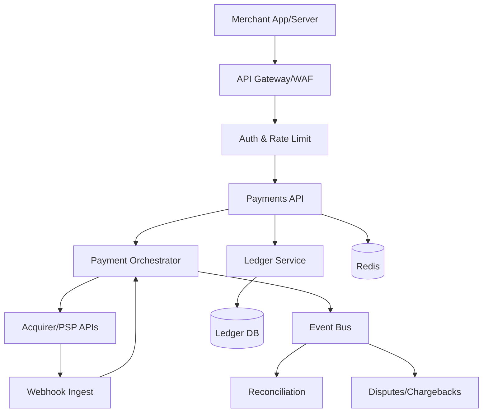
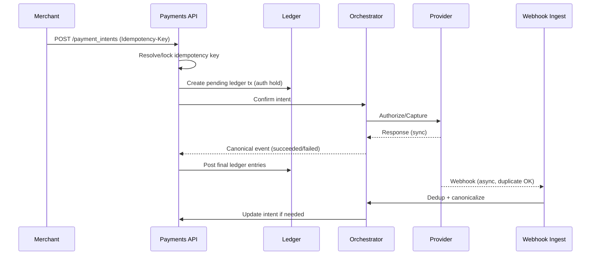

## Overview

A payment processing gateway sits on the critical path of revenue: it accepts payment intents from merchants, securely handles sensitive payment data, routes requests to external processors/acquirers, and produces an auditable financial record. The core challenges are correctness under retries/timeouts (idempotency), financial integrity (double-entry ledger + reconciliation), and handling post-transaction lifecycle events like chargebacks and refunds—all while meeting strict compliance requirements (PCI-DSS) and operating with high availability.

The key insight is to separate *payment orchestration* (talking to providers) from *financial truth* (an immutable, double-entry ledger), and connect them via durable events. The system uses idempotency keys and deterministic state transitions to make APIs safe under at-least-once delivery. Reconciliation and disputes are modeled as first-class workflows that mutate *states* but never rewrite history—every financial change is recorded as new ledger entries with strong invariants.

## Requirements

### Functional Requirements
- Create and manage `PaymentIntent` (authorize/capture) with multiple providers and methods (cards, wallets).
- Enforce idempotency for all mutating operations (create/confirm/capture/refund/payout) across retries.
- Store and operate a double-entry ledger for all money movements (payments, fees, refunds, chargebacks, payouts).
- Ingest provider webhooks/events and reconcile them with internal records (including out-of-order/duplicate delivery).
- Support chargeback lifecycle: notification, evidence submission, representment, win/loss, and fund movements.
- Provide merchant-facing reporting APIs (transactions, balances, settlements) with export capability.
- Provide operational tools: manual review/override with audited actions, replay/reprocessing for failed workflows.
- Maintain PCI-DSS compliance with tokenization and restricted PAN handling.

### Non-Functional Requirements
- **Scale**: 5M merchants, 100M customers, 200M payment methods; peak 20k QPS API, 5k QPS provider webhooks; ~50M transactions/day; ~5TB/month ledger/event growth (compressed).
- **Latency**:
  - Create/confirm intent (internal): P50 30ms, P99 150ms (excluding provider).
  - End-to-end confirm (including provider): P50 400ms, P99 2.5s (provider-dependent).
  - Webhook ingestion ack: P99 200ms.
- **Availability**: 99.99% for API + webhook ingestion; ledger write path 99.99% with backpressure rather than partial writes.
- **Consistency**:
  - Strong consistency for ledger posting and idempotency key resolution (single-writer per account partition).
  - Eventual consistency for analytics/reporting/search indexes.
- **Durability**: RPO 0 for ledger entries (no acknowledged loss), RPO ≤ 5 minutes for derived views; immutable audit logs retained 7 years.

### Constraints & Assumptions
- PCI-DSS scope minimization: do not store PAN/CVV outside a dedicated vault; prefer network tokenization; CVV never stored.
- Small platform team (8–12 engineers) initially; prioritize correctness and operability over premature microservice sprawl.
- Must support multi-region for read and webhook ingestion; ledger posting uses a single primary region per merchant/account to preserve strong invariants.
- Compliance: PCI-DSS, SOC2; optional regional requirements (GDPR, data residency) addressed via logical tenancy and encryption.

## High-Level Architecture



This architecture isolates responsibilities: the Payments API provides a stable contract to merchants and enforces idempotency, while the Orchestrator encapsulates provider-specific behavior (retries, timeouts, 3DS flows, webhooks). The Ledger Service is the source of truth for balances and financial state transitions; it posts immutable double-entry records and exposes derived balances.

A durable event bus (e.g., Kafka/PubSub) decouples asynchronous workflows (webhooks, reconciliation, disputes) from the synchronous API. Derived systems (reporting/search) consume events and can be rebuilt, while the ledger remains authoritative.

## Component Deep-Dive

### API Gateway / Auth & Rate Limit

**Responsibility**: TLS termination, WAF, authn/z (OAuth2/JWT + merchant keys), rate limiting, request normalization, idempotency header enforcement.

**Key Design Decisions**:
- Enforce idempotency key format and scope at the edge to reduce duplicate load.
- Separate merchant auth from internal service auth (mTLS + SPIFFE) to limit blast radius.

**Technology Choice**: Envoy/NGINX + API gateway (Kong/Apigee) + OPA policy; Cloud WAF.

**Scaling Strategy**: Stateless horizontal scaling; global anycast/CDN for edge; per-merchant rate limits stored in Redis with local caching.

### Payments API

**Responsibility**: Merchant-facing lifecycle for intents (create/confirm/capture/refund), idempotency resolution, state machine enforcement, and synchronous ledger postings.

**Key Design Decisions**:
- Treat `PaymentIntent` as the primary merchant abstraction; keep provider transaction IDs as attributes, not the identity.
- Use a strict state machine (e.g., `requires_payment_method -> requires_confirmation -> processing -> succeeded/failed`) to prevent invalid transitions.

**Technology Choice**: Stateless service (Go/Java) + PostgreSQL for transactional metadata + Redis for hot idempotency cache.

**Scaling Strategy**: Stateless scale-out; partition hot paths by `merchant_id`; use read replicas for queries; write path guarded by idempotency + optimistic concurrency.

### Payment Orchestrator

**Responsibility**: Provider routing, provider adapters, retry/backoff policies, timeout handling, 3DS/SCA flows, webhook correlation/deduplication, and emitting canonical payment events.

**Key Design Decisions**:
- Normalize all provider outcomes into a canonical event model (`Authorized`, `Captured`, `Refunded`, `ChargebackOpened`, etc.).
- Use outbox pattern when emitting events so state changes and events are atomic.

**Technology Choice**: Service + adapters; HTTP clients with circuit breakers; event bus (Kafka); provider secrets in KMS/HSM.

**Scaling Strategy**: Separate worker pools per provider to isolate latency; concurrency limits per provider; async queues for long-running confirmations.

### Ledger Service

**Responsibility**: Immutable double-entry ledger posting, balance computation, account invariants, and auditable financial reporting primitives.

**Key Design Decisions**:
- Double-entry only: every movement records equal debit/credit; no in-place updates of money.
- Strong write consistency per account partition: serialize postings by `account_id` (or `merchant_id, currency`) to avoid balance races.

**Technology Choice**: PostgreSQL (partitioned tables) or Cloud Spanner for global consistency; append-only ledger tables; optional read models in OLAP (ClickHouse/BigQuery).

**Scaling Strategy**: Partition by `(merchant_id, currency)`; write sharding; materialized balance snapshots; async projection for reporting.

### Reconciliation & Disputes

**Responsibility**: Match internal events/ledger to provider settlement files and bank statements; manage chargeback workflow and resulting ledger postings.

**Key Design Decisions**:
- Reconciliation is a workflow with checkpoints: ingest -> normalize -> match -> exceptions -> resolve -> close.
- Chargebacks create *new* ledger events (hold/withdrawal/return) rather than mutating original payment entries.

**Technology Choice**: Batch + streaming (Spark/Flink optional); rule engine for matching; case management store (Postgres) + object store for evidence.

**Scaling Strategy**: Batch per settlement date/provider; shard by merchant/provider; parallel matching; exception queues for human ops.

## Data Model

### Storage Schema

**Relational (PostgreSQL/Spanner)**
- `merchants(merchant_id, status, default_currency, created_at)`
- `customers(customer_id, merchant_id, email_hash, created_at)`
- `payment_methods(pm_id, merchant_id, customer_id, type, token, last4, brand, exp_month, exp_year, created_at)`
- `payment_intents(pi_id, merchant_id, amount, currency, status, idempotency_key, provider, provider_ref, created_at, updated_at, version)`
- `refunds(refund_id, pi_id, merchant_id, amount, status, provider_ref, idempotency_key, created_at)`
- `idempotency_keys(merchant_id, key, request_hash, response_blob, status, created_at, expires_at)`  
  - Unique: `(merchant_id, key)`
- `provider_events(provider, provider_event_id, received_at, payload_hash, canonical_event_id)`  
  - Unique: `(provider, provider_event_id)`
- `chargebacks(cb_id, pi_id, merchant_id, stage, reason_code, due_by, status, created_at, updated_at)`

**Ledger (append-only)**
- `accounts(account_id, merchant_id, currency, type)` (e.g., `merchant_cash`, `platform_fees`, `chargeback_reserve`)
- `ledger_transactions(ltx_id, merchant_id, currency, type, correlation_id, created_at)`
- `ledger_entries(entry_id, ltx_id, account_id, direction, amount, created_at)`  
  - Constraint: per `ltx_id`, sum(debits) == sum(credits)
- `balance_snapshots(account_id, as_of_entry_id, balance, updated_at)` (optional acceleration)

**Object storage**
- Evidence files, settlement files, reconciliation inputs/outputs, audit exports (encrypted, WORM where required).

### Data Flow



## API Design

### Conventions
- Idempotency via `Idempotency-Key` header for all POST/PUT actions; scoped per `merchant_id`.
- Responses include `Idempotency-Replayed: true|false` and a stable `request_id`.
- Errors use typed codes; retries only for `5xx` and specific `409/429` with backoff.
- Idempotency record stores a hash of the request body to prevent key reuse with different payloads.

### Key Endpoints (REST)

**Create PaymentIntent**
- `POST /v1/payment_intents`
- Request:
  ```json
  { "amount": 4999, "currency": "USD", "customer_id": "cus_...", "payment_method_id": "pm_...", "capture_method": "automatic|manual" }
  ```
- Response:
  ```json
  { "id": "pi_...", "status": "requires_confirmation", "amount": 4999, "currency": "USD" }
  ```

**Confirm PaymentIntent**
- `POST /v1/payment_intents/{pi_id}/confirm`
- Response includes provider-required next actions (e.g., 3DS):
  ```json
  { "id": "pi_...", "status": "processing", "next_action": { "type": "redirect", "url": "https://..." } }
  ```

**Capture**
- `POST /v1/payment_intents/{pi_id}/capture`
- Idempotent: repeated capture returns same `capture_id`/final state.

**Refund**
- `POST /v1/refunds`
- Request:
  ```json
  { "payment_intent_id": "pi_...", "amount": 2000, "reason": "requested_by_customer" }
  ```

**List Balance / Transactions**
- `GET /v1/balance`
- `GET /v1/transactions?created_gte=...&limit=...`

**Webhook**
- `POST /v1/webhooks/{provider}`
- Verify signature (provider secret in HSM/KMS); dedup by `(provider, provider_event_id)`; respond `2xx` quickly after durable write.

### Error Handling
- `400 invalid_request`, `401 unauthorized`, `403 forbidden`, `409 idempotency_conflict` (same key different payload), `422 invalid_state_transition`, `429 rate_limited`, `502 provider_unavailable`, `504 provider_timeout`.
- For `provider_timeout`, return `202 processing` when safe and resolve asynchronously via webhook/polling.

### Idempotency Considerations
- Persist idempotency outcome for 24–72 hours (configurable).
- For long-running operations, store an intermediate status and a polling URL.
- Use per-merchant key namespace; enforce max key cardinality to avoid abuse.

## Scaling & Performance

### Bottleneck Analysis
- **Provider latency and flakiness**: dominates P99; mitigate with async flows, circuit breakers, and provider-specific worker pools.
- **Hot merchants**: can overload partitions; mitigate with per-merchant rate limiting, sharding by `(merchant_id, currency)`, and queue-based smoothing.
- **Ledger contention**: strong invariants can serialize writes; mitigate with batching, account partitioning, and minimizing synchronous postings to the smallest necessary set.

### Horizontal Scaling
- **Edge/API/Orchestrator**: stateless scale-out behind L7 load balancers; autoscale on CPU + in-flight requests.
- **Event bus**: partition topics by `merchant_id` to preserve ordering per merchant when needed.
- **Datastores**: partition ledger tables by time and merchant; read replicas for reporting; OLAP sink for heavy queries.

### Caching Strategy
- **Redis**: idempotency hot cache, merchant config, rate limit counters (TTL minutes).
- **API response caching**: safe GETs only (balances/transactions) with short TTL (1–5s) per merchant; include `ETag`.
- **Invalidation**: event-driven; on ledger posting emit `BalanceUpdated` to invalidate affected merchant keys.

## Trade-offs & Alternatives

### Key Trade-offs Made
- **Chosen**: Strongly consistent ledger postings (per account partition).  
  **Sacrificed**: Some write throughput/latency.  
  **Why**: Financial correctness and auditability outweigh raw throughput in payment cores.
- **Chosen**: Canonical event model + outbox + event bus.  
  **Sacrificed**: Operational complexity (Kafka, consumers, replay).  
  **Why**: Clean separation of truth vs derived views; enables reconciliation/disputes without coupling.
- **Chosen**: PCI scope minimization via tokenization/vault.  
  **Sacrificed**: Extra dependency and integration work.  
  **Why**: Reduces audit surface area and breach impact.

### Alternative Approaches
- **Single monolith + single DB**: simpler initially; rejected due to provider integrations, webhooks, and disputes creating high coupling and deployment risk.
- **Pure event-sourced ledger**: excellent audit/replay; rejected for higher engineering complexity unless the team already has strong event-sourcing maturity.
- **Use a third-party processor as system-of-record**: faster to launch; rejected because reconciliation, chargeback workflows, and ledger integrity become opaque and vendor-locking.

## Failure Modes & Mitigations

### Failure Scenarios
- **Scenario**: Client retries `confirm` due to timeout.  
  **Impact**: Double charge risk.  
  **Detection**: Duplicate idempotency key / duplicate provider reference.  
  **Mitigation**: Idempotency key lock + provider idempotency where available; return stored response.
- **Scenario**: Webhook delivered out of order / duplicated.  
  **Impact**: Incorrect status transitions.  
  **Detection**: `provider_events` dedup + state machine rejects illegal transitions.  
  **Mitigation**: Dedup by provider event ID; accept late events as no-ops; reconcile with polling/settlement.
- **Scenario**: Ledger DB partition outage.  
  **Impact**: Unable to finalize transactions.  
  **Detection**: Elevated error rates, failed postings.  
  **Mitigation**: Fail closed for money movement (return `202 processing` where safe); queue postings; promote replica/failover for that partition.
- **Scenario**: Provider partial outage or degraded latency.  
  **Impact**: Increased timeouts and abandoned checkouts.  
  **Detection**: Provider SLO dashboards, circuit breaker open rates.  
  **Mitigation**: Multi-provider routing, circuit breakers, async confirmation, graceful degradation.
- **Scenario**: Reconciliation drift (missing settlements).  
  **Impact**: Financial reporting inaccuracies.  
  **Detection**: Daily reconciliation exceptions and unmatched totals.  
  **Mitigation**: Automated exception queues, replay ingestion, manual ops tooling, adjustments via explicit ledger transactions.
- **Scenario**: Key compromise / webhook signature secret leaked.  
  **Impact**: Fraudulent events.  
  **Detection**: Anomaly detection, signature mismatch audits, secret access logs.  
  **Mitigation**: KMS rotation, per-provider secrets, least privilege, mTLS, allowlist IPs where feasible, WAF rules.

### Disaster Recovery
- **RTO/RPO**: RTO 30 minutes for API; RPO 0 for ledger entries (ack only after durable commit).
- **Backup strategy**: Continuous WAL/transaction log archiving; daily full backups; object storage versioning + WORM for audit artifacts.
- **Failover procedures**: Active-passive for ledger primary region; active-active for stateless API/webhook ingestion with regional routing to the ledger primary for each merchant partition.

## Operational Considerations

### Monitoring & Alerting
- Key metrics:
  - API: QPS, error rate by code, P50/P95/P99 latency, idempotency replay rate, state transition failures.
  - Orchestrator: provider latency/error, circuit breaker state, queue depth, webhook dedup rate.
  - Ledger: posting latency, constraint violation count, partition hot spots, replication lag.
  - Reconciliation: unmatched amount totals, exception backlog, file ingest failures.
- Alerts:
  - `5xx` > 1% for 5 minutes (page), provider timeout spikes (page), ledger posting failures > 0 (page), webhook signature failures spike (page), reconciliation unmatched totals above threshold (ticket/page based on severity).

### Deployment Strategy
- Canary + feature flags for provider routing and state machine changes.
- Backward-compatible event schemas (versioned) and database migrations (expand/contract).
- Rollback: keep old consumers compatible; disable new provider adapter via config; replay outbox/events to restore derived views.

## References & Further Reading
- PCI DSS v4.0 overview: https://www.pcisecuritystandards.org/
- Stripe engineering (idempotency, payments): https://stripe.com/blog
- Designing data-intensive applications (transactions, logs, consistency): https://dataintensive.net/
- Kafka exactly-once semantics and outbox patterns: https://kafka.apache.org/documentation/
- Double-entry ledger concepts: https://en.wikipedia.org/wiki/Double-entry_bookkeeping