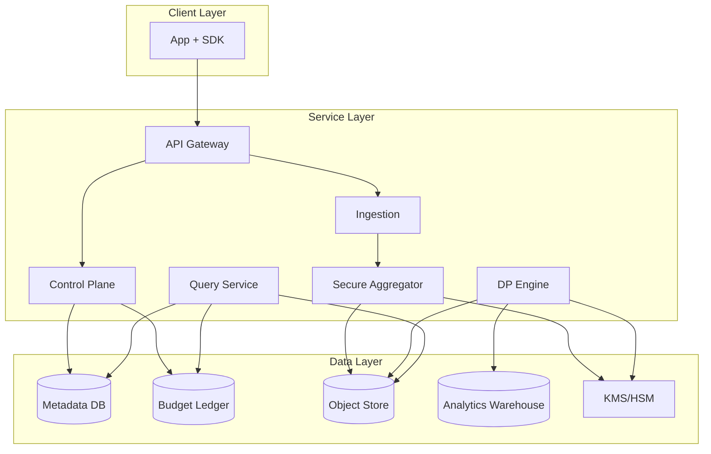
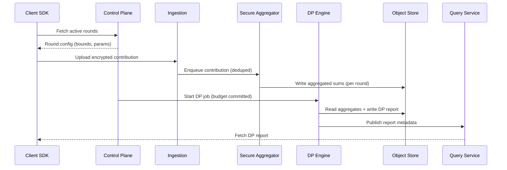

## Overview

Privacy-preserving analytics aims to compute useful aggregate statistics (e.g., counts, rates, histograms, top-k) while preventing access to raw, user-level data and minimizing the risk of re-identification. The challenge is balancing data utility with rigorous privacy guarantees, operating at scale with unreliable clients, and providing verifiable controls (privacy budgets, auditing, retention) that hold up under adversarial scrutiny and regulatory requirements.

A production-grade approach combines **federated analytics** (compute partial aggregates on-device), **secure aggregation** (cryptographically ensure the server only sees sums, not individual contributions), and **differential privacy (DP)** (add calibrated noise and enforce privacy budgets so released results have quantifiable privacy loss). The key insight is to treat privacy as a first-class resource: every release consumes budget, every metric is bounded, and every pipeline stage is designed to prevent “raw access” by construction.

## Requirements

### Functional Requirements
- Compute standard aggregates (counts, sums, means, histograms, quantiles, top-k) over configurable cohorts and time windows.
- Support metric definitions with strict contribution bounds (e.g., per-user clipping, per-day limits) and validation before execution.
- Run federated collection rounds: assign clients to rounds, collect contributions, and handle late/duplicate submissions safely.
- Produce DP-protected reports with explicit privacy parameters (ε, δ), confidence intervals, and metadata (sample size, clipping, noise scale).
- Enforce per-product/team privacy budgets with an auditable ledger and hard stops when depleted.
- Provide “no raw data access” guarantees for operators: prevent queries that expose user-level records; minimize and encrypt any transient artifacts.
- Support deletion/opt-out semantics (stop future contributions; ensure retention windows for transient artifacts are short and enforceable).
- Offer monitoring, anomaly detection (poisoning/outliers), and governance workflows (approvals for sensitive metrics).

### Non-Functional Requirements
- **Scale**: 50M MAU, 10M DAU; 200K concurrent clients during peak rounds; ingestion peak 50K req/s; 5K analytic jobs/day; report reads 2K QPS.
- **Latency**:
  - Round contribution upload P99 < 300ms (regional).
  - Report generation: small jobs < 5 minutes; large cohort jobs < 60 minutes.
  - Report fetch P99 < 100ms (cached) / < 500ms (cold).
- **Availability**: 99.9% for ingestion and report reads; 99.5% for job creation/control plane.
- **Consistency**:
  - Strong consistency for privacy budget ledger and job state transitions.
  - Eventual consistency acceptable for report availability and monitoring aggregates.
- **Durability**: No loss of finalized reports/ledger entries (RPO ≤ 5 minutes); transient per-round artifacts may be lossy within defined retention (e.g., ≤ 24h).

### Constraints & Assumptions
- Clients are partially trusted and can be compromised; assume some fraction of malicious/Byzantine clients.
- No employee/operator should have programmatic access to user-level raw events; access is limited to DP outputs and aggregated telemetry.
- Team size 6–10 engineers; prefer managed primitives where possible (KMS, object store, streaming).
- Compliance targets: GDPR/CCPA; data minimization; short retention for transient artifacts; cryptographic controls and audit logs required.
- Network access may be intermittent on clients; system must tolerate retries, duplicates, and partial participation.

## High-Level Architecture



This architecture separates concerns: the **Control Plane** defines and validates jobs/metrics and enforces privacy budgets; the **Ingestion + Secure Aggregator** collects encrypted, bounded client contributions and ensures the server learns only aggregate sums; the **DP Engine** performs post-aggregation privacy transformations (noise, thresholding, post-processing) and writes immutable reports; the **Query Service** serves reports and metadata with strong authorization and audit logging.

The separation is intentional for “no raw access” guarantees: only the Secure Aggregator touches per-client payloads (still encrypted), and only DP-protected artifacts are persisted long-term. Critical state (job status, budgets) is strongly consistent, while heavy compute and report publication are asynchronous.

## Component Deep-Dive

### Client SDK (Federated Analytics)
**Responsibility**: Collect local events, compute bounded summaries, and participate in secure aggregation rounds.

**Key Design Decisions**:
- Enforce **local contribution bounding** (clipping, per-user caps, per-window limits) before encryption to make DP calibration meaningful and reduce poisoning impact.
- Use **round-based participation** with randomized sampling to reduce privacy loss and control load (e.g., 1–5% of eligible clients per round per metric).

**Technology Choice**: Native SDK (iOS/Android) + optional Web; local storage via OS-provided secure storage; crypto via platform libs (e.g., CryptoKit, Tink).

**Scaling Strategy**: Horizontal scaling is on the client side; server load controlled via sampling rates, cohort targeting, and backoff policies.

### Ingestion Service
**Responsibility**: Authenticate clients, validate round membership, deduplicate submissions, and enqueue for secure aggregation.

**Key Design Decisions**:
- Idempotency keys per `(round_id, device_pseudonym)` to handle retries without double counting.
- Strict schema validation + rejection of out-of-policy payloads (size limits, missing bounds proofs/attestations if used).

**Technology Choice**: Stateless service behind L7 load balancer; gRPC/HTTP2 for mobile efficiency; durable queue/stream (Kafka/PubSub/Kinesis) between ingestion and aggregation.

**Scaling Strategy**: Scale stateless pods by RPS; partition streams by `round_id` to localize aggregation.

### Secure Aggregator
**Responsibility**: Perform secure aggregation so the server only observes aggregate sums, not per-client contributions.

**Key Design Decisions**:
- Use a **secure aggregation protocol** (e.g., Bonawitz et al.) with dropout resilience so rounds complete despite client churn.
- Separate **key management** from aggregation logic; keys derived per-round, rotated frequently, and protected by KMS/HSM.

**Technology Choice**: Dedicated aggregation workers; MPC-style secure aggregation protocol implementation (Tink/SEAL-based components as appropriate); object store for per-round artifacts with short TTL.

**Scaling Strategy**: Shard by `(metric_id, round_id)`; run aggregation workers as autoscaled batch jobs; parallelize by histogram buckets/partitions where safe.

### Differential Privacy (DP) Engine
**Responsibility**: Convert aggregated statistics into DP-protected outputs and enforce privacy budget accounting.

**Key Design Decisions**:
- Central DP applied **after secure aggregation** (privacy amplification by subsampling + cryptographic protection during collection).
- Use a **budget ledger** with composition rules (RDP/zCDP) and explicit allocation per metric/report; deny execution if budget insufficient.

**Technology Choice**: DP libraries (Google differential-privacy, OpenDP) wrapped in a service; batch compute on Spark/Flink or Kubernetes jobs; deterministic report artifacts stored immutably.

**Scaling Strategy**: Batch parallelism by job partitions; cache intermediate aggregates; prioritize jobs via queues and quotas per tenant.

### Control Plane + Budget Ledger
**Responsibility**: Manage job lifecycle, approvals, policy, privacy budgets, and auditing.

**Key Design Decisions**:
- Strong consistency for budgets and job state transitions (exactly-once budget debits).
- Policy-as-code for allowed metrics (supported queries, bounds requirements, minimum cohort sizes, thresholding).

**Technology Choice**: Relational DB (Postgres/Spanner) for metadata; append-only ledger table with immutable entries; OPA/Rego for policy evaluation.

**Scaling Strategy**: Control plane is low QPS; scale read replicas for metadata; ledger writes optimized with partitioning by tenant/time.

## Data Model

### Storage Schema

**Metadata DB (relational)**
- `tenants`
  - `tenant_id` (PK), `name`, `compliance_tier`, `created_at`
- `dp_policies`
  - `policy_id` (PK), `tenant_id` (FK), `max_epsilon_month`, `max_delta_month`, `min_k`, `default_noise_mech`, `created_at`
- `jobs`
  - `job_id` (PK), `tenant_id` (FK), `metric_spec_hash`, `time_window_start`, `time_window_end`, `status` (ENUM), `requested_epsilon`, `requested_delta`, `created_by`, `created_at`
- `rounds`
  - `round_id` (PK), `job_id` (FK), `sampling_rate`, `status`, `start_at`, `end_at`
- `reports`
  - `report_id` (PK), `job_id` (FK), `artifact_uri`, `epsilon_spent`, `delta_spent`, `generated_at`, `checksum`

**Budget Ledger (append-only)**
- `privacy_ledger_entries`
  - `entry_id` (PK), `tenant_id`, `job_id`, `action` (RESERVE/COMMIT/RELEASE), `epsilon`, `delta`, `mechanism`, `timestamp`, `actor`, `reason`

**Object Store**
- `round_artifacts/{round_id}/...` (encrypted; TTL ≤ 24h)
- `reports/{tenant_id}/{report_id}.json` (encrypted; long retention)
- `audit/{date}/...` (immutable; long retention)

### Data Flow



## API Design

### Create Job
- `POST /v1/tenants/{tenant_id}/jobs`
- Request:
  ```json
  {
    "metric_spec": {
      "type": "histogram",
      "event": "checkout",
      "dimension": "cart_value_bucket",
      "bounds": {"max_contribution_per_user": 1, "max_buckets": 50}
    },
    "time_window": {"start": "2025-12-01T00:00:00Z", "end": "2025-12-02T00:00:00Z"},
    "privacy": {"epsilon": 0.5, "delta": 1e-6}
  }
  ```
- Response `201`:
  ```json
  {"job_id":"job_123","status":"PENDING_APPROVAL"}
  ```
- Errors: `400` invalid spec/bounds, `403` policy violation, `409` duplicate spec+window, `429` quota exceeded.
- Idempotency: `Idempotency-Key` supported; server stores key → `job_id`.

### Fetch Active Rounds (Client)
- `GET /v1/rounds/active?app_id=...`
- Response `200` includes `round_id`, `job_id`, contribution bounds, sampling decision, and upload endpoint.
- Errors: `401` invalid client auth, `204` no rounds.

### Upload Contribution (Client)
- `POST /v1/rounds/{round_id}/contributions`
- Headers: `Idempotency-Key`, device attestation (optional), auth token.
- Body: encrypted payload + protocol messages.
- Response `202` accepted.
- Errors: `400` malformed, `401/403` auth/round not eligible, `409` duplicate, `410` round closed.
- Idempotency: dedupe by `(round_id, device_pseudonym, idempotency_key)`.

### Get Report
- `GET /v1/jobs/{job_id}/report`
- Response `200`:
  ```json
  {
    "job_id":"job_123",
    "dp": {"epsilon":0.5,"delta":1e-6,"mechanism":"Gaussian"},
    "min_k": 1000,
    "result": {"buckets":[{"key":"0-10","value":1234},{"key":"10-20","value":1101}]},
    "metadata": {"n_participants": 54231, "generated_at":"2025-12-02T01:10:00Z"}
  }
  ```
- Errors: `404` unknown, `409` not ready, `403` not authorized.

### Budget APIs (Admin)
- `GET /v1/tenants/{tenant_id}/privacy-budget`
- `POST /v1/tenants/{tenant_id}/privacy-budget/allocate` (approval workflow)
- Strong audit logging for all budget actions.

## Scaling & Performance

### Bottleneck Analysis
- **Ingestion spikes** during round starts: mitigate with client-side jitter, token-bucket rate limits, regional edge termination, and async queues.
- **Secure aggregation compute** for large cohorts: shard by round/metric, parallel aggregation, and pre-aggregation at stream partitions.
- **DP report generation** for heavy metrics (top-k/quantiles): approximate algorithms (sketches), bounded domains, and batch compute engines.

### Horizontal Scaling
- **Client layer**: sampling + randomized participation; dynamic backoff.
- **Ingestion**: stateless autoscaling; partition queues by `round_id`.
- **Secure Aggregator**: worker pools; shard by `(metric_id, round_id)`; isolate tenants for noisy neighbors.
- **DP Engine**: batch cluster autoscaling; job queue with priorities/quotas; parallelize per metric partition.
- **Data stores**: metadata DB with read replicas; object store scales elastically; ledger on strongly consistent DB with careful indexing/partitioning.

### Caching Strategy
- Cache **final DP reports** in CDN/edge for `GET /report` (TTL 5–30 minutes) since outputs are immutable.
- Cache **job/round metadata** in Redis (TTL 30–120 seconds) to reduce control-plane DB reads.
- Invalidation: event-driven (job status change publishes to cache), otherwise TTL fallback; immutable report URIs avoid cache coherency complexity.

## Trade-offs & Alternatives

### Key Trade-offs Made
- **Chosen**: Secure aggregation + central DP  
  **Sacrificed**: Simplicity and faster time-to-market  
  **Why**: Strong “no raw access” posture and reduced insider risk; DP guarantees remain meaningful with bounded inputs.
- **Chosen**: Strongly consistent budget ledger  
  **Sacrificed**: Some throughput and operational simplicity  
  **Why**: Budget overspend is a privacy incident; correctness beats performance.
- **Chosen**: Round-based collection with sampling  
  **Sacrificed**: Some freshness and completeness  
  **Why**: Controls load, improves privacy amplification, and stabilizes compute costs.

### Alternative Approaches
- **Pure central DP on server-side raw logs**: easier analytics but violates “no raw access” constraints and increases breach/insider risk.
- **Fully local DP (noise on-device)**: strong server blindness but poor utility for rare events and harder to manage composition; susceptible to client manipulation without additional controls.
- **Trusted Execution Environments (TEE) aggregation**: can simplify cryptography but adds hardware trust assumptions, attestation complexity, and potential side-channel concerns.

## Failure Modes & Mitigations

### Failure Scenarios
- **Scenario**: Secure aggregation round fails due to high dropout  
  **Impact**: Missing report or delayed results  
  **Detection**: Round completion rate alarms, timeout thresholds  
  **Mitigation**: Extend round window, increase sampling pool, dropout-resilient protocol parameters, fallback to re-rounding.
- **Scenario**: Budget ledger outage or inconsistency  
  **Impact**: Job creation blocked; risk of overspend if mishandled  
  **Detection**: DB health checks, ledger invariant checks, failed reservations  
  **Mitigation**: Fail closed (deny new DP releases), multi-AZ database, write-ahead reservation/commit pattern.
- **Scenario**: Poisoning/outlier attack via malicious clients  
  **Impact**: Skewed aggregates, reduced utility, potential privacy amplification loss  
  **Detection**: Robust stats monitoring, contribution bound violations, anomaly scoring on aggregates  
  **Mitigation**: Strict clipping/bounding, per-device rate limits, robust estimators (trimmed mean), minimum k-thresholding, optional attestation.
- **Scenario**: Object store partial outage  
  **Impact**: DP jobs stalled; report fetch failures  
  **Detection**: Elevated read/write errors, increased job retries  
  **Mitigation**: Cross-region replication for reports, retry with exponential backoff, fallback to secondary region for reads.

### Disaster Recovery
- **RTO/RPO**: RTO 2 hours for full service; RPO 5 minutes for metadata/ledger; reports replicated cross-region (RPO ~ 0 for finalized artifacts).
- **Backup strategy**: Continuous backups for metadata DB and ledger; immutable object-store versioning for reports; audit logs in WORM-capable storage.
- **Failover procedures**: Pre-provisioned secondary region; DNS/traffic manager cutover; ledger promoted with strong consistency guarantees; ingestion can run active-active with regional isolation.

## Operational Considerations

### Monitoring & Alerting
- Key metrics:
  - Ingestion: RPS, P99 latency, error rates, dedupe rate, queue lag.
  - Aggregation: round completion %, dropout %, time-to-aggregate, shard hot spots.
  - DP Engine: job runtime, failure rate, budget reserve/commit counts, overspend attempts (should be 0).
  - Data: object store 5xx, metadata DB replication lag, ledger write latency.
- Alerts:
  - Ingestion 5xx > 1% for 5m; queue lag > 2m; round completion < 70% at half-window; any budget invariant violation.

### Deployment Strategy
- Blue/green or canary per service; feature flags for new metric types/mechanisms.
- Schema migrations: backward-compatible changes; ledger changes require explicit review.
- Rollback: immutable reports remain; job state machine supports safe retry; fail closed on DP release if version mismatch.

## References & Further Reading
- Bonawitz et al., “Practical Secure Aggregation for Privacy-Preserving Machine Learning” (Google, 2017)
- Dwork & Roth, “The Algorithmic Foundations of Differential Privacy” (book)
- Google Differential Privacy library: `https://github.com/google/differential-privacy`
- OpenDP initiative: `https://opendp.org/`
- Apple Differential Privacy overview (high-level design patterns)
- “RDP (Rényi Differential Privacy)” for composition accounting in production systems