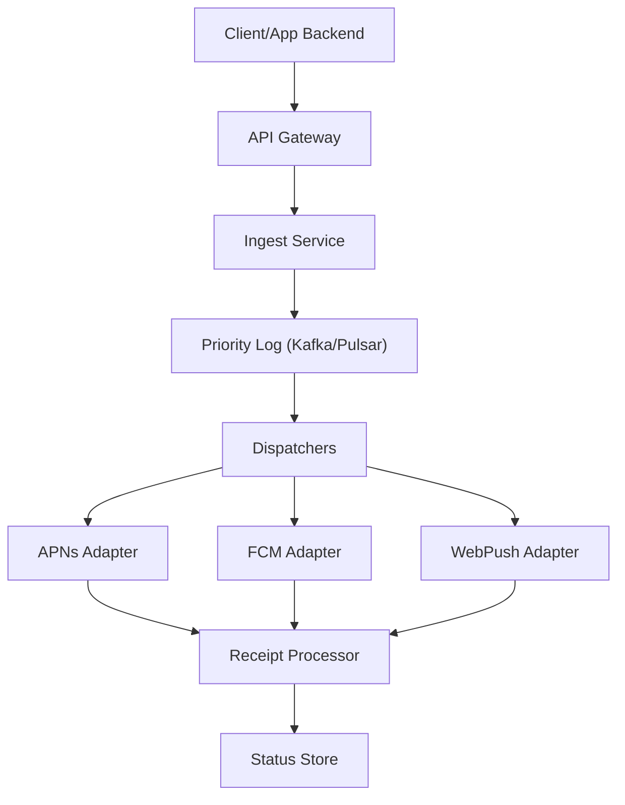
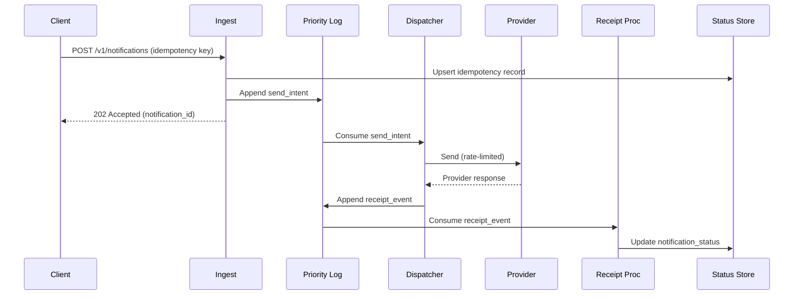

## Overview

A push notification broker sits between application backends and multiple delivery channels (APNs, FCM, Web Push, and potentially SMS/email), providing a single, reliable API to deliver time-sensitive messages to billions of devices. The core challenge is that “send” is not a single operation: it is a distributed workflow involving validation, fanout, prioritization, per-tenant and per-provider rate limits, retries, token hygiene, and asynchronous delivery receipts—at extreme throughput (millions/sec) with strict latency and availability targets.

The key insight is to treat notification delivery as a high-volume streaming system with strong control-plane governance. The data-plane is a set of stateless ingestion services writing to durable prioritized queues, and dispatchers that perform rate-limited, connection-pooled sends to providers. Delivery outcomes are captured as immutable events (receipts) and aggregated into queryable status views. This separation enables horizontal scaling, backpressure, and operational safety (shedding low-priority traffic, isolating noisy tenants, and adapting to provider incidents) without losing correctness guarantees.

## Requirements

### Functional Requirements
- Accept notification requests via API (single + batch) with per-message priority and TTL.
- Resolve recipients by device token(s), user ID, or topic/segment fanout (configurable).
- Enforce rate limits and quotas at tenant/app/user/provider levels with predictable fairness.
- Prioritize critical messages over bulk traffic under load (e.g., “transactional” beats “marketing”).
- Deliver to multiple channels/providers (APNs/FCM/WebPush) with provider-specific features (collapse key, headers).
- Provide delivery receipts (accepted, sent, delivered if available, failed) via query API and/or webhooks/streams.
- Support retries with exponential backoff, dead-lettering, and token invalidation feedback loops.
- Provide auditability: immutable event trail for sends and receipts for debugging and compliance.

### Non-Functional Requirements
- **Scale**:
  - Peak ingest: **5M notifications/sec** (bursty up to 2× for 1–5 minutes)
  - Active tenants: **100K** (top 100 tenants produce 60% of volume)
  - Registered device tokens: **5B**
  - Receipts: **~1 event per attempt** → **5–20M events/sec** peak during retries/incidents
- **Latency** (transactional priority):
  - Ingest ACK: **P99 < 50ms**
  - Enqueue → provider send attempt: **P99 < 200ms** (when not rate-limited)
  - Receipt availability (accepted/sent/failed): **P99 < 2s**
- **Availability**: **99.99%** for ingestion + enqueue; **99.9%** for end-to-end provider attempt (provider-dependent)
- **Consistency**:
  - Strong: idempotency per `(tenant_id, idempotency_key)` for request acceptance
  - Eventual: delivery status aggregation and token invalidation propagation
- **Durability**:
  - No loss for accepted notifications: **RPO ≤ 1 minute** (ideally 0 within a region)
  - Receipts retained for **7–30 days** depending on tier; raw logs archived longer

### Constraints & Assumptions
- Providers (APNs/FCM) are external dependencies with their own throttling, outages, and semantics; “delivered” may be unavailable or delayed.
- Multi-region deployment required; must continue ingesting even if a region fails.
- Tenant isolation is mandatory (noisy neighbor protection); enterprise tenants may demand dedicated capacity.
- Security: tokens are sensitive identifiers; encrypt at rest, strict access controls; GDPR/DSAR deletion for user-linked identifiers.
- Team size assumption: ~8–12 engineers; prefer managed components (e.g., Kafka/Pulsar, Redis, Cassandra/DynamoDB) over bespoke storage.

## High-Level Architecture



This architecture separates a fast, highly-available ingestion path from the slower and more failure-prone provider delivery path. Ingestion performs authentication, validation, and idempotency checks, then appends a compact “send intent” event to a durable, partitioned log with priority lanes. Dispatchers consume intents, apply rate limits and backpressure, and send via provider-specific adapters that maintain long-lived connection pools and handle provider responses.

Receipts are processed as an event stream: provider responses, retries, token invalidations, and final outcomes are appended and then materialized into a queryable status store. This yields reliable auditing (immutable events), scalable reads (materialized views), and operational flexibility (replay and reprocess on bugs or schema changes).

## Component Deep-Dive

### Ingest Service

**Responsibility**: Authenticate tenants, validate payloads, enforce admission control, ensure idempotent acceptance, and publish intents to the priority log.

**Key Design Decisions**:
- Use **idempotency keys** per tenant to prevent duplicates during retries/timeouts; store acceptance result with short TTL (e.g., 24h).
- Do **minimal synchronous work** on the request path; defer fanout/expensive lookups to downstream consumers unless the API contract requires immediate resolution.

**Technology Choice**: Stateless service (Go/Java), fronted by API Gateway (Envoy/NGINX + WAF). Idempotency in Redis/Cassandra/DynamoDB.

**Scaling Strategy**: Scale horizontally behind L7; partition intents by `tenant_id` hash to preserve per-tenant ordering (when needed) and simplify fairness.

---

### Priority Log (Kafka/Pulsar)

**Responsibility**: Durable buffering, ordering within partitions, replayability, and decoupling of ingest from dispatch.

**Key Design Decisions**:
- Model priorities as **separate topics** (e.g., `p0_txn`, `p1_important`, `p2_bulk`) or as a single topic with priority-aware consumers; separate topics simplify SLO isolation.
- Store **immutable events** (send intents + receipt events) to enable reprocessing and forensic debugging.

**Technology Choice**: Kafka (widely adopted, strong ecosystem) or Pulsar (multi-tenant + tiered storage). Use tiered storage for long retention of raw events.

**Scaling Strategy**: Increase partitions (e.g., 10K+ partitions globally) and use consumer groups with autoscaling based on lag and send throughput.

---

### Dispatchers (Delivery Orchestrator)

**Responsibility**: Consume intents, resolve recipients (token lookup/segment expansion), enforce rate limits, schedule retries, and hand off to provider adapters.

**Key Design Decisions**:
- Apply **hierarchical rate limiting**: tenant quota → app quota → provider quota → per-token/user smoothing.
- Use **adaptive backpressure**: when provider errors/latency spike, reduce send concurrency and shed/defer low priority.

**Technology Choice**: Stateless workers (Go/Java/Rust) with Redis for fast counters + a durable store for retry schedules (either delayed queues via Kafka + time buckets or a dedicated scheduler).

**Scaling Strategy**: Shard by `(tenant_id, provider)`; allocate dedicated worker pools for large tenants; autoscale on queue lag and provider send latency.

---

### Provider Adapters (APNs/FCM/WebPush)

**Responsibility**: Translate intents to provider requests, manage connection pools, handle provider-specific errors, and emit receipt events.

**Key Design Decisions**:
- Maintain **long-lived HTTP/2 connections** (APNs/FCM) with bounded concurrency; avoid per-message TLS handshakes.
- Normalize provider responses into a **canonical receipt schema** (accepted, throttled, invalid-token, transient-failure, permanent-failure).

**Technology Choice**: Separate adapter services or libraries embedded in dispatchers; prefer separate services if providers require distinct scaling/credentials isolation.

**Scaling Strategy**: Horizontal scale with connection pools per instance; dynamic concurrency control (token bucket) based on provider feedback.

---

### Receipt Processor + Status Store

**Responsibility**: Ingest receipt events, update materialized status views, drive token invalidation, and deliver webhooks/streams to customers.

**Key Design Decisions**:
- Treat receipts as an **append-only event stream**, with derived status tables for queries.
- Store **hot status** for recent notifications in a fast KV store; archive raw events to cheap storage.

**Technology Choice**:
- Event processing: Kafka Streams/Flink (optional) or consumer workers.
- Status store: Cassandra/DynamoDB for wide scale; ClickHouse for analytics; S3/GCS for raw archives.

**Scaling Strategy**: Partition by `notification_id` or `(tenant_id, day)`; write-optimized storage; separate OLTP status from OLAP analytics.

## Data Model

### Storage Schema

**1) Device tokens (OLTP, wide scale)**
- Table: `device_tokens`
  - `tenant_id` (pk part)
  - `user_id` (pk part, optional)
  - `device_id` (pk part)
  - `provider` (clustering: apns|fcm|webpush)
  - `token` (encrypted)
  - `platform` (ios|android|web)
  - `attributes` (map: locale, app_version, etc.)
  - `created_at`, `last_seen_at`
  - `state` (active|invalid|blocked)
  - `state_reason` (string)
  - `updated_at`

**2) Notification acceptance (idempotency)**
- Table: `idempotency_keys`
  - `tenant_id` (pk part)
  - `idempotency_key` (pk part)
  - `notification_id`
  - `request_hash`
  - `created_at`
  - TTL: 24h–7d

**3) Status materialization (hot path)**
- Table: `notification_status`
  - `tenant_id` (pk part)
  - `notification_id` (pk part)
  - `priority`
  - `state` (accepted|queued|sending|sent|delivered|failed|expired)
  - `attempts`
  - `last_error_code`
  - `last_error_provider`
  - `updated_at`
  - TTL: 7–30d

**4) Receipt events (immutable log / archive)**
- Stream/topic: `receipt_events`
  - `event_id` (ULID)
  - `tenant_id`, `notification_id`, `recipient_id` (token hash or device_id)
  - `provider`
  - `type` (accepted|sent|throttled|invalid_token|transient_fail|permanent_fail|delivered)
  - `provider_message_id`
  - `ts`
  - `metadata` (error codes, latency, etc.)
- Archive: S3/GCS partitioned by `day/tenant_id/provider`

### Data Flow



## API Design

### Create Notification (single)
`POST /v1/notifications`

**Headers**
- `Authorization: Bearer <token>`
- `Idempotency-Key: <uuid>` (required for at-least-once safe retries)

**Request**
```json
{
  "priority": "P0",
  "ttl_seconds": 3600,
  "audience": { "user_ids": ["u123", "u456"] },
  "message": {
    "title": "Payment received",
    "body": "Order #A123 confirmed",
    "data": { "order_id": "A123" }
  },
  "channels": {
    "apns": { "collapse_id": "order-A123" },
    "fcm":  { "collapse_key": "order-A123" }
  },
  "delivery_receipts": {
    "mode": "webhook",
    "webhook_url": "https://example.com/push/receipts"
  }
}
```

**Response (Accepted)**
```json
{
  "notification_id": "01JFP1Q6Z9W2ZK4GQ8J2G9M2QZ",
  "state": "accepted"
}
```

**Error Handling**
- `400` invalid payload/TTL/priority
- `401/403` authz
- `409` idempotency key reused with different payload hash
- `429` tenant quota exceeded (include `Retry-After`)
- `503` admission control triggered (system overload)

**Idempotency**
- Same `(tenant_id, Idempotency-Key)` returns same `notification_id` and state.
- Conflicting payload returns `409` to prevent accidental duplication.

### Batch Create
`POST /v1/notifications:batch` (up to e.g. 5K per request; enforce total bytes)

### Query Status
`GET /v1/notifications/{notification_id}`

**Response**
```json
{
  "notification_id": "01JFP1Q6Z9W2ZK4GQ8J2G9M2QZ",
  "state": "sending",
  "attempts": 1,
  "last_updated_at": "2025-12-17T10:12:05Z"
}
```

### Device Token Registration
`PUT /v1/users/{user_id}/devices/{device_id}/tokens`

Handles token rotation and platform changes; response includes current token state.

### Receipts Delivery (Webhook)
- Signed requests (HMAC) with replay protection.
- Retries with exponential backoff; customer can also consume from a tenant-scoped Kafka topic or SSE stream for lower latency.

## Scaling & Performance

### Bottleneck Analysis
- **Provider throttling / outages**: external cap; mitigation via adaptive rate limiting, priority shedding, and retry queues.
- **Hot tenants**: a few tenants dominate volume; mitigate via tenant sharding, dedicated partitions, and per-tenant concurrency caps.
- **Token lookups / fanout**: resolving large audiences is expensive; mitigate via precomputed segments, async fanout pipelines, and caching hot token sets.
- **Receipt write amplification**: receipts can exceed sends during retries; mitigate via compact receipt schema, sampling for bulk campaigns, and separating hot status from raw event archives.

### Horizontal Scaling
- **API layer**: stateless; scale by CPU and request rate; use global anycast or geo-DNS to nearest region.
- **Queue/log**: scale partitions and brokers; isolate priority lanes; enforce quotas at produce time.
- **Dispatchers**: autoscale consumers by lag + provider latency; shard by `tenant_id` and `provider`.
- **Storage**: token store and status store partitioned by `tenant_id` (plus user/device) to avoid hotspots; use multi-region replication.

**Partitioning Strategy**
- Primary partition key: `tenant_id` (fairness + isolation)
- Secondary: `provider` to isolate provider behavior
- For very large tenants: “virtual tenants” via `tenant_id + shard_id` assigned by a consistent hash ring.

### Caching Strategy
- **Token cache**: Redis for hot `(tenant_id, user_id)` token sets (TTL 5–30 minutes); invalidate on token update and invalid-token receipts.
- **Rate limit counters**: Redis cluster with short TTL buckets (1s/10s/1m) + local in-process leaky buckets to reduce Redis load.
- **Status cache**: CDN or edge cache for `GET status` if high read volume (TTL 1–5s) since it’s eventually consistent.

Cache invalidation uses event-driven updates (token registration, invalidation receipts) plus TTL as a safety net.

## Trade-offs & Alternatives

### Key Trade-offs Made
- **At-least-once delivery attempts (chosen)** vs exactly-once:
  - Sacrifice: possible duplicate sends in rare retry races.
  - Why: provider APIs and network failures make exactly-once impractical; idempotency + collapse keys reduce impact.
- **Event stream + materialized status (chosen)** vs single mutable database record:
  - Sacrifice: more infrastructure and eventual consistency for reads.
  - Why: replayability, audit, and scaling writes under extreme throughput.
- **Separate priority lanes (chosen)** vs single unified queue:
  - Sacrifice: operational complexity (more topics/consumer pools).
  - Why: predictable SLO isolation and safer overload behavior.

### Alternative Approaches
- **Direct synchronous send from API tier**: simpler, but fails under provider latency/outages and cannot buffer spikes reliably.
- **Single global scheduler with delayed jobs**: easier retries, but becomes a bottleneck and harder to shard fairly at 5M/sec.
- **Per-tenant dedicated queues**: strongest isolation, but operationally expensive for 100K tenants; hybrid works for top N tenants only.

## Failure Modes & Mitigations

### Failure Scenarios
- **Scenario**: Kafka/Pulsar broker outage  
  **Impact**: ingestion cannot enqueue; backlog builds  
  **Detection**: producer error rates, partition under-replication, controller alerts  
  **Mitigation**: multi-AZ quorum, rack-aware replication, fast leader election; ingestion admission control + fallback to secondary region if needed

- **Scenario**: Provider throttling (429/5xx spikes)  
  **Impact**: queue lag, retries amplify load  
  **Detection**: provider error rate, send latency, retry rate, lag per priority  
  **Mitigation**: adaptive concurrency reduction, exponential backoff with jitter, cap retry attempts, shed/defer P2 bulk first, circuit breakers

- **Scenario**: Redis rate-limit cluster failure  
  **Impact**: inability to enforce quotas accurately; risk of overload or unfairness  
  **Detection**: Redis availability/latency, limiter error metrics  
  **Mitigation**: degrade to local leaky-bucket defaults + conservative caps; protect providers with hard concurrency limits

- **Scenario**: Token invalidation storm (mass app reinstall / provider feedback)  
  **Impact**: write hot spots in token store and cache churn  
  **Detection**: invalid-token receipt rate, token update QPS, hotspot partitions  
  **Mitigation**: batch invalidations, write-behind queues, per-tenant throttles for token updates, store token state transitions append-only then compact

- **Scenario**: Region failure  
  **Impact**: lost capacity and potential message loss if not replicated  
  **Detection**: regional health checks, ingest error spikes, queue unavailability  
  **Mitigation**: active-active ingestion (geo-routing), cross-region topic replication, automated failover; ensure idempotency keys replicate (or are region-scoped with deterministic IDs)

### Disaster Recovery
- **RTO**: 15 minutes (regional), 60 minutes (full rebuild)
- **RPO**: ≤ 1 minute for accepted notifications; 0 within-region via replicated log
- **Backup strategy**: nightly full + continuous incremental for token/status stores; raw event logs archived to object storage with lifecycle policies
- **Failover procedures**: automated traffic shift to healthy region; dispatchers can consume from replicated logs; replay receipts to rebuild materialized status

## Operational Considerations

### Monitoring & Alerting
- Ingestion: QPS, P99 latency, 4xx/5xx rates, idempotency conflicts, admission-control drops
- Queue: partition lag by priority, under-replicated partitions, produce/consume throughput
- Dispatch: send attempts/sec, success rate, provider error taxonomy, retry rate, concurrency, per-tenant fairness (share vs quota)
- Providers: connection pool saturation, HTTP/2 stream resets, 429/5xx, response latency
- Receipts/status: end-to-end time to first receipt, status update lag, webhook delivery success

Example alerts:
- P0 lag > 2s for 5 minutes
- Provider 5xx > 2% for 2 minutes (per provider/region)
- Retry amplification ratio > 1.5× for 10 minutes
- Top tenant exceeds quota by >10% (should be impossible; indicates limiter failure)

### Deployment Strategy
- Progressive delivery: canary 1% → 10% → 50% → 100% per region; isolate provider adapter changes first
- Feature flags for new retry logic, rate limiter policies, and schema changes
- Backward-compatible event schemas with versioning; replay tests on shadow consumers
- Rollback: immediate traffic shift + consumer group revert; ability to pause low-priority consumers to stabilize

## References & Further Reading
- Apple Push Notification service (APNs) documentation (HTTP/2, error codes, token invalidation)
- Firebase Cloud Messaging (FCM) HTTP v1 documentation and quota behavior
- “The Log” / streaming architecture concepts (Kafka design patterns)
- Backpressure and adaptive concurrency patterns (Netflix concurrency limits, circuit breakers)
- Multi-tenant fairness: weighted fair queuing and hierarchical token bucket rate limiting